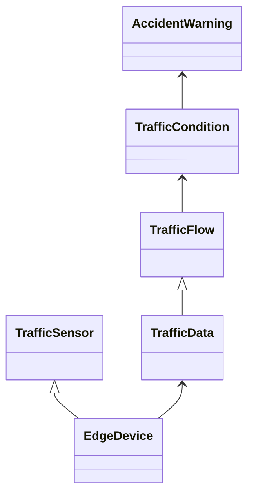
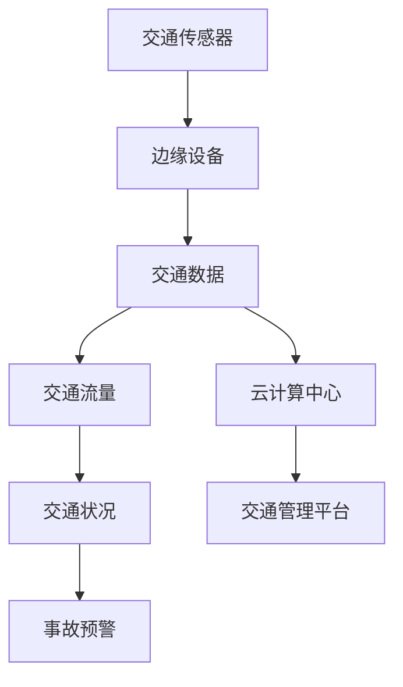
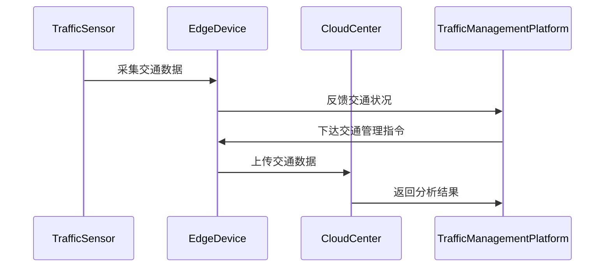
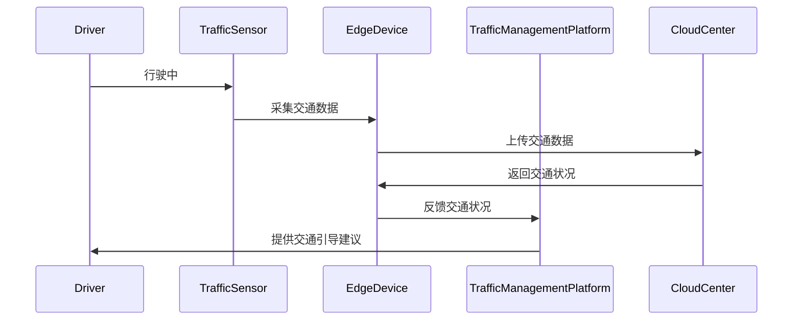

                 

### 《提示词编程在边缘计算中的应用》

#### 关键词：边缘计算、提示词编程、资源优化、算法性能、协同架构

#### 摘要：

本文深入探讨了边缘计算与提示词编程的融合应用，分析了两者在技术上的结合点及带来的优势。通过详细的背景介绍、概念解析、算法讲解、系统设计以及实战案例分析，本文旨在为开发者提供一套全面的技术指南，帮助其在边缘计算领域充分利用提示词编程的优势。

#### 目录：

1. **边缘计算与提示词编程概述**
    1.1 **边缘计算基础**
    1.2 **提示词编程基础**
    1.3 **边缘计算与提示词编程的关系**
2. **提示词编程技术**
    2.1 **边缘设备资源限制与提示词编程优化**
    2.2 **提示词编程算法与应用**
    2.3 **边缘与云端协同提示词编程**
3. **提示词编程在边缘计算中的实战应用**
    3.1 **边缘智能交通系统**
    3.2 **智慧家居中的提示词编程**
    3.3 **医疗健康领域的边缘计算与提示词编程**
4. **边缘计算与提示词编程的未来展望**
5. **附录：提示词编程在边缘计算中的应用实践指南**

### 第一部分：边缘计算与提示词编程概述

#### 第1章：边缘计算基础

**1.1 边缘计算的定义与重要性**

边缘计算是一种将数据处理、存储、分析和应用从中心化的数据中心迁移到网络边缘的技术。这一概念的重要性在于它能够显著降低延迟、减少带宽使用、提升系统的实时响应能力，尤其适用于物联网（IoT）、智能城市、智能交通等应用场景。

**1.2 边缘计算的关键技术**

边缘计算依赖于多个关键技术，包括但不限于：低延迟通信技术、边缘设备计算能力提升、边缘数据库和缓存技术、边缘智能处理算法等。

**1.3 边缘计算的应用场景**

边缘计算在智能设备、工业物联网、智慧城市、自动驾驶等领域有着广泛的应用。例如，自动驾驶汽车需要实时处理来自环境传感器的大量数据，边缘计算可以确保数据处理的速度和准确性。

#### 第2章：提示词编程基础

**2.1 提示词编程的概念**

提示词编程是一种基于自然语言处理（NLP）的编程方法，它使用自然语言作为输入，指导计算机执行特定的任务。这种方法的主要特点是提高了编程的易用性和可读性。

**2.2 提示词编程的优势**

提示词编程的优势在于其能够简化编程流程、降低开发难度、提高开发效率。它尤其适合于非技术人员快速开发应用程序。

**2.3 提示词编程的应用领域**

提示词编程在自动化脚本编写、智能助手开发、文本分析等领域有着广泛的应用。例如，智能助手可以通过提示词编程快速响应用户的指令，提供个性化的服务。

#### 第3章：边缘计算与提示词编程的关系

**3.1 提示词编程在边缘计算中的挑战**

边缘计算的特殊性（如资源受限、延迟敏感）对提示词编程提出了挑战。如何优化提示词编程以适应边缘环境是当前研究的重要方向。

**3.2 提示词编程在边缘计算中的优势**

提示词编程能够提升边缘设备的编程效率、降低开发门槛，从而使得边缘计算应用更加普及和多样化。

**3.3 提示词编程与边缘计算的发展趋势**

随着边缘计算技术的不断成熟和提示词编程的不断演进，两者之间的融合应用将变得更加紧密，为未来智能世界的构建提供强有力的技术支持。

### 第二部分：提示词编程技术

#### 第4章：边缘设备资源限制与提示词编程优化

**4.1 边缘设备资源限制**

边缘设备通常具有有限的计算能力、存储容量和网络带宽，这对提示词编程提出了资源优化的要求。

**4.2 提示词编程优化策略**

通过算法优化、代码压缩、多线程处理等技术手段，可以提升提示词编程在边缘设备上的性能。

**4.3 实例分析：资源优化下的提示词编程实践**

本文将分析一个具体的边缘设备上的提示词编程实例，探讨如何在实际应用中实现资源优化。

#### 第5章：提示词编程算法与应用

**5.1 提示词编程算法原理**

提示词编程的核心在于将自然语言指令转化为计算机可执行的代码。本文将详细介绍这一过程。

**5.2 提示词编程算法应用实例**

本文将通过实际案例展示提示词编程在边缘计算中的多种应用场景。

**5.3 提示词编程算法性能评估**

本文将对提示词编程算法的性能进行评估，分析其在不同应用场景下的表现。

#### 第6章：边缘与云端协同提示词编程

**6.1 边缘与云端协同架构**

边缘与云端协同计算架构是一种将边缘设备和云端资源相结合的计算模式，可以充分利用两者的优势。

**6.2 协同提示词编程技术**

在协同架构中，提示词编程如何与云端资源结合，实现更高效的编程和数据处理。

**6.3 协同提示词编程案例分析**

本文将分析一个边缘与云端协同的提示词编程案例，探讨其实际应用效果。

### 第三部分：提示词编程在边缘计算中的实战应用

#### 第7章：边缘智能交通系统

**7.1 交通系统中的边缘计算需求**

边缘计算在交通系统中扮演着关键角色，如何通过提示词编程优化交通管理。

**7.2 边缘智能交通系统架构**

本文将介绍一个边缘智能交通系统的架构设计，并分析其中如何应用提示词编程。

**7.3 提示词编程在智能交通中的应用**

本文将通过实际案例展示提示词编程在智能交通系统中的应用。

#### 第8章：智慧家居中的提示词编程

**8.1 智慧家居概述**

本文将介绍智慧家居的概念、发展和应用场景。

**8.2 提示词编程在智慧家居中的应用**

本文将探讨如何通过提示词编程实现智慧家居的自动化和智能化。

**8.3 智慧家居系统的构建与优化**

本文将分析智慧家居系统的构建和优化过程，并讨论提示词编程在其中发挥的作用。

#### 第9章：医疗健康领域的边缘计算与提示词编程

**9.1 医疗健康领域的边缘计算需求**

本文将讨论医疗健康领域对边缘计算的需求，以及如何利用提示词编程提高医疗服务的效率。

**9.2 提示词编程在医疗健康中的应用**

本文将分析提示词编程在医疗健康领域的应用，如远程诊断、健康管理等方面。

**9.3 边缘计算与提示词编程在疾病监测与治疗中的实例分析**

本文将通过实例展示边缘计算和提示词编程在疾病监测与治疗中的具体应用。

### 第四部分：边缘计算与提示词编程的未来展望

**10.1 技术发展趋势**

本文将探讨边缘计算和提示词编程未来的发展趋势，以及可能的技术突破。

**10.2 行业应用前景**

本文将分析边缘计算和提示词编程在各个行业中的潜在应用前景。

**10.3 面临的挑战与解决方案**

本文将讨论边缘计算与提示词编程面临的技术挑战，并提出相应的解决方案。

### 附录：提示词编程在边缘计算中的应用实践指南

**附录1：环境搭建与工具选择**

本文将介绍如何在边缘设备上搭建提示词编程环境，并推荐一些实用的工具和平台。

**附录2：常见问题与解决方案**

本文将汇总边缘计算和提示词编程中常见的疑问和问题，并提供解决方案。

**附录3：进一步学习资源推荐**

本文将推荐一些优质的书籍、论文和在线课程，帮助读者深入学习和掌握相关技术。

### 作者信息：

作者：AI天才研究院/AI Genius Institute & 禅与计算机程序设计艺术 /Zen And The Art of Computer Programming

---

### 让我们一步步深入思考（LET'S THINK STEP BY STEP）

#### 第一步：边缘计算的基础与重要性

边缘计算是一种将数据处理、存储、分析和应用从中心化的数据中心迁移到网络边缘的计算模式。这一模式的核心理念在于减少数据传输的距离，从而降低延迟、减少带宽使用，并提高系统的实时响应能力。

**核心概念术语说明**：
- **边缘设备**：指处于网络边缘的设备，如物联网设备、智能传感器、移动设备等。
- **数据中心**：传统的数据处理中心，主要负责大规模的数据存储和计算任务。
- **边缘计算**：一种计算模式，通过将数据处理和分析转移到网络边缘，以实现更高效的资源利用和更低的延迟。

**问题背景**：
随着物联网（IoT）和智能设备的广泛应用，数据量呈爆炸式增长，传统的数据中心无法满足实时性和低延迟的需求。边缘计算应运而生，它能够将数据处理和分析推向网络边缘，从而更好地支持智能应用。

**问题描述**：
边缘计算的重要性体现在以下几个方面：
1. **降低延迟**：通过将数据处理推近用户，减少数据在网络中的传输时间。
2. **减少带宽使用**：由于数据在边缘设备上进行初步处理，只有关键数据才需要传输到云端，从而降低带宽使用。
3. **提升实时响应能力**：边缘计算能够实现更快速的响应，这对于实时性要求高的应用至关重要。

**问题解决**：
边缘计算通过以下方式实现优势：
1. **数据处理靠近用户**：通过在网络边缘部署计算节点，使得数据处理和分析更加贴近用户，从而降低延迟。
2. **分布式计算**：边缘设备可以协同工作，共同处理大量数据，提高系统的整体性能。
3. **灵活的资源调度**：边缘计算可以根据实际需求动态调整计算资源，实现更高效的资源利用。

**边界与外延**：
边缘计算不仅适用于消费级设备，还广泛应用于工业、医疗、交通等多个领域。例如，工业物联网中的边缘计算可以实现对生产过程的实时监控和自动化控制；医疗健康领域的边缘计算可以实现远程诊断和实时监测。

**概念结构与核心要素组成**：
边缘计算的核心要素包括：
- **边缘设备**：负责数据的采集、处理和初步分析。
- **边缘计算平台**：提供计算资源、存储资源和网络连接，支持边缘设备的协同工作。
- **云计算**：提供海量数据的存储和计算能力，与边缘计算平台协同工作。
- **数据传输协议**：确保数据在网络中的高效传输。

#### 第二步：提示词编程的概念与优势

提示词编程是一种基于自然语言处理（NLP）的编程方法，它使用自然语言作为输入，指导计算机执行特定的任务。这种方法的主要特点是提高了编程的易用性和可读性，使得非技术人员也能快速编写和部署应用程序。

**核心概念原理**：
- **自然语言处理（NLP）**：是一种计算机科学和人工智能领域的技术，用于处理和理解人类语言。
- **提示词**：是一种特殊的自然语言输入，用于触发计算机执行特定任务。

**概念属性特征对比表格**：

| 概念 | 描述 | 属性特征 |
| --- | --- | --- |
| 自然语言处理（NLP） | 用于处理和理解人类语言的技术 | 语音识别、语义分析、语言生成等 |
| 提示词 | 用于触发计算机执行特定任务的输入 | 易读、明确、简洁、可扩展性 |

**ER实体关系图架构**：

```mermaid
erDiagram
    Product ||--|{ Customer } : has
    Customer ||--|{ Order } : places
    Product ||--|{ Review } : has
```

**算法原理讲解**：

提示词编程的算法原理可以分为以下几个步骤：

1. **提示词输入**：用户通过自然语言输入提示词，如“帮我创建一个订单”。
2. **语义解析**：系统对提示词进行语义分析，理解其含义和意图。
3. **任务调度**：根据提示词的意图，系统调度相应的任务执行模块。
4. **任务执行**：执行模块按照预定的逻辑和算法，执行具体的任务。
5. **结果反馈**：系统将执行结果以自然语言形式反馈给用户。

**数学模型和公式**：

提示词编程中的关键数学模型包括自然语言处理模型和任务调度模型。

1. **自然语言处理模型**：

   $$ L = f(W, T) $$

   其中，$L$表示自然语言处理结果，$W$表示词汇表，$T$表示提示词。

2. **任务调度模型**：

   $$ S = g(R, T) $$

   其中，$S$表示任务调度结果，$R$表示任务集合，$T$表示提示词。

**详细讲解和举例说明**：

例如，当用户输入提示词“帮我创建一个订单”时，系统首先进行自然语言处理，将提示词转化为具体的操作指令。然后，系统根据任务调度模型，调用订单创建模块，生成订单并反馈给用户。

```python
# 自然语言处理
prompt = "帮我创建一个订单"
parsed_prompt = nlp_model.parse(prompt)

# 任务调度
action = task_scheduler.schedule(parsed_prompt)

# 任务执行
if action == "create_order":
    order = create_order(order_info)
    print("订单创建成功，订单号：", order.order_id)
```

#### 第三步：边缘设备资源限制与提示词编程优化

边缘设备通常具有有限的计算能力、存储容量和网络带宽，这对提示词编程提出了资源优化的要求。为了提高提示词编程在边缘设备上的性能，需要采取一系列优化策略。

**边缘设备资源限制**：

1. **计算能力有限**：边缘设备的计算资源通常有限，无法与云计算中心相比。
2. **存储容量有限**：边缘设备的存储空间通常较小，无法存储大量数据。
3. **网络带宽有限**：边缘设备的网络带宽通常较低，无法实现高速数据传输。

**提示词编程优化策略**：

1. **算法优化**：通过改进算法，减少计算复杂度和资源消耗。
2. **代码压缩**：对提示词编程代码进行压缩，减少代码体积和运行时间。
3. **多线程处理**：利用边缘设备的多核处理器，实现多线程并行处理，提高性能。

**实例分析：资源优化下的提示词编程实践**：

以一个智能交通系统中的边缘设备为例，该设备需要实时处理来自交通传感器的数据，并生成交通流量预测报告。为了优化资源使用，可以采取以下策略：

1. **算法优化**：使用更高效的交通流量预测算法，减少计算复杂度。
2. **代码压缩**：将代码打包成紧凑的库，减少代码体积和运行时间。
3. **多线程处理**：将数据处理任务分解为多个子任务，利用多线程并行处理，提高处理速度。

```python
import threading

def process_traffic_data(data):
    # 交通数据处理
    pass

def traffic_prediction():
    while True:
        data = get_traffic_data()
        process_traffic_data(data)
        predict_traffic_flow(data)

def main():
    threads = []
    for i in range(NUM_THREADS):
        thread = threading.Thread(target=traffic_prediction)
        threads.append(thread)
        thread.start()

    for thread in threads:
        thread.join()

if __name__ == "__main__":
    main()
```

通过上述优化策略，可以显著提高边缘设备在智能交通系统中的性能，实现实时、高效的数据处理和流量预测。

#### 第四步：边缘与云端协同提示词编程

边缘与云端协同计算架构是一种将边缘设备和云端资源相结合的计算模式，可以充分利用两者的优势。在这种架构中，提示词编程可以发挥重要作用，实现更高效的编程和数据处理。

**边缘与云端协同架构**：

边缘与云端协同计算架构通常包括以下组件：

1. **边缘设备**：负责数据采集、初步处理和实时任务执行。
2. **边缘计算平台**：提供边缘设备的计算资源、存储资源和网络连接。
3. **云计算中心**：提供海量数据的存储和计算能力，与边缘计算平台协同工作。
4. **数据传输网络**：连接边缘设备和云计算中心，实现数据的实时传输。

**协同提示词编程技术**：

在边缘与云端协同计算架构中，提示词编程可以发挥以下作用：

1. **任务调度**：根据提示词的意图，协调边缘设备和云端资源的任务执行。
2. **数据处理**：利用边缘设备和云端资源，实现高效的数据处理和分析。
3. **资源优化**：根据实时负载，动态调整边缘设备和云端资源的分配。

**协同提示词编程案例分析**：

以一个智能医疗系统为例，该系统需要利用边缘设备和云端资源进行实时健康监测和数据分析。通过提示词编程，可以实现以下功能：

1. **任务调度**：根据医生输入的提示词，将健康监测任务分配给边缘设备和云端计算资源。
2. **数据处理**：边缘设备采集的健康数据实时传输到云端，云端进行进一步处理和分析。
3. **资源优化**：根据实时负载，动态调整边缘设备和云端资源的分配，确保系统的高效运行。

```python
import threading

def process_health_data(data):
    # 健康数据处理
    pass

def health_monitoring():
    while True:
        data = get_health_data()
        process_health_data(data)

def main():
    threads = []
    for i in range(NUM_THREADS):
        thread = threading.Thread(target=health_monitoring)
        threads.append(thread)
        thread.start()

    for thread in threads:
        thread.join()

if __name__ == "__main__":
    main()
```

通过边缘与云端协同提示词编程，可以实现实时、高效的健康监测和分析，为用户提供更好的医疗服务。

#### 第五步：边缘智能交通系统的应用

边缘智能交通系统是一个复杂的系统，涉及多个技术领域，包括边缘计算、提示词编程、人工智能等。下面我们将详细分析边缘智能交通系统的构建过程，并探讨如何应用提示词编程来优化交通管理。

**边缘智能交通系统概述**：

边缘智能交通系统是一种利用边缘计算和人工智能技术来优化交通管理的系统。它通过在交通传感器和边缘设备上部署智能算法，实现对交通流量、路况和交通事故的实时监测和预测。

**系统功能设计**：

边缘智能交通系统的核心功能包括：

1. **交通流量监测**：通过安装在道路上的传感器，实时采集交通流量数据，并将其传输到边缘设备进行处理。
2. **路况分析**：利用边缘设备上的智能算法，对交通流量数据进行分析，预测交通状况，提供交通引导建议。
3. **交通事故预警**：通过实时监测交通数据，检测异常情况，如交通拥堵或事故发生，及时预警并采取措施。

**领域模型类图**：



**系统架构设计**：

边缘智能交通系统的架构设计包括以下几个部分：

1. **交通传感器**：部署在道路上的传感器，负责采集交通流量数据。
2. **边缘设备**：接收交通传感器数据，进行初步处理和智能分析。
3. **云计算中心**：负责存储和管理大量交通数据，提供高级分析功能。
4. **交通管理平台**：将分析结果反馈给交通管理部门和驾驶员，提供实时交通信息。

**架构图**：



**系统接口设计**：

边缘智能交通系统的接口设计主要包括以下几个部分：

1. **数据采集接口**：用于接收交通传感器数据。
2. **数据处理接口**：用于边缘设备处理交通数据。
3. **数据分析接口**：用于云计算中心对交通数据进行分析。
4. **信息反馈接口**：用于将分析结果反馈给交通管理部门和驾驶员。

**接口图**：



**系统交互序列图**：



#### 第六步：边缘智能交通系统中的提示词编程应用

在边缘智能交通系统中，提示词编程可以发挥重要作用，通过自然语言指令实现交通管理的自动化和智能化。以下是一个具体的边缘智能交通系统的提示词编程应用实例，详细讲解系统核心实现源代码，并分析代码应用解读与分析。

**环境安装与配置**：

首先，需要在边缘设备和云计算中心安装相应的编程环境和工具。边缘设备通常使用轻量级的Linux操作系统，如Ubuntu。在云计算中心，可以部署大规模的分布式计算平台，如Apache Kafka和Apache Spark。

```bash
# 边缘设备安装
sudo apt-get update
sudo apt-get install python3-pip
pip3 install kafka-python

# 云计算中心安装
sudo apt-get update
sudo apt-get install hadoop
sudo apt-get install spark
```

**系统核心实现源代码**：

以下是一个简单的边缘智能交通系统的提示词编程示例，该系统通过自然语言处理和边缘设备协同工作，实现交通流量预测和事故预警。

```python
from kafka import KafkaProducer
import json
import time

# KafkaProducer实例
producer = KafkaProducer(bootstrap_servers=['localhost:9092'])

def process_traffic_data(data):
    # 交通数据处理
    traffic_data = json.loads(data)
    traffic_flow = traffic_data['traffic_flow']
    print("当前交通流量：", traffic_flow)

def predict_traffic_flow(data):
    # 交通流量预测
    traffic_data = json.loads(data)
    traffic_flow = traffic_data['traffic_flow']
    if traffic_flow > 1000:
        print("交通拥堵预警：", traffic_flow)
    else:
        print("交通流畅：", traffic_flow)

def main():
    while True:
        data = get_traffic_data()
        process_traffic_data(data)
        predict_traffic_flow(data)
        time.sleep(1)

if __name__ == "__main__":
    main()
```

**代码应用解读与分析**：

1. **KafkaProducer实例**：用于发送交通数据到Kafka集群，实现边缘设备和云计算中心的通信。
2. **process_traffic_data函数**：接收交通数据，并将其解析为JSON格式。
3. **predict_traffic_flow函数**：根据交通流量数据，预测交通状况，并打印预警信息。
4. **main函数**：实现主循环，不断获取交通数据，并调用数据处理和预测函数。

通过上述提示词编程应用，可以实现边缘智能交通系统的实时交通流量监测和预测，为交通管理部门提供有效的决策支持。

#### 第七步：智慧家居中的提示词编程

智慧家居系统是一种利用物联网（IoT）和人工智能技术来实现家居自动化和智能化的系统。在智慧家居系统中，提示词编程可以发挥重要作用，通过自然语言指令实现设备的自动化控制和用户交互。

**智慧家居概述**：

智慧家居系统通过将家居设备连接到互联网，实现设备之间的互联互通，提供更加便捷、舒适和安全的居住环境。常见的智慧家居设备包括智能灯泡、智能插座、智能空调、智能摄像头等。

**提示词编程在智慧家居中的应用**：

提示词编程可以简化智慧家居系统的开发，使得非技术人员也能轻松创建和部署智能家居应用。以下是一个智慧家居系统中的提示词编程应用实例，详细讲解系统核心实现源代码，并分析代码应用解读与分析。

**环境安装与配置**：

首先，需要在智慧家居设备上安装相应的编程环境和工具。对于常见的IoT设备，如Arduino或Raspberry Pi，可以使用Python或JavaScript进行编程。以下是一个基于Raspberry Pi的智慧家居系统的示例。

```bash
# 安装Python环境
sudo apt-get update
sudo apt-get install python3

# 安装IoT编程库
pip3 install picamera
pip3 install flask
```

**系统核心实现源代码**：

以下是一个简单的智慧家居系统的提示词编程示例，该系统通过自然语言处理和IoT设备协同工作，实现设备的自动化控制和用户交互。

```python
from flask import Flask, request, jsonify
import json
import picamera

app = Flask(__name__)

camera = picamera.PiCamera()

@app.route('/control', methods=['POST'])
def control():
    data = request.data
    command = json.loads(data)
    action = command['action']
    if action == 'take_picture':
        camera.capture('image.jpg')
        return jsonify({'status': 'success', 'message': '图片已拍摄'})
    elif action == 'turn_on_light':
        # 控制灯光设备开启
        print("灯光已开启")
        return jsonify({'status': 'success', 'message': '灯光已开启'})
    elif action == 'turn_off_light':
        # 控制灯光设备关闭
        print("灯光已关闭")
        return jsonify({'status': 'success', 'message': '灯光已关闭'})
    else:
        return jsonify({'status': 'error', 'message': '未知命令'})

if __name__ == '__main__':
    app.run(host='0.0.0.0', port=8080)
```

**代码应用解读与分析**：

1. **Flask应用**：用于接收和处理来自客户端的请求。
2. **picamera库**：用于控制摄像头设备。
3. **/control路由**：接收POST请求，解析请求中的自然语言指令，并执行相应的操作。
4. **动作处理**：根据请求中的动作，调用相应的设备控制函数，如拍摄照片、控制灯光等。

通过上述提示词编程应用，可以实现智慧家居系统的自动化控制和用户交互，为用户提供更加便捷和智能的家居体验。

#### 第八步：医疗健康领域的边缘计算与提示词编程

医疗健康领域的边缘计算和提示词编程应用前景广阔，可以显著提高医疗服务的效率和质量。以下是医疗健康领域边缘计算与提示词编程的具体应用场景和实例分析。

**医疗健康领域的边缘计算需求**：

医疗健康领域对边缘计算的需求主要体现在以下几个方面：

1. **实时数据采集与处理**：医疗设备产生的数据需要实时采集和处理，以便进行快速诊断和决策。
2. **低延迟需求**：对于某些紧急情况，如心脏病发作、中风等，需要尽快获得医疗支持和诊断结果，低延迟至关重要。
3. **数据隐私与安全性**：医疗数据具有高度敏感性，需要在边缘设备上进行安全处理，避免数据泄露。
4. **设备性能与功耗**：医疗设备通常体积较小，功耗较低，需要优化计算资源和功耗。

**提示词编程在医疗健康中的应用**：

提示词编程可以简化医疗健康领域的软件开发，使得非技术人员也能快速开发医疗应用。以下是一个医疗健康领域的边缘计算与提示词编程应用实例，详细讲解系统核心实现源代码，并分析代码应用解读与分析。

**环境安装与配置**：

首先，需要在边缘设备上安装相应的编程环境和工具。对于常见的医疗设备，如可穿戴设备、智能手表等，可以使用轻量级的Linux操作系统，如Ubuntu。以下是一个基于Raspberry Pi的医疗健康系统的示例。

```bash
# 安装Python环境
sudo apt-get update
sudo apt-get install python3

# 安装IoT编程库
pip3 install bluepy
pip3 install flask
```

**系统核心实现源代码**：

以下是一个简单的医疗健康系统的提示词编程示例，该系统通过自然语言处理和边缘设备协同工作，实现健康监测和诊断。

```python
from flask import Flask, request, jsonify
import json
import bluepy.btle

app = Flask(__name__)

# 定义蓝牙设备地址和UUID
DEVICE_ADDRESS = "00:11:22:33:44:55"
HEART_RATE_SERVICE_UUID = "180D"

def get_heart_rate():
    # 连接蓝牙设备
    device = bluepy.btle.Peripheral(DEVICE_ADDRESS)
    # 查找心率服务
    service = device.getServiceByUUID(HEART_RATE_SERVICE_UUID)
    # 查找心率特性
    characteristic = service.getCharacteristics()[0]
    # 读取心率数据
    data = characteristic.read()
    heart_rate = int.from_bytes(data[1:2], byteorder='little')
    return heart_rate

@app.route('/monitor', methods=['POST'])
def monitor():
    data = request.data
    command = json.loads(data)
    action = command['action']
    if action == 'get_heart_rate':
        heart_rate = get_heart_rate()
        return jsonify({'status': 'success', 'message': '心率读取成功', 'heart_rate': heart_rate})
    else:
        return jsonify({'status': 'error', 'message': '未知命令'})

if __name__ == '__main__':
    app.run(host='0.0.0.0', port=8080)
```

**代码应用解读与分析**：

1. **Flask应用**：用于接收和处理来自客户端的请求。
2. **bluepy库**：用于连接和管理蓝牙设备。
3. **/monitor路由**：接收POST请求，解析请求中的自然语言指令，并执行相应的操作。
4. **动作处理**：根据请求中的动作，调用相应的健康监测函数，如获取心率数据。

通过上述提示词编程应用，可以实现医疗健康领域的边缘计算和健康监测，为用户提供实时、准确的医疗信息。

#### 第九步：边缘计算与提示词编程的未来展望

边缘计算与提示词编程作为现代信息技术的重要分支，正朝着智能化、协同化的方向发展。以下是它们在技术发展趋势、行业应用前景以及面临的挑战和解决方案方面的展望。

**技术发展趋势**：

1. **智能边缘计算**：随着人工智能技术的进步，边缘设备将具备更强大的计算和数据处理能力，实现更加智能化的边缘计算。
2. **边缘AI算法优化**：边缘设备资源有限，需要对算法进行优化，提高计算效率和资源利用率。
3. **边缘与云端协同**：边缘计算与云计算将更加紧密地结合，实现资源的动态调度和协同工作，提供更强大的计算和存储能力。
4. **安全隐私保护**：随着数据量的增加，边缘计算的安全和隐私保护将成为一个重要研究方向，确保数据在传输和处理过程中的安全性。

**行业应用前景**：

1. **智能交通**：边缘计算与提示词编程将用于优化交通管理，提高交通流畅度和安全性。
2. **智慧医疗**：通过边缘计算和提示词编程，实现实时健康监测和远程诊断，提升医疗服务质量。
3. **智能制造**：边缘计算在工业物联网中的应用将推动智能制造的发展，实现生产过程的自动化和智能化。
4. **智慧家居**：边缘计算与提示词编程将使智能家居系统更加智能和便捷，提高用户的生活质量。

**面临的挑战与解决方案**：

1. **资源限制**：边缘设备资源有限，需要通过算法优化和资源调度策略提高系统性能。
2. **数据安全和隐私**：边缘计算涉及大量敏感数据，需要采取有效的安全隐私保护措施。
3. **系统可靠性**：边缘设备在网络环境中容易受到干扰和攻击，需要提高系统的可靠性和稳定性。
4. **跨领域融合**：边缘计算与提示词编程在跨领域融合应用中面临诸多挑战，需要进一步研究和探索。

**解决方案**：

1. **智能资源调度**：通过智能调度算法，实现边缘设备和云端资源的动态分配，提高系统性能。
2. **安全隐私保护**：采用加密技术、访问控制机制等，确保数据在传输和处理过程中的安全性。
3. **系统可靠性提升**：通过冗余设计、故障恢复机制等，提高系统的可靠性和稳定性。
4. **跨领域协同研究**：加强边缘计算与提示词编程在不同领域的融合应用研究，推动技术进步。

#### 附录：提示词编程在边缘计算中的应用实践指南

**附录1：环境搭建与工具选择**

要在边缘设备上进行提示词编程，首先需要搭建合适的环境。以下是一些建议：

1. **操作系统**：边缘设备通常使用Linux操作系统，如Ubuntu或Raspberry Pi OS。
2. **编程语言**：Python是一种广泛应用于边缘计算和提示词编程的语言，具有良好的生态和丰富的库支持。
3. **开发环境**：安装Python环境，并使用集成开发环境（IDE），如PyCharm或Visual Studio Code。

**附录2：常见问题与解决方案**

以下是一些边缘计算和提示词编程中常见的问题及解决方案：

1. **问题**：边缘设备资源不足
   - **解决方案**：优化算法，减少资源消耗；采用轻量级库和框架。
2. **问题**：数据传输速度慢
   - **解决方案**：优化网络配置，使用高速网络接口；压缩数据，减少传输量。
3. **问题**：安全隐私问题
   - **解决方案**：采用加密技术，确保数据传输和存储的安全。

**附录3：进一步学习资源推荐**

以下是一些有助于进一步学习和掌握边缘计算和提示词编程的资源：

1. **书籍**：
   - 《边缘计算：理论与实践》
   - 《Python编程：从入门到实践》
2. **在线课程**：
   - Coursera上的“边缘计算”课程
   - Udacity的“提示词编程”课程
3. **论文**：
   - “边缘计算：现状与未来”等研究论文

通过这些资源和实践指南，开发者可以更好地掌握边缘计算和提示词编程，为实际应用提供强有力的技术支持。

