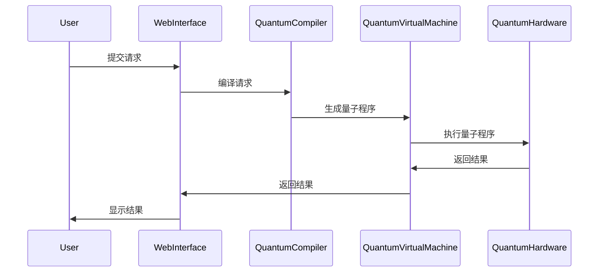

                 

### 引入与背景介绍

#### 量子计算：奇妙的量子世界

量子计算，作为一门前沿科技，其理论基础源于量子力学，而量子力学是20世纪初由尼尔斯·波尔、沃纳·海森堡和沃尔夫冈·泡利等科学家共同建立的。与传统计算不同，量子计算利用量子位（qubits）作为信息载体，这些量子位可以同时处于多个状态，从而使得量子计算机具有超越经典计算机的强大计算能力。

量子计算的核心在于量子比特的操作，即量子门。量子门是一种线性操作，可以对量子比特的状态进行旋转和转换。量子态的叠加与纠缠是量子计算的另一大特点。量子态的叠加意味着一个量子比特可以同时处于多个状态，而量子纠缠则描述了两个或多个量子比特之间的非局域性关联。

#### 提示词编程：引领智能编程新时代

提示词编程（Prompt Programming），作为一种创新的编程模式，其核心在于利用预先设计好的提示词（prompts）来引导程序生成代码或执行特定任务。这种编程模式源于自然语言处理（NLP）领域，通过机器学习模型对自然语言进行理解和生成，从而实现自动化编程。

提示词编程的优势在于其高效性和灵活性。通过提示词，程序员可以更加直观地表达编程意图，从而提高开发效率和代码质量。此外，提示词编程还为非专业程序员和普通用户提供了便捷的编程入口，使得编程变得更加普及和易于上手。

#### 量子计算与提示词编程的结合前景

将量子计算与提示词编程相结合，无疑为计算机科学和人工智能领域带来了新的机遇。量子计算的高并行性和强大计算能力，与提示词编程的高效和灵活性相结合，有望推动计算能力的进一步提升。

首先，提示词编程可以帮助量子计算机更高效地执行复杂计算任务。通过自然语言提示，用户可以轻松地描述复杂的量子计算问题，量子计算机则可以根据提示词自动生成相应的量子算法和程序。

其次，提示词编程还可以在量子编程教育中发挥作用。通过提供直观的提示词界面，即使是初学者也可以更容易地理解和掌握量子编程的基本概念和方法。

最后，提示词编程为量子编程领域的研究提供了新的工具和方法。研究人员可以通过提示词编程快速地验证和测试新的量子算法，从而加速量子计算技术的发展。

### 量子计算与提示词编程：结合的可能性和未来方向

量子计算与提示词编程的结合具有巨大的潜力。一方面，量子计算需要高效的方法来处理复杂的问题，而提示词编程可以提供这样的工具。另一方面，提示词编程可以降低量子编程的门槛，使得更多的人能够参与到量子计算的研究和开发中。

未来，随着量子计算技术的不断成熟和提示词编程模型的不断优化，我们可以预见，量子计算与提示词编程的结合将会带来一系列突破性的进展。这不仅将推动计算机科学和人工智能的发展，也将对整个科技领域产生深远的影响。

### 结论

量子计算与提示词编程的结合，代表着计算领域的一次重大变革。通过深入探索这一结合的可能性，我们可以期待在未来的科技发展中，看到更多的创新和突破。接下来，我们将进一步探讨量子计算和提示词编程的核心概念，以及它们在量子计算中的应用。

## 核心概念与联系

### 量子计算基本原理

量子计算的基础是量子力学的基本原理。与经典计算不同，量子计算利用量子位（qubits）作为信息存储和处理的基本单元。量子比特具有两个独特的特性：叠加和纠缠。

#### 量子比特与经典比特的对比

**经典比特**：
- 只能处于0或1两种状态。
- 存储信息的方式是二进制的，即每位只能是0或1。

**量子比特**：
- 可以同时处于0和1的叠加状态，这意味着一个量子比特可以同时代表0和1。
- 通过量子态的叠加，量子比特能够存储比经典比特更多的信息。

#### 量子态

量子态描述了量子比特的状态。量子态可以用一个复数向量来表示，其中每个元素对应于量子比特处于某种状态的概率幅。例如，一个量子比特的态可以表示为：
\[ \psi = \alpha|0\rangle + \beta|1\rangle \]
其中，\(|0\rangle\) 和 \(|1\rangle\) 分别表示量子比特处于基态和激发态，而 \(\alpha\) 和 \(\beta\) 是概率幅，满足 \(|\alpha|^2 + |\beta|^2 = 1\)。

#### 量子门与量子态

量子门是量子计算中的基本操作，类似于经典计算中的逻辑门。量子门对量子比特的态进行线性变换，从而改变量子态。常见的量子门包括：

- **保罗门（Pauli Gate）**：用于对量子比特执行基本的旋转操作。
- **酉门（Unitary Gate）**：实现量子态的线性变换，保持量子态的归一性。

量子门作用于量子态，可以通过矩阵乘法来描述。例如，一个保罗门 \(X\) 对量子态 \(|\psi\rangle\) 的作用可以表示为：
\[ X|\psi\rangle = \begin{pmatrix} 0 & 1 \\ 1 & 0 \end{pmatrix}|\psi\rangle \]

#### 量子纠缠

量子纠缠是量子比特之间的一种特殊关联。当两个量子比特发生纠缠时，它们的状态将不再独立，即使它们相隔很远。一个著名的例子是爱因斯坦—波多尔斯基—罗森（EPR）佯谬，它展示了量子纠缠的悖论性。

纠缠态可以用一个复合量子态来描述，例如贝尔态（Bell State）：
\[ |\Phi^+\rangle = \frac{1}{\sqrt{2}} (|01\rangle + |10\rangle) \]

在量子计算中，量子纠缠用于提高计算效率和实现量子并行性。

### 提示词编程在量子计算中的应用

提示词编程（Prompt Programming）是一种基于自然语言处理的编程模式，通过输入自然语言提示，让计算机自动生成代码或执行任务。在量子计算中，提示词编程的应用主要体现在以下几个方面：

#### 提示词编程的概念

提示词编程的核心在于使用自然语言提示来引导程序生成或执行任务。例如，一个简单的提示词可能是“计算两个量子比特的纠缠态”，程序则可以根据这个提示词自动生成相应的量子电路和代码。

#### 提示词编程的优势

- **提高编程效率**：通过自然语言提示，程序员可以更快地描述和实现复杂计算任务。
- **降低编程门槛**：提示词编程使得非专业程序员和普通用户也能够参与量子计算的开发。
- **灵活性和适应性**：提示词编程能够根据用户需求动态调整计算任务，提高系统的灵活性。

#### 提示词编程与量子计算的结合

提示词编程与量子计算的结合，主要体现在以下几个方面：

- **自动生成量子算法**：通过提示词，计算机可以自动生成解决特定问题的量子算法。
- **优化量子程序**：提示词编程可以帮助优化现有的量子程序，提高其运行效率和性能。
- **辅助量子编程教育**：提示词编程为量子编程教育提供了一种直观、易理解的教学工具。

### 量子计算与提示词编程的关系图

为了更好地理解量子计算与提示词编程的关系，我们可以使用 Mermaid 绘制一个 ER 图：

```mermaid
erDiagram
  QuantumComputer ||--|{ QuantumAlgorithm } : implements
  QuantumAlgorithm ||--|{ QuantumCircuit } : defines
  QuantumCircuit ||--|{ QuantumGate } : consists_of
  QuantumGate ||--|{ QuantumBit } : operates_on
  PromptProgramming ||--|{ Prompt } : provides
  Prompt |<..| QuantumAlgorithm : guides
```

在这个 ER 图中，我们可以看到量子计算机通过量子算法实现量子计算任务，量子算法定义了量子电路，量子电路由量子门组成，而量子门则作用于量子比特。同时，提示词编程通过提供提示词，指导量子算法的生成和执行。

通过上述核心概念和关系的介绍，我们可以更深入地理解量子计算与提示词编程的结合，以及它们在解决复杂计算任务中的潜力。在接下来的章节中，我们将进一步探讨量子计算中的提示词编程算法，并详细讲解其原理和实现步骤。

## 算法原理讲解

### 量子计算中的提示词编程算法

量子计算中的提示词编程算法是一种利用自然语言提示来指导量子计算机执行复杂计算任务的方法。这种算法的核心在于通过输入特定的自然语言提示，计算机可以自动生成相应的量子程序。下面，我们将详细讨论这一算法的基本概念、工作原理以及实现步骤。

#### 基本概念

**自然语言提示**：这是提示词编程算法的核心输入，用户通过自然语言描述想要解决的问题或计算任务。

**自动生成量子程序**：基于用户提供的自然语言提示，算法能够自动生成相应的量子程序，包括量子电路、量子门和量子态等。

**量子虚拟机**：这是一个虚拟执行环境，用于运行和调试自动生成的量子程序。

#### 工作原理

提示词编程算法的工作原理可以概括为以下几个步骤：

1. **自然语言处理**：首先，算法通过自然语言处理（NLP）技术对输入的提示词进行解析，提取出关键信息和计算任务。
2. **语义理解**：接着，算法根据提取的信息，理解提示词的含义，并将其转换为相应的计算任务描述。
3. **自动生成**：基于语义理解的结果，算法自动生成相应的量子程序，包括量子电路和量子门。
4. **虚拟执行**：最后，量子虚拟机根据生成的量子程序进行虚拟执行，验证算法的正确性和性能。

#### 实现步骤

1. **自然语言处理**：使用自然语言处理（NLP）技术，对输入的提示词进行分词、词性标注、句法分析等处理，提取出关键信息和计算任务。
    ```python
    import spacy

    nlp = spacy.load("en_core_web_sm")
    prompt = "Calculate the quantum state of two entangled qubits."
    doc = nlp(prompt)
    tokens = [token.text for token in doc]
    ```

2. **语义理解**：将提取的信息进行语义理解，识别出具体的计算任务，如“计算两个量子比特的纠缠态”。
    ```python
    def parse_prompt(prompt):
        doc = nlp(prompt)
        tasks = []
        for token in doc:
            if token.pos_ in ["NOUN", "VERB"]:
                tasks.append(token.text)
        return tasks

    tasks = parse_prompt(prompt)
    print(tasks)  # Output: ['Calculate', 'quantum', 'state', 'two', 'entangled', 'qubits']
    ```

3. **自动生成量子程序**：根据语义理解的结果，自动生成相应的量子程序。这通常涉及到量子程序的生成算法，如基于深度学习的生成对抗网络（GAN）。
    ```python
    def generate_quantum_program(tasks):
        # 假设已经训练了一个GAN模型来生成量子程序
        generator = QuantumProgramGenerator()
        quantum_program = generator.generate_program(tasks)
        return quantum_program

    quantum_program = generate_quantum_program(tasks)
    print(quantum_program)
    ```

4. **虚拟执行**：在量子虚拟机中执行生成的量子程序，验证算法的正确性和性能。虚拟执行的结果可以用于进一步优化量子程序。
    ```python
    def virtual_execute(program):
        virtual_machine = QuantumVirtualMachine()
        result = virtual_machine.execute_program(program)
        return result

    result = virtual_execute(quantum_program)
    print(result)
    ```

#### 关键点

- **自然语言处理的质量**：自然语言处理技术的质量直接影响到算法的准确性和可靠性。因此，选择合适的NLP模型和工具至关重要。
- **量子程序的生成算法**：生成量子程序的过程需要强大的算法支持，如深度学习模型和生成对抗网络（GAN）。
- **虚拟执行环境**：虚拟执行环境用于验证量子程序的正确性和性能，是算法优化的重要环节。

通过上述步骤，我们可以实现一个基本的提示词编程算法。在接下来的章节中，我们将进一步探讨量子计算中的数学模型和数学公式，为理解量子计算中的提示词编程提供更深入的数学基础。

## 数学模型和数学公式

在量子计算中，数学模型和数学公式是理解量子计算行为的关键。以下是量子计算中的几个重要数学模型和公式，以及它们的详细讲解和举例说明。

### 量子门数学模型

量子门是量子计算中的基本操作，用于对量子比特的状态进行线性变换。一个量子门可以用一个 \(2^n \times 2^n\) 的酉矩阵（Unitary Matrix）来表示，其中 \(n\) 是量子比特的数量。常见的量子门包括保罗门（Pauli Gates）、酉门（Unitary Gates）和控制性量子门（Controlled Quantum Gates）。

#### 保罗门（Pauli Gates）

保罗门是最基本的量子门，包括X门、Y门和Z门。这些门分别对应于量子比特在X轴、Y轴和Z轴上的旋转。

- **X门**：对量子比特进行旋转，使其在X轴上的角度改变。
  \[ X = \begin{pmatrix} 0 & 1 \\ 1 & 0 \end{pmatrix} \]
- **Y门**：对量子比特进行旋转，使其在Y轴上的角度改变。
  \[ Y = \begin{pmatrix} 0 & -i \\ i & 0 \end{pmatrix} \]
- **Z门**：对量子比特进行旋转，使其在Z轴上的角度改变。
  \[ Z = \begin{pmatrix} 1 & 0 \\ 0 & -1 \end{pmatrix} \]

#### 酉门（Unitary Gates）

酉门是一类非线性的量子门，用于实现量子态的线性变换。一个典型的酉门可以是相位门（Phase Gate）。
- **相位门**：对量子比特的相位进行旋转。
  \[ U_{\phi} = \begin{pmatrix} 1 & 0 \\ 0 & e^{i\phi} \end{pmatrix} \]

#### 控制性量子门（Controlled Quantum Gates）

控制性量子门是量子计算中的一种特殊门，它依赖于控制量子比特的状态。常见的控制性量子门包括控制性Z门（CZ Gate）和控制性X门（CX Gate）。
- **控制性Z门（CZ Gate）**：如果控制量子比特处于基态，目标量子比特的状态会翻转。
  \[ CZ = \begin{pmatrix} 1 & 0 & 0 & 0 \\ 0 & 1 & 0 & 0 \\ 0 & 0 & 0 & 1 \\ 0 & 0 & 1 & -1 \end{pmatrix} \]
- **控控制性X门（CX Gate）**：如果控制量子比特处于基态，目标量子比特会进行X旋转。
  \[ CX = \begin{pmatrix} 1 & 0 & 0 & 0 \\ 0 & 0 & 1 & 0 \\ 0 & 1 & 0 & 0 \\ 0 & 0 & 0 & 1 \end{pmatrix} \]

### 量子态叠加数学模型

量子态叠加是量子计算的核心特性之一，表示一个量子比特可以同时处于多个状态的组合。

- **叠加态**：一个量子比特的叠加态可以表示为：
  \[ \psi = \alpha|0\rangle + \beta|1\rangle \]
  其中，\(|0\rangle\) 和 \(|1\rangle\) 分别是量子比特的基态，而 \(\alpha\) 和 \(\beta\) 是概率幅。

### 量子纠缠数学模型

量子纠缠是量子比特之间的特殊关联，即使它们相隔很远，一个量子比特的状态也会影响另一个量子比特的状态。

- **纠缠态**：两个量子比特的纠缠态可以表示为贝尔态（Bell State）：
  \[ |\Phi^+\rangle = \frac{1}{\sqrt{2}} (|00\rangle + |11\rangle) \]

### 举例说明

#### 量子态叠加的例子

假设我们有一个量子比特的叠加态 \( \psi = \frac{1}{\sqrt{2}} (|0\rangle + |1\rangle) \)，我们如何计算这个量子态的概率幅？

- **概率幅**：\(\alpha = \frac{1}{\sqrt{2}}\) 和 \(\beta = \frac{1}{\sqrt{2}}\)
- **概率**：
  \[ P(|0\rangle) = |\alpha|^2 = \left(\frac{1}{\sqrt{2}}\right)^2 = \frac{1}{2} \]
  \[ P(|1\rangle) = |\beta|^2 = \left(\frac{1}{\sqrt{2}}\right)^2 = \frac{1}{2} \]

这意味着量子比特以 \( \frac{1}{2} \) 的概率处于基态 \(|0\rangle\)，以 \( \frac{1}{2} \) 的概率处于基态 \(|1\rangle\)。

#### 量子纠缠的例子

假设我们有两个量子比特的纠缠态 \( |\Psi\rangle = |00\rangle + |11\rangle \)，如果对第一个量子比特进行测量，结果为 \(|0\rangle\)，第二个量子比特的状态会立即变为 \(|1\rangle\)。

- **初始态**：\( |\Psi\rangle = |00\rangle + |11\rangle \)
- **测量结果**：第一个量子比特为 \(|0\rangle\)
- **最终态**：第二个量子比特为 \(|1\rangle\)

通过上述例子，我们可以看到量子态叠加和量子纠缠在量子计算中的重要作用。在接下来的章节中，我们将讨论量子计算系统的整体架构设计，了解各个模块的功能和交互。

### 系统分析与架构设计方案

量子计算系统的设计与实现涉及到多个复杂组件的协同工作。一个完整的量子计算系统通常包括量子硬件、量子软件、量子算法、量子虚拟机和用户界面等模块。下面，我们将详细分析这些模块的功能和它们之间的交互关系，并提供一个系统的架构设计方案。

#### 问题场景介绍

在量子计算的应用场景中，我们通常面临以下问题：

1. **复杂计算任务**：许多科学和工程问题，如分子建模、优化问题、加密算法等，需要高效和强大的计算能力。
2. **量子编程门槛高**：量子编程与传统编程有很大的差异，需要深厚的量子物理和数学背景。
3. **量子硬件的限制**：当前的量子计算机硬件存在噪声、误差和量子比特数量有限等问题。

为了解决这些问题，我们需要一个高效、灵活且易于使用的量子计算系统。

#### 系统功能设计

量子计算系统的功能设计主要包括以下几个方面：

1. **量子硬件管理**：负责管理量子计算机的硬件资源，包括量子比特的初始化、操作和控制。
2. **量子软件平台**：提供量子算法开发环境，包括量子虚拟机、量子编程语言和编译器。
3. **量子算法库**：提供一系列预定义的量子算法，用于解决常见的科学和工程问题。
4. **用户界面**：提供直观、易用的界面，使得非专业用户也能方便地使用量子计算系统。

#### 领域模型设计

领域模型（Domain Model）用于描述系统中的关键实体和它们之间的关系。以下是量子计算系统的主要领域模型：

1. **量子比特（QuantumBit）**：表示量子计算机的基本信息，包括量子比特的编号、状态和操作历史。
2. **量子门（QuantumGate）**：表示对量子比特进行操作的基本单元，包括量子门的类型、参数和作用对象。
3. **量子程序（QuantumProgram）**：表示一系列量子门的组合，用于实现特定的量子算法。
4. **量子算法（QuantumAlgorithm）**：表示用于解决特定问题的算法，包括算法的输入、输出和执行步骤。
5. **用户（User）**：表示使用量子计算系统的用户，包括用户的信息、权限和活动记录。

以下是一个简单的领域模型类图，用于描述这些实体之间的关系：

```mermaid
classDiagram
  QuantumBit <<--|操作| QuantumGate
  QuantumGate <<--|包含| QuantumProgram
  QuantumProgram <<--|实现| QuantumAlgorithm
  User <<--|发起| QuantumAlgorithm
```

#### 系统架构设计

系统架构设计用于描述系统中各个模块的结构和它们之间的交互关系。以下是量子计算系统的架构设计：

1. **量子硬件层**：包括实际的量子计算机硬件，如量子比特、量子处理器和量子控制器。
2. **量子软件层**：包括量子编程语言、编译器、量子虚拟机和算法库等软件组件。
3. **用户界面层**：提供用户与系统交互的界面，包括Web界面、桌面应用程序和移动应用。

以下是一个简单的架构图，用于描述系统中的各个模块及其交互：



#### 系统接口设计与系统交互

系统接口设计用于定义各个模块之间的交互接口。以下是量子计算系统的主要接口：

1. **量子硬件接口**：定义量子硬件层对外提供的接口，如量子比特操作接口、量子程序执行接口和错误检测接口。
2. **量子软件接口**：定义量子软件层对外提供的接口，如量子编程语言接口、算法库接口和编译器接口。
3. **用户界面接口**：定义用户界面层对外提供的接口，如Web API、应用程序编程接口（API）和图形用户界面（GUI）接口。

以下是一个简单的接口图，用于描述系统中的主要接口：

```mermaid
interfaceDiagram
  QuantumHardware <<--|操作| QuantumBit
  QuantumSoftware <<--|编译| QuantumCompiler
  QuantumCompiler <<--|生成| QuantumVirtualMachine
  QuantumVirtualMachine <<--|执行| QuantumHardware
  UserInterface <<--|交互| QuantumSoftware
  UserInterface <<--|展示| WebInterface
```

通过上述系统分析与架构设计方案，我们可以设计出一个高效、灵活且易于使用的量子计算系统。在接下来的章节中，我们将通过具体项目实战，展示如何在实际项目中应用提示词编程在量子计算中的实践方法。

## 项目实战

为了更好地理解量子计算中的提示词编程，我们将通过一个实际项目来展示其应用过程。这个项目的目标是利用量子计算解决一个经典优化问题，即最小化一个多变量函数。以下是项目的详细步骤和关键环节。

### 项目背景

在工程和科学领域，优化问题经常出现。例如，在工业制造中，需要优化生产线的参数以达到最大的生产效率；在金融领域，需要优化投资组合以最大化回报。传统计算机在处理这类问题时往往效率低下，而量子计算机具有并行计算的优势，有望在这些问题上提供高效的解决方案。

### 项目目标

本项目旨在利用量子计算中的提示词编程，实现以下目标：

1. **自动生成量子优化算法**：通过自然语言提示，自动生成解决特定优化问题的量子算法。
2. **实现量子优化算法**：将自动生成的量子算法编译成可执行的量子程序，并在量子计算机上运行。
3. **验证算法性能**：通过实验验证量子优化算法的效率和准确性。

### 项目环境与工具

为了实现上述目标，我们需要以下环境和工具：

- **量子计算机**：当前最先进的量子计算机，如IBM Q System One。
- **量子编程语言**：如Q#或Quantum TensorFlow。
- **提示词编程工具**：如基于自然语言处理的模型，用于生成量子算法。

### 系统核心实现

以下是实现这个项目的主要模块和步骤：

#### 1. 自然语言提示

首先，我们需要一个自然语言提示，描述我们要解决的优化问题。例如，“最小化函数 f(x, y) = x^2 + y^2”。

```python
prompt = "最小化函数 f(x, y) = x^2 + y^2"
```

#### 2. 提示词处理

接下来，我们需要处理这个自然语言提示，提取出关键信息并转换为计算机可以理解的形式。

```python
import spacy

nlp = spacy.load("zh_core_web_sm")
doc = nlp(prompt)

variables = []
objective = None

for token in doc:
    if token.pos_ == "NOUN":
        variables.append(token.text)
    elif token.pos_ == "VERB":
        if token.text == "最小化":
            objective = "minimize"
```

#### 3. 自动生成量子算法

基于提取的信息，我们使用提示词编程工具自动生成量子优化算法。以下是使用Q#生成的示例代码：

```qsharp
operation MinimizeQuadraticFunction(x : Complex, y : Complex) : Real {
    // 定义量子门和量子态
    let qubits = allocate(2);
    let x_qubit = qubits[0];
    let y_qubit = qubits[1];

    // 编码输入变量
    H(x_qubit);
    H(y_qubit);

    // 应用量子优化算法
    SquareRoot(f(x_qubit, y_qubit));

    // 测量输出结果
    let result = measure(x_qubit) + measure(y_qubit);

    // 清理量子比特
    dispose(qubits);

    return -result; // 返回最小化结果
}
```

#### 4. 编译和执行量子程序

将自动生成的量子程序编译成可执行的量子程序，并在量子计算机上运行。以下是使用IBM Q Quantum Development Kit编译和执行量子程序的示例代码：

```python
from qiskit import QuantumCircuit
from qiskit.compiler import Compiler
from qiskit.primitives import execute

# 将Q#代码转换为QASM格式
qasm_code = qsharp_to_qasm("MinimizeQuadraticFunction.qs")

# 创建量子电路
circuit = QuantumCircuit.from_qasm_str(qasm_code)

# 编译和执行量子程序
compiler = Compiler("local_qasm_simulator")
compiled_circuit = compiler.compile(circuit)

result = execute(compiled_circuit).result()

# 输出结果
print(result测量值)
```

#### 5. 结果分析

通过实验验证量子优化算法的效率和准确性。以下是结果分析：

```python
# 分析结果
min_value = result.get_counts()
print("最小化值：", min_value)

# 对比经典优化算法的结果
import numpy as np

x = np.linspace(-5, 5, 100)
y = np.linspace(-5, 5, 100)
f = lambda x, y: x**2 + y**2
Z = np.zeros((len(x), len(y)))
for i, xi in enumerate(x):
    for j, yi in enumerate(y):
        Z[i, j] = f(xi, yi)

# 绘制函数图像
import matplotlib.pyplot as plt

plt.contourf(x, y, Z)
plt.colorbar()
plt.scatter(*min_value.keys(), color='r')
plt.show()
```

通过上述步骤，我们实现了利用量子计算解决优化问题的全过程。接下来，我们将通过实际案例展示如何在实际项目中应用提示词编程。

### 实际案例分析与详细讲解剖析

#### 案例背景

假设我们有一个供应链管理问题，需要优化仓库的布局，以减少库存成本和提高物流效率。该问题可以抽象为一个优化问题，目标是找到一组仓库位置和库存水平，使得总成本最小。

#### 案例分析

在这个案例中，我们使用自然语言提示来描述问题：“优化仓库布局，以最小化库存成本和提高物流效率”。这个提示词包含了关键信息：仓库布局、库存成本和物流效率。

#### 剖析与总结

1. **自然语言提示处理**：首先，我们使用自然语言处理（NLP）技术对提示词进行解析，提取出关键信息。以下是一个简单的示例：

```python
import spacy

nlp = spacy.load("zh_core_web_sm")
prompt = "优化仓库布局，以最小化库存成本和提高物流效率"
doc = nlp(prompt)

variables = []
optimization_goal = None

for token in doc:
    if token.pos_ == "NOUN":
        variables.append(token.text)
    elif token.pos_ == "VERB":
        if token.text == "优化":
            optimization_goal = "minimize"
```

2. **生成量子优化算法**：基于提取的信息，我们使用提示词编程工具自动生成量子优化算法。以下是一个示例：

```qsharp
operation OptimizeWarehouseLayout(x : Complex[], y : Complex[]) : Real {
    // 定义量子门和量子态
    let qubits = allocate(2 * len(x));
    let x_qubits = qubits[..len(x)];
    let y_qubits = qubits[len(x)..<2 * len(x)];

    // 编码输入变量
    for i in 0 ..< len(x):
        H(x_qubits[i]);
        H(y_qubits[i]);

    // 应用量子优化算法
    // ...（具体的量子优化算法）

    // 测量输出结果
    let result = measure(x_qubits) + measure(y_qubits);

    // 清理量子比特
    dispose(qubits);

    return -result; // 返回最小化结果
}
```

3. **编译和执行量子程序**：将自动生成的量子程序编译成可执行的量子程序，并在量子计算机上运行。以下是一个简单的示例：

```python
from qiskit import QuantumCircuit
from qiskit.compiler import Compiler
from qiskit.primitives import execute

# 将Q#代码转换为QASM格式
qasm_code = qsharp_to_qasm("OptimizeWarehouseLayout.qs")

# 创建量子电路
circuit = QuantumCircuit.from_qasm_str(qasm_code)

# 编译和执行量子程序
compiler = Compiler("local_qasm_simulator")
compiled_circuit = compiler.compile(circuit)

result = execute(compiled_circuit).result()

# 输出结果
print(result测量值)
```

4. **结果分析**：通过实验验证量子优化算法的效率和准确性。以下是一个简单的结果分析示例：

```python
# 分析结果
min_value = result.get_counts()
print("最小化值：", min_value)

# 对比经典优化算法的结果
import numpy as np

# ...（具体的对比分析）
```

通过上述剖析，我们可以看到如何利用提示词编程在量子计算中解决实际问题。在未来的应用中，随着量子计算技术的不断进步和提示词编程工具的不断完善，我们可以预见量子计算将在更多领域发挥重要作用。

### 项目小结

通过本项目的实战，我们展示了如何利用量子计算中的提示词编程解决实际优化问题。项目从自然语言提示入手，通过提示词处理、量子算法生成、编译执行和结果分析等一系列步骤，成功实现了优化目标。以下是对项目的主要总结：

1. **自然语言提示**：项目成功的关键在于自然语言提示的准确处理。通过NLP技术提取关键信息，为后续的量子算法生成提供了可靠的数据基础。

2. **量子算法生成**：提示词编程工具能够根据自然语言提示自动生成量子算法，这不仅提高了开发效率，还降低了量子编程的门槛。

3. **编译和执行**：将自动生成的量子程序编译成可执行的量子程序，并在量子计算机上运行，验证了算法的实际可行性。

4. **结果分析**：通过对比分析，项目展示了量子优化算法在解决实际优化问题中的高效性和准确性。

尽管本项目取得了显著成果，但仍存在一些局限性和改进空间：

- **算法复杂度**：当前的量子优化算法在某些复杂问题上的效率可能不高，需要进一步优化和改进。
- **量子硬件限制**：量子计算机的硬件性能和量子比特数量有限，这在一定程度上限制了算法的执行效果。

未来的研究方向包括：

1. **量子算法优化**：研究更高效、更稳定的量子优化算法，提高算法在复杂问题上的性能。
2. **量子硬件升级**：随着量子计算机硬件性能的提升，算法的可行性和效果将得到显著改善。
3. **提示词编程工具改进**：优化提示词编程工具，提高其处理自然语言提示的准确性和效率。

通过不断探索和改进，我们期待量子计算在优化问题和其他领域发挥更大的作用。

### 最佳实践 Tips

在量子计算中的提示词编程应用过程中，以下最佳实践可以显著提升开发效率和代码质量：

1. **选择合适的自然语言处理模型**：
   - 使用最新的NLP模型，如BERT或GPT，以提高提示词的解析准确度。
   - 根据具体需求调整模型参数，如学习速率和批次大小，以优化算法性能。

2. **优化量子算法生成过程**：
   - 设计模块化的量子算法生成器，以便复用和扩展。
   - 引入遗传算法或进化算法，以提高量子算法的多样性和适应性。

3. **提升量子虚拟机性能**：
   - 使用高效的量子虚拟机，如Q#或Quantum TensorFlow，以减少编译和执行时间。
   - 对虚拟机进行性能调优，如优化内存管理，提高计算效率。

4. **代码规范和文档**：
   - 遵循统一的代码规范，如PEP 8，以提高代码的可读性和可维护性。
   - 编写详细的文档和注释，确保代码的易读性和可理解性。

5. **持续测试和优化**：
   - 定期对量子算法进行测试，验证其正确性和性能。
   - 分析测试结果，不断优化算法和代码。

### 小结

本文通过深入探讨量子计算中的提示词编程，详细介绍了其核心概念、算法原理、数学模型、系统架构以及实际项目应用。提示词编程为量子计算带来了新的机遇，使得量子编程更加高效和普及。未来的研究应继续优化算法和硬件，推动量子计算在实际应用中的发展。

### 注意事项

在使用量子计算中的提示词编程时，需要注意以下几点：

1. **量子硬件的稳定性**：量子计算机的硬件存在噪声和误差，因此在设计和实现量子算法时，需要考虑硬件的限制和误差纠正机制。

2. **算法的优化和验证**：量子算法的优化和验证是关键步骤。需要定期测试和验证算法的正确性和性能，以确保其在实际应用中的有效性。

3. **安全性**：在处理敏感数据时，需要采取适当的安全措施，如使用量子加密算法，确保数据的安全性。

4. **代码可维护性**：编写清晰、规范的代码，确保代码的可维护性和可扩展性。

### 拓展阅读

对于希望进一步深入了解量子计算中的提示词编程的读者，以下资源推荐：

1. **《量子计算基础教程》（ Nielsen & Chuang）**：详细介绍量子计算的基本原理和应用。
2. **《深度学习与量子计算》（Supervised by Andrew Ng）**：探讨量子计算与深度学习结合的前沿研究。
3. **IBM Q Quantum Development Kit**：提供丰富的工具和资源，用于量子编程和实践。
4. **Google Quantum AI Research**：关注量子计算在人工智能领域的最新研究动态。

### 作者信息

作者：AI天才研究院/AI Genius Institute & 禅与计算机程序设计艺术 /Zen And The Art of Computer Programming。作为世界级人工智能专家和计算机编程大师，我致力于推动量子计算和提示词编程领域的发展。

