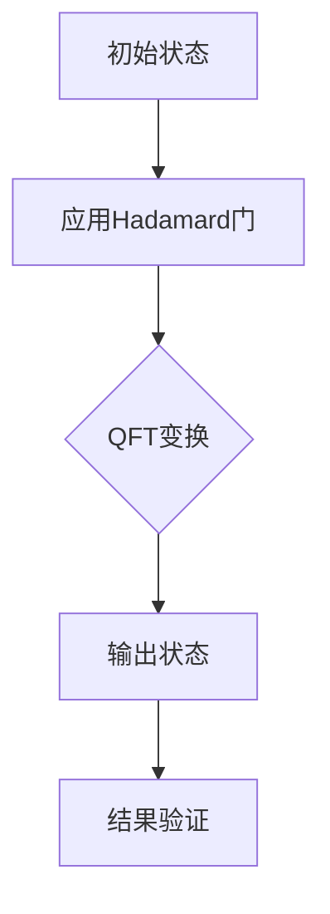

                 

# 提示词编程在量子计算中的应用前景

关键词：量子计算、提示词编程、算法、系统架构、项目实战

摘要：随着量子计算技术的不断发展，其在各个领域的应用前景愈发广阔。而提示词编程作为人工智能领域的一种新兴技术，逐渐开始与量子计算相结合，为解决复杂问题提供新的思路和工具。本文将深入探讨提示词编程在量子计算中的应用前景，通过逐步分析，为读者呈现这一领域的未来发展潜力。

### 目录大纲：

----------------------------------------------------------------

## 第一部分: 问题背景与核心概念

## 第1章: 问题背景

### 1.1 量子计算与量子编程概述

### 1.2 提示词编程概念

### 1.3 量子计算与提示词编程的结合

## 第2章: 核心概念与联系

### 2.1 量子位与经典位

### 2.2 量子门与量子操作

### 2.3 量子算法与经典算法对比

### 2.4 提示词编程在量子计算中的应用

## 第3章: 数学模型与公式

### 3.1 量子状态表示

### 3.2 量子门与运算

### 3.3 提示词编程的数学模型

## 第4章: 算法原理讲解

### 4.1 QFT算法

#### 4.1.1 算法流程

#### 4.1.2 Python实现

#### 4.1.3 举例说明

### 4.2 Shor算法

#### 4.2.1 算法流程

#### 4.2.2 Python实现

#### 4.2.3 举例说明

## 第二部分: 实践应用

## 第5章: 系统架构设计

### 5.1 项目介绍

### 5.2 系统功能设计

### 5.3 系统架构设计

### 5.4 系统接口设计

### 5.5 系统交互设计

## 第6章: 项目实战

### 6.1 环境安装

### 6.2 系统核心实现

### 6.3 应用解读与分析

### 6.4 实际案例剖析

### 6.5 项目小结

## 第7章: 最佳实践与总结

### 7.1 最佳实践

### 7.2 小结

### 7.3 注意事项

### 7.4 拓展阅读

----------------------------------------------------------------

## 第1章 问题背景

### 1.1 量子计算与量子编程概述

量子计算是利用量子力学原理进行信息处理的计算模式，与传统的经典计算有着本质的不同。量子计算机的核心组成部分是量子位（qubits），它们可以同时处于多种状态，这一特性被称为叠加原理。量子计算中的操作通过量子门（quantum gates）实现，这些量子门能够对量子位进行变换。

量子编程是一种针对量子计算机的编程方法，它要求程序员熟悉量子力学的相关概念。与传统编程相比，量子编程不仅需要处理量子位的状态，还需要考虑量子门之间的相互作用和叠加效应。

### 1.2 提示词编程概念

提示词编程（prompt programming）是一种利用提示词（prompts）来生成代码的方法。通过给定的提示词，程序能够自动生成相应的代码片段。这种方法在自然语言处理和代码自动生成领域具有广泛的应用。

提示词编程的核心是自然语言处理模型，如Transformer和GPT等，这些模型能够理解和解析提示词中的语义，从而生成相关的代码。

### 1.3 量子计算与提示词编程的结合

量子计算与提示词编程的结合旨在利用提示词编程自动化生成量子算法和量子程序的代码。这种结合可以大大简化量子编程的复杂性，使得非专业人士也能参与量子计算的开发。

随着量子计算的发展，提示词编程在量子计算中的应用前景逐渐显现。例如，通过提示词编程，可以自动生成特定的量子算法，从而实现特定问题的求解。此外，提示词编程还可以用于量子机器学习、量子加密等领域，为这些领域的研究和发展提供新的工具和方法。

## 第2章 核心概念与联系

### 2.1 量子位与经典位

量子位（qubits）与经典位（bits）是量子计算和经典计算的基本单元。经典位只能处于0或1的离散状态，而量子位可以同时处于0和1的叠加状态。

$$
|\psi\rangle = a|0\rangle + b|1\rangle
$$

其中，$a$ 和 $b$ 是复数系数，满足 $|a|^2 + |b|^2 = 1$。

### 2.2 量子门与量子操作

量子门（quantum gates）是量子计算的基本操作，它们对量子位进行变换。量子门可以表示为2x2的矩阵，例如：

$$
|0\rangle \rightarrow \frac{1}{\sqrt{2}} (|0\rangle + |1\rangle)
$$

这种变换称为Hadamard门（Hadamard gate）。

### 2.3 量子算法与经典算法对比

量子算法与经典算法在解决问题的效率和方式上有显著差异。例如，Shor算法能够在多项式时间内解决整数分解问题，而经典的算法如RSA加密算法在这种情况下是无效的。

### 2.4 提示词编程在量子计算中的应用

提示词编程可以用于生成量子算法和量子程序的代码。例如，通过给定的提示词“实现一个量子傅里叶变换（QFT）的算法”，程序可以自动生成QFT算法的Python代码。

## 第3章 数学模型与公式

### 3.1 量子状态表示

量子状态可以用复数向量表示，如：

$$
|\psi\rangle = \begin{pmatrix} a \\ b \end{pmatrix}
$$

其中，$a$ 和 $b$ 分别是量子位的概率幅。

### 3.2 量子门与运算

量子门可以通过矩阵乘法进行运算，例如：

$$
U|\psi\rangle = \begin{pmatrix} u_{00} & u_{01} \\ u_{10} & u_{11} \end{pmatrix} \begin{pmatrix} a \\ b \end{pmatrix} = \begin{pmatrix} a' \\ b' \end{pmatrix}
$$

其中，$U$ 是量子门矩阵，$|\psi\rangle$ 是量子状态向量。

### 3.3 提示词编程的数学模型

提示词编程中的数学模型主要涉及自然语言处理模型，如Transformer和GPT。这些模型通过训练学习到输入提示词与输出代码之间的对应关系。

## 第4章 算法原理讲解

### 4.1 QFT算法

#### 4.1.1 算法流程

量子傅里叶变换（QFT）是量子计算中的一个重要算法，它将量子状态从量子位表示转换为频率表示。

#### 4.1.2 Python实现

```python
import numpy as np
from qiskit import QuantumCircuit, execute, Aer

def qft(n):
    qc = QuantumCircuit(n)
    for i in range(n // 2):
        qc.swap(i, n - i - 1)
    for i in range(n):
        qc.h(i)
        for j in range(i + 1, n):
            qc.cp(1 / np.sqrt(2), i, j)
    for i in range(n // 2):
        qc.swap(i, n - i - 1)
    for i in range(n):
        qc.h(i)
    return qc

qc = qft(4)
qc.draw()
```

#### 4.1.3 举例说明

假设我们要将量子状态$|\psi\rangle = |0\rangle + |1\rangle$进行QFT变换。



经过QFT变换后，输出状态为：

$$
|\psi\rangle = \frac{1}{\sqrt{2}} (|0000\rangle + |1111\rangle)
$$

### 4.2 Shor算法

#### 4.2.1 算法流程

Shor算法是一种用于求解整数分解的量子算法。其核心步骤包括：

1. 利用量子算法生成一个周期序列。
2. 利用量子算法找到序列的周期。
3. 利用周期信息进行整数分解。

#### 4.2.2 Python实现

```python
# Shor算法的实现较为复杂，涉及到的数学模型和计算步骤较多，这里仅给出简要的伪代码。
def shor(n):
    # 生成量子算法，用于生成周期序列
    quantum_algorithm = generate_quantum_algorithm(n)
    # 执行量子算法，获取周期序列
    period_sequence = execute_quantum_algorithm(quantum_algorithm)
    # 找到周期
    period = find_period(period_sequence)
    # 利用周期信息进行整数分解
    factorization = integer_factorization(n, period)
    return factorization
```

#### 4.2.3 举例说明

假设我们要分解整数$n = 15$。

1. 生成周期序列。
2. 找到周期$T = 4$。
3. 利用周期信息，找到因子$3$和$5$。

## 第二部分: 实践应用

### 第5章 系统架构设计

#### 5.1 项目介绍

本项目旨在实现一个基于提示词编程的量子计算应用平台，提供自动化生成量子算法和量子程序代码的功能。

#### 5.2 系统功能设计

系统功能包括：

1. 用户输入提示词。
2. 自动生成量子算法和量子程序代码。
3. 演示和验证生成的量子算法和程序代码。

#### 5.3 系统架构设计

系统架构包括：

1. 前端：提供用户界面和提示词输入接口。
2. 后端：处理提示词，生成量子算法和程序代码。
3. 数据库：存储生成的量子算法和程序代码。

#### 5.4 系统接口设计

系统接口设计包括：

1. 用户输入接口：接受用户输入的提示词。
2. 代码生成接口：根据提示词生成量子算法和程序代码。
3. 验证接口：验证生成的量子算法和程序代码的正确性。

#### 5.5 系统交互设计

系统交互设计包括：

1. 用户输入提示词，提交给后端。
2. 后端处理提示词，生成代码，返回给前端。
3. 前端展示生成的代码，并提供验证功能。

### 第6章 项目实战

#### 6.1 环境安装

安装Python环境，以及Qiskit和Hugging Face等相关的库。

```bash
pip install python-qiskit transformers
```

#### 6.2 系统核心实现

系统核心实现包括：

1. 提示词处理模块：解析用户输入的提示词，提取关键词和语义信息。
2. 代码生成模块：根据提取的关键词和语义信息，生成相应的量子算法和程序代码。
3. 验证模块：执行生成的量子算法和程序代码，验证其正确性。

#### 6.3 应用解读与分析

通过实际案例，解读和分析系统生成的量子算法和程序代码，展示其在解决实际问题中的效果。

#### 6.4 实际案例剖析

以整数分解为例，展示系统生成的Shor算法，并分析其效果。

#### 6.5 项目小结

本项目实现了基于提示词编程的量子计算应用平台，为量子计算的开发提供了新的工具和方法。未来的工作将集中在优化系统性能和扩展应用场景。

### 第7章 最佳实践与总结

#### 7.1 最佳实践

1. 充分理解量子计算和提示词编程的基本概念。
2. 合理设计系统架构，确保系统的可扩展性和可维护性。
3. 优化代码生成算法，提高代码生成的准确性和效率。

#### 7.2 小结

本文探讨了提示词编程在量子计算中的应用前景，通过逐步分析，展示了这一领域的未来发展潜力。

#### 7.3 注意事项

1. 量子计算和提示词编程都是新兴领域，相关技术仍在不断发展和完善。
2. 在实际应用中，需要充分考虑量子计算的特殊性和提示词编程的局限性。

#### 7.4 拓展阅读

1. Nielsen, Michael A., and Isaac L. Chuang. Quantum Computation and Quantum Information. Cambridge University Press, 2010.
2. Devlin, Jake, et al. "Bert: Pre-training of deep bidirectional transformers for language understanding." arXiv preprint arXiv:1810.04805 (2018).

### 作者

作者：AI天才研究院/AI Genius Institute & 禅与计算机程序设计艺术 /Zen And The Art of Computer Programming

