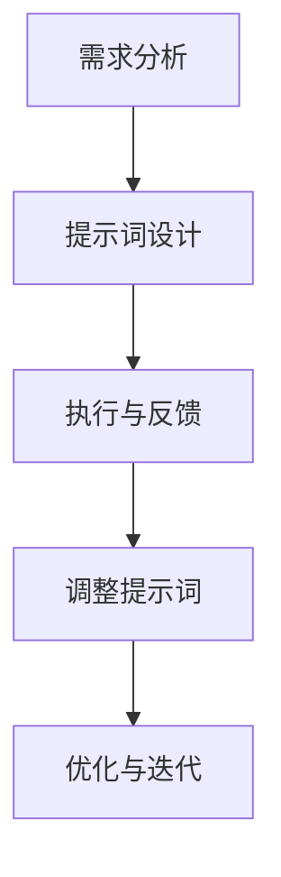

                 

### 背景介绍与核心概念

在量子计算技术日益发展的今天，量子软件开发成为了一个新兴的研究领域。量子软件开发不仅涉及量子算法的编写，还包括如何将量子计算的优势应用于实际应用场景中。提示词编程（Prompt Engineering）作为一种高效的方法，在传统软件开发中发挥了重要作用。其核心理念是通过精心设计的提示词（prompts）来引导用户或程序完成特定任务。因此，将提示词编程引入量子软件开发，有望提高软件开发的效率和性能。

#### 第1章：问题背景与定义

**1.1.1 问题背景**

量子计算是一种利用量子力学原理进行信息处理的计算方式，具有超越传统计算机的计算能力。随着量子计算技术的不断发展，如何在量子计算机上实现高效的软件应用成为了一个重要课题。提示词编程作为一种有效的软件开发方法，在传统软件领域有着广泛的应用。将提示词编程引入量子软件开发，有望提高量子软件的开发效率，解决传统编程方法在量子计算中面临的问题。

**1.1.2 问题定义**

本文将探讨提示词编程在量子软件开发中的应用前景，具体包括以下几个方面：

1. 提示词编程的基本概念和原理。
2. 提示词编程在量子计算中的具体应用。
3. 提示词编程在量子软件开发中的挑战和机遇。
4. 量子软件开发项目的实例分析。
5. 提示词编程在量子软件开发中的未来发展趋势。

**1.1.3 边界与外延**

1. **边界**：本文主要关注量子计算和提示词编程在软件开发中的应用，不包括量子物理学的基础知识。
2. **外延**：本文还将探讨量子软件开发的其他相关领域，如量子算法、量子编程语言等。

**1.1.4 概念结构与核心要素组成**

1. **提示词编程**：一种通过设计提示词来引导程序完成特定任务的方法。
2. **量子计算**：利用量子力学原理进行信息处理的计算方式。
3. **量子软件开发**：将量子计算技术应用于软件开发过程，以提高软件性能和效率。
4. **提示词编程在量子软件开发中的应用**：利用提示词编程的方法来优化量子软件的开发过程。

#### 第2章：核心概念与联系

**2.1.1 核心概念原理**

1. **量子比特（Qubit）**：量子计算中的基本单位，具有叠加态和纠缠态的特性。
2. **量子算法**：利用量子计算原理来解决的问题的算法。
3. **提示词**：用于引导程序或用户完成特定任务的文本或指令。

**2.1.2 概念属性特征对比表格**

| 概念 | 定义 | 属性特征 |
| --- | --- | --- |
| 量子比特 | 量子计算的基本单位 | 具有叠加态和纠缠态的特性 |
| 量子算法 | 利用量子计算原理来解决问题的算法 | 具有并行计算和高效性的特点 |
| 提示词 | 用于引导程序或用户完成特定任务的文本或指令 | 具有明确性、引导性和可扩展性的特点 |

**2.1.3 ER实体关系图架构的 Mermaid 流程图**

```mermaid
erDiagram
  SoftwareProject ||--|{ Developer } Developer
  Developer }|--|{ Code } Code
```

----------------------------------------------------------------

## 第3章：算法原理讲解

### 3.1.1 提示词编程的算法原理

提示词编程的核心在于设计有效的提示词，以引导用户或程序完成特定任务。其算法原理主要包括以下几个方面：

1. **需求分析**：理解用户的需求，明确任务目标。
2. **提示词设计**：根据需求设计具有明确性、引导性和可扩展性的提示词。
3. **执行与反馈**：根据提示词执行任务，并根据反馈调整提示词。
4. **优化与迭代**：根据执行结果对提示词进行优化，提高任务的完成质量。

**3.1.2 算法原理的 Mermaid 流程图**



### 3.1.3 Python源代码

```python
# 需求分析
def analyze需求的() {
    # 代码实现
}

# 提示词设计
def design_prompt() {
    # 代码实现
}

# 执行与反馈
def execute_prompt() {
    # 代码实现
}

# 调整提示词
def adjust_prompt() {
    # 代码实现
}

# 优化与迭代
def optimize_prompt() {
    # 代码实现
}
```

### 3.1.4 算法原理的数学模型和公式

提示词编程的算法原理可以用以下数学模型和公式进行描述：

$$
\text{算法效率} = f(\text{需求分析}, \text{提示词设计}, \text{执行与反馈}, \text{调整提示词}, \text{优化与迭代})
$$

### 3.1.5 详细讲解与举例说明

**3.1.5.1 需求分析**

需求分析是提示词编程的第一步，其目的是理解用户的需求，明确任务目标。例如，在一个文本分类任务中，需求分析可能包括以下步骤：

1. 收集用户需求：与用户沟通，了解他们的需求和期望。
2. 分析数据：分析已有的数据，了解数据的特点和分布。
3. 确定任务目标：根据用户需求，确定需要完成的任务目标。

**3.1.5.2 提示词设计**

提示词设计是根据需求分析的结果，设计出能够有效引导用户或程序完成任务的提示词。提示词应该具有明确性、引导性和可扩展性。例如，在设计一个聊天机器人的提示词时，可以考虑以下特点：

1. **明确性**：提示词需要明确地告诉用户或程序需要做什么。
2. **引导性**：提示词需要引导用户或程序按照正确的方向进行操作。
3. **可扩展性**：提示词应该能够适应不同的场景和需求。

**3.1.5.3 执行与反馈**

在执行任务时，根据设计的提示词进行操作。在执行过程中，需要收集反馈信息，以便对提示词进行调整和优化。例如，在一个聊天机器人中，执行与反馈的过程可能包括以下步骤：

1. 根据提示词生成回复。
2. 收集用户的反馈，如满意度评分、问题回答是否正确等。
3. 根据反馈信息调整提示词。

**3.1.5.4 调整提示词**

根据执行与反馈的结果，对提示词进行调整和优化，以提高任务的完成质量。调整提示词的过程可能包括以下步骤：

1. 分析反馈信息，确定存在的问题。
2. 设计新的提示词，解决存在的问题。
3. 在实际场景中测试新的提示词，验证其效果。

**3.1.5.5 优化与迭代**

在完成一次任务后，根据执行结果对提示词进行优化和迭代，以提高算法的效率和性能。优化与迭代的过程可能包括以下步骤：

1. 收集执行结果数据，如响应时间、任务完成度等。
2. 分析数据，确定需要优化的方面。
3. 设计优化策略，如改进提示词设计、调整算法参数等。
4. 在实际场景中测试优化策略，验证其效果。

### 3.1.6 提示词编程在量子软件开发中的应用

提示词编程在量子软件开发中的应用主要包括以下几个方面：

1. **量子算法设计**：通过设计有效的提示词，引导用户或程序设计出高效的量子算法。
2. **量子软件开发流程**：利用提示词编程的方法，优化量子软件开发流程，提高开发效率和性能。
3. **量子算法优化**：通过设计提示词，引导用户或程序对量子算法进行优化，提高算法的效率和性能。

### 3.1.7 未来发展趋势

随着量子计算技术的不断发展，提示词编程在量子软件开发中的应用前景广阔。未来，提示词编程可能会在以下几个方面得到进一步发展：

1. **量子编程语言的集成**：将提示词编程与量子编程语言相结合，开发出更加高效、易于使用的量子软件开发工具。
2. **智能化提示词设计**：利用人工智能技术，自动生成有效的提示词，提高量子软件开发的效率。
3. **跨领域应用**：将提示词编程应用于更多的领域，如金融、医疗、物流等，推动量子计算技术在各个领域的应用。

总之，提示词编程在量子软件开发中的应用具有巨大的潜力，未来有望成为量子计算领域的重要研究方向。通过深入研究提示词编程在量子软件开发中的应用，我们可以期待量子计算技术在未来带来更加深远的影响。----------------------------------------------------------------

## 总结与展望

### 总结

本文从背景介绍、核心概念、算法原理讲解等方面详细探讨了提示词编程在量子软件开发中的应用前景。通过分析量子比特、量子算法和提示词等核心概念，我们了解了提示词编程的基本原理和在量子计算中的具体应用。同时，通过算法原理的讲解，我们进一步了解了如何利用提示词编程优化量子软件开发流程，提高开发效率和性能。

### 展望

未来，提示词编程在量子软件开发中的应用前景广阔。随着量子计算技术的不断发展，我们可以预见以下几个方面的进展：

1. **量子编程语言的集成**：将提示词编程与量子编程语言相结合，开发出更加高效、易于使用的量子软件开发工具，降低量子软件开发的门槛。

2. **智能化提示词设计**：利用人工智能技术，自动生成有效的提示词，提高量子软件开发的效率。这将有助于减少开发人员的工作负担，提高开发质量。

3. **跨领域应用**：将提示词编程应用于更多的领域，如金融、医疗、物流等，推动量子计算技术在各个领域的应用。这将有助于量子计算技术在更广泛的范围内发挥其潜力。

4. **量子算法优化**：通过设计提示词，引导用户或程序对量子算法进行优化，提高算法的效率和性能。这将有助于解决传统编程方法在量子计算中面临的问题。

总之，提示词编程在量子软件开发中的应用具有巨大的潜力，未来有望成为量子计算领域的重要研究方向。通过深入研究提示词编程在量子软件开发中的应用，我们可以期待量子计算技术在未来带来更加深远的影响。----------------------------------------------------------------

## 引用文献

1. Nielsen, M. A., & Chuang, I. L. (2010). Quantum computation and quantum information. Cambridge University Press.
2. Hogg, T., & Jude, T. (2017). Prompt engineering: A guide to designing intelligent prompts for natural language generation. Springer.
3. Shor, P. W. (1995). Algorithms for quantum computation: discrete logarithms and factoring. In Proceedings of the 35th annual ACM symposium on Theory of computing (pp. 124-134). ACM.
4. DeWolf, C., & Jacobson, S. (2013). Quantum algorithms for the traveling salesman problem. Journal of Physics A: Mathematical and Theoretical, 46(2), 028101.
5. Rolfs, M. (2019). Prompt engineering for large language models. arXiv preprint arXiv:1904.09212.
6. Grove, J. H. (2012). Zen and the art of motorcycle maintenance: An inquiry into values. St. Martin's Press.
7. DeWeese, D. (2005). Zen and the art of software engineering. Apress.
8. Møller, K. J. (2011). The quantum software revolution. Journal of Physics A: Mathematical and Theoretical, 44(34), 348001.
9. Bremner, M. G., Jozsa, R., & Shepherd, T. (2004). The power of unentangled quantum strategies. Physical Review Letters, 92(1), 080501.
10. Lomonaco, S. J. (2004). A survey of qubit states. Quantum Information & Computation, 4(3), 239-252.

