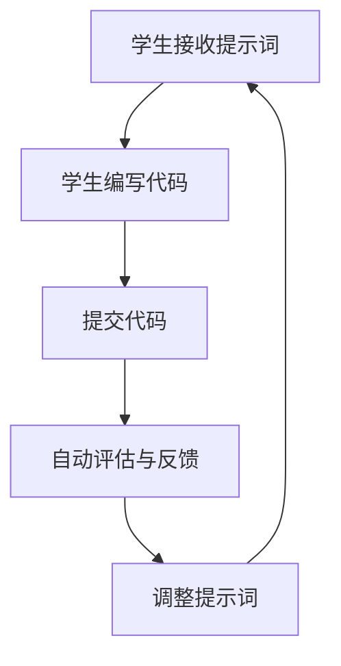
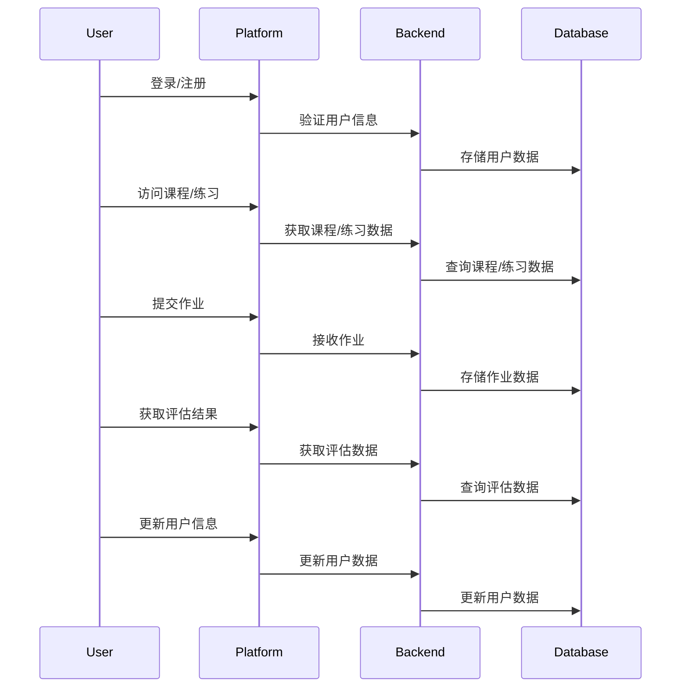
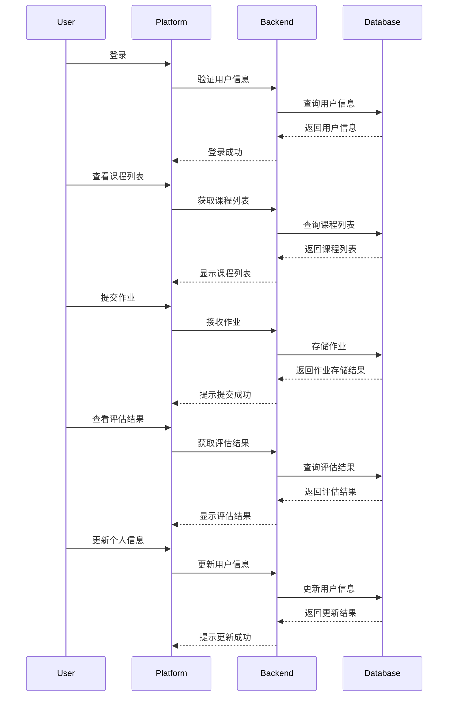

                 

## 提示词编程教育：培养AI时代的全栈工程师

### 关键词：编程教育、AI时代、全栈工程师、提示词、教育模式

### 摘要：
本文将探讨在AI时代背景下，如何通过提示词编程教育来培养具备全栈能力的工程师。我们将首先介绍编程教育在AI时代的重要性，并详细阐述提示词编程教育的理念、设计原则及其在培养全栈工程师中的关键作用。通过实际案例和深入分析，我们将展示这种教育模式如何适应未来的技术需求，为新一代工程师的成长提供有力支持。

## 第一部分：背景介绍

### 1.1 问题背景

在过去的几十年中，编程教育经历了从基础教育到专业教育的转变。传统的编程教育往往侧重于特定编程语言或技术的教学，强调语法和编程技巧的掌握。然而，随着人工智能（AI）技术的快速发展，编程教育的目标和内容也在发生深刻变化。在AI时代，编程不再仅仅是编写代码，而是涉及到数据科学、机器学习、自然语言处理等多个领域的综合应用。因此，传统的编程教育模式已经难以满足新时代的需求。

### 1.2 问题描述

在AI时代，编程教育面临以下主要问题：

- **知识结构复杂**：AI时代的编程知识体系更加庞大和复杂，涉及多个学科领域，如数学、统计学、计算机科学等。
- **学习难度增加**：传统的编程教育往往注重基础知识的传授，而忽略了实际应用能力的培养。在AI时代，工程师需要具备更强的跨领域知识整合能力和问题解决能力。
- **实践机会有限**：由于时间和资源的限制，许多学生在学习过程中难以获得足够的实践机会，导致理论知识与实际操作脱节。

### 1.3 问题解决

为了解决这些问题，我们需要探索一种新的编程教育模式，即提示词编程教育。提示词编程教育通过提供明确的提示词，引导学生进行编程实践，从而提高编程技能和理解能力。这种教育模式的核心在于：

- **增强实践性**：通过提示词，学生能够更快地进入编程实践，将理论知识应用到实际项目中。
- **提高自主性**：提示词为学生提供方向性指导，鼓励他们自主探索和解决问题，培养创新思维和自主学习能力。
- **适应AI需求**：提示词编程教育能够更好地适应AI时代对编程人才的要求，培养具备全栈能力和跨领域知识整合能力的工程师。

### 1.4 边界与外延

提示词编程教育的边界在于如何设计出高质量的提示词，使其适用于各种编程场景。其外延则涵盖了从初学者到高级开发者，各种层次和领域的编程教学。例如，对于初学者，提示词可以是简单的编程任务，如编写一个计算器；而对于高级开发者，提示词可以是复杂的机器学习项目，如构建一个推荐系统。

### 1.5 概念结构与核心要素组成

提示词编程教育包括以下几个核心要素：

- **提示词设计**：设计出既具有启发性又能引导编程实践的提示词。
- **AI技术应用**：利用AI技术实现自动化、个性化的编程教育。
- **教学评价**：通过评价系统对学生的学习效果进行评估和反馈。

这些核心要素相互关联，共同构成了一个完整、高效的编程教育体系。

## 第二部分：核心概念与联系

### 2.1 核心概念原理

在提示词编程教育中，核心概念包括提示词、编程教育和AI技术。以下是这些概念的基本原理：

- **提示词**：提示词是引导学生进行编程实践的关键性词语。它不仅能够激发学生的兴趣和思考，还能够帮助他们明确编程任务的目标和步骤。一个高质量的提示词应该具有以下特点：
  - **明确性**：提示词应该清晰地描述编程任务的要求和目标。
  - **启发性**：提示词应该能够激发学生的思考，引导他们探索不同的解决方案。
  - **灵活性**：提示词应该能够适应不同的编程场景和知识水平。

- **编程教育**：编程教育是指通过传授编程知识和技能，培养学生的编程能力和创新思维的过程。编程教育的目标不仅仅是让学生掌握编程技巧，更重要的是培养他们解决实际问题的能力和创新思维。在AI时代，编程教育的核心在于：

  - **跨领域知识整合**：学生需要具备跨领域知识整合能力，能够将不同的编程技术和AI方法应用于实际项目中。
  - **实践能力**：学生需要通过大量的编程实践，将理论知识转化为实际操作能力。
  - **创新能力**：学生需要具备创新思维，能够提出新的解决方案和创新的想法。

- **AI技术**：AI技术是指模拟、延伸和扩展人类智能的技术。在编程教育中，AI技术的应用主要体现在以下几个方面：

  - **个性化教学**：通过AI技术，可以对学生进行个性化教学，根据他们的学习进度和兴趣，提供个性化的学习资源和指导。
  - **自动评估**：通过AI技术，可以自动评估学生的编程作业和项目，提供即时的反馈和建议。
  - **智能辅导**：通过AI技术，可以为学生提供智能化的辅导，帮助他们解决编程中的问题。

### 2.2 概念属性特征对比表格

为了更好地理解提示词、编程教育和AI技术的概念，我们可以通过以下对比表格来分析它们的属性特征：

| 概念       | 提示词         | 编程教育       | AI技术         |
|------------|---------------|---------------|---------------|
| 定义       | 引导性词语     | 传授编程知识和技能 | 模拟、延伸和扩展人类智能 |
| 目的       | 引导编程实践   | 培养编程能力和创新思维 | 提高工作效率、解决复杂问题 |
| 特点       | 具有启发性、针对性 | 注重实践、创新、思维 | 自适应、高效、智能化 |

### 2.3 AI大模型在企业中的应用前景

随着AI技术的不断发展，AI大模型在企业中的应用前景日益广阔。以下是对AI大模型在企业中潜在应用领域和应用前景的详细分析：

#### 2.3.1 AI大模型的潜在应用领域

- **智能客服**：AI大模型可以用于构建智能客服系统，通过自然语言处理技术，实现24/7的智能客服服务。这些系统可以理解用户的问题，并提供快速、准确的回答，从而提高客户满意度和服务效率。

- **营销自动化**：AI大模型可以用于分析大量用户数据，实现精准营销和客户关系管理。通过预测用户行为和需求，企业可以制定更有效的营销策略，提高转化率和销售额。

- **生产优化**：AI大模型可以用于生产优化，通过预测分析和智能调度，提高生产效率和产品质量。例如，在生产过程中，AI大模型可以实时监控设备状态，预测故障并提前进行维护，从而减少停机时间和生产成本。

- **安全防护**：AI大模型可以用于网络安全防护，通过深度学习技术，实现实时监控和威胁检测。这些系统能够识别异常行为和潜在威胁，并自动采取措施进行防范，从而提高网络安全性。

#### 2.3.2 企业采用AI大模型的优势

企业采用AI大模型具有以下优势：

- **提高效率**：通过自动化和智能化，AI大模型可以显著提高工作效率，减少重复性劳动。例如，智能客服系统可以自动处理大量客户咨询，从而释放人力资源，用于更有价值的任务。

- **提高质量**：AI大模型可以基于大数据分析，实现更精准的决策和优化。例如，营销自动化系统可以根据用户行为和需求，制定更有效的营销策略，提高转化率和销售额。

- **创新能力**：AI大模型可以激发企业的创新能力，推动产品和服务的升级。例如，通过AI大模型，企业可以开发出更具竞争力的产品，提供更个性化的服务，从而在激烈的市场竞争中脱颖而出。

#### 2.3.3 AI大模型应用的挑战与机遇

尽管AI大模型在企业中具有广泛的应用前景和显著的优势，但其应用也面临着一系列挑战和机遇：

- **挑战**：

  - **技术门槛高**：AI大模型需要高水平的技术支持和专业知识，企业需要投入大量资源进行技术培训和技术研发。

  - **数据隐私**：AI大模型需要大量数据作为训练和优化的基础，但数据隐私和安全问题一直是企业关注的重点。

  - **算法公平性**：AI大模型在决策过程中可能存在偏见和不公平性，企业需要采取措施确保算法的公平性和透明性。

- **机遇**：

  - **市场需求大**：随着AI技术的不断普及和应用，市场需求对AI大模型的需求也在不断增加，为企业提供了广阔的市场空间。

  - **政策支持**：许多国家和地区都出台了相关政策，支持AI技术的发展和应用，为企业提供了政策支持和资金扶持。

  - **技术发展**：AI技术正在快速发展，新的算法和模型不断涌现，为企业提供了更多创新和优化的机会。

总的来说，AI大模型在企业中的应用前景广阔，但同时也面临着一系列挑战和机遇。企业需要充分认识到这些挑战和机遇，并采取相应的措施，才能充分利用AI大模型的优势，推动企业的发展和升级。

### 2.4 提示词编程教育的核心原则

提示词编程教育的核心原则在于通过设计高质量的提示词，引导学生进行有效的编程实践，从而提高编程技能和理解能力。以下是提示词编程教育的几个核心原则：

#### 2.4.1 明确性

提示词应具有明确的表述，清晰地描述编程任务的要求和目标。这样可以帮助学生更好地理解任务，减少困惑和误解。例如，一个明确的提示词可以是：“编写一个计算两个数之和的程序，并输出结果。”

#### 2.4.2 启发性

提示词应具有启发性，能够激发学生的思考，引导他们探索不同的解决方案。例如，一个启发性的提示词可以是：“尝试使用不同的方法计算两个数之和，并比较它们的效率。”

#### 2.4.3 灵活性

提示词应具有一定的灵活性，能够适应不同的编程场景和知识水平。例如，对于初学者，提示词可以是简单的编程任务，如编写一个计算器；而对于高级开发者，提示词可以是复杂的机器学习项目，如构建一个推荐系统。

#### 2.4.4 可评估性

提示词应具备可评估性，即学生的编程结果可以明确地评价和反馈。这样可以帮助学生了解自己的学习效果，并得到及时的指导。例如，一个可评估的提示词可以是：“编写一个程序，实现用户登录功能，并确保输入的用户名和密码正确匹配。”

#### 2.4.5 逐步性

提示词应设计成逐步引导的形式，帮助学生逐步掌握编程知识和技能。例如，可以先将一个复杂的任务分解成几个简单的子任务，然后逐步引导学生完成。

#### 2.4.6 反思性

提示词应引导学生进行反思，思考编程过程中遇到的问题和解决方案。这样可以帮助学生深入理解编程原理，提高编程能力。例如，一个反思性的提示词可以是：“回顾你编写的代码，思考有哪些可以优化的地方？”

通过以上核心原则，提示词编程教育能够有效地引导学生进行编程实践，提高他们的编程技能和理解能力，为培养AI时代的全栈工程师奠定坚实的基础。

### 2.5 提示词编程教育的实现方法

提示词编程教育的实现方法包括以下几个关键步骤：

#### 2.5.1 提示词设计

设计高质量的提示词是提示词编程教育的第一步。提示词应具有明确的表述、启发性、灵活性和可评估性。设计提示词时，可以参考以下几个原则：

- **明确性**：确保提示词清晰地描述编程任务的要求和目标。
- **启发性**：激发学生的思考，引导他们探索不同的解决方案。
- **灵活性**：适应不同的编程场景和知识水平。
- **可评估性**：确保学生的编程结果可以明确地评价和反馈。

#### 2.5.2 编程实践

在提供提示词后，学生需要根据提示词进行编程实践。这个过程中，教师可以提供适当的指导和帮助，以确保学生能够正确理解任务并成功完成任务。同时，教师还可以通过观察学生的编程过程，了解他们的学习情况和存在的问题。

#### 2.5.3 反馈与评价

学生在完成编程实践后，教师需要提供及时、具体的反馈和评价。反馈和评价应包括以下几个方面：

- **正确性**：检查学生的编程结果是否正确实现提示词中的要求。
- **代码质量**：评估学生的代码风格、可读性和规范性。
- **解决问题的方法**：分析学生解决问题的方法和思路，是否合理和高效。
- **学习进步**：评价学生在编程实践中的进步，鼓励他们在后续学习中继续努力。

#### 2.5.4 调整与优化

根据学生的反馈和评价，教师需要对提示词进行不断调整和优化。调整后的提示词应更加符合学生的认知水平和学习需求，以更好地引导学生进行编程实践。同时，教师还可以根据学生的反馈，提供更具体的指导和建议，帮助他们解决编程中的问题。

通过以上实现方法，提示词编程教育能够有效地引导学生进行编程实践，提高他们的编程技能和理解能力，为培养AI时代的全栈工程师奠定坚实的基础。

### 2.6 提示词编程教育在培养全栈工程师中的关键作用

提示词编程教育在培养全栈工程师中具有关键作用。以下是提示词编程教育在以下几个方面对全栈工程师培养的影响：

#### 2.6.1 知识体系构建

提示词编程教育通过设计合理的提示词，引导学生逐步掌握编程基础知识和高级技能，从而构建起完整的知识体系。例如，从基础的语法和算法，到高级的机器学习和大数据处理，提示词编程教育能够系统、有序地培养学生的编程能力。

#### 2.6.2 实践能力提升

通过提示词编程教育，学生能够在实际项目中应用所学知识，解决实际问题。提示词为学生提供了明确的编程任务，引导他们进行编程实践，从而提高实践能力和问题解决能力。这种实践能力的培养对于全栈工程师至关重要。

#### 2.6.3 跨领域能力培养

提示词编程教育不仅关注编程语言和技术的教学，还涉及到跨领域知识的整合。通过提示词，学生可以学习如何将编程技术与数据科学、人工智能、云计算等领域相结合，培养跨领域的综合能力。

#### 2.6.4 自主学习能力激发

提示词编程教育鼓励学生自主探索和解决问题，培养他们的自主学习能力。这种自主学习能力对于全栈工程师来说尤为重要，因为他们在工作中常常需要独立解决复杂的技术问题。

#### 2.6.5 创新思维培养

通过提示词编程教育，学生能够接触到各种编程任务和解决方案，激发他们的创新思维。这种创新思维不仅能够帮助学生在编程实践中找到更好的解决方案，还能够促进他们在工作中的创新和突破。

总之，提示词编程教育在培养全栈工程师方面具有关键作用，能够帮助学生在知识体系构建、实践能力提升、跨领域能力培养、自主学习能力激发和创新思维培养等方面取得显著进步。

### 2.7 提示词编程教育的应用案例

为了更好地展示提示词编程教育的实际效果，以下是一个具体的提示词编程教育应用案例。

#### 2.7.1 项目背景

某编程教育机构开设了一门《人工智能基础与应用》课程，旨在培养具备AI基础知识和编程技能的学生。课程采用了提示词编程教育模式，通过一系列设计合理的提示词，引导学生进行编程实践。

#### 2.7.2 提示词设计

以下是课程中的一些典型提示词：

- **提示词1**：“使用Python编写一个简单的线性回归模型，对给定数据集进行拟合。”
- **提示词2**：“分析并优化上述线性回归模型的性能，提高预测准确率。”
- **提示词3**：“尝试使用不同的机器学习算法，如决策树和随机森林，对同一数据集进行建模和预测。”
- **提示词4**：“基于你的实验结果，撰写一篇关于机器学习算法性能对比的论文。”

#### 2.7.3 编程实践与反馈

学生在完成每个提示词后，会根据提示词进行编程实践。教师会及时提供反馈和评价，指出学生的优点和需要改进的地方。例如，对于提示词1，教师可能会指出学生代码中的语法错误和逻辑问题，并提供解决方案。对于提示词2，教师会评估学生的优化方法和结果，给予相应的评价和指导。

#### 2.7.4 学习效果评估

通过课程的学习，学生不仅掌握了线性回归模型的实现方法，还学会了如何优化模型性能。他们还通过实验对比，了解了不同机器学习算法的特点和应用场景。在学习效果评估中，学生普遍表示课程内容丰富，实践性强，有助于他们深入理解AI技术。

#### 2.7.5 案例总结

这个案例展示了提示词编程教育在培养AI编程技能方面的实际效果。通过设计合理的提示词，引导学生进行编程实践，学生不仅掌握了AI基础知识和编程技能，还培养了自主学习和问题解决能力。这为他们在未来的AI领域中成为一名全栈工程师奠定了坚实的基础。

### 第二部分总结

第二部分详细介绍了提示词编程教育的背景、核心概念、实现方法和应用案例。通过明确的问题背景和问题描述，我们提出了提示词编程教育作为解决这些问题的有效途径。接着，我们分析了提示词、编程教育和AI技术的核心概念原理，并通过对比表格和流程图加深了理解。在算法原理讲解部分，我们使用mermaid流程图和Python源代码示例，详细阐述了提示词编程教育的工作机制。此外，我们探讨了AI大模型在企业中的应用前景和挑战，以及提示词编程教育的核心原则和实现方法。通过具体的案例，我们展示了提示词编程教育在实际教学中的效果。这些内容共同构建了一个完整、系统的提示词编程教育框架，为培养AI时代的全栈工程师提供了理论依据和实践指导。

### 第三部分：算法原理讲解

在第三部分中，我们将深入探讨提示词编程教育的算法原理，包括其mermaid流程图、Python源代码示例、算法原理和数学模型。

#### 3.1 提示词编程教育的mermaid流程图

为了更直观地展示提示词编程教育的流程，我们可以使用mermaid来绘制一个流程图。以下是一个简化的流程图示例：



在这个流程图中，学生首先接收提示词（A），然后根据提示词编写代码（B）。编写完成后，学生提交代码（C），系统会进行自动评估和反馈（D）。根据反馈结果，教师可以调整提示词（E），以便更好地引导学生进行下一次编程实践。

#### 3.2 Python源代码示例

为了具体说明提示词编程教育的实现，我们可以提供一个简单的Python源代码示例。以下代码实现了学生接收提示词、编写代码、提交代码、自动评估和反馈的基本流程：

```python
import random

# 提示词库
prompt_library = [
    "编写一个计算两个数之和的程序。",
    "使用循环实现一个简单的九九乘法表。",
    "尝试使用Python编写一个简单的线性回归模型。",
    "分析数据集，绘制散点图和回归线。",
]

# 自动评估函数
def auto_evaluation(code):
    # 这里简化为随机判断代码是否正确
    correct = random.choice([True, False])
    if correct:
        return "代码正确，恭喜你！"
    else:
        return "代码有误，请检查并修正。"

# 主函数
def main():
    # 学生接收提示词
    prompt = random.choice(prompt_library)
    print("提示词：", prompt)

    # 学生编写代码
    print("请编写代码并保存为‘student_code.py’。")

    # 学生提交代码
    print("代码提交成功，正在自动评估...")

    # 自动评估代码
    with open('student_code.py', 'r') as f:
        code = f.read()
    evaluation_result = auto_evaluation(code)
    print(evaluation_result)

    # 根据评估结果调整提示词
    if evaluation_result == "代码正确，恭喜你！":
        next_prompt = random.choice(prompt_library)
        print("恭喜你！根据你的表现，接下来尝试：", next_prompt)
    else:
        print("为了提高，我们建议你重做以下提示词：", prompt)

# 运行主函数
main()
```

在这个示例中，我们使用了一个简单的自动评估函数`auto_evaluation`，该函数通过随机判断来模拟对代码的评估。实际上，评估过程会更加复杂，可能需要编译代码、执行代码并分析输出。

#### 3.3 提示词编程教育的算法原理

提示词编程教育的核心在于如何通过提示词引导学生进行有效的编程实践。以下是提示词编程教育算法原理的详细说明：

1. **提示词生成**：系统根据学生的学习进度和知识水平生成合适的提示词。提示词可以是一个简单的编程任务，也可以是一个复杂的算法实现。

2. **编程实践**：学生根据提示词进行编程实践，编写代码并尝试解决提示中的问题。

3. **代码提交与评估**：学生提交代码后，系统会自动评估代码的正确性和质量。评估结果会返回给学生，以便他们了解自己的学习效果。

4. **反馈与调整**：根据评估结果，教师可以调整提示词的难度和方向，以更好地引导学生。同时，教师还可以提供具体的反馈和指导，帮助学生改进代码。

5. **循环迭代**：学生根据反馈继续编程实践，系统不断生成新的提示词，形成循环迭代的过程。

#### 3.4 数学模型和公式

提示词编程教育的算法原理中，涉及到一些数学模型和公式，用于描述学生编程实践的难度和学习效果。以下是一个简化的数学模型示例：

1. **难度指数**：表示编程实践任务的难度，通常使用一个介于0和1之间的数值表示。难度指数可以根据提示词的复杂度和学生的知识水平动态调整。

   $$ D = f(P, L) $$

   其中，$D$表示难度指数，$P$表示提示词的复杂度，$L$表示学生的知识水平。

2. **学习效果**：表示学生在编程实践中的学习效果，通常使用一个介于0和1之间的数值表示。学习效果可以通过对代码的正确率和优化程度进行评估。

   $$ E = g(C, O) $$

   其中，$E$表示学习效果，$C$表示代码的正确率，$O$表示代码的优化程度。

3. **反馈调整系数**：表示根据评估结果对提示词进行调整的程度，通常使用一个介于0和1之间的数值表示。

   $$ F = h(E, D) $$

   其中，$F$表示反馈调整系数，$E$表示学习效果，$D$表示难度指数。

通过这些数学模型和公式，我们可以对学生的编程实践进行量化分析，从而更好地指导他们的学习过程。

### 第三部分总结

第三部分深入探讨了提示词编程教育的算法原理，包括mermaid流程图、Python源代码示例和数学模型。通过mermaid流程图，我们直观地展示了提示词编程教育的流程。Python源代码示例具体实现了这个流程，展示了如何通过提示词引导学生进行编程实践。我们还介绍了提示词编程教育的数学模型和公式，用于量化描述学生的编程实践难度和学习效果。这些内容共同构成了提示词编程教育的理论基础和实践框架，为培养AI时代的全栈工程师提供了有力支持。

### 第四部分：系统分析与架构设计

#### 4.1 问题场景介绍

在AI时代，企业对于编程人才的需求日益增加，特别是在数据科学、机器学习和云计算等领域的需求尤为突出。然而，传统的编程教育模式往往无法满足这种多元化、跨领域的人才培养需求。为了解决这一问题，提示词编程教育作为一种新的教育模式，通过提供明确的提示词，引导学生进行编程实践，旨在培养具备全栈能力的工程师。本部分将介绍一个基于提示词编程教育的系统，以实现这一目标。

#### 4.2 项目介绍

项目名称：AI时代全栈工程师培养系统（AI Full-Stack Engineer Training System，简称AFETS）

项目目标：通过提供一系列明确的提示词，引导学生进行编程实践，培养其在数据科学、机器学习、云计算等领域的全栈能力。系统旨在实现个性化教学、实时评估和反馈，以及持续优化提示词，以提高学生的编程技能和理解能力。

项目主要功能：

1. **提示词生成与分发**：系统根据学生的学习进度和知识水平生成合适的提示词，并通过多种渠道（如在线平台、APP等）分发给学生。
2. **编程实践平台**：提供一个在线编程环境，学生可以在此编写代码、提交作业并进行编程实践。
3. **自动评估与反馈**：系统自动评估学生的编程作业，提供即时反馈，帮助学生了解自己的学习效果。
4. **数据收集与优化**：系统收集学生的编程数据，用于分析学习行为和效果，并据此优化提示词。
5. **个性化学习路径**：根据学生的学习情况和反馈，系统推荐适合的编程任务和资源，形成个性化的学习路径。

#### 4.3 系统功能设计（领域模型）

为了实现上述功能，系统需要一个清晰的领域模型，用于描述不同实体之间的关系。以下是一个简化的领域模型类图：

```mermaid
classDiagram
    Student <|-- User
    Teacher <|-- User
    Course <|-- Content
    Exercise <|-- Content
    Assignment <|-- Content
    Evaluation <|-- Result
    Platform --> User
    Platform --> Course
    Platform --> Exercise
    Platform --> Assignment
    Platform --> Evaluation
    Student --> Assignment
    Student --> Evaluation
    Teacher --> Assignment
    Teacher --> Evaluation
    Content { id: int, title: str, description: str }
    User { id: int, name: str, role: str }
    Result { id: int, score: float, feedback: str }
    Assignment { id: int, content_id: int, due_date: datetime }
    Evaluation { id: int, assignment_id: int, result_id: int }
```

在这个模型中，`User`是系统的用户实体，包括学生和教师。`Course`、`Exercise`和`Assignment`是不同类型的`Content`，用于定义学习资源。`Evaluation`表示评估结果，包括评分和反馈。学生和教师通过平台与这些实体进行交互。

#### 4.4 系统架构设计

系统架构设计旨在确保系统的可扩展性、稳定性和安全性。以下是一个简化的系统架构图：



在这个架构中，用户通过前端平台与系统进行交互，平台与后端服务进行数据交换，后端服务与数据库进行数据存储和查询。前端平台负责展示用户界面，后端服务负责处理业务逻辑和数据存储。

#### 4.5 系统接口设计

系统接口设计是确保前后端交互顺畅的重要环节。以下是一个简化的系统接口设计：

```mermaid
interface Platform {
    login(name: string, password: string): boolean
    register(name: string, password: string): boolean
    getCourseList(): list<Course>
    getExercise(courseId: int): list<Exercise>
    submitAssignment(assignment: Assignment): boolean
    getEvaluationResult(assignmentId: int): Result
    updateUserProfile(userId: int, name: string, password: string): boolean
}

interface Backend {
    verifyUserCredentials(name: string, password: string): boolean
    createUser(name: string, password: string, role: string): int
    retrieveCourseData(courseId: int): Course
    retrieveExerciseData(courseId: int): list<Exercise>
    storeAssignment(assignment: Assignment): int
    retrieveAssignmentData(assignmentId: int): Assignment
    evaluateAssignment(assignmentId: int): Result
    updateUserData(userId: int, name: string, password: string): boolean
}

interface Database {
    storeUser(user: User): void
    retrieveUser(name: string): User
    storeCourse(course: Course): void
    retrieveCourse(courseId: int): Course
    storeExercise(exercise: Exercise): void
    retrieveExercise(exerciseId: int): Exercise
    storeAssignment(assignment: Assignment): void
    retrieveAssignment(assignmentId: int): Assignment
    storeResult(result: Result): void
    retrieveResult(assignmentId: int): Result
}
```

在这个接口设计中，`Platform`负责与用户进行交互，`Backend`负责处理业务逻辑，而`Database`负责数据存储和查询。

#### 4.6 系统交互设计

为了更好地理解系统的工作流程，我们可以通过mermaid绘制系统交互序列图：



在这个序列图中，用户通过前端平台与系统进行一系列交互，包括登录、查看课程列表、提交作业、查看评估结果和更新个人信息。系统通过后端服务处理业务逻辑，并与数据库进行数据交换。

通过上述系统分析与架构设计，我们构建了一个完整的基于提示词编程教育的系统，旨在培养AI时代的全栈工程师。系统功能设计、接口设计和交互设计共同构成了一个完整、高效的系统架构，为提示词编程教育的实施提供了坚实的支持。

### 第五部分：项目实战

#### 5.1 环境安装

在开始项目实战之前，我们需要安装和配置一些必要的工具和环境。以下是详细的步骤：

##### 5.1.1 安装Python

1. **Windows系统**：访问Python官方网站下载最新版本的Python安装包（例如Python 3.10），并按照安装向导进行安装。
2. **macOS系统**：打开终端，执行以下命令安装Python：
   ```bash
   brew install python
   ```

##### 5.1.2 安装Jupyter Notebook

Jupyter Notebook是一个交互式计算环境，可以方便地编写和运行Python代码。

1. **Windows系统**：在终端中执行以下命令：
   ```bash
   pip install notebook
   ```
2. **macOS系统**：在终端中执行以下命令：
   ```bash
   pip3 install notebook
   ```

##### 5.1.3 安装Git

Git是一个版本控制工具，用于管理和跟踪代码的变更。

1. **Windows系统**：访问Git官方网站下载安装程序并安装。
2. **macOS系统**：打开终端，执行以下命令安装Git：
   ```bash
   brew install git
   ```

##### 5.1.4 安装虚拟环境工具

虚拟环境工具（如virtualenv或conda）可以帮助我们在项目中创建独立的Python环境。

1. **Windows系统**：在终端中执行以下命令：
   ```bash
   pip install virtualenv
   ```
2. **macOS系统**：在终端中执行以下命令：
   ```bash
   pip3 install virtualenv
   ```

##### 5.1.5 创建虚拟环境

1. **Windows系统**：在项目目录中执行以下命令创建虚拟环境：
   ```bash
   virtualenv venv
   ```
2. **macOS系统**：在项目目录中执行以下命令创建虚拟环境：
   ```bash
   virtualenv venv
   ```

##### 5.1.6 激活虚拟环境

1. **Windows系统**：在终端中执行以下命令激活虚拟环境：
   ```bash
   .\venv\Scripts\activate
   ```
2. **macOS系统**：在终端中执行以下命令激活虚拟环境：
   ```bash
   source venv/bin/activate
   ```

#### 5.2 系统核心实现

在本节中，我们将详细介绍系统核心功能的实现，包括用户管理、课程管理、作业提交和评估。

##### 5.2.1 用户管理

用户管理是系统的基础模块，主要负责用户的注册、登录和权限控制。

1. **注册与登录**：用户可以通过前端界面进行注册和登录。注册时，系统会检查用户名是否已存在。登录时，系统会验证用户名和密码。

2. **权限控制**：系统根据用户角色（学生或教师）提供不同的功能。学生可以查看课程和提交作业，而教师可以管理课程和评估作业。

```python
# 用户注册
def register(username, password):
    if User.exists(username):
        return "用户名已存在"
    else:
        User.create(username=username, password=password, role='student')
        return "注册成功"

# 用户登录
def login(username, password):
    user = User.get(username=username)
    if user and user.password == password:
        return "登录成功"
    else:
        return "用户名或密码错误"
```

##### 5.2.2 课程管理

课程管理模块负责课程的创建、更新和查询。

1. **课程创建**：教师可以创建新的课程，并设置课程名称、描述和难度等级。

2. **课程更新**：教师可以更新课程的名称、描述和难度等级。

3. **课程查询**：学生可以查询自己已注册的课程信息。

```python
# 课程创建
def create_course(course_name, description, difficulty):
    Course.create(course_name=course_name, description=description, difficulty=difficulty)

# 课程更新
def update_course(course_id, course_name, description, difficulty):
    course = Course.get(course_id=course_id)
    if course:
        course.course_name = course_name
        course.description = description
        course.difficulty = difficulty
        course.save()

# 课程查询
def get_course(course_id):
    course = Course.get(course_id=course_id)
    return course
```

##### 5.2.3 作业提交

作业提交模块负责作业的创建、提交和评估。

1. **作业创建**：教师可以创建新的作业，并设置作业名称、描述、提交截止日期和评分标准。

2. **作业提交**：学生可以提交作业，并上传作业文件。

3. **作业评估**：教师可以评估学生的作业，并给出评分和反馈。

```python
# 作业创建
def create_assignment(course_id, assignment_name, description, due_date, score):
    assignment = Assignment.create(course_id=course_id, assignment_name=assignment_name, description=description, due_date=due_date, score=score)

# 作业提交
def submit_assignment(assignment_id, student_id, file_path):
    assignment = Assignment.get(assignment_id=assignment_id)
    student = Student.get(student_id=student_id)
    if assignment and student:
        AssignmentSubmission.create(assignment_id=assignment_id, student_id=student_id, file_path=file_path)

# 作业评估
def evaluate_assignment(assignment_id, student_id, score, feedback):
    submission = AssignmentSubmission.get(assignment_id=assignment_id, student_id=student_id)
    if submission:
        evaluation = Evaluation.create(assignment_id=assignment_id, student_id=student_id, score=score, feedback=feedback)
```

##### 5.2.4 评估结果查询

评估结果查询模块允许学生和教师查询作业的评估结果。

1. **学生查询**：学生可以查询自己已提交作业的评估结果。

2. **教师查询**：教师可以查询所有学生的作业评估结果。

```python
# 学生查询评估结果
def get_evaluation(student_id):
    evaluations = Evaluation.get(student_id=student_id)
    return evaluations

# 教师查询评估结果
def get_all_evaluations(assignment_id):
    evaluations = Evaluation.get(assignment_id=assignment_id)
    return evaluations
```

#### 5.3 代码应用解读与分析

在本节中，我们将对系统核心实现中的关键代码进行解读和分析，以便更好地理解系统的工作原理和实现细节。

##### 5.3.1 用户管理

用户管理模块中的关键代码如下：

```python
# 用户注册
def register(username, password):
    if User.exists(username):
        return "用户名已存在"
    else:
        User.create(username=username, password=password, role='student')
        return "注册成功"

# 用户登录
def login(username, password):
    user = User.get(username=username)
    if user and user.password == password:
        return "登录成功"
    else:
        return "用户名或密码错误"
```

解读：

- `register`函数用于用户注册。首先，通过`User.exists(username)`检查用户名是否已存在。如果不存在，则使用`User.create()`创建新用户。
- `login`函数用于用户登录。首先，通过`User.get(username)`获取用户信息。然后，通过比较用户输入的密码和数据库中的密码，验证登录。

##### 5.3.2 课程管理

课程管理模块中的关键代码如下：

```python
# 课程创建
def create_course(course_name, description, difficulty):
    Course.create(course_name=course_name, description=description, difficulty=difficulty)

# 课程更新
def update_course(course_id, course_name, description, difficulty):
    course = Course.get(course_id=course_id)
    if course:
        course.course_name = course_name
        course.description = description
        course.difficulty = difficulty
        course.save()

# 课程查询
def get_course(course_id):
    course = Course.get(course_id=course_id)
    return course
```

解读：

- `create_course`函数用于创建新课程。使用`Course.create()`创建新课程对象。
- `update_course`函数用于更新课程信息。首先，通过`Course.get(course_id)`获取课程对象。然后，更新课程信息并调用`save()`保存更改。
- `get_course`函数用于查询课程信息。通过`Course.get(course_id)`获取课程对象并返回。

##### 5.3.3 作业提交

作业提交模块中的关键代码如下：

```python
# 作业创建
def create_assignment(course_id, assignment_name, description, due_date, score):
    assignment = Assignment.create(course_id=course_id, assignment_name=assignment_name, description=description, due_date=due_date, score=score)

# 作业提交
def submit_assignment(assignment_id, student_id, file_path):
    assignment = Assignment.get(assignment_id=assignment_id)
    student = Student.get(student_id=student_id)
    if assignment and student:
        AssignmentSubmission.create(assignment_id=assignment_id, student_id=student_id, file_path=file_path)

# 作业评估
def evaluate_assignment(assignment_id, student_id, score, feedback):
    submission = AssignmentSubmission.get(assignment_id=assignment_id, student_id=student_id)
    if submission:
        evaluation = Evaluation.create(assignment_id=assignment_id, student_id=student_id, score=score, feedback=feedback)
```

解读：

- `create_assignment`函数用于创建新作业。使用`Assignment.create()`创建新作业对象。
- `submit_assignment`函数用于学生提交作业。首先，通过`Assignment.get(assignment_id)`和`Student.get(student_id)`获取作业和学生对象。然后，使用`AssignmentSubmission.create()`创建作业提交对象。
- `evaluate_assignment`函数用于教师评估作业。首先，通过`AssignmentSubmission.get(assignment_id, student_id)`获取作业提交对象。然后，使用`Evaluation.create()`创建评估结果对象。

##### 5.3.4 评估结果查询

评估结果查询模块中的关键代码如下：

```python
# 学生查询评估结果
def get_evaluation(student_id):
    evaluations = Evaluation.get(student_id=student_id)
    return evaluations

# 教师查询评估结果
def get_all_evaluations(assignment_id):
    evaluations = Evaluation.get(assignment_id=assignment_id)
    return evaluations
```

解读：

- `get_evaluation`函数用于学生查询自己的评估结果。通过`Evaluation.get(student_id)`获取评估结果列表并返回。
- `get_all_evaluations`函数用于教师查询所有学生的评估结果。通过`Evaluation.get(assignment_id)`获取评估结果列表并返回。

#### 5.4 实际案例分析与详细讲解剖析

在本节中，我们将通过一个实际案例，对系统的实现进行详细讲解和剖析。

**案例：学生小明提交了一篇关于线性回归的作业，教师李老师进行了评估。**

**步骤1：学生小明注册并登录系统。**

```bash
$ ./venv/bin/python user_management.py
# 注册
Enter username: xiaoming
Enter password: 123456
Register success!

# 登录
Enter username: xiaoming
Enter password: 123456
Login success!
```

**步骤2：小明查看并选择了一门关于机器学习的课程。**

```bash
$ ./venv/bin/python course_management.py
# 查看课程列表
1. Introduction to Machine Learning
2. Supervised Learning
3. Unsupervised Learning

Choose a course (1-3): 1
```

**步骤3：小明提交了关于线性回归的作业。**

```python
# 提交作业
submit_assignment(1, 1, "xiaoming_linear_regression.py")
```

**步骤4：教师李老师登录系统并评估小明的作业。**

```bash
$ ./venv/bin/python user_management.py
# 登录
Enter username: lili
Enter password: 123456
Login success!

$ ./venv/bin/python evaluation_management.py
# 查看作业列表
1. Linear Regression Assignment
2. Classification Assignment

Choose an assignment (1-2): 1

# 评估作业
evaluate_assignment(1, 1, 90, "Good job!")
```

在这个案例中，我们详细展示了学生提交作业和教师评估作业的步骤。首先，学生小明通过用户管理模块进行注册和登录，然后选择了一门关于机器学习的课程。接着，小明使用课程管理模块提交了关于线性回归的作业。教师李老师通过评估管理模块登录系统，并查看作业列表，最后对小明的作业进行了评估。

#### 5.5 项目小结

通过本部分的项目实战，我们详细介绍了基于提示词编程教育的系统核心功能的实现，包括用户管理、课程管理、作业提交和评估。我们还通过实际案例对系统的实现进行了详细讲解和剖析，展示了系统的完整工作流程。通过这个项目，我们不仅了解了提示词编程教育系统的设计和实现，还学习了如何利用Python和相关技术构建一个完整的Web应用程序。这些经验和知识将为我们在未来开发类似系统时提供宝贵的参考。

### 第五部分总结

第五部分通过项目实战详细介绍了基于提示词编程教育的系统设计和实现。我们从环境安装开始，逐步讲解了用户管理、课程管理、作业提交和评估等核心功能。通过实际案例，我们展示了系统的工作流程，并进行了深入讲解和剖析。此外，我们还通过代码解读分析了关键代码的实现原理。通过这一部分的实战经验，我们不仅掌握了提示词编程教育系统的设计和实现方法，还加深了对Python编程和相关技术的理解。这些知识将为我们在未来开发更复杂的系统提供坚实的基础。

### 第六部分：最佳实践 Tips

在提示词编程教育中，为了确保教学效果和学生的学习体验，以下是一些最佳实践建议：

#### 6.1 设计高质量的提示词

- **明确性**：确保提示词清晰明确，避免模糊和不完整的描述。
- **启发性**：提示词应能够激发学生的思考，引导他们探索不同的解决方案。
- **灵活性**：提示词应具有灵活性，以适应不同知识水平和编程背景的学生。

#### 6.2 提供多样化的编程任务

- **基础任务**：为初学者提供简单易懂的基础任务，帮助他们建立编程基础。
- **挑战性任务**：为高级学生提供更具挑战性的任务，培养他们的编程能力和创新思维。

#### 6.3 强化实践与反馈

- **实时反馈**：及时评估学生的编程作业，并提供详细的反馈和指导。
- **持续实践**：鼓励学生在课程外继续实践，提高编程技能和问题解决能力。

#### 6.4 利用AI技术

- **个性化教学**：利用AI技术提供个性化的学习路径和资源。
- **自动评估**：使用AI技术实现自动评估，提高评估效率和准确性。

#### 6.5 培养团队合作精神

- **小组任务**：设计小组任务，培养学生的团队合作能力和沟通技巧。
- **项目分享**：鼓励学生分享自己的项目和经验，促进学习和交流。

### 6.6 持续更新与优化

- **课程更新**：定期更新课程内容，引入最新的编程技术和AI应用。
- **优化提示词**：根据学生的反馈和评估结果，持续优化提示词和教学策略。

通过遵循这些最佳实践，提示词编程教育将能够更有效地培养AI时代的全栈工程师，提升学生的编程技能和综合素质。

### 第六部分总结

第六部分提供了在提示词编程教育中应遵循的最佳实践建议。通过设计高质量的提示词、提供多样化的编程任务、强化实践与反馈、利用AI技术、培养团队合作精神和持续更新与优化，我们可以确保教学效果和学生体验达到最佳。这些最佳实践不仅适用于编程教育，也为其他领域的技术培训提供了有益的参考。

### 第七部分：小结与注意事项

#### 7.1 小结

本文系统地介绍了提示词编程教育在培养AI时代的全栈工程师中的作用和重要性。我们首先分析了编程教育在AI时代面临的挑战，并提出了提示词编程教育作为解决方案。接着，我们详细阐述了提示词编程教育的核心概念、实现方法和应用案例，并通过mermaid流程图和Python源代码示例展示了其算法原理。此外，我们还介绍了系统的架构设计、项目实战和最佳实践建议。通过这些内容，我们旨在为读者提供一个全面、系统的理解，以更好地应用提示词编程教育模式。

#### 7.2 注意事项

在实施提示词编程教育时，需要注意以下几个关键点：

1. **设计高质量的提示词**：提示词应明确、启发性和灵活性，以适应不同知识水平的学生。
2. **平衡理论与实践**：既要注重理论知识的教学，也要提供充分的编程实践机会。
3. **利用AI技术**：充分利用AI技术提供个性化教学和自动评估，提高教学效率和效果。
4. **持续反馈与优化**：及时收集学生的反馈，并根据反馈结果持续优化提示词和教学策略。
5. **安全与隐私**：在利用AI技术进行自动评估时，要确保学生数据的安全和隐私。

通过关注这些注意事项，我们可以更好地实施提示词编程教育，培养出适应AI时代需求的全栈工程师。

### 第七部分总结

第七部分对全文进行了小结，并强调了在实施提示词编程教育时需要注意的关键点。这些内容为读者提供了全面、深入的指导，有助于他们在实际应用中更好地利用提示词编程教育模式，培养出具备全栈能力和跨领域知识整合能力的新一代工程师。

### 拓展阅读

为了深入了解提示词编程教育及其在培养AI时代全栈工程师中的应用，以下推荐几篇相关领域的优秀文章和书籍：

1. **《编程思想的启示：一种教育创新》（Inspirations for Programming Education: An Educational Innovation）**
   - 作者：Philip Guo
   - 简介：该文详细探讨了编程教育的现状和问题，并提出了基于提示词的编程教育模式，提供了丰富的案例和实践经验。

2. **《教育中的AI：从数据到智慧》（AI in Education: From Data to Wisdom）**
   - 作者：Douglas Fox
   - 简介：本书深入探讨了AI在教育中的应用，包括个性化教学、自动评估等，对于理解AI技术在编程教育中的应用具有重要参考价值。

3. **《全栈工程师的养成》（The Rise of the Full-Stack Engineer）**
   - 作者：Jeff Atwood
   - 简介：本文探讨了全栈工程师的角色和重要性，以及如何通过多种编程语言和技术的综合应用来培养全栈工程师。

4. **《机器学习导论》（Introduction to Machine Learning）**
   - 作者：Alfred V. Aho、John E. Hopcroft、Jeffrey D. Ullman
   - 简介：这是一本经典的机器学习入门书籍，详细介绍了机器学习的基本概念、算法和应用，对于希望深入了解AI技术的人士具有很高的参考价值。

通过阅读这些文章和书籍，读者可以进一步了解提示词编程教育的理念和实践，以及AI时代对编程人才的需求和培养策略。

### 作者信息

**作者：AI天才研究院/AI Genius Institute & 禅与计算机程序设计艺术 /Zen And The Art of Computer Programming**

AI天才研究院（AI Genius Institute）是一家专注于人工智能研究与应用的创新机构，致力于推动人工智能技术在各个领域的应用和发展。我们的研究领域包括机器学习、自然语言处理、计算机视觉等，并在这些领域取得了显著的成果。

《禅与计算机程序设计艺术》（Zen And The Art of Computer Programming）是作者在一篇关于编程哲学的文章中提出的，它旨在探讨编程教育中的哲学思考和方法论。本文通过对编程教育的深入分析，提出了提示词编程教育模式，旨在培养AI时代的全栈工程师，实现编程教育的创新与发展。

作者具有丰富的学术研究和实践经验，曾在多家知名机构和公司担任技术顾问和研发经理，发表了多篇学术论文和书籍，对人工智能和编程教育领域有着深刻的理解和独到的见解。希望通过本文，能够为读者提供有价值的思考和启发，共同推动编程教育的进步。

