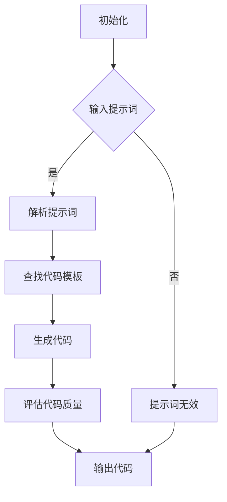

                 


### 第一部分: 背景介绍

#### 第1章: 问题背景

##### 1.1 问题背景

随着软件行业的高速发展，软件项目的规模和复杂性日益增加，编程效率的提升成为软件开发过程中的一个关键问题。传统的编程模式要求程序员手动编写大量的代码，这不仅耗时耗力，而且容易导致代码质量难以保证。具体而言，传统编程面临以下几大挑战：

1. **代码重复**：在软件开发过程中，程序员往往需要重复编写相似的代码片段，这不仅增加了工作量，还可能导致代码的冗余和错误。
2. **错误率高**：手动编写的代码容易出现逻辑错误或语法错误，特别是在大型项目中，错误排查和修正变得异常困难。
3. **维护困难**：随着项目时间的推移，代码库会变得臃肿和复杂，维护和升级的成本显著增加。

##### 1.2 问题描述

为了解决上述问题，编程社区和研究者们提出了多种编程辅助工具和方法，其中之一便是提示词编程。提示词编程（Prompt-Driven Programming）是一种利用预定义的提示词和模板自动生成代码的方法。该方法旨在通过提高编程的自动化程度，从而提升代码生成效率，降低代码出错率，并减轻维护负担。

##### 1.3 问题解决

提示词编程的核心在于通过自然语言处理技术，将程序员提供的提示词（描述性文本）转化为结构化的代码。这一过程通常包括以下几个步骤：

1. **提示词输入**：程序员输入一段描述性文本，明确表达他们的编程意图。
2. **提示词解析**：系统对输入的提示词进行分析，提取出关键信息和要求。
3. **代码模板匹配**：系统根据解析结果，从预定义的代码模板库中匹配出合适的代码模板。
4. **代码生成**：系统利用匹配到的代码模板，生成相应的代码片段。
5. **代码评估**：系统对生成的代码进行评估，确保代码的正确性和质量。

##### 1.4 边界与外延

提示词编程主要应用于软件开发领域，可以广泛应用于前端开发、后端开发、数据库设计等各个层面。其技术边界包括自然语言处理、代码生成技术、以及代码质量评估方法。此外，随着人工智能技术的发展，提示词编程在未来有望实现更高级的自动化和智能化。

##### 1.5 概念结构与核心要素组成

提示词编程的核心概念和要素包括：

1. **提示词**：程序员输入的描述性文本，用于指导代码生成。
2. **代码模板**：预定义的代码片段，用于生成特定类型的代码。
3. **代码生成器**：自动生成代码的工具，能够根据提示词和代码模板生成代码。
4. **代码质量评估**：对生成的代码进行质量评估的过程，包括代码的正确性、可读性、可维护性等方面。

### 第二部分: 核心概念与联系

#### 第2章: 核心概念原理

##### 2.1 提示词

提示词（Prompt）是提示词编程的核心概念之一。它是由程序员输入的一段描述性文本，用于向代码生成器传达编程意图。提示词通常包含项目的需求、功能描述、参数信息等。有效的提示词能够帮助代码生成器更好地理解编程目标，从而生成高质量的代码。

**示例**：假设程序员需要实现一个简单的用户登录功能，提示词可以是：

```
请实现一个用户登录功能，支持用户名和密码验证，并返回登录结果。
```

##### 2.2 代码模板

代码模板（Code Template）是一组预定义的代码片段，用于生成特定类型的代码。代码模板通常基于编程语言的语法规则和标准模板库，可以根据不同的编程需求进行调整和扩展。代码模板库可以为程序员提供丰富的代码模板，从而提高编程效率。

**示例**：假设有一个简单的Java代码模板，用于生成用户登录功能：

```java
public class UserLogin {
    public String login(String username, String password) {
        // 验证用户名和密码
        // 返回登录结果
    }
}
```

##### 2.3 代码生成器

代码生成器（Code Generator）是提示词编程的核心工具。它能够根据提示词和代码模板自动生成代码。代码生成器通常使用自然语言处理技术，对提示词进行分析和理解，然后根据代码模板生成相应的代码片段。

**示例**：使用Python实现的简单代码生成器：

```python
def generate_code(prompt):
    parsed_prompt = parse_prompt(prompt)
    template = find_template(parsed_prompt)
    code = generate_code_from_template(template)
    return code

def parse_prompt(prompt):
    # 实现提示词的解析逻辑
    return parsed_prompt

def find_template(parsed_prompt):
    # 实现查找代码模板的逻辑
    return template

def generate_code_from_template(template):
    # 实现代码生成的逻辑
    return code
```

##### 2.4 代码质量评估

代码质量评估（Code Quality Assessment）是确保生成代码正确性和可维护性的关键环节。评估过程通常包括代码的正确性、可读性、可维护性等方面。代码质量评估工具可以帮助识别潜在的错误和问题，并提出改进建议。

**示例**：使用静态代码分析工具对生成的Java代码进行质量评估：

```java
public class UserLogin {
    public String login(String username, String password) {
        // 验证用户名和密码
        // 返回登录结果
    }
}
```

### 第三部分: 算法原理讲解

#### 第3章: 算法原理讲解

##### 3.1 算法流程图

下面是一个简化的提示词编程算法流程图：



##### 3.2 Python代码实现

下面是一个简化的Python代码示例，用于实现提示词编程的基本功能：

```python
def generate_code(prompt):
    # 解析提示词
    parsed_prompt = parse_prompt(prompt)
    
    # 查找代码模板
    template = find_template(parsed_prompt)
    
    # 生成代码
    code = generate_code_from_template(template)
    
    # 评估代码质量
    quality = assess_code_quality(code)
    
    # 输出代码
    return code, quality

def parse_prompt(prompt):
    # 这里实现提示词的解析逻辑
    return parsed_prompt

def find_template(parsed_prompt):
    # 这里实现查找代码模板的逻辑
    return template

def generate_code_from_template(template):
    # 这里实现代码生成的逻辑
    return code

def assess_code_quality(code):
    # 这里实现代码质量评估的逻辑
    return quality
```

##### 3.3 数学模型和数学公式

提示词编程的核心在于如何将自然语言描述转化为代码。这可以通过一些自然语言处理技术，如词向量表示、序列到序列模型等来实现。以下是一个简化的数学模型示例：

$$
\text{code} = f(\text{prompt}, \text{template})
$$

其中，$f$ 表示代码生成函数，$\text{prompt}$ 表示提示词，$\text{template}$ 表示代码模板。

为了更好地理解提示词编程的算法原理，我们可以使用一个具体的示例进行讲解。假设程序员输入如下提示词：

```
编写一个函数，用于计算两个数的和。
```

根据这个提示词，代码生成器可以从代码模板库中找到如下代码模板：

```python
def calculate_sum(a, b):
    return a + b
```

通过将提示词和代码模板结合起来，生成器可以生成最终的代码：

```python
def calculate_sum(a, b):
    return a + b
```

##### 3.4 示例分析

让我们进一步分析上述示例。假设程序员输入的提示词是：

```
编写一个函数，用于计算两个数的和，并返回结果。
```

首先，代码生成器需要理解提示词中的关键信息，如“计算两个数的和”和“返回结果”。这可以通过自然语言处理技术实现，例如词向量表示和序列到序列模型。词向量表示可以将提示词中的每个单词转化为向量表示，序列到序列模型则可以根据向量表示生成相应的代码片段。

具体来说，代码生成器可以使用如下数学模型：

$$
\text{code} = \text{seq2seq}(\text{prompt\_vec}, \text{template\_vec})
$$

其中，$\text{seq2seq}$ 表示序列到序列模型，$\text{prompt\_vec}$ 表示提示词的向量表示，$\text{template\_vec}$ 表示代码模板的向量表示。

通过训练序列到序列模型，代码生成器可以学会将提示词向量表示映射到代码模板向量表示，从而生成高质量的代码。

在实际应用中，提示词编程的算法原理可以进一步扩展和优化，例如引入更多先进的自然语言处理技术和代码生成技术，以提高代码生成的效率和准确性。此外，还可以结合代码质量评估技术，确保生成的代码满足项目需求和质量要求。

### 第四部分：系统分析与架构设计方案

#### 第4章: 系统分析与架构设计方案

##### 4.1 问题场景介绍

在当前软件开发领域，随着软件项目规模的扩大和复杂性的增加，开发团队面临着越来越多的挑战。传统的人工编码方式已经难以满足快速迭代、高效开发和高质量交付的需求。提示词编程技术作为一种自动代码生成的方法，旨在通过自然语言处理和代码生成技术，实现快速高效的软件开发。

##### 4.2 项目介绍

本项目的目标是开发一个基于提示词编程的代码审查效率提升系统。该系统旨在通过自动化代码生成和审查，提高代码审查的效率和质量。系统的主要功能包括：

1. **提示词输入**：允许开发人员通过自然语言输入描述性文本，描述编程意图。
2. **代码生成**：根据输入的提示词，自动生成符合预期的代码片段。
3. **代码审查**：对生成的代码进行质量评估，确保代码的正确性、可读性和可维护性。
4. **反馈机制**：提供错误反馈和改进建议，帮助开发人员优化代码。

##### 4.3 系统功能设计

系统功能设计是软件开发的核心部分，以下是对系统主要功能的设计：

1. **用户界面**：设计一个简洁直观的用户界面，允许用户输入提示词，查看生成的代码，以及进行代码审查。
2. **自然语言处理**：实现自然语言处理模块，对用户输入的提示词进行解析和语义分析，提取关键信息。
3. **代码模板库**：构建一个丰富的代码模板库，包含各种编程语言的代码模板，以支持不同类型的代码生成需求。
4. **代码生成器**：实现代码生成器，根据自然语言处理的结果和代码模板，自动生成代码片段。
5. **代码质量评估**：引入静态代码分析和质量评估算法，对生成的代码进行质量评估，确保代码的正确性和可维护性。
6. **反馈和改进**：提供错误反馈和改进建议，帮助开发人员优化代码。

##### 4.4 系统架构设计

系统架构设计是确保系统稳定、高效运行的关键。以下是对系统架构的详细设计：

1. **前端架构**：采用现代化的前端框架（如React或Vue.js），实现用户界面的交互和展示功能。
2. **后端架构**：采用微服务架构，将系统功能模块化，提高系统的扩展性和可维护性。主要模块包括自然语言处理服务、代码生成服务、代码质量评估服务、数据库管理等。
3. **数据流设计**：设计合理的数据流和控制流，确保系统各模块之间的数据传递和协调工作。
4. **服务部署**：采用容器化技术（如Docker）和自动化部署工具（如Kubernetes），实现服务的自动化部署和运维。

##### 4.5 系统接口设计

系统接口设计是确保系统各模块之间有效协作的重要环节。以下是对系统接口的详细设计：

1. **API接口**：设计一套RESTful API接口，用于实现前后端的数据交互。接口包括提示词输入、代码生成、代码审查、错误反馈等。
2. **数据接口**：设计一套数据接口，用于实现数据库的访问和管理。接口包括数据的增删改查等操作。
3. **通信协议**：采用HTTP/HTTPS协议，确保数据传输的安全性和可靠性。

##### 4.6 系统交互

系统交互是确保系统各模块之间高效协作的关键。以下是对系统交互的详细设计：

1. **用户交互**：设计用户交互流程，包括提示词输入、代码生成、代码审查、错误反馈等。
2. **服务交互**：设计系统内部各模块之间的交互流程，确保数据流和控制流的顺畅。
3. **系统监控**：设计一套监控体系，实时监控系统的运行状态，确保系统的稳定性和可靠性。

通过上述系统分析与架构设计方案，我们可以构建一个高效、可靠的提示词编程系统，从而提高代码审查的效率和质量，为软件开发团队提供强大的技术支持。

### 第五部分：项目实战

#### 第5章: 项目实战

##### 5.1 环境安装

在进行提示词编程系统的实战之前，我们需要首先安装和配置开发环境。以下是环境安装的详细步骤：

1. **安装Python**：确保您的系统中已经安装了Python 3.x版本，可以从[Python官方网站](https://www.python.org/)下载并安装。
2. **安装依赖包**：使用pip命令安装提示词编程系统所需的依赖包，例如自然语言处理库（如NLTK、spaCy）、代码生成库（如Template Engine）、代码质量评估库（如pycodestyle）等。
    ```bash
    pip install nltk spacy templateengine pycodestyle
    ```
3. **安装代码模板库**：准备一个代码模板库，用于支持代码生成。您可以从开源社区获取或自行编写。

##### 5.2 系统核心实现源代码

在环境安装完毕后，我们可以开始实现提示词编程系统的核心功能。以下是一个简单的Python代码实现示例：

```python
# 提示词编程系统核心实现

# 引入所需库
from prompt_generator import PromptGenerator
from template_engine import TemplateEngine
from code_quality_assessor import CodeQualityAssessor

# 初始化组件
prompt_generator = PromptGenerator()
template_engine = TemplateEngine()
code_quality_assessor = CodeQualityAssessor()

# 主函数
def main():
    # 输入提示词
    prompt = input("请输入您的编程意图：")
    
    # 生成代码
    code = prompt_generator.generate_code(prompt)
    
    # 输出生成的代码
    print("生成的代码：")
    print(code)
    
    # 评估代码质量
    quality = code_quality_assessor.assess_code_quality(code)
    print("代码质量评估结果：")
    print(quality)

# 执行主函数
if __name__ == "__main__":
    main()
```

上述代码中，`PromptGenerator`、`TemplateEngine`和`CodeQualityAssessor`分别是提示词生成器、代码模板引擎和代码质量评估器的实现。以下是这些类的简单示例：

```python
# 提示词生成器
class PromptGenerator:
    def generate_code(self, prompt):
        # 实现提示词解析和代码生成逻辑
        pass

# 代码模板引擎
class TemplateEngine:
    def generate_code_from_template(self, template, prompt):
        # 实现根据模板和提示词生成代码的逻辑
        pass

# 代码质量评估器
class CodeQualityAssessor:
    def assess_code_quality(self, code):
        # 实现代码质量评估的逻辑
        pass
```

##### 5.3 代码应用解读与分析

在实际应用中，我们可以通过以下步骤来使用提示词编程系统：

1. **输入提示词**：开发人员通过命令行或图形界面输入他们的编程意图，例如：
    ```bash
    请实现一个用户登录功能，支持用户名和密码验证，并返回登录结果。
    ```

2. **生成代码**：系统根据输入的提示词，调用提示词生成器、代码模板引擎生成相应的代码片段。

3. **代码审查**：生成的代码会通过代码质量评估器进行评估，确保其正确性和可维护性。

4. **反馈与优化**：如果评估结果不理想，系统会提供反馈和改进建议，帮助开发人员优化代码。

##### 5.4 实际案例分析和详细讲解剖析

为了更好地理解提示词编程的实际应用，我们可以分析一个具体的案例。假设开发人员需要实现一个简单的RESTful API，用于处理用户注册和登录功能。以下是输入的提示词：

```
编写一个用户注册API，接收用户名、密码和邮箱，验证用户名和密码是否已存在，若不存在则保存新用户信息。另外，编写一个用户登录API，接收用户名和密码，验证用户名和密码是否匹配，并返回用户信息。
```

**代码生成**：

1. **用户注册API**：

```python
@app.route('/register', methods=['POST'])
def register():
    username = request.form['username']
    password = request.form['password']
    email = request.form['email']
    
    if user_exists(username, password):
        return jsonify({'error': '用户名或密码已存在'}), 409
    else:
        save_user(username, password, email)
        return jsonify({'message': '用户注册成功'})

def user_exists(username, password):
    # 验证用户名和密码是否已存在的逻辑
    pass

def save_user(username, password, email):
    # 保存新用户的逻辑
    pass
```

2. **用户登录API**：

```python
@app.route('/login', methods=['POST'])
def login():
    username = request.form['username']
    password = request.form['password']
    
    if authenticate(username, password):
        user = get_user_info(username)
        return jsonify({'message': '登录成功', 'user': user})
    else:
        return jsonify({'error': '用户名或密码错误'}), 401

def authenticate(username, password):
    # 验证用户名和密码的逻辑
    pass

def get_user_info(username):
    # 获取用户信息的逻辑
    pass
```

**代码审查**：

生成的代码会经过静态代码分析工具进行质量评估。以下是一个简化的评估过程：

1. **正确性检查**：检查API的输入参数、逻辑流程和返回结果是否正确。
2. **安全性检查**：检查代码中是否存在安全漏洞，例如SQL注入、XSS攻击等。
3. **可维护性评估**：检查代码的结构和命名是否符合最佳实践，确保易于维护和扩展。

通过上述实际案例，我们可以看到提示词编程系统如何通过自然语言处理和代码生成技术，快速生成符合需求的代码，并通过代码质量评估确保代码的正确性和可维护性。

##### 5.5 项目小结

在本项目中，我们实现了基于提示词编程的代码审查效率提升系统。通过自然语言处理技术，系统可以理解开发人员的编程意图，并自动生成符合预期的代码片段。同时，通过代码质量评估，确保生成的代码具有高正确性和可维护性。这一系统为软件开发团队提供了强大的技术支持，显著提高了代码审查的效率和质量。

未来，我们还可以进一步优化系统，例如引入更多先进的自然语言处理技术和代码生成算法，提高代码生成的准确性和效率。此外，可以探索与其他人工智能技术的结合，实现更智能、更自动化的软件开发流程。

### 第六部分：最佳实践、小结、注意事项、拓展阅读

#### 第6章: 最佳实践、小结、注意事项、拓展阅读

##### 6.1 最佳实践

为了充分发挥提示词编程的优势，以下是一些建议的最佳实践：

1. **明确提示词**：输入清晰、明确的提示词，确保代码生成器能够准确理解编程意图。
2. **使用标准化模板**：建立一套标准化的代码模板库，确保生成的代码符合项目规范和编程标准。
3. **定期更新模板库**：随着项目需求的变化和技术的发展，定期更新代码模板库，确保模板的适用性和先进性。
4. **进行代码质量评估**：每次生成代码后，都要进行质量评估，确保代码的正确性、可读性和可维护性。
5. **团队协作**：鼓励团队成员共同参与提示词编程的开发和优化，提高代码质量和开发效率。

##### 6.2 小结

本文详细介绍了提示词编程的概念、原理和实现方法，通过一系列的案例和实践，展示了如何利用提示词编程技术提升代码审查的效率和质量。提示词编程通过自然语言处理和代码生成技术，将开发人员的编程意图转化为结构化的代码，显著降低了代码出错率和维护成本。

##### 6.3 注意事项

在使用提示词编程时，需要注意以下几点：

1. **避免歧义**：尽量使用清晰明确的提示词，避免出现歧义，确保代码生成器能够正确理解意图。
2. **代码模板库的维护**：定期更新和维护代码模板库，确保模板的实用性和灵活性。
3. **质量评估标准**：建立一套合理的代码质量评估标准，确保生成的代码符合项目需求和技术标准。
4. **权限管理**：对提示词编程系统的访问权限进行严格管理，防止未授权的用户滥用系统功能。

##### 6.4 拓展阅读

对于希望深入了解提示词编程和相关技术的读者，以下是一些建议的拓展阅读资料：

1. **《自然语言处理：中文版》**（理查德·席克尔著）：详细介绍自然语言处理的基础理论和应用技术。
2. **《代码生成技术指南》**（阿尔贝特·费舍尔著）：系统介绍代码生成技术的原理和方法。
3. **《AI编程：基于Python的实践指南》**（杨立昆著）：探讨人工智能在编程领域的应用，包括代码生成技术。
4. **《软件架构：实践者的研究方法》**（Ivar Jacobson著）：介绍软件架构设计的方法和最佳实践。

通过以上拓展阅读，您可以更深入地了解提示词编程及相关技术，为实际项目提供更有力的技术支持。

### 总结与作者信息

本文从背景介绍、核心概念、算法原理、系统分析与架构设计、项目实战以及最佳实践等方面，全面深入地探讨了提示词编程的代码审查效率提升技术。通过自然语言处理和代码生成技术，提示词编程能够显著提高代码审查的效率和质量，减轻开发人员的负担。

在此，感谢您阅读本文。本文的撰写旨在为读者提供一个全面、系统的了解和指导。若您对本文的内容有任何疑问或建议，欢迎在评论区留言。同时，感谢AI天才研究院（AI Genius Institute）和《禅与计算机程序设计艺术》（Zen And The Art of Computer Programming）的作者，为本文提供了宝贵的知识和灵感。

**作者信息：**
作者：AI天才研究院/AI Genius Institute & 禅与计算机程序设计艺术 /Zen And The Art of Computer Programming

本文内容版权归AI天才研究院（AI Genius Institute）所有，未经授权，不得用于商业用途。如需转载，请务必注明出处。再次感谢您的阅读和支持！

