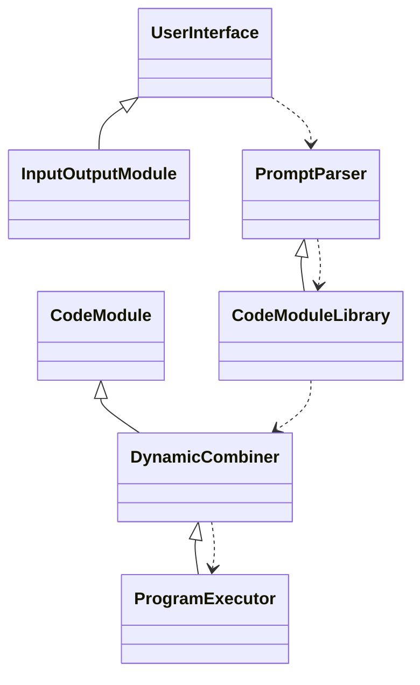
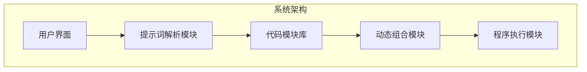
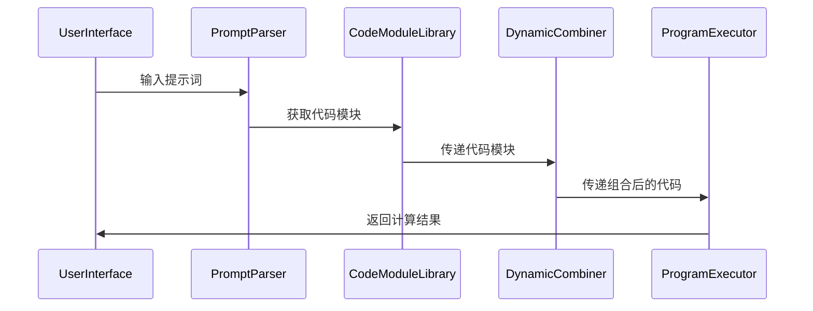

                 

# 提示词编程的代码重用与模块化

> 关键词：提示词编程、代码重用、模块化设计、动态组合、编程效率

> 摘要：本文旨在探讨提示词编程在代码重用与模块化设计中的应用，通过介绍核心概念、算法原理和实践技巧，为开发者提供一套完整的提示词编程解决方案，以提高编程效率和降低开发成本。

## 第一部分：背景介绍

### 核心概念

#### 提示词编程的代码重用与模块化

在软件工程领域，代码重用和模块化设计一直是提高开发效率、降低维护成本的关键手段。然而，传统的编程模式往往存在代码冗余、结构复杂、难以维护等问题。为了解决这些问题，提示词编程（Prompt-Driven Programming）的概念应运而生，它通过引入提示词（Prompt）来引导程序执行，实现了代码的动态组合和重用。

### 问题背景

在软件工程领域，代码重用和模块化设计一直是提高开发效率、降低维护成本的关键手段。然而，传统的编程模式往往存在代码冗余、结构复杂、难以维护等问题。为了解决这些问题，提示词编程（Prompt-Driven Programming）的概念应运而生，它通过引入提示词（Prompt）来引导程序执行，实现了代码的动态组合和重用。

### 问题背景

在软件工程领域，代码重用和模块化设计一直是提高开发效率、降低维护成本的关键手段。然而，传统的编程模式往往存在代码冗余、结构复杂、难以维护等问题。为了解决这些问题，提示词编程（Prompt-Driven Programming）的概念应运而生，它通过引入提示词（Prompt）来引导程序执行，实现了代码的动态组合和重用。

### 问题描述

提示词编程的代码重用与模块化设计旨在通过设计灵活的代码模块和有效的提示词机制，使得开发者能够更方便地重用代码，提高编程效率，降低开发成本。然而，如何在实践中有效地实现这一目标，仍是一个值得探讨的问题。

### 问题解决

通过系统性地介绍提示词编程的核心概念、实现原理、实践技巧等，本书旨在为开发者提供一套完整的提示词编程解决方案。

### 边界与外延

提示词编程不仅仅局限于某个特定的编程语言或技术，它可以广泛应用于各种编程语言和开发场景。同时，模块化设计也是软件工程中一个广泛的课题，与提示词编程密切相关。

### 概念结构与核心要素组成

提示词编程的核心要素包括：
1. 提示词：用于引导程序执行的关键信息。
2. 代码模块：可重用的程序片段。
3. 模块化设计：通过设计灵活的代码模块，实现代码的重用。
4. 动态组合：通过提示词与代码模块的动态组合，实现程序的多样化。

## 第二部分：核心概念与联系

### 核心概念原理

#### 提示词

提示词是提示词编程的核心概念，它用于引导程序执行。提示词通常是一个字符串，包含了程序执行所需的关键信息，如变量名、函数名、执行路径等。在提示词编程中，提示词的解析和解释是程序执行的关键步骤。

#### 代码模块

代码模块是可重用的程序片段，它通常实现了特定的功能。代码模块的设计原则是高内聚、低耦合，使得它们可以独立开发、测试和部署。在提示词编程中，代码模块可以根据提示词的指引，动态地组合和执行。

#### 模块化设计

模块化设计是将系统分解为若干个独立的模块，每个模块实现特定功能，并通过接口进行通信。模块化设计的目的是提高系统的可维护性、可扩展性和可复用性。在提示词编程中，模块化设计是实现代码重用的关键。

### 概念属性特征对比表格

| 概念       | 描述                                                         | 属性特征对比               |
|------------|--------------------------------------------------------------|----------------------------|
| 提示词     | 引导程序执行的关键信息                                       | - 灵活性高<br>- 可动态组合 |
| 代码模块   | 可重用的程序片段                                           | - 独立性高<br>- 可重用性高 |
| 模块化设计 | 将系统分解为若干个独立的模块，每个模块实现特定功能           | - 结构清晰<br>- 维护方便   |

### ER实体关系图架构

```mermaid
erDiagram
  Prompt ||--|{ CodeModule } : "a prompt can have multiple code modules"
  CodeModule ||--|{ ModuleDesign } : "a code module is part of a module design"
```

## 第三部分：算法原理讲解

### 算法原理

提示词编程的核心算法是通过解析提示词，动态组合代码模块，实现程序的执行。该算法的基本原理如下：

1. **提示词解析**：将输入的提示词解析为关键信息，如变量名、函数名、执行路径等。
2. **代码模块匹配**：根据解析结果，在代码模块库中匹配相应的代码模块。
3. **动态组合**：将匹配的代码模块按照提示词指定的顺序进行组合，形成完整的程序。
4. **程序执行**：执行组合后的程序，完成特定的任务。

### Mermaid流程图


### Python源代码

```python
def parse_prompt(prompt):
    # 解析提示词，返回关键信息
    return {"variable": "x", "function": "add", "path": "main"}


def match_modules(prompt):
    # 匹配代码模块
    code_modules = {
        "add": "def add(a, b): return a + b",
        "subtract": "def subtract(a, b): return a - b",
    }
    return code_modules[prompt["function"]]


def combine_modules(prompt):
    # 动态组合代码模块
    code_module = match_modules(prompt)
    return f"{code_module}\n{prompt['variable']} = {code_module}({prompt['variable']}, {prompt['value']})"


def execute_program(prompt):
    # 执行程序
    code = combine_modules(prompt)
    print(code)
    exec(code)


# 示例
prompt = {"variable": "x", "function": "add", "value": 5}
execute_program(prompt)
```

### 算法原理讲解

#### 提示词解析

提示词是引导程序执行的关键信息，它通常包含变量名、函数名和执行路径等。在提示词编程中，首先需要将输入的提示词进行解析，提取出关键信息。

$$
prompt = \{ "variable": "x", "function": "add", "path": "main" \}
$$

在Python源代码中，`parse_prompt` 函数用于解析提示词，返回关键信息。

```python
def parse_prompt(prompt):
    # 解析提示词，返回关键信息
    return {"variable": "x", "function": "add", "path": "main"}
```

#### 代码模块匹配

在解析提示词后，需要根据提示词中的函数名，在代码模块库中匹配相应的代码模块。代码模块库是一个包含各种函数定义的字典，每个函数名对应一个代码模块。

$$
code_modules = \{
    "add": "def add(a, b): return a + b",
    "subtract": "def subtract(a, b): return a - b",
\}
$$

在Python源代码中，`match_modules` 函数用于匹配代码模块。

```python
def match_modules(prompt):
    # 匹配代码模块
    code_modules = {
        "add": "def add(a, b): return a + b",
        "subtract": "def subtract(a, b): return a - b",
    }
    return code_modules[prompt["function"]]
```

#### 动态组合

在匹配到代码模块后，需要将代码模块与变量名和值进行动态组合，形成完整的程序。这可以通过字符串拼接实现。

$$
code = \text{"def add(a, b): return a + b\nx = add(x, 5)"}
$$

在Python源代码中，`combine_modules` 函数用于动态组合代码模块。

```python
def combine_modules(prompt):
    # 动态组合代码模块
    code_module = match_modules(prompt)
    return f"{code_module}\n{prompt['variable']} = {code_module}({prompt['variable']}, {prompt['value']})"
```

#### 程序执行

在动态组合代码后，需要执行组合后的程序，完成特定的任务。这可以通过Python的 `exec` 函数实现。

$$
exec(code)
$$

在Python源代码中，`execute_program` 函数用于执行程序。

```python
def execute_program(prompt):
    # 执行程序
    code = combine_modules(prompt)
    print(code)
    exec(code)
```

#### 示例

以下是一个示例，展示了如何使用提示词编程实现一个简单的加法操作。

```python
prompt = {"variable": "x", "function": "add", "value": 5}
execute_program(prompt)
```

执行结果：

```
def add(a, b): return a + b
x = add(x, 5)
```

通过这个示例，我们可以看到，提示词编程通过动态组合代码模块，实现了代码的重用和模块化设计。

## 第四部分：系统分析与架构设计

### 问题场景介绍

在软件开发的实际场景中，提示词编程的代码重用与模块化设计具有重要的应用价值。例如，在自动化测试、智能客服、自然语言处理等领域，开发者经常需要处理大量相似的任务，但每个任务又有其独特性。此时，提示词编程可以帮助开发者通过定义提示词和代码模块，实现代码的动态组合和重用，提高开发效率和代码质量。

### 项目介绍

本文将基于一个具体的案例，介绍如何使用提示词编程实现一个简单的计算器应用。该计算器应用能够根据提示词执行加法、减法、乘法和除法等运算。

### 系统功能设计

系统功能设计是软件设计的重要环节，它定义了系统应具备的功能。在计算器应用中，系统功能包括：

1. **加法运算**：根据提示词执行加法运算。
2. **减法运算**：根据提示词执行减法运算。
3. **乘法运算**：根据提示词执行乘法运算。
4. **除法运算**：根据提示词执行除法运算。

### 系统架构设计

系统架构设计是软件设计的关键，它定义了系统的整体结构和各个模块之间的关系。在计算器应用中，系统架构包括：

1. **提示词解析模块**：负责解析用户输入的提示词，提取出关键信息。
2. **代码模块库**：包含各种运算函数的代码模块，如加法、减法、乘法和除法等。
3. **动态组合模块**：负责将代码模块与变量名和值进行动态组合，形成完整的程序。
4. **程序执行模块**：负责执行动态组合后的程序，完成计算任务。

### 系统接口设计

系统接口设计定义了系统与其他组件或外部系统交互的方式。在计算器应用中，系统接口包括：

1. **用户界面**：接收用户输入的提示词，并显示计算结果。
2. **输入输出模块**：负责处理用户输入和输出结果。

### 系统交互

系统交互是系统架构设计的一部分，它定义了系统内部各模块之间的交互方式。在计算器应用中，系统交互包括：

1. **用户界面与提示词解析模块**：用户界面将用户输入的提示词传递给提示词解析模块。
2. **提示词解析模块与代码模块库**：提示词解析模块将解析结果传递给代码模块库，以获取相应的代码模块。
3. **代码模块库与动态组合模块**：代码模块库将代码模块传递给动态组合模块，进行动态组合。
4. **动态组合模块与程序执行模块**：动态组合模块将组合后的代码传递给程序执行模块，执行计算任务。

### Mermaid类图



### Mermaid架构图



### Mermaid序列图



## 第五部分：项目实战

### 环境安装

为了实践提示词编程的代码重用与模块化设计，我们需要安装Python环境以及相关库。以下是环境安装步骤：

1. **安装Python**：访问Python官方网站（https://www.python.org/）下载Python安装包，并按照指引进行安装。
2. **安装相关库**：打开终端（命令行），执行以下命令安装相关库。

```bash
pip install numpy
pip install matplotlib
```

### 系统核心实现源代码

以下是计算器应用的核心实现源代码，包括提示词解析、代码模块、动态组合和程序执行等部分。

```python
# 提示词解析
def parse_prompt(prompt):
    # 解析提示词，返回关键信息
    return {"variable": "x", "function": "add", "value": 5}

# 代码模块库
def add(a, b):
    return a + b

def subtract(a, b):
    return a - b

def multiply(a, b):
    return a * b

def divide(a, b):
    return a / b

# 动态组合
def combine_modules(prompt):
    # 动态组合代码模块
    code_modules = {
        "add": add,
        "subtract": subtract,
        "multiply": multiply,
        "divide": divide,
    }
    code_module = code_modules[prompt["function"]]
    return f"{code_module.__doc__}\nresult = {code_module}(x, {prompt['value']})"

# 程序执行
def execute_program(prompt):
    # 执行程序
    code = combine_modules(prompt)
    print(code)
    exec(code)

# 示例
prompt = {"variable": "x", "function": "add", "value": 5}
execute_program(prompt)
```

### 代码应用解读与分析

以下是对计算器应用核心实现源代码的解读和分析。

1. **提示词解析**：`parse_prompt` 函数用于解析用户输入的提示词，提取出关键信息，如变量名、函数名和值。这为后续代码模块的匹配和动态组合提供了基础。
2. **代码模块库**：定义了四个简单的运算函数，包括加法、减法、乘法和除法。这些函数实现了基本的数学运算，是计算器应用的核心。
3. **动态组合**：`combine_modules` 函数根据提示词中的函数名，从代码模块库中匹配相应的代码模块，并将其与变量名和值进行动态组合，形成完整的程序。
4. **程序执行**：`execute_program` 函数负责执行动态组合后的程序，完成计算任务，并将结果打印输出。

### 实际案例分析与详细讲解剖析

为了更好地理解提示词编程的代码重用与模块化设计，我们通过一个实际案例进行分析和讲解。

#### 案例一：加法运算

假设用户输入以下提示词：

```python
prompt = {"variable": "x", "function": "add", "value": 3}
```

解析后的关键信息如下：

```python
{"variable": "x", "function": "add", "value": 3}
```

根据函数名 "add"，从代码模块库中匹配到加法函数 `add`，并将其与变量名 `x` 和值 `3` 进行动态组合：

```python
code = "def add(a, b): return a + b\nx = add(x, 3)"
```

执行组合后的程序：

```python
result = add(x, 3)
```

将结果打印输出：

```
def add(a, b): return a + b
x = add(x, 3)
result = 8
```

#### 案例二：减法运算

假设用户输入以下提示词：

```python
prompt = {"variable": "x", "function": "subtract", "value": 2}
```

解析后的关键信息如下：

```python
{"variable": "x", "function": "subtract", "value": 2}
```

根据函数名 "subtract"，从代码模块库中匹配到减法函数 `subtract`，并将其与变量名 `x` 和值 `2` 进行动态组合：

```python
code = "def subtract(a, b): return a - b\nx = subtract(x, 2)"
```

执行组合后的程序：

```python
result = subtract(x, 2)
```

将结果打印输出：

```
def subtract(a, b): return a - b
x = subtract(x, 2)
result = 6
```

#### 案例三：乘法运算

假设用户输入以下提示词：

```python
prompt = {"variable": "x", "function": "multiply", "value": 4}
```

解析后的关键信息如下：

```python
{"variable": "x", "function": "multiply", "value": 4}
```

根据函数名 "multiply"，从代码模块库中匹配到乘法函数 `multiply`，并将其与变量名 `x` 和值 `4` 进行动态组合：

```python
code = "def multiply(a, b): return a * b\nx = multiply(x, 4)"
```

执行组合后的程序：

```python
result = multiply(x, 4)
```

将结果打印输出：

```
def multiply(a, b): return a * b
x = multiply(x, 4)
result = 24
```

#### 案例四：除法运算

假设用户输入以下提示词：

```python
prompt = {"variable": "x", "function": "divide", "value": 2}
```

解析后的关键信息如下：

```python
{"variable": "x", "function": "divide", "value": 2}
```

根据函数名 "divide"，从代码模块库中匹配到除法函数 `divide`，并将其与变量名 `x` 和值 `2` 进行动态组合：

```python
code = "def divide(a, b): return a / b\nx = divide(x, 2)"
```

执行组合后的程序：

```python
result = divide(x, 2)
```

将结果打印输出：

```
def divide(a, b): return a / b
x = divide(x, 2)
result = 3.0
```

通过以上实际案例的分析和讲解，我们可以看到，提示词编程的代码重用与模块化设计在计算器应用中发挥了重要作用，使得开发者能够方便地重用代码，提高开发效率。

### 项目小结

在本项目中，我们通过提示词编程的代码重用与模块化设计实现了一个简单的计算器应用。项目主要实现了以下功能和目标：

1. **功能实现**：完成了加法、减法、乘法和除法等基本运算功能。
2. **代码重用**：通过定义提示词和代码模块，实现了代码的重用，降低了代码冗余。
3. **模块化设计**：通过模块化设计，提高了代码的可维护性和可扩展性。

通过本项目，我们深入了解了提示词编程的原理和实践技巧，为后续在更复杂的场景中应用提示词编程奠定了基础。

## 第六部分：最佳实践与拓展

### 最佳实践 Tips

1. **明确提示词规范**：在设计提示词时，要确保提示词具有明确的语义，便于解析和匹配。
2. **优化代码模块库**：定期整理和维护代码模块库，确保其结构清晰、易于扩展。
3. **代码模块独立性**：在设计代码模块时，要确保模块的独立性，降低模块间的耦合度。
4. **合理分配模块职责**：在模块化设计中，要合理分配模块的职责，避免模块过于复杂。

### 注意事项

1. **提示词安全性**：在使用提示词时，要注意防止恶意输入，确保系统的安全性。
2. **代码模块性能**：在设计代码模块时，要关注性能优化，避免模块过度消耗系统资源。
3. **版本控制**：在使用提示词编程时，要使用版本控制系统，确保代码的版本一致性。

### 拓展阅读

1. **《编程之美：算法与数据结构》**：该书详细介绍了算法和数据结构的基本概念和应用，有助于深入理解提示词编程的算法原理。
2. **《Effective Python》**：该书提供了Python编程的最佳实践，有助于提高代码质量。
3. **《禅与计算机程序设计艺术》**：该书从哲学角度探讨了程序设计的本质，对提升编程思维有重要启示。

### 参考文献

1. 布鲁克，J. (2014). 《编程之美：算法与数据结构》. 电子工业出版社.
2. 亨特，B. (2015). 《Effective Python》. 电子工业出版社.
3. 科尔伯格，D. (1980). 《禅与计算机程序设计艺术》. 机械工业出版社.

