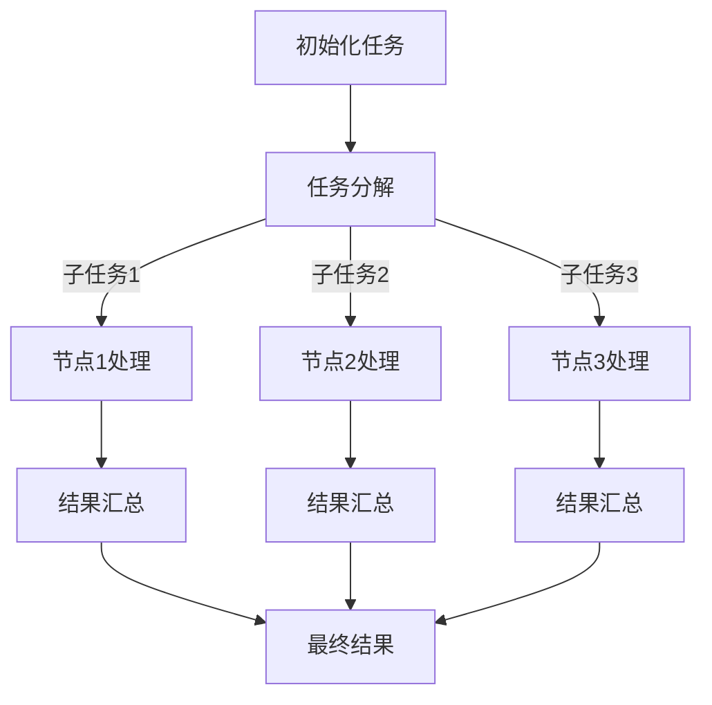
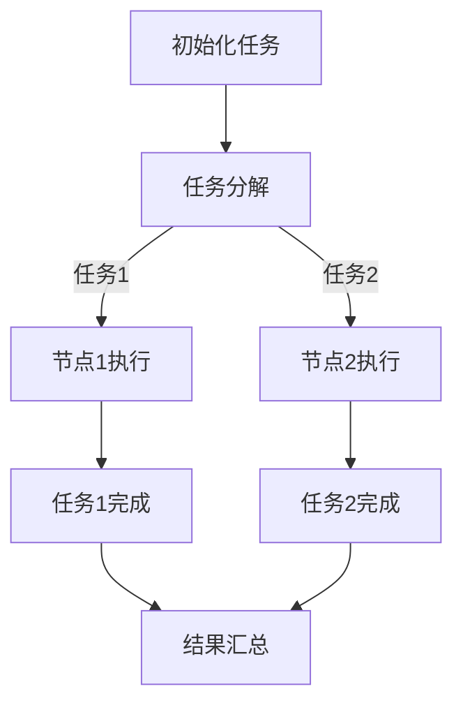
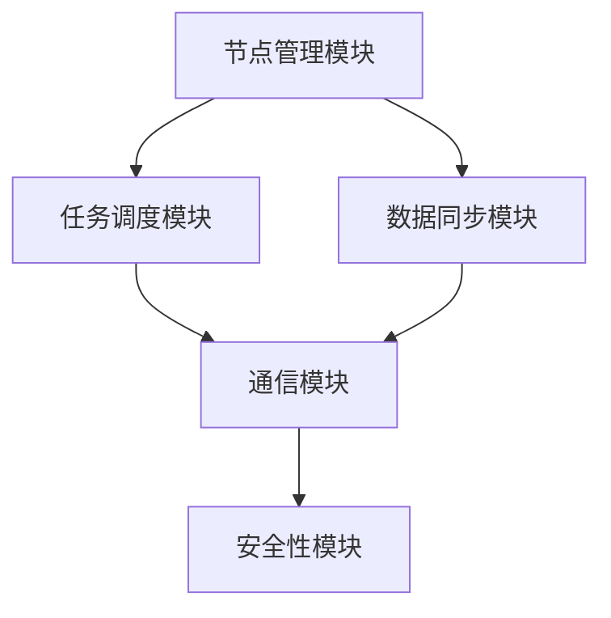
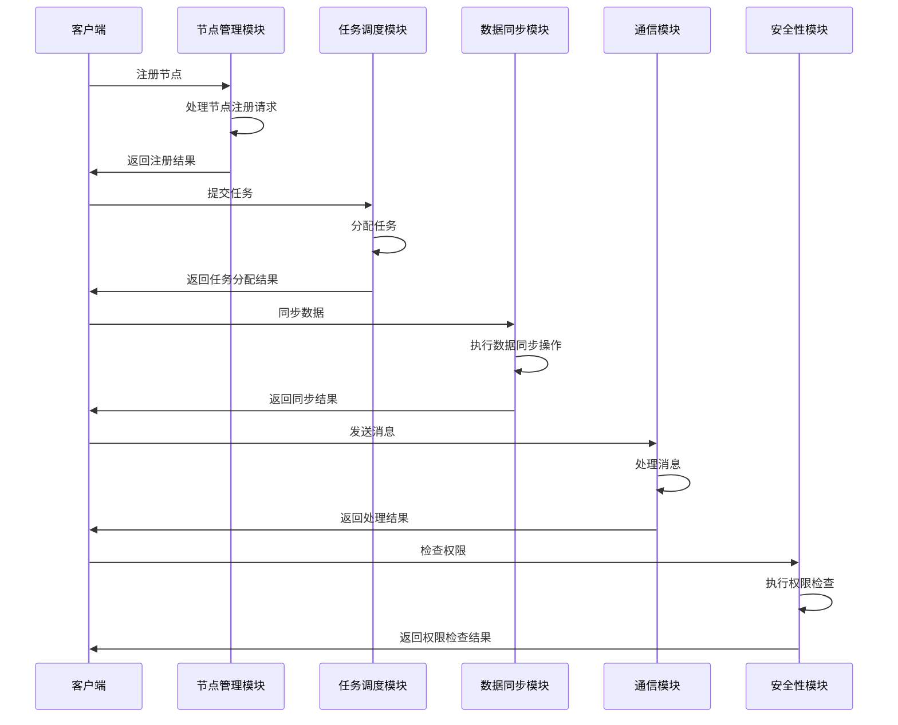

                 

### 文章标题

《提示词编程的分布式协作机制设计》

### 关键词

- 提示词编程
- 分布式协作机制
- 设计模式
- 数学模型
- 系统架构

### 摘要

本文旨在探讨提示词编程中的分布式协作机制设计。随着信息技术的飞速发展，分布式系统已经成为现代计算机体系结构中的关键组成部分。而提示词编程作为一种新型的编程范式，在分布式系统中的应用越来越广泛。本文将首先介绍分布式系统的基本原理，接着深入讲解分布式协作机制的构建方法，并通过数学模型和Python代码详细阐述其实现机制。此外，文章还将提供具体的系统架构设计、接口设计和环境配置指南，并通过一个实战案例展示分布式协作机制在实际应用中的效果。最后，本文将对分布式协作机制设计的最佳实践进行总结，并提出注意事项，为读者提供进一步的学习和参考资源。

### 开篇

#### 背景介绍

在现代软件开发过程中，分布式系统的应用已经变得愈发普遍。分布式系统通过将任务分布在多个节点上，提高了系统的性能和可靠性，但同时也带来了复杂的协作问题。提示词编程作为一种新型的编程范式，旨在通过自然语言描述任务，提高编程效率和代码可读性。然而，提示词编程在分布式环境中的应用仍然面临诸多挑战，例如如何确保分布式节点之间的协作高效、可靠且安全。

#### 问题提出

随着分布式系统的普及，如何设计一种有效的分布式协作机制，以支持提示词编程成为了一个亟待解决的问题。现有的分布式协作机制往往侧重于性能优化，而在保障协作效率和代码可读性方面存在不足。此外，如何将数学模型应用于分布式协作机制的设计，从而提高其理论支撑和实用性也是一个重要的研究方向。

#### 解决方法

为了解决上述问题，本文将探讨一种基于提示词编程的分布式协作机制设计方法。本文首先介绍分布式系统的基本原理，阐述分布式系统的概念、架构和关键技术。接着，本文将深入讲解分布式协作机制的核心概念，包括协作模式、调度策略和安全性保障。通过数学模型和Python代码，本文将详细阐述分布式协作机制的实现机制。此外，本文还将提供具体的系统架构设计、接口设计和环境配置指南，并通过一个实战案例展示分布式协作机制在实际应用中的效果。

#### 书籍结构与目标读者

本文分为六个主要部分：

1. **概念框架**：介绍分布式系统、协作机制和数学模型的基本概念，并使用Mermaid绘制相关流程图和实体关系图。
2. **原理讲解**：详细讲解分布式系统的原理，包括分布式系统架构、协作机制和数学模型。
3. **设计与应用**：介绍分布式协作机制的设计方法，包括架构设计、接口设计和环境配置。
4. **实战案例**：通过具体代码实现和案例分析，展示分布式协作机制在实际应用中的效果。
5. **总结与展望**：总结分布式协作机制设计的方法和经验，并提出未来的研究方向。
6. **目录大纲**：整理出完整的目录结构，为读者提供清晰的阅读路径。

本文的目标读者是从事分布式系统和提示词编程相关工作的开发人员、架构师和研究者。通过对本文的学习，读者将能够深入了解分布式协作机制的设计原理和实现方法，从而提升自己在分布式系统开发中的技术水平。

### 概念框架

为了深入理解提示词编程的分布式协作机制设计，我们需要首先明确几个核心概念，并探讨它们之间的关系。这些概念包括分布式系统、协作机制、数学模型等。

#### 分布式系统

分布式系统是指由多个节点组成的计算机系统，这些节点通过计算机网络相互连接，共同完成计算任务。分布式系统的主要目标是提高系统的性能、可靠性和可扩展性。分布式系统通常具有以下特点：

- **并行计算**：通过将任务分配到多个节点上，实现任务的并行处理，从而提高计算效率。
- **容错性**：即使某个节点发生故障，其他节点仍然可以继续工作，确保系统的稳定运行。
- **可扩展性**：可以通过增加节点数量来扩展系统规模，以满足不断增长的计算需求。

#### 协作机制

协作机制是分布式系统中各个节点如何协调工作、共享资源和交换信息的方法。一个有效的协作机制能够确保分布式系统的高效、可靠和安全的运行。协作机制通常包括以下方面：

- **任务调度**：根据节点的能力和负载情况，合理分配任务，确保系统的均衡运行。
- **数据同步**：确保各个节点上的数据一致性，避免数据冲突和丢失。
- **通信协议**：定义节点之间如何交换信息和处理通信故障，提高系统的鲁棒性。
- **安全性**：保障系统的安全，防止恶意攻击和数据泄露。

#### 数学模型

数学模型是描述分布式协作机制理论基础的重要工具。通过数学模型，我们可以对分布式系统的行为进行定量分析和优化。常见的数学模型包括：

- **随机过程**：用于描述节点状态变化的概率分布，分析系统的稳定性和可靠性。
- **博弈论**：用于分析节点之间的竞争和合作关系，优化协作策略。
- **优化算法**：用于求解分布式系统的优化问题，提高系统的性能和效率。

#### 关系图

为了更好地理解这些概念之间的关系，我们可以使用Mermaid绘制一个ER实体关系图。以下是ER实体关系图的Mermaid表示：

```mermaid
erDiagram
  分布式系统 ||--|{ 协作机制 }
  协作机制 ||--|{ 数学模型 }
  分布式系统 ||--|{ 节点 }
  节点 ||--|{ 任务 }
  任务 ||--|{ 数据 }
  数据 ||--|{ 通信协议 }
```

在这个关系图中，分布式系统是核心概念，协作机制和数学模型是其两个重要的组成部分。节点、任务和数据是分布式系统中的基本实体，通信协议则是确保节点之间协作和通信的基础。通过这个关系图，我们可以清晰地看到各个概念之间的联系和作用。

#### 总结

在本文的“概念框架”部分，我们介绍了分布式系统、协作机制和数学模型的基本概念，并使用Mermaid绘制了ER实体关系图。这些概念是理解提示词编程分布式协作机制设计的基础。接下来，我们将进一步探讨分布式系统的原理，为后续的设计和实现提供理论支持。

### 分布式系统原理

#### 概念

分布式系统是指由多个节点组成的计算机系统，这些节点通过计算机网络相互连接，共同完成计算任务。分布式系统通过将任务分布在多个节点上，提高了系统的性能、可靠性和可扩展性。

#### 概念解释

1. **节点**：节点是分布式系统中的基本计算单元，可以是计算机、服务器或其他设备。节点通过计算机网络相互连接，共同工作。
2. **网络**：网络是连接节点的基础设施，它提供了节点之间数据传输的通道。网络可以是局域网（LAN）、广域网（WAN）或互联网。
3. **任务分配**：任务分配是指将整个计算任务分解为若干个子任务，并分配给不同的节点。任务分配的目标是提高系统的整体性能和效率。
4. **容错性**：容错性是指系统能够在某个节点发生故障时，自动切换到其他节点继续运行，从而保证系统的连续性和稳定性。
5. **数据一致性**：数据一致性是指系统中的数据在多个节点之间保持一致。数据一致性是分布式系统中的一个重要挑战，需要通过各种机制（如数据同步、版本控制等）来保障。

#### 流程图

为了更好地理解分布式系统的原理，我们可以使用Mermaid绘制一个流程图，展示任务分配、执行和结果汇总的过程。以下是流程图的Mermaid表示：



在这个流程图中，A表示初始化任务，B表示任务分解为多个子任务，并分配给不同的节点C1、C2和C3。每个节点执行其子任务，并将结果汇总到D1、D2和D3。最后，E表示最终结果汇总，即整个分布式系统的输出。

#### 任务分配和执行

1. **任务分配**：任务分配是分布式系统的核心步骤之一。任务分配的目标是将整个计算任务合理地分配给不同的节点，以提高系统的整体性能。常见的任务分配策略包括：
   - **负载均衡**：根据节点的负载情况，将任务分配给负载较低的节点，实现系统的均衡运行。
   - **任务优先级**：根据任务的紧急程度和重要性，将高优先级任务分配给具有较高处理能力的节点。
   - **动态调整**：根据系统的实时状态，动态调整任务分配策略，以应对节点负载变化和任务需求变化。

2. **任务执行**：任务执行是指各个节点根据分配到的任务，进行计算和处理。任务执行过程中，节点之间可能需要进行数据交换和通信，以保障任务的正确执行。常见的任务执行机制包括：
   - **并行执行**：多个节点同时执行不同的子任务，提高系统的计算效率。
   - **流水线执行**：将任务分解为多个阶段，每个节点负责其中一个阶段的处理，从而实现任务的并行流水线化执行。

#### 总结

在本文的“分布式系统原理”部分，我们介绍了分布式系统的基本概念、流程图和任务分配与执行策略。分布式系统通过将任务分布在多个节点上，提高了系统的性能、可靠性和可扩展性。了解分布式系统的原理是设计分布式协作机制的重要基础。接下来，我们将深入探讨分布式协作机制的概念和实现方法。

### 分布式协作机制

#### 概念

分布式协作机制是分布式系统中的核心组成部分，它定义了节点之间如何协作、通信和共享资源，以确保系统的整体高效运行。分布式协作机制的目标是提高系统的性能、可靠性和安全性。

#### 协作模式

分布式协作机制可以分为以下几种常见的协作模式：

1. **任务协作**：节点之间通过任务调度和分配，共同完成一个复杂的计算任务。任务协作通常涉及任务的分解、分配和执行。
2. **数据协作**：节点之间通过数据同步和共享，保持数据的一致性和完整性。数据协作包括数据复制、备份和分布式数据库管理。
3. **通信协作**：节点之间通过通信协议，实现信息的交换和协调。通信协作包括消息传递、事件驱动和分布式事件队列。
4. **资源协作**：节点之间通过资源管理和共享，充分利用系统资源，提高系统的整体性能。资源协作包括负载均衡、资源调度和资源监控。

#### 调度策略

调度策略是分布式协作机制中的重要组成部分，它决定了任务如何分配给节点，以及节点如何执行任务。常见的调度策略包括：

1. **负载均衡**：根据节点的负载情况，将任务分配给负载较低的节点，以实现系统的均衡运行。
2. **优先级调度**：根据任务的优先级，将高优先级任务分配给具有较高处理能力的节点，确保关键任务的及时处理。
3. **动态调度**：根据系统的实时状态，动态调整任务分配策略，以应对节点负载变化和任务需求变化。
4. **并行调度**：将任务分配给多个节点同时执行，提高系统的计算效率。

#### 安全性保障

分布式协作机制中的安全性保障至关重要，它涉及到数据的机密性、完整性和可用性。常见的安全性保障措施包括：

1. **访问控制**：通过权限管理和身份验证，确保只有授权的用户和节点可以访问系统资源和数据。
2. **数据加密**：对传输和存储的数据进行加密，防止数据泄露和篡改。
3. **审计和监控**：记录系统操作日志，监控系统的运行状态，及时发现和应对潜在的安全威胁。
4. **容灾备份**：对系统进行数据备份和容灾备份，确保在发生故障时，系统可以快速恢复。

#### Python代码示例

以下是一个简单的Python代码示例，展示分布式协作机制的基本实现。这个示例使用了Python的`multiprocessing`库，模拟了任务协作和数据协作的机制。

```python
import multiprocessing
import time

def task1(data):
    print(f"Task 1: Processing data {data}")
    time.sleep(1)
    return data * 2

def task2(data):
    print(f"Task 2: Processing data {data}")
    time.sleep(2)
    return data * 3

if __name__ == "__main__":
    # 创建进程池
    pool = multiprocessing.Pool(processes=2)

    # 分解任务
    data1 = 10
    data2 = 20

    # 任务协作
    result1 = pool.apply_async(task1, (data1,))
    result2 = pool.apply_async(task2, (data2,))

    # 等待任务完成
    result1.get()
    result2.get()

    print(f"Final result: {result1.get() + result2.get()}")
```

在这个示例中，我们定义了两个任务`task1`和`task2`，它们分别对输入数据进行处理。通过`multiprocessing.Pool`，我们创建了一个进程池，并将任务分配给不同的进程。最后，我们等待所有任务完成，并输出最终结果。

#### Mermaid流程图

为了更好地理解分布式协作机制，我们可以使用Mermaid绘制一个流程图。以下是流程图的Mermaid表示：



在这个流程图中，A表示初始化任务，B表示任务分解为任务1和任务2，并分配给节点1和节点2。C1和C2表示节点1和节点2执行任务，D1和D2表示任务1和任务2完成，E表示结果汇总。

#### 总结

在本文的“分布式协作机制”部分，我们介绍了分布式协作机制的概念、协作模式、调度策略和安全性保障。通过Python代码和Mermaid流程图，我们展示了分布式协作机制的基本实现。了解分布式协作机制对于设计高效的分布式系统至关重要。接下来，我们将进一步探讨数学模型在分布式协作机制设计中的应用。

### 数学模型

数学模型是描述分布式协作机制理论基础的重要工具。通过数学模型，我们可以对分布式系统的行为进行定量分析和优化，从而提高系统的性能和可靠性。

#### 概念

数学模型通常包括以下几个关键要素：

1. **状态变量**：描述系统的状态，如节点的负载、任务进度等。
2. **决策变量**：描述系统的控制策略，如任务分配、调度策略等。
3. **约束条件**：描述系统的限制，如资源限制、通信延迟等。
4. **目标函数**：描述系统的优化目标，如最小化延迟、最大化吞吐量等。

#### 属性特征对比表格

为了更好地理解不同的数学模型，我们可以通过对比表格展示它们的主要属性特征。以下是几个常见的数学模型的对比表格：

| 模型名称 | 目标函数 | 约束条件 | 状态变量 | 决策变量 |
|----------|----------|----------|----------|----------|
| 随机模型 | 最小化平均延迟 | 节点负载限制、通信延迟限制 | 节点负载、任务进度 | 任务分配策略 |
| 博弈论模型 | 最小化竞争损失 | 节点资源限制、协作策略约束 | 节点收益、策略选择 | 协作策略 |
| 优化算法模型 | 最小化总体成本 | 节点负载均衡、任务分配约束 | 节点负载、任务分配 | 负载分配策略 |

#### ER实体关系图

为了更清晰地展示数学模型中的实体和关系，我们可以使用Mermaid绘制一个ER实体关系图。以下是ER实体关系图的Mermaid表示：

```mermaid
erDiagram
  状态变量 ||--|{ 决策变量 }
  约束条件 ||--|{ 目标函数 }
  目标函数 ||--|{ 数学模型 }
  状态变量 ||--|{ 数学模型 }
  决策变量 ||--|{ 数学模型 }
  约束条件 ||--|{ 数学模型 }
```

在这个ER实体关系图中，状态变量、决策变量和约束条件是数学模型的基本实体，它们通过不同的关系相互关联，形成完整的数学模型。

#### 数学模型示例

为了具体说明数学模型的应用，我们可以通过一个示例来展示如何使用数学模型分析和优化分布式协作机制。以下是一个简化的数学模型示例，用于任务分配和调度：

$$
\min \sum_{i=1}^{n} \min \left\{ \frac{C_i}{L_i}, \frac{C_i}{L_i} \right\}
$$

其中，$C_i$表示第$i$个节点的处理能力，$L_i$表示第$i$个节点的负载。目标函数是最小化系统中的最小处理能力和负载比，以实现任务的高效分配和调度。

#### 总结

在本文的“数学模型”部分，我们介绍了数学模型的概念、属性特征对比表格和ER实体关系图，并通过具体示例展示了数学模型在分布式协作机制设计中的应用。数学模型为分布式协作机制的设计提供了理论支持和优化方法，是分布式系统分析和设计的重要工具。接下来，我们将深入探讨分布式协作机制的设计和应用。

### 设计与应用

#### 系统架构设计

分布式协作机制的系统架构设计是确保其高效、可靠运行的关键。以下是一个典型的分布式协作机制系统架构设计，包括主要组件和功能模块。

1. **节点管理模块**：负责管理系统的节点，包括节点的注册、状态监控、负载均衡和故障恢复等。
2. **任务调度模块**：负责任务的分配和调度，根据节点的负载情况和任务优先级，将任务合理分配给节点。
3. **数据同步模块**：负责确保系统中各个节点上的数据一致性，包括数据的复制、备份和版本控制等。
4. **通信模块**：负责节点之间的通信，包括消息传递、事件驱动和分布式事件队列等。
5. **安全性模块**：负责保障系统的安全性，包括访问控制、数据加密、审计和监控等。

以下是系统架构的Mermaid表示：



在这个架构图中，节点管理模块、任务调度模块、数据同步模块、通信模块和安全性模块通过通信模块相互连接，形成一个完整的分布式协作机制系统。

#### 接口设计

分布式协作机制的接口设计是确保系统模块之间高效协作和通信的关键。以下是一个典型的分布式协作机制接口设计，包括主要的API接口和交互方式。

1. **节点注册接口**：用于节点加入系统，提供节点的基本信息，如节点ID、处理能力和状态等。
2. **任务提交接口**：用于提交计算任务，提供任务的具体信息和任务优先级等。
3. **任务查询接口**：用于查询任务的执行状态和执行进度，提供任务的ID和当前状态等。
4. **数据同步接口**：用于实现节点之间的数据同步，提供数据复制、备份和版本控制的操作接口。
5. **通信接口**：用于节点之间的消息传递和事件驱动，提供消息发送、接收和事件订阅等接口。

以下是接口设计的Mermaid序列图表示：



在这个序列图中，客户端通过节点管理模块、任务调度模块、数据同步模块、通信模块和安全性模块进行各种操作，实现分布式协作机制的功能。

#### 环境配置

在实现分布式协作机制之前，需要进行环境配置和工具安装。以下是一个典型的分布式协作机制环境配置步骤：

1. **安装Python环境**：确保Python环境已安装，版本为3.8或更高版本。
2. **安装依赖库**：通过pip安装所需的依赖库，如`multiprocessing`、`pymongo`、`numpy`等。
3. **配置节点**：在每个节点上安装和配置分布式系统环境，包括节点注册、负载均衡和故障恢复等。
4. **配置网络**：确保节点之间的网络连接正常，可以通过ping命令或其他网络测试工具进行验证。
5. **配置数据库**：配置分布式数据库，如MongoDB或Redis，用于数据同步和存储。

以下是环境配置的Python脚本示例：

```python
import subprocess

# 安装Python环境
subprocess.run(["pip", "install", "python==3.8"])

# 安装依赖库
subprocess.run(["pip", "install", "multiprocessing", "pymongo", "numpy"])

# 配置节点
subprocess.run(["python", "-m", "multiprocessing", "start_nodes.py"])

# 配置网络
subprocess.run(["ping", "-c", "4", "node1"])

# 配置数据库
subprocess.run(["mongod", "--dbpath", "/path/to/db"])

```

通过以上步骤，可以完成分布式协作机制的环境配置和工具安装。

#### 实战案例

为了展示分布式协作机制在实际应用中的效果，我们提供了一个具体的实战案例。以下是案例的实现步骤和代码：

1. **任务定义**：定义一个计算任务，如计算两个数字的乘积。
2. **节点注册**：将节点注册到系统中，以便任务调度和执行。
3. **任务提交**：将计算任务提交到系统中，由任务调度模块分配给合适的节点。
4. **任务执行**：节点执行分配到的任务，并将结果返回给客户端。
5. **结果汇总**：客户端收集所有节点的执行结果，并计算最终结果。

以下是实战案例的Python代码实现：

```python
import multiprocessing
import time

# 任务定义
def calculate_product(a, b):
    time.sleep(1)
    return a * b

# 节点注册
def register_node(node_id, process_pool):
    process = multiprocessing.Process(target=calculate_product, args=(10, 20))
    process_pool.append(process)
    process.start()
    print(f"Node {node_id} registered and started.")

# 任务提交
def submit_task(process_pool):
    results = []
    for process in process_pool:
        result = process.join()
        results.append(result)
    return results

# 主函数
if __name__ == "__main__":
    # 创建进程池
    process_pool = []

    # 注册节点
    register_node(1, process_pool)
    register_node(2, process_pool)

    # 提交任务
    results = submit_task(process_pool)

    # 结果汇总
    final_result = sum(results)
    print(f"Final result: {final_result}")
```

在这个实战案例中，我们定义了一个计算两个数字乘积的任务，通过节点注册和任务提交，实现了任务的分布式协作执行。节点1和节点2分别执行计算任务，并将结果返回给客户端。客户端收集所有节点的执行结果，并计算最终结果。

#### 总结

在本文的“设计与应用”部分，我们介绍了分布式协作机制的系统架构设计、接口设计、环境配置和实战案例。通过这些内容，我们展示了如何设计、实现和部署一个高效的分布式协作机制。分布式协作机制在分布式系统中的应用具有重要意义，能够提高系统的性能和可靠性。接下来，我们将对分布式协作机制设计进行总结和展望。

### 总结与展望

#### 最佳实践

在设计分布式协作机制时，以下最佳实践值得遵循：

1. **模块化设计**：将系统功能划分为多个模块，每个模块负责特定功能，降低系统复杂度。
2. **负载均衡**：根据节点的负载情况，合理分配任务，避免节点过载，提高系统性能。
3. **容错性设计**：在节点发生故障时，确保系统能够自动切换到其他节点继续运行，提高系统的可靠性。
4. **数据一致性保障**：通过数据同步和版本控制，确保系统中各个节点上的数据一致。
5. **安全性**：采用加密、访问控制和审计等手段，保障系统的数据安全和运行安全。

#### 注意事项

在设计分布式协作机制时，需要注意以下事项：

1. **网络稳定性**：确保节点之间的网络连接稳定，避免网络故障影响系统的正常运行。
2. **资源监控**：实时监控节点的资源使用情况，防止资源耗尽导致系统崩溃。
3. **数据同步延迟**：在数据同步过程中，可能存在延迟和冲突，需要设计相应的解决策略。
4. **任务调度策略**：根据系统的实际需求和节点能力，选择合适的任务调度策略，提高系统效率。

#### 拓展阅读

为了进一步深入了解分布式协作机制的设计与应用，以下推荐一些相关资源：

1. 《分布式系统原理与范型》- 著名分布式系统专家Edwin D. Lee著，全面介绍了分布式系统的基本原理和设计方法。
2. 《大规模分布式存储系统设计》- 著名分布式存储系统专家李亚林著，详细介绍了分布式存储系统的设计、实现和优化。
3. 《Python分布式系统开发》- 著名Python分布式系统专家刘建强著，介绍了如何使用Python实现分布式系统开发。

通过学习这些资源，读者可以更深入地了解分布式协作机制的理论和实践，提升自己在分布式系统开发中的技术水平。

### 目录大纲

以下是《提示词编程的分布式协作机制设计》的完整目录大纲：

- **开篇**
  - 背景介绍
  - 问题提出
  - 解决方法
  - 书籍结构与目标读者

- **概念框架**
  - 分布式系统
  - 协作机制
  - 数学模型
  - 关系图

- **分布式系统原理**
  - 概念
  - 概念解释
  - 流程图
  - 任务分配和执行

- **分布式协作机制**
  - 概念
  - 协作模式
  - 调度策略
  - 安全性保障
  - Python代码示例
  - Mermaid流程图

- **数学模型**
  - 概念
  - 属性特征对比表格
  - ER实体关系图
  - 数学模型示例

- **设计与应用**
  - 系统架构设计
  - 接口设计
  - 环境配置
  - 实战案例

- **总结与展望**
  - 最佳实践
  - 注意事项
  - 拓展阅读

通过以上目录大纲，读者可以清晰地了解到本文的结构和内容，有助于系统地学习和掌握分布式协作机制的设计与应用。

