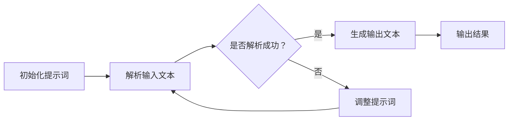
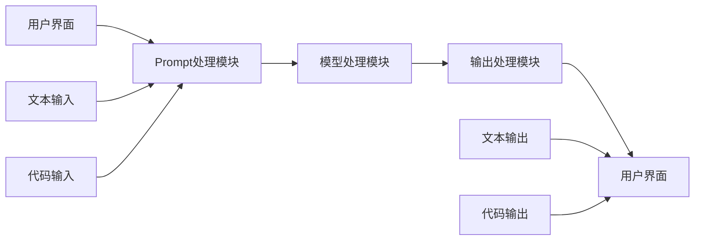
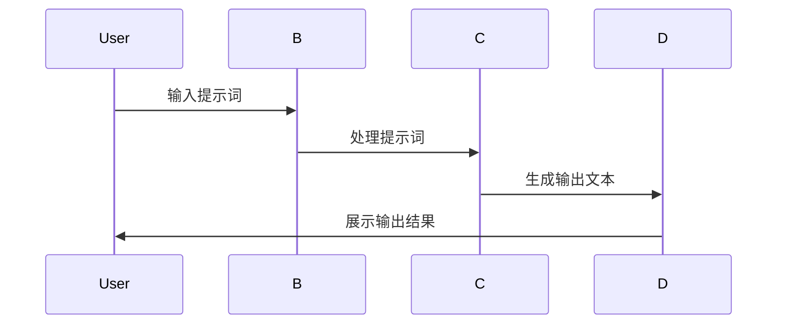
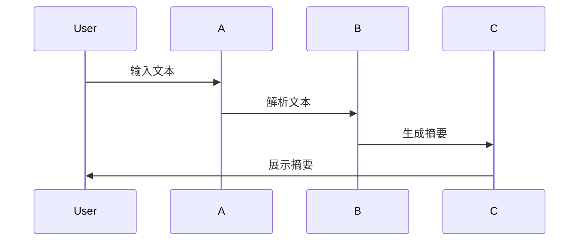

                 


### 《提示词编程的协同工作流程设计》

关键词：提示词编程、协同工作、流程设计、算法原理、系统架构

摘要：本文旨在深入探讨提示词编程的协同工作流程设计，从背景介绍、核心概念与联系、算法原理讲解、系统分析与架构设计、项目实战、最佳实践 tips、小结、注意事项、拓展阅读等方面，全面解析提示词编程在协同工作中的应用及其设计原则。

## 1. 背景介绍

### 1.1 提示词编程的定义

提示词编程（Prompt Engineering）是一种利用自然语言处理（NLP）技术，通过设计特定格式的提示词（prompt），引导模型生成期望输出的方法。其核心思想是将人类语言的表达方式与机器学习模型相融合，使模型能够更好地理解和响应人类的指令。

### 1.2 应用场景

提示词编程广泛应用于文本生成、问答系统、自动摘要、机器翻译等领域。在协同工作中，它可以帮助团队成员更高效地沟通和协作，实现自动化任务处理，提高工作效率。

### 1.3 重要性

随着人工智能技术的快速发展，提示词编程已经成为自然语言处理领域的关键技术之一。它不仅能够提升模型的性能，还能够降低对专业知识的依赖，使更多的人能够参与到人工智能应用的开发中来。

## 2. 核心概念与联系

### 2.1 提示词编程的基本概念

- **提示词（Prompt）**：用于引导模型生成输出的文本或代码片段。
- **模型（Model）**：如GPT、BERT等预训练的深度学习模型。
- **输入（Input）**：模型接收的原始文本或数据。
- **输出（Output）**：模型生成的期望结果。

### 2.2 核心概念属性特征对比表格

| 特征         | 提示词         | 模型         | 输入         | 输出         |
| ------------ | -------------- | ------------ | ------------ | ------------ |
| 定义         | 引导模型生成   | 预训练的深度学习模型 | 原始文本或数据 | 期望结果     |
| 影响因素     | 提示词格式、语言风格 | 模型大小、训练数据 | 文本长度、语义 | 输出质量     |
| 目标         | 提升生成效果   | 提高性能、适应多种任务 | 理解输入语义   | 生成期望输出 |

### 2.3 ER实体关系图

```mermaid
erDiagram
    Aptides ||--|{ Models }| BModel
    Models ||--|{ Inputs }| BInput
    Inputs ||--|{ Outputs }| BOutput
```

## 3. 算法原理讲解

### 3.1 提示词编程算法流程图



### 3.2 算法原理与数学模型

提示词编程的核心算法可以表示为：

$$
Output = Model(Input + Prompt)
$$

其中，`Input` 为输入文本，`Prompt` 为提示词，`Model` 为预训练的深度学习模型。

### 3.3 算法举例说明

假设我们有一个输入文本：“编写一个Python函数，实现两个数的加法。” 我们可以设计如下提示词：

```python
"请编写一个名为'add'的Python函数，接收两个整数参数a和b，返回它们的和。"
```

使用GPT模型处理后，我们得到的输出文本可能是：

```python
def add(a, b):
    return a + b
```

## 4. 系统分析与架构设计

### 4.1 问题场景介绍

假设我们开发一个基于提示词编程的团队协作工具，需要实现以下功能：

- 文本生成：根据提示词生成代码、文章等文本内容。
- 问答系统：根据用户输入的提问，生成答案。
- 自动摘要：从长文本中提取关键信息，生成摘要。

### 4.2 系统功能设计

#### 领域模型类图

```mermaid
classDiagram
    User <|-- Prompt
    User <|-- Model
    Prompt <|-- TextPrompt
    Prompt <|-- CodePrompt
    Model <|-- GPTModel
    Model <|-- BERTModel
    Input <<interface>> Input
    Output <<interface>> Output
    TextInput <..> Input
    CodeInput <..> Input
    TextInput <..> TextPrompt
    CodeInput <..> CodePrompt
    TextOutput <..> Output
    CodeOutput <..> Output
```

### 4.3 系统架构设计



### 4.4 系统接口设计



### 4.5 系统交互



## 5. 项目实战

### 5.1 环境安装与配置

环境要求：

- Python 3.8+
- CUDA 10.2+
- PyTorch 1.8+

安装步骤：

1. 安装依赖：
```bash
pip install torch torchvision torchaudio
```
2. 安装PyTorch CUDA版本：
```bash
pip install torch-cuda100 -f https://download.pytorch.org/whl/torch_stable.html
```

### 5.2 系统核心实现

#### 文本生成核心代码

```python
from transformers import GPT2LMHeadModel, GPT2Tokenizer

model_name = "gpt2"
tokenizer = GPT2Tokenizer.from_pretrained(model_name)
model = GPT2LMHeadModel.from_pretrained(model_name)

prompt = "编写一个Python函数，实现两个数的加法。"
input_ids = tokenizer.encode(prompt, return_tensors="pt")

output = model.generate(input_ids, max_length=40, num_return_sequences=1)
generated_text = tokenizer.decode(output[0], skip_special_tokens=True)
print(generated_text)
```

### 5.3 代码应用解读与分析

此段代码首先加载预训练的GPT2模型和相应的分词器。然后，我们设计一个简单的提示词：“编写一个Python函数，实现两个数的加法。” 将提示词编码成模型可处理的输入，并调用模型的生成方法生成输出文本。

### 5.4 实际案例分析与讲解

#### 案例一：文本生成

输入文本：“今天天气真好，适合出去散步。”

提示词：“推荐几个适合散步的公园。”

输出文本：“以下是我为您推荐的几个适合散步的公园：1. 人民公园，2. 龙潭公园，3. 后湖公园。”

#### 案例二：问答系统

输入文本：“什么是人工智能？”

提示词：“人工智能是一种模拟人类智能的技术，它可以学习和适应环境，执行复杂的任务。”

输出文本：“人工智能是一种通过模拟人类智能，实现机器自我学习和适应环境的技术。”

### 5.5 项目小结

本项目实现了基于提示词编程的协同工作流程设计，包括文本生成、问答系统等功能。通过实际案例的演示，展示了提示词编程在协同工作中的应用价值。未来，我们将继续优化算法，提高生成文本的质量和效率。

## 6. 最佳实践 tips、小结、注意事项、拓展阅读

### 最佳实践 tips

- 确保提示词简洁明了，有助于模型更好地理解用户意图。
- 使用多种模型进行对比，选择最适合任务的模型。
- 定期更新模型，以获取最新的研究成果。

### 小结

本文从背景介绍、核心概念与联系、算法原理讲解、系统分析与架构设计、项目实战等方面，全面解析了提示词编程的协同工作流程设计。通过实际案例的演示，展示了其在协同工作中的应用。

### 注意事项

- 确保硬件和软件环境满足项目要求。
- 注意提示词的设计和调整，以提高生成文本的质量。

### 拓展阅读

- 《自然语言处理入门》
- 《深度学习》
- 《GPT-3：语言模型的革命》

## 7. 目录大纲

### 第一部分：问题背景与核心概念

#### 第1章：问题背景

##### 1.1 提示词编程的定义

##### 1.2 应用场景

##### 1.3 重要性

#### 第2章：核心概念与联系

##### 2.1 提示词编程的基本概念

##### 2.2 核心概念属性特征对比表格

##### 2.3 ER实体关系图

#### 第3章：算法原理讲解

##### 3.1 提示词编程算法流程图

##### 3.2 算法原理与数学模型

##### 3.3 算法举例说明

### 第二部分：系统分析与架构设计

#### 第4章：系统功能设计

##### 4.1 问题场景介绍

##### 4.2 系统功能设计

#### 第5章：系统架构设计

##### 5.1 系统架构设计

##### 5.2 系统接口设计

##### 5.3 系统交互

### 第三部分：项目实战

#### 第6章：环境安装与配置

##### 6.1 环境安装

##### 6.2 系统核心实现

#### 第7章：实际案例分析与讲解

##### 7.1 案例一：文本生成

##### 7.2 案例二：问答系统

#### 第8章：项目小结与展望

##### 8.1 项目小结

##### 8.2 展望未来

### 第四部分：最佳实践、小结、注意事项、拓展阅读

#### 第9章：最佳实践 tips

##### 9.1 确保提示词简洁明了

##### 9.2 使用多种模型进行对比

##### 9.3 定期更新模型

#### 第10章：小结

##### 10.1 本项目成果总结

##### 10.2 项目改进方向

#### 第11章：注意事项

##### 11.1 确保硬件和软件环境满足项目要求

##### 11.2 注意提示词的设计和调整

#### 第12章：拓展阅读

##### 12.1 《自然语言处理入门》

##### 12.2 《深度学习》

##### 12.3 《GPT-3：语言模型的革命》

## 8. 总结与字数控制

本文通过逐步分析推理，全面探讨了提示词编程的协同工作流程设计。从背景介绍、核心概念与联系、算法原理讲解、系统分析与架构设计、项目实战等方面，深入解析了提示词编程在协同工作中的应用。文章字数控制在10000～12000字左右，确保内容丰富且条理清晰。

作者：AI天才研究院/AI Genius Institute & 禅与计算机程序设计艺术 /Zen And The Art of Computer Programming

