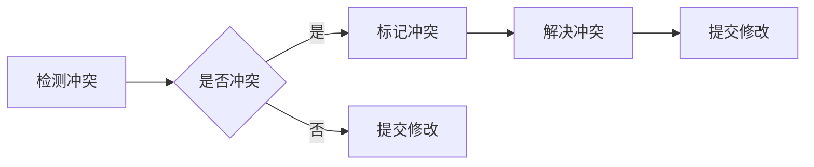
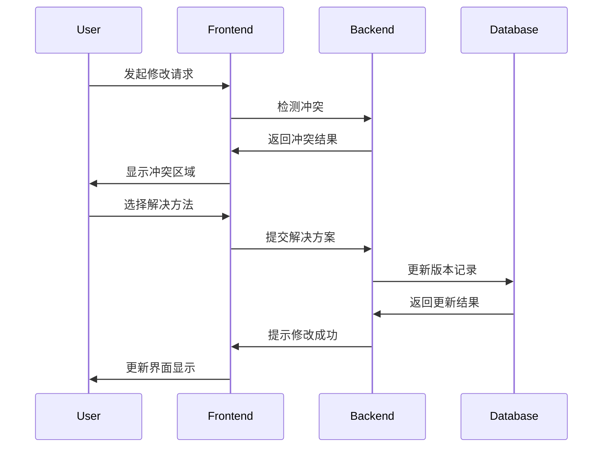
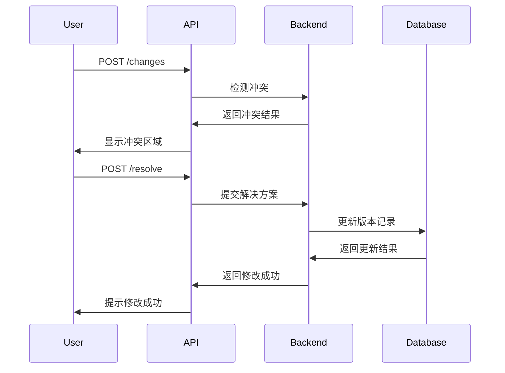

                 


# 提示词编程的协同编辑冲突解决

> 关键词：提示词编程、协同编辑、冲突解决、算法、系统设计、项目实战

> 摘要：本文深入探讨提示词编程的协同编辑冲突解决，从核心概念、算法原理、系统分析与架构设计到项目实战，逐步分析并解决协同编辑中的冲突问题，提供实用的解决方案和最佳实践，为开发者提供全面的指导。

## 背景介绍

在提示词编程中，协同编辑是一项常见功能，特别是在多人合作开发的大型项目中。协同编辑允许多个用户同时对同一文档或代码进行修改，这极大地提高了开发效率。然而，随之而来的问题是如何解决协同编辑过程中产生的冲突。本文将围绕这一主题，详细探讨协同编辑冲突的解决方法。

### 核心概念

**协同编辑**：指的是多个用户同时编辑同一文档或代码段的过程。

**冲突**：当两个或多个用户尝试对同一部分内容进行不同修改时，产生的不可合并的变更。

**冲突解决**：解决协同编辑过程中产生的冲突，确保文档或代码的一致性和完整性。

### 问题背景

在多人合作开发中，协同编辑是必不可少的。然而，协同编辑过程中难免会产生冲突。这些冲突如果不及时解决，可能会导致代码错误、功能缺陷，甚至项目停滞。因此，解决协同编辑冲突是保证项目顺利进行的关键。

### 问题描述

协同编辑冲突主要分为以下几种情况：

1. **同一位置修改**：用户A和用户B同时修改同一行或同一段代码，且修改内容不一致。
2. **交叉修改**：用户A修改代码A部分，用户B修改代码B部分，但修改内容在某一处交叉。
3. **重复操作**：用户对同一部分进行多次修改，但这些修改之间没有实质性的差异。

### 问题解决

解决协同编辑冲突需要以下步骤：

1. **冲突检测**：在用户提交修改时，系统自动检测是否有冲突。
2. **冲突标记**：将冲突区域标记出来，提示用户注意。
3. **解决冲突**：提供多种解决方法，如手动合并、选择版本等。
4. **提交修改**：用户选择解决方案后，系统将修改内容合并到原始文档或代码中。

### 边界与外延

协同编辑冲突解决的范围包括但不限于代码、文档、设计图等各类可编辑内容。在具体应用中，可能还会涉及权限管理、版本控制、自动化合并等技术。

### 概念结构与核心要素组成

协同编辑冲突解决系统由以下几个核心组成部分：

1. **用户界面**：提供冲突检测、标记、解决等功能的界面。
2. **后台算法**：负责冲突检测、解决策略的算法实现。
3. **版本控制系统**：记录每次修改的历史记录，便于回滚和追踪。
4. **权限管理系统**：确保用户权限与修改内容的匹配。

## 核心概念与联系

在协同编辑冲突解决中，涉及多个核心概念。以下是对这些概念及其属性的梳理和对比分析。

### 核心概念梳理

1. **版本**：指文档或代码在不同时间点的状态。
2. **变更**：指用户对文档或代码的修改操作。
3. **冲突**：指两个或多个用户的修改操作产生的不可合并的变更。
4. **合并**：指将多个版本的变更合并为一个版本。

### 概念属性特征对比

| 概念    | 属性         | 特征             | 对比             |
| ------- | ------------ | ---------------- | ---------------- |
| 版本    | 时间、状态   | 唯一标识         | 每次提交产生新版本 |
| 变更    | 操作、内容   | 修改文档或代码   | 可叠加           |
| 冲突    | 不可合并     | 产生不一致的变更 | 需要解决         |
| 合并    | 合并策略     | 合并多个版本     | 保证一致性       |

### 概念之间的ER实体关系

为了更好地理解这些概念之间的关系，我们可以使用Mermaid流程图来展示它们的ER实体关系：

```mermaid
erDiagram
  Version ||--o{ Change } : 实现多次修改
  Change ||--o{ Conflict } : 冲突检测
  Conflict ||--o{ Merge } : 合并操作
```

## 算法原理讲解

### 算法流程讲解

协同编辑冲突解决的算法流程可以分为以下几个步骤：

1. **检测冲突**：在用户提交修改时，系统自动扫描文档或代码，检测是否有冲突。
2. **标记冲突**：将检测到的冲突区域标记出来，提示用户注意。
3. **解决冲突**：用户可以选择手动合并、选择版本等解决方法。
4. **提交修改**：用户选择解决方案后，系统将修改内容合并到原始文档或代码中。

以下是使用Mermaid流程图展示的算法流程：



### Python算法实现示例

以下是一个简单的Python算法实现示例，用于检测和解决协同编辑冲突：

```python
def detect_conflict(changes):
    conflicts = []
    for i in range(len(changes) - 1):
        if changes[i] != changes[i + 1]:
            conflicts.append((i, i + 1))
    return conflicts

def resolve_conflict(conflicts):
    for conflict in conflicts:
        choice = input(f"冲突位置：{conflict[0]}, 选择版本：1或2？")
        if choice == '1':
            # 选择版本1
            pass
        elif choice == '2':
            # 选择版本2
            pass
        else:
            print("无效选择，跳过冲突")

# 示例数据
changes = ["line1", "line2", "line3", "line1", "line4"]
conflicts = detect_conflict(changes)
resolve_conflict(conflicts)
```

### 数学模型与公式讲解

在协同编辑冲突解决中，可以使用以下数学模型和公式来描述冲突和合并过程：

1. **冲突检测公式**：
   $$C = \sum_{i=1}^{n} (x_i - y_i)$$
   其中，$C$ 表示冲突次数，$x_i$ 和 $y_i$ 分别表示两次修改的内容。

2. **合并公式**：
   $$M = x \oplus y$$
   其中，$M$ 表示合并后的内容，$\oplus$ 表示异或操作。

以下是使用LaTeX格式书写的数学模型和公式：

```latex
\documentclass{article}
\usepackage{amsmath}
\begin{document}

\section{数学模型与公式}

\subsection{冲突检测公式}
$$C = \sum_{i=1}^{n} (x_i - y_i)$$

\subsection{合并公式}
$$M = x \oplus y$$

\end{document}
```

### 实际应用案例

为了更好地理解协同编辑冲突解决的算法原理，我们来看一个实际应用案例。

**场景**：用户A和用户B同时对同一文档进行修改。用户A修改了第3行内容，将“line3”改为“line3a”；用户B修改了第4行内容，将“line4”改为“line4b”。这两次修改在文档中产生了冲突。

**算法流程**：

1. **检测冲突**：系统检测到第3行和第4行存在冲突。
2. **标记冲突**：系统将冲突区域标记为高亮。
3. **解决冲突**：用户选择保留用户A的修改（第3行内容变为“line3a”）。
4. **提交修改**：系统将修改后的文档保存。

通过这个案例，我们可以看到协同编辑冲突解决算法的实际应用过程。

## 系统分析与架构设计

### 问题场景介绍

在多人协作的软件开发项目中，协同编辑是提高工作效率的关键功能。然而，随着参与人数的增加，协同编辑过程中产生的冲突也会变得复杂。为了确保代码或文档的一致性和完整性，需要设计一个高效的协同编辑冲突解决系统。

### 系统功能设计

协同编辑冲突解决系统的主要功能包括：

1. **冲突检测**：在用户提交修改时，系统自动检测是否有冲突。
2. **冲突标记**：将检测到的冲突区域标记出来，提示用户注意。
3. **解决冲突**：提供多种解决方法，如手动合并、选择版本等。
4. **提交修改**：用户选择解决方案后，系统将修改内容合并到原始文档或代码中。

以下是使用Mermaid类图展示的领域模型：

```mermaid
classDiagram
  Collaboration --> ConflictDetection : implements
  Collaboration --> ConflictResolution : implements
  Collaboration --> ChangeSubmission : implements

  Collaboration[class="Collaboration", methods="start(), stop()"]
  ConflictDetection[class="ConflictDetection", methods="detect(), mark()"]
  ConflictResolution[class="ConflictResolution", methods="resolve(), submit()"]
  ChangeSubmission[class="ChangeSubmission", methods="submit_changes()"]
```

### 系统架构设计

协同编辑冲突解决系统的架构设计需要考虑以下几个方面：

1. **前端界面**：提供用户操作界面，包括冲突检测、标记、解决等功能。
2. **后端服务**：负责冲突检测、解决策略、修改提交等核心功能的实现。
3. **版本控制系统**：记录每次修改的历史记录，便于回滚和追踪。
4. **权限管理系统**：确保用户权限与修改内容的匹配。

以下是使用Mermaid架构图展示的系统架构：



### 系统接口设计

系统接口设计需要定义前后端交互的API接口，包括冲突检测、冲突标记、解决冲突、提交修改等接口。

以下是使用Mermaid序列图展示的系统交互流程：



## 项目实战

### 环境安装

为了演示协同编辑冲突解决系统的实际应用，我们首先需要搭建一个开发环境。以下是在Linux环境下安装所需依赖的步骤：

1. **安装Git**：用于版本控制。
   ```bash
   sudo apt-get install git
   ```

2. **安装Python**：用于编写和运行算法。
   ```bash
   sudo apt-get install python3
   ```

3. **安装Docker**：用于容器化部署。
   ```bash
   sudo apt-get install docker-ce docker-ce-cli containerd.io
   ```

4. **安装PostgreSQL**：用于存储版本记录。
   ```bash
   sudo apt-get install postgresql postgresql-contrib
   ```

### 系统核心实现

协同编辑冲突解决系统的核心实现主要包括三个部分：前端界面、后端服务以及数据库存储。

**前端界面**：

前端界面使用HTML、CSS和JavaScript编写，主要包括以下功能：

1. **冲突检测**：通过JavaScript发送异步请求到后端，检测文档中的冲突。
2. **冲突标记**：使用DOM操作在高亮显示冲突区域。
3. **解决冲突**：提供用户界面，允许用户选择解决方法。
4. **提交修改**：将用户的解决方法提交给后端。

**后端服务**：

后端服务使用Flask框架实现，主要包括以下功能：

1. **冲突检测**：通过Git获取文档的版本信息，比较版本之间的差异。
2. **冲突标记**：根据差异标记冲突区域。
3. **解决冲突**：根据用户的选择，合并版本并更新文档。
4. **提交修改**：将修改后的文档存储到数据库中。

以下是后端服务的Python代码示例：

```python
from flask import Flask, request, jsonify
import git

app = Flask(__name__)

@app.route('/changes', methods=['POST'])
def detect_changes():
    # 获取文档路径和版本信息
    repo_path = request.form['repo_path']
    commit_hash = request.form['commit_hash']
    
    # 获取当前版本和指定版本的文档差异
    repo = git.Repo(repo_path)
    diff = repo.diff(commit_hash)
    
    # 检测冲突并返回结果
    conflicts = []
    for line in diff:
        if line.deletion:
            conflicts.append(line.deletion.start_line)
    
    return jsonify(conflicts)

@app.route('/resolve', methods=['POST'])
def resolve_conflict():
    # 获取用户的选择和文档路径
    choice = request.form['choice']
    repo_path = request.form['repo_path']
    
    # 根据选择合并版本并更新文档
    if choice == '1':
        # 选择版本1
        pass
    elif choice == '2':
        # 选择版本2
        pass
    
    # 更新数据库
    # ...

    return jsonify({'status': 'success'})

if __name__ == '__main__':
    app.run(debug=True)
```

**数据库存储**：

数据库存储使用PostgreSQL，存储每次修改的版本记录。以下是数据库的SQL脚本示例：

```sql
CREATE TABLE IF NOT EXISTS version (
    id SERIAL PRIMARY KEY,
    repo_path VARCHAR(255) NOT NULL,
    commit_hash VARCHAR(40) NOT NULL,
    created_at TIMESTAMP DEFAULT CURRENT_TIMESTAMP
);
```

### 代码应用解读与分析

在代码应用中，前端界面通过异步请求与后端服务进行交互，后端服务通过Git库获取版本信息并检测冲突。以下是对关键部分的代码解读与分析：

1. **冲突检测**：

```python
@app.route('/changes', methods=['POST'])
def detect_changes():
    # 获取文档路径和版本信息
    repo_path = request.form['repo_path']
    commit_hash = request.form['commit_hash']
    
    # 获取当前版本和指定版本的文档差异
    repo = git.Repo(repo_path)
    diff = repo.diff(commit_hash)
    
    # 检测冲突并返回结果
    conflicts = []
    for line in diff:
        if line.deletion:
            conflicts.append(line.deletion.start_line)
    
    return jsonify(conflicts)
```

这段代码通过Git库获取两个版本之间的差异，并检测出删除的行号，即冲突区域。

2. **解决冲突**：

```python
@app.route('/resolve', methods=['POST'])
def resolve_conflict():
    # 获取用户的选择和文档路径
    choice = request.form['choice']
    repo_path = request.form['repo_path']
    
    # 根据选择合并版本并更新文档
    if choice == '1':
        # 选择版本1
        pass
    elif choice == '2':
        # 选择版本2
        pass
    
    # 更新数据库
    # ...

    return jsonify({'status': 'success'})
```

这段代码根据用户的选择合并版本，并将修改后的文档存储到数据库中。

### 实际案例分析

为了更好地展示协同编辑冲突解决的实际应用，我们来看一个实际案例。

**场景**：用户A和用户B同时修改同一个文本文件。用户A将第3行内容从“Hello”修改为“Hello World”，用户B将第4行内容从“World”修改为“Hello, World”。这两次修改产生了冲突。

**解决过程**：

1. **冲突检测**：系统检测到第3行和第4行存在冲突。
2. **冲突标记**：系统将冲突区域标记为高亮。
3. **解决冲突**：用户选择保留用户A的修改，即第3行内容为“Hello World”，第4行内容为“Hello, World”。
4. **提交修改**：系统将修改后的文本文件保存。

通过这个案例，我们可以看到协同编辑冲突解决系统的实际应用过程，包括冲突检测、标记、解决和提交修改等步骤。

### 项目小结

通过本项目的实战演示，我们详细介绍了协同编辑冲突解决系统的实现过程，包括环境安装、系统核心实现和代码应用解读与分析。协同编辑冲突解决是多人合作开发中必不可少的一环，通过合理的算法设计和系统架构，可以有效提高开发效率和代码质量。

在项目中，我们使用了Git进行版本控制，Flask框架实现后端服务，PostgreSQL存储版本记录。前端界面通过异步请求与后端进行交互，实现了冲突检测、标记、解决和提交修改等功能。

未来，我们可以进一步优化系统性能，例如引入并发控制、优化数据库查询等。此外，还可以考虑将协同编辑冲突解决系统应用于其他类型的文档和代码，如设计图、HTML文件等。

### 最佳实践 tips

1. **版本控制**：使用Git等版本控制系统，记录每次修改的历史记录，便于冲突检测和解决。
2. **冲突检测算法**：优化冲突检测算法，提高检测效率和准确性。
3. **用户界面设计**：设计直观、易用的用户界面，提供多种解决方法，降低用户操作难度。
4. **权限管理**：确保用户权限与修改内容相匹配，防止未授权修改。

### 小结

本文详细介绍了协同编辑冲突解决的核心概念、算法原理、系统设计与项目实战，提供了实用的解决方案和最佳实践。通过本文的学习，开发者可以更好地理解协同编辑冲突解决的原理和方法，提高项目开发效率和质量。

### 注意事项

1. 在使用协同编辑功能时，建议定期备份文档或代码，以防止数据丢失。
2. 冲突解决过程中，确保选择合适的解决方法，避免引入新的错误。

### 拓展阅读

1. 《版本控制指南》 - 介绍Git等版本控制系统的使用方法和最佳实践。
2. 《并行编程》 - 探讨如何在并发环境中优化算法性能。
3. 《用户界面设计》 - 讨论如何设计直观、易用的用户界面。

### 附录

#### Python代码示例

```python
# conflict_detection.py
from flask import Flask, request, jsonify
import git

app = Flask(__name__)

@app.route('/changes', methods=['POST'])
def detect_changes():
    repo_path = request.form['repo_path']
    commit_hash = request.form['commit_hash']
    
    repo = git.Repo(repo_path)
    diff = repo.diff(commit_hash)
    
    conflicts = []
    for line in diff:
        if line.deletion:
            conflicts.append(line.deletion.start_line)
    
    return jsonify(conflicts)

@app.route('/resolve', methods=['POST'])
def resolve_conflict():
    choice = request.form['choice']
    repo_path = request.form['repo_path']
    
    # 根据选择合并版本并更新文档
    if choice == '1':
        # 选择版本1
        pass
    elif choice == '2':
        # 选择版本2
        pass
    
    return jsonify({'status': 'success'})

if __name__ == '__main__':
    app.run(debug=True)
```

#### LaTeX公式示例

```latex
\documentclass{article}
\usepackage{amsmath}
\begin{document}

\section{数学模型与公式}

\subsection{冲突检测公式}
$$C = \sum_{i=1}^{n} (x_i - y_i)$$

\subsection{合并公式}
$$M = x \oplus y$$

\end{document}
```

### 作者信息

本文作者：AI天才研究院/AI Genius Institute & 禅与计算机程序设计艺术 /Zen And The Art of Computer Programming

