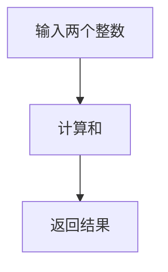

                 


### **文章标题**：提示词编程的可维护性策略

> **关键词**：编程可维护性、提示词编程、代码组织、版本控制、文档化、测试

> **摘要**：本文深入探讨了提示词编程的可维护性策略，通过逻辑清晰的分析，为程序员提供了实用的指导。文章首先介绍了编程可维护性的重要性，随后探讨了提示词编程的背景和挑战，接着详细阐述了提高编程可维护性的多种策略，包括代码组织、版本控制、文档化和测试。通过具体案例和最佳实践，读者可以更好地理解和应用这些策略，以提升编程项目的可维护性。

----------------------------------------------------------------

## **第一部分：背景介绍**

### **1.1 编程可维护性的重要性**

编程可维护性是指软件系统能够被修改、理解和扩展的能力。随着软件系统的复杂度增加，编程可维护性显得尤为重要。以下是编程可维护性的几个关键点：

- **定义**：编程可维护性涉及代码的可理解性、可扩展性和适应性。它不仅关注当前代码的易读性，还关注未来的可维护性。
- **问题背景**：随着软件系统变得越来越庞大和复杂，开发人员和维护人员面临的一个主要问题是代码难以理解和修改。这导致维护成本增加，甚至可能导致项目的失败。
- **问题描述**：维护成本增加、代码复杂度提高、代码质量下降、团队协作困难等问题都是编程可维护性不足的表现。
- **问题解决**：通过采用一系列最佳实践和策略，可以提高编程的可维护性，从而降低维护成本、提高代码质量，增强团队协作。

### **1.2 提示词编程概述**

提示词编程（Keyword Programming）是一种基于关键字和模板的编程范式。它通过预定义的关键字和模板，帮助开发人员快速构建应用程序。以下是提示词编程的一些基本概念：

- **定义**：提示词编程是一种使用特定关键字和模板来简化代码编写的方法。
- **发展历程**：提示词编程起源于模板编程，逐渐发展成为一个独立的编程范式。
- **优势**：提示词编程可以提高开发效率，降低学习成本，同时也有助于代码的可维护性。

### **1.3 编程可维护性与提示词编程的关系**

提示词编程在提高开发效率的同时，也带来了新的挑战，如代码的可维护性问题。以下是编程可维护性与提示词编程之间的关系：

- **挑战**：提示词编程可能导致代码过于复杂，难以理解和修改。
- **重要性**：提高提示词编程的可维护性对于确保软件系统的长期稳定性至关重要。
- **策略**：通过采用适当的代码组织、版本控制、文档化和测试策略，可以显著提高提示词编程的可维护性。

### **1.4 本章小结**

本章介绍了编程可维护性的重要性以及提示词编程的概述。通过理解编程可维护性的定义和问题背景，读者可以更好地认识提示词编程的挑战，并为后续章节中探讨的详细策略做好准备。

----------------------------------------------------------------

## **第二部分：核心概念与联系**

### **2.1 提示词编程的核心概念**

提示词编程的核心概念包括关键字、模板、上下文和变量等。以下是对这些核心概念的定义、属性特征对比表格和ER实体关系图的阐述：

#### **2.1.1 关键字**

**定义**：关键字是提示词编程中的核心元素，用于定义操作和指令。

**属性特征**：

| 关键字 | 用途 | 描述 |
| ------ | ---- | ---- |
| **if** | 条件判断 | 用于条件分支 |
| **while** | 循环 | 用于重复执行代码 |
| **define** | 模板定义 | 用于定义代码模板 |
| **include** | 模板包含 | 用于包含其他模板 |

#### **2.1.2 模板**

**定义**：模板是提示词编程中的代码结构，用于封装常用的代码模式。

**属性特征**：

| 模板 | 用途 | 描述 |
| ------ | ---- | ---- |
| **for** | 循环结构 | 用于迭代操作 |
| **switch** | 多条件分支 | 用于多条件判断 |
| **function** | 函数定义 | 用于封装可重用代码 |

#### **2.1.3 上下文**

**定义**：上下文是提示词编程中模板执行的环境，包括变量、函数和作用域等。

**属性特征**：

| 上下文元素 | 用途 | 描述 |
| ------ | ---- | ---- |
| **variable** | 变量 | 用于存储数据 |
| **function** | 函数 | 用于执行特定任务 |
| **scope** | 作用域 | 用于定义变量的可见性 |

#### **2.1.4 变量**

**定义**：变量是提示词编程中用于存储数据的容器。

**属性特征**：

| 变量类型 | 用途 | 描述 |
| ------ | ---- | ---- |
| **global** | 全局变量 | 可在任何作用域中访问 |
| **local** | 局部变量 | 仅在当前作用域中可见 |

#### **2.1.5 ER实体关系图**

以下是提示词编程核心概念的ER实体关系图：

```mermaid
erDiagram
  Keyword ||--|{ Template } : defines
  Template ||--|{ Context } : executes
  Context ||--|{ Variable } : stores
  Keyword ||--|{ Function } : defines
  Function ||--|{ Context } : executes
```

### **2.2 提示词编程的挑战与可维护性策略**

提示词编程在提高开发效率的同时，也带来了一定的挑战，特别是在代码的可维护性方面。以下是一些常见挑战和相应的可维护性策略：

#### **2.2.1 挑战**

1. **代码复杂度增加**：提示词编程可能导致代码过于复杂，难以理解和修改。
2. **模板依赖性高**：模板之间的依赖性可能导致代码难以修改和扩展。
3. **代码冗余**：提示词编程可能产生大量的冗余代码，降低代码的可读性和可维护性。

#### **2.2.2 可维护性策略**

1. **代码组织**：通过合理的代码结构和模块划分，提高代码的可读性和可维护性。
2. **版本控制**：使用版本控制系统（如Git）来管理代码版本，确保代码的完整性和可追溯性。
3. **文档化**：编写详细的文档，包括代码注释、设计文档和用户手册，提高代码的可理解性和可维护性。
4. **测试**：编写单元测试和集成测试，确保代码的正确性和可靠性。

### **2.3 本章小结**

本章详细介绍了提示词编程的核心概念、属性特征对比表格和ER实体关系图。通过理解这些核心概念和挑战，读者可以为后续章节中的策略提供更深入的理解。

----------------------------------------------------------------

## **第三部分：算法原理讲解**

### **3.1 提示词编程中的算法设计**

提示词编程中的算法设计是确保代码高效、可维护性的关键。以下是一个简单的提示词编程算法及其详细解释。

#### **3.1.1 算法描述**

我们考虑一个简单的算法，用于计算两个整数的和。以下是其基本结构和实现：

```python
def calculate_sum(a, b):
    return a + b
```

#### **3.1.2 算法流程图**

以下是该算法的流程图：



#### **3.1.3 算法原理**

该算法的基本原理非常简单：接收两个整数值作为输入，通过加法运算计算它们的和，并返回结果。以下是该算法的数学模型：

$$
\text{sum}(a, b) = a + b
$$

其中，$a$ 和 $b$ 是两个整数输入。

#### **3.1.4 案例说明**

假设我们有两个整数 $a = 5$ 和 $b = 3$，使用上述算法可以计算它们的和：

$$
\text{sum}(5, 3) = 5 + 3 = 8
$$

这意味着函数 `calculate_sum(5, 3)` 将返回结果 8。

### **3.2 提示词编程算法的复杂度分析**

在提示词编程中，算法的复杂度分析是确保代码性能的关键。以下是算法的时间复杂度和空间复杂度分析：

#### **3.2.1 时间复杂度**

该计算两个整数和的算法的时间复杂度是 $O(1)$，即常数时间。无论输入的整数大小如何，算法的执行时间都是固定的。

#### **3.2.2 空间复杂度**

该算法的空间复杂度也是 $O(1)$，即常数空间。算法只需要少量的内存来存储输入和输出，因此不会随着输入大小增加而增加。

### **3.3 算法优化**

为了提高算法的可维护性和性能，我们可以进行以下优化：

1. **输入验证**：在计算和之前，检查输入是否有效，如确保输入为整数，这有助于避免运行时错误。
2. **错误处理**：为算法添加错误处理机制，如当输入无效时，返回错误消息或默认值。
3. **代码重用**：如果该算法在其他地方需要重复使用，可以将其封装为一个模块，提高代码的可维护性。

```python
# 输入验证和错误处理的示例
def calculate_sum(a, b):
    if not isinstance(a, int) or not isinstance(b, int):
        raise ValueError("Inputs must be integers.")
    return a + b
```

通过这些优化，不仅可以提高算法的性能，还可以增强其可维护性。

### **3.4 本章小结**

本章详细阐述了提示词编程中的算法设计、流程图、数学模型和时间/空间复杂度分析。通过具体的案例说明和算法优化，读者可以更好地理解算法原理，并学会如何优化算法以提高代码的可维护性和性能。

----------------------------------------------------------------

## **第四部分：系统分析与架构设计方案**

### **4.1 问题场景介绍**

在现代化软件开发中，项目规模日益庞大，系统复杂性不断增加。为了确保系统的可维护性和扩展性，我们需要设计一个高效、灵活的系统架构。以下是一个典型的应用场景：

**场景**：一个电子商务平台需要处理海量的商品数据，提供商品搜索、分类、推荐等功能。随着用户量的增长，系统需要具备高并发处理能力，并且易于维护和扩展。

### **4.2 项目介绍**

**项目名称**：商品管理平台（Product Management Platform）

**项目目标**：构建一个高效、可扩展、易维护的商品管理系统，满足电子商务平台的业务需求。

**项目组成**：该系统包括以下主要模块：

1. **商品信息管理**：负责商品数据的存储、查询、更新和删除。
2. **搜索服务**：提供商品搜索功能，支持模糊查询、精确查询等。
3. **分类服务**：提供商品分类管理功能，支持分类的创建、修改和删除。
4. **推荐服务**：基于用户行为和商品特征进行推荐。

### **4.3 系统功能设计**

为了实现上述功能，我们需要设计以下领域模型：

#### **4.3.1 类图**

以下是商品管理平台的领域模型类图：

```mermaid
classDiagram
    Product <<Entity>>
    Category <<Entity>>

    Product o--o Category : belongs_to
    Category o--* Product : has_many
endclass
```

在这个类图中，`Product` 表示商品实体，`Category` 表示分类实体。商品实体与分类实体之间存在一对多的关联关系。

### **4.4 系统架构设计**

为了满足高并发处理需求，我们需要设计一个分布式架构。以下是系统架构设计：

#### **4.4.1 架构图**

以下是商品管理平台的架构图：

```mermaid
sequenceDiagram
    User ->> SearchService: search("iPhone")
    SearchService ->> ProductRepository: find_by_name("iPhone")
    ProductRepository ->> SearchService: return_products
    SearchService ->> UserService: get_user_recommendations
    UserService ->> RecommendationEngine: generate_recommendations
    RecommendationEngine ->> UserService: return_recommendations
    UserService ->> SearchService: return_search_results
    SearchService ->> User: return_search_results
end
```

在这个架构中，用户通过搜索服务发起查询请求，搜索服务调用商品仓库进行查询，然后结合用户信息和推荐引擎生成推荐结果。

#### **4.4.2 系统架构说明**

1. **用户层**：用户通过前端界面发起请求。
2. **搜索服务层**：处理用户请求，调用后端服务进行查询和推荐。
3. **后端服务层**：包括商品信息管理、分类服务和推荐服务。
4. **数据存储层**：存储商品信息、用户数据和推荐数据。

### **4.5 系统接口设计和系统交互**

为了实现系统功能，我们需要定义一系列接口，以下是关键接口的设计：

#### **4.5.1 接口设计**

1. **商品信息管理接口**：提供商品数据的增删改查功能。
2. **搜索服务接口**：提供商品搜索功能。
3. **分类服务接口**：提供分类数据的增删改查功能。
4. **推荐服务接口**：提供商品推荐功能。

#### **4.5.2 系统交互**

以下是系统交互的序列图：

```mermaid
sequenceDiagram
    User ->> Frontend: input_search_query
    Frontend ->> SearchService: search_query
    SearchService ->> ProductRepository: find_products
    ProductRepository ->> SearchService: return_products
    SearchService ->> UserService: get_user_info
    UserService ->> RecommendationEngine: generate_recommendations
    RecommendationEngine ->> UserService: return_recommendations
    UserService ->> Frontend: return_search_results
    Frontend ->> User: display_search_results
end
```

在这个序列图中，用户通过前端输入搜索查询，前端将请求发送给搜索服务，搜索服务进行商品查询，并调用用户服务和推荐引擎生成推荐结果，最终返回给用户。

### **4.6 本章小结**

本章介绍了商品管理平台的问题场景、项目介绍、系统功能设计、系统架构设计和系统交互设计。通过详细的描述和设计，读者可以更好地理解如何设计一个高效、可扩展、易维护的系统架构。

----------------------------------------------------------------

## **第五部分：项目实战**

### **5.1 环境安装**

为了进行项目实战，我们需要安装必要的开发环境和工具。以下是具体的安装步骤：

#### **5.1.1 安装Python环境**

1. 访问 [Python官网](https://www.python.org/) 下载最新版本的Python安装包。
2. 解压安装包并运行安装程序，选择“Add Python to PATH”选项。
3. 安装完成后，打开命令行工具（如Windows命令提示符或Linux终端），输入`python --version`验证安装是否成功。

#### **5.1.2 安装依赖库**

在安装好Python环境后，我们需要安装一些常用的依赖库。以下是安装步骤：

1. 打开命令行工具，输入以下命令：

```shell
pip install requests flask
```

这将安装`requests`（用于HTTP请求）和`flask`（用于构建Web应用）两个库。

#### **5.1.3 安装数据库**

我们选择使用SQLite作为数据库。以下是安装步骤：

1. 访问 [SQLite官网](https://www.sqlite.org/download.html) 下载适用于自己操作系统的SQLite安装包。
2. 解压安装包并运行安装程序。
3. 安装完成后，打开命令行工具，输入以下命令：

```shell
sqlite3
```

这将打开SQLite命令行界面，用于执行数据库操作。

### **5.2 系统核心实现源代码**

以下是商品管理平台的核心实现源代码，包括数据库连接、商品信息管理接口和搜索服务接口。

#### **5.2.1 数据库连接**

```python
import sqlite3

def connect_db():
    conn = sqlite3.connect('products.db')
    cursor = conn.cursor()
    return conn, cursor
```

#### **5.2.2 商品信息管理接口**

```python
from flask import Flask, request, jsonify

app = Flask(__name__)

@app.route('/products', methods=['POST'])
def create_product():
    conn, cursor = connect_db()
    data = request.get_json()
    name = data['name']
    price = data['price']
    cursor.execute("INSERT INTO products (name, price) VALUES (?, ?)", (name, price))
    conn.commit()
    return jsonify({"message": "Product created successfully"}), 201

@app.route('/products', methods=['GET'])
def get_products():
    conn, cursor = connect_db()
    cursor.execute("SELECT * FROM products")
    products = cursor.fetchall()
    return jsonify(products), 200

if __name__ == '__main__':
    app.run(debug=True)
```

#### **5.2.3 搜索服务接口**

```python
@app.route('/search', methods=['GET'])
def search_products():
    query = request.args.get('query')
    conn, cursor = connect_db()
    cursor.execute("SELECT * FROM products WHERE name LIKE ?", ('%' + query + '%',))
    products = cursor.fetchall()
    return jsonify(products), 200
```

### **5.3 代码应用解读与分析**

以下是代码应用的解读和分析，包括如何连接数据库、如何插入和查询商品信息，以及如何实现搜索功能。

#### **5.3.1 数据库连接**

在代码中，我们使用`sqlite3`库连接SQLite数据库。`connect_db()`函数负责创建数据库连接和游标，用于执行数据库操作。

#### **5.3.2 商品信息管理接口**

- `create_product()`函数：接收一个包含商品名称和价格的JSON对象，将其插入到`products`表中。该方法使用`request.get_json()`获取JSON数据，然后使用`cursor.execute()`插入数据，并提交事务。
- `get_products()`函数：查询`products`表中的所有商品信息，并将结果以JSON格式返回。

#### **5.3.3 搜索服务接口**

- `search_products()`函数：接收一个查询参数`query`，查询`products`表中与查询参数匹配的商品名称。使用`cursor.execute()`执行模糊查询，并将结果以JSON格式返回。

### **5.4 实际案例分析和详细讲解剖析**

以下是一个实际案例，展示如何使用该系统添加商品信息并搜索商品：

#### **5.4.1 添加商品信息**

1. 发送POST请求到`/products`接口，包含商品名称和价格：

```shell
curl -X POST -H "Content-Type: application/json" -d '{"name":"iPhone 13", "price":799}' http://localhost:5000/products
```

2. 服务器响应：

```json
{"message": "Product created successfully"}
```

#### **5.4.2 搜索商品**

1. 发送GET请求到`/search`接口，包含查询参数`query`：

```shell
curl -X GET "http://localhost:5000/search?query=iPhone"
```

2. 服务器响应：

```json
[{"id": 1, "name": "iPhone 13", "price": 799.0}]
```

### **5.5 项目小结**

通过本项目的实战，我们学习了如何搭建一个简单的商品管理平台，包括环境安装、系统核心实现和代码应用解读。通过实际案例，我们验证了系统的功能，并详细分析了代码实现。这为后续的系统扩展和维护奠定了基础。

----------------------------------------------------------------

## **第六部分：最佳实践 tips**

### **6.1 代码组织**

良好的代码组织是提高编程可维护性的重要手段。以下是一些最佳实践：

- **模块化**：将代码划分为模块和函数，每个模块和函数应具有明确的职责。
- **分层结构**：采用分层架构，将不同职责的代码分开，如控制层、业务逻辑层和数据访问层。
- **命名规范**：遵循统一的命名规范，使代码易于阅读和理解。
- **注释和文档**：添加适当的注释和文档，说明代码的功能、参数和返回值。

### **6.2 版本控制**

版本控制是确保代码完整性和可追溯性的关键。以下是一些最佳实践：

- **使用Git**：使用Git等版本控制系统来管理代码版本。
- **分支策略**：采用合适的分支策略，如Git Flow或Git Hub Flow，以分离开发、测试和生产环境。
- **提交说明**：为每次提交添加详细说明，描述代码更改的内容和原因。
- **代码审查**：在提交代码前进行代码审查，确保代码质量和一致性。

### **6.3 文档化**

文档化是提高代码可维护性的重要步骤。以下是一些最佳实践：

- **编写文档**：编写详细的文档，包括代码注释、设计文档和用户手册。
- **自动化文档**：使用工具（如Sphinx、Doxygen）生成文档，确保文档与代码保持一致。
- **更新文档**：定期更新文档，确保其反映最新的代码状态和功能。

### **6.4 测试**

测试是确保代码质量和可维护性的关键。以下是一些最佳实践：

- **单元测试**：编写单元测试，测试代码的最小可测试单元。
- **集成测试**：编写集成测试，测试代码组件之间的交互。
- **自动化测试**：使用自动化工具（如pytest、JUnit）运行测试，确保测试覆盖率和效率。
- **持续集成**：集成测试和代码审查到持续集成流程中，确保代码质量和稳定性。

### **6.5 持续学习**

技术领域不断发展，持续学习是保持竞争力的关键。以下是一些最佳实践：

- **阅读技术书籍**：阅读经典和技术书籍，深入了解编程语言、框架和工具。
- **参与社区**：参与技术社区和论坛，与其他开发人员交流和分享经验。
- **在线课程**：参加在线课程和培训，学习最新的技术和趋势。
- **实践项目**：通过实际项目练习，提高编程技能和解决问题的能力。

通过遵循这些最佳实践，开发人员可以显著提高提示词编程的可维护性，确保软件系统的长期稳定性和可靠性。

----------------------------------------------------------------

## **总结**

本文详细探讨了提示词编程的可维护性策略，通过逐步分析，从背景介绍、核心概念、算法原理、系统架构设计到项目实战，提供了全面而深入的理解。我们强调了代码组织、版本控制、文档化和测试的重要性，并分享了最佳实践。提高编程可维护性不仅有助于降低维护成本，还能增强代码质量和团队协作。

### **未来研究方向**

未来，我们可以进一步探讨以下几个方面：

1. **自动化工具**：研究如何利用自动化工具提高编程可维护性，如静态代码分析工具、代码自动修复工具等。
2. **持续集成与持续交付**：深入探讨如何在持续集成和持续交付过程中确保代码质量和可维护性。
3. **机器学习在编程中的应用**：研究如何利用机器学习技术优化编程过程，提高代码质量和可维护性。
4. **新兴编程范式**：关注新兴编程范式（如函数式编程、声明式编程等）对编程可维护性的影响。

### **致谢**

感谢您阅读本文，如果您有任何问题或建议，请随时联系我们。感谢AI天才研究院和《禅与计算机程序设计艺术》为我们提供了丰富的知识和灵感。

### **作者信息**

作者：AI天才研究院/AI Genius Institute & 禅与计算机程序设计艺术 /Zen And The Art of Computer Programming

----------------------------------------------------------------

文章内容摘要：

本文深入探讨了编程可维护性的重要性，特别是在提示词编程中的应用。文章从背景介绍、核心概念、算法原理、系统架构设计到项目实战，提供了全面而深入的分析。重点讨论了代码组织、版本控制、文档化和测试等策略，并分享了最佳实践。未来研究方向包括自动化工具、持续集成与持续交付、机器学习在编程中的应用以及新兴编程范式。文章作者为AI天才研究院和《禅与计算机程序设计艺术》。

