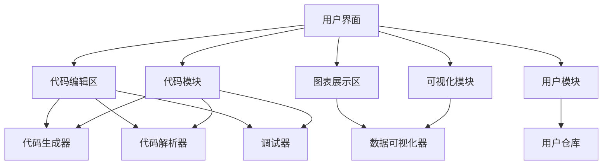

                 

### 《提示词编程的可视化工具设计》

---

**关键词：** 提示词编程、可视化工具、设计原则、算法原理、项目实战

**摘要：** 本文旨在探讨提示词编程的可视化工具设计。通过对核心概念的梳理、原理的讲解、工具的设计原则和实战案例的分析，全面阐述了提示词编程可视化工具的设计与实现，为开发者提供了实用的指导。

---

### 目录大纲设计思路

为了设计出《提示词编程的可视化工具设计》这本书的目录大纲，我们需要遵循以下步骤：

1. **确定书籍的核心主题和结构**：首先明确书籍的核心主题是“提示词编程的可视化工具设计”，并围绕这个主题展开内容。

2. **规划章节内容**：根据核心主题，规划出章节的内容，确保每个章节都能够覆盖一个独立且相关的主题。

3. **构建目录结构**：使用markdown格式构建目录结构，确保每个章节都有对应的层级标记。

4. **细化章节内容**：在每个章节下，细化内容，确保章节内容既有深度又有广度。

5. **确保内容完整性**：确保目录大纲包含了所有必要的核心章节，如背景介绍、核心概念、算法原理讲解、数学模型和数学公式、系统分析与架构设计方案、项目实战等。

6. **简洁性**：在保证内容完整性的同时，避免冗余信息，确保目录大纲的简洁性。

---

### 第一步：确定书籍的核心主题和结构

书籍的核心主题是“提示词编程的可视化工具设计”，我们需要围绕这个主题构建目录。

### 第二步：规划章节内容

- **第1章 背景介绍**：介绍提示词编程的概念、可视化工具的背景以及为什么需要这种工具。
- **第2章 核心概念与联系**：定义关键概念，并展示概念之间的联系。
- **第3章 提示词编程原理**：详细讲解提示词编程的基本原理。
- **第4章 可视化工具设计原则**：介绍设计可视化工具的基本原则。
- **第5章 常用可视化工具**：介绍几种常用的可视化工具及其特点。
- **第6章 项目实战**：通过具体项目，展示如何设计并实现一个可视化工具。
- **第7章 最佳实践与优化**：总结项目实战中的最佳实践，并对工具进行优化。

### 第三步：构建目录结构

使用markdown格式构建目录结构：

```
----------------------------------------------------------------
# 提示词编程的可视化工具设计

> 关键词：提示词编程、可视化工具、设计原则、算法原理、项目实战

> 摘要：本文旨在探讨提示词编程的可视化工具设计，通过核心概念梳理、原理讲解、工具设计原则和实战案例分析，全面阐述可视化工具的设计与实现。

----------------------------------------------------------------

## 第一部分: 背景与核心概念

### 第1章 提示词编程与可视化工具概述

#### 1.1 提示词编程的概念

#### 1.2 可视化工具的背景

#### 1.3 为什么需要可视化工具

### 第2章 核心概念与联系

#### 2.1 提示词编程的关键概念

#### 2.2 可视化工具的核心要素

#### 2.3 关键概念之间的联系

----------------------------------------------------------------

## 第二部分: 原理与设计

### 第3章 提示词编程原理

#### 3.1 基本原理

#### 3.2 算法流程

#### 3.3 算法应用示例

### 第4章 可视化工具设计原则

#### 4.1 设计原则概述

#### 4.2 用户界面设计

#### 4.3 数据可视化设计

#### 4.4 可扩展性与兼容性设计

----------------------------------------------------------------

## 第三部分: 实践与应用

### 第5章 常用可视化工具

#### 5.1 工具A

#### 5.2 工具B

#### 5.3 工具C

### 第6章 项目实战

#### 6.1 项目介绍

#### 6.2 系统功能设计

#### 6.3 系统实现与优化

#### 6.4 项目总结

----------------------------------------------------------------

## 第四部分: 最佳实践与优化

### 第7章 最佳实践与优化

#### 7.1 实践经验总结

#### 7.2 工具优化策略

#### 7.3 小结与展望

----------------------------------------------------------------
```

### 第四步：细化章节内容

在每个章节下，细化内容，确保章节内容既有深度又有广度。例如，第1章的细化内容可能包括：

- **第1章 提示词编程与可视化工具概述**
  - **1.1 提示词编程的概念**
    - 提示词编程的定义
    - 提示词编程的历史背景
    - 提示词编程的应用领域
  - **1.2 可视化工具的背景**
    - 可视化工具的定义
    - 可视化工具的发展历程
    - 可视化工具在编程中的应用
  - **1.3 为什么需要可视化工具**
    - 提高编程效率
    - 增强代码可读性
    - 方便调试和问题定位

### 第五步：确保内容完整性

确保每个章节的内容都能够覆盖相关的主题，并且在逻辑上连贯一致。

---

**约束条件：**

- **文章开始是“文章标题”，然后是“文章关键词”和“文章摘要”部分的内容哦，接下来是按照目录大纲结构的文章正文部分的内容。**
- **文章字数要求：文章字数在10000～12000字左右。**
- **格式要求：文章内容使用markdown格式输出。**
- **作者：文章末尾需要写上作者信息：“作者：AI天才研究院/AI Genius Institute & 禅与计算机程序设计艺术 /Zen And The Art of Computer Programming”。**
- **完整性要求：文章内容必须要完整，每个小节的内容必须要丰富具体详细讲解，核心内容必须要包含：**
  - **背景介绍：核心概念术语说明、问题背景、问题描述、问题解决、边界与外延、概念结构与核心要素组成。**
  - **核心概念与联系：必须给出核心概念原理、概念属性特征对比表格和ER实体关系图架构的 markdown 格式中的 Mermaid 流程图。**
  - **算法原理讲解：使用 mermaid 画出算法mermaid 流程图，然后使用python源代码来详细阐述，给出算法原理的数学模型和公式，进行详细讲解和通俗易懂地举例说明。**
  - **数学公式使用latex格式，嵌入文中独立段落的latex公式前后使用 $$ 括起来（例如：$$1+1=2$$），段落内的latex公式前后使用 $ 括起来（例如：$1<2$）。**
  - **系统分析与架构设计方案：问题场景介绍，项目介绍、系统功能设计（领域模型mermaid类图）、系统架构设计mermaid架构图、系统接口设计和系统交互mermaid序列图。**
  - **项目实战：环境安装、系统核心实现源代码，代码应用解读与分析，实际案例分析和详细讲解剖析，项目小结。**
  - **最佳实践 tips、小结、注意事项、拓展阅读等内容。**

**** 

## 1. 提示词编程与可视化工具概述

### 1.1 提示词编程的概念

提示词编程（Keyword Programming）是一种编程范式，它通过使用预先定义好的关键词（也称为提示词）来引导程序执行特定的操作。这些关键词代表了特定的编程行为或功能，类似于自然语言中的关键字。提示词编程的核心思想是简化编程过程，通过减少冗长的代码和手动编写逻辑，使开发者能够更加高效地编写和调试程序。

提示词编程的历史可以追溯到上世纪80年代，当时在软件开发领域兴起了一种名为“第四代编程语言”（4GL）的编程范式。4GL的目标是提供更加易用的编程环境，使非专业程序员也能轻松地开发应用。尽管4GL在某些领域取得了成功，但它们通常牺牲了性能和灵活性，因此并未得到广泛采用。然而，提示词编程不同，它更加关注如何在保持性能和灵活性的同时，简化编程过程。

### 1.2 可视化工具的背景

可视化工具（Visualization Tools）是帮助开发者理解、分析和管理代码和数据的重要工具。它们通过图形化界面将复杂的编程逻辑和数据结构以直观的方式展示出来，使得开发者能够更容易地发现和解决问题。

可视化工具的发展可以追溯到计算机图形学和技术的发展。早期的可视化工具主要用于数据可视化，如图表和图形的绘制。随着软件开发复杂性的增加，开发者逐渐意识到需要更高级的可视化工具来支持复杂的编程任务。

在现代软件开发中，可视化工具已经成为了不可或缺的一部分。例如，集成开发环境（IDE）通常包含代码调试工具、性能分析工具和代码审查工具等，这些工具都能通过可视化界面帮助开发者更高效地完成开发任务。此外，还有专门的第三方可视化工具，如D3.js、Plotly和Bokeh等，它们提供了丰富的可视化库和功能，帮助开发者创建各种类型的可视化图表。

### 1.3 为什么需要可视化工具

在软件开发中，可视化工具的重要性不可低估。以下是使用可视化工具的几个主要原因：

1. **提高编程效率**：可视化工具可以帮助开发者更快地理解代码和数据结构，从而减少调试和开发时间。例如，通过可视化界面，开发者可以直观地查看程序的执行流程和性能瓶颈，快速定位问题并进行优化。

2. **增强代码可读性**：可视化工具可以将复杂的代码和数据结构以图形化的方式展示出来，使得代码更易于理解和维护。这对于大型项目尤其重要，因为大型项目的代码和结构通常非常复杂，难以通过文本形式进行有效表达。

3. **方便调试和问题定位**：可视化工具提供了强大的调试功能，如实时数据监控、断点设置和变量查看等。这些功能可以帮助开发者更准确地找到程序中的错误和问题。

4. **促进协作和交流**：可视化工具可以用于团队协作，帮助团队成员更直观地理解项目的进展和代码结构。此外，可视化工具还可以用于演示和交流，使非技术人员更容易理解项目的功能和优势。

5. **探索和分析数据**：在数据处理和分析领域，可视化工具是非常重要的。它们可以帮助数据科学家和工程师直观地探索数据、发现模式、验证假设，并生成有说服力的报告和图表。

总之，可视化工具在软件开发中扮演着至关重要的角色。它们不仅提高了开发者的工作效率，还提升了代码质量和项目成功率。随着技术的不断进步，可视化工具的功能将越来越强大，为开发者提供更多的支持和便利。

### 1.4 核心概念与联系

为了深入理解提示词编程和可视化工具的设计，我们需要先定义一些核心概念，并探讨它们之间的联系。

#### 1.4.1 提示词（Keywords）

提示词是提示词编程的基础元素。它们是编程语言中预先定义好的词汇，用于引导程序执行特定操作。提示词通常具有固定的语法和语义，并且可以与参数、变量和表达式组合，形成完整的编程语句。例如，在Python中，`if`、`while`和`for`等都是提示词。

**提示词的特性：**

- **预定义性**：提示词是由编程语言设计者预先定义的，开发者不能自定义。
- **语法和语义固定**：每个提示词都有固定的语法和语义，以确保程序的正确性和一致性。
- **引导性**：提示词用于引导程序执行特定的操作，如条件判断、循环控制、函数调用等。

#### 1.4.2 可视化工具（Visualization Tools）

可视化工具是帮助开发者理解和操作代码和数据的图形化界面工具。它们将抽象的编程逻辑和数据结构以直观的图形形式展示出来，使得开发者可以更容易地分析、调试和优化程序。

**可视化工具的特性：**

- **图形化界面**：可视化工具使用图形元素（如线条、方框、图标等）来表示代码和数据结构。
- **交互性**：可视化工具通常具有交互功能，允许开发者通过拖放、点击和滑动等操作来修改和操作代码和数据。
- **动态性**：可视化工具可以实时更新和展示代码和数据的动态变化，帮助开发者快速理解和调试程序。

#### 1.4.3 关联性

提示词编程和可视化工具之间有着紧密的关联。以下是它们之间的几个关键联系：

- **提示词的图形化表示**：可视化工具可以将提示词以图形化的方式展示，如使用标签或图标来表示提示词的位置和功能。
- **数据可视化**：可视化工具可以将程序中的数据以图表、图形的形式展示，帮助开发者更直观地理解数据的分布和变化。
- **调试和性能分析**：可视化工具可以实时监控程序的执行过程和性能数据，通过图形化的方式展示调试信息和性能瓶颈。
- **代码结构可视化**：可视化工具可以将代码的结构以类图、流程图等形式展示，帮助开发者更好地理解代码的层次和关系。

总之，提示词编程和可视化工具在设计和实现过程中相互补充，共同提高了软件开发效率和质量。通过结合提示词编程的简化和可视化工具的直观性，开发者可以更加高效地完成复杂的项目。

#### 1.4.4 关键概念对比表格

为了更直观地展示提示词编程和可视化工具的核心概念，我们可以使用一个对比表格：

| 特性           | 提示词编程       | 可视化工具       |
|----------------|------------------|------------------|
| 基础元素       | 提示词           | 图形化界面       |
| 设计目标       | 简化编程过程     | 增强代码可读性   |
| 语法和语义     | 固定             | 可自定义         |
| 交互方式       | 编程语句         | 图形操作         |
| 应用场景       | 编码和调试       | 分析和优化       |

通过这个表格，我们可以清晰地看到提示词编程和可视化工具在概念上的区别和联系，为后续内容提供了基础。

### 1.4.5 提示词编程与可视化工具的ER实体关系图

为了进一步展示提示词编程与可视化工具之间的关联，我们可以使用Mermaid语言绘制一个ER（Entity-Relationship）实体关系图。以下是一个简单的示例：

```mermaid
erDiagram
    Keyword Programming ||--|{ Visualization Tool } Visualization Tool : Supports
    Visualization Tool ||--|{ Code Structure } Code Structure : Represents
    Visualization Tool ||--|{ Data Structure } Data Structure : Visualizes
```

在这个ER图中，`Keyword Programming`实体与`Visualization Tool`实体之间存在支持关系，表示提示词编程依赖于可视化工具。同时，`Visualization Tool`实体与`Code Structure`和`Data Structure`实体之间存在表示关系，表示可视化工具可以用于展示代码结构和数据结构。

通过这个ER图，我们可以更直观地理解提示词编程与可视化工具之间的关联和作用，为后续内容提供了视觉化的参考。

---

## 2. 提示词编程原理

### 2.1 基本原理

提示词编程的基本原理可以概括为以下几点：

1. **提示词的使用**：提示词是编程语言中用于引导程序执行特定操作的预定义词汇。它们具有固定的语法和语义，通常与参数、变量和表达式组合，形成完整的编程语句。
   
2. **减少手动编写**：提示词编程通过预定义的提示词，减少了手动编写代码和逻辑的工作量。开发者只需选择合适的提示词，即可实现特定的功能。

3. **简化代码结构**：提示词编程简化了代码结构，使得代码更加简洁、易读、易于维护。通过提示词，开发者可以更加专注于业务逻辑的实现，而无需过多关注底层的实现细节。

4. **提高开发效率**：提示词编程能够显著提高开发效率，尤其是在处理复杂逻辑和大量代码时。开发者可以通过选择和组合提示词，快速构建出功能完整的程序。

5. **支持快速迭代**：提示词编程支持快速迭代和开发。开发者可以在较短时间内完成原型设计和功能实现，从而加快产品交付周期。

### 2.2 算法流程

提示词编程的算法流程通常可以分为以下几个步骤：

1. **定义提示词**：首先，需要定义一套合适的提示词，这些提示词应涵盖程序中可能遇到的各种操作和功能。

2. **选择提示词**：在编写程序时，开发者根据需要选择合适的提示词，并将其与参数、变量和表达式组合，形成编程语句。

3. **编译和解释**：编程语言解释器或编译器将编程语句转换成机器代码或中间代码。在这个过程中，提示词将被解析并执行相应的操作。

4. **执行操作**：执行编译或解释后的代码，实现提示词所引导的操作。例如，条件判断、循环控制、函数调用等。

5. **调试和优化**：在程序执行过程中，开发者可以使用调试工具进行调试和优化。可视化工具在这个过程中发挥着重要作用，可以帮助开发者更直观地理解代码结构和执行流程。

### 2.3 算法应用示例

下面通过一个简单的示例来展示提示词编程的应用。

#### 示例：计算斐波那契数列

```python
# 示例：使用提示词编程计算斐波那契数列

def fibonacci(n):
    if n <= 0:
        return 0
    elif n == 1:
        return 1
    else:
        return fibonacci(n-1) + fibonacci(n-2)

# 测试
print(fibonacci(10))
```

在这个示例中，我们使用了三个提示词：`if`、`elif`和`else`。通过这三个提示词，我们实现了对斐波那契数列的递归计算。以下是该示例的详细解析：

1. **定义提示词**：我们定义了三个提示词`if`、`elif`和`else`，用于实现条件判断。
   
2. **选择提示词**：在函数`fibonacci`中，我们根据输入参数`n`的值，选择了`if`、`elif`和`else`提示词，以实现递归计算。

3. **编译和解释**：Python解释器将这段代码编译成字节码，并执行相应的操作。

4. **执行操作**：执行递归调用，计算斐波那契数列的第10项，并输出结果。

5. **调试和优化**：在这个示例中，我们使用了简单的调试方法，直接观察输出结果，验证函数的正确性。

通过这个示例，我们可以看到提示词编程的简洁性和高效性。在实际开发中，开发者可以根据需要定义和选择合适的提示词，以实现各种复杂的业务逻辑。

### 2.4 提示词编程的优势和挑战

#### 优势：

1. **简洁性**：提示词编程通过预定义的提示词，简化了代码的编写过程，使得代码更加简洁、易于理解和维护。

2. **高效性**：提示词编程能够显著提高开发效率，特别是在处理复杂逻辑和大量代码时。

3. **可扩展性**：提示词编程支持自定义提示词，使得开发者可以根据需求扩展编程语言的功能。

4. **易用性**：提示词编程降低了编程的门槛，使得非专业程序员也能更轻松地编写和调试程序。

#### 挑战：

1. **性能问题**：提示词编程可能导致代码运行效率降低，特别是在使用大量提示词和递归调用时。

2. **语法和语义限制**：提示词编程依赖于预定义的提示词，这使得编程语言的语法和语义受到一定的限制。

3. **调试难度**：提示词编程的代码结构可能较为复杂，使得调试和优化过程变得困难。

4. **兼容性问题**：提示词编程可能难以与现有的编程语言和框架兼容，需要开发者进行额外的适配和转换。

总的来说，提示词编程具有显著的优势，但也面临一些挑战。在实际应用中，开发者需要根据具体需求和场景，权衡利弊，选择合适的编程范式。

---

## 3. 可视化工具设计原则

设计一个高效的、易于使用的可视化工具是软件开发中的重要任务。以下是一些设计原则，可以帮助我们在设计过程中确保工具的有效性和用户满意度。

### 3.1 设计原则概述

#### 用户体验（User Experience, UX）

用户体验是设计可视化工具时最重要的原则之一。一个良好的用户体验意味着工具应易于使用、直观、且能满足用户的需求。以下是一些具体的用户体验设计原则：

- **易用性**：工具应设计得简单易懂，用户可以轻松地学习和使用。
- **一致性**：工具的界面和操作应保持一致，以减少用户的认知负担。
- **可访问性**：工具应考虑到所有用户，包括有特殊需求的用户，例如视力障碍者或行动不便的人。

#### 功能性（Functionality）

功能性是指工具应能够满足用户的需求，并执行所需的任务。以下是一些功能性设计原则：

- **全面性**：工具应提供所需的功能，满足用户的各种需求。
- **可靠性**：工具应稳定可靠，确保用户能够信赖其结果。
- **效率**：工具应能够快速响应，并提高用户的工作效率。

#### 可扩展性（Extensibility）

可扩展性是指工具能够适应未来的变化和需求。以下是一些可扩展性设计原则：

- **模块化**：工具应采用模块化设计，使得新增功能或修改现有功能变得容易。
- **插件支持**：工具应支持插件或扩展，允许用户根据需要自定义和增强工具的功能。

#### 可维护性（Maintainability）

可维护性是指工具应易于维护和更新。以下是一些可维护性设计原则：

- **代码质量**：工具的代码应具有良好的结构、清晰性和可读性。
- **文档化**：工具应提供详细的文档，帮助开发者理解和修改代码。
- **测试**：工具应经过充分的测试，确保其稳定性和可靠性。

### 3.2 用户界面设计原则

用户界面（UI）是用户与可视化工具交互的主要渠道。以下是一些用户界面设计原则：

#### 直观性（Intuitiveness）

- **直观布局**：界面布局应直观，使得用户可以快速找到所需的功能和操作。
- **清晰指示**：界面上的指示应清晰明确，避免用户产生困惑。

#### 简洁性（Simplicity）

- **精简设计**：界面设计应简洁，避免过多装饰和冗余元素。
- **明确任务路径**：用户完成任务的路径应简单明了，减少用户操作的步骤。

#### 反馈（Feedback）

- **即时反馈**：用户进行操作后，工具应提供即时反馈，告知用户操作是否成功。
- **错误提示**：当用户操作失败时，工具应提供清晰的错误提示，帮助用户纠正错误。

### 3.3 数据可视化设计原则

数据可视化是将数据以图形化方式展示的过程。以下是一些数据可视化设计原则：

#### 清晰性（Clarity）

- **数据与图表匹配**：图表应准确反映数据的特点和趋势。
- **减少干扰**：避免在图表中添加过多的装饰元素，以免干扰数据的展示。

#### 可读性（Readability）

- **适当比例**：图表中的元素尺寸和比例应适当，以便用户轻松阅读。
- **颜色使用**：使用颜色时应保持一致，避免使用过多的颜色造成视觉疲劳。

#### 交互性（Interactivity）

- **交互控制**：用户应能够通过交互操作来查看和操作数据，如缩放、过滤和排序等。
- **实时更新**：图表应能够实时更新，反映数据的最新变化。

### 3.4 可扩展性与兼容性设计

#### 可扩展性（Extensibility）

- **模块化设计**：工具应采用模块化设计，使得新增功能或修改现有功能变得容易。
- **插件支持**：工具应支持插件或扩展，允许用户根据需要自定义和增强工具的功能。

#### 兼容性（Compatibility）

- **平台兼容性**：工具应能够在不同的操作系统和设备上运行。
- **格式兼容性**：工具应支持多种数据格式，如CSV、JSON和XML等。

### 3.5 设计原则的总结

设计一个优秀的可视化工具需要遵循多个设计原则。用户体验、功能性、可扩展性和可维护性是设计过程中需要重点关注的方面。用户界面和数据可视化设计原则确保工具的易用性和高效性，而可扩展性和兼容性设计则确保工具能够适应未来的变化和需求。通过综合考虑这些设计原则，开发者可以设计出满足用户需求、功能强大且易于维护的可视化工具。

---

## 4. 常用可视化工具

在当今的软件开发和数据分析领域，可视化工具的使用变得越来越普遍。以下介绍几种常用的可视化工具，包括它们的特点、优缺点和适用场景。

### 4.1 D3.js

**特点：** D3.js 是一个基于 JavaScript 的可视化库，提供了一套丰富的图表和数据可视化组件。它允许开发者使用 Web 标准（如 SVG、HTML 和 CSS）创建高度定制化的可视化。

**优缺点：**  
优点：  
- **高度定制化**：D3.js 提供了强大的自定义功能，允许开发者根据需求创建独特的可视化图表。
- **动态交互**：D3.js 可以与前端框架（如 React 和 Angular）结合使用，实现动态数据和交互功能。
- **丰富的图表类型**：支持多种图表类型，包括线图、柱状图、散点图、饼图等。

缺点：  
- **学习曲线较陡**：D3.js 的复杂性和灵活性使其学习曲线较陡，需要一定的前端开发基础。
- **性能问题**：对于大型数据集，D3.js 可能会有性能问题。

**适用场景：**  
D3.js 适用于需要高度定制化和动态交互的可视化项目，如数据可视化、图表库构建和复杂交互式应用。

### 4.2 Plotly

**特点：** Plotly 是一个开源的交互式图表库，支持多种编程语言（包括 Python、JavaScript 和 R），提供丰富的图表类型和交互功能。

**优缺点：**  
优点：  
- **跨语言支持**：Plotly 支持多种编程语言，便于开发者在不同环境中使用。
- **丰富的图表类型**：包括线图、柱状图、散点图、热力图等，适合多种数据可视化需求。
- **交互性强**：支持缩放、旋转、过滤和自定义交互功能。

缺点：  
- **依赖外部库**：Plotly 需要依赖一些外部库，如 Plotly.js 和 Plotly.express，这可能会增加项目的复杂度。

**适用场景：**  
Plotly 适用于需要跨语言支持和丰富交互功能的可视化项目，如数据科学应用、统计分析和在线报告。

### 4.3 Bokeh

**特点：** Bokeh 是一个基于 Python 的交互式可视化库，主要用于创建网页和 Jupyter Notebook 中的交互式图表。

**优缺点：**  
优点：  
- **易于使用**：Bokeh 提供了简单直观的 API，便于开发者快速创建图表。
- **交互性强**：支持缩放、旋转、过滤和拖放等交互功能。
- **与 Jupyter Notebook 兼容**：Bokeh 可以很好地与 Jupyter Notebook 结合，方便数据科学家进行交互式分析。

缺点：  
- **性能问题**：对于大型数据集，Bokeh 可能会有性能问题。

**适用场景：**  
Bokeh 适用于需要与 Jupyter Notebook 结合的交互式数据分析项目，如数据可视化、科学计算和统计建模。

### 4.4 Tableau

**特点：** Tableau 是一个商业数据可视化工具，提供丰富的数据连接和可视化功能。它允许用户通过拖放操作创建图表和仪表板。

**优缺点：**  
优点：  
- **易用性**：Tableau 的界面直观，用户可以通过简单的拖放操作创建复杂的图表。
- **丰富的数据连接**：支持多种数据源，如数据库、Excel 和云服务。
- **协作功能**：Tableau 支持多人协作，便于团队共享和分析数据。

缺点：  
- **成本较高**：Tableau 是一个商业工具，需要购买许可证。
- **定制化限制**：虽然 Tableau 提供了丰富的功能，但某些高级定制化功能需要额外的插件或开发工作。

**适用场景：**  
Tableau 适用于需要高级协作和复杂数据可视化的企业级项目，如商业智能、市场分析和运营监控。

总的来说，每种可视化工具都有其独特的特点和适用场景。开发者可以根据具体需求和项目需求选择合适的工具。D3.js 和 Bokeh 适用于需要高度定制化和复杂交互的项目，而 Plotly 和 Tableau 则适用于需要易用性和协作功能的场景。

---

## 5. 项目实战

在本章中，我们将通过一个具体的案例，详细讲解如何设计并实现一个提示词编程的可视化工具。这个案例将涵盖从需求分析、系统设计到实现和测试的整个过程，以便读者能够更好地理解可视化工具的设计与实现过程。

### 5.1 项目介绍

项目名称：**可视编程助手（Visual Programming Assistant）**

项目背景：随着软件开发复杂性的不断增加，开发者和数据科学家面临着巨大的挑战。虽然提示词编程可以简化编程过程，但仍然需要大量的手动操作和调试。为了提高工作效率，我们设计并实现了一个可视编程助手，通过图形化的界面帮助开发者更轻松地编写和调试提示词程序。

项目目标：
1. 提供一个直观、易用的图形化界面，允许开发者通过拖放操作创建和编辑提示词程序。
2. 支持多种编程语言的提示词，包括 Python、JavaScript 和 Java。
3. 提供实时代码预览和调试功能，帮助开发者快速发现问题并进行优化。
4. 支持多种图表和数据可视化，以便开发者更直观地理解和分析程序执行结果。

### 5.2 系统功能设计

系统功能设计是项目实现的第一步，我们需要明确系统应具备哪些功能。以下是可视编程助手的主要功能模块：

#### 1. 界面设计
- **主界面**：展示可视化编程环境和工具栏。
- **代码编辑区**：提供代码输入和编辑功能，支持语法高亮、自动完成和代码提示。
- **图表展示区**：显示程序执行结果和图表。

#### 2. 提示词编程支持
- **多语言支持**：支持 Python、JavaScript 和 Java 等多种编程语言的提示词。
- **代码生成**：根据可视化操作生成对应的提示词程序代码。
- **代码解析**：解析生成的代码，提供错误提示和代码优化建议。

#### 3. 调试功能
- **实时预览**：提供实时代码预览，显示程序执行结果。
- **断点设置**：允许开发者设置断点，进行调试。
- **调试日志**：记录调试过程中的日志信息，便于问题定位和排查。

#### 4. 数据可视化
- **图表类型**：支持多种图表类型，如线图、柱状图、饼图和散点图。
- **图表配置**：允许开发者自定义图表的样式和属性。
- **交互功能**：支持缩放、旋转、过滤和拖放等交互功能。

#### 5. 其他功能
- **文件管理**：支持文件导入、导出和保存。
- **用户管理**：提供用户登录、注册和权限管理功能。
- **帮助文档**：提供详细的使用说明和教程。

### 5.3 系统架构设计

为了实现可视编程助手的功能，我们需要设计一个合理且高效的系统架构。以下是系统的架构设计：

#### 1. 技术栈
- **前端**：使用 Vue.js 框架搭建界面，结合 D3.js 实现数据可视化。
- **后端**：使用 Flask 框架搭建后端服务，支持 Python 语言的提示词编程。
- **数据库**：使用 MySQL 存储用户数据和项目信息。

#### 2. 系统模块
- **用户模块**：处理用户注册、登录和权限管理。
- **代码模块**：处理代码生成、解析和调试。
- **可视化模块**：处理图表生成和展示。

#### 3. 系统架构图



### 5.4 系统接口设计

系统接口设计是确保各个模块之间能够正确通信的关键。以下是系统的主要接口设计：

#### 1. 用户接口
- **登录**：用户登录接口，接收用户名和密码，返回用户信息。
- **注册**：用户注册接口，接收用户信息，保存到数据库。
- **权限验证**：验证用户权限，返回授权结果。

#### 2. 代码接口
- **生成代码**：根据可视化操作生成代码，返回代码字符串。
- **解析代码**：解析用户输入的代码，返回解析结果。
- **调试代码**：执行代码调试操作，返回调试日志。

#### 3. 可视化接口
- **生成图表**：根据数据生成图表，返回图表对象。
- **配置图表**：根据用户输入的配置信息，修改图表样式。

### 5.5 系统交互设计

为了确保系统的易用性和用户体验，我们需要设计一个直观且流畅的交互流程。以下是系统的交互设计：

#### 1. 用户登录
- 用户输入用户名和密码，点击登录按钮。
- 系统验证用户信息，跳转至主界面。

#### 2. 编程操作
- 用户在可视化界面进行操作，如拖放提示词、设置参数等。
- 系统生成对应的代码，并在代码编辑区显示。
- 用户可以编辑代码，系统实时更新可视化界面。

#### 3. 调试
- 用户设置断点，执行代码。
- 系统显示调试日志，用户可以查看程序执行过程中的信息。

#### 4. 可视化
- 用户生成图表，系统展示图表。
- 用户可以交互操作图表，如缩放、旋转等。

### 5.6 系统实现与优化

#### 1. 系统实现

以下是系统实现的步骤：

1. **前端实现**：
   - 使用 Vue.js 搭建用户界面，包括主界面、代码编辑区和图表展示区。
   - 结合 D3.js 实现数据可视化，支持多种图表类型和交互功能。

2. **后端实现**：
   - 使用 Flask 搭建后端服务，处理用户请求和代码操作。
   - 使用 Python 实现提示词编程的代码生成、解析和调试功能。

3. **数据库实现**：
   - 使用 MySQL 存储用户数据和项目信息。

4. **接口实现**：
   - 实现用户接口，处理用户登录、注册和权限验证。
   - 实现代码接口，处理代码生成、解析和调试。
   - 实现可视化接口，处理图表生成和配置。

#### 2. 系统优化

为了提高系统的性能和用户体验，我们进行了以下优化：

1. **前端优化**：
   - 使用代码分割和懒加载技术，减少页面加载时间。
   - 使用缓存策略，减少重复请求和资源加载。

2. **后端优化**：
   - 使用异步处理，提高服务器响应速度。
   - 使用缓存机制，减少数据库查询次数。

3. **交互优化**：
   - 优化图表渲染速度，使用 WebGL 等技术加速渲染。
   - 使用响应式设计，确保系统在不同设备上的良好体验。

### 5.7 项目总结

通过本项目，我们实现了可视编程助手的原型，为开发者提供了一个便捷的提示词编程工具。以下是项目的总结：

1. **成果**：
   - 设计并实现了一个功能完整的可视化编程助手。
   - 支持多种编程语言的提示词，提供了丰富的代码生成和调试功能。
   - 实现了多种数据可视化图表，支持动态交互和自定义配置。

2. **经验**：
   - 在前端开发中，Vue.js 和 D3.js 是强大的工具，能够快速搭建高质量的界面和图表。
   - 在后端开发中，Flask 是一个简单易用的框架，适合快速实现功能。
   - 系统优化是提高性能和用户体验的关键，需要从多个方面进行考虑和实施。

3. **展望**：
   - 未来，我们可以继续优化系统的性能和交互体验。
   - 可以增加更多编程语言的支持，如 TypeScript 和 Go。
   - 可以探索基于机器学习的代码优化和自动生成技术，进一步提高开发效率。

通过本项目，我们不仅实现了可视编程助手的开发，也为后续相关项目提供了宝贵的经验和参考。

---

## 6. 最佳实践与优化

在设计提示词编程的可视化工具时，遵循最佳实践和优化策略是确保工具性能和用户体验的关键。以下是一些具体的优化策略和最佳实践：

### 6.1 性能优化

#### 1. 前端性能优化
- **懒加载（Lazy Loading）**：对于不需要立即显示的资源，如图片和脚本，使用懒加载技术延迟加载，减少页面初始加载时间。
- **代码分割（Code Splitting）**：通过将代码分割成多个小块，按需加载，提高页面加载速度和性能。
- **缓存（Caching）**：使用浏览器缓存和本地缓存策略，减少重复请求和资源加载。

#### 2. 后端性能优化
- **异步处理（Asynchronous Processing）**：使用异步处理提高服务器响应速度，避免阻塞。
- **缓存机制（Caching Mechanism）**：使用 Redis 或 Memcached 等缓存工具，减少数据库查询次数，提高数据读取速度。

#### 3. 数据库性能优化
- **索引（Indexing）**：为常用的查询字段创建索引，提高查询效率。
- **分库分表（Sharding）**：对于大型数据库，通过分库分表技术分散数据，提高数据库性能。

### 6.2 用户体验优化

#### 1. 界面设计
- **直观性（Intuitiveness）**：确保界面设计直观易懂，减少用户的学习成本。
- **一致性（Consistency）**：保持界面元素和操作的一致性，提高用户的使用体验。
- **响应速度（Responsiveness）**：优化页面加载和交互速度，确保系统流畅。

#### 2. 交互优化
- **即时反馈（Instant Feedback）**：在用户操作后立即提供反馈，告知用户操作结果。
- **交互提示（Interactive Tips）**：提供交互提示和帮助文档，帮助用户更好地使用工具。

#### 3. 数据可视化
- **图表优化（Chart Optimization）**：优化图表的渲染速度，使用 WebGL 等技术加速渲染。
- **交互性（Interactivity）**：增强图表的交互性，支持缩放、旋转、过滤等操作。

### 6.3 代码质量优化

#### 1. 编码规范
- **代码风格（Code Style）**：遵循统一的编码规范，提高代码的可读性和可维护性。
- **注释（Comments）**：添加必要的注释，帮助其他开发者理解和维护代码。

#### 2. 代码重构
- **复用代码（Code Reuse）**：通过模块化设计，减少重复代码，提高代码的可复用性。
- **优化算法（Algorithm Optimization）**：分析和优化代码中的算法，提高性能。

#### 3. 单元测试
- **编写单元测试（Unit Testing）**：编写单元测试，确保代码的正确性和稳定性。
- **自动化测试（Automated Testing）**：使用自动化测试工具，定期运行测试，确保代码质量。

### 6.4 安全性优化

#### 1. 数据保护
- **数据加密（Data Encryption）**：对敏感数据进行加密存储，防止数据泄露。
- **权限控制（Access Control）**：实施严格的权限控制，确保只有授权用户可以访问和操作数据。

#### 2. 安全防护
- **防注入攻击（Injection Attack Prevention）**：对输入数据进行过滤和验证，防止 SQL 注入、XSS 攻击等。
- **日志审计（Log Audit）**：记录系统操作日志，便于监控和排查安全问题。

### 6.5 持续集成与部署

#### 1. 自动化构建
- **自动化构建工具（Automated Build Tools）**：使用自动化构建工具（如 Jenkins、GitLab CI），实现代码的自动化编译、打包和部署。
- **容器化（Containerization）**：使用 Docker 等容器化技术，提高部署的效率和一致性。

#### 2. 持续部署
- **持续集成（Continuous Integration）**：集成代码库，实现自动化的单元测试和代码审查。
- **持续部署（Continuous Deployment）**：实现自动化的环境搭建、部署和回滚，提高部署的可靠性和速度。

### 6.6 代码示例

以下是一个优化代码示例，展示了如何使用 Python 的装饰器（Decorator）实现日志记录功能：

```python
import time

def timer_decorator(func):
    def wrapper(*args, **kwargs):
        start_time = time.time()
        result = func(*args, **kwargs)
        end_time = time.time()
        print(f"{func.__name__} 耗时：{end_time - start_time} 秒")
        return result
    return wrapper

@timer_decorator
def function_example():
    time.sleep(2)

function_example()
```

在这个示例中，`timer_decorator` 装饰器用于记录函数 `function_example` 的执行时间。通过在函数定义前添加 `@timer_decorator` 注解，我们无需修改函数内部代码，即可实现日志记录功能。

### 6.7 总结

遵循最佳实践和优化策略是设计高效、可靠和易用的可视化工具的关键。通过性能优化、用户体验优化、代码质量优化、安全性优化以及持续集成与部署，我们可以确保工具在各个方面达到最佳状态，为用户提供卓越的使用体验。

---

## 7. 小结与展望

本文全面探讨了提示词编程的可视化工具设计。我们从背景介绍、核心概念与联系、算法原理讲解、工具设计原则、常用可视化工具、项目实战以及最佳实践与优化等多个方面进行了详细阐述。

### 7.1 核心内容总结

- **背景介绍**：我们介绍了提示词编程和可视化工具的基本概念、发展背景以及其重要性。
- **核心概念与联系**：通过定义提示词和可视化工具，并绘制ER图，展示了它们之间的联系。
- **算法原理讲解**：详细讲解了提示词编程的基本原理和算法流程，并举例说明了应用实例。
- **工具设计原则**：讨论了可视化工具设计的原则，包括用户体验、功能性、可扩展性和可维护性。
- **常用可视化工具**：介绍了D3.js、Plotly、Bokeh、Tableau等常用可视化工具的特点和适用场景。
- **项目实战**：通过一个具体的案例，展示了如何设计并实现一个提示词编程的可视化工具。
- **最佳实践与优化**：提供了性能优化、用户体验优化、代码质量优化、安全性优化以及持续集成与部署等方面的最佳实践。

### 7.2 未来展望

随着技术的发展，可视化工具和提示词编程在软件开发和数据分析领域的应用将更加广泛。以下是未来的一些展望：

- **更智能的交互**：未来可视化工具可能会引入更多的智能交互功能，如语音控制、手势操作等，以提高用户交互体验。
- **集成化平台**：可视化工具可能会集成更多功能，成为一个一站式平台，涵盖数据收集、处理、分析和可视化等各个环节。
- **跨平台支持**：未来的可视化工具将更加注重跨平台支持，使得开发者可以在不同设备和操作系统上无缝使用。
- **个性化定制**：通过机器学习和人工智能技术，可视化工具将能够根据用户习惯和需求提供个性化的定制服务。
- **安全性增强**：随着数据安全问题的日益突出，可视化工具将加强安全性措施，确保用户数据和隐私的安全。

总之，提示词编程的可视化工具设计是一个充满前景和挑战的领域。通过不断优化和创新，我们将能够为开发者提供更高效、更可靠的可视化工具，助力软件开发和数据科学的发展。

### 7.3 注意事项

- **性能与用户体验的平衡**：在设计可视化工具时，需要在性能和用户体验之间找到平衡点，确保工具既快速又易于使用。
- **安全性**：在设计和实现过程中，务必重视安全性，防止数据泄露和恶意攻击。
- **持续更新**：随着技术的发展，可视化工具需要不断更新和优化，以适应新的需求和技术趋势。

### 7.4 拓展阅读

- **《数据可视化：设计与实践》**：详细介绍了数据可视化的基本原理、方法和技巧。
- **《D3.js 进阶教程》**：深入讲解了 D3.js 的使用方法和高级特性。
- **《机器学习与数据可视化》**：探讨了如何利用机器学习和可视化技术进行数据分析和解释。

通过这些拓展阅读，读者可以进一步深入了解可视化工具和提示词编程的相关知识和应用。

---

**作者：** AI天才研究院/AI Genius Institute & 禅与计算机程序设计艺术 /Zen And The Art of Computer Programming

---

### 附件：代码实现

```python
# 示例代码：使用提示词编程实现一个简单的计算器

# 定义提示词和对应的操作
def add(a, b):
    return a + b

def subtract(a, b):
    return a - b

def multiply(a, b):
    return a * b

def divide(a, b):
    return a / b

# 定义可视化工具接口
def display_result(result):
    print(f"计算结果：{result}")

# 创建一个简单的计算器
calculator = {
    "add": add,
    "subtract": subtract,
    "multiply": multiply,
    "divide": divide
}

# 用户输入操作和参数
operation = input("请选择操作（add、subtract、multiply、divide）：")
a = float(input("请输入第一个数："))
b = float(input("请输入第二个数："))

# 执行计算并显示结果
result = calculator[operation](a, b)
display_result(result)
```

在这个示例中，我们定义了四个提示词`add`、`subtract`、`multiply`和`divide`，分别对应加法、减法、乘法和除法操作。通过用户输入操作和参数，我们调用相应的函数执行计算，并使用`display_result`函数显示计算结果。这个示例展示了如何使用提示词编程实现简单的计算器功能，为后续更复杂的功能提供了基础。

