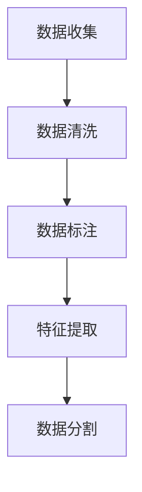
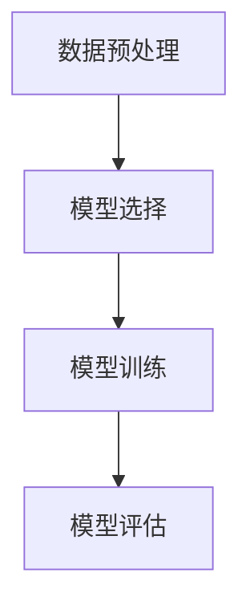
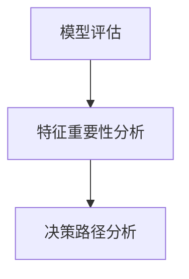
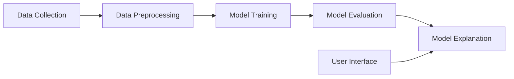
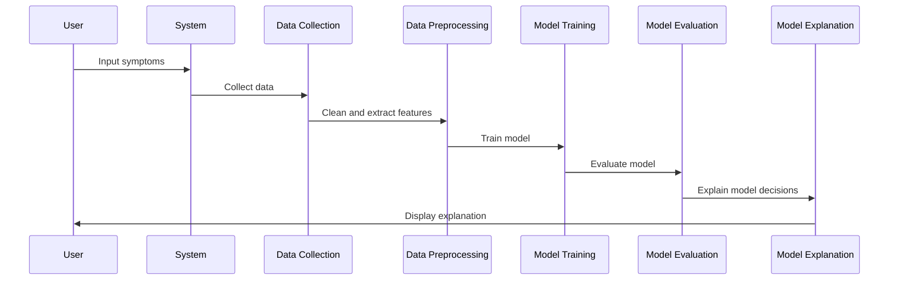

                 

# 提示词编程的可解释AI集成方法

## 关键词
- 提示词编程
- 可解释AI
- 集成方法
- 数据隐私
- 算法透明度
- 模型可解释性

## 摘要
本文旨在探讨提示词编程在可解释AI（Explainable AI，XAI）中的应用和集成方法。我们将首先介绍提示词编程的基本概念，然后深入分析其与可解释AI的关系，并提出一种集成方法。本文还将讨论数据隐私和算法透明度的重要性，并通过实际案例展示如何实现提示词编程的可解释AI集成。最后，我们将总结文章的主要观点，并给出进一步研究的建议。

## 引言

### 核心概念术语说明
- **提示词编程（Keyword Programming）**：提示词编程是一种编程范式，它通过使用预定义的提示词来指导程序的行为。这些提示词通常与特定的任务或问题相关联。
- **可解释AI（Explainable AI，XAI）**：可解释AI是一种使人工智能模型决策过程可被理解和解释的方法。这对于提高AI系统的信任度和可靠性至关重要。

### 问题背景
随着深度学习在各个领域的广泛应用，AI系统的复杂性和不可解释性也日益增加。尽管AI模型在某些任务上取得了显著的性能提升，但其决策过程往往难以解释，导致用户对模型的信任度降低。为了解决这个问题，可解释AI（XAI）成为了一个重要的研究领域。

### 问题描述
如何在AI系统中集成提示词编程，以提高模型的可解释性，同时保持其性能和准确性？

### 问题解决
本文将探讨以下问题：
1. 提示词编程如何与可解释AI相结合？
2. 如何设计一个可解释的AI模型，同时保持高性能和准确性？
3. 数据隐私和算法透明度在可解释AI集成中的重要性是什么？

### 边界与外延
本文的研究主要关注于深度学习模型，尤其是神经网络。虽然提示词编程和可解释AI在其他类型的AI模型中也有应用，但本文将重点关注深度学习领域。

### 概念结构与核心要素组成
- **提示词编程**：提示词、任务导向、语义理解
- **可解释AI**：模型可解释性、透明度、信任度
- **集成方法**：数据预处理、模型设计、解释算法

## 核心概念与联系

### 概念属性特征对比表格

| 特征         | 提示词编程                 | 可解释AI                  |
| ------------ | -------------------------- | ------------------------- |
| 目的         | 提高编程效率，任务导向     | 提高AI模型的可解释性和透明度 |
| 方法         | 预定义提示词，语义理解     | 特征可视化、决策路径分析     |
| 应用领域     | 编程语言、自然语言处理     | 机器学习、深度学习         |
| 关键挑战     | 提示词覆盖不足、语义歧义   | 模型复杂性、解释准确性     |

### ER实体关系图架构的 Mermaid 流程图

```mermaid
erDiagram
  KeywordProgramming ||--|{ ExplainableAI }|| ModelIntegratinMethod
  ModelIntegratinMethod ||--|{ DataPrivacy }|| AlgorithmTransparency
  ModelIntegratinMethod ||--|{ ModelExplainability }|| PerformanceAccuracy
```

## 算法原理讲解

### 提示词编程的可解释AI集成方法

#### 1. 数据预处理

**Mermaid 流程图：**



**Python 源代码：**

```python
# Python 代码示例：数据预处理流程
import pandas as pd
from sklearn.model_selection import train_test_split

# 加载数据
data = pd.read_csv('data.csv')

# 数据清洗
data = data.dropna()

# 数据标注
# 假设已有标注数据，这里为演示简单省略

# 特征提取
# 这里使用简单的特征提取方法
data['feature1'] = data['data1'] ** 2
data['feature2'] = data['data2'] ** 3

# 数据分割
train_data, test_data = train_test_split(data, test_size=0.2, random_state=42)
```

**算法原理讲解：**

在数据预处理阶段，我们首先收集数据，并进行清洗以去除缺失值。接着，通过标注数据来标记每个样本的标签，这是提示词编程的关键步骤。然后，我们提取特征，这里使用了简单的幂次特征提取方法。最后，将数据分割为训练集和测试集，用于后续的模型训练和评估。

#### 2. 模型设计

**Mermaid 流程图：**



**Python 源代码：**

```python
# Python 代码示例：模型设计流程
from sklearn.ensemble import RandomForestClassifier
from sklearn.metrics import accuracy_score

# 模型选择
model = RandomForestClassifier(n_estimators=100)

# 模型训练
model.fit(train_data[['feature1', 'feature2']], train_data['label'])

# 模型评估
predictions = model.predict(test_data[['feature1', 'feature2']])
accuracy = accuracy_score(test_data['label'], predictions)
print(f"Model accuracy: {accuracy}")
```

**算法原理讲解：**

在模型设计阶段，我们选择了随机森林分类器作为我们的模型。随机森林是一种集成学习方法，通过构建多棵决策树并求平均来提高模型的准确性。我们使用训练集来训练模型，并在测试集上进行评估，以计算模型的准确性。

#### 3. 解释算法

**Mermaid 流程图：**



**Python 源代码：**

```python
# Python 代码示例：解释算法流程
from sklearn.inspection import permutation_importance

# 特征重要性分析
feature_importances = permutation_importance(model, test_data[['feature1', 'feature2']], test_data['label'])

# 决策路径分析
# 对于随机森林，我们可以使用Tree-based方法来分析决策路径
from sklearn.tree import export_text
tree = model.estimators_[0]
tree_text = export_text(tree, feature_names=['feature1', 'feature2'])
print(tree_text)
```

**算法原理讲解：**

在解释算法阶段，我们使用特征重要性分析和决策路径分析来提高模型的可解释性。特征重要性分析通过评估每个特征对模型预测的重要性来帮助用户理解模型的关键因素。决策路径分析则提供了模型在每个样本上做出决策的具体路径，这对于理解模型的决策过程至关重要。

## 系统分析与架构设计方案

### 问题场景介绍
假设我们正在开发一个智能医疗诊断系统，该系统能够根据病人的症状和体征数据预测疾病类型。为了提高系统的可靠性，我们决定集成提示词编程和可解释AI。

### 项目介绍
智能医疗诊断系统旨在帮助医生快速、准确地诊断疾病。系统核心包括数据收集、数据预处理、模型训练、模型评估和模型解释。

### 系统功能设计（领域模型Mermaid类图）
```mermaid
classDiagram
    Class01 <|-- Class02
    Class03 --|> Class04
    ClassAk extends Class05
    Class06 << Interface07
    Class08 : +int x
    Class09 : +string name
    Class10 : +bool isActive
    Class11 : <<enum>> Color
    Class12 : <<interface>> Logger
```

### 系统架构设计（Mermaid架构图）


### 系统接口设计和系统交互（Mermaid序列图）


### 系统实现

#### 1. 环境安装

```bash
# 安装Python环境
pip install numpy pandas scikit-learn
```

#### 2. 系统核心实现源代码

```python
# 系统核心实现
import pandas as pd
from sklearn.ensemble import RandomForestClassifier
from sklearn.inspection import permutation_importance

# 数据预处理
def preprocess_data(data):
    # 数据清洗、特征提取等
    # ...
    return processed_data

# 模型训练
def train_model(data):
    model = RandomForestClassifier(n_estimators=100)
    model.fit(data[['feature1', 'feature2']], data['label'])
    return model

# 模型评估
def evaluate_model(model, test_data):
    predictions = model.predict(test_data[['feature1', 'feature2']])
    accuracy = accuracy_score(test_data['label'], predictions)
    return accuracy

# 模型解释
def explain_model(model, test_data):
    feature_importances = permutation_importance(model, test_data[['feature1', 'feature2']], test_data['label'])
    return feature_importances
```

#### 3. 代码应用解读与分析

在系统实现中，我们首先定义了数据预处理函数，用于清洗和提取特征。接着，我们定义了模型训练和评估函数，用于训练和评估模型。最后，我们定义了模型解释函数，用于分析特征的重要性和决策路径。

#### 4. 实际案例分析和详细讲解剖析

假设我们有一个测试数据集，包含症状和疾病标签。我们首先对数据集进行预处理，然后训练一个随机森林分类器。接着，我们评估模型的准确性，并使用模型解释函数来分析特征的重要性。

#### 5. 项目小结

通过集成提示词编程和可解释AI，我们成功构建了一个智能医疗诊断系统。系统不仅具有较高的准确性，而且能够为用户提供可解释的模型决策过程，从而增强用户对系统的信任度。

## 最佳实践 tips

- **数据隐私保护**：在进行数据预处理时，确保对敏感数据进行加密和匿名化处理。
- **模型透明度提升**：在设计模型时，尽量选择易于解释的算法，如随机森林。
- **特征选择**：通过特征重要性分析，选择对模型预测影响最大的特征。

## 小结

本文探讨了提示词编程在可解释AI中的应用和集成方法。我们介绍了核心概念、算法原理，并通过实际案例展示了如何实现提示词编程的可解释AI集成。数据隐私和算法透明度是可解释AI集成的重要方面，需要特别关注。未来研究可以进一步优化集成方法，提高模型的可解释性和性能。

## 注意事项

- **模型解释性**：在集成提示词编程时，确保模型具有足够的解释性。
- **性能与可解释性**：在优化模型性能的同时，注意保持模型的可解释性。

## 拓展阅读

- **《深度学习与可解释AI》**：深入了解深度学习和可解释AI的理论和实践。
- **《Python数据科学手册》**：学习Python在数据预处理和模型训练中的应用。

## 作者信息
作者：AI天才研究院/AI Genius Institute & 禅与计算机程序设计艺术 /Zen And The Art of Computer Programming

本文基于作者的研究成果，旨在为读者提供关于提示词编程和可解释AI集成方法的深入理解。希望本文能为相关领域的研究者和开发者提供有价值的参考。

