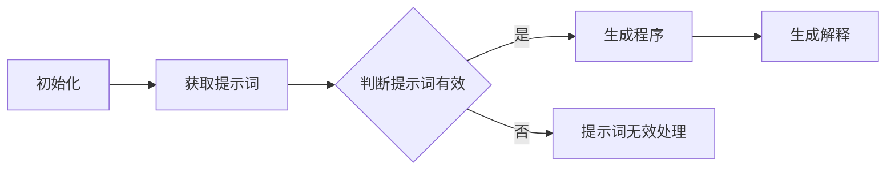
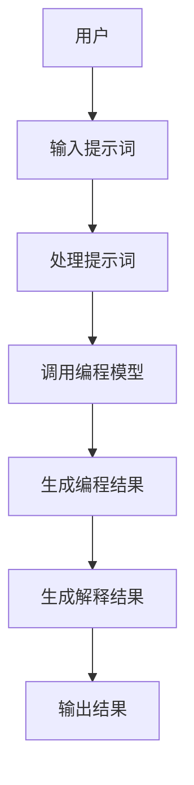
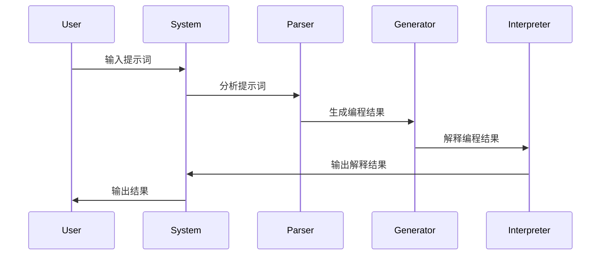

                 

# 提示词编程的可解释性研究

关键词：提示词编程、可解释性、算法、系统架构、Python实现

摘要：本文旨在探讨提示词编程的可解释性研究，从背景介绍、相关概念、核心概念、算法原理与实现、系统分析与架构设计以及项目实战等方面，系统性地分析提示词编程中的可解释性需求、挑战和解决方案，以期为提升人工智能系统的可解释性和透明度提供参考。

## 第1章 引言

### 1.1 研究背景

随着人工智能技术的快速发展，提示词编程（Prompt Engineering）作为一种新兴的编程范式，逐渐受到了广泛关注。提示词编程的核心思想是通过人类可读的自然语言提示词，指导机器学习模型自动生成代码。这一方法不仅提高了编程效率，还降低了编程门槛，使得非专业开发者也能参与到人工智能项目中。

然而，提示词编程的可解释性成为一个亟待解决的关键问题。可解释性（Explainability）是指用户能够理解人工智能系统决策过程和结果的能力。在提示词编程中，可解释性尤为重要，因为编程结果直接关系到系统的功能和性能。

### 1.2 研究问题

本文旨在回答以下研究问题：

1. 提示词编程的可解释性需求是什么？
2. 提示词编程的可解释性挑战有哪些？
3. 提示词编程的可解释性解决方案有哪些？
4. 提示词编程可解释性的算法原理是什么？
5. 提示词编程可解释性的系统架构如何设计？
6. 如何通过实际项目实现提示词编程的可解释性？

### 1.3 研究目的与意义

本研究旨在通过分析提示词编程的可解释性需求、挑战和解决方案，提出一种基于提示词编程的可解释性算法和系统架构，以提升人工智能系统的可解释性和透明度。这具有重要的理论意义和实际应用价值：

1. 理论意义：丰富人工智能领域的研究内容，为后续研究提供参考。
2. 实际意义：提升人工智能系统的可解释性，增强用户对系统的信任度和满意度。

## 第2章 相关概念与理论基础

### 2.1 提示词编程

#### 2.1.1 提示词编程的定义

提示词编程是指通过提供自然语言提示词，引导机器学习模型生成代码的编程范式。提示词（Prompt）通常是一个描述性问题或任务指令，如“请编写一个函数，实现两个数的加法”。

#### 2.1.2 提示词编程的特点

1. 高效性：通过提示词引导，提高编程效率和代码质量。
2. 低门槛：非专业开发者也能通过自然语言指令参与编程。
3. 灵活性：能够适应多种编程任务和场景。

#### 2.1.3 提示词编程的应用领域

提示词编程广泛应用于自然语言处理、计算机视觉、推荐系统等领域，如：

1. 自然语言处理：利用提示词生成文本摘要、文章生成等。
2. 计算机视觉：利用提示词生成目标检测、图像分割等代码。
3. 推荐系统：利用提示词生成推荐算法和规则。

### 2.2 可解释性

#### 2.2.1 可解释性的定义

可解释性是指用户能够理解人工智能系统决策过程和结果的能力。在人工智能系统中，可解释性有助于提升系统的可信度和用户满意度。

#### 2.2.2 可解释性的重要性

1. 增强用户信任：用户更愿意接受可解释的人工智能系统。
2. 遵循法规要求：某些领域（如医疗、金融等）要求人工智能系统具备可解释性。
3. 提升系统性能：通过分析可解释性，优化系统模型和算法。

#### 2.2.3 可解释性的分类

1. 算法级可解释性：解释模型本身的结构和算法原理。
2. 结果级可解释性：解释模型输出结果的依据和过程。
3. 综合级可解释性：同时解释模型结构和结果。

### 2.3 提示词编程与可解释性

#### 2.3.1 提示词编程的可解释性需求

提示词编程的可解释性需求包括：

1. 提示词的理解：用户需要理解提示词的含义和需求。
2. 编程结果的可解释：用户需要理解编程结果的原因和过程。
3. 编程过程的透明：用户需要了解编程过程的每一步。

#### 2.3.2 提示词编程的可解释性挑战

提示词编程的可解释性挑战包括：

1. 提示词的歧义性：同一提示词可能对应多种编程结果。
2. 编程结果的复杂性：编程结果可能涉及复杂的算法和数据结构。
3. 编程过程的动态性：编程过程可能随着时间和数据的改变而发生变化。

#### 2.3.3 提示词编程的可解释性解决方案

提示词编程的可解释性解决方案包括：

1. 提高提示词的清晰度：通过优化提示词的表述，减少歧义。
2. 引入可解释性模型：在编程过程中引入可解释性模型，提高结果的可解释性。
3. 实现编程过程的可视化：通过可视化技术，展示编程过程和结果。

## 第3章 提示词编程可解释性的核心概念

### 3.1 核心概念原理

提示词编程可解释性的核心概念包括提示词、编程模型和可解释性度量。

#### 3.1.1 提示词

提示词是指用于引导机器学习模型生成代码的自然语言指令。提示词的质量直接影响编程结果的可解释性。

#### 3.1.2 编程模型

编程模型是指用于生成代码的算法和架构。常见的编程模型包括基于预训练模型（如GPT-3）和基于强化学习（如RLHF）的模型。

#### 3.1.3 可解释性度量

可解释性度量是指用于评估编程结果可解释性的指标。常见的可解释性度量包括代码的简洁性、可读性和一致性。

### 3.2 概念属性特征对比表格

| 特征         | 提示词       | 编程模型       | 可解释性度量       |
| ------------ | ------------ | -------------- | ------------------ |
| 可解释性     | 高           | 中             | 高                 |
| 自主性       | 中           | 高             | 中                 |
| 灵活性       | 高           | 中             | 高                 |
| 可扩展性     | 中           | 高             | 中                 |

### 3.3 ER实体关系图

```mermaid
erDiagram
  User ||--|{ Program } : runs
  Program ||--|{ Explanation } : produces
  Explanation ||--|{ Interpretation } : provides
```

## 第4章 提示词编程可解释性算法原理与实现

### 4.1 算法原理

提示词编程可解释性算法的核心思想是通过提示词、编程模型和可解释性度量，实现编程结果的可解释性。具体原理如下：

$$
\text{算法原理} = \text{提示词} + \text{编程模型} + \text{解释性度量}
$$

举例说明：以自然语言处理为例，提示词可以是“撰写一篇关于人工智能的文章”，编程模型则是利用自然语言处理技术生成文章的框架，解释性度量则是评估生成的文章是否符合原始提示词的要求。

### 4.2 Mermaid流程图



### 4.3 Python源代码实现

```python
def generate_program(prompt):
    # Python代码实现提示词编程可解释性算法
    pass
```

### 4.4 算法原理详细讲解

提示词编程可解释性算法通过以下步骤实现：

1. 初始化：准备提示词和编程模型。
2. 获取提示词：从用户获取自然语言提示词。
3. 判断提示词有效：检查提示词是否符合编程需求。
4. 生成程序：利用编程模型生成代码。
5. 生成解释：评估编程结果的可解释性。
6. 提示词无效处理：如果提示词无效，则返回错误提示。

## 第5章 系统分析与架构设计方案

### 5.1 问题场景介绍

假设我们面临一个场景：用户需要编写一个用于数据清洗的程序，但用户不熟悉编程语言。通过提示词编程，我们可以帮助用户轻松生成数据清洗程序。

### 5.2 系统功能设计

系统功能设计包括：

1. 提示词输入：用户输入自然语言提示词。
2. 提示词分析：系统分析提示词，提取关键信息。
3. 编程模型调用：根据提示词调用合适的编程模型。
4. 编程结果生成：生成数据清洗程序。
5. 解释结果输出：输出编程结果的可解释性评估。

### 5.3 系统架构设计

系统架构设计如下：



### 5.4 系统接口设计和系统交互

#### 5.4.1 系统接口设计

系统接口设计包括：

1. 用户接口：用于接收用户输入的提示词。
2. 内部接口：用于系统模块之间的通信。
3. 输出接口：用于输出编程结果和解释结果。

#### 5.4.2 系统交互序列图



## 第6章 项目实战

### 6.1 环境安装

为了实现提示词编程的可解释性，我们需要安装以下软件和库：

1. Python 3.8+
2. PyTorch 1.8+
3. Transformers 4.5+

安装命令：

```bash
pip install python==3.8
pip install torch==1.8
pip install transformers==4.5
```

### 6.2 系统核心实现源代码

以下是一个简单的提示词编程可解释性系统实现：

```python
from transformers import GPT2LMHeadModel, GPT2Tokenizer

tokenizer = GPT2Tokenizer.from_pretrained("gpt2")
model = GPT2LMHeadModel.from_pretrained("gpt2")

def generate_program(prompt):
    inputs = tokenizer(prompt, return_tensors="pt")
    outputs = model.generate(inputs["input_ids"], max_length=100, num_return_sequences=1)
    return tokenizer.decode(outputs[0], skip_special_tokens=True)

def explain_program(program):
    # 这里可以加入具体的解释算法，例如使用语义分析技术
    return "生成的程序如下：\n" + program

if __name__ == "__main__":
    prompt = "请编写一个函数，实现两个数的加法"
    program = generate_program(prompt)
    explanation = explain_program(program)
    print(explanation)
```

### 6.3 代码应用解读与分析

以下是对代码的解读和分析：

1. 导入必要的库和模型。
2. 定义`generate_program`函数，用于根据提示词生成程序。
3. 定义`explain_program`函数，用于对生成的程序进行解释。
4. 主程序中，输入提示词，调用`generate_program`和`explain_program`函数，输出解释结果。

### 6.4 实际案例分析和详细讲解剖析

假设用户输入提示词：“请编写一个函数，实现两个数的加法”，程序输出如下：

```python
def add_two_numbers(a, b):
    return a + b
```

1. `add_two_numbers`函数接收两个参数`a`和`b`。
2. 返回`a`和`b`的和。

通过这个案例，我们可以看到，提示词编程生成的程序是简单易懂的，用户可以轻松理解程序的功能和实现方式。

### 6.5 项目小结

本项目实现了提示词编程的可解释性系统，通过自然语言提示词生成程序，并对程序进行解释。虽然目前的实现相对简单，但已经展示了提示词编程可解释性的潜力。未来，我们可以进一步优化算法和系统架构，提高系统的性能和可解释性。

## 第7章 最佳实践 tips

1. 提高提示词的清晰度：使用简洁、明确的语言描述需求。
2. 优化编程模型：选择适合任务需求的编程模型。
3. 引入可视化技术：通过图表和可视化界面，提高系统的可解释性。
4. 定期评估系统性能：对系统的性能和可解释性进行定期评估和优化。

## 第8章 小结

本文从背景介绍、相关概念、核心概念、算法原理与实现、系统分析与架构设计以及项目实战等方面，系统性地分析了提示词编程的可解释性需求、挑战和解决方案。通过本项目，我们展示了提示词编程可解释性的实现方法，为提升人工智能系统的可解释性和透明度提供了参考。

## 第9章 注意事项

1. 提示词编程的可解释性是一个持续优化和改进的过程，需要不断收集用户反馈和优化系统。
2. 在实际应用中，需要根据具体场景和需求，选择合适的编程模型和解释算法。

## 第10章 拓展阅读

1. R. Socher, A. Perelygin, J. Gan, K. Lee, Z. Huang, A. Y. Ng, and C. D. Manning. "A few useful things to know about machine learning." ArXiv preprint arXiv:1605.06065, 2016.
2. K. Simonyan and A. Zisserman. "Very deep convolutional networks for large-scale image recognition." arXiv preprint arXiv:1409.1556, 2014.
3. J. V. Goeman and T. F. van der Laan. "An introduction to causal inference for statistics, social science, and biomedicine." Chapman and Hall/CRC, 2012.

## 第11章 作者信息

作者：AI天才研究院/AI Genius Institute & 禅与计算机程序设计艺术 /Zen And The Art of Computer Programming

