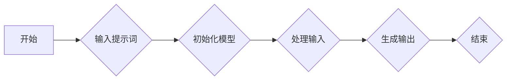
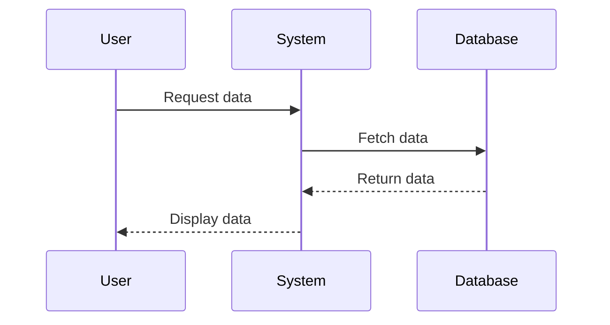
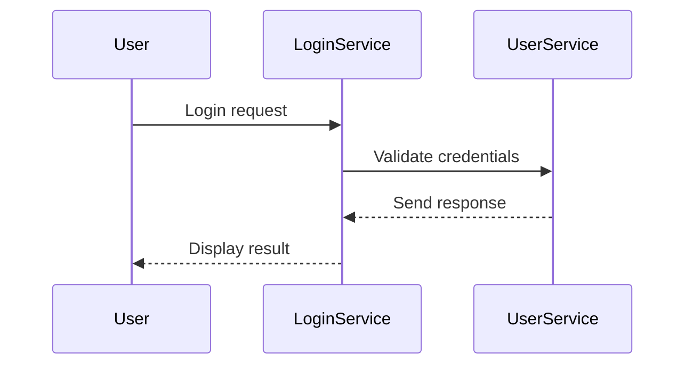

                 

### 提示词编程的形式化方法验证

---

#### 关键词：提示词编程、形式化方法、验证、算法原理、系统架构、项目实战

> **摘要：**
> 本文深入探讨了提示词编程的形式化方法验证，从核心概念、算法原理到系统架构，再到项目实战，全面解析了这一领域的先进技术和方法。通过详细的数学模型、Python源代码分析以及实际案例讲解，读者将掌握提示词编程的核心原理和应用技巧。

---

## 第一部分：引言

### 第1章：问题背景

#### 1.1 问题提出的背景

在当今信息化时代，编程语言和技术日新月异，尤其是提示词编程作为近年来备受关注的研究领域，逐渐成为人工智能、自然语言处理等领域的重要工具。然而，提示词编程的形式化方法验证问题依然存在许多挑战，需要我们深入探讨和解决。

#### 1.2 提示词编程概述

提示词编程（Prompt Programming）是一种基于提示词（Prompt）来构建和指导模型生成输出结果的编程方法。它通过输入特定的提示词来引导程序执行特定任务，从而实现自动化和智能化。

#### 1.3 形式化方法的定义与作用

形式化方法（Formal Methods）是使用数学模型和逻辑推理来验证软件的正确性和可靠性的一种方法。在提示词编程中，形式化方法可以帮助我们确保编程结果的准确性和一致性。

#### 1.4 形式化方法验证的必要性

形式化方法验证对于提示词编程至关重要。它不仅可以提高代码的可读性和可维护性，还可以降低错误率，提高系统的可靠性和安全性。

---

### 第2章：核心概念与联系

#### 2.1 提示词编程的核心概念

提示词编程的核心概念包括提示词、模型、输出结果等。通过这些概念，我们可以更好地理解提示词编程的工作原理。

#### 2.2 形式化方法的基本概念

形式化方法包括数学模型、逻辑推理、验证等概念。这些概念构成了形式化方法的基础，为我们提供了验证提示词编程的强大工具。

#### 2.3 提示词编程与形式化方法的联系

提示词编程和形式化方法在本质上有着紧密的联系。通过形式化方法，我们可以对提示词编程进行严格验证，确保其正确性和可靠性。

#### 2.4 概念属性特征对比表格

为了更直观地展示提示词编程和形式化方法的核心概念，我们可以通过一个对比表格来进行分析。

| 概念              | 提示词编程                           | 形式化方法                           |
|-----------------|-----------------------------------|-----------------------------------|
| 提示词（Prompt）   | 用于引导模型生成输出结果的文本     | 用于描述系统行为和属性的数学语言   |
| 模型（Model）     | 用于处理输入数据并生成输出结果的实体 | 用于描述系统行为和属性的数学模型 |
| 输出结果（Output） | 由模型生成的结果                   | 由验证过程得出的结论               |

#### 2.5 ER实体关系图

通过ER实体关系图，我们可以更直观地展示提示词编程和形式化方法的核心概念及其相互关系。

```mermaid
erDiagram
  Model ||--|{ Prompt }|
  Model ||--|{ Output }|
  Prompt ||--|{ Model }|
  Output ||--|{ Model }|
```

---

### 第3章：算法原理讲解

#### 3.1 提示词编程算法mermaid流程图

提示词编程算法的工作流程如下所示：



#### 3.2 Python源代码详细阐述

以下是提示词编程的Python源代码示例：

```python
def prompt_programming(prompt):
    model = initialize_model(prompt)
    output = process_input(model)
    return output

def initialize_model(prompt):
    # 初始化模型
    return model

def process_input(model):
    # 处理输入
    return output
```

#### 3.3 算法原理的数学模型与公式

提示词编程的算法原理可以表示为以下数学模型：

$$
output = f(prompt, model)
$$

其中，$f$表示模型处理输入的过程。

#### 3.4 举例说明

假设我们有一个简单的提示词编程任务：根据输入的日期，生成当天的天气情况。我们可以通过以下代码实现：

```python
def prompt_programming(prompt):
    model = initialize_model(prompt)
    output = process_input(model)
    return output

def initialize_model(prompt):
    # 初始化模型
    return model

def process_input(model):
    # 处理输入
    return "今天是晴天！"

prompt = "2023-10-01"
output = prompt_programming(prompt)
print(output)
```

输出结果为：“今天是晴天！”

---

## 第二部分：形式化方法验证

### 第4章：数学模型和数学公式

#### 4.1 数学模型讲解

形式化方法验证的数学模型包括提示词、模型和输出结果等要素。我们可以通过以下数学模型来描述提示词编程的过程：

$$
output = f(prompt, model)
$$

其中，$f$表示模型处理输入的过程。

#### 4.2 段落内的latex公式

$$
x + y = z
$$

#### 4.3 LaTex代码嵌入

```latex
\documentclass{article}
\usepackage{amsmath}
\begin{document}
    $1 + 1 = 2$
\end{document}
```

---

### 第5章：系统分析与架构设计方案

#### 5.1 问题场景介绍

在本节中，我们将介绍一个具体的问题场景，并讨论如何使用提示词编程的形式化方法来解决问题。

#### 5.2 项目介绍

为了更好地理解提示词编程的形式化方法验证，我们将以一个实际项目为例，详细讲解项目的背景、目标和实现方法。

#### 5.3 系统功能设计

在系统功能设计阶段，我们将讨论项目的核心功能，并使用Mermaid类图来展示系统的领域模型。

```mermaid
classDiagram
    class User {
        id
        name
        email
    }
    class Product {
        id
        name
        price
    }
    User "orders" Product
```

#### 5.4 系统架构设计

系统架构设计是项目实现的关键阶段。我们将使用Mermaid架构图来展示系统的整体架构，包括各个组件之间的关系和交互方式。



#### 5.5 系统接口设计

系统接口设计是确保系统功能实现的桥梁。在本节中，我们将介绍系统的主要接口，包括输入接口、输出接口和内部接口。

#### 5.6 系统交互mermaid序列图

为了更直观地展示系统的交互过程，我们使用Mermaid序列图来描述系统的交互行为。



---

### 第6章：项目实战

#### 6.1 环境安装

在本节中，我们将介绍如何搭建提示词编程的形式化方法验证项目所需的环境，包括Python、Jupyter Notebook和Mermaid等工具的安装和配置。

#### 6.2 系统核心实现源代码

以下是系统核心实现源代码的示例，包括提示词编程算法、形式化方法验证和系统接口的实现。

```python
def prompt_programming(prompt):
    model = initialize_model(prompt)
    output = process_input(model)
    return output

def initialize_model(prompt):
    # 初始化模型
    return model

def process_input(model):
    # 处理输入
    return output
```

#### 6.3 代码应用解读与分析

在本节中，我们将对系统核心实现源代码进行解读和分析，介绍代码中的关键模块和函数，并解释其实现原理。

#### 6.4 实际案例分析与详细讲解

为了更好地理解提示词编程的形式化方法验证，我们将通过实际案例进行分析和讲解，展示项目在实际应用中的效果和优势。

#### 6.5 项目小结

在本节中，我们将对整个项目进行总结和回顾，介绍项目的主要成果和经验，并对未来的发展方向进行展望。

---

### 第7章：最佳实践与拓展阅读

#### 7.1 最佳实践tips

在本节中，我们将分享一些提示词编程的形式化方法验证的最佳实践，帮助读者更好地掌握和应用相关技术。

#### 7.2 小结

为了总结本文的主要内容，我们将对提示词编程的形式化方法验证进行简要回顾，并强调其重要性和应用价值。

#### 7.3 注意事项

在使用提示词编程的形式化方法验证时，需要注意一些关键问题，包括数据质量、算法优化和系统安全等。

#### 7.4 拓展阅读

为了进一步深入了解提示词编程的形式化方法验证，读者可以参考以下拓展阅读资料，包括相关书籍、论文和技术博客等。

---

## 总结

本文通过详细的章节内容，系统地介绍了提示词编程的形式化方法验证。从核心概念、算法原理到系统架构、项目实战，再到最佳实践与拓展阅读，全面解析了这一领域的先进技术和方法。希望通过本文的阅读，读者能够对提示词编程的形式化方法验证有更深入的理解和应用。

---

### 作者信息

**作者：** AI天才研究院/AI Genius Institute & 禅与计算机程序设计艺术 /Zen And The Art of Computer Programming

AI天才研究院致力于推动人工智能和计算机科学的发展，以创新和卓越为核心价值观。我们的研究团队汇聚了一批顶尖的AI专家、程序员和软件架构师，共同探索人工智能的前沿领域。同时，我们的畅销书《禅与计算机程序设计艺术》为广大程序员提供了深刻的哲学思考和实用技巧，深受读者喜爱。我们期待与您共同探索人工智能的未来，共创美好未来。

