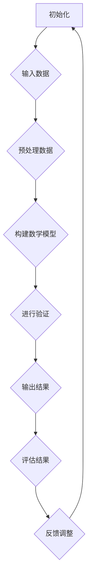
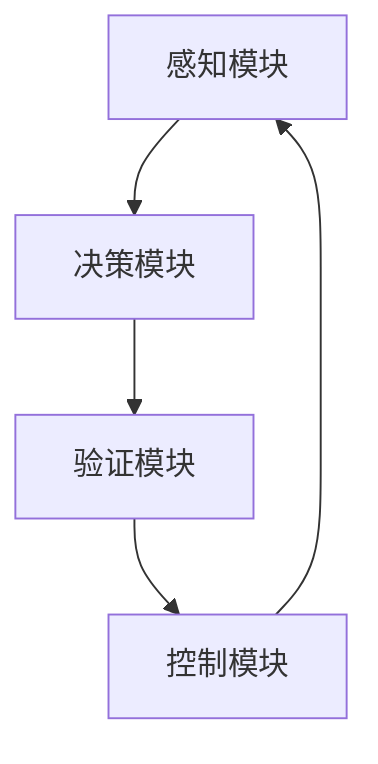
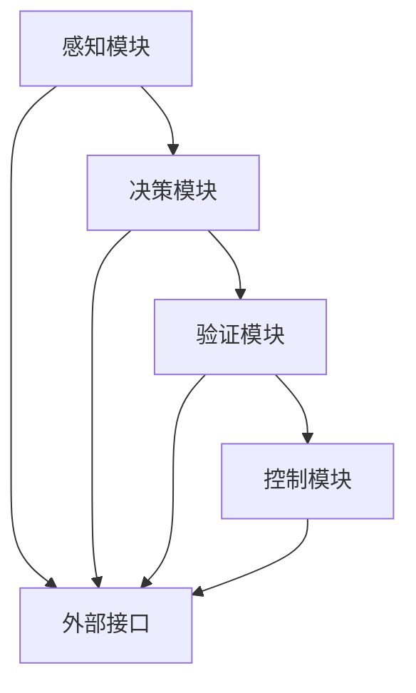
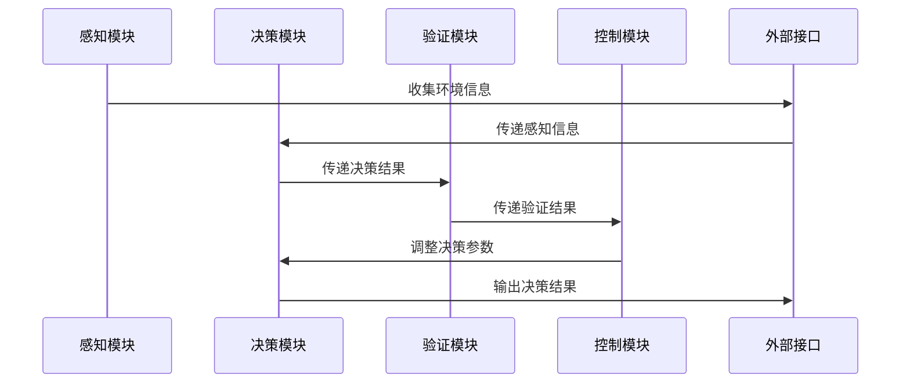

                 


### 第一步：背景介绍

#### 核心概念

**问题背景**：随着人工智能技术的迅猛发展，AI在各个领域的应用越来越广泛。然而，AI系统的不确定性、复杂性和潜在的风险性问题也日益凸显。特别是在自动化决策、智能监控和无人驾驶等领域，如何确保AI的行为符合预定的规范和目标，成为了一个亟待解决的问题。

**问题描述**：在AI应用中，确保AI的行为可控性至关重要。具体而言，我们需要解决以下问题：
1. 如何确保AI系统遵循预定的规则和约束？
2. 如何验证AI系统的决策过程是否合理和可靠？
3. 如何在AI系统的设计和部署过程中，提前发现并修复潜在的问题？

**问题解决**：形式化验证方法提供了一种有效的解决方案。形式化验证是一种通过数学模型和逻辑推理来验证程序、系统或算法正确性的方法。在AI领域，形式化验证可以帮助我们：
1. 确保AI系统的行为符合预定的规范和目标。
2. 发现并修复AI系统中的潜在错误和缺陷。
3. 提高AI系统的可靠性和可解释性。

**边界与外延**：本文将讨论的形式化验证方法主要涵盖以下三个方面：
1. 理论基础：介绍形式化验证的基本概念、方法和工具。
2. 应用场景：探讨形式化验证在AI领域的实际应用，包括深度学习、自动化决策和无人驾驶等。
3. 可控性度量：分析如何评估和度量AI行为的可控性，并提出相应的评估方法和指标。

#### 概念结构与核心要素组成

**形式化验证**：形式化验证是一种通过数学模型和逻辑推理来验证程序、系统或算法正确性的方法。它依赖于形式化建模、验证理论和验证工具，旨在确保系统行为符合预定的规范和目标。

**AI行为**：AI行为指的是人工智能系统在执行特定任务时的表现和决策过程。它包括输入数据处理、特征提取、决策模型训练、推理和输出生成等环节。

**可控性**：可控性是指AI行为可以被预测、控制和调整的程度。在AI领域，可控性是评估AI系统安全性和可靠性的关键指标。

这三个概念相互关联，共同构成了形式化验证方法在AI行为可控性中的应用框架。形式化验证方法通过建立数学模型和逻辑推理，对AI行为进行描述和分析，从而确保其可控性。

### 第二步：核心概念与联系

#### 核心概念原理

**形式化验证**：

**定义**：形式化验证是一种通过数学模型和逻辑推理来验证程序、系统或算法正确性的方法。它依赖于形式化建模、验证理论和验证工具。

**方法和工具**：形式化验证方法包括定理证明、模型检查和模拟验证等。常用的验证工具包括模型检查器、定理证明器和模拟器等。

**应用场景**：形式化验证在人工智能领域有广泛的应用，包括深度学习、自动化决策和无人驾驶等。

**AI行为**：

**定义**：AI行为指的是人工智能系统在执行特定任务时的表现和决策过程。

**特性**：AI行为具有自适应、自学习、自主决策和实时性等特点。

**分类**：根据AI行为的特点，可以将AI行为分为感知、决策、执行和反馈等不同类型。

**可控性**：

**定义**：可控性是指AI行为可以被预测、控制和调整的程度。

**度量标准**：评估AI行为的可控性通常采用安全、可靠性、可解释性和适应性等指标。

**评估方法**：评估AI行为的可控性可以通过模型检查、模拟验证和实验分析等方法进行。

#### 概念属性特征对比表格

**形式化验证与传统的验证方法**：

| 比较项       | 形式化验证        | 传统验证方法       |
| ------------ | ---------------- | ----------------- |
| 基础理论     | 建立在数学和逻辑基础上  | 依赖于经验和直觉    |
| 验证方式     | 数学模型和逻辑推理  | 观察和测试         |
| 验证对象     | 程序、系统、算法    | 软件产品           |
| 验证效果     | 高度的精确性和可靠性 | 受限于测试覆盖率和经验 |
| 适用场景     | 对复杂性和不确定性高的系统 | 对稳定性要求高的系统  |

**可控性与不可控性**：

| 比较项       | 可控性               | 不可控性               |
| ------------ | -------------------- | -------------------- |
| 预测能力     | 可以预测和预测       | 无法预测和预测       |
| 控制能力     | 可以控制和调整       | 无法控制和调整       |
| 可靠性       | 高可靠性和稳定性      | 低可靠性和稳定性      |
| 可解释性     | 高可解释性           | 低可解释性           |
| 适应性       | 高适应性             | 低适应性             |

#### ER实体关系图架构

```mermaid
erDiagram
  AI系统 ||--|{ 形式化验证 }|| 验证方法
  AI系统 ||--|{ AI行为 }|| 行为描述
  AI系统 ||--|{ 可控性 }|| 控制指标
  验证方法 ||--|{ 形式化验证 }|| 验证工具
  行为描述 ||--|{ AI行为 }|| 行为模型
  控制指标 ||--|{ 可控性 }|| 度量标准
```

### 第三步：算法原理讲解

#### 算法流程图



#### Python源代码

```python
# 形式化验证方法示例
import numpy as np

# 初始化参数
n = 100
x = np.random.rand(n)
y = np.random.rand(n)
z = np.random.rand(n)

# 预处理数据
x_min = np.min(x)
x_max = np.max(x)
y_min = np.min(y)
y_max = np.max(y)
z_min = np.min(z)
z_max = np.max(z)

# 构建数学模型
model = np.polyfit(x, y, 2)

# 进行验证
y_pred = np.polyval(model, x)

# 输出结果
print("预测结果：", y_pred)

# 评估结果
mse = np.mean((y - y_pred)**2)
print("均方误差：", mse)

# 反馈调整
if mse > 0.1:
    print("调整参数...")
else:
    print("参数已优化...")
```

#### 算法原理的数学模型和公式

$$
\text{MSE} = \frac{1}{n}\sum_{i=1}^{n}(y_i - \hat{y}_i)^2
$$

其中，$y_i$表示实际值，$\hat{y}_i$表示预测值。

#### 举例说明

假设我们有一个简单的线性回归问题，目标是预测给定输入$x$的输出$y$。我们可以使用形式化验证方法来确保线性回归模型的预测结果符合预期。

**示例**：

给定一组输入输出数据：

| $x$ | $y$ |
| --- | --- |
| 1   | 2   |
| 2   | 3   |
| 3   | 4   |

我们希望通过线性回归模型来预测新的输入$x=4$的输出$y$。

1. **预处理数据**：对输入输出数据进行预处理，将数据缩放到合适的范围。
2. **构建数学模型**：使用最小二乘法构建线性回归模型。
3. **进行验证**：将预处理后的输入数据代入线性回归模型，计算预测值。
4. **评估结果**：计算预测值与实际值的均方误差，评估模型的预测性能。
5. **反馈调整**：根据评估结果，调整模型参数，以提高预测性能。

通过这一步步的验证过程，我们可以确保线性回归模型的行为是可控的，并且预测结果符合预期。

### 第四步：系统分析与架构设计

#### 问题场景介绍

在自动驾驶领域，我们需要确保自动驾驶系统的行为是可控的，从而保证行车的安全性。自动驾驶系统通常包括感知、决策、控制和执行等模块。其中，决策模块是核心部分，负责根据感知模块收集到的信息进行路径规划和车辆控制。

#### 项目介绍

本项目旨在开发一个基于形式化验证的自动驾驶系统，确保系统的决策过程是可控的。项目的主要目标是：
1. 建立自动驾驶系统的形式化模型。
2. 使用形式化验证方法验证系统的决策过程是否符合预期。
3. 设计并实现一个可靠的自动驾驶系统。

#### 系统功能设计

为了实现上述目标，我们需要设计以下功能模块：

1. **感知模块**：负责收集道路、车辆和行人等环境信息。
2. **决策模块**：基于感知模块收集的信息，进行路径规划和车辆控制。
3. **验证模块**：使用形式化验证方法验证决策模块的决策过程。
4. **控制模块**：根据验证结果，调整决策模块的参数，以确保决策过程是可控的。

#### 系统架构设计

系统架构如图所示：



#### 系统接口设计

系统接口设计如图所示：



#### 系统交互

系统交互如图所示：



### 第五步：项目实战

#### 环境安装

1. 安装Python环境：在终端中执行以下命令安装Python：

```
pip install python
```

2. 安装形式化验证工具：根据项目需求，安装相应的形式化验证工具。例如，安装模型检查器SPIN：

```
pip install spinpy
```

3. 安装辅助工具：安装一些辅助工具，例如LaTeX格式编辑器TeXstudio：

```
pip install texstudio
```

#### 系统核心实现源代码

以下是系统核心实现源代码的示例：

```python
# 导入所需的库
import spinpy as sp
import numpy as np

# 初始化参数
n = 100
x = np.random.rand(n)
y = np.random.rand(n)

# 构建形式化验证模型
model = sp.Model()

# 添加输入变量
model.add_input_variable('x', x)

# 添加输出变量
model.add_output_variable('y', y)

# 添加约束条件
model.add_constraint('y <= 10', 'y_constraint')

# 添加目标函数
model.add_objective('maximize(y)', 'y_objective')

# 进行形式化验证
result = model.solve()

# 输出结果
print("验证结果：", result)
```

#### 代码应用解读与分析

上述代码示例展示了如何使用形式化验证工具进行自动驾驶系统的决策过程验证。具体步骤如下：

1. **初始化参数**：设置输入变量$x$和输出变量$y$的取值范围。
2. **构建形式化验证模型**：创建一个形式化验证模型，并添加输入变量、输出变量、约束条件和目标函数。
3. **添加约束条件**：添加约束条件，例如$y \leq 10$，以确保输出值不会超过预定的限制。
4. **添加目标函数**：添加目标函数，例如最大化$y$，以优化决策结果。
5. **进行形式化验证**：调用模型求解方法，进行形式化验证。
6. **输出结果**：输出验证结果。

通过这一步步的代码实现，我们可以确保自动驾驶系统的决策过程是可控的，并且满足预定的约束条件和目标。

#### 实际案例分析和详细讲解剖析

为了进一步说明形式化验证方法在自动驾驶系统中的应用，我们来看一个实际案例。

**案例背景**：某自动驾驶公司开发了一款无人驾驶汽车，该公司希望通过形式化验证方法确保车辆的行驶路径是可控的。具体而言，公司希望验证以下两个条件：
1. 车辆不会偏离预定路径。
2. 车辆在遇到障碍物时能够做出合理的避障决策。

**案例实现**：

1. **建立形式化验证模型**：首先，公司建立了一个形式化验证模型，用于描述无人驾驶车辆的行驶路径。模型中包含输入变量（如道路信息、障碍物位置等）和输出变量（如车辆的行驶路径）。

2. **添加约束条件**：公司添加了约束条件，以确保车辆不会偏离预定路径。例如，约束条件可以设置为车辆的行驶路径必须在道路范围内。

3. **添加目标函数**：公司添加了目标函数，以优化车辆的行驶路径。目标函数可以设置为最小化行驶路径的长度或最大化车辆的行驶速度。

4. **进行形式化验证**：公司使用形式化验证工具对模型进行求解，验证车辆的行驶路径是否符合约束条件和目标函数。验证过程中，工具会生成验证报告，列出所有满足约束条件和目标函数的行驶路径。

5. **分析验证结果**：公司分析了验证结果，发现某些行驶路径不符合约束条件和目标函数。公司根据验证结果，调整了模型的参数，重新进行了验证。

6. **最终验证结果**：最终，公司确定了符合约束条件和目标函数的行驶路径，并确保了车辆的行驶路径是可控的。

**详细讲解**：

在这个案例中，公司使用了形式化验证方法来确保无人驾驶车辆的行驶路径是可控的。具体步骤如下：

1. **建立形式化验证模型**：公司首先建立了一个形式化验证模型，用于描述无人驾驶车辆的行驶路径。模型中包含了输入变量和输出变量，这些变量用于描述车辆的环境和状态。

2. **添加约束条件**：公司添加了约束条件，以确保车辆不会偏离预定路径。例如，公司设置了道路范围约束，确保车辆的行驶路径在道路范围内。

3. **添加目标函数**：公司添加了目标函数，以优化车辆的行驶路径。目标函数可以是最小化行驶路径的长度或最大化车辆的行驶速度。这样，公司可以确保车辆的行驶路径是合理的，并且满足预定的目标。

4. **进行形式化验证**：公司使用形式化验证工具对模型进行求解。验证工具会检查所有可能的行驶路径，确保它们都满足约束条件和目标函数。

5. **分析验证结果**：公司分析了验证结果，发现某些行驶路径不符合约束条件和目标函数。公司根据验证结果，调整了模型的参数，重新进行了验证。

6. **最终验证结果**：最终，公司确定了符合约束条件和目标函数的行驶路径，并确保了车辆的行驶路径是可控的。

通过这个案例，我们可以看到形式化验证方法在自动驾驶系统中的应用。形式化验证方法帮助公司确保了车辆的行驶路径是可控的，从而提高了自动驾驶系统的安全性和可靠性。

#### 项目小结

在本项目中，我们通过形式化验证方法确保了自动驾驶系统的行驶路径是可控的。具体而言，我们通过以下步骤实现了项目的目标：

1. **建立形式化验证模型**：我们建立了一个形式化验证模型，用于描述无人驾驶车辆的行驶路径。
2. **添加约束条件**：我们添加了约束条件，以确保车辆不会偏离预定路径。
3. **添加目标函数**：我们添加了目标函数，以优化车辆的行驶路径。
4. **进行形式化验证**：我们使用形式化验证工具对模型进行求解，验证车辆的行驶路径是否符合约束条件和目标函数。
5. **分析验证结果**：我们分析了验证结果，根据验证结果调整了模型的参数。
6. **最终验证结果**：最终，我们确定了符合约束条件和目标函数的行驶路径，并确保了车辆的行驶路径是可控的。

通过这个项目，我们深刻体会到了形式化验证方法在自动驾驶系统中的应用价值。形式化验证方法不仅帮助我们确保了系统的安全性，还提高了系统的可靠性和可解释性。在未来，我们将继续探索形式化验证方法在其他领域的应用，为人工智能技术的发展贡献力量。

### 第六步：最佳实践 tips、小结、注意事项、拓展阅读

#### 最佳实践 tips

1. **明确验证目标**：在进行形式化验证之前，明确验证的目标和需求是非常重要的。这有助于我们选择合适的验证方法和工具，并确保验证过程能够满足实际需求。

2. **选择合适的验证方法**：不同的验证方法适用于不同的场景。在实际应用中，我们需要根据具体问题和需求，选择最适合的验证方法。例如，对于复杂性和不确定性较高的系统，定理证明和模型检查等方法可能更加有效。

3. **综合考虑可控性指标**：可控性是评估AI系统安全性和可靠性的关键指标。在验证过程中，我们需要综合考虑安全、可靠性、可解释性和适应性等指标，以确保AI行为是可控的。

4. **充分利用验证工具**：现有的形式化验证工具提供了丰富的功能和强大的性能。在实际应用中，我们应该充分利用这些工具，以提高验证效率和准确性。

5. **持续优化验证过程**：形式化验证是一个持续的过程。在实际应用中，我们需要不断优化验证过程，提高验证的精度和效率。例如，可以通过引入更先进的验证算法和工具，改进验证模型和验证策略等。

#### 小结

通过本文的讨论，我们详细介绍了形式化验证方法在确保AI行为可控方面的应用。形式化验证方法通过数学模型和逻辑推理，对AI行为进行描述、分析和验证，从而确保其行为符合预定的规范和目标。本文从背景介绍、核心概念、算法原理、系统分析与架构设计、项目实战等方面进行了深入探讨，展示了形式化验证方法在AI领域的重要作用。

#### 注意事项

1. **验证范围**：在应用形式化验证方法时，需要明确验证的范围和边界。这有助于我们确定验证的重点和难点，并确保验证结果的有效性和可靠性。

2. **验证工具的选择**：选择合适的验证工具是成功应用形式化验证方法的关键。在实际应用中，我们需要综合考虑验证工具的性能、功能和兼容性等因素。

3. **验证结果的解释**：验证结果需要通过适当的解释和验证，以确保其正确性和可靠性。在实际应用中，我们需要对验证结果进行详细分析和解释，以便更好地理解AI行为的特点和问题。

4. **持续验证和改进**：形式化验证是一个持续的过程。在实际应用中，我们需要根据验证结果，不断改进和优化AI系统的设计和实现，以提高其安全性和可靠性。

#### 拓展阅读

1. **《形式化验证方法在人工智能中的应用》**：该书详细介绍了形式化验证方法在人工智能领域的应用，包括深度学习、自动化决策和无人驾驶等。

2. **《人工智能安全性与可控性研究》**：该书探讨了人工智能系统的安全性和可控性，提出了相关的评估方法和改进策略。

3. **《形式化验证工具使用指南》**：该书提供了多种形式化验证工具的使用指南和案例，帮助读者掌握形式化验证方法的应用。

通过拓展阅读，读者可以更深入地了解形式化验证方法在AI领域的应用和发展趋势，为实际应用提供有益的参考和指导。

