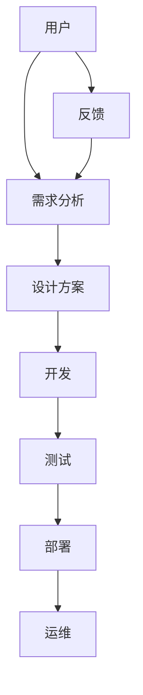
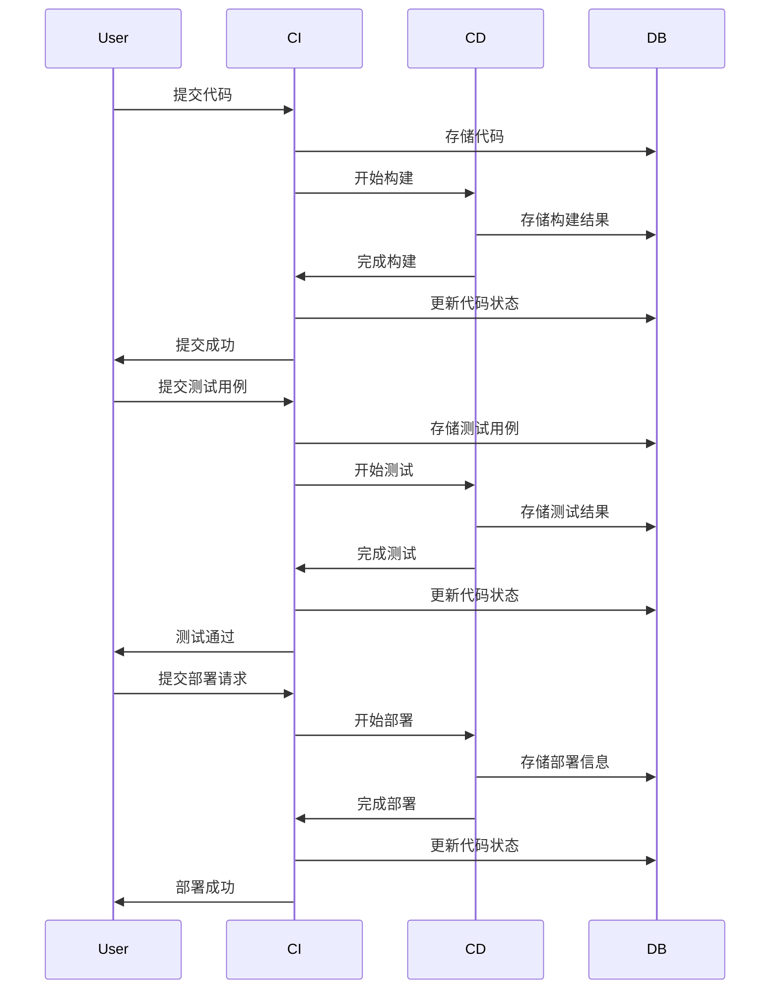

                 

# 提示词编程的持续集成与部署

> 关键词：提示词编程、持续集成、持续部署、容器化、自动化测试、版本控制

> 摘要：本文将深入探讨提示词编程在持续集成与部署（CI/CD）中的应用，详细解析其原理、实践方法及最佳实践。通过系统的讲解和实例分析，帮助读者全面掌握CI/CD的核心技术，提升项目开发与运维效率。

## 引言

### 核心概念术语说明

- **提示词编程**：一种基于预训练模型和自然语言理解的技术，通过输入提示词来生成目标代码或文本。
- **持续集成（CI）**：自动化构建和测试代码的过程，确保代码质量，快速发现和修复问题。
- **持续部署（CD）**：自动化将代码部署到生产环境的过程，实现快速迭代和交付。

### 问题背景

在软件开发过程中，随着项目的复杂度和规模不断增大，传统的开发模式已经无法满足快速迭代和高效交付的需求。持续集成与部署（CI/CD）应运而生，成为现代软件开发的关键技术。

### 问题描述

持续集成与部署（CI/CD）虽然能够提高开发效率和代码质量，但在实际应用中，仍面临以下挑战：

1. **代码质量保证**：如何确保每次提交的代码都经过严格测试和验证？
2. **部署效率**：如何实现快速、安全地将代码部署到生产环境？
3. **环境一致性**：如何保证开发、测试和生产环境的一致性？

### 问题解决

提示词编程作为一种先进的自然语言处理技术，为CI/CD带来了新的解决方案：

1. **代码生成**：通过提示词编程，可以自动化生成代码，提高开发效率。
2. **测试优化**：利用提示词编程，可以自动化生成测试用例，提高测试覆盖率。
3. **部署自动化**：通过提示词编程，可以实现自动化部署，减少人为干预。

### 边界与外延

本文将探讨提示词编程在CI/CD中的应用，涉及以下方面：

1. **持续集成（CI）**：如何利用提示词编程实现自动化构建和测试？
2. **持续部署（CD）**：如何利用提示词编程实现自动化部署？
3. **容器化与自动化测试**：如何结合容器化技术和自动化测试工具，提升CI/CD的效率？
4. **版本控制**：如何利用版本控制系统与CI/CD集成，实现代码版本管理和协同工作？

### 概念结构与核心要素组成

- **持续集成（CI）**：核心要素包括构建工具、测试工具、版本控制系统和自动化流程。
- **持续部署（CD）**：核心要素包括部署工具、容器化技术、自动化脚本和监控机制。
- **提示词编程**：核心要素包括预训练模型、自然语言理解、代码生成和优化。

## 核心概念与联系

### 提示词编程原理

**概念属性特征对比表格**

| 特征         | 描述                                                         | 对比                      |
| ------------ | ------------------------------------------------------------ | ------------------------ |
| 预训练模型   | 基于大规模数据集进行预训练，提取通用语言特征                   | 词向量、BERT、GPT等      |
| 自然语言理解 | 通过上下文理解，生成符合语义的文本或代码                      | 语言模型、语义分析、问答系统 |
| 代码生成     | 利用预训练模型和自然语言理解，生成目标代码或文本              | 自动化代码生成、代码转换 |
| 优化         | 对生成的代码进行优化，提高代码质量、性能和可维护性            | 代码优化、压缩、压缩感知 |

**ER实体关系图架构的 Mermaid 流程图**

```mermaid
erDiagram
  组件 A@(预训练模型) ||--|{ 自然语言理解 B
  B ||--|{ 代码生成 C
  C ||--|{ 优化 D
```

### 持续集成（CI）原理

**概念属性特征对比表格**

| 特征       | 描述                                                         | 对比                     |
| ---------- | ------------------------------------------------------------ | ---------------------- |
| 自动化构建 | 通过构建工具，自动化编译和打包代码，生成可执行文件或库       | Maven、Gradle、Makefile |
| 测试       | 自动执行测试用例，验证代码功能、性能和稳定性                 | JUnit、TestNG、Selenium |
| 版本控制   | 管理代码版本，实现协同工作和代码备份                        | Git、SVN、Mercurial    |
| 自动化流程 | 通过脚本或工具，实现自动化构建、测试和部署                   | Jenkins、Travis CI、GitLab CI |

**ER实体关系图架构的 Mermaid 流pace图**

```mermaid
erDiagram
  构件 A@(自动化构建) ||--|{ 测试 B
  B ||--|{ 版本控制 C
  C ||--|{ 自动化流程 D
```

### 持续部署（CD）原理

**概念属性特征对比表格**

| 特征       | 描述                                                         | 对比                     |
| ---------- | ------------------------------------------------------------ | ---------------------- |
| 部署工具   | 实现代码的自动化部署，包括部署脚本、配置文件和部署流程       | Ansible、Chef、Puppet  |
| 容器化技术 | 将应用程序及其依赖打包到容器中，实现环境一致性               | Docker、Kubernetes      |
| 自动化脚本 | 通过脚本实现部署流程的自动化，减少人工干预                   | Shell、Python、Bash    |
| 监控机制   | 监控应用程序的状态和性能，实现故障自愈和快速响应              | Prometheus、Grafana    |

**ER实体关系图架构的 Mermaid 流程图**

```mermaid
erDiagram
  部署工具 A@(部署脚本) ||--|{ 容器化技术 B
  B ||--|{ 自动化脚本 C
  C ||--|{ 监控机制 D
```

## 算法原理讲解

### 提示词编程算法流程图


### Python源代码实现

```python
import openai

def generate_code(prompt):
    response = openai.Completion.create(
        engine="text-davinci-002",
        prompt=prompt,
        max_tokens=100,
        n=1,
        stop=None,
        temperature=0.5,
    )
    return response.choices[0].text.strip()

# 示例：生成一个Python函数
prompt = "编写一个计算两个整数之和的Python函数。"
code = generate_code(prompt)
print(code)
```

### 提示词编程算法原理的数学模型和公式

$$
P(c|e) = \frac{P(e|c) \cdot P(c)}{P(e)}
$$

其中：

- \(P(c|e)\)：在给定的提示词 \(e\) 下生成代码 \(c\) 的概率。
- \(P(e|c)\)：在生成代码 \(c\) 的前提下，出现提示词 \(e\) 的概率。
- \(P(c)\)：生成代码 \(c\) 的概率。
- \(P(e)\)：出现提示词 \(e\) 的概率。

### 算法原理讲解与举例说明

1. **自然语言理解**：提示词编程的核心在于理解输入的提示词，将其转化为具体的代码或任务。例如，输入“编写一个计算两个整数之和的Python函数。”，模型需要理解这是一个计算求和的任务，并生成对应的Python代码。

2. **代码生成**：通过预训练模型，将理解后的提示词转化为代码。例如，生成的代码可能如下：

```python
def add_two_numbers(a, b):
    return a + b
```

3. **优化**：生成的代码可能需要进行优化，以提高性能和可维护性。例如，对于上面的代码，可以添加类型注解：

```python
def add_two_numbers(a: int, b: int) -> int:
    return a + b
```

## 系统分析与架构设计方案

### 问题场景介绍

在一个大型企业中，开发团队需要快速迭代和交付软件产品，同时保持高代码质量和稳定运行。为了实现这一目标，企业决定引入持续集成与部署（CI/CD）技术，并尝试利用提示词编程来优化开发流程。

### 项目介绍

项目名称：企业级持续集成与部署平台

项目目标：构建一个高效、可靠的CI/CD平台，实现代码的自动化构建、测试和部署，并利用提示词编程技术优化开发流程。

### 系统功能设计（领域模型Mermaid类图）

```mermaid
classDiagram
    Class01 <|-- Class02
    Class03 --|> Class04
    Class04 : +int x
    Class04 : +string name
    Class01 : +int id
    Class01 : +string title
    Class02 : +int age
    Class02 : +string description
    Class03 : +int quantity
    Class03 : +string color
    Class01 <<-- Class05 : +has
    Class06 <|-- Class05
    Class05 : +Class05()
    Class05 : +void setX(int x)
    Class05 : +int getX()
    Class05 : +void setName(string name)
    Class05 : +string getName()
    Class06 : +int getId()
    Class06 : +void setId(int id)
    Class06 : +string getTitle()
    Class06 : +void setTitle(string title)
```

### 系统架构设计（Mermaid架构图）



### 系统接口设计（Mermaid序列图）



## 项目实战

### 环境安装

1. **安装Docker**：在官网上下载并安装Docker，并确保Docker服务启动。
2. **安装Jenkins**：在官网上下载并安装Jenkins，配置Jenkins服务。

### 系统核心实现源代码

1. **Jenkinsfile**：

```groovy
pipeline {
    agent any
    stages {
        stage('Build') {
            steps {
                echo 'Starting build...'
                sh 'mvn clean install'
            }
        }
        stage('Test') {
            steps {
                echo 'Starting test...'
                sh 'mvn test'
            }
        }
        stage('Deploy') {
            steps {
                echo 'Starting deploy...'
                sh 'docker build -t myapp .'
                sh 'docker run -d -p 8080:8080 myapp'
            }
        }
    }
}
```

2. **Dockerfile**：

```Dockerfile
FROM openjdk:8-jdk-alpine
ARG JAR_FILE=target/*.jar
COPY ${JAR_FILE} app.jar
EXPOSE 8080
ENTRYPOINT ["java","-Djava.security.egd=file:/dev/./urandom","-jar","/app.jar"]
```

### 代码应用解读与分析

1. **Jenkinsfile**：这是一个Jenkins的构建流水线文件，用于定义构建、测试和部署的步骤。
   - **Build**：执行Maven构建命令，编译并打包项目。
   - **Test**：执行Maven测试命令，运行测试用例。
   - **Deploy**：构建Docker镜像，并启动容器。

2. **Dockerfile**：这是一个Docker的Dockerfile，用于构建Docker镜像。
   - **FROM**：基于OpenJDK 8 Alpine镜像。
   - **ARG**：定义变量JAR_FILE，用于存储Maven打包后的JAR文件。
   - **COPY**：将Maven打包后的JAR文件复制到Docker镜像中。
   - **EXPOSE**：暴露8080端口，用于外部访问。
   - **ENTRYPOINT**：设置Docker容器的启动命令，运行JAR文件。

### 实际案例分析和详细讲解剖析

1. **案例一**：在Jenkins上配置流水线，实现自动化构建、测试和部署。
   - **分析**：通过Jenkinsfile定义流水线步骤，结合Dockerfile构建Docker镜像，实现自动化部署。
   - **讲解**：Jenkins作为CI/CD工具，可以监控代码仓库中的变更，自动触发构建、测试和部署过程，提高开发效率。

2. **案例二**：使用提示词编程生成Jenkinsfile和Dockerfile。
   - **分析**：利用提示词编程技术，输入提示词生成相应的Dockerfile和Jenkinsfile，实现代码生成和自动化配置。
   - **讲解**：提示词编程可以大大减少手动编写配置文件的工作量，提高开发效率。

### 项目小结

1. **优点**：
   - **自动化**：实现自动化构建、测试和部署，提高开发效率。
   - **可扩展性**：基于Docker和Jenkins，支持大规模分布式部署。
   - **灵活性**：支持自定义构建、测试和部署流程。

2. **缺点**：
   - **学习成本**：涉及Docker、Jenkins等工具和技术的学习。
   - **调试难度**：自动化流程中，调试和定位问题可能较为复杂。

3. **改进方向**：
   - **集成更多工具**：整合更多自动化工具，提高CI/CD的效率。
   - **优化配置**：优化Jenkinsfile和Dockerfile，提高构建和部署的性能。

## 最佳实践 tips、小结、注意事项、拓展阅读

### 最佳实践 tips

1. **合理配置Jenkins流水线**：根据项目需求，合理配置构建、测试和部署步骤，提高CI/CD的效率。
2. **使用Docker容器化**：将应用程序及其依赖打包到容器中，实现环境一致性，提高部署效率。
3. **定期更新工具和依赖**：定期更新Jenkins、Docker等工具和依赖，确保系统安全性。
4. **监控和报警**：设置监控和报警机制，及时发现和处理问题。

### 小结

本文介绍了提示词编程在持续集成与部署（CI/CD）中的应用，通过具体的案例和实践，展示了如何利用提示词编程实现自动化构建、测试和部署。提示词编程作为一种先进的技术，为CI/CD带来了新的思路和解决方案。

### 注意事项

1. **理解核心概念**：确保对CI/CD、Docker、Jenkins等核心概念有深入理解。
2. **实践操作**：通过实际操作，加深对CI/CD和提示词编程的理解。
3. **持续优化**：根据项目需求，持续优化CI/CD流程和配置。

### 拓展阅读

1. **《持续集成与部署实践指南》**：详细讲解CI/CD的原理、工具和实践。
2. **《Docker实战》**：深入了解Docker的架构、安装和配置。
3. **《Jenkins实战》**：学习如何使用Jenkins实现自动化构建、测试和部署。

### 作者信息

作者：AI天才研究院/AI Genius Institute & 禅与计算机程序设计艺术 /Zen And The Art of Computer Programming

