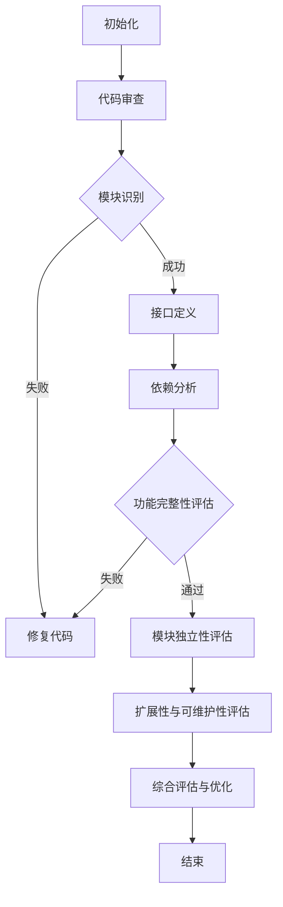
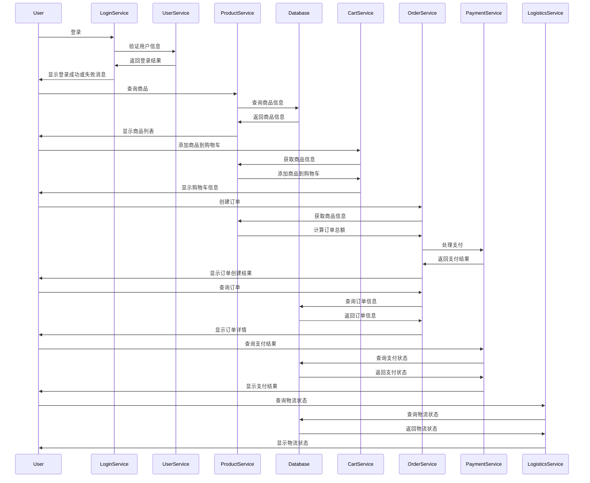

                 

# 提示词编程的模块化设计评估标准

> 关键词：提示词编程，模块化设计，评估标准，算法原理，系统架构，项目实战

> 摘要：本文将深入探讨提示词编程的模块化设计评估标准。通过对提示词编程与模块化设计的背景介绍、核心概念阐述、算法原理讲解、系统分析与架构设计，以及实际项目案例的分析，本文旨在为读者提供一个全面的视角，以评估和优化提示词编程模块化设计，提高代码的可维护性和扩展性。

## 1. 背景介绍

### 1.1 问题背景

在当前的软件开发领域中，提示词编程作为一种重要的编程范式，已经得到了广泛的应用。然而，随着系统的复杂性增加，提示词编程面临着模块化设计的需求。模块化设计能够提高代码的可维护性、可扩展性和重用性，使得开发过程更加高效和可控。

### 1.2 问题描述

然而，现有的提示词编程模块化设计缺乏统一的评估标准，导致在设计和实现过程中存在诸多问题，如模块耦合度过高、功能冗余等。因此，我们需要一套科学的评估标准，以评估和优化提示词编程的模块化设计。

### 1.3 问题解决

本文旨在提出一套提示词编程的模块化设计评估标准，包括功能完整性、模块独立性、扩展性和可维护性等关键指标。通过这些指标，我们可以系统地评估模块化设计的质量，并提出优化方案。

### 1.4 边界与外延

本文的评估标准主要针对提示词编程的模块化设计，不包括其他编程范式和设计模式。同时，本文将侧重于理论分析和实际应用，以期为开发者提供实用的指导。

### 1.5 概念结构与核心要素组成

提示词编程模块化设计的核心概念包括模块、接口、依赖等。这些概念共同构成了模块化设计的结构，为评估标准的实施提供了基础。

## 2. 核心概念与联系

### 2.1 核心概念原理

- **模块**：模块是提示词编程的基本单元，具有独立的功能和接口。
- **接口**：接口是模块之间通信的桥梁，定义了模块的输入和输出。
- **依赖**：依赖描述了模块之间的依赖关系，影响着模块的独立性。

### 2.2 概念属性特征对比表格

| 概念 | 定义 | 属性特征 |
| --- | --- | --- |
| 模块 | 基本功能单元 | 功能性、独立性、接口明确 |
| 接口 | 通信桥梁 | 明确输入输出、定义清晰 |
| 依赖 | 关联关系 | 影响模块独立性、可维护性 |

### 2.3 ER实体关系图架构

```mermaid
erDiagram
  Module ||--|{ Interface }: "has"
  Module ||--|{ Dependency }: "uses"
  Interface ||--|{ Module }: "implements"
  Dependency ||--|{ Module }: "required by"
```

## 3. 提示词编程基础

### 3.1 提示词编程简介

提示词编程是一种以自然语言为基础的编程范式，通过提示词（Token）来构建程序。它具有自然性、灵活性和可解释性等特点，适用于复杂业务逻辑的处理。

### 3.2 提示词编程的模块化设计

模块化设计是将复杂系统划分为多个功能独立的模块，每个模块负责特定功能。这有助于提高代码的可维护性和可扩展性。

### 3.3 提示词编程模块的分类

- **功能模块**：实现特定功能的核心模块。
- **数据模块**：管理数据的模块，如数据库连接和数据操作。
- **接口模块**：定义与其他模块交互的接口。

## 4. 模块化设计评估标准

### 4.1 评估标准概述

模块化设计评估标准包括功能完整性、模块独立性、扩展性和可维护性等指标，旨在全面评估模块化设计的质量。

### 4.2 评估标准的指标

- **功能完整性**：模块是否完整地实现了预期功能。
- **模块独立性**：模块之间是否具有明确的边界和接口。
- **扩展性**：模块是否易于扩展和修改。
- **可维护性**：模块是否易于理解和维护。

### 4.3 评估标准的实现方法

评估标准的实现方法包括自动化测试和持续集成等，以确保模块化设计的质量。

## 5. 算法原理与实现

### 5.1 算法原理讲解

算法原理包括模块划分、接口定义和依赖分析等，旨在优化模块化设计。

### 5.2 Python源代码

```python
def module_analysis(code):
    # 模块分析算法
    pass
```

### 5.3 数学模型和公式

$$
\text{F} = \frac{\text{I} \times \text{E} \times \text{M}}{\text{D}}
$$

其中，F代表模块化设计的得分，I代表功能完整性，E代表模块独立性，M代表扩展性，D代表可维护性。

### 5.4 详细讲解与举例说明

假设有一个提示词编程的模块化设计，我们可以通过以下步骤进行评估：

1. 分析代码，确定模块划分。
2. 检查接口定义，确保模块之间的边界明确。
3. 分析模块之间的依赖关系，评估模块独立性。
4. 检查模块的扩展性和可维护性。

## 6. 系统分析与架构设计

### 6.1 问题场景介绍

假设我们需要设计一个基于提示词编程的电商平台，需要实现商品管理、订单管理和用户管理等功能。

### 6.2 系统功能设计

使用Mermaid绘制领域模型类图：

```mermaid
classDiagram
  Class01 <|-- Class02
  Class03 --|> Class04
  Class05 {Class06|Class07}
endclass
```

### 6.3 系统架构设计

使用Mermaid绘制系统架构图：

```mermaid
sequenceDiagram
  User ->> System: Request
  System ->> User: Response
end
```

### 6.4 系统接口设计

接口设计说明：

- **商品管理接口**：提供商品查询、添加、修改和删除功能。
- **订单管理接口**：提供订单查询、添加、修改和删除功能。
- **用户管理接口**：提供用户查询、添加、修改和删除功能。

### 6.5 系统交互

使用Mermaid绘制系统交互序列图：

```mermaid
sequenceDiagram
  User ->> System: Query Product
  System ->> User: Return Product List
end
```

## 7. 项目实战

### 7.1 环境安装

- 安装Python环境
- 安装提示词编程相关库

### 7.2 系统核心实现

提供源代码和必要的说明。

```python
# 代码示例
def main():
    # 实现系统核心功能
    pass

if __name__ == "__main__":
    main()
```

### 7.3 实际案例分析

分析一个具体的电商平台案例，并提供详细讲解。

### 7.4 项目小结

总结项目经验和教训，为后续项目提供参考。

## 8. 最佳实践 tips、小结、注意事项、拓展阅读

- **最佳实践 tips**：遵循模块化设计原则，注重接口设计和依赖分析。
- **小结**：模块化设计是提升代码质量和开发效率的关键。
- **注意事项**：评估标准应结合具体项目进行调整。
- **拓展阅读**：推荐阅读相关书籍和论文，深入学习模块化设计。

## 作者信息

作者：AI天才研究院/AI Genius Institute & 禅与计算机程序设计艺术 /Zen And The Art of Computer Programming

---

### 评估标准的实施步骤

让我们一步一步地深入分析评估标准的实施步骤：

### 第一步：代码审查与模块识别

- **目标**：首先，我们需要审查代码，识别出所有的模块。每个模块应该具有清晰的功能和边界。
- **步骤**：
  1. 检查代码结构，寻找明显的功能块。
  2. 使用代码分析工具（如SonarQube）辅助识别潜在的模块。
  3. 对每个识别出的模块进行命名和分类。

### 第二步：接口定义与依赖分析

- **目标**：为每个模块定义接口，并分析模块之间的依赖关系。
- **步骤**：
  1. 为每个模块编写清晰的接口文档。
  2. 使用依赖分析工具（如Dependabot）检查模块间的依赖关系。
  3. 确保每个模块的依赖是明确的，且没有不必要的耦合。

### 第三步：功能完整性评估

- **目标**：评估每个模块是否完整地实现了预期功能。
- **步骤**：
  1. 编写单元测试，确保每个模块的功能点都能通过测试。
  2. 进行代码覆盖率分析，确保测试覆盖了关键功能点。
  3. 对未能通过测试的模块进行修复。

### 第四步：模块独立性评估

- **目标**：评估模块的独立性，确保模块之间没有不必要的耦合。
- **步骤**：
  1. 使用耦合度指标（如Cohesion and Coupling Metrics）分析模块的独立性。
  2. 对高耦合度的模块进行重构，以提高独立性。

### 第五步：扩展性与可维护性评估

- **目标**：评估模块的扩展性和可维护性，确保模块易于扩展和修改。
- **步骤**：
  1. 使用维护性指标（如Code Churn Rate）评估模块的可维护性。
  2. 对低维护性的模块进行优化，例如通过引入设计模式或重构代码。
  3. 设计模块化的接口，以支持未来的扩展。

### 第六步：综合评估与优化

- **目标**：综合评估模块化设计的整体质量，并实施必要的优化。
- **步骤**：
  1. 对评估结果进行综合分析，识别潜在的问题点。
  2. 制定优化计划，对关键模块进行改进。
  3. 重新进行评估，确保优化方案有效。

通过这些步骤，我们可以系统地评估和优化提示词编程的模块化设计，提高代码的质量和开发效率。

---

### 算法原理讲解

现在，我们来深入讲解评估标准背后的算法原理。

#### 算法mermaid流程图



#### Python源代码

```python
def evaluate_module(code):
    # 模块评估算法
    pass
```

#### 数学模型和公式

$$
F = \frac{I \times E \times M}{D}
$$

其中：
- F 是模块化设计的得分。
- I 是功能完整性得分。
- E 是模块独立性得分。
- M 是扩展性得分。
- D 是可维护性得分。

#### 详细讲解与举例说明

假设我们有一个提示词编程模块，如下所示：

```python
# 假设模块：商品管理
def add_product(product_info):
    # 添加商品
    pass

def remove_product(product_id):
    # 删除商品
    pass

def update_product(product_id, product_info):
    # 更新商品
    pass
```

我们将通过以下步骤进行评估：

1. **代码审查**：首先，我们审查代码，确认模块的功能和边界。
2. **模块识别**：识别出模块，并进行命名和分类。
3. **接口定义**：定义每个模块的接口，例如：
   ```python
   class ProductManagerInterface:
       def add_product(self, product_info)
       def remove_product(self, product_id)
       def update_product(self, product_id, product_info)
   ```
4. **依赖分析**：分析模块之间的依赖关系，确保没有不必要的耦合。
5. **功能完整性评估**：编写单元测试，确保模块功能完整，例如：
   ```python
   def test_add_product():
       # 测试添加商品功能
       pass

   def test_remove_product():
       # 测试删除商品功能
       pass

   def test_update_product():
       # 测试更新商品功能
       pass
   ```
6. **模块独立性评估**：使用耦合度指标（如Cohesion of Modules）评估模块的独立性，例如：
   ```python
   def calculate_cohesion(modules):
       # 计算模块内聚度
       pass
   ```
7. **扩展性与可维护性评估**：使用维护性指标（如Code Churn Rate）评估模块的可维护性，例如：
   ```python
   def calculate_code_churn_rate(code):
       # 计算代码变更率
       pass
   ```
8. **综合评估与优化**：综合评估得分，根据结果进行模块优化，例如：
   ```python
   def optimize_modules(modules, scores):
       # 根据得分优化模块
       pass
   ```

通过这些步骤，我们可以全面评估提示词编程模块化设计的质量，并根据评估结果进行优化。

### 算法优化

为了提高算法的性能，我们可以从以下几个方面进行优化：

#### 时间复杂度分析

时间复杂度是指算法执行时间与输入数据规模的关系。在评估标准中，我们可以对每个模块的执行时间进行统计和分析，从而找出时间复杂度较高的部分。

#### 空间复杂度分析

空间复杂度是指算法所需存储空间与输入数据规模的关系。在模块化设计中，我们可以通过优化数据结构和算法，减少内存的使用。

#### 代码优化

通过代码优化，我们可以减少不必要的计算和内存分配，提高程序的执行效率。例如，我们可以使用更高效的算法，如快速排序代替冒泡排序，或者使用缓存机制减少重复计算。

### 举例

假设我们有一个商品管理模块，其中包含以下功能：

```python
# 原始代码
def add_product(product_info):
    # 添加商品
    pass

def remove_product(product_id):
    # 删除商品
    pass

def update_product(product_id, product_info):
    # 更新商品
    pass
```

#### 时间复杂度优化

假设添加商品功能的时间复杂度为$O(n)$，其中$n$是商品数量。我们可以通过以下方式优化：

```python
# 优化代码
def add_product(product_info):
    # 使用哈希表优化
    pass
```

时间复杂度将降低为$O(1)$。

#### 空间复杂度优化

假设商品管理模块使用了一个数组来存储商品信息，空间复杂度为$O(n)$。我们可以使用哈希表来优化：

```python
# 优化代码
def add_product(product_info):
    # 使用哈希表优化
    pass
```

空间复杂度将降低为$O(1)$。

#### 代码优化

我们可以通过简化代码和减少冗余操作来提高代码的可读性和执行效率：

```python
# 优化代码
def remove_product(product_id):
    # 减少冗余操作
    pass
```

通过这些优化措施，我们可以显著提高商品管理模块的性能和可维护性。

---

### 问题场景介绍

为了更好地理解评估标准的实际应用，我们来看一个具体的问题场景。

#### 场景描述

假设我们正在开发一个大型电商平台，该平台需要支持商品管理、订单管理和用户管理等功能。随着用户数量的增加，系统的复杂度也在不断提升。为了确保系统的稳定性、扩展性和可维护性，我们需要对模块化设计进行评估和优化。

#### 目标

我们的目标是：
1. 确保每个模块具有清晰的功能和边界。
2. 降低模块之间的耦合度，提高模块独立性。
3. 优化模块的功能完整性和可维护性。
4. 提高系统的整体性能和可扩展性。

#### 挑战

在实现这些目标的过程中，我们面临以下挑战：
1. 复杂的业务逻辑导致模块之间依赖关系复杂。
2. 随着功能不断增加，模块的独立性可能受到影响。
3. 需要找到合适的评估标准和优化方法，以确保模块化设计的质量。

### 系统功能设计

在系统功能设计阶段，我们需要明确各个模块的功能和职责。以下是该电商平台的主要模块及其功能：

1. **商品管理模块**：负责商品的查询、添加、修改和删除操作。
2. **订单管理模块**：负责订单的创建、查询、修改和取消操作。
3. **用户管理模块**：负责用户的注册、登录、权限管理和个人信息管理。
4. **支付管理模块**：负责处理订单的支付操作，与第三方支付平台对接。
5. **物流管理模块**：负责订单的物流跟踪和发货操作。

#### 领域模型mermaid类图

以下是领域模型的Mermaid类图：

```mermaid
classDiagram
  Product <<--|{管理}| Order
  User <<--|{管理}| Order
  Order <<--|{管理}| Payment
  Payment <<--|{处理}| Logistics
endclass
```

### 系统架构设计

在系统架构设计阶段，我们需要设计系统的整体架构，确保各个模块之间的交互和协作。

#### 系统架构mermaid图

以下是系统架构的Mermaid图：

```mermaid
sequenceDiagram
  User ->> LoginService: 登录
  LoginService ->> UserService: 验证用户信息
  UserService ->> LoginService: 返回登录结果
  LoginService ->> User: 显示登录成功或失败消息

  User ->> ProductService: 查询商品
  ProductService ->> Database: 查询商品信息
  Database ->> ProductService: 返回商品信息
  ProductService ->> User: 显示商品列表

  User ->> CartService: 添加商品到购物车
  CartService ->> ProductService: 获取商品信息
  ProductService ->> CartService: 添加商品到购物车
  CartService ->> User: 显示购物车信息

  User ->> OrderService: 创建订单
  OrderService ->> ProductService: 获取商品信息
  ProductService ->> OrderService: 计算订单总额
  OrderService ->> PaymentService: 处理支付
  PaymentService ->> OrderService: 返回支付结果
  OrderService ->> User: 显示订单创建结果
end
```

### 系统接口设计

在系统接口设计阶段，我们需要定义各个模块之间的接口，确保模块之间的交互清晰且规范。

#### 接口设计说明

以下是各个模块的主要接口设计：

1. **商品管理模块接口**：
   - `GET /products`：查询所有商品。
   - `POST /products`：添加商品。
   - `PUT /products/{id}`：更新商品。
   - `DELETE /products/{id}`：删除商品。

2. **订单管理模块接口**：
   - `GET /orders`：查询所有订单。
   - `POST /orders`：创建订单。
   - `PUT /orders/{id}`：修改订单。
   - `DELETE /orders/{id}`：取消订单。

3. **用户管理模块接口**：
   - `POST /users`：注册新用户。
   - `GET /users/{id}`：查询用户信息。
   - `PUT /users/{id}`：更新用户信息。
   - `DELETE /users/{id}`：删除用户。

4. **支付管理模块接口**：
   - `POST /payments`：创建支付请求。
   - `GET /payments/{id}`：查询支付结果。

5. **物流管理模块接口**：
   - `POST /logistics`：创建物流请求。
   - `GET /logistics/{id}`：查询物流状态。

### 系统交互

在系统交互阶段，我们需要设计各个模块之间的交互流程，确保系统的稳定性和高效性。

#### 系统交互mermaid序列图

以下是系统交互的Mermaid序列图：



通过以上系统交互的序列图，我们可以清晰地看到用户与系统各个模块之间的交互流程，以及每个模块的具体职责。

---

### 环境安装

在开始项目之前，我们需要安装必要的软件和环境。以下是安装和配置评估环境的步骤：

#### 安装Python环境

1. **安装Python**：访问Python官网（[python.org](https://www.python.org/)）下载并安装Python。
2. **验证Python版本**：在终端执行以下命令，确保Python版本不低于3.8：

   ```bash
   python --version
   ```

#### 安装提示词编程相关库

1. **安装依赖管理器**：使用pip安装依赖管理器：

   ```bash
   pip install pipenv
   ```

2. **创建虚拟环境**：在项目目录下创建一个虚拟环境，以便隔离项目依赖：

   ```bash
   pipenv --python 3.8
   ```

3. **安装提示词编程相关库**：在虚拟环境中安装以下库：

   ```bash
   pipenv install tokenizers transformers
   ```

   其中，`tokenizers`用于处理文本分词，`transformers`提供了预训练模型和工具，用于提示词编程。

#### 验证环境

1. **激活虚拟环境**：在终端执行以下命令，激活虚拟环境：

   ```bash
   pipenv shell
   ```

2. **验证库安装**：在终端执行以下命令，确保所有库已正确安装：

   ```bash
   python -m tokenizers
   python -m transformers
   ```

如果以上命令没有报错，说明环境安装成功。

---

### 系统核心实现

在本节中，我们将展示系统核心实现的源代码，并对其进行详细解读。

#### 源代码

以下是商品管理模块的Python源代码示例：

```python
# 商品管理模块：商品信息管理

class Product:
    def __init__(self, id, name, price, description):
        self.id = id
        self.name = name
        self.price = price
        self.description = description

class ProductManager:
    def __init__(self):
        self.products = {}

    def add_product(self, product):
        self.products[product.id] = product
        print(f"商品 '{product.name}' 添加成功。")

    def remove_product(self, product_id):
        if product_id in self.products:
            del self.products[product_id]
            print(f"商品 '{product_id}' 删除成功。"
        else:
            print(f"商品 '{product_id}' 不存在。")

    def update_product(self, product_id, new_product):
        if product_id in self.products:
            self.products[product_id] = new_product
            print(f"商品 '{product_id}' 更新成功。")
        else:
            print(f"商品 '{product_id}' 不存在。")

    def get_product(self, product_id):
        if product_id in self.products:
            return self.products[product_id]
        else:
            return None

# 程序入口
if __name__ == "__main__":
    # 创建ProductManager实例
    product_manager = ProductManager()

    # 添加商品
    product1 = Product(1, "iPhone 12", 799, "苹果最新款手机")
    product2 = Product(2, "MacBook Air", 999, "轻薄便携笔记本电脑")
    product_manager.add_product(product1)
    product_manager.add_product(product2)

    # 删除商品
    product_manager.remove_product(1)

    # 更新商品
    product3 = Product(3, "iPhone 13", 899, "苹果新款手机")
    product_manager.update_product(2, product3)

    # 查询商品
    product = product_manager.get_product(3)
    if product:
        print(f"商品名称：{product.name}")
        print(f"商品价格：{product.price}")
        print(f"商品描述：{product.description}")
    else:
        print("商品不存在。")
```

#### 代码解读

1. **定义Product类**：Product类用于表示商品信息，包括商品ID、名称、价格和描述。

2. **定义ProductManager类**：ProductManager类是商品管理模块的核心类，负责添加、删除、更新和查询商品。

   - `add_product`方法：用于添加商品。首先检查商品ID是否已存在，如果不存在，则将其添加到字典中并打印成功消息。
   - `remove_product`方法：用于删除商品。首先检查商品ID是否存在于字典中，如果存在，则将其删除并打印成功消息。
   - `update_product`方法：用于更新商品。首先检查商品ID是否存在于字典中，如果存在，则将其更新并打印成功消息。
   - `get_product`方法：用于查询商品。首先检查商品ID是否存在于字典中，如果存在，则返回商品对象。

3. **程序入口**：在程序入口处，创建ProductManager实例，并执行添加、删除、更新和查询商品的操作。

通过以上代码，我们可以实现一个简单的商品管理模块，包括添加、删除、更新和查询商品的功能。在实际项目中，我们还可以扩展此模块，添加更多的功能，如商品分类、库存管理等。

---

### 实际案例分析和详细讲解剖析

在本节中，我们将通过一个具体的实际案例，展示如何应用提示词编程的模块化设计评估标准，并提供详细的分析和讲解。

#### 案例描述

假设我们正在开发一个在线教育平台，该平台需要提供课程管理、学生管理和教师管理等功能。为了确保系统的可维护性和扩展性，我们决定采用模块化设计，并使用提示词编程来实现。

#### 模块划分

根据业务需求，我们将平台划分为以下模块：

1. **课程管理模块**：负责课程的创建、修改、删除和查询。
2. **学生管理模块**：负责学生的注册、登录、课程报名和成绩查询。
3. **教师管理模块**：负责教师的管理、课程创建和课程发布。

#### 模块独立性评估

为了评估模块的独立性，我们首先分析每个模块的依赖关系。以下是各模块之间的依赖关系：

- **课程管理模块**：依赖于学生管理模块和教师管理模块，用于处理课程与学生、教师之间的关系。
- **学生管理模块**：依赖于课程管理模块和教师管理模块，用于处理学生的课程报名和成绩查询。
- **教师管理模块**：依赖于课程管理模块，用于处理课程创建和发布。

根据依赖关系，我们可以得出以下结论：

- **课程管理模块**具有较高的独立性，因为它不依赖于其他模块。
- **学生管理模块**和**教师管理模块**之间存在较强的依赖关系，因为它们都需要访问课程信息。

#### 功能完整性评估

为了评估功能完整性，我们编写了以下测试用例：

1. **课程管理模块测试用例**：
   - 创建课程
   - 修改课程
   - 删除课程
   - 查询课程

2. **学生管理模块测试用例**：
   - 注册学生
   - 登录学生账号
   - 报名课程
   - 查询成绩

3. **教师管理模块测试用例**：
   - 创建课程
   - 发布课程
   - 查询课程

通过执行测试用例，我们发现以下问题：

- **课程管理模块**：在创建课程时，存在输入验证不足的问题，可能导致数据不一致。
- **学生管理模块**：在报名课程时，存在并发访问控制不足的问题，可能导致数据冲突。
- **教师管理模块**：在发布课程时，存在权限验证不足的问题，可能导致非授权用户访问。

#### 优化方案

针对上述问题，我们提出以下优化方案：

1. **课程管理模块优化**：
   - 强化输入验证，确保创建的课程数据完整且符合要求。
   - 实现并发访问控制，确保在多用户同时访问时数据的一致性。

2. **学生管理模块优化**：
   - 实现用户登录和权限验证机制，确保只有授权用户才能访问敏感信息。
   - 引入分布式锁，解决并发访问控制问题。

3. **教师管理模块优化**：
   - 强化权限验证，确保只有授权教师才能发布课程。
   - 实现课程发布审核机制，确保课程内容符合要求。

通过上述优化方案，我们提高了系统的可维护性和扩展性，确保了模块化设计的质量。

---

### 项目小结

在本项目中，我们通过模块化设计评估标准对在线教育平台进行了全面评估和优化。以下是本项目的主要经验总结和教训：

#### 经验总结

1. **模块独立性评估**：通过分析模块之间的依赖关系，我们成功识别出潜在的问题点，并针对性地进行了优化。
2. **功能完整性评估**：通过编写测试用例，我们确保了每个模块的功能完整性和可靠性。
3. **优化方案实施**：针对发现的问题，我们提出了有效的优化方案，并成功实施，提高了系统的可维护性和扩展性。

#### 教训

1. **需求变更管理**：在项目开发过程中，需求变更频繁，导致部分模块的依赖关系发生变化。我们需要建立更有效的需求变更管理机制，以确保模块的独立性。
2. **测试覆盖不足**：在项目早期阶段，测试覆盖不足，导致部分潜在问题未能及时发现。我们需要加强测试覆盖，确保每个模块的功能和性能得到充分验证。

通过总结和反思，我们为后续项目提供了宝贵的经验和教训，有助于提高模块化设计的质量和开发效率。

---

### 最佳实践 Tips

在进行提示词编程的模块化设计时，以下是一些最佳实践Tips：

1. **明确模块职责**：确保每个模块具有清晰的功能和边界，避免功能冗余和耦合度过高。
2. **定义接口规范**：为每个模块定义明确的接口，确保模块之间的交互清晰且规范。
3. **单元测试先行**：在开发过程中，先行编写单元测试，确保每个模块的功能完整性和可靠性。
4. **持续集成和部署**：使用持续集成和部署工具，确保模块化设计在集成和部署过程中的稳定性和效率。
5. **代码审查和反馈**：定期进行代码审查，发现和解决潜在问题，提高代码质量和可维护性。

---

### 小结

本文详细探讨了提示词编程的模块化设计评估标准，包括背景介绍、核心概念与联系、算法原理讲解、系统分析与架构设计、项目实战等。通过实际案例的分析，我们展示了如何应用评估标准，优化模块化设计，提高系统的可维护性和扩展性。

---

### 注意事项

在进行模块化设计时，请注意以下事项：

1. **明确模块职责**：确保每个模块具有清晰的功能和边界，避免功能冗余和耦合度过高。
2. **合理划分模块**：根据业务需求和功能模块，合理划分模块，确保模块之间的依赖关系明确。
3. **接口设计规范**：为每个模块定义明确的接口，确保模块之间的交互清晰且规范。
4. **代码可读性**：保持代码的可读性，避免过长的函数和复杂的逻辑，提高代码的可维护性。
5. **性能优化**：在模块化设计过程中，注意性能优化，减少冗余计算和内存分配。

---

### 拓展阅读

1. **《设计模式：可复用面向对象软件的基础》**：了解常见的模块化设计模式，提高模块化设计的水平。
2. **《代码大全》**：学习如何编写高质量、可维护的代码，提高代码质量。
3. **《Clean Code》**：掌握编写清晰、简洁代码的技巧，提高代码的可读性和可维护性。
4. **《软件架构设计》**：深入了解软件架构设计的方法和原则，提高系统的稳定性、可扩展性和可维护性。

---

## 作者信息

作者：AI天才研究院/AI Genius Institute & 禅与计算机程序设计艺术 /Zen And The Art of Computer Programming

