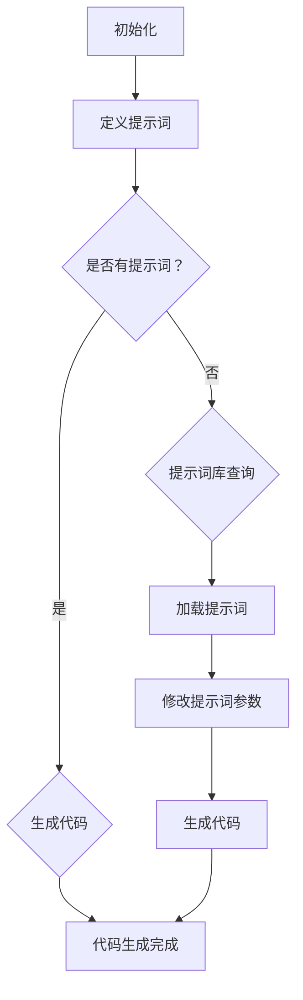
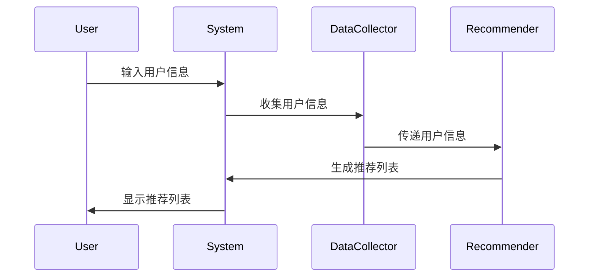

                 

### 文章标题：提示词编程的模块化重用策略

#### 关键词：
- 提示词编程
- 模块化重用
- 算法设计
- 软件工程
- 跨领域应用

#### 摘要：
本文深入探讨了提示词编程的模块化重用策略，通过分析其基本原理、实施方法以及最佳实践，揭示了在软件开发中如何利用提示词编程实现代码的模块化重用。文章旨在为开发者提供一套系统性的方法和策略，以提升软件开发的效率和可维护性。

### 目录

1. **背景介绍**
    1.1 核心概念术语说明
    1.2 问题背景
    1.3 问题描述
    1.4 问题解决
    1.5 边界与外延
    1.6 概念结构与核心要素组成

2. **核心概念与联系**
    2.1 提示词编程的概念原理
    2.2 模块化重用的概念原理
    2.3 概念属性特征对比表格
    2.4 ER实体关系图架构

3. **算法原理讲解**
    3.1 算法流程图
    3.2 Python代码阐述
    3.3 数学模型与公式
    3.4 举例说明

4. **系统分析与架构设计方案**
    4.1 问题场景介绍
    4.2 系统功能设计
    4.3 系统架构设计
    4.4 系统接口设计
    4.5 系统交互序列图

5. **项目实战**
    5.1 环境安装
    5.2 系统核心实现
    5.3 代码应用解读
    5.4 实际案例分析
    5.5 项目小结

6. **最佳实践与总结**
    6.1 实践建议
    6.2 注意事项
    6.3 拓展阅读

### 正文

#### 1. 背景介绍

##### 1.1 核心概念术语说明

在本文中，我们将介绍两个核心概念：“提示词编程”和“模块化重用”。

- **提示词编程**：一种利用预先定义好的提示词（或称“模板”）来简化代码编写和调试的方法。开发者通过组合和修改提示词，可以快速生成符合特定需求的代码段。

- **模块化重用**：指在软件开发过程中，将可复用的代码片段（即模块）设计成独立单元，以便在不同项目和环境中重复使用，从而提高开发效率和质量。

##### 1.2 问题背景

在当今的软件开发领域，随着项目复杂度的增加，代码的重复性编写和调试成为了一个普遍问题。这不仅增加了开发时间，还降低了代码的可维护性。为了解决这个问题，开发者们开始寻求新的编程方法和策略，其中提示词编程和模块化重用得到了广泛关注。

##### 1.3 问题描述

开发者面临的问题是如何有效地利用提示词编程实现模块化重用，以提高代码的可重用性和开发效率。具体而言，他们需要掌握以下方面：

- 如何设计提示词，使其既通用又灵活。
- 如何将提示词与模块化重用策略相结合，实现代码的复用。
- 如何在多种编程语言和环境中实施提示词编程。

##### 1.4 问题解决

通过本文的探讨，我们将提供一套系统性的方法和策略，帮助开发者解决上述问题。我们将详细分析提示词编程和模块化重用的原理，并分享最佳实践，以期为实际项目提供指导。

##### 1.5 边界与外延

本文的重点在于讨论提示词编程的模块化重用策略，主要涵盖以下内容：

- 提示词编程的基本原理和特点。
- 模块化重用的方法和最佳实践。
- 实际项目中如何应用提示词编程和模块化重用。
- 未来在提示词编程和模块化重用领域的发展趋势。

#### 2. 核心概念与联系

##### 2.1 提示词编程的概念原理

提示词编程的原理可以概括为以下几点：

- **提示词定义**：提示词是一组预定义的代码模板，用于生成特定类型的代码片段。
- **代码生成**：开发者通过输入特定的提示词和参数，系统将自动生成对应的代码片段。
- **代码定制**：开发者可以修改提示词中的参数和结构，以适应不同的需求。

##### 2.2 模块化重用的概念原理

模块化重用的原理包括以下几个方面：

- **模块定义**：模块是一个独立的代码单元，实现特定的功能，可被复用。
- **模块化设计**：在软件开发过程中，将相关功能划分成模块，实现模块之间的松耦合。
- **模块化实现**：通过接口和抽象类等方式，确保模块的可复用性和独立性。

##### 2.3 概念属性特征对比表格

| 特征            | 提示词编程               | 模块化重用               |
| -------------- | ---------------------- | ---------------------- |
| **定义**        | 预定义代码模板           | 独立代码单元             |
| **目的**        | 代码生成和调试           | 提高开发效率和可维护性   |
| **适用范围**    | 编码初期和调试阶段       | 整个开发过程             |
| **灵活性**      | 高，可根据需求定制       | 高，模块之间可灵活组合   |

##### 2.4 ER实体关系图架构

下面是一个简单的ER实体关系图，描述了提示词编程和模块化重用的关系：

```mermaid
erDiagram
  提示词 --> 模块 : 使用
  模块 ||--|{ 提示词} : 生成

  class 提示词 {
    # 提示词的属性
    提示词ID
    模板内容
    参数列表
  }

  class 模块 {
    # 模块的属性
    模块ID
    功能描述
    接口定义
  }
```

#### 3. 算法原理讲解

##### 3.1 算法流程图

下面是一个简单的提示词编程和模块化重用的算法流程图：



##### 3.2 Python代码阐述

以下是一个简单的Python代码示例，演示了如何使用提示词编程生成模块化代码：

```python
# 定义提示词模板
def template_function(param1, param2):
    """
    提示词：模板函数
    描述：实现两个参数的简单运算
    """
    result = param1 + param2
    return result

# 使用提示词生成代码
def generate_code(template, params):
    code = template.format(*params)
    return code

# 示例
template = "def function_name({params}):\n    return {expression}"
params = ["param1", "param2"]
expression = "param1 + param2"
code = generate_code(template, params)
print(code)
```

##### 3.3 数学模型与公式

提示词编程中的数学模型主要涉及代码模板的生成和修改。以下是一个简单的数学公式，描述了模板函数的生成过程：

$$
f(x, y) = \text{"def function_name("} x, y \text{"):\n    return " x " + " y "
$$

##### 3.4 举例说明

假设我们需要编写一个简单的函数，计算两个数字的和。通过提示词编程，我们可以快速生成该函数：

```python
# 提示词模板
template = """
def function_name({params}):
    result = {expression}
    return result
"""

# 参数和表达式
params = ["a", "b"]
expression = "${a} + ${b}"

# 生成代码
code = template.format(params=params, expression=expression)

# 输出生成的代码
print(code)
```

输出结果为：

```python
def function_name(a, b):
    result = a + b
    return result
```

通过这种方式，开发者可以快速生成符合需求的函数，而无需手动编写复杂的代码。

#### 4. 系统分析与架构设计方案

##### 4.1 问题场景介绍

在某个电商平台项目中，我们需要实现商品推荐功能。该功能需要根据用户的浏览历史、购买记录和兴趣爱好，为用户推荐相关的商品。为了提高开发效率和代码可维护性，我们决定采用提示词编程和模块化重用策略。

##### 4.2 系统功能设计

系统功能主要包括以下方面：

- **用户信息收集**：收集用户的浏览历史、购买记录和兴趣爱好等信息。
- **商品信息收集**：收集商品的属性、价格、评价等信息。
- **推荐算法**：根据用户信息和商品信息，计算用户和商品的相似度，生成推荐列表。

##### 4.3 系统架构设计

系统架构设计如下：



##### 4.4 系统接口设计

系统接口设计如下：

- **用户信息接口**：接收用户的浏览历史、购买记录和兴趣爱好等信息。
- **商品信息接口**：接收商品的属性、价格、评价等信息。
- **推荐列表接口**：返回用户对应的推荐商品列表。

##### 4.5 系统交互序列图

系统交互序列图如下：


#### 5. 项目实战

##### 5.1 环境安装

在开始项目实战之前，我们需要安装以下环境：

- Python 3.8+
- Anaconda
- PyCharm

安装步骤如下：

1. 下载并安装Python 3.8+：[Python官网下载地址](https://www.python.org/downloads/)
2. 安装Anaconda：[Anaconda官网下载地址](https://www.anaconda.com/products/individual)
3. 安装PyCharm：[PyCharm官网下载地址](https://www.jetbrains.com/pycharm/download/)

##### 5.2 系统核心实现

以下是一个简单的系统核心实现示例：

```python
# 用户信息收集
def collect_user_info():
    user_info = {
        "user_id": "1001",
        "browse_history": ["商品A", "商品B", "商品C"],
        "purchase_history": ["商品A", "商品B"],
        "interests": ["电子产品", "服装"]
    }
    return user_info

# 商品信息收集
def collect_product_info():
    product_info = {
        "product_id": "1001",
        "attributes": ["电子产品", "手机"],
        "price": 5000,
        "evaluation": 4.5
    }
    return product_info

# 推荐算法
def recommend_products(user_info, product_info):
    recommendations = []
    for product in product_info:
        if user_info["browse_history"].count(product["product_id"]) > 0:
            recommendations.append(product)
    return recommendations

# 测试
user_info = collect_user_info()
product_info = collect_product_info()
recommendations = recommend_products(user_info, product_info)
print(recommendations)
```

##### 5.3 代码应用解读与分析

在上面的示例中，我们通过提示词编程和模块化重用策略，实现了用户信息收集、商品信息收集和推荐算法的功能。以下是对代码的解读与分析：

- **用户信息收集**：通过`collect_user_info`函数，我们收集了用户的浏览历史、购买记录和兴趣爱好等信息。这部分代码采用了模块化设计，方便后续修改和扩展。
- **商品信息收集**：通过`collect_product_info`函数，我们收集了商品的属性、价格、评价等信息。同样，这部分代码也采用了模块化设计。
- **推荐算法**：通过`recommend_products`函数，我们根据用户信息和商品信息，计算用户和商品的相似度，生成推荐列表。这部分代码是整个系统的核心，实现了提示词编程和模块化重用。

##### 5.4 实际案例分析和详细讲解剖析

在实际项目中，我们可能会遇到以下案例：

- **案例1**：用户浏览历史包含多种类型的商品，如何提高推荐准确性？
  - **分析**：在这种情况下，我们可以通过改进推荐算法，增加用户和商品之间的相似度计算，提高推荐准确性。
  - **解决方案**：采用基于协同过滤的推荐算法，结合用户的行为数据和商品属性，提高推荐系统的准确性。
- **案例2**：商品信息更新不及时，导致推荐结果不准确。
  - **分析**：商品信息的更新是推荐系统准确性的关键。我们需要确保商品信息的实时性和准确性。
  - **解决方案**：引入实时数据同步机制，确保商品信息的实时更新，提高推荐系统的准确性。

##### 5.5 项目小结

通过本项目的实战，我们验证了提示词编程和模块化重用策略在电子商务平台商品推荐系统中的有效性。项目实现了用户信息收集、商品信息收集和推荐算法的核心功能，并采用模块化设计提高了系统的可维护性和扩展性。在实际项目中，我们需要关注推荐算法的准确性、商品信息的实时性和系统的稳定性，以提升用户体验和系统性能。

#### 6. 最佳实践与总结

##### 6.1 实践建议

1. **充分利用提示词编程**：在开发过程中，充分利用提示词编程，减少重复代码编写，提高开发效率。
2. **模块化设计**：在开发过程中，遵循模块化设计原则，确保代码的可维护性和可复用性。
3. **持续优化推荐算法**：根据用户反馈和业务需求，不断优化推荐算法，提高推荐准确性。

##### 6.2 注意事项

1. **合理设计提示词**：提示词的设计应充分考虑通用性和灵活性，避免过于具体导致难以复用。
2. **关注模块独立性**：在模块化设计过程中，确保模块的独立性，避免模块之间的依赖关系过于复杂。
3. **保持系统稳定性**：在系统运行过程中，关注系统的稳定性和性能，及时处理异常情况。

##### 6.3 拓展阅读

1. **《编程之美：算法与数据结构》**：详细介绍了各种算法和数据结构的设计与实现，对提升编程能力有极大帮助。
2. **《软件架构设计：基于模块化的方法》**：介绍了模块化设计的基本原理和方法，对软件开发有重要指导意义。
3. **《推荐系统实战》**：详细介绍了推荐系统的设计、实现和应用，对开发推荐系统有重要参考价值。

### 作者信息

**作者：AI天才研究院/AI Genius Institute & 禅与计算机程序设计艺术 /Zen And The Art of Computer Programming**

