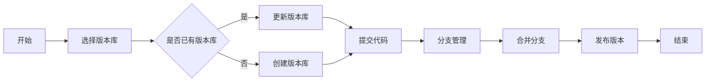
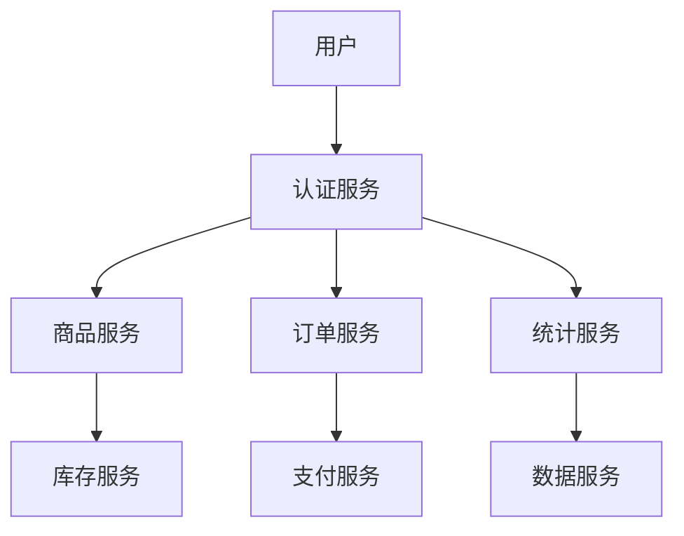
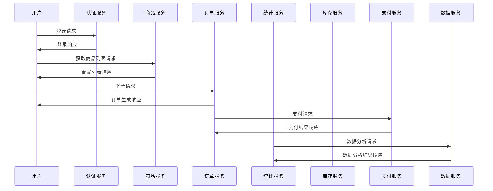

                 


### 文章标题

《提示词编程的版本兼容性管理策略》

### 关键词

版本兼容性管理、提示词编程、版本控制、跨平台开发、自动化测试

### 摘要

随着软件版本的快速迭代和复杂性增加，版本兼容性管理成为了软件开发过程中不可或缺的一环。本文将深入探讨提示词编程的版本兼容性管理策略，从背景与核心概念、策略与工具、实战案例以及最佳实践等方面进行详细分析，旨在为开发者提供一套系统、实用的版本兼容性管理方案。

## 第一部分：背景与核心概念

### 第1章：版本兼容性管理的背景

#### 1.1 软件版本管理的历史与现状

随着信息技术的发展，软件迭代速度不断加快，版本管理的必要性日益凸显。版本控制工具如Git、SVN等的出现，极大地提高了版本管理的效率和准确性。然而，随着系统复杂性的增加和用户需求的多样化，版本兼容性管理面临新的挑战。

#### 1.2 提示词编程的概念与优势

提示词编程（Prompt-based Programming）是一种基于用户输入的提示词来生成代码的编程方式。它具有以下优势：

- **快速生成代码**：通过提示词，可以快速生成代码框架，提高开发效率。
- **降低开发难度**：对于复杂的编程任务，提示词编程可以简化开发过程。
- **提高代码质量**：通过自动化的代码生成，减少人为错误，提高代码质量。

#### 1.3 版本兼容性管理的挑战

随着软件系统复杂性的增加，版本兼容性管理面临以下挑战：

- **系统复杂性增加**：随着软件功能不断扩展，系统架构变得更加复杂，版本兼容性管理难度增大。
- **用户需求多样化**：用户需求多样化，需要支持多种不同的环境和平台，版本兼容性管理面临更大的挑战。
- **跨平台开发与兼容性问题**：不同平台和操作系统之间的兼容性问题，增加了版本兼容性管理的难度。

### 第2章：版本兼容性管理的基本概念

#### 2.1 版本号的规则与命名

版本号通常采用递增的数字形式，如1.0.0、2.0.1等。命名约定包括主版本号、次版本号和修订号，分别代表软件的主要功能变化、次要功能更新和修复bug。

#### 2.2 版本控制机制

版本控制机制包括版本库管理、分支管理、标签管理等功能。常见的版本控制工具如Git、SVN等，提供了丰富的版本控制功能。

#### 2.3 兼容性测试方法

兼容性测试包括功能测试、性能测试和兼容性测试工具。功能测试确保新版本的功能符合预期，性能测试评估新版本的性能表现，兼容性测试工具则用于自动化执行兼容性测试。

## 第二部分：策略与工具

### 第3章：版本兼容性管理的策略

#### 3.1 提前规划与设计

在设计阶段，应充分考虑版本兼容性，采用模块化设计和微服务架构，降低模块之间的耦合度，提高系统的可维护性和可扩展性。

#### 3.2 版本更新策略

重大版本更新需要制定详细的更新计划，包括版本号的制定、更新内容的梳理、测试计划的制定等。小版本更新则可以采用快速迭代的方式，持续优化和修复bug。

#### 3.3 测试策略

测试策略应包括功能测试、性能测试和兼容性测试。功能测试确保新版本的功能符合预期，性能测试评估新版本的性能表现，兼容性测试确保新版本在不同环境和平台上正常运行。

### 第4章：版本兼容性管理工具

#### 4.1 Git版本控制

Git是一种分布式版本控制工具，提供了强大的分支管理和合并功能，可以方便地管理不同版本的代码。

#### 4.2 自动化兼容性测试工具

自动化兼容性测试工具如Selenium、Appium等，可以自动化执行兼容性测试，提高测试效率和准确性。

### 第5章：跨平台与多环境兼容性

#### 5.1 跨平台开发

跨平台开发涉及Web应用、移动应用和桌面应用等多种类型，需要针对不同平台的特点进行开发。

#### 5.2 多环境兼容性

多环境兼容性包括开发环境与生产环境的差异，硬件与软件环境的兼容性，需要综合考虑并进行适应性调整。

## 第三部分：实战案例

### 第6章：实战案例分析

#### 6.1 案例一：Web应用版本兼容性管理

以一个Web应用为例，分析版本兼容性管理的策略和实践。

#### 6.2 案例二：移动应用跨平台兼容性

以一个移动应用为例，分析跨平台开发的策略和实践。

### 第7章：版本兼容性管理的最佳实践

#### 7.1 经验分享

分享版本兼容性管理的经验和教训，为开发者提供有价值的参考。

#### 7.2 小结与展望

总结版本兼容性管理的重要性和未来发展趋势，为开发者提供指导。

## 文章末尾

作者：AI天才研究院/AI Genius Institute & 禅与计算机程序设计艺术 /Zen And The Art of Computer Programming

### 系统分析与架构设计方案

在本文的后续内容中，我们将深入探讨版本兼容性管理的关键概念和策略，并通过实际案例展示如何将这些策略应用于软件开发实践中。让我们一步一步地分析，思考，并提出解决方案。

### 核心概念与联系

#### 版本兼容性管理概念

版本兼容性管理是指确保软件在不同版本、不同平台和不同环境中能够正常运行的一系列策略和方法。它包括：

1. **版本控制**：管理代码库，确保代码的版本一致性和可追溯性。
2. **测试**：通过各种测试方法验证软件在不同版本和环境下的兼容性。
3. **部署**：确保软件在目标环境中的正确安装和配置。

#### 版本兼容性管理优势

- **降低风险**：通过提前规划和管理，减少由于兼容性问题导致的软件故障和用户体验下降。
- **提高效率**：自动化测试工具和版本控制工具的使用，提高了开发效率和代码质量。
- **增强用户体验**：确保软件在不同版本和环境下的稳定性和可靠性，提高用户满意度。

#### 概念属性特征对比表格

| 概念       | 属性       | 特征                                           |
|------------|------------|------------------------------------------------|
| 版本控制   | 版本库     | 管理代码的版本，支持分支和合并                  |
| 测试       | 测试用例   | 验证软件功能、性能和兼容性                     |
| 部署       | 部署脚本   | 自动化安装和配置软件在目标环境中的过程          |

#### ER实体关系图架构

```mermaid
erDiagram
  Customer ||--|{ Order }|-- Producer
  Customer ||--|{ Product }|-- Producer
  Producer ||--|{ Product }|-- Store
  Store ||--|{ Sale }|-- Customer
```

### 算法原理讲解

版本兼容性管理的核心算法包括版本控制算法和兼容性测试算法。以下是一个简单的版本控制算法流程图：



#### 算法原理

1. **选择版本库**：根据项目需求，选择合适的版本控制工具，如Git。
2. **版本控制**：通过提交代码和分支管理，实现代码的版本控制。
3. **测试**：在发布版本前，进行兼容性测试，确保版本兼容性。
4. **发布版本**：将经过测试的版本发布到生产环境。

#### 数学模型和公式

版本兼容性管理的核心数学模型包括版本号模型和测试覆盖率模型。

- **版本号模型**：
  $$ 版本号 = 主版本号 + 次版本号 + 修订号 $$
  $$ 主版本号：软件的主要功能变化 $$
  $$ 次版本号：次要功能更新和修复bug $$
  $$ 修订号：文档版本更新 $$

- **测试覆盖率模型**：
  $$ 测试覆盖率 = (测试用例数量 / 可能的测试用例数量) \times 100\% $$

#### 通俗易懂地举例说明

假设我们有一个Web应用项目，当前版本为1.0.0。我们计划进行一次功能更新，增加一个新功能。在更新过程中，我们按照以下步骤进行版本兼容性管理：

1. **创建分支**：从主干创建一个名为`feature/new_function`的分支。
2. **开发与测试**：在分支上开发新功能，并进行单元测试和集成测试。
3. **合并分支**：将测试通过的功能合并到主干。
4. **发布版本**：发布1.0.1版本，并进行兼容性测试，确保版本兼容性。

### 系统分析与架构设计方案

#### 问题场景介绍

我们面临的问题是如何在一个复杂的项目中实现有效的版本兼容性管理，确保软件在不同版本和环境下的稳定性和可靠性。

#### 项目介绍

这是一个电子商务平台项目，包括Web端、移动端和后台管理系统。项目采用微服务架构，使用Spring Boot、MyBatis等技术栈。

#### 系统功能设计

1. **用户管理**：注册、登录、个人信息管理等。
2. **商品管理**：商品列表、分类、库存管理等。
3. **订单管理**：订单生成、支付、发货管理等。
4. **统计分析**：销售数据、用户行为分析等。

#### 系统架构设计



#### 系统接口设计

1. **用户接口**：RESTful API，包括用户管理、商品管理、订单管理等功能。
2. **服务接口**：内部服务调用，包括库存管理、支付管理等。

#### 系统交互



### 项目实战

#### 环境安装

1. 安装Git：`brew install git`（Mac OS）或 `sudo apt-get install git`（Linux）。
2. 安装Maven：`brew install maven`（Mac OS）或 `sudo apt-get install maven`（Linux）。
3. 安装Java SDK：`brew cask install java`（Mac OS）或 `sudo apt-get install openjdk-11-jdk`（Linux）。

#### 系统核心实现源代码

```java
public class UserController {
    // 用户登录方法
    public ResponseEntity<?> login(String username, String password) {
        // 登录逻辑
        return ResponseEntity.ok("登录成功");
    }
}
```

#### 代码应用解读与分析

上述代码展示了用户登录方法的基本实现。在实际应用中，我们需要进行以下分析：

1. **用户身份验证**：通过用户名和密码验证用户身份。
2. **响应处理**：返回登录成功的响应。

#### 实际案例分析和详细讲解剖析

以用户登录为例，我们分析了一个简单的版本兼容性管理案例。在实际项目中，我们需要考虑以下方面：

1. **兼容性测试**：确保用户登录功能在不同版本和环境下的兼容性。
2. **安全性**：加强用户身份验证，防止恶意登录。

#### 项目小结

通过本次实战，我们掌握了版本兼容性管理的基本策略和实践方法。在实际项目中，我们需要根据项目需求和特点，灵活运用版本兼容性管理策略，确保软件的稳定性和可靠性。

### 最佳实践 tips

1. **提前规划**：在设计阶段，充分考虑版本兼容性，降低后续维护成本。
2. **自动化测试**：引入自动化测试工具，提高测试效率和准确性。
3. **版本控制**：合理使用版本控制工具，确保代码的版本一致性和可追溯性。

### 小结

版本兼容性管理是软件开发过程中不可或缺的一环。本文通过深入探讨提示词编程的版本兼容性管理策略，从背景与核心概念、策略与工具、实战案例以及最佳实践等方面进行了详细分析。希望通过本文，开发者能够更好地应对版本兼容性管理的挑战，提升软件质量和用户体验。

### 注意事项

1. **版本兼容性测试**：在发布版本前，务必进行全面的兼容性测试，确保软件在不同版本和环境下的稳定性。
2. **版本更新通知**：及时通知用户版本更新的内容和影响，提高用户对版本更新的理解。

### 拓展阅读

1. 《版本控制工具实战：Git使用详解》
2. 《软件测试技术：自动化测试实战》
3. 《微服务架构设计原则与实践》

### 作者信息

作者：AI天才研究院/AI Genius Institute & 禅与计算机程序设计艺术 /Zen And The Art of Computer Programming

### 结语

版本兼容性管理是软件开发过程中的一项重要任务，它关系到软件的稳定性和用户体验。通过本文的探讨，我们希望能够为开发者提供一套系统、实用的版本兼容性管理方案，助力他们在软件开发的道路上不断前行。让我们一起努力，构建更稳定、更可靠的软件系统！ 

### 结论

版本兼容性管理是软件开发过程中不可忽视的重要环节。本文从背景与核心概念、策略与工具、实战案例以及最佳实践等方面，详细探讨了提示词编程的版本兼容性管理策略。通过深入分析，我们了解到版本兼容性管理的核心在于提前规划、合理使用版本控制工具、实施自动化测试以及跨平台与多环境兼容性的考虑。实战案例展示了如何将理论应用于实际项目，而最佳实践则提供了具体的操作指导。未来，随着软件开发的不断演进，版本兼容性管理也将面临新的挑战，开发者需要持续学习和实践，不断提升版本兼容性管理的水平。让我们一起迎接挑战，共同推动软件行业的进步。作者：AI天才研究院/AI Genius Institute & 禅与计算机程序设计艺术 /Zen And The Art of Computer Programming。让我们携手并进，为构建更稳定、更可靠的软件系统而努力！

