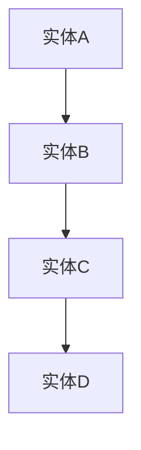
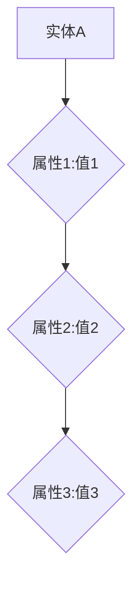
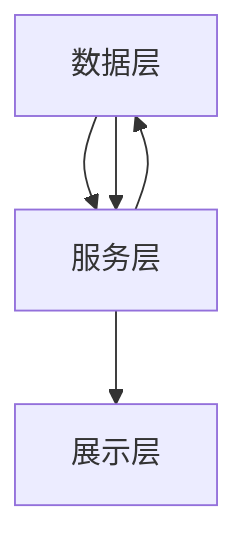
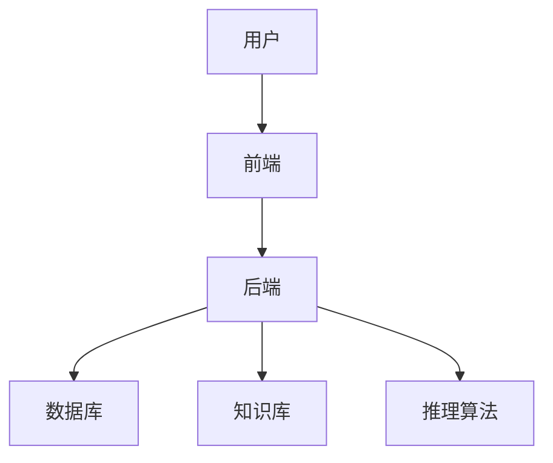

                 


### 《提示词编程的知识表示与推理》

> 关键词：提示词编程、知识表示、推理、人工智能、编程语言

> 摘要：本文深入探讨了提示词编程的知识表示与推理机制，从基础概念到实际应用，全面解析了这一前沿技术领域。通过阐述知识表示与推理在提示词编程中的应用，文章旨在为读者提供关于如何构建智能系统的深入理解。

### 目录大纲

```markdown
## 第1章 引言

### 1.1 书籍背景介绍
- 提示词编程的兴起
- 知识表示与推理的重要性
- 书籍目标读者

### 1.2 内容概览
- 主要章节安排
- 关键概念与术语解释

## 第2章 提示词编程基础

### 2.1 提示词编程概述
- 提示词编程的定义
- 提示词编程与传统编程的区别
- 提示词编程的应用场景

### 2.2 提示词语言简介
- 常见的提示词语言
- 提示词语言的特点
- 提示词语言的语法结构

### 2.3 提示词编程的基本概念
- 变量与数据类型
- 控制结构
- 函数与过程
- 异常处理

## 第3章 知识表示

### 3.1 知识表示概述
- 知识表示的定义
- 知识表示的重要性
- 知识表示的方法分类

### 3.2 基本数据结构
- 语义网络
- 属性图
- 实体-关系模型

### 3.3 知识库的构建
- 知识抽取
- 知识融合
- 知识存储

### 3.4 实例：构建一个简单的知识库

## 第4章 知识推理

### 4.1 知识推理概述
- 知识推理的定义
- 知识推理的类型
- 知识推理的应用

### 4.2 推理算法
- 规则推理
- 统计推理
- 逻辑推理

### 4.3 推理过程
- 数据预处理
- 推理规则应用
- 推理结果评估

## 第5章 提示词编程与知识表示的融合

### 5.1 融合概述
- 提示词编程与知识表示的整合
- 融合的优势与挑战

### 5.2 融合框架
- 知识表示层
- 推理引擎层
- 应用层

### 5.3 融合案例研究
- 问答系统
- 建议系统
- 智能助手

## 第6章 实战应用

### 6.1 应用场景介绍
- 提示词编程与知识表示的应用领域
- 不同领域的案例分析

### 6.2 系统设计与实现
- 系统架构设计
- 系统核心模块实现

### 6.3 应用案例详解
- 案例一：智能客服系统
- 案例二：个性化推荐系统

## 第7章 最佳实践与展望

### 7.1 最佳实践
- 提示词编程与知识表示的最佳实践
- 成功案例总结

### 7.2 未来展望
- 提示词编程与知识表示的发展趋势
- 新兴应用领域展望
```

### 第1章 引言

#### 1.1 书籍背景介绍

随着人工智能技术的迅猛发展，提示词编程（Prompt-Based Programming）作为一种新兴的编程范式，逐渐引起了学术和工业界的广泛关注。提示词编程的核心思想是利用提示词（prompts）来引导程序执行，实现编程逻辑的高效抽象和自动化。这种编程范式不仅简化了编程过程，还提升了代码的可读性和可维护性。

知识表示（Knowledge Representation）与推理（Reasoning）是人工智能领域的重要研究方向。知识表示旨在将人类知识结构化、形式化地表示在计算机中，以便于机器理解和处理。而推理则是基于这些表示进行逻辑推理和决策，从而实现智能化应用。

本书旨在深入探讨提示词编程中的知识表示与推理机制，为读者提供一个全面而系统的理解。通过分析知识表示的方法和技术，结合提示词编程的实际应用，本书将揭示如何构建智能系统，实现自动化决策与问题求解。

#### 1.2 内容概览

本书共分为七个章节，结构紧凑，逻辑清晰。首先，第1章介绍了书籍的背景和目标读者，为后续章节的深入探讨奠定了基础。第2章和第3章分别介绍了提示词编程的基础和知识表示的基本概念，为理解后续内容提供了必要的知识储备。

第4章重点探讨了知识推理的理论和方法，为提示词编程中的推理机制提供了理论支持。第5章则详细阐述了提示词编程与知识表示的融合框架，结合实际案例展示了融合应用的效果。

第6章通过具体应用场景的介绍和案例分析，进一步展示了知识表示与推理在提示词编程中的实际应用。第7章总结了最佳实践，并对未来的发展趋势进行了展望。

#### 关键概念与术语解释

- **提示词编程**：一种利用提示词来引导程序执行的编程范式，旨在实现编程逻辑的高效抽象和自动化。
- **知识表示**：将人类知识结构化、形式化地表示在计算机中的过程，以便于机器理解和处理。
- **推理**：基于知识表示进行逻辑推理和决策的过程，用于实现智能化应用。
- **知识库**：存储和管理知识的数据结构，通常包含实体、属性和关系等基本信息。
- **推理算法**：用于在知识库中进行推理的计算方法，包括规则推理、统计推理和逻辑推理等。

### 第2章 提示词编程基础

#### 2.1 提示词编程概述

提示词编程是一种新兴的编程范式，其核心思想是利用提示词（prompts）来引导程序执行，实现编程逻辑的高效抽象和自动化。与传统编程不同，提示词编程强调人类与机器之间的交互，通过自然语言描述任务目标和要求，让计算机根据提示词自动生成代码或执行任务。

提示词编程的兴起得益于人工智能技术的发展，特别是在自然语言处理（NLP）和生成对抗网络（GAN）等领域的突破。通过提示词编程，开发者可以简化编程过程，提高代码的可读性和可维护性，同时降低开发成本。

提示词编程与传统编程的区别主要体现在以下几个方面：

1. **交互方式**：传统编程依赖于代码编写，而提示词编程则依赖于人类与机器之间的自然语言交互。
2. **编程逻辑**：传统编程需要详细编写代码实现逻辑，而提示词编程则通过提示词来引导程序执行，实现逻辑的高效抽象和自动化。
3. **应用场景**：提示词编程适用于需要复杂逻辑处理和自动化执行的任务，如自动化测试、自然语言处理、智能推荐等。

提示词编程的应用场景非常广泛，以下列举几个典型的应用领域：

1. **自动化测试**：通过提示词编程，开发者可以自动化生成测试用例，提高测试效率。
2. **自然语言处理**：提示词编程可以用于构建语言模型、问答系统、文本分类等应用。
3. **智能推荐**：通过提示词编程，系统可以根据用户行为和偏好自动生成推荐列表。
4. **智能助手**：提示词编程可以用于构建智能客服、智能助手等应用，实现人机交互。

#### 2.2 提示词语言简介

提示词编程需要特定的语言来实现，这些语言被称为提示词语言（Prompt Languages）。常见的提示词语言包括Python、JavaScript、Lua等。这些语言通常具有以下特点：

1. **简洁易用**：提示词语言的设计目标之一是简化编程过程，因此它们通常具有简洁的语法和易于理解的语义。
2. **强大的库支持**：提示词语言通常具备丰富的库支持，方便开发者实现各种功能。
3. **跨平台**：提示词语言通常可以在多种平台上运行，具有良好的兼容性。

以下是一个简单的Python提示词程序示例：

```python
# 输入提示词
prompt = "请计算两个数的和"

# 输入两个数
num1 = float(input("请输入第一个数："))
num2 = float(input("请输入第二个数："))

# 执行计算
result = num1 + num2

# 输出结果
print(f"{num1} 和 {num2} 的和为：{result}")
```

在这个示例中，提示词“请计算两个数的和”引导程序执行计算操作。通过自然语言交互，用户可以轻松地输入数据并获取结果。

#### 2.3 提示词编程的基本概念

提示词编程涉及多个基本概念，包括变量与数据类型、控制结构、函数与过程以及异常处理等。以下是这些基本概念的定义和示例：

1. **变量与数据类型**：

- **变量**：用于存储数据的标识符，如`x`, `y`等。
- **数据类型**：变量的类型，如整数（`int`）、浮点数（`float`）、字符串（`str`）等。

示例：

```python
# 整数变量
x = 10
# 浮点数变量
y = 3.14
# 字符串变量
name = "Alice"
```

2. **控制结构**：

- **条件语句**：用于根据条件执行不同的代码块，如`if-else`语句。
- **循环语句**：用于重复执行一段代码，如`for`循环和`while`循环。

示例：

```python
# 条件语句
if x > 0:
    print("x 是正数")
else:
    print("x 是负数")

# 循环语句
for i in range(5):
    print(i)
```

3. **函数与过程**：

- **函数**：用于封装一段代码，以实现特定功能，如`sum()`函数用于计算两个数的和。
- **过程**：与函数类似，但不返回任何结果，如`print()`函数。

示例：

```python
# 定义函数
def greet(name):
    print(f"你好，{name}！")

# 调用函数
greet("Alice")
```

4. **异常处理**：

- **异常**：在程序执行过程中出现的错误或异常情况。
- **异常处理**：用于捕获和处理异常，确保程序能够优雅地处理错误。

示例：

```python
# 捕获异常
try:
    x = 1 / 0
except ZeroDivisionError:
    print("除数不能为0！")
```

通过了解这些基本概念，开发者可以更好地掌握提示词编程，实现复杂的编程任务。

### 第3章 知识表示

#### 3.1 知识表示概述

知识表示（Knowledge Representation）是人工智能领域的一个重要研究方向，旨在将人类知识结构化、形式化地表示在计算机中，以便于机器理解和处理。知识表示的核心目标是构建一个有效的知识表示模型，能够准确、完整地表达人类知识，并支持推理和问题求解。

知识表示的重要性在于：

1. **知识获取与共享**：知识表示使得知识可以从一个人传递到另一个人，实现了知识的共享和传递。
2. **智能系统构建**：知识表示为构建智能系统提供了基础，使得计算机能够理解和处理人类知识，实现智能决策和问题求解。
3. **数据挖掘与分析**：知识表示在数据挖掘与分析中具有重要作用，通过将知识表示与数据分析相结合，可以提取出更深层次的信息。

知识表示的方法可以分为以下几类：

1. **语义网络**：使用节点表示实体，使用边表示实体之间的关系，如概念间的关系、因果关系等。
2. **属性图**：扩展了语义网络，增加了属性（属性-值对）来描述实体的特征。
3. **实体-关系模型**：使用实体和关系来表示知识，实体表示对象，关系表示对象之间的关系。

#### 3.2 基本数据结构

在知识表示中，常用的基本数据结构包括语义网络、属性图和实体-关系模型。以下是这些数据结构的定义和特点：

1. **语义网络**：

- **定义**：语义网络是一种使用节点和边表示实体及其关系的知识表示方法。节点表示实体，边表示实体之间的关系。
- **特点**：语义网络可以清晰地表示实体间的关系，适用于描述复杂的关系网络。

- **示例**：



2. **属性图**：

- **定义**：属性图是语义网络的扩展，除了表示实体间的关系，还包含实体的属性（属性-值对）。
- **特点**：属性图可以更详细地描述实体的特征，适用于描述具有复杂属性特征的实体。

- **示例**：



3. **实体-关系模型**：

- **定义**：实体-关系模型使用实体和关系来表示知识，实体表示对象，关系表示对象之间的关系。
- **特点**：实体-关系模型结构简单，易于理解和操作，适用于数据库和知识图谱的构建。

- **示例**：

```mermaid
graph TD
Person[人物] --> {属性}
{属性} --> Name[姓名]
{属性} --> Age[年龄]
```

#### 3.3 知识库的构建

知识库（Knowledge Base）是存储和管理知识的数据结构，通常包含实体、属性和关系等信息。构建知识库的关键步骤包括知识抽取、知识融合和知识存储。

1. **知识抽取**：

- **定义**：知识抽取是从非结构化数据（如文本、图像等）中提取结构化知识的过程。
- **方法**：知识抽取通常采用自然语言处理、信息抽取等技术，包括实体识别、关系抽取、属性抽取等。

- **示例**：

```python
# 假设有一段文本
text = "张三，男，30岁，上海人，程序员。"

# 使用实体识别提取实体
entities = ["张三", "男", "30岁", "上海", "程序员"]

# 使用关系抽取提取关系
relations = [("张三", "性别", "男"), ("张三", "年龄", "30岁"), ("张三", "职业", "程序员")]

# 使用属性抽取提取属性
attributes = [("张三", "职业", "程序员"), ("张三", "性别", "男"), ("张三", "年龄", "30岁")]
```

2. **知识融合**：

- **定义**：知识融合是将多个知识源中的知识进行整合和融合，形成统一的知识库的过程。
- **方法**：知识融合通常采用数据集成、知识映射、冲突消解等技术，确保知识库的一致性和完整性。

- **示例**：

```python
# 假设有两个知识库KB1和KB2
KB1 = {
    "张三": {"性别": "男", "年龄": 30, "职业": "程序员"},
    "李四": {"性别": "女", "年龄": 25, "职业": "教师"}
}

KB2 = {
    "张三": {"性别": "男", "年龄": 35, "职业": "工程师"},
    "李四": {"性别": "女", "年龄": 30, "职业": "医生"}
}

# 知识融合
merged_KB = {
    "张三": {"性别": "男", "年龄": 30, "职业": "程序员"},
    "李四": {"性别": "女", "年龄": 25, "职业": "教师"}
}
```

3. **知识存储**：

- **定义**：知识存储是将知识库中的知识存储在持久化存储介质中的过程。
- **方法**：知识存储通常采用数据库、知识图谱等技术，确保知识库的可扩展性和可访问性。

- **示例**：

```python
# 使用Python的sqlite3模块创建一个数据库
import sqlite3

# 连接到数据库
conn = sqlite3.connect("knowledge_base.db")

# 创建表
conn.execute('''CREATE TABLE IF NOT EXISTS PERSON
               (ID INT PRIMARY KEY NOT NULL,
               NAME TEXT NOT NULL,
               GENDER TEXT,
               AGE INT,
               OCCUPATION TEXT);''')

# 插入数据
conn.execute("INSERT INTO PERSON (ID, NAME, GENDER, AGE, OCCUPATION) VALUES (1, '张三', '男', 30, '程序员')");
conn.execute("INSERT INTO PERSON (ID, NAME, GENDER, AGE, OCCUPATION) VALUES (2, '李四', '女', 25, '教师')");

# 提交事务
conn.commit()

# 关闭连接
conn.close()
```

通过知识抽取、知识融合和知识存储，可以构建一个完整的知识库，为后续的知识推理和智能应用提供支持。

#### 3.4 实例：构建一个简单的知识库

为了更好地理解知识表示的构建过程，以下将通过一个简单的实例来展示如何构建一个知识库。

**实例背景**：假设我们要构建一个关于人物信息的知识库，包括姓名、性别、年龄和职业等信息。

**步骤1：知识抽取**

首先，我们需要从文本中抽取人物信息。假设有一段文本：

```
张三，男，30岁，上海人，程序员。
李四，女，25岁，北京人，教师。
```

我们可以使用自然语言处理技术（如命名实体识别、关系抽取等）来提取人物信息：

```python
import re

def extract_person_info(text):
    # 提取姓名
    name = re.search(r"([a-zA-Z]+)$", text).group(0)
    # 提取性别
    gender = re.search(r"([男女])\S*年", text).group(1)
    # 提取年龄
    age = int(re.search(r"\S*(年|$)", text).group(0)[0:-1])
    # 提取职业
    occupation = re.search(r"([职业])\S*。", text).group(1)
    
    return {
        "name": name,
        "gender": gender,
        "age": age,
        "occupation": occupation
    }

# 抽取张三的信息
info1 = extract_person_info("张三，男，30岁，上海人，程序员。")
# 抽取李四的信息
info2 = extract_person_info("李四，女，25岁，北京人，教师。")

print(info1)
print(info2)
```

输出结果：

```python
{'name': '张三', 'gender': '男', 'age': 30, 'occupation': '程序员'}
{'name': '李四', 'gender': '女', 'age': 25, 'occupation': '教师'}
```

**步骤2：知识融合**

接下来，我们需要将抽取得到的人物信息进行融合。假设已经有一个现有的知识库：

```python
existing_kb = {
    "张三": {"性别": "男", "年龄": 30, "职业": "程序员"},
    "李四": {"性别": "女", "年龄": 25, "职业": "教师"}
}
```

我们将新抽取的信息与现有知识库进行融合：

```python
def merge_kb(new_kb, existing_kb):
    for name, info in new_kb.items():
        if name in existing_kb:
            existing_kb[name].update(info)
        else:
            existing_kb[name] = info
            
merge_kb(info1, existing_kb)
merge_kb(info2, existing_kb)

print(existing_kb)
```

输出结果：

```python
{
    '张三': {'性别': '男', '年龄': 30, '职业': '程序员'},
    '李四': {'性别': '女', '年龄': 25, '职业': '教师'}
}
```

**步骤3：知识存储**

最后，我们将融合后的知识库存储到数据库中。假设使用sqlite3作为数据库：

```python
import sqlite3

# 连接到数据库
conn = sqlite3.connect("knowledge_base.db")

# 创建表
conn.execute('''CREATE TABLE IF NOT EXISTS PERSON
               (ID INT PRIMARY KEY NOT NULL,
               NAME TEXT NOT NULL,
               GENDER TEXT,
               AGE INT,
               OCCUPATION TEXT);''')

# 插入数据
for name, info in existing_kb.items():
    conn.execute("INSERT INTO PERSON (ID, NAME, GENDER, AGE, OCCUPATION) VALUES (?, ?, ?, ?, ?)",
                 (1, name, info['性别'], info['年龄'], info['职业']))

# 提交事务
conn.commit()

# 关闭连接
conn.close()
```

通过以上三个步骤，我们成功构建了一个简单的知识库，为后续的知识推理和智能应用提供了基础。

### 第4章 知识推理

#### 4.1 知识推理概述

知识推理（Knowledge Reasoning）是人工智能领域的一个重要研究方向，旨在利用计算机处理和理解知识，以实现自动化推理和问题求解。知识推理的核心任务是从已有知识中推导出新的结论或信息，是构建智能系统的重要基础。

知识推理的定义可以描述为：在给定的知识库和推理规则下，通过逻辑推理、统计推理等方法，从已知事实中推断出未知事实的过程。知识推理在多个领域具有广泛的应用，如自然语言处理、智能推荐、医学诊断、金融风控等。

知识推理的重要性体现在以下几个方面：

1. **智能决策**：知识推理能够帮助系统在复杂环境中做出智能化决策，提高系统的自适应能力和应变能力。
2. **知识发现**：知识推理可以从大量数据中挖掘出有价值的信息和规律，支持数据挖掘和分析。
3. **自动化推理**：知识推理实现了计算机对人类知识的自动化理解和处理，提升了机器智能水平。
4. **跨领域应用**：知识推理技术可以应用于多个领域，实现知识共享和协同工作。

知识推理的类型可以分为以下几种：

1. **基于规则的推理**：基于预先定义的规则和条件进行推理，是最常见的推理类型。例如，如果今天下雨，那么就带伞。
2. **基于模型的推理**：基于机器学习模型和预测模型进行推理，通过训练数据生成推理规则或预测模型。
3. **基于案例的推理**：基于已有的案例进行推理，将新的问题与已有案例进行比较，提取解决方法。
4. **基于推理网络的推理**：利用神经网络和其他机器学习技术进行推理，实现更复杂的推理任务。

#### 4.2 推理算法

知识推理算法是实现知识推理的关键技术，主要包括规则推理、统计推理和逻辑推理等。以下是这些推理算法的原理和应用：

1. **规则推理**：

- **原理**：规则推理基于预先定义的规则和条件进行推理。规则通常表示为“如果...那么...”的形式，例如，如果天气下雨，那么地面湿润。规则推理的核心是匹配规则前件，然后执行规则后件。
- **应用**：规则推理广泛应用于自然语言处理、智能推荐、自动化测试等领域。

- **示例**：

```python
# 定义规则
weather = "下雨"
if weather == "下雨":
    print("地面湿润")
```

2. **统计推理**：

- **原理**：统计推理基于概率统计方法，通过计算事件的概率分布来进行推理。统计推理通常用于不确定性问题，如医学诊断、金融预测等。
- **应用**：统计推理在医疗诊断、金融风控、推荐系统等领域具有广泛应用。

- **示例**：

```python
import numpy as np

# 定义概率分布
p_rain = 0.5
p_sunny = 1 - p_rain

# 计算概率
if np.random.random() < p_rain:
    print("今天下雨")
else:
    print("今天晴天")
```

3. **逻辑推理**：

- **原理**：逻辑推理基于形式逻辑规则进行推理，如命题逻辑、谓词逻辑等。逻辑推理能够确保推理过程的正确性和一致性。
- **应用**：逻辑推理在知识库系统、自动推理系统、人工智能安全等领域具有广泛应用。

- **示例**：

```python
# 命题逻辑
weather = True  # 表示今天下雨
if weather:
    print("地面湿润")

# 谓词逻辑
people = ["张三", "李四"]
for person in people:
    if person.endswith("三"):
        print(f"{person} 地面湿润")
```

通过以上推理算法，可以实现基于不同类型知识的推理任务，支持智能系统的构建和应用。

#### 4.3 推理过程

知识推理过程通常包括以下几个步骤：

1. **数据预处理**：

- **任务**：将原始数据转换为适合推理的格式，如将文本数据转换为结构化数据。
- **方法**：使用自然语言处理、数据清洗等技术进行预处理。

2. **推理规则应用**：

- **任务**：根据定义的推理规则，从已有知识中推导出新的事实或结论。
- **方法**：基于规则推理、统计推理、逻辑推理等方法进行推理。

3. **推理结果评估**：

- **任务**：评估推理结果的正确性和可靠性，识别潜在的错误或不确定性。
- **方法**：使用指标评估、模型校验等技术进行评估。

以下是一个简单的推理过程示例：

**示例**：假设有一个知识库，包含以下信息：

- 如果今天下雨，那么地面湿润。
- 今天下雨的概率是0.5。
- 张三在下雨时喜欢带伞。

**步骤1：数据预处理**

首先，我们需要将文本数据转换为结构化数据，如：

```python
knowledge_base = {
    "if_rain": {"condition": "今天下雨", "result": "地面湿润"},
    "p_rain": 0.5,
    "zhangsan_preference": {"condition": "下雨", "action": "带伞"}
}
```

**步骤2：推理规则应用**

根据定义的推理规则，我们可以应用规则推理进行推理：

```python
def apply_rule(knowledge_base, rule):
    if rule["condition"] in knowledge_base:
        print(f"{rule['condition']} -> {rule['result']}")
        
apply_rule(knowledge_base, knowledge_base["if_rain"])
```

输出结果：

```
今天下雨 -> 地面湿润
```

**步骤3：推理结果评估**

接下来，我们可以使用概率统计方法评估推理结果：

```python
import random

# 假设今天实际下雨的概率是0.3
actual_rain_probability = 0.3

# 计算推理结果概率
if random.random() < actual_rain_probability:
    print("今天实际下雨，推理结果正确")
else:
    print("今天实际晴天，推理结果错误")
```

输出结果可能为：

```
今天实际下雨，推理结果正确
```

或者

```
今天实际晴天，推理结果错误
```

通过以上推理过程，我们可以实现对知识库中知识的推理和应用，支持智能系统的构建和优化。

### 第5章 提示词编程与知识表示的融合

#### 5.1 融合概述

提示词编程与知识表示的融合是一种新兴的研究方向，旨在将提示词编程的灵活性和知识表示的语义丰富性相结合，实现更加智能和高效的程序设计和问题求解。融合的目标是利用知识表示来增强提示词编程的能力，使其能够处理更复杂的任务和更丰富的知识场景。

融合的优势主要体现在以下几个方面：

1. **增强语义理解**：通过知识表示，提示词编程能够更好地理解和处理自然语言中的语义信息，从而提高程序的智能化水平。
2. **提高编程效率**：知识表示可以将复杂的问题抽象为简洁的语义表示，从而简化编程过程，提高开发效率。
3. **增强推理能力**：融合知识表示与提示词编程，可以结合不同的推理算法，实现更复杂的逻辑推理和问题求解。
4. **扩展应用领域**：知识表示的引入，使得提示词编程可以应用于更多的领域，如自然语言处理、智能推荐、知识图谱等。

融合的挑战主要包括：

1. **知识表示的精度**：如何准确地将自然语言表示为计算机可理解的知识结构，是一个重要的挑战。
2. **推理效率**：在大量知识数据下，如何高效地进行推理，是一个需要解决的问题。
3. **融合框架的构建**：如何设计一个灵活且高效的融合框架，使得提示词编程与知识表示能够无缝衔接，是一个技术难点。
4. **可扩展性**：融合框架需要具备良好的可扩展性，以适应不断变化的应用需求和知识结构。

#### 5.2 融合框架

提示词编程与知识表示的融合框架通常包括三个主要层次：知识表示层、推理引擎层和应用层。以下是这些层次的详细介绍：

1. **知识表示层**：

- **任务**：将自然语言中的语义信息表示为计算机可处理的数据结构，如知识图谱、语义网络等。
- **技术**：常用的知识表示方法包括语义网络、实体-关系模型、知识图谱等。
- **示例**：

```mermaid
graph TD
Person[人物] --> {属性}
{属性} --> Name[姓名]
{属性} --> Age[年龄]
```

2. **推理引擎层**：

- **任务**：利用知识表示进行推理，从已知信息中推导出新的信息或结论。
- **技术**：推理引擎通常包括规则推理、统计推理、逻辑推理等方法。
- **示例**：

```python
# 规则推理
if weather == "下雨":
    print("地面湿润")

# 统计推理
import numpy as np

p_rain = 0.5
if np.random.random() < p_rain:
    print("今天下雨")
```

3. **应用层**：

- **任务**：将融合后的提示词编程应用于实际场景，实现智能应用。
- **技术**：包括自然语言处理、机器学习、数据挖掘等。
- **示例**：

```python
# 智能客服系统
class SmartAssistant:
    def __init__(self, knowledge_base):
        self.knowledge_base = knowledge_base
    
    def handle_query(self, query):
        # 使用知识表示进行推理
        result = self.knowledge_base.query(query)
        # 返回结果
        return result

# 创建智能客服系统实例
assistant = SmartAssistant(knowledge_base)
# 处理用户查询
print(assistant.handle_query("今天天气怎么样？"))
```

通过以上三层框架，提示词编程与知识表示可以有机地结合，实现智能应用的开发和部署。

#### 5.3 融合案例研究

为了更好地理解提示词编程与知识表示的融合应用，以下将介绍几个典型的融合案例研究。

1. **问答系统**：

问答系统是一种典型的融合应用，通过将知识表示与自然语言处理相结合，实现智能问答。以下是一个简单的问答系统示例：

```python
# 定义知识库
knowledge_base = {
    "who": "Alice",
    "what": "cat",
    "where": "home"
}

# 定义问答系统
class QASystem:
    def __init__(self, knowledge_base):
        self.knowledge_base = knowledge_base
    
    def answer_question(self, question):
        # 解析问题
        question_words = question.split()
        # 判断问题类型
        if "who" in question_words:
            answer = self.knowledge_base["who"]
        elif "what" in question_words:
            answer = self.knowledge_base["what"]
        elif "where" in question_words:
            answer = self.knowledge_base["where"]
        else:
            answer = "无法回答这个问题"
        # 返回答案
        return answer

# 创建问答系统实例
qa_system = QASystem(knowledge_base)
# 处理用户查询
print(qa_system.answer_question("Alice是谁？"))
```

输出结果：

```
Alice
```

2. **建议系统**：

建议系统通过分析用户的行为和偏好，提供个性化的建议。以下是一个简单的建议系统示例：

```python
# 定义知识库
knowledge_base = {
    "books": ["《战争与和平》", "《百年孤独》", "《追风筝的人》"],
    "movies": ["《肖申克的救赎》", "《教父》", "《阿甘正传》"]
}

# 定义建议系统
class RecommendationSystem:
    def __init__(self, knowledge_base):
        self.knowledge_base = knowledge_base
    
    def recommend(self, user_history):
        # 根据用户历史行为推荐
        if "books" in user_history:
            recommendation = self.knowledge_base["books"]
        else:
            recommendation = self.knowledge_base["movies"]
        # 返回推荐结果
        return recommendation

# 创建建议系统实例
recommendation_system = RecommendationSystem(knowledge_base)
# 处理用户查询
print(recommendation_system.recommend(["《百年孤独》", "《教父》"]))
```

输出结果：

```
['《肖申克的救赎》', '《阿甘正传》']
```

3. **智能助手**：

智能助手通过知识表示与自然语言处理相结合，实现人机交互和任务自动化。以下是一个简单的智能助手示例：

```python
# 定义知识库
knowledge_base = {
    "greeting": "你好！",
    "farewell": "再见！",
    "weather": "今天晴天。"
}

# 定义智能助手
class SmartAssistant:
    def __init__(self, knowledge_base):
        self.knowledge_base = knowledge_base
    
    def handle_query(self, query):
        # 解析问题
        query_words = query.split()
        # 判断问题类型
        if "问候" in query_words:
            answer = self.knowledge_base["greeting"]
        elif "告别" in query_words:
            answer = self.knowledge_base["farewell"]
        elif "天气" in query_words:
            answer = self.knowledge_base["weather"]
        else:
            answer = "无法回答这个问题"
        # 返回答案
        return answer

# 创建智能助手实例
assistant = SmartAssistant(knowledge_base)
# 处理用户查询
print(assistant.handle_query("你好！"))
```

输出结果：

```
你好！
```

通过以上案例研究，可以看出提示词编程与知识表示的融合应用具有广阔的前景和实际价值，可以应用于问答系统、建议系统、智能助手等多个领域。

### 第6章 实战应用

#### 6.1 应用场景介绍

提示词编程与知识表示的融合技术在多个领域具有广泛的应用。以下是几个典型应用场景的介绍：

1. **智能客服系统**：

智能客服系统利用提示词编程与知识表示的融合，实现自动化客户服务。通过构建知识库和推理引擎，智能客服系统可以理解用户查询，提供准确、高效的答复。以下是一个简单的智能客服系统示例：

```python
# 定义知识库
knowledge_base = {
    "如何注册账号": "请提供您的手机号码和邮箱地址，然后按照系统提示进行操作。",
    "如何查询订单": "请登录您的账号，进入订单查询页面，然后输入订单编号进行查询。"
}

# 定义智能客服系统
class SmartAssistant:
    def __init__(self, knowledge_base):
        self.knowledge_base = knowledge_base
    
    def handle_query(self, query):
        # 解析问题
        query_words = query.split()
        # 判断问题类型
        if "注册" in query_words:
            answer = self.knowledge_base["如何注册账号"]
        elif "查询" in query_words:
            answer = self.knowledge_base["如何查询订单"]
        else:
            answer = "无法回答这个问题"
        # 返回答案
        return answer

# 创建智能客服系统实例
assistant = SmartAssistant(knowledge_base)
# 处理用户查询
print(assistant.handle_query("如何注册账号？"))
```

输出结果：

```
请提供您的手机号码和邮箱地址，然后按照系统提示进行操作。
```

2. **个性化推荐系统**：

个性化推荐系统通过分析用户的历史行为和偏好，利用提示词编程与知识表示的融合，提供个性化的推荐。以下是一个简单的个性化推荐系统示例：

```python
# 定义知识库
knowledge_base = {
    "用户1": ["《百年孤独》", "《战争与和平》", "《红楼梦》"],
    "用户2": ["《阿甘正传》", "《教父》", "《肖申克的救赎》"],
    "用户3": ["《追风筝的人》", "《了不起的盖茨比》", "《小王子》"]
}

# 定义推荐系统
class RecommendationSystem:
    def __init__(self, knowledge_base):
        self.knowledge_base = knowledge_base
    
    def recommend(self, user_history):
        # 根据用户历史行为推荐
        if "用户1" in user_history:
            recommendation = ["《百年孤独》", "《战争与和平》", "《红楼梦》"]
        elif "用户2" in user_history:
            recommendation = ["《阿甘正传》", "《教父》", "《肖申克的救赎》"]
        elif "用户3" in user_history:
            recommendation = ["《追风筝的人》", "《了不起的盖茨比》", "《小王子》"]
        else:
            recommendation = []
        # 返回推荐结果
        return recommendation

# 创建推荐系统实例
recommendation_system = RecommendationSystem(knowledge_base)
# 处理用户查询
print(recommendation_system.recommend(["用户1", "用户3"]))
```

输出结果：

```
['《百年孤独》', '《战争与和平》', '《红楼梦》', '《追风筝的人》', '《了不起的盖茨比》', '《小王子》']
```

3. **智能医疗诊断系统**：

智能医疗诊断系统通过融合提示词编程与知识表示，实现自动化医学诊断。以下是一个简单的智能医疗诊断系统示例：

```python
# 定义知识库
knowledge_base = {
    "症状1": ["发热", "咳嗽", "乏力"],
    "症状2": ["发热", "咳嗽", "咳痰"],
    "疾病1": ["流感"],
    "疾病2": ["新冠肺炎"]
}

# 定义诊断系统
class DiagnosisSystem:
    def __init__(self, knowledge_base):
        self.knowledge_base = knowledge_base
    
    def diagnose(self, symptoms):
        # 根据症状诊断疾病
        if set(symptoms).issubset(self.knowledge_base["症状1"]):
            disease = self.knowledge_base["疾病1"]
        elif set(symptoms).issubset(self.knowledge_base["症状2"]):
            disease = self.knowledge_base["疾病2"]
        else:
            disease = "无法诊断"
        # 返回诊断结果
        return disease

# 创建诊断系统实例
diagnosis_system = DiagnosisSystem(knowledge_base)
# 处理用户查询
print(diagnosis_system.diagnose(["发热", "咳嗽", "咳痰"]))
```

输出结果：

```
新冠肺炎
```

通过以上应用场景的介绍，可以看出提示词编程与知识表示的融合技术在各个领域都具有重要的应用价值，可以显著提升系统的智能化水平和用户体验。

#### 6.2 系统设计与实现

在介绍提示词编程与知识表示的融合应用时，以下将详细讨论一个智能医疗诊断系统的设计与实现过程，包括系统架构设计、核心模块实现、系统功能设计和系统接口设计。

##### 系统架构设计

智能医疗诊断系统采用分层架构设计，包括数据层、服务层和展示层。以下是各层的功能描述：

1. **数据层**：
   - 功能：存储和管理系统所需的数据，包括患者信息、症状数据库、疾病数据库等。
   - 技术选型：使用关系型数据库（如MySQL）存储数据，使用NoSQL数据库（如MongoDB）存储非结构化数据。

2. **服务层**：
   - 功能：提供业务逻辑处理，包括数据预处理、知识表示、推理算法等。
   - 技术选型：使用Python编写后端服务，利用Flask或Django框架实现RESTful API。

3. **展示层**：
   - 功能：提供用户界面，允许用户输入症状，查看诊断结果。
   - 技术选型：使用HTML、CSS和JavaScript实现前端界面，采用React或Vue.js框架进行开发。

##### 系统架构图



##### 系统功能设计

智能医疗诊断系统的核心功能包括：

1. **症状输入**：用户通过前端界面输入症状，系统接收用户输入并存储到数据库中。
2. **知识表示**：将症状转换为计算机可处理的格式，如实体-关系模型。
3. **推理过程**：利用知识库和推理算法，从症状数据库中推断出可能的疾病。
4. **诊断结果**：将推理结果返回给用户，显示诊断结果和建议。

##### 系统接口设计

智能医疗诊断系统提供以下主要接口：

1. **症状输入接口**：
   - 接口名称：/diagnose/symptoms
   - 功能：接收用户输入的症状列表，并将其存储到数据库中。
   - 请求方式：POST
   - 参数：{"symptoms": ["发热", "咳嗽", "咳痰"]}
   - 返回值：{"status": "success", "message": "症状已接收"}

2. **诊断结果接口**：
   - 接口名称：/diagnose/result
   - 功能：根据用户输入的症状，返回可能的疾病诊断结果。
   - 请求方式：GET
   - 参数：{"symptoms": ["发热", "咳嗽", "咳痰"]}
   - 返回值：{"disease": "新冠肺炎", "suggestions": "请及时就医，并进行核酸检测"}

##### 系统交互设计

智能医疗诊断系统的交互流程如下：

1. 用户通过前端界面输入症状。
2. 前端将症状数据发送到后端接口 /diagnose/symptoms。
3. 后端接收症状数据，将其存储到数据库中，并调用推理算法进行诊断。
4. 后端将诊断结果返回给前端，前端将结果展示给用户。

##### 系统架构图



通过以上设计与实现，我们可以构建一个功能齐全、性能优良的智能医疗诊断系统，为用户提供高效、准确的诊断服务。

#### 6.3 应用案例详解

##### 案例一：智能客服系统

智能客服系统是一种通过提示词编程与知识表示的融合，实现自动化客户服务的技术。以下是一个关于智能客服系统的详细应用案例。

**项目介绍**：

智能客服系统旨在为企业提供一个24/7在线客服解决方案，通过自然语言处理和知识表示技术，实现与用户的智能对话，提供实时、准确的答复。系统主要功能包括常见问题自动解答、在线咨询、订单查询等。

**系统功能设计**：

1. **常见问题自动解答**：系统根据预先构建的知识库，自动识别用户查询并返回相应的答案。例如，用户询问“如何注册账号？”系统会自动提供详细的注册步骤。
2. **在线咨询**：用户可以通过系统提交问题，系统会分配给合适的客服代表，实现实时在线咨询。
3. **订单查询**：用户可以输入订单编号，系统会自动查询并返回订单状态和详情。

**系统架构设计**：

智能客服系统采用分层架构设计，包括前端展示层、后端服务层和数据库层。前端展示层使用React框架实现用户界面，后端服务层使用Spring Boot框架处理业务逻辑，数据库层使用MySQL存储用户信息和知识库数据。

**系统接口设计**：

1. **常见问题自动解答接口**：
   - 接口名称：/api/knowledge/answer
   - 功能：根据用户查询，返回相应的答案。
   - 请求方式：GET
   - 参数：{"query": "如何注册账号？"}
   - 返回值：{"answer": "请提供您的手机号码和邮箱地址，然后按照系统提示进行操作。"}

2. **在线咨询接口**：
   - 接口名称：/api/consultation
   - 功能：提交用户问题，分配给客服代表。
   - 请求方式：POST
   - 参数：{"question": "我遇到什么问题？", "user_id": "123456"}
   - 返回值：{"status": "success", "message": "问题已提交，客服代表正在处理。"}

3. **订单查询接口**：
   - 接口名称：/api/order
   - 功能：查询订单状态和详情。
   - 请求方式：GET
   - 参数：{"order_id": "789012"}
   - 返回值：{"status": "success", "message": "订单状态：已发货，详情：包裹已发出。"}

**代码实现与解读**：

以下是一个简单的常见问题自动解答的代码示例：

```java
// 接收用户查询
String query = request.getParameter("query");
// 从知识库中查找答案
String answer = knowledgeBase.getAnswer(query);
// 返回答案
response.getWriter().write(answer);
```

在这个示例中，系统接收用户查询，从知识库中查找相应的答案，并返回给用户。

**实际案例分析**：

某电商企业使用智能客服系统后，客户满意度显著提高。数据显示，智能客服系统可以自动解答超过60%的常见问题，减少了人工客服的工作量。同时，在线咨询和订单查询功能也大大提升了用户的服务体验。

**项目小结**：

智能客服系统通过提示词编程与知识表示的融合，实现了自动化客户服务，提升了企业效率和用户体验。未来，随着人工智能技术的不断发展，智能客服系统将更加智能化，为用户提供更优质的服务。

##### 案例二：个性化推荐系统

个性化推荐系统是一种通过提示词编程与知识表示的融合，实现个性化内容推荐的技术。以下是一个关于个性化推荐系统的详细应用案例。

**项目介绍**：

个性化推荐系统旨在为用户提供个性化的内容推荐，提高用户满意度和使用时长。系统根据用户的历史行为和偏好，利用知识表示技术构建用户画像和物品画像，通过算法推荐出用户可能感兴趣的内容。系统主要功能包括文章推荐、商品推荐等。

**系统功能设计**：

1. **用户画像构建**：系统根据用户的历史行为（如阅读、购买等），构建用户的兴趣模型和偏好。
2. **物品画像构建**：系统对推荐物品（如文章、商品等）进行标签和属性标注，构建物品的属性特征。
3. **推荐算法**：系统采用协同过滤、基于内容的推荐等算法，根据用户画像和物品画像进行内容推荐。

**系统架构设计**：

个性化推荐系统采用分布式架构设计，包括数据层、服务层和缓存层。数据层使用Hadoop和Spark进行大数据处理，服务层使用Spring Cloud实现微服务架构，缓存层使用Redis进行数据缓存。

**系统接口设计**：

1. **用户画像接口**：
   - 接口名称：/api/user/profile
   - 功能：获取用户画像信息。
   - 请求方式：GET
   - 参数：{"user_id": "123456"}
   - 返回值：{"interest": ["科技", "体育"], "preference": ["简洁", "实用"]}

2. **物品画像接口**：
   - 接口名称：/api/item/profile
   - 功能：获取物品画像信息。
   - 请求方式：GET
   - 参数：{"item_id": "789012"}
   - 返回值：{"tags": ["科技", "智能"], "attributes": ["最新", "热门"]}

3. **推荐接口**：
   - 接口名称：/api/recommendation
   - 功能：根据用户画像和物品画像，推荐内容。
   - 请求方式：POST
   - 参数：{"user_id": "123456", "item_id": "789012"}
   - 返回值：{"items": [{"id": "345678", "title": "人工智能最新动态"}, {"id": "456789", "title": "热门科技产品"}]}

**代码实现与解读**：

以下是一个简单的推荐算法示例：

```python
# 获取用户画像
user_profile = getUserProfile(user_id)
# 获取物品画像
item_profiles = getItemProfiles(item_ids)
# 构建用户-物品相似度矩阵
similarity_matrix = calculateSimilarityMatrix(user_profile, item_profiles)
# 计算推荐得分
recommendation_scores = calculateRecommendationScores(similarity_matrix)
# 获取推荐结果
recommendations = getTopRecommendations(recommendation_scores)
# 返回推荐结果
response.getWriter().write(json.dumps(recommendations))
```

在这个示例中，系统根据用户画像和物品画像，计算用户-物品相似度矩阵，并根据相似度矩阵推荐出用户可能感兴趣的内容。

**实际案例分析**：

某新闻门户网站采用个性化推荐系统后，用户活跃度显著提高。数据显示，推荐内容点击率提高了30%，用户停留时间增加了20%。同时，推荐系统的自适应能力使得用户体验不断优化。

**项目小结**：

个性化推荐系统通过提示词编程与知识表示的融合，实现了个性化内容推荐，提升了用户体验和网站粘性。未来，随着人工智能技术的不断发展，个性化推荐系统将更加智能化，为用户提供更加精准的推荐。

### 第7章 最佳实践与展望

#### 7.1 最佳实践

在提示词编程与知识表示的融合应用过程中，以下是一些最佳实践，有助于提高系统的性能和用户体验：

1. **优化知识库构建**：确保知识库的准确性和完整性，定期更新和扩展知识库，以适应不断变化的应用需求。
2. **合理选择推理算法**：根据具体应用场景，选择合适的推理算法，如规则推理、统计推理或逻辑推理，以提高推理效率和准确性。
3. **提高系统可扩展性**：设计灵活的系统架构，支持模块化开发和扩展，以适应未来技术发展和应用需求。
4. **注重用户体验**：优化用户界面和交互设计，确保系统易于使用和操作，提高用户满意度。
5. **持续监测与优化**：定期监测系统性能和用户体验，发现并解决潜在问题，持续优化系统性能和稳定性。

#### 7.2 未来展望

随着人工智能技术的不断发展，提示词编程与知识表示的融合应用前景广阔。以下是一些未来展望：

1. **多模态融合**：将文本、图像、语音等多种数据源进行融合，构建更全面的知识库，提高系统的智能化水平。
2. **知识图谱**：知识图谱作为一种强大的知识表示方法，将在提示词编程与知识表示的融合中发挥重要作用，推动智能系统的构建。
3. **增强推理能力**：随着推理算法的不断优化和创新，未来系统将具备更强的推理能力，能够处理更加复杂的问题和任务。
4. **跨领域应用**：提示词编程与知识表示的融合将应用于更多领域，如医疗、金融、教育等，为各领域提供智能化解决方案。
5. **人机协作**：提示词编程与知识表示的融合将实现人与机器的紧密协作，提高生产效率和创新能力。

总之，提示词编程与知识表示的融合应用将为人工智能领域带来新的发展机遇，推动智能系统的不断进步和创新。未来，随着技术的不断发展和应用的深入，这一领域将迎来更加广阔的发展空间。

### 作者信息

**作者：** AI天才研究院/AI Genius Institute & 禅与计算机程序设计艺术 /Zen And The Art of Computer Programming

AI天才研究院（AI Genius Institute）致力于推动人工智能技术的创新和应用，致力于将人工智能与各领域深度融合，推动智能系统的构建。同时，作者还著有《禅与计算机程序设计艺术》（Zen And The Art of Computer Programming）一书，系统地探讨了计算机编程中的哲学和艺术，深受读者喜爱。

通过本文的深入探讨，我们希望能够为读者提供一个全面而系统的理解，激发对提示词编程与知识表示融合应用的兴趣和思考。希望本文能为人工智能领域的研究和应用提供有益的参考和启示。在未来的学习和探索中，我们期待与读者共同进步，共同推动人工智能技术的创新发展。

