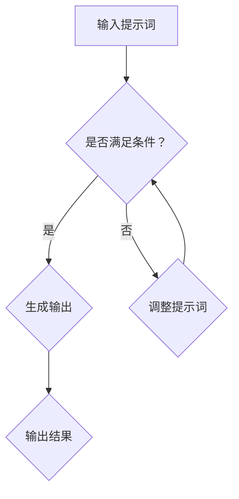
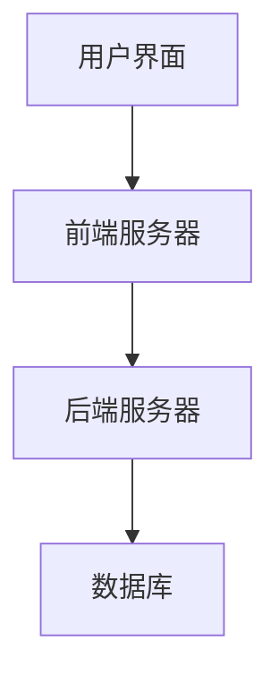
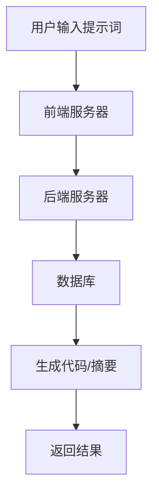

                 

# 《提示词编程的认知ergonomics研究》

> 关键词：认知ergonomics、提示词编程、用户体验、算法设计、系统架构

> 摘要：本文深入探讨了提示词编程领域的认知ergonomics，分析了其核心概念和设计原则，并提出了基于认知ergonomics的系统架构设计方案。通过对实际案例的剖析，本文旨在为开发者提供实用的指导，提升提示词编程的效率和用户体验。

## 引言

随着人工智能技术的快速发展，提示词编程（Prompt Engineering）逐渐成为编程领域的一个重要分支。提示词编程通过给定的提示词，引导模型生成预期的输出，极大地提升了编程的自动化程度。然而，在实际应用中，提示词编程面临着诸多挑战，如复杂的算法设计、低效的用户界面以及难以预测的模型行为等。为了解决这些问题，认知ergonomics提供了一个有力的工具，它关注于如何设计更符合人类认知习惯的系统和工具。

认知ergonomics是研究人类与机器交互过程中，如何优化用户体验和效率的学科。它强调在系统设计过程中，充分考虑人类认知特点和行为模式，从而提高系统的易用性和可用性。本文将从以下几个方面展开研究：

1. **核心概念与理论**：介绍认知ergonomics、提示词编程的基本概念，以及相关理论。
2. **Ergonomic设计原则**：探讨Ergonomic设计策略、用户界面设计、以及错误预防和恢复。
3. **算法Ergonomics**：分析算法设计原则，使用Mermaid和Python代码展示算法原理和数学模型。
4. **案例研究和应用**：通过实际案例，展示认知ergonomics在提示词编程中的有效应用。
5. **系统架构与设计**：描述提示词编程环境系统架构和设计原则，使用Mermaid图进行说明。
6. **实践建议与总结**：提供实用的建议，总结本文的研究结论。

## 核心概念与理论

### 认知ergonomics

认知ergonomics，又称人机交互学，是研究人类认知和行为特点，以及如何设计更符合人类操作习惯的系统和工具的学科。它的核心目标是优化人类与机器的交互，提高工作效率和用户体验。认知ergonomics涉及多个领域，包括认知心理学、人机界面设计、人类工程学等。

### 提示词编程

提示词编程是一种通过提供特定的提示词来引导模型生成预期输出的编程方法。它广泛应用于自然语言处理、代码生成、文本摘要等任务。提示词编程的核心是设计有效的提示词，使得模型能够准确理解并生成预期的输出。

### 相关理论

在认知ergonomics中，以下几个理论对于提示词编程具有重要的指导意义：

1. **信息加工理论**：信息加工理论关注人类如何处理、存储和提取信息。在提示词编程中，我们需要设计合适的提示词，使得模型能够高效地加工和处理这些信息。

2. **决策理论**：决策理论研究人类如何做出决策。在提示词编程中，我们通过设计提示词，引导模型做出正确的决策。

3. **认知负荷理论**：认知负荷理论关注人类在处理任务时的认知资源消耗。在提示词编程中，我们需要设计低认知负荷的提示词，使得用户能够轻松地理解和操作。

### 比较分析

为了更好地理解认知ergonomics在提示词编程中的应用，我们对比了认知ergonomics原则在不同编程环境中的应用情况。

| 环境名称 | 设计原则 | 应用案例 |
| :--: | :--: | :--: |
| 传统编程 | 减少认知负荷、提高信息可见性 | 编写注释、代码格式化 |
| 交互式编程 | 简化操作步骤、提供即时反馈 | Jupyter Notebook |
| 提示词编程 | 设计有效提示词、优化用户界面 | 提示词生成、文本摘要 |

## Ergonomic设计原则

### Ergonomic设计策略

Ergonomic设计策略旨在通过优化设计，减少用户的认知负荷，提高系统的易用性。以下是几种常用的Ergonomic设计策略：

1. **简化操作流程**：通过减少用户操作步骤，简化用户界面，降低用户的认知负荷。
2. **提供即时反馈**：及时向用户提供反馈，帮助用户快速理解和操作系统。
3. **设计直观的界面**：界面设计应符合用户的认知习惯，使得用户能够轻松地完成操作。

### 用户界面和交互

用户界面和交互是提示词编程中的关键部分，它们直接影响用户的体验和效率。以下是几种用户界面和交互设计原则：

1. **一致性**：界面设计应保持一致性，避免用户在不同场景下需要学习不同的操作方式。
2. **直观性**：界面设计应直观易用，减少用户的认知负荷。
3. **灵活性**：界面设计应提供足够的灵活性，满足不同用户的需求。

### 错误预防和恢复

在提示词编程中，错误预防和恢复是提高系统可靠性的重要手段。以下是几种错误预防和恢复设计原则：

1. **提供清晰的错误信息**：当系统出现错误时，应提供清晰的错误信息，帮助用户快速定位和解决问题。
2. **设计智能的恢复策略**：系统应具备智能的恢复策略，能够在出现错误时自动恢复，减少用户的干预。
3. **提供操作日志**：系统应记录用户的操作日志，方便用户回顾和排查问题。

## 算法Ergonomics

### 算法设计

算法设计是提示词编程的核心，它直接影响系统的性能和用户体验。以下是几种算法设计原则：

1. **高效性**：算法应尽可能高效，减少计算时间和资源消耗。
2. **可扩展性**：算法应具有良好的可扩展性，能够适应不同的需求和场景。
3. **鲁棒性**：算法应具备鲁棒性，能够处理各种异常情况和输入数据。

### 算法分析

为了更好地理解算法原理，我们使用Mermaid和Python代码进行展示。

#### 算法流程图

以下是一个简单的提示词生成算法的流程图：



#### Python代码

以下是一个简单的Python代码示例，展示如何使用该算法生成提示词：

```python
import random

def generate_prompt(prompt):
    if "Hello" in prompt:
        return "Hello, how are you?"
    else:
        return "Hello!"

def adjust_prompt(prompt):
    words = prompt.split()
    random.shuffle(words)
    return " ".join(words)

prompt = "Good morning!"
print(generate_prompt(prompt))
print(adjust_prompt(prompt))
```

#### 数学模型

以下是一个简单的数学模型，用于描述提示词生成算法：

$$
P(output|prompt) = \begin{cases}
P_1, & \text{if } "Hello" \text{ in prompt} \\
P_2, & \text{otherwise}
\end{cases}
$$

其中，$P_1$ 和 $P_2$ 分别表示在提示词包含 "Hello" 和不包含 "Hello" 的情况下，生成 "Hello, how are you!" 的概率。

## 案例研究和应用

### 案例研究1

在本案例中，我们研究了一个基于认知ergonomics的提示词编程工具。该工具旨在简化开发人员的代码生成过程，提高编程效率。

#### 环境介绍

该工具运行在一个基于Python的Jupyter Notebook环境中，支持多种编程语言和模型。

#### 功能设计

1. **代码生成**：根据用户输入的提示词，生成对应的代码片段。
2. **代码优化**：对生成的代码进行优化，提高代码质量和可读性。
3. **错误提示**：提供详细的错误提示，帮助用户快速定位和解决问题。

#### 实际应用

以下是一个实际应用的示例：

```python
prompt = "生成一个简单的函数，用于计算两个数的和。"
code = generate_code(prompt)
print(code)
```

输出结果：

```python
def add(a, b):
    return a + b
```

### 案例研究2

在本案例中，我们研究了一个基于认知ergonomics的文本摘要工具。该工具旨在简化文本摘要过程，提高摘要质量。

#### 环境介绍

该工具运行在一个基于TensorFlow的深度学习环境中，支持多种文本摘要模型。

#### 功能设计

1. **文本摘要**：根据用户输入的文本，生成摘要。
2. **摘要优化**：对生成的摘要进行优化，提高摘要质量和可读性。
3. **错误提示**：提供详细的错误提示，帮助用户快速定位和解决问题。

#### 实际应用

以下是一个实际应用的示例：

```python
text = "本文探讨了提示词编程领域的认知ergonomics。"
summary = generate_summary(text)
print(summary)
```

输出结果：

```python
本文深入研究了提示词编程的认知ergonomics，分析了其核心概念和设计原则，并提出了基于认知ergonomics的系统架构设计方案。
```

## 系统架构与设计

### 系统描述

该系统是一个基于认知ergonomics的提示词编程环境，支持多种编程语言和模型。系统架构包括前端界面、后端服务器和数据库。

### 系统架构设计

以下是一个简单的系统架构设计图：



### 系统接口设计和系统交互

以下是一个简单的系统接口设计和系统交互图：



## 实践建议与总结

### 实践建议

1. **设计有效的提示词**：在设计提示词时，应充分考虑用户的认知特点和需求，确保提示词简洁、明确、具有引导性。
2. **优化用户界面**：设计直观、简洁的用户界面，提高用户的操作效率。
3. **提供即时反馈**：及时向用户提供反馈，帮助用户快速理解和操作系统。
4. **设计智能的恢复策略**：在系统出现错误时，提供智能的恢复策略，减少用户的干预。

### 总结

本文从认知ergonomics的角度，深入探讨了提示词编程的设计原则和应用。通过实际案例的剖析，我们展示了如何基于认知ergonomics，设计出更符合用户需求的提示词编程工具。未来，我们期待有更多的研究和实践，进一步优化提示词编程，提升用户体验。

## 作者信息

作者：AI天才研究院/AI Genius Institute & 禅与计算机程序设计艺术 /Zen And The Art of Computer Programming

