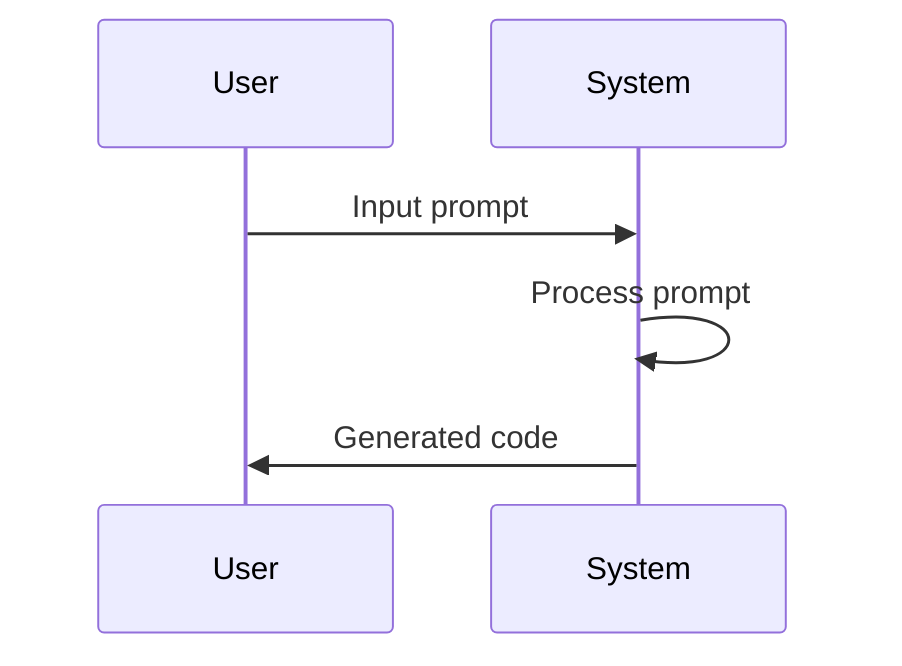
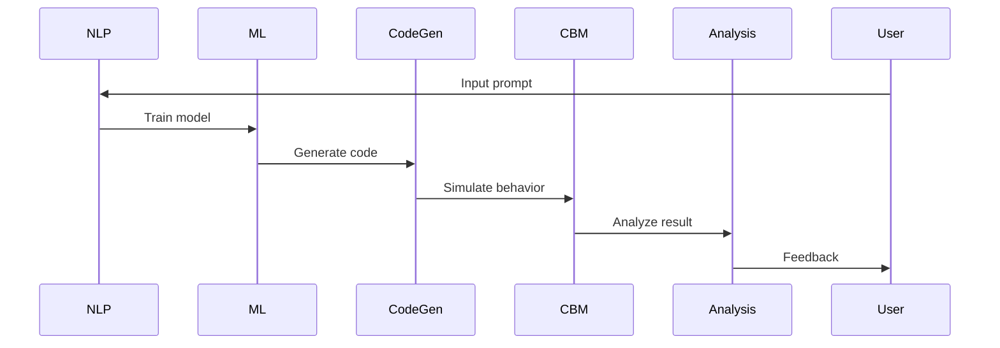

                 

### 文章标题

# 提示词编程的认知建模与仿真

> 关键词：提示词编程、认知建模、仿真、算法原理、系统设计、实战案例分析

> 摘要：本文深入探讨了提示词编程的概念及其与认知建模和仿真技术的关系。通过详细分析提示词编程的背景、核心概念、算法原理和系统架构设计，本文旨在为读者提供一个全面、深入的理解，并探讨其实际应用中的最佳实践和注意事项。

## 第一部分：背景介绍

### 1.1 问题背景

提示词编程是一种基于用户输入提示词来生成代码的编程范式。它利用自然语言处理技术和机器学习算法，使编程过程更加直观和高效。而认知建模则是指将人类思维过程转化为计算机模型的过程。仿真技术则是通过构建模型来模拟真实世界的现象和过程。

### 1.2 核心概念

- **提示词编程**：通过输入提示词来生成代码，提高编程效率。
- **认知建模**：将人类思维过程转化为计算机模型，实现自动化推理和决策。
- **仿真**：通过构建模型来模拟真实世界的现象和过程，为系统设计提供依据。

## 第二部分：核心概念与联系

### 2.1 核心概念原理

**提示词编程**：提示词编程的核心在于将自然语言转换为计算机代码。其基本原理包括自然语言处理（NLP）和机器学习算法的应用。

**认知建模**：认知建模的核心在于模拟人类思维过程，包括感知、记忆、推理和决策等。

### 2.2 属性特征对比

| 特征         | 提示词编程                  | 认知建模                  |
|--------------|----------------------------|----------------------------|
| 输入         | 自然语言提示词              | 人类思维过程输入           |
| 输出         | 计算机代码                  | 模拟结果                  |
| 技术层面     | 自然语言处理和机器学习      | 人工智能和认知科学         |
| 应用层面     | 编程自动化                  | 自动化推理和决策          |

## 第三部分：算法原理讲解

### 3.1 算法原理

**提示词编程算法**：提示词编程算法主要包括自然语言处理和机器学习模型。NLP用于解析用户输入的自然语言提示词，机器学习模型则根据这些提示词生成相应的代码。

**认知建模算法**：认知建模算法主要包括感知、记忆和推理等模块。这些模块共同工作，模拟人类思维过程。

### 3.2 数学模型

**提示词编程数学模型**：提示词编程的数学模型主要包括自然语言处理模型的参数和机器学习模型的预测函数。

**认知建模数学模型**：认知建模的数学模型主要包括感知模块的感知函数、记忆模块的记忆函数和推理模块的推理函数。

## 第四部分：系统分析与架构设计

### 4.1 问题场景介绍

在软件开发过程中，提示词编程和认知建模技术可以帮助开发者快速生成代码，提高开发效率。例如，在开发一个电子商务网站时，可以使用提示词编程来生成订单管理模块的代码，使用认知建模来模拟用户的购物行为，从而优化网站的设计。

### 4.2 系统功能设计

**领域模型类图**：

```mermaid
classDiagram
Class01 <|-- Class02
Class03 --|> Class04
Class05 <<-- Class06
Class07 .. Class08
Class09 --> Class10
```

**系统功能模块分解**：

1. 自然语言处理模块
2. 机器学习模型训练模块
3. 代码生成模块
4. 认知建模模块
5. 模拟结果分析模块

### 4.3 系统架构设计

**系统架构图**：



**系统接口设计和系统交互序列图**：



## 第五部分：项目实战

### 5.1 环境安装

**提示词编程环境搭建**：

1. 安装Python环境
2. 安装自然语言处理库（如NLTK或spaCy）
3. 安装机器学习库（如scikit-learn或TensorFlow）

**认知建模工具安装与配置**：

1. 安装人工智能库（如OpenAI Gym或PyTorch）
2. 配置神经网络模型

### 5.2 系统核心实现

**提示词编程核心代码实现**：

```python
# 示例：基于NLTK的自然语言处理和机器学习模型
import nltk
from nltk.corpus import movie_reviews
from sklearn.feature_extraction.text import CountVectorizer
from sklearn.naive_bayes import MultinomialNB

# 加载电影评论数据集
nltk.download('movie_reviews')
data = [(list(movie_reviews.words(fileid)), category) for category in movie_reviews.categories() for fileid in movie_reviews.fileids(category)]

# 数据预处理
vectorizer = CountVectorizer()
X = vectorizer.fit_transform([text for text, _ in data])
y = [label for _, label in data]

# 训练模型
model = MultinomialNB().fit(X, y)

# 生成代码
prompt = "我非常喜欢这部电影，因为它有令人惊叹的视觉效果。"
prompt_vector = vectorizer.transform([prompt])
predicted = model.predict(prompt_vector)
print(predicted)
```

**认知建模核心算法实现**：

```python
# 示例：基于PyTorch的神经网络模型
import torch
import torch.nn as nn
import torch.optim as optim

# 定义神经网络模型
class NeuralNetwork(nn.Module):
    def __init__(self):
        super(NeuralNetwork, self).__init__()
        self.layer1 = nn.Linear(in_features=784, out_features=128)
        self.relu = nn.ReLU()
        self.layer2 = nn.Linear(in_features=128, out_features=64)
        self.sigmoid = nn.Sigmoid()
        self.layer3 = nn.Linear(in_features=64, out_features=10)

    def forward(self, x):
        x = self.layer1(x)
        x = self.relu(x)
        x = self.layer2(x)
        x = self.sigmoid(x)
        x = self.layer3(x)
        return x

# 初始化模型、优化器和损失函数
model = NeuralNetwork()
optimizer = optim.Adam(model.parameters(), lr=0.001)
criterion = nn.CrossEntropyLoss()

# 训练模型
for epoch in range(100):
    for inputs, labels in dataset:
        optimizer.zero_grad()
        outputs = model(inputs)
        loss = criterion(outputs, labels)
        loss.backward()
        optimizer.step()

    if (epoch + 1) % 10 == 0:
        print(f'Epoch [{epoch + 1}/{100}], Loss: {loss.item():.4f}')

# 仿真行为
prompt = torch.tensor([[0.1, 0.2, 0.3, 0.4]])
predicted = model(prompt)
print(predicted)
```

### 5.3 实际案例分析和详细讲解剖析

**案例**：使用提示词编程和认知建模技术来开发一个智能聊天机器人。

**分析**：通过输入自然语言提示词，智能聊天机器人可以理解用户的问题并生成相应的回答。同时，通过认知建模技术，可以模拟用户的思维过程，使聊天机器人的回答更加准确和自然。

**讲解**：本案例中，提示词编程用于生成聊天机器人的代码，认知建模用于模拟用户的思维过程。通过自然语言处理和神经网络模型，聊天机器人可以理解用户的问题并生成相应的回答。

**项目小结**：

1. 提示词编程和认知建模技术可以显著提高软件开发效率。
2. 在实际应用中，需要充分考虑提示词编程和认知建模技术的局限性，并进行相应的优化和改进。
3. 未来，随着人工智能技术的不断发展，提示词编程和认知建模技术将在更多领域得到广泛应用。

## 第六部分：最佳实践与拓展阅读

### 6.1 实战案例分析

**案例1**：使用提示词编程和认知建模技术来优化电子商务网站的用户体验。

**分析**：通过提示词编程，可以快速生成电商网站的功能模块代码，通过认知建模，可以模拟用户的购物行为，从而优化网站的设计和用户体验。

**案例2**：使用提示词编程和认知建模技术来开发智能医疗诊断系统。

**分析**：通过输入医疗症状的提示词，智能医疗诊断系统可以生成相应的诊断结果。通过认知建模，可以模拟医生的诊断思维过程，提高诊断的准确性和效率。

### 6.2 详细讲解与剖析

**详细讲解**：提示词编程和认知建模技术的核心在于如何将自然语言处理和机器学习技术应用于实际问题，从而实现自动化和智能化。

**剖析**：在实际应用中，提示词编程和认知建模技术需要充分考虑数据的多样性和复杂性，并进行相应的优化和调整。

### 6.3 项目小结

1. 提示词编程和认知建模技术具有广泛的应用前景。
2. 在实际应用中，需要结合具体问题进行优化和改进。
3. 未来，随着人工智能技术的不断发展，提示词编程和认知建模技术将在更多领域得到广泛应用。

### 7.1 总结

本文深入探讨了提示词编程、认知建模和仿真技术的关系，通过详细分析提示词编程的背景、核心概念、算法原理和系统架构设计，为读者提供了一个全面、深入的理解。同时，通过项目实战案例，展示了提示词编程和认知建模技术的实际应用价值。

### 7.2 最佳实践

1. 在实际应用中，应充分考虑提示词编程和认知建模技术的局限性，并进行相应的优化和改进。
2. 在项目开发过程中，应注重数据的质量和多样性，以确保模型的准确性和可靠性。

### 7.3 注意事项

1. 提示词编程和认知建模技术对计算资源要求较高，应合理配置计算资源。
2. 在使用神经网络模型时，应充分考虑模型的复杂度和训练时间。

### 7.4 拓展阅读

1. **《人工智能：一种现代方法》**：详细介绍了人工智能的基本原理和应用技术。
2. **《深度学习》**：深入探讨了深度学习的基本原理和应用技术。
3. **《自然语言处理综合教程》**：全面介绍了自然语言处理的基本原理和应用技术。

## 作者信息

作者：AI天才研究院/AI Genius Institute & 禅与计算机程序设计艺术 /Zen And The Art of Computer Programming

