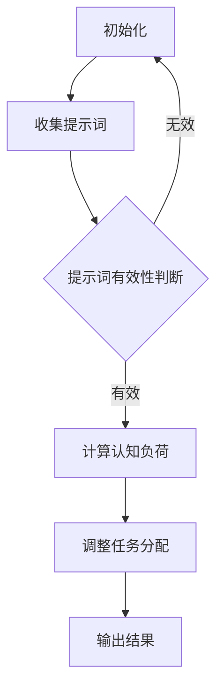

                 

### 1.1 问题背景

#### 1.1.1 提示词编程的兴起

提示词编程（Tip-Word Programming）是一种通过提示词来指导编程过程的技术。它起源于20世纪90年代，随着人工智能和自然语言处理技术的发展，逐渐成为现代编程中的一种重要工具。提示词编程的核心思想是通过提供简明扼要的提示词，帮助开发者更好地理解和完成任务。

**提示词编程的定义：**
提示词编程是一种编程范式，它强调通过提示词来引导编程过程。这些提示词可以是关键字、短语或者完整的代码片段，它们用于指导开发者理解需求、设计解决方案以及编写代码。

**提示词编程的发展历程：**
- **早期阶段：** 提示词编程的初步概念在20世纪90年代被提出。当时，研究者们开始探索如何利用自然语言处理技术来改善编程体验。
- **发展阶段：** 随着人工智能和机器学习技术的进步，提示词编程逐渐成熟。各种提示词编程工具和框架开始涌现，如GitHub Copilot、TabNine等。
- **当前状态：** 提示词编程已经成为开发者的常用工具，广泛应用于代码补全、代码审查、文档生成等领域。

#### 1.1.2 认知负荷的概念

认知负荷（Cognitive Load）是指个体在执行任务过程中需要处理的认知信息总量。它是个体认知能力的衡量标准，直接影响任务的完成质量和效率。认知负荷可以分为三种类型：外在认知负荷、内在认知负荷和管理认知负荷。

**认知负荷的定义：**
认知负荷是指个体在执行任务时，需要分配注意力和认知资源去处理的信息量。它涉及信息接收、处理、存储和运用等各个环节。

**认知负荷在编程中的影响：**
在编程过程中，认知负荷直接影响开发者的工作效率和代码质量。过高的认知负荷会导致开发者疲劳、出错，而适当的认知负荷则有助于提高开发效率。

#### 1.1.3 均衡算法的意义

均衡算法（Load Balancing Algorithm）是通过调整任务分配，使得个体在执行任务时认知负荷均衡的一种算法。在提示词编程中，均衡算法有助于优化开发者的工作负荷，提高整体工作效率。

**什么是均衡算法：**
均衡算法是一种用于优化资源分配和任务调度的方法。它通过合理分配任务，确保每个个体承担的负荷在可接受范围内，从而提高整体效率和性能。

**均衡算法在编程中的重要性：**
- **提升开发效率：** 通过均衡算法，开发者可以更合理地分配任务，避免过重的认知负荷，从而提高开发效率。
- **改善代码质量：** 均衡算法有助于开发者集中精力完成任务，减少错误和调试时间，从而提高代码质量。
- **降低工作压力：** 合理的任务分配可以减轻开发者的工作压力，提高工作满意度。

### 1.1.4 研究目的与目标

**研究目的：**
本研究旨在探索提示词编程中的认知负荷均衡算法，通过分析其核心概念、原理和实现方法，提出一种有效的认知负荷均衡方案，以提高提示词编程的开发效率和质量。

**研究目标：**
- **理解提示词编程的核心概念和认知负荷：** 深入分析提示词编程的工作原理，明确认知负荷的影响因素。
- **提出均衡算法设计方案：** 基于认知负荷分析，设计一种有效的均衡算法，优化任务分配。
- **验证算法的有效性和适用性：** 通过实际应用和案例分析，验证所设计算法的有效性和适用性。

### 1.2 核心概念与联系

#### 1.2.1 提示词编程的核心概念

提示词编程的核心概念主要包括提示词、编程范式、编程语言和开发环境等。以下是这些核心概念的具体解释：

- **提示词（Tip-Word）：** 提示词是指导开发者理解需求和设计解决方案的关键词或短语。它们可以是自然语言描述，也可以是代码片段。
- **编程范式（Programming Paradigm）：** 提示词编程采用的自然语言编程范式，它强调通过提示词来引导编程过程，而不是传统的代码编写方式。
- **编程语言（Programming Language）：** 提示词编程通常使用特定的编程语言或工具，如Python、Java等，来处理提示词和生成代码。
- **开发环境（Development Environment）：** 提示词编程需要一个支持自然语言处理和代码自动生成的开发环境，如集成开发环境（IDE）或在线代码编辑器。

#### 1.2.2 认知负荷的属性特征对比表格

以下是提示词编程和认知负荷相关的属性特征对比表格：

| 概念         | 定义                                                         | 属性特征                                      |
|--------------|------------------------------------------------------------|---------------------------------------------|
| 提示词编程   | 通过提示词来指导编程过程的技术。                             | 输入格式、执行效率、易用性等                     |
| 认知负荷     | 个体在执行任务过程中需要处理的认知信息总量。                   | 信息量、处理速度、复杂度等                      |
| 均衡算法     | 通过调整任务分配，使得个体在执行任务时认知负荷均衡的算法。   | 负荷平衡性、适应性、优化目标等                  |

#### 1.2.3 提示词编程与认知负荷的ER实体关系图

下面是一个简单的ER实体关系图，描述了提示词编程与认知负荷之间的关系：

```mermaid
erDiagram
  User ||--o{ Task : 执行 }
  User ||--o{ Cognitive_Load : 处理 }
  Task ||--o{ Tip_Word_Programming : 指导 }
```

在这个ER图中，用户（User）与任务（Task）和认知负荷（Cognitive_Load）之间存在关联。用户执行任务，同时处理任务带来的认知负荷。任务通过提示词编程得到指导。

### 1.3 算法原理讲解

#### 1.3.1 算法的基本思想

认知负荷均衡算法的核心思想是通过调整任务分配，使开发者在执行任务时的认知负荷达到平衡。具体来说，算法的步骤可以分为以下几个部分：

1. **收集提示词**：从开发过程中获取相关的提示词。
2. **提示词有效性判断**：判断收集到的提示词是否有效，即是否能够指导任务的完成。
3. **计算认知负荷**：根据提示词和任务的复杂度计算开发者的认知负荷。
4. **调整任务分配**：根据认知负荷的计算结果，重新分配任务，使得整体认知负荷达到均衡。
5. **输出结果**：输出调整后的任务分配方案。

#### 1.3.2 算法流程图

下面是一个简化的算法流程图，展示了认知负荷均衡算法的基本步骤：



#### 1.3.3 算法原理的数学模型和公式

认知负荷均衡算法的核心数学模型可以表示为：

$$
Cognitive_Load = f(Tip_Word_Complexity, Task_Complexity, User_Capability)
$$

其中：
- \(Cognitive_Load\)：认知负荷
- \(Tip_Word_Complexity\)：提示词复杂度
- \(Task_Complexity\)：任务复杂度
- \(User_Capability\)：用户能力

这个公式表示认知负荷是提示词复杂度、任务复杂度和用户能力的函数。通过调整这三个因素，可以优化认知负荷。

#### 1.3.4 举例说明

为了更好地理解认知负荷均衡算法，我们可以通过一个简单的例子来说明。

**例子：任务A和任务B的认知负荷计算**

假设我们有两个任务：
- 任务A：编写一个简单的Python脚本，实现一个基础的函数。
- 任务B：调试一个复杂的Java应用，解决多个bug。

现在我们要使用认知负荷均衡算法来计算这两个任务对应的认知负荷。

1. **提示词复杂度**：假设提示词的复杂度是中等。
2. **任务复杂度**：任务A的复杂度较低，任务B的复杂度较高。
3. **用户能力**：假设用户的能力是中等。

根据公式：

- 任务A的认知负荷 \(Cognitive_Load_A = f(中等, 较低, 中等)\)
- 任务B的认知负荷 \(Cognitive_Load_B = f(中等, 较高, 中等)\)

我们可以通过这个公式计算两个任务的认知负荷。

#### 1.3.5 算法优缺点分析

**优点：**
1. **自适应**：算法可以根据任务和提示词的不同自动调整认知负荷，使开发者更加高效。
2. **高效**：通过均衡认知负荷，可以减少开发者的疲劳和错误，提高整体开发效率。

**缺点：**
1. **计算复杂度**：由于需要计算提示词复杂度、任务复杂度和用户能力，算法的复杂度可能较高，需要较多的计算资源。
2. **适应性**：在面对复杂和多变的任务时，算法可能存在适应性不足的问题，需要进一步优化。

### 总结

本文介绍了提示词编程的认知负荷均衡算法，包括其背景、核心概念、算法原理和优缺点分析。通过逐步分析，我们了解了认知负荷均衡算法的设计思路和实现方法，为在实际开发中应用该算法提供了理论基础。下一部分将深入探讨提示词编程与认知负荷之间的具体联系，以及算法在实际应用中的效果和挑战。

