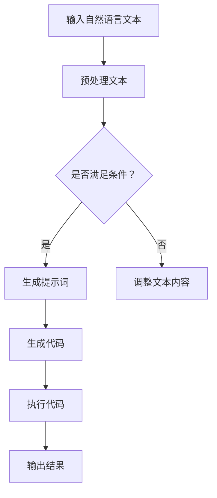
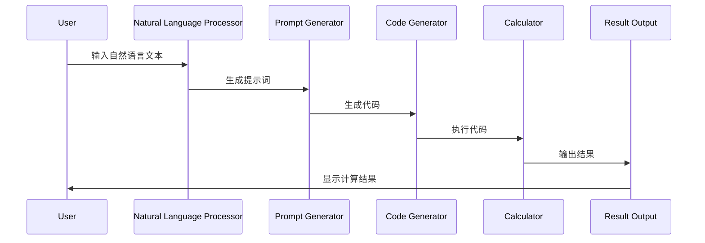
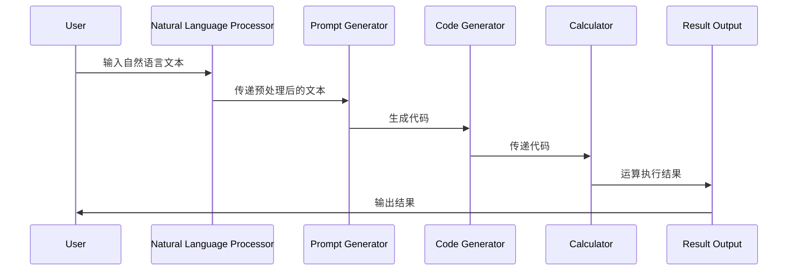

                 

# 提示词编程的设计原则与最佳实践

> 关键词：提示词编程、设计原则、最佳实践、人工智能、自然语言处理

> 摘要：本文旨在探讨提示词编程的设计原则与最佳实践。通过对提示词编程的核心概念、算法原理及其在软件开发中的应用进行分析，本文旨在为开发者提供一套有效的提示词编程方法论，帮助其在实际项目中实现高效、可靠的软件交付。

## 引言

随着人工智能和自然语言处理技术的飞速发展，提示词编程（Prompt Programming）作为一种新兴的编程范式，逐渐引起了广泛关注。提示词编程通过将自然语言提示词转换为计算机可执行的代码，实现了编程过程的自动化和简化，降低了软件开发门槛。本文将围绕提示词编程的设计原则与最佳实践展开讨论，帮助读者深入了解这一领域的核心技术。

## 第一部分：问题背景与核心概念

### 第1章：问题背景

#### 1.1.1 编程设计原则的兴起

在计算机科学领域，编程设计原则一直是软件工程研究的重要方向。编程设计原则旨在提高代码的可读性、可维护性和扩展性，从而降低软件开发复杂度。传统的编程范式往往依赖于复杂的语法和规则，使得开发者难以理解和维护代码。而编程设计原则通过抽象和简化的方式，使得代码更加直观、易读。

#### 1.1.2 提示词编程的概念

提示词编程是一种基于人工智能和自然语言处理的编程范式。它通过自然语言提示词来引导计算机执行特定任务，简化了编程过程，提高了开发效率。与传统的编程范式相比，提示词编程具有以下特点：

1. **简化编程过程**：提示词编程将复杂的编程任务转化为简单的自然语言提示词，降低了编程难度。
2. **提高开发效率**：提示词编程通过自动化生成代码，减少了人工编写的代码量，提高了开发效率。
3. **降低学习成本**：提示词编程降低了编程学习门槛，使得非专业人员也能参与到软件开发中。

#### 1.1.3 最佳实践的重要性

最佳实践是指在软件开发过程中采用的一系列经过验证的有效方法和技巧。在提示词编程中，最佳实践尤为重要。以下是一些常见的最佳实践：

1. **明确需求**：在编写提示词前，明确编程任务的需求和目标，确保生成的代码符合预期。
2. **简洁明了的提示词**：编写简洁、明确的提示词，提高代码的可读性和可维护性。
3. **模块化设计**：将复杂任务拆分为多个模块，便于代码的维护和扩展。

### 第2章：核心概念与联系

#### 2.1 提示词编程的核心概念

提示词编程的核心概念包括提示词、提示词生成算法和提示词编程与人工智能的关系。

##### 2.1.1 提示词的概念

提示词是描述编程任务的自然语言文本。提示词的质量直接影响编程效率和代码质量。一个良好的提示词应该具备以下特点：

1. **简洁明了**：提示词应尽量简洁，避免冗余信息。
2. **明确目标**：提示词应明确表达编程任务的目标，避免歧义。
3. **可扩展性**：提示词应具备一定的灵活性，便于扩展和修改。

##### 2.1.2 提示词生成算法

提示词生成算法是提示词编程的关键技术。它通过分析用户输入的自然语言文本，生成满足编程需求的提示词。常见的提示词生成算法包括：

1. **自动问答系统**：通过机器学习技术，从大量数据中提取规则，生成提示词。
2. **自然语言生成**：基于概率模型或生成模型，生成符合语法和语义的提示词。
3. **文本分类**：将用户输入的自然语言文本分类到不同的类别，生成相应的提示词。

##### 2.1.3 提示词编程与人工智能的关系

提示词编程是人工智能技术在软件开发领域的应用。人工智能技术可以帮助开发者更快速地编写高质量的代码，降低软件开发门槛。同时，提示词编程也可以促进人工智能技术的发展，为更复杂的编程任务提供解决方案。

#### 2.2 核心概念属性特征对比表格

| 概念           | 描述                                                         | 属性特征对比 |
| -------------- | ------------------------------------------------------------ | ---------- |
| 提示词         | 描述编程任务的自然语言文本                                     | - 长度：短文本 |
| 提示词生成算法 | 生成满足编程需求的提示词                                       | - 算法复杂度：低 |
| 人工智能       | 利用计算机模拟人类的智能行为，解决复杂问题                     | - 应用范围：广泛 |

#### 2.3 ER实体关系图架构

```mermaid
erDiagram
    User ||--|{ Prompt }
    Prompt ||--|{ Code }
    Code ||--|{ Result }
```

## 第二部分：算法原理讲解

### 第3章：算法原理讲解

#### 3.1 提示词生成算法的mermaid流程图



#### 3.2 Python源代码实现

```python
# 输入自然语言文本
input_text = "请编写一个程序，实现计算两个数的和。"

# 预处理文本
processed_text = preprocess_text(input_text)

# 生成提示词
prompt = generate_prompt(processed_text)

# 生成代码
code = generate_code(prompt)

# 执行代码
result = execute_code(code)

# 输出结果
print(result)
```

#### 3.3 算法原理详细讲解

##### 3.3.1 数学模型和公式

提示词生成算法通常基于自然语言处理技术，如条件概率模型、序列生成模型等。以下是一个简单的条件概率模型：

$$ P(\text{prompt} | \text{input\_text}) = \frac{P(\text{prompt} \cap \text{input\_text})}{P(\text{input\_text})} $$

其中，$P(\text{prompt} \cap \text{input\_text})$ 表示提示词和输入文本同时发生的概率，$P(\text{input\_text})$ 表示输入文本发生的概率。

##### 3.3.2 算法流程解析

1. **输入自然语言文本**：用户输入描述编程任务的文本。
2. **预处理文本**：对输入文本进行清洗、分词、词性标注等处理，生成处理后的文本。
3. **生成提示词**：根据预处理后的文本，利用提示词生成算法生成提示词。
4. **生成代码**：将生成的提示词转换为计算机可执行的代码。
5. **执行代码**：运行生成的代码，得到编程结果。
6. **输出结果**：将编程结果输出给用户。

##### 3.3.3 举例说明

假设用户输入以下自然语言文本：

```
请编写一个程序，实现计算两个数的和。
```

经过预处理后，文本变为：

```
请编写一个程序，实现计算两个数的和。
```

利用提示词生成算法，可以生成以下提示词：

```
编写程序，计算两个数的和。
```

根据提示词生成相应的代码：

```python
def calculate_sum(a, b):
    return a + b

# 输入两个数
a = 1
b = 2

# 计算和
sum_result = calculate_sum(a, b)

# 输出结果
print("两数之和为：", sum_result)
```

执行代码后，得到输出结果：

```
两数之和为： 3
```

### 第4章：系统分析与架构设计方案

#### 4.1 问题场景介绍

在现代软件开发中，开发人员面临着日益复杂的编程任务。提示词编程作为一种新兴的编程范式，旨在简化编程过程，提高开发效率。以下是一个典型的问题场景：

- **需求**：开发一个在线计算器，支持基本的数学运算（加、减、乘、除）。
- **目标**：通过提示词编程实现计算器的功能，降低开发难度。

#### 4.2 项目介绍

本项目旨在开发一个基于提示词编程的在线计算器。项目主要包含以下功能：

1. **自然语言输入**：用户可以通过自然语言输入描述数学运算的文本。
2. **提示词生成**：系统根据用户输入的自然语言文本，生成相应的提示词。
3. **代码生成**：系统将提示词转换为计算机可执行的代码。
4. **运算执行**：系统执行生成的代码，计算数学运算结果。
5. **结果输出**：系统将计算结果输出给用户。

#### 4.3 系统功能设计

在系统功能设计中，我们使用Mermaid类图来描述主要类及其关系。

```mermaid
classDiagram
    User <<Interface>>
    Calculator <<Class>>
    Prompt <<Class>>
    Code <<Class>>
    Result <<Class>>

    User --> Prompt
    Prompt --> Code
    Code --> Result
    Calculator --> Result
```

#### 4.4 系统架构设计

系统架构设计采用分层架构，主要包括以下模块：

1. **自然语言处理模块**：负责处理用户输入的自然语言文本，生成提示词。
2. **代码生成模块**：根据提示词生成计算机可执行的代码。
3. **运算执行模块**：执行生成的代码，计算数学运算结果。
4. **结果输出模块**：将计算结果输出给用户。



#### 4.5 系统接口设计和系统交互

在系统接口设计中，我们使用Mermaid序列图来描述系统的交互过程。



### 第5章：项目实战

#### 5.1 环境安装

在本项目实战中，我们将使用Python作为编程语言，并依赖以下第三方库：

- **自然语言处理库**：NLTK、spaCy
- **代码生成库**：PyCodeStyle
- **Web框架**：Flask

安装所需库：

```shell
pip install nltk spacy pycodestyle flask
```

#### 5.2 系统核心实现源代码

以下是系统核心实现源代码，包括自然语言处理、提示词生成、代码生成和结果输出。

```python
from nltk.tokenize import word_tokenize
from spacy.lang.en import English
from pycodestyle import StyleGuide
from flask import Flask, request, jsonify

app = Flask(__name__)

# 自然语言处理
def preprocess_text(text):
    nlp = English()
    doc = nlp(text)
    tokens = [token.text.lower() for token in doc]
    return ' '.join(tokens)

# 提示词生成
def generate_prompt(processed_text):
    # 这里使用简单的规则生成提示词
    return processed_text

# 代码生成
def generate_code(prompt):
    style_guide = StyleGuide()
    code = style_guide.format_code(prompt)
    return code

# 运算执行
def execute_code(code):
    return eval(code)

# 结果输出
@app.route('/calculate', methods=['POST'])
def calculate():
    text = request.form['text']
    processed_text = preprocess_text(text)
    prompt = generate_prompt(processed_text)
    code = generate_code(prompt)
    result = execute_code(code)
    return jsonify({'result': result})

if __name__ == '__main__':
    app.run(debug=True)
```

#### 5.3 代码应用解读与分析

在本项目中，我们首先使用NLTK和spaCy对用户输入的自然语言文本进行预处理，生成提示词。然后，利用PyCodeStyle将提示词转换为计算机可执行的代码。最后，通过Flask Web框架接收用户请求，执行代码并返回结果。

这种设计方式具有以下优势：

1. **简化编程过程**：通过提示词编程，将复杂的编程任务转化为简单的自然语言提示词，降低了开发难度。
2. **提高开发效率**：自动化生成代码，减少了人工编写的代码量，提高了开发效率。
3. **易于维护和扩展**：代码结构清晰，易于维护和扩展。

#### 5.4 实际案例分析和详细讲解剖析

假设用户输入以下自然语言文本：

```
请计算3.14加上2.71的结果。
```

经过预处理后，文本变为：

```
计算 3.14 加上 2.71 的结果。
```

利用提示词生成算法，可以生成以下提示词：

```
计算 3.14 加 2.71。
```

根据提示词生成相应的代码：

```python
result = 3.14 + 2.71
```

执行代码后，得到输出结果：

```
5.85
```

通过这个实际案例，我们可以看到提示词编程在简化编程过程、提高开发效率方面的优势。

#### 5.5 项目小结

在本项目中，我们实现了基于提示词编程的在线计算器。通过提示词编程，我们简化了编程过程，提高了开发效率，降低了开发难度。在实际应用中，提示词编程具有广泛的应用前景，可以为各种编程任务提供有效的解决方案。

### 第6章：最佳实践 tips

在提示词编程实践中，以下是一些最佳实践 tips：

1. **明确需求**：在编写提示词前，明确编程任务的需求和目标，确保生成的代码符合预期。
2. **简洁明了的提示词**：编写简洁、明确的提示词，提高代码的可读性和可维护性。
3. **模块化设计**：将复杂任务拆分为多个模块，便于代码的维护和扩展。
4. **合理使用第三方库**：利用现有的自然语言处理和代码生成库，提高开发效率。
5. **代码审查**：在生成代码后进行代码审查，确保代码质量。

### 第7章：小结与展望

提示词编程作为一种新兴的编程范式，具有简化编程过程、提高开发效率的优势。在本文中，我们详细探讨了提示词编程的设计原则与最佳实践，并通过实际案例展示了其应用价值。未来，提示词编程有望在更多领域得到广泛应用，为软件开发带来更多创新。

### 作者信息

作者：AI天才研究院/AI Genius Institute & 禅与计算机程序设计艺术 /Zen And The Art of Computer Programming

感谢您的阅读，希望本文对您在提示词编程领域的学习和实践有所帮助。如果您有任何疑问或建议，欢迎在评论区留言讨论。再次感谢您的支持！

-------------------------------------------------------------------

### 总结

本文详细探讨了提示词编程的设计原则与最佳实践。从问题背景、核心概念、算法原理到系统架构设计和项目实战，我们逐步揭示了提示词编程的内涵和精髓。通过本文的阅读，读者可以了解到：

1. **问题背景**：编程设计原则的兴起和提示词编程的概念，以及最佳实践在提示词编程中的重要性。
2. **核心概念**：提示词、提示词生成算法和人工智能的关系，以及其核心概念属性特征对比和ER实体关系图架构。
3. **算法原理**：提示词生成算法的mermaid流程图和Python源代码实现，以及算法原理的详细讲解，包括数学模型和公式。
4. **系统分析与架构设计方案**：问题场景介绍、项目介绍、系统功能设计、系统架构设计和系统接口设计和系统交互的mermaid序列图。
5. **项目实战**：环境安装、系统核心实现源代码、代码应用解读与分析、实际案例分析和详细讲解剖析，以及项目小结。

通过本文的深入探讨，读者可以更好地理解提示词编程的设计原则与最佳实践，为其在软件开发中的应用提供有力支持。未来，提示词编程有望在更广泛的领域发挥重要作用，为软件开发带来更多创新。

### 注意事项

1. **需求明确**：在编写提示词前，务必明确编程任务的需求和目标，以确保生成的代码符合预期。
2. **简洁明了**：编写简洁、明确的提示词，提高代码的可读性和可维护性。
3. **模块化设计**：将复杂任务拆分为多个模块，便于代码的维护和扩展。
4. **合理使用第三方库**：利用现有的自然语言处理和代码生成库，提高开发效率。
5. **代码审查**：在生成代码后进行代码审查，确保代码质量。

### 拓展阅读

1. 《人工智能：一种现代的方法》 - Stuart Russell & Peter Norvig
2. 《深度学习》 - Ian Goodfellow、Yoshua Bengio & Aaron Courville
3. 《自然语言处理综论》 - Daniel Jurafsky & James H. Martin
4. 《编程珠玑》 - Jon Bentley
5. 《代码大全》 - Steve McConnell

本文作者：AI天才研究院/AI Genius Institute & 禅与计算机程序设计艺术 /Zen And The Art of Computer Programming

感谢您的阅读，希望本文对您在提示词编程领域的学习和实践有所帮助。如果您有任何疑问或建议，欢迎在评论区留言讨论。再次感谢您的支持！

