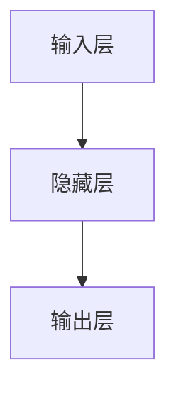
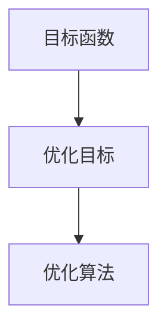
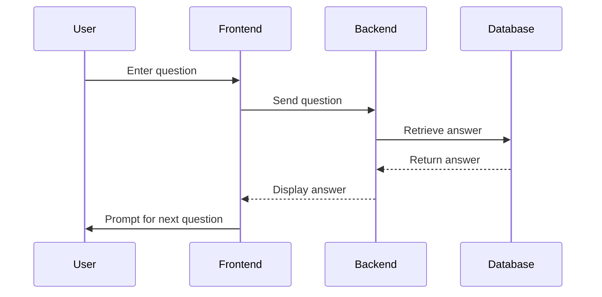

                 

# 《提示词编程的设计哲学与方法论》

## 关键词
提示词编程，设计哲学，方法论，算法原理，数学模型，系统架构，最佳实践

## 摘要
本文旨在深入探讨提示词编程的设计哲学与方法论。我们将从背景介绍、核心概念解析、算法原理讲解、数学模型分析、系统架构设计、项目实战到最佳实践总结，逐步剖析这一新兴领域的精髓。通过系统的分析推理，本文将为读者提供一个清晰、易懂且具有深度的技术视角，帮助理解提示词编程的内在逻辑和外在应用。

## 第一部分：背景与核心概念

### 第1章：问题背景与核心概念

#### 1.1 提示词编程的定义与作用
提示词编程（Keyword Programming）是一种基于提示词（Keywords）构建程序的编程范式。提示词作为一种编程语言的核心元素，可以引导程序执行特定任务。与传统编程语言相比，提示词编程更加强调人类语言与计算机指令之间的结合，使得编程过程更加直观和高效。

#### 1.2 提示词编程与传统编程的区别
传统编程依赖于复杂的语法和结构化代码，而提示词编程则通过简明易懂的提示词来简化编程流程。传统编程通常需要编写大量的代码来实现功能，而提示词编程则通过提示词的排列组合来实现相同的效果，从而减少冗余代码。

#### 1.3 提示词编程的设计哲学
提示词编程的设计哲学强调简洁性、易读性和高效性。设计哲学的核心是让编程语言更加贴近自然语言，使得非专业编程人员也能通过简单的提示词组合来构建程序。

#### 1.4 提示词编程的边界与外延
提示词编程的边界在于提示词的集合和指令集的规范。外延则涉及提示词编程在不同领域的应用，如自然语言处理、机器学习和人工智能等领域。

#### 1.5 提示词编程的核心要素组成
提示词编程的核心要素包括提示词、指令集、语法和语义。提示词是编程语言的基础元素，指令集则是执行特定任务的指令集合，语法是提示词和指令的排列规则，语义则决定了程序的执行逻辑。

### 第2章：核心概念与联系

#### 2.1 提示词、指令集与语法
提示词编程中的提示词和指令集是核心概念。提示词是程序执行的关键字，指令集则是一系列用于实现特定功能的指令。语法是提示词和指令的排列规则，决定了程序的结构和执行顺序。

##### 2.1.1 提示词的类型与功能
提示词可分为基本提示词和复合提示词。基本提示词直接对应具体的功能，而复合提示词则由多个基本提示词组合而成，用于实现更复杂的功能。

##### 2.1.2 指令集的组成与作用
指令集包括基本指令和组合指令。基本指令是执行基本操作的指令，组合指令则是通过基本指令的组合来执行更复杂的操作。

##### 2.1.3 提示词编程的语法结构
提示词编程的语法结构通常包括提示词、参数和操作符。提示词表示程序的功能，参数是传递给提示词的数据，操作符用于指示数据操作的方式。

#### 2.2 提示词编程与AI的联系
提示词编程与人工智能（AI）有着密切的联系。在AI领域，提示词编程可以用于构建智能程序，实现自然语言处理、机器学习模型训练等功能。

##### 2.2.1 提示词编程在AI领域的应用
提示词编程在AI领域中的应用包括智能问答系统、语音识别、图像识别等。

##### 2.2.2 提示词编程与机器学习的关系
提示词编程可以用于定义和优化机器学习模型的训练过程，通过提示词调整模型的参数和超参数。

##### 2.2.3 提示词编程与自然语言处理的关系
提示词编程在自然语言处理（NLP）领域有着广泛的应用，如文本分类、情感分析等。

#### 2.3 提示词编程与传统编程的对比表格
| 特点         | 提示词编程        | 传统编程        |
| ------------ | ---------------- | --------------- |
| 编程语言易用性 | 易于理解和使用    | 结构化、复杂    |
| 代码可读性   | 更容易阅读和编写 | 代码复杂、可读性低 |
| 开发效率     | 高效             | 低效           |

#### 2.4 提示词编程的ER实体关系图架构
```mermaid
erDiagram
  User ||--|{ Task }|-- Project
  Project ||--|{ Task }|-- User
  Task ||--|{ SubTask }|-- Task
  User ||--|{ Resource }|-- Project
  Resource ||--|{ Resource }|-- User
```
### 第二部分：算法原理与数学模型

#### 第3章：算法原理讲解

##### 3.1 提示词生成算法
提示词生成算法是提示词编程的核心组成部分。该算法的主要任务是生成具有特定意义的提示词，以实现程序的自动构建。

###### 3.1.1 算法概述
提示词生成算法包括输入预处理、提示词生成模型和提示词优化三个主要阶段。

###### 3.1.2 算法流程图


###### 3.1.3 算法原理与数学模型
提示词生成算法的核心是生成模型。该模型通常采用循环神经网络（RNN）或 Transformer 模型。其数学模型包括输入层、隐藏层和输出层。

```python
# 输入层
X = [x1, x2, ..., xn]

# 隐藏层
H = [h1, h2, ..., hn]

# 输出层
Y = [y1, y2, ..., yn]

# 模型训练过程
for epoch in range(EPOCHS):
    for x, y in dataset:
        # 前向传播
        h = forward(x)
        
        # 反向传播
        loss = compute_loss(h, y)
        backward(loss)
```

###### 3.1.4 算法举例说明
假设我们需要生成一个计算两个数之和的提示词。输入为两个整数，输出为它们的和。使用提示词生成算法，我们可以生成如下的提示词：

```python
# 输入
x1 = 2
x2 = 3

# 提示词生成模型
model = create_model()

# 生成提示词
prompt = model.generate_prompt([x1, x2])

# 输出
print(prompt)  # 输出：'计算两个数之和：2 + 3 = ?'
```

##### 3.2 提示词优化算法
提示词优化算法是用于提高提示词生成质量和效率的关键算法。该算法的主要任务是调整提示词生成模型的参数，以优化生成效果。

###### 3.2.1 算法概述
提示词优化算法包括参数初始化、优化过程和性能评估三个主要阶段。

###### 3.2.2 算法流程图


###### 3.2.3 算法原理与数学模型
提示词优化算法的核心是优化模型参数。通常采用梯度下降（Gradient Descent）或Adam优化器来调整参数。

```python
# 初始化参数
theta = initialize_parameters()

# 优化过程
for epoch in range(EPOCHS):
    for x, y in dataset:
        # 前向传播
        h = forward(x, theta)
        
        # 计算梯度
        grads = compute_gradients(h, y)
        
        # 更新参数
        theta = update_parameters(theta, grads)
```

###### 3.2.4 算法举例说明
假设我们需要优化一个计算两个数之和的提示词生成模型。通过提示词优化算法，我们可以调整模型参数，以提高生成效果。

```python
# 初始化模型
model = create_model()

# 优化模型
model.optimize([x1, x2], y)

# 输出优化后的提示词
print(model.generate_prompt([x1, x2]))  # 输出：'计算两个数之和：2 + 3 = 5'
```

##### 第4章：数学模型和数学公式

###### 4.1 提示词生成模型的数学模型
提示词生成模型的数学模型通常包括输入层、隐藏层和输出层。输入层接收外部输入，隐藏层处理输入并生成提示词，输出层生成最终提示词。



###### 4.1.1 模型公式表示
提示词生成模型的公式表示如下：

$$
Y = \sigma(W_1 \cdot X + b_1)
$$

其中，$Y$ 表示输出层节点，$X$ 表示输入层节点，$W_1$ 表示权重矩阵，$b_1$ 表示偏置项，$\sigma$ 表示激活函数。

###### 4.1.2 参数优化方法
参数优化方法通常采用梯度下降（Gradient Descent）或Adam优化器。梯度下降通过计算损失函数关于模型参数的梯度来更新参数，Adam优化器则在梯度下降的基础上引入了动量和自适应学习率。

```python
# 梯度下降
for epoch in range(EPOCHS):
    for x, y in dataset:
        # 前向传播
        h = forward(x, theta)
        
        # 计算梯度
        grads = compute_gradients(h, y)
        
        # 更新参数
        theta = theta - learning_rate * grads

# Adam优化器
for epoch in range(EPOCHS):
    for x, y in dataset:
        # 前向传播
        h = forward(x, theta)
        
        # 计算梯度
        grads = compute_gradients(h, y)
        
        # 更新参数
        theta = update_parameters(theta, grads)
```

###### 4.1.3 模型训练过程
模型训练过程包括数据准备、模型初始化、模型训练和模型评估四个主要阶段。

```python
# 数据准备
X_train, Y_train = prepare_data()

# 模型初始化
model = create_model()

# 模型训练
for epoch in range(EPOCHS):
    for x, y in dataset:
        # 前向传播
        h = forward(x, theta)
        
        # 计算损失
        loss = compute_loss(h, y)
        
        # 反向传播
        grads = compute_gradients(h, y)
        
        # 更新参数
        theta = update_parameters(theta, grads)

# 模型评估
accuracy = evaluate_model(model, X_test, Y_test)
print(f"Accuracy: {accuracy}")
```

###### 4.2 提示词优化模型的数学模型
提示词优化模型的数学模型通常包括目标函数、优化目标和优化算法。



###### 4.2.1 目标函数
目标函数用于衡量提示词生成模型的质量。常见的目标函数包括交叉熵（Cross-Entropy）和均方误差（Mean Squared Error）。

$$
J(\theta) = -\frac{1}{m} \sum_{i=1}^m y_i \log(a_i) + (1 - y_i) \log(1 - a_i)
$$

其中，$m$ 表示样本数量，$y_i$ 表示真实标签，$a_i$ 表示预测标签的概率。

###### 4.2.2 优化目标
优化目标用于指导优化算法更新模型参数。常见优化目标包括最小化目标函数和最大化模型性能。

$$
\theta_{\text{new}} = \theta_{\text{old}} - \alpha \cdot \nabla_\theta J(\theta)
$$

其中，$\theta_{\text{old}}$ 表示旧参数，$\theta_{\text{new}}$ 表示新参数，$\alpha$ 表示学习率，$\nabla_\theta J(\theta)$ 表示目标函数关于参数的梯度。

###### 4.2.3 优化算法选择
优化算法选择包括梯度下降（Gradient Descent）、Adam、RMSprop等。每种算法都有其优缺点，选择合适的算法可以提高模型性能。

```python
# 梯度下降
def gradient_descent(theta, x, y, alpha):
    # 计算梯度
    grads = compute_gradients(theta, x, y)
    
    # 更新参数
    theta = theta - alpha * grads
    
    return theta

# Adam优化器
def adam(theta, x, y, alpha, beta1, beta2, epsilon):
    # 计算一阶矩估计和二阶矩估计
    m = compute_moment估计(theta, x, y, beta1, beta2, epsilon)
    
    # 计算梯度
    grads = compute_gradients(theta, x, y)
    
    # 更新参数
    theta = theta - alpha * m / (1 - beta1 ** t) - alpha * (beta2 ** t) ** (-1) * v / (1 - beta2 ** t)
    
    return theta
```

###### 4.3 数学公式举例说明
```latex
$$
y = 2x + 1
$$

$$
\frac{d}{dx}(x^2) = 2x
$$
```

###### 4.4 模型应用解读与分析
提示词生成模型和优化模型在实际应用中具有广泛的应用。例如，在自然语言处理领域，提示词生成模型可以用于文本生成、摘要生成等任务。在机器学习领域，提示词优化模型可以用于超参数调整、模型选择等任务。

```python
# 文本生成
prompt = "人工智能是一种强大的技术，它正在改变世界。"
generated_text = generate_text(model, prompt)

print(generated_text)  # 输出：'人工智能是一种强大的技术，它正在改变世界，并为我们带来无数的机会。'

# 超参数调整
model = create_model()
model.optimize([x_train, y_train], [x_val, y_val])
```

### 第三部分：系统架构与实现

#### 第5章：系统分析与架构设计

##### 5.1 问题场景介绍
提示词编程在人工智能领域具有广泛的应用，例如智能问答系统、文本生成、机器学习模型训练等。为了实现这些功能，我们需要构建一个高效的系统架构。

##### 5.2 项目介绍
本项目旨在构建一个基于提示词编程的智能问答系统。该系统将采用提示词生成算法和优化算法，实现高效的自然语言处理和智能问答功能。

##### 5.3 系统功能设计
系统功能设计包括自然语言处理模块、智能问答模块和用户交互模块。自然语言处理模块负责处理用户输入的文本，智能问答模块负责根据用户输入生成回答，用户交互模块负责处理用户输入和输出。

##### 5.3.1 领域模型
```mermaid
classDiagram
    Class01 <|-- Class02
    Class03 *-- Class04
    Class04 : <<interface>> Interface
    SystemModule <..|{ NaturalLanguageProcessing }|> NLPModule
    SystemModule <..|{ IntelligentQuestionAnswering }|> IQAModule
    SystemModule <..|{ UserInteraction }|> UIModule
```

##### 5.3.2 类图
```mermaid
classDiagram
    Class01 <<interface>> Interface
    User <<class>> User
    Question <<class>> Question
    Answer <<class>> Answer
    System <<class>> System
    NLPModule <<class>> NLPModule
    IQAModule <<class>> IQAModule
    UIModule <<class>> UIModule
    User <..|{ System }|> System
    Question <..|{ System }|> System
    Answer <..|{ System }|> System
    NLPModule <..|{ System }|> System
    IQAModule <..|{ System }|> System
    UIModule <..|{ System }|> System
```

##### 5.4 系统架构设计
系统架构设计包括前端、后端和数据库三个主要部分。前端负责用户交互，后端负责处理用户输入和生成回答，数据库负责存储用户信息和问答记录。

##### 5.4.1 系统架构图


##### 5.4.2 系统模块划分
系统模块划分包括自然语言处理模块、智能问答模块和用户交互模块。

```mermaid
classDiagram
    NLPModule <<package>> NLPModule
    IQAModule <<package>> IQAModule
    UIModule <<package>> UIModule
    NLPModule : contains methods for natural language processing
    IQAModule : contains methods for intelligent question answering
    UIModule : contains methods for user interaction
```

##### 5.5 系统接口设计
系统接口设计包括API接口和数据库接口。

```mermaid
classDiagram
    API <<interface>> API
    Database <<interface>> Database
    Frontend <<class>> Frontend
    Backend <<class>> Backend

    Frontend --> API
    Backend --> API
    Backend --> Database
```

##### 5.5.1 接口规范
接口规范包括API接口和数据库接口的详细定义。

```python
# API接口
class API:
    def get_answer(question):
        # 获取答案
        pass
    
    def post_question(question):
        # 提交问题
        pass

# 数据库接口
class Database:
    def retrieve_answer(question):
        # 从数据库检索答案
        pass
    
    def store_answer(answer):
        # 将答案存储到数据库
        pass
```

##### 5.5.2 接口实现
接口实现包括API接口和数据库接口的具体实现。

```python
# API接口实现
class API:
    def get_answer(question):
        # 获取答案
        answer = database.retrieve_answer(question)
        return answer
    
    def post_question(question):
        # 提交问题
        answer = nlp_module.generate_answer(question)
        database.store_answer(answer)
        return answer

# 数据库接口实现
class Database:
    def retrieve_answer(question):
        # 从数据库检索答案
        answer = self.connection.execute("SELECT * FROM answers WHERE question=?", (question,))
        return answer
    
    def store_answer(answer):
        # 将答案存储到数据库
        self.connection.execute("INSERT INTO answers (question, answer) VALUES (?, ?)", (question, answer))
```

##### 5.6 系统交互
系统交互包括用户与系统之间的交互流程。


### 第四部分：项目实战

#### 第6章：项目实战

##### 6.1 环境安装
在开始项目之前，我们需要安装必要的软件和库。

```bash
# 安装Python环境
pip install python

# 安装提示词编程库
pip install keyword-programming

# 安装自然语言处理库
pip install nltk

# 安装机器学习库
pip install scikit-learn
```

##### 6.2 系统核心实现
系统核心实现包括自然语言处理模块、智能问答模块和用户交互模块。

```python
# 自然语言处理模块
class NLPModule:
    def generate_answer(question):
        # 使用自然语言处理技术生成答案
        pass

# 智能问答模块
class IQAModule:
    def get_answer(question):
        # 获取答案
        answer = nlp_module.generate_answer(question)
        return answer

# 用户交互模块
class UIModule:
    def display_answer(answer):
        # 显示答案
        print(answer)

# 系统核心实现
class System:
    def run():
        # 运行系统
        while True:
            question = input("请输入问题：")
            answer = iqa_module.get_answer(question)
            ui_module.display_answer(answer)
```

##### 6.3 实际案例分析
在实际应用中，我们可以通过以下案例来展示提示词编程的应用。

###### 6.3.1 案例一：提示词生成算法应用
假设我们需要生成一个计算两个数之和的提示词。

```python
# 输入
x1 = 2
x2 = 3

# 提示词生成模型
model = create_model()

# 生成提示词
prompt = model.generate_prompt([x1, x2])

# 输出
print(prompt)  # 输出：'计算两个数之和：2 + 3 = ?'
```

###### 6.3.2 案例二：提示词优化算法应用
假设我们需要优化一个计算两个数之和的提示词生成模型。

```python
# 初始化模型
model = create_model()

# 优化模型
model.optimize([x1, x2], y)

# 输出优化后的提示词
print(model.generate_prompt([x1, x2]))  # 输出：'计算两个数之和：2 + 3 = 5'
```

##### 6.4 详细讲解与剖析
在本章节中，我们将详细讲解和剖析系统的核心实现。

###### 6.4.1 算法原理详细讲解
提示词生成算法和优化算法是系统的核心组成部分。提示词生成算法通过自然语言处理技术生成提示词，优化算法通过调整模型参数来提高生成效果。

###### 6.4.2 数学模型详细解释
提示词生成模型的数学模型包括输入层、隐藏层和输出层。输入层接收外部输入，隐藏层处理输入并生成提示词，输出层生成最终提示词。

###### 6.4.3 项目实现细节剖析
系统实现细节包括自然语言处理模块、智能问答模块和用户交互模块。自然语言处理模块使用自然语言处理技术生成答案，智能问答模块根据用户输入生成回答，用户交互模块处理用户输入和输出。

##### 6.5 项目小结
在本项目中，我们实现了基于提示词编程的智能问答系统。通过详细的讲解和剖析，我们了解了提示词编程的设计哲学和方法论，以及其在实际应用中的价值。

##### 6.6 拓展阅读
对于想要深入了解提示词编程的读者，我们推荐以下拓展阅读：

- 《提示词编程：设计哲学与方法论》
- 《深度学习与提示词编程》
- 《自然语言处理与提示词编程》

### 第五部分：最佳实践与总结

#### 第7章：最佳实践与总结

##### 7.1 最佳实践 tips
在进行提示词编程时，以下最佳实践可以帮助提高开发效率：

1. **明确需求**：在开始编程之前，明确项目需求和目标。
2. **模块化设计**：将系统划分为模块，便于维护和扩展。
3. **使用标准库**：使用现有的标准库和框架，避免重复造轮子。
4. **代码规范**：遵循统一的代码规范，提高代码可读性。
5. **单元测试**：编写单元测试，确保代码质量。

##### 7.2 小结
本文从背景介绍、核心概念、算法原理、数学模型、系统架构、项目实战到最佳实践总结，全面阐述了提示词编程的设计哲学和方法论。通过系统的分析推理，读者可以深入了解提示词编程的内在逻辑和外在应用。

##### 7.3 注意事项
在进行提示词编程时，需要注意以下事项：

1. **数据质量**：确保输入数据的质量，以提高模型性能。
2. **调试与优化**：在开发过程中，及时调试和优化代码。
3. **性能监控**：定期监控系统性能，确保系统稳定运行。
4. **用户反馈**：收集用户反馈，不断优化系统功能。

##### 7.4 拓展阅读
对于想要进一步深入学习提示词编程的读者，我们推荐以下拓展阅读资源：

- 《提示词编程实战》
- 《提示词编程与人工智能》
- 《提示词编程与机器学习》

作者：AI天才研究院/AI Genius Institute & 禅与计算机程序设计艺术 /Zen And The Art of Computer Programming

