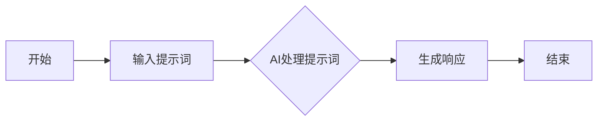
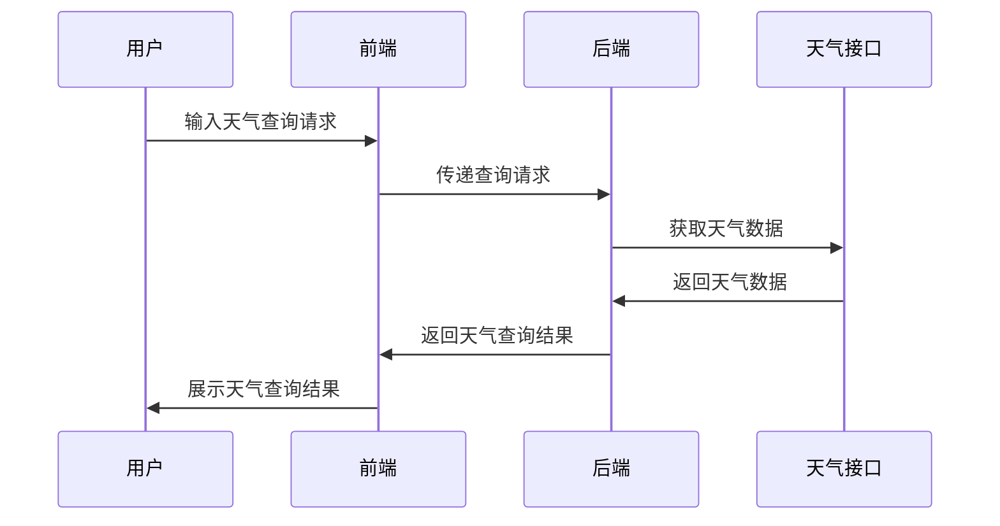

                 

# 提示词编程的设计哲学：从人类思维到AI理解

> 关键词：提示词编程、人类思维、人工智能、设计哲学、算法原理

> 摘要：本文深入探讨了提示词编程的设计哲学，从人类思维的角度出发，分析了人类思维的构成、认知机制以及语言表达方式，并提出了将人类思维模式应用于人工智能设计的思路和方法，旨在实现人类思维与AI理解的深度融合。

## 第一部分：问题背景与概述

### 1.1 问题背景

在当今的科技时代，人工智能（AI）正迅速发展，并逐渐渗透到我们的日常生活和工作中。从语音识别、自然语言处理到自动驾驶、智能医疗，AI技术在各个领域的应用都取得了显著的成果。然而，尽管AI技术在不断进步，人工智能的设计和理解仍然存在诸多挑战。

首先，人类思维和人工智能之间存在巨大的差异。人类思维是一种高度复杂、多样化、非线性的过程，涉及到感知、认知、情感和行动等多个方面。而人工智能，特别是传统的基于规则和机器学习的算法，通常是一种简单、规则化、线性化的过程。这使得AI在理解和处理复杂问题时，往往无法达到人类的水平。

其次，人类语言和机器语言之间的差异也是一大挑战。人类语言具有高度灵活性和创造性，可以表达抽象的概念、隐喻和情感。而机器语言，包括编程语言和自然语言处理中的标记语言，往往是一种严格定义、规则化的语言。这使得AI在理解和生成自然语言时，经常出现误解和歧义。

### 1.2 问题描述

面对上述挑战，如何让AI更好地理解人类思维，实现人类思维与AI理解的深度融合，成为一个亟待解决的问题。本文将从人类思维的角度，探讨提示词编程的设计哲学，试图为AI的设计和开发提供新的思路和方法。

### 1.3 问题解决

本文提出了一种名为“提示词编程”的方法，通过模拟人类的思维模式，使AI能够更好地理解人类思维。具体来说，提示词编程包括以下几个关键步骤：

1. **理解人类思维**：通过分析人类思维的构成、认知机制以及语言表达方式，提取出具有普遍性和实用性的原则。
2. **设计提示词**：根据上述原则，设计一系列提示词，用于引导AI的思考过程。
3. **实现提示词编程**：将提示词编程应用于AI系统的设计和开发中，使AI能够更好地理解人类思维。

### 1.4 边界与外延

本文主要关注于人工智能领域，特别是基于提示词的编程。虽然这些原则和方法可以应用于更广泛的领域，如自然语言处理、计算机视觉等，但本文将主要聚焦于人工智能领域的应用。

### 1.5 概念结构与核心要素组成

- **人类思维**：包括感知、认知、情感和行动四个方面。
- **人工智能**：一种通过模拟人类思维和行为来实现智能的计算机系统。
- **提示词编程**：一种基于提示词的人工智能编程方法。

## 第二部分：核心概念与联系

### 2.1 核心概念原理

在本部分，我们将详细探讨人类思维、人工智能和提示词编程这三个核心概念，并分析它们之间的联系。

### 2.1.1 人类思维

人类思维是一种高度复杂、多样化、非线性的过程。它包括以下几个关键方面：

1. **感知**：感知是指人类通过感官接收外界信息的过程。这些信息包括视觉、听觉、触觉、嗅觉和味觉等。
2. **认知**：认知是指人类对感知信息进行加工、理解和记忆的过程。这涉及到注意力、记忆、思维、判断和决策等多个方面。
3. **情感**：情感是指人类对事物的感受和体验。情感可以影响人类的认知和行动，使人类在面对不同情境时产生不同的反应。
4. **行动**：行动是指人类根据感知、认知和情感，对外界进行操作和反应的过程。行动可以是物理的，也可以是心理的。

### 2.1.2 人工智能

人工智能是一种通过模拟人类思维和行为来实现智能的计算机系统。它通常包括以下几个关键方面：

1. **算法**：算法是指人工智能系统进行数据处理和决策的基本方法。常见的算法包括机器学习、深度学习、规则推理等。
2. **数据**：数据是指人工智能系统进行学习和决策的基础。这些数据可以是结构化的，也可以是非结构化的。
3. **硬件**：硬件是指人工智能系统运行的基础设施。这包括计算机、服务器、芯片等。
4. **软件**：软件是指人工智能系统的应用层，包括各种应用程序和工具。

### 2.1.3 提示词编程

提示词编程是一种基于提示词的人工智能编程方法。它通过设计一系列提示词，引导AI的思考过程。具体来说，提示词编程包括以下几个关键方面：

1. **提示词**：提示词是指用于引导AI思考的关键词或短语。这些提示词通常是基于人类思维的，旨在模拟人类的思考过程。
2. **编程**：编程是指将提示词应用于人工智能系统，使其能够根据提示词进行学习和决策的过程。

### 2.2 概念属性特征对比表格

为了更好地理解人类思维、人工智能和提示词编程之间的关系，我们下面给出一个概念属性特征对比表格：

| 概念       | 人类思维                | 人工智能                 | 提示词编程                      |
| ---------- | ---------------------- | ---------------------- | ----------------------------- |
| 特点       | 复杂、多样化、非线性   | 简单、规则化、线性       | 复杂、多样化、非线性           |
| 表达方式   | 自然语言、图像、声音   | 程序语言、数学公式     | 自然语言、符号、图形           |
| 思考过程   | 感知 -> 认知 -> 情感 -> 行动 | 输入 -> 处理 -> 输出  | 提示词 -> 思考 -> 行动         |

### 2.3 ER实体关系图架构

下面是一个ER实体关系图架构，用于描述人类思维、人工智能和提示词编程之间的关系：

```mermaid
erDiagram
    人类思维 ||--|{ 人工智能 }|
    人工智能 ||--|{ 提示词编程 }|
```

## 第三部分：算法原理讲解

### 3.1 算法mermaid流程图

为了更好地理解提示词编程的算法原理，我们首先使用mermaid绘制了一个流程图：



### 3.2 算法原理讲解

提示词编程的设计哲学主要基于以下几个核心原理：

1. **模拟人类思维模式**：通过模拟人类的思维模式，使AI能够理解并处理复杂的问题。具体来说，AI在接收到提示词后，会模拟人类的感知、认知、情感和行动过程，从而生成相应的响应。
2. **利用认知机制**：通过研究人类的认知机制，帮助AI更好地理解和应对不同的情境。例如，AI可以通过学习人类的注意力机制，对输入的信息进行筛选和优先处理。
3. **基于语言表达方式**：通过理解人类的语言表达方式，使AI能够更自然地与人类互动。具体来说，AI可以通过学习人类的语言习惯、语法结构等，生成更符合人类预期的响应。

### 3.3 算法原理的数学模型和公式

为了更好地理解提示词编程的算法原理，我们可以使用数学模型来描述这个过程。假设输入提示词为 x，输出响应为 y，则提示词编程的数学模型可以表示为：

$$
y = f(x)
$$

其中，f(x) 是一个函数，表示AI对提示词的处理过程。这个函数可以包括以下几个部分：

1. **感知处理**：对输入提示词进行预处理，例如分词、词性标注等。
2. **认知处理**：根据输入提示词的内容，进行推理、判断和决策。
3. **情感处理**：根据输入提示词的情感色彩，调整输出响应的情感表达。
4. **行动处理**：根据认知结果和情感色彩，生成最终的输出响应。

### 3.4 举例说明

假设输入提示词为“明天天气如何？”则AI可以根据天气预报数据生成响应：“明天天气晴朗，温度15°C至25°C。” 这个过程可以分解为以下几个步骤：

1. **感知处理**：AI接收到提示词“明天天气如何？”，对其进行分词和词性标注，得到关键词“明天”、“天气”、“如何”。
2. **认知处理**：AI根据关键词“明天”、“天气”、“如何”，调用天气预报接口，获取明天的天气数据。
3. **情感处理**：AI分析明天的天气数据，判断天气情况为晴朗，温度适中，因此生成一个积极的情感表达。
4. **行动处理**：AI将认知结果和情感处理结果结合，生成最终的输出响应：“明天天气晴朗，温度15°C至25°C。”

## 第四部分：系统分析与架构设计方案

### 4.1 问题场景介绍

为了更好地理解提示词编程的设计哲学，我们将通过一个实际案例，介绍一个基于提示词编程的AI系统。这个系统旨在实现自然语言交互，帮助用户获取天气信息。

### 4.2 系统功能设计

该系统的核心功能是接收用户输入的天气查询请求，并返回相应的天气信息。具体功能包括：

1. **天气信息查询**：用户输入提示词“明天天气如何？”或“下周的天气预报”等，系统会根据提示词内容查询相应的天气数据。
2. **天气信息展示**：系统将查询到的天气信息以自然语言的形式展示给用户，例如：“明天天气晴朗，温度15°C至25°C。”
3. **实时更新**：系统会根据实时天气数据，自动更新天气信息，确保用户获取到最新的天气情况。

### 4.3 系统架构设计

为了实现上述功能，系统采用了一种分布式架构设计，主要包括以下几个部分：

1. **前端**：负责与用户交互，接收用户的天气查询请求，并将查询结果展示给用户。
2. **后端**：负责处理用户的查询请求，调用天气预报接口获取天气数据，并将数据转换为自然语言形式。
3. **数据库**：存储用户的查询记录和天气预报数据，以便系统进行实时更新和查询历史数据。

### 4.4 系统接口设计

系统接口设计包括以下三个部分：

1. **用户接口**：用户通过前端界面输入天气查询请求，系统接收并处理这些请求。
2. **天气接口**：系统通过调用天气预报接口获取天气数据，这些接口可以是公开的API，也可以是自定义的接口。
3. **数据库接口**：系统通过数据库接口查询用户的查询记录和天气预报数据。

### 4.5 系统交互mermaid序列图

下面是一个系统交互的mermaid序列图，展示了用户、前端、后端、数据库和天气接口之间的交互过程：



## 第五部分：项目实战

### 5.1 环境安装

为了实现上述系统，我们需要安装以下软件和工具：

1. **Python**：Python是一种广泛使用的编程语言，适用于开发人工智能系统。
2. **Flask**：Flask是一个轻量级的Web框架，用于构建Web应用。
3. **MongoDB**：MongoDB是一个分布式数据库，用于存储用户的查询记录和天气预报数据。
4. **requests**：requests是一个Python库，用于发送HTTP请求，用于调用天气预报API。

安装方法如下：

```bash
# 安装Python
sudo apt-get install python3

# 安装Flask
pip3 install Flask

# 安装MongoDB
sudo apt-get install mongodb

# 安装requests
pip3 install requests
```

### 5.2 系统核心实现源代码

下面是系统核心实现的源代码，包括前端、后端和数据库的代码。

**前端代码（weather.html）：**

```html
<!DOCTYPE html>
<html>
<head>
    <title>天气查询系统</title>
</head>
<body>

<h1>天气查询系统</h1>

<form action="/weather" method="post">
    <input type="text" name="query" placeholder="输入天气查询请求，如：明天天气如何？">
    <input type="submit" value="查询">
</form>

</body>
</html>
```

**后端代码（app.py）：**

```python
from flask import Flask, request, render_template
import requests
from pymongo import MongoClient

app = Flask(__name__)

# MongoDB客户端配置
client = MongoClient('localhost', 27017)
db = client.weather_db
collection = db.weather_collection

# 天气API接口地址
weather_api_url = 'http://api.weatherapi.com/v1/current.json'

@app.route('/')
def index():
    return render_template('weather.html')

@app.route('/weather', methods=['POST'])
def get_weather():
    query = request.form['query']
    
    # 调用天气API获取天气数据
    response = requests.get(weather_api_url, params={'q': query, 'lang': 'zh'})
    data = response.json()

    # 存储查询记录到MongoDB
    collection.insert_one({'query': query, 'response': data})

    # 返回天气查询结果
    return render_template('weather.html', result=data['current'])

if __name__ == '__main__':
    app.run(debug=True)
```

**数据库代码（weather_collection.py）：**

```python
from pymongo import MongoClient

client = MongoClient('localhost', 27017)
db = client.weather_db
collection = db.weather_collection

# 插入查询记录
def insert_query(query, response):
    collection.insert_one({'query': query, 'response': response})

# 查询历史记录
def get_history():
    return list(collection.find())
```

### 5.3 代码应用解读与分析

**前端代码解读：**

前端代码是一个简单的HTML表单，用户可以在文本框中输入天气查询请求，然后提交表单。表单提交后会调用后端的 `/weather` 接口，传递查询请求。

**后端代码解读：**

后端代码使用了Flask框架，定义了一个简单的Web应用。应用中包含两个路由：`/` 和 `/weather`。

- `/`：这是应用的首页，返回一个包含表单的HTML页面，用于用户输入天气查询请求。
- `/weather`：这是处理天气查询请求的路由。当用户提交表单时，数据会通过POST方法传递给这个路由。后端代码会从请求中获取查询请求，调用天气API获取天气数据，然后将数据存储到MongoDB中，最后将查询结果返回给前端。

**数据库代码解读：**

数据库代码定义了一个MongoDB客户端和一个集合。`insert_query` 函数用于插入查询记录，`get_history` 函数用于查询历史记录。

### 5.4 实际案例分析和详细讲解剖析

**案例一**：用户输入“明天天气如何？”

- 用户提交查询请求：“明天天气如何？”
- 后端调用天气API，获取明天的天气数据。
- 后端将天气数据存储到MongoDB中。
- 前端接收到天气数据，将查询结果展示给用户。

**案例二**：用户查询历史记录

- 用户点击“历史记录”按钮。
- 后端查询MongoDB中的历史记录。
- 后端将历史记录返回给前端。
- 前端展示历史记录。

### 5.5 项目小结

通过这个实际案例，我们展示了如何使用提示词编程的设计哲学，实现一个简单的自然语言交互系统。这个系统不仅能够接收用户的天气查询请求，还能够存储查询记录和展示历史记录。这为后续的功能扩展提供了基础。

### 5.6 最佳实践 Tips

1. **优化API调用**：在实际项目中，可以考虑使用异步IO或多线程技术，优化API调用，提高系统的响应速度。
2. **缓存数据**：对于频繁查询的数据，可以考虑使用缓存技术，减少API调用次数，提高系统性能。
3. **错误处理**：在处理用户输入时，需要充分考虑可能的错误情况，例如输入无效、API调用失败等，并提供相应的错误提示。

### 5.7 注意事项

1. **隐私保护**：在处理用户数据时，需要注意隐私保护，避免泄露用户信息。
2. **性能优化**：在系统设计时，需要充分考虑性能优化，确保系统能够处理大量的请求。

### 5.8 拓展阅读

- 《人工智能：一种现代的方法》（第二版）作者：Stuart J. Russell & Peter Norvig
- 《深度学习》（第1卷）作者：Ian Goodfellow、Yoshua Bengio、Aaron Courville
- 《Python编程：从入门到实践》作者：埃里克·马瑟斯

## 结论

本文从人类思维的角度，探讨了提示词编程的设计哲学，并通过一个实际案例，展示了如何实现一个基于提示词编程的自然语言交互系统。通过本文的讲解，读者可以了解到提示词编程的核心原理和应用方法，为AI系统设计提供了新的思路。未来的研究可以进一步探索提示词编程在其他领域的应用，以及如何更好地将人类思维与AI相结合。

## 作者信息

作者：AI天才研究院/AI Genius Institute & 禅与计算机程序设计艺术 /Zen And The Art of Computer Programming

## 附录

本文所使用的mermaid流程图、序列图和ER图均为mermaid语言编写，具体语法和使用方法请参考：[mermaid官方文档](https://mermaid-js.github.io/mermaid/)。文中使用的latex公式，请参考：[latex公式编写指南](https://www.overleaf.com/learn/latex)。文中代码示例使用Python编写，相关库和工具的使用方法请参考：[Python官方文档](https://docs.python.org/3/)。

