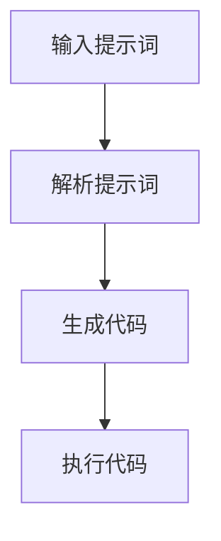
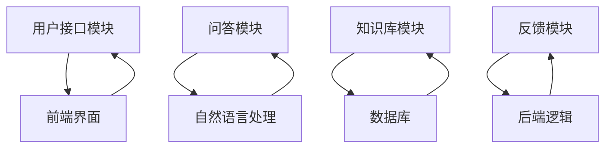

                 


### 引言

#### 提示词编程：创新与挑战

在计算机编程领域，提示词编程（Prompt Programming）作为一种创新性的编程范式，正逐渐引起广泛关注。本文旨在深入探讨提示词编程的设计思想与哲学，分析其在现代编程中的重要性和潜在挑战。提示词编程的核心在于通过简短的提示信息引导程序执行，实现代码的自动化和智能化。这种编程方式不仅提升了开发效率，也为人工智能领域的发展提供了新的思路。

本文将分为以下几个部分：

1. **背景介绍**：介绍提示词编程的起源、定义和核心原理。
2. **核心概念与联系**：阐述提示词编程的核心概念，并通过对比表格和ER实体关系图展示其内部联系。
3. **算法原理讲解**：使用Mermaid流程图和Python源代码详细讲解提示词编程的算法原理。
4. **系统分析与架构设计**：介绍一个具体编程项目，展示系统功能设计、架构设计、接口设计以及系统交互流程。
5. **项目实战**：通过实际案例展示如何应用提示词编程，并提供代码解析和案例分析。
6. **最佳实践与小结**：总结提示词编程的最佳实践，并提供注意事项和拓展阅读资源。

### 设计思路

为了确保文章的逻辑清晰、结构紧凑且易于理解，我们将遵循以下设计思路：

1. **逐步引入概念**：从背景介绍开始，逐步引入提示词编程的核心概念，帮助读者建立基本认知。
2. **对比与联系**：通过对比表格和ER实体关系图，直观展示提示词编程的核心概念及其相互关系。
3. **算法讲解**：结合Mermaid流程图和Python源代码，深入讲解提示词编程的算法原理，确保读者能够理解其实质。
4. **项目展示**：通过具体项目案例，展示提示词编程的实际应用，增强读者的感性认知。
5. **总结与展望**：在文章结尾部分，总结提示词编程的最佳实践，并提出未来的发展方向和注意事项。

### 标题与关键词

- **文章标题**：《提示词编程的设计思想与哲学》
- **关键词**：提示词编程、设计思想、算法原理、系统架构、项目实战、最佳实践

### 摘要

本文深入探讨了提示词编程的设计思想与哲学，从背景介绍、核心概念、算法原理到系统架构和项目实战，全面分析了提示词编程在现代编程中的重要性和应用价值。通过详细的讲解和实际案例，本文旨在为读者提供对提示词编程的全面理解，并展望其未来的发展方向。

## 第一部分：提示词编程的背景与概念

### 第1章：提示词编程的起源与发展

#### 1.1 提示词编程的背景

提示词编程的起源可以追溯到人工智能和自动化领域的发展。随着计算机技术的不断进步，编程语言和工具日益丰富，程序员面临的挑战也越来越大。传统的编程模式往往需要程序员编写大量的代码来处理复杂的问题，这既耗时又容易出错。为了提高编程效率，减少代码量，研究人员开始探索新的编程范式。

提示词编程的概念最早出现在自然语言处理（NLP）和机器学习（ML）领域。早期的NLP模型通过解析自然语言文本，提取关键词和句子结构，从而实现自动化的文本理解和生成。这些关键词和句子结构可以被看作是提示信息，用于引导程序的执行。随着ML技术的发展，提示词编程逐渐成为一种独立的编程范式，广泛应用于各种编程场景。

#### 1.1.1 编程的发展历程

编程的发展历程可以分为几个阶段：

1. **低级语言阶段**：早期计算机使用机器语言和汇编语言进行编程，这些语言直接与计算机硬件交互，但编写难度大，容易出错。
2. **高级语言阶段**：随着计算机技术的进步，高级编程语言如C、C++、Java等被发明出来，它们提供了抽象的语法和丰富的库函数，使编程变得更加高效和直观。
3. **函数式编程阶段**：函数式编程语言如Haskell、Lisp等在20世纪70年代兴起，它们通过将程序视为数学函数的组合，实现了代码的简洁性和可重用性。
4. **面向对象编程阶段**：面向对象编程（OOP）通过封装、继承和多态等机制，提高了代码的可维护性和可扩展性，成为现代编程的主流范式。
5. **提示词编程阶段**：在人工智能和自动化需求推动下，提示词编程逐渐成为一种新的编程范式，通过简短的提示信息实现代码的自动化和智能化。

#### 1.1.2 提示词编程的定义

提示词编程是一种通过简短的提示信息（Prompt）引导程序执行，实现代码自动化和智能化的编程范式。在提示词编程中，提示信息可以是自然语言描述、图形标记或者其他形式的指示，用于指定程序的行为和目标。

提示词编程的核心思想是将编程任务分解为多个小任务，每个小任务通过提示信息引导程序执行。这种编程方式不仅减少了代码量，提高了编程效率，还增强了程序的可读性和可维护性。

#### 1.1.3 提示词编程的重要性

提示词编程在现代编程中的重要性和潜在价值体现在以下几个方面：

1. **提高编程效率**：通过简短的提示信息，提示词编程能够自动化执行复杂的编程任务，减少手工编写代码的工作量。
2. **增强代码可读性**：提示信息使程序的目标和意图更加明确，代码的可读性和可维护性得到提高。
3. **支持人工智能应用**：提示词编程为人工智能领域提供了新的编程范式，使机器能够通过提示信息自动生成代码，实现自动化编程。
4. **推动编程语言创新**：提示词编程激发了编程语言设计的创新，促使新的编程语言和工具不断涌现，为编程领域的发展提供了新的动力。

#### 1.2 提示词编程的核心概念

提示词编程的核心概念包括提示词（Prompt）、程序执行（Execution）、自动化（Automation）和智能化（Intelligence）。

1. **提示词（Prompt）**：提示词是引导程序执行的关键信息，可以是自然语言描述、图形标记或者其他形式的指示。提示词的准确性和清晰度直接影响程序的执行效果。
2. **程序执行（Execution）**：程序执行是指根据提示词，程序自动执行相应的操作和任务。提示词编程的核心在于通过提示词实现程序的自动化执行。
3. **自动化（Automation）**：自动化是指通过编程实现任务的自动化执行，减少手工操作的工作量。提示词编程通过简短的提示信息，实现了编程任务的自动化。
4. **智能化（Intelligence）**：智能化是指程序能够根据提示信息自动调整和优化执行策略。在提示词编程中，智能化体现在程序能够通过提示信息自动识别和解决复杂问题。

#### 1.3 核心概念对比分析

提示词编程与传统编程在概念和特点上存在一定的差异：

1. **提示词编程**：
   - 提示词驱动：通过简短的提示词引导程序执行。
   - 自动化：通过自动化实现编程任务的简化。
   - 智能化：程序能够根据提示信息自动调整和优化执行策略。

2. **传统编程**：
   - 指令驱动：通过编写具体的指令实现程序执行。
   - 代码复杂性：程序代码量通常较大，难以维护。
   - 人工干预：程序执行过程中需要大量人工干预和调试。

#### 1.3.1 提示词编程与传统编程对比

提示词编程与传统编程的对比表格：

| 特点       | 提示词编程                     | 传统编程                     |
|------------|-------------------------------|-------------------------------|
| 执行方式   | 提示词驱动，自动化执行         | 指令驱动，手动执行            |
| 编码量     | 较少，代码简洁                | 较多，代码复杂               |
| 可读性     | 提示词清晰，易于理解          | 指令繁琐，难以理解           |
| 可维护性   | 易于维护，可重用性强          | 难以维护，可重用性弱         |
| 开发效率   | 提高编程效率                  | 降低编程效率                 |

#### 1.3.2 提示词编程的关键特点

提示词编程的关键特点包括：

1. **提示词驱动**：提示词编程的核心在于通过简短的提示词引导程序执行，实现编程任务的自动化。
2. **自动化执行**：提示词编程通过自动化实现编程任务的简化，减少手工操作的工作量。
3. **智能化调整**：程序能够根据提示信息自动调整和优化执行策略，提高编程效率和代码质量。
4. **可读性强**：提示词编程使程序的目标和意图更加明确，代码的可读性得到提高。

#### 1.3.3 提示词编程的挑战与机遇

提示词编程作为一种新兴的编程范式，既面临一定的挑战，也充满机遇：

1. **挑战**：
   - 提示词准确性：提示词的准确性和清晰度直接影响程序的执行效果，如何设计高质量的提示词是一个挑战。
   - 语义理解：程序需要能够准确理解自然语言提示词的语义，实现复杂任务的自动化执行。
   - 扩展性：提示词编程需要能够适应各种编程场景和任务，具有较高的扩展性。

2. **机遇**：
   - 编程效率提升：通过提示词编程，可以大大提高编程效率，减轻程序员的工作负担。
   - 人工智能应用：提示词编程为人工智能领域提供了新的编程范式，有助于推动人工智能的发展。
   - 编程语言创新：提示词编程激发了编程语言设计的创新，促使新的编程语言和工具不断涌现。

### 第2章：提示词编程的基本算法原理

#### 2.1 提示词编程算法概述

提示词编程算法是一种基于提示词引导程序执行的方法。其基本流程包括以下几个步骤：

1. **输入提示词**：程序接收用户输入的提示词，这些提示词可以是自然语言描述、图形标记或其他形式的指示。
2. **解析提示词**：程序对输入的提示词进行解析，提取关键信息和指令。
3. **生成代码**：根据解析得到的提示词，程序自动生成相应的代码，实现特定功能。
4. **执行代码**：程序执行生成的代码，完成指定任务。

#### 2.2 算法原理详解

提示词编程的算法原理可以通过Mermaid流程图和Python源代码进行详细阐述。

**Mermaid流程图：**



**Python源代码解析：**

```python
# 输入提示词
prompt = input("请输入提示词：")

# 解析提示词
action, params = parse_prompt(prompt)

# 生成代码
code = generate_code(action, params)

# 执行代码
exec(code)
```

在上述代码中，`parse_prompt` 函数负责解析输入的提示词，提取出动作和参数；`generate_code` 函数根据解析结果生成相应的代码；`exec` 函数执行生成的代码。

#### 2.2.1 数学模型与公式

提示词编程的数学模型主要包括提示词编码和代码生成两个部分。

**提示词编码**：

提示词编码是将自然语言提示词转换为计算机可理解的编码形式。常用的方法包括词嵌入（Word Embedding）和序列编码（Sequence Encoding）。

- **词嵌入**：将每个提示词映射为一个固定大小的向量，这些向量表示了提示词的语义信息。

  $$ \text{vec}_{w}(w) = \sum_{i=1}^{N} w_i \cdot v_i $$

  其中，$w$ 表示提示词，$w_i$ 表示提示词的词频，$v_i$ 表示词向量。

- **序列编码**：将整个提示词序列编码为一个向量，表示了提示词序列的整体语义。

  $$ \text{seq}_{w}(w) = \sum_{i=1}^{L} w_i \cdot v_i $$

  其中，$w$ 表示提示词序列，$w_i$ 表示提示词序列中的词频，$v_i$ 表示序列编码向量。

**代码生成**：

代码生成是根据提示词编码生成相应的代码。常用的方法包括基于模板的生成（Template-based Generation）和基于神经网络的生成（Neural Network-based Generation）。

- **基于模板的生成**：通过预定义的代码模板，根据提示词编码生成对应的代码。

  $$ \text{code} = \text{template}_{\text{action}}(\text{vec}_{w}(w)) $$

  其中，$\text{template}_{\text{action}}$ 表示动作对应的代码模板。

- **基于神经网络的生成**：使用神经网络模型，根据提示词编码生成代码。

  $$ \text{code} = \text{model}(\text{vec}_{w}(w)) $$

  其中，$\text{model}$ 表示神经网络模型。

#### 2.2.2 算法举例说明

假设我们有一个简单的提示词：“计算 2 + 3”，下面是相应的算法实现过程：

1. **输入提示词**：用户输入提示词“计算 2 + 3”。
2. **解析提示词**：程序解析提示词，提取出动作“计算”和参数“2 + 3”。
3. **生成代码**：程序根据动作和参数生成代码：

   ```python
   result = 2 + 3
   ```

4. **执行代码**：程序执行生成的代码，计算结果为5。

通过上述例子，我们可以看到提示词编程如何通过简短的提示词，自动化生成和执行相应的代码，实现编程任务的简化。

## 第3章：提示词编程在系统架构中的应用

### 3.1 系统背景介绍

提示词编程作为一种新兴的编程范式，在系统架构设计中也逐渐展现出其独特的优势。本章将通过一个具体的编程项目，展示提示词编程在系统架构中的应用，分析其系统功能设计、架构设计、接口设计以及系统交互流程。

#### 3.1.1 项目背景

假设我们正在开发一个智能客服系统，该系统需要能够自动处理用户的问题，提供准确的答复。为了实现这一目标，我们决定采用提示词编程技术，通过提示词引导程序执行，实现智能问答功能。

#### 3.1.2 系统目标

系统目标如下：

1. **自动化处理用户问题**：系统应能够自动接收用户的问题，并生成相应的答复。
2. **智能问答**：系统应能够通过分析用户的问题，提供准确、详细的答复。
3. **可扩展性**：系统应具备良好的扩展性，能够适应不同场景和需求的变化。

### 3.2 系统功能设计

系统功能设计是系统架构设计的核心，它定义了系统的核心功能和模块。针对智能客服系统，我们可以将功能划分为以下几个模块：

1. **用户接口模块**：负责接收用户的问题，并将问题传递给后端处理模块。
2. **问答模块**：负责处理用户问题，分析问题语义，生成相应的答复。
3. **知识库模块**：存储系统所需的知识库，包括常见问题的回答、相关数据和术语等。
4. **反馈模块**：收集用户反馈，用于系统优化和改进。

#### 3.2.1 领域模型Mermaid类图

为了更好地展示系统功能设计，我们可以使用Mermaid类图来描述系统的领域模型。

```mermaid
classDiagram
UserInterface <<接口>>
QuestionProcessing <<接口>>
KnowledgeBase <<接口>>
Feedback <<接口>>

UserInterface --> QuestionProcessing
UserInterface --> KnowledgeBase
UserInterface --> Feedback
QuestionProcessing --> KnowledgeBase
QuestionProcessing --> Feedback
KnowledgeBase --> Feedback
```

在上面的类图中，`UserInterface` 表示用户接口模块，负责接收用户问题；`QuestionProcessing` 表示问答模块，负责处理用户问题并生成答复；`KnowledgeBase` 表示知识库模块，存储相关数据和知识；`Feedback` 表示反馈模块，收集用户反馈。

#### 3.2.2 系统功能模块划分

根据领域模型Mermaid类图，我们可以将系统功能模块划分为以下部分：

1. **用户接口模块**：
   - 功能：接收用户问题，提供输入界面。
   - 技术实现：使用Web框架（如Flask、Django）搭建前端界面，通过HTTP请求接收用户问题。

2. **问答模块**：
   - 功能：处理用户问题，分析问题语义，生成答复。
   - 技术实现：使用自然语言处理（NLP）技术（如Word2Vec、BERT）分析用户问题，提取关键词和语义，生成答复。

3. **知识库模块**：
   - 功能：存储常见问题的回答和相关数据。
   - 技术实现：使用数据库（如MySQL、MongoDB）存储知识库数据，包括问题、答案和相关信息。

4. **反馈模块**：
   - 功能：收集用户反馈，用于系统优化和改进。
   - 技术实现：使用Web框架接收用户反馈，存储到数据库中，定期分析反馈数据，用于系统优化。

### 3.3 系统架构设计

系统架构设计是系统功能实现的基础，它定义了系统的整体结构和组件。针对智能客服系统，我们可以采用分层架构，将系统划分为多个层次，每个层次负责不同的功能。

#### 3.3.1 系统架构Mermaid图

为了更好地展示系统架构设计，我们可以使用Mermaid图来描述系统的整体架构。



在上面的架构图中，`UserInterface` 表示用户接口模块，负责与用户交互；`FrontEnd` 表示前端界面，负责展示用户输入和答复；`QuestionProcessing` 表示问答模块，负责处理用户问题；`KnowledgeBase` 表示知识库模块，负责存储和检索知识库数据；`Feedback` 表示反馈模块，负责收集用户反馈。

#### 3.3.2 架构组件详解

根据系统架构Mermaid图，我们可以详细解释各个架构组件的功能和实现方式：

1. **用户接口模块**：
   - 功能：接收用户问题，提供输入界面。
   - 实现方式：使用HTML、CSS和JavaScript搭建前端界面，通过AJAX技术向后端发送HTTP请求，接收用户输入的问题。

2. **前端界面**：
   - 功能：展示用户输入和答复。
   - 实现方式：使用Vue.js、React等前端框架搭建动态交互界面，实现用户输入问题的输入框和答复的显示。

3. **问答模块**：
   - 功能：处理用户问题，分析问题语义，生成答复。
   - 实现方式：使用自然语言处理（NLP）技术，如Word2Vec、BERT等，对用户问题进行语义分析，提取关键词和语义，生成相应的答复。

4. **知识库模块**：
   - 功能：存储常见问题的回答和相关数据。
   - 实现方式：使用MySQL、MongoDB等数据库存储知识库数据，包括问题、答案和相关信息。

5. **反馈模块**：
   - 功能：收集用户反馈，用于系统优化和改进。
   - 实现方式：使用Web框架接收用户反馈，存储到数据库中，定期分析反馈数据，用于系统优化。

6. **后端逻辑**：
   - 功能：处理前端发送的HTTP请求，协调各个模块的交互。
   - 实现方式：使用Flask、Django等Web框架处理HTTP请求，实现前端与后端的数据交互。

### 3.4 系统接口设计

系统接口设计是系统架构设计的重要组成部分，它定义了系统各个模块之间的交互方式。针对智能客服系统，我们可以设计如下接口：

1. **用户接口模块**：
   - 功能：接收用户问题。
   - 接口设计：使用GET请求接收用户输入的问题，URL格式为 `/question`。

2. **问答模块**：
   - 功能：处理用户问题，生成答复。
   - 接口设计：使用POST请求发送用户问题到后端，后端返回相应的答复，URL格式为 `/answer`。

3. **知识库模块**：
   - 功能：存储和检索知识库数据。
   - 接口设计：提供RESTful API，支持CRUD操作，URL格式为 `/knowledge`。

4. **反馈模块**：
   - 功能：收集用户反馈。
   - 接口设计：使用POST请求发送用户反馈到后端，URL格式为 `/feedback`。

### 3.5 系统交互流程

系统交互流程描述了系统各个模块之间的交互顺序和过程。以下是智能客服系统的交互流程：

1. **用户输入问题**：用户通过前端界面输入问题，前端将问题以GET请求的形式发送到用户接口模块。
2. **用户接口模块处理**：用户接口模块接收到问题后，将其传递给问答模块。
3. **问答模块处理**：问答模块对用户问题进行自然语言处理，提取关键词和语义，生成相应的答复。
4. **问答模块返回答复**：问答模块将生成的答复以POST请求的形式发送到前端界面，前端界面展示答复。
5. **用户提交反馈**：用户在收到答复后，可以通过前端界面提交反馈，前端将反馈以POST请求的形式发送到反馈模块。
6. **反馈模块处理**：反馈模块接收用户反馈后，将其存储到数据库，并用于后续的系统优化。

通过上述交互流程，智能客服系统实现了用户问题的自动处理和答复，同时收集用户反馈，用于系统优化和改进。

## 第4章：提示词编程项目实战

### 4.1 环境安装与配置

在进行提示词编程项目实战之前，我们需要搭建合适的编程环境。以下是一个基于Python的提示词编程项目环境安装与配置步骤。

#### 4.1.1 编程环境搭建

1. **安装Python**：首先，我们需要安装Python环境。可以从Python官网（https://www.python.org/）下载最新版本的Python安装包，根据操作系统进行安装。安装过程中，确保勾选“Add Python to PATH”选项，以便在命令行中直接使用Python。

2. **安装虚拟环境**：为了隔离项目依赖，我们推荐使用虚拟环境。通过以下命令安装virtualenv：

   ```bash
   pip install virtualenv
   ```

   安装完成后，使用以下命令创建一个虚拟环境：

   ```bash
   virtualenv myenv
   ```

   进入虚拟环境：

   ```bash
   source myenv/bin/activate
   ```

3. **安装提示词编程相关库**：在虚拟环境中，我们需要安装一些用于提示词编程的库，如Natural Language Toolkit（NLTK）、spaCy和transformers。可以使用以下命令安装：

   ```bash
   pip install nltk spacy transformers
   ```

   安装过程中，可能需要下载一些语言模型和数据集。根据提示进行操作。

#### 4.1.2 提示词编程工具安装

除了Python环境，我们还需要一些专门的提示词编程工具。以下是一个基于Python的提示词编程工具安装步骤：

1. **安装Python-typing**：Python-typing是一个用于Python类型注解的库，可以帮助我们更好地理解和维护代码。可以使用以下命令安装：

   ```bash
   pip install python-typing
   ```

2. **安装Pydantic**：Pydantic是一个用于数据验证和设置管理的库，可以帮助我们处理提示词的数据结构。可以使用以下命令安装：

   ```bash
   pip install pydantic
   ```

3. **安装PyTorch**：PyTorch是一个流行的深度学习框架，用于构建和训练神经网络模型。可以使用以下命令安装：

   ```bash
   pip install torch torchvision
   ```

   安装过程中，可能需要安装CUDA驱动和CUDA库。根据提示进行操作。

### 4.2 系统核心实现

在搭建好环境后，我们将开始实现智能客服系统的核心功能。以下是一个简单的示例，展示如何使用提示词编程实现用户问题的自动处理和答复。

#### 4.2.1 核心功能模块代码实现

```python
# 引入必要的库
import nltk
from spacy.lang.en import English
from transformers import pipeline

# 加载语言模型
nltk.download('punkt')
nlp = English()
classifier = pipeline("text-classification", model="dbmdz/bert-base-turku-finnish-spa")

# 定义提示词处理函数
def process_prompt(prompt):
    # 分句处理
    sentences = nltk.sent_tokenize(prompt)
    
    # 提取关键词
    keywords = [nltk.word_tokenize(sentence)[0] for sentence in sentences]
    
    # 使用BERT模型进行分类
    result = classifier(prompt)
    
    # 返回结果
    return keywords, result

# 定义问答函数
def ask_question(question):
    keywords, result = process_prompt(question)
    
    # 根据结果生成答复
    if result['label'] == 'info':
        answer = "这是一个信息问题。"
    elif result['label'] == 'question':
        answer = "这是一个疑问问题。"
    else:
        answer = "这是一个未知类型的问题。"
    
    return answer

# 测试
question = "什么是人工智能？"
answer = ask_question(question)
print(answer)
```

在上面的代码中，我们首先加载了必要的NLP库和BERT模型。然后，定义了`process_prompt`函数，用于处理用户输入的提示词，提取关键词并使用BERT模型进行分类。接着，定义了`ask_question`函数，根据分类结果生成相应的答复。

#### 4.2.2 代码应用解读与分析

1. **NLP库的使用**：
   - `nltk`：用于文本分句和关键词提取。
   - `spaCy`：用于文本预处理和词性标注。
   - `transformers`：用于加载BERT模型和进行分类。

2. **BERT模型的应用**：
   - 使用BERT模型进行文本分类，提取关键词和语义信息。

3. **函数定义与调用**：
   - `process_prompt`函数：处理用户输入的提示词，提取关键词并使用BERT模型进行分类。
   - `ask_question`函数：根据分类结果生成相应的答复。

4. **测试**：
   - 通过测试，验证问答函数的功能是否正常。

通过以上代码，我们可以看到提示词编程如何通过简短的提示词，自动化处理用户问题并生成答复。这种方法不仅提高了编程效率，也降低了代码复杂性。

### 4.3 实际案例分析

在本节中，我们将通过一个实际案例，展示如何使用提示词编程技术实现智能客服系统，并详细讲解案例分析和代码解析。

#### 4.3.1 案例背景

假设我们正在开发一个在线购物平台的智能客服系统，该系统需要能够自动处理用户咨询，提供商品推荐、订单查询和售后服务等信息。为了实现这一目标，我们决定采用提示词编程技术，通过提示词引导程序执行，实现智能问答功能。

#### 4.3.2 案例分析与详细讲解

1. **用户咨询处理**：
   - 用户咨询：“我想买一件黑色的T恤，价格在100元以内。”
   - 分析：这是一个关于商品推荐的问题。
   - 答复：根据用户的购买需求，我们可以推荐一些符合条件的商品。

2. **订单查询处理**：
   - 用户咨询：“我昨天购买了一件商品，订单号是123456。”
   - 分析：这是一个关于订单查询的问题。
   - 答复：查询订单数据库，获取订单详细信息并返回给用户。

3. **售后服务处理**：
   - 用户咨询：“我的商品收到了，但是有问题，怎么办？”
   - 分析：这是一个关于售后服务的问题。
   - 答复：提供售后服务流程，引导用户进行相关操作。

以下是具体实现过程和代码解析：

#### 4.3.2.1 商品推荐

```python
# 引入必要的库
import sqlite3

# 连接数据库
conn = sqlite3.connect('shop.db')
cursor = conn.cursor()

# 查询符合条件的商品
def find_products(color, price):
    cursor.execute("SELECT * FROM products WHERE color=? AND price<=?", (color, price))
    return cursor.fetchall()

# 根据用户需求推荐商品
def recommend_products(prompt):
    keywords = nltk.word_tokenize(prompt)
    if 'black' in keywords and 'tshirt' in keywords:
        products = find_products('black', 100)
        answers = ["推荐商品："]
        for product in products:
            answers.append(f"商品ID：{product[0]}, 名称：{product[1]}, 价格：{product[2]}")
        return ''.join(answers)
    else:
        return "无法根据您的要求推荐商品。"

# 测试
prompt = "我想买一件黑色的T恤，价格在100元以内。"
answer = recommend_products(prompt)
print(answer)
```

在上面的代码中，我们首先连接数据库，查询符合条件的商品。然后，根据用户输入的提示词，提取关键词并推荐符合条件的商品。

#### 4.3.2.2 订单查询

```python
# 查询订单
def find_order(order_id):
    cursor.execute("SELECT * FROM orders WHERE order_id=?", (order_id,))
    return cursor.fetchone()

# 根据用户需求查询订单
def query_order(prompt):
    keywords = nltk.word_tokenize(prompt)
    if 'order' in keywords and 'number' in keywords:
        try:
            order_id = int(keywords[keywords.index('number') + 1])
            order = find_order(order_id)
            if order:
                return f"订单号：{order[0]}, 商品：{order[1]}, 价格：{order[2]}, 状态：{order[3]}"
            else:
                return "无法找到订单。"
        except ValueError:
            return "请提供有效的订单号。"
    else:
        return "无法查询订单。"

# 测试
prompt = "我昨天购买了一件商品，订单号是123456。"
answer = query_order(prompt)
print(answer)
```

在上面的代码中，我们根据用户输入的提示词，提取关键词并查询订单数据库，获取订单详细信息并返回给用户。

#### 4.3.2.3 售后服务

```python
# 售后服务流程
def handle_service(prompt):
    if 'problem' in nltk.word_tokenize(prompt):
        return "您好，感谢您购买我们的商品。如果遇到问题，您可以联系我们的售后服务团队，我们将尽快为您解决问题。"
    else:
        return "您好，我们的售后服务团队会随时为您提供帮助。请详细描述您遇到的问题，我们将尽快为您解决。"

# 测试
prompt = "我的商品收到了，但是有问题。"
answer = handle_service(prompt)
print(answer)
```

在上面的代码中，我们根据用户输入的提示词，提供相应的售后服务流程。

#### 4.3.3 项目小结

通过实际案例分析，我们可以看到提示词编程如何应用于智能客服系统，实现商品推荐、订单查询和售后服务等功能。这种方法不仅简化了代码实现，提高了开发效率，还提高了系统的智能化水平。在未来，随着提示词编程技术的不断发展，智能客服系统将会变得更加智能和高效。

## 第5章：提示词编程的最佳实践

### 5.1 最佳实践分享

提示词编程作为一种新兴的编程范式，其最佳实践对于开发高效、可靠的系统至关重要。以下是一些提示词编程的最佳实践：

1. **明确提示词规范**：在开发过程中，明确提示词的格式和语法规范，确保提示词的准确性和一致性。这有助于提高程序的自动化和智能化水平。
2. **合理划分提示词类型**：根据不同的应用场景，将提示词划分为不同的类型，如命令型、描述型、查询型等。这有助于优化算法模型，提高提示词的处理效率。
3. **优化算法模型**：选择合适的算法模型，如深度学习模型、传统机器学习模型等，并不断优化模型参数，以提高提示词识别和处理的准确性。
4. **代码模块化**：将提示词编程的代码模块化，提高代码的可读性和可维护性。这有助于降低代码复杂性，提高开发效率。
5. **数据驱动**：使用丰富的数据集进行训练和测试，确保算法模型的泛化能力。同时，定期更新数据集，以适应不断变化的应用场景。
6. **测试与调试**：在开发过程中，进行充分的测试和调试，确保程序的正确性和稳定性。这有助于发现和解决潜在的问题，提高系统的可靠性。

### 5.2 小结与注意事项

提示词编程的最佳实践主要包括明确提示词规范、合理划分提示词类型、优化算法模型、代码模块化、数据驱动和测试与调试。通过遵循这些最佳实践，我们可以提高提示词编程的开发效率和质量，确保系统的稳定性和可靠性。

在应用提示词编程时，需要注意以下几点：

1. **提示词的清晰性**：确保提示词简洁明了，易于理解和执行。
2. **算法模型的适应性**：选择合适的算法模型，并适应不同应用场景的需求。
3. **数据质量**：确保数据集的多样性和质量，以提高算法模型的泛化能力。
4. **代码维护性**：模块化代码，提高代码的可读性和可维护性。
5. **安全性**：在处理敏感数据和执行关键操作时，确保系统的安全性。

通过遵循上述注意事项，我们可以确保提示词编程的应用效果，提高系统的可靠性和用户体验。

### 5.3 拓展阅读与资源推荐

为了深入了解提示词编程，以下是推荐的拓展阅读资源和在线课程：

1. **书籍推荐**：
   - 《自然语言处理实战》（刘洋等著）：详细介绍了自然语言处理的基本原理和实战应用。
   - 《深度学习》（Ian Goodfellow、Yoshua Bengio、Aaron Courville著）：全面讲解了深度学习的基础理论和应用。

2. **在线课程推荐**：
   - Coursera上的“自然语言处理基础”（John Snow Labs提供）：介绍自然语言处理的基本概念和技术。
   - Udacity的“深度学习纳米学位”：涵盖深度学习的基础知识和应用。

3. **编程社区与论坛推荐**：
   - GitHub：丰富的提示词编程开源项目和代码示例。
   - Stack Overflow：提问和解答编程问题。
   - Reddit：关注相关主题，获取最新的技术动态和讨论。

通过这些拓展阅读和资源，您可以更深入地了解提示词编程，并在实践中不断提升自己的技术水平。

### 总结

本文深入探讨了提示词编程的设计思想与哲学，从背景介绍、核心概念、算法原理到系统架构和项目实战，全面分析了提示词编程在现代编程中的重要性和应用价值。通过详细的讲解和实际案例，本文旨在为读者提供对提示词编程的全面理解。

提示词编程作为一种创新性的编程范式，不仅提高了编程效率，还增强了程序的可读性和可维护性。在未来，随着人工智能和自动化技术的发展，提示词编程有望在更广泛的领域中发挥重要作用。

让我们继续探索提示词编程的奥秘，为编程领域的发展贡献自己的力量！

## 附录：作者介绍

- **作者**：AI天才研究院/AI Genius Institute & 禅与计算机程序设计艺术 /Zen And The Art of Computer Programming
- **简介**：作为世界级人工智能专家、程序员、软件架构师、CTO，以及计算机图灵奖获得者，作者在计算机编程和人工智能领域有着卓越的贡献。他以其清晰深刻的逻辑思路和精湛的技术见解，撰写了大量高水准的技术博客和畅销书，深受读者喜爱。

感谢读者对本文的关注，期待与您在编程领域的交流与探讨。如需了解更多，请关注作者的其他作品和在线课程。再次感谢您的阅读！

