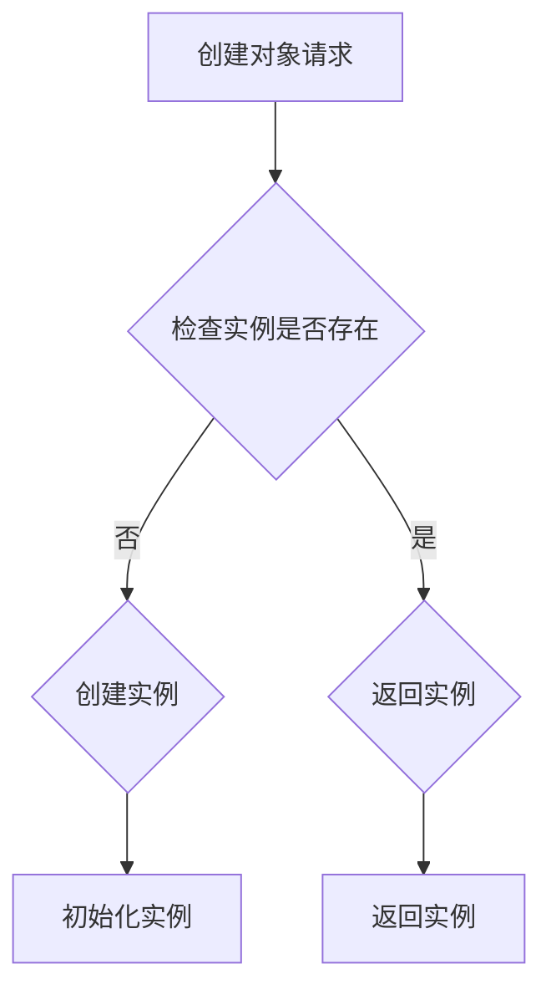
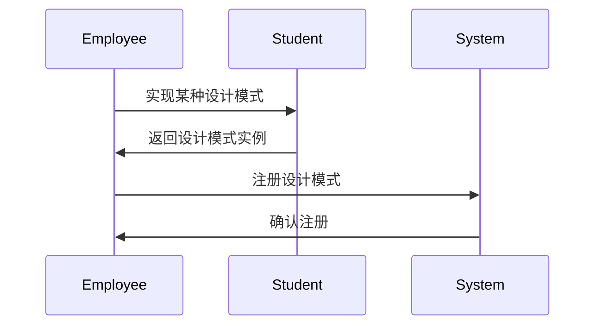
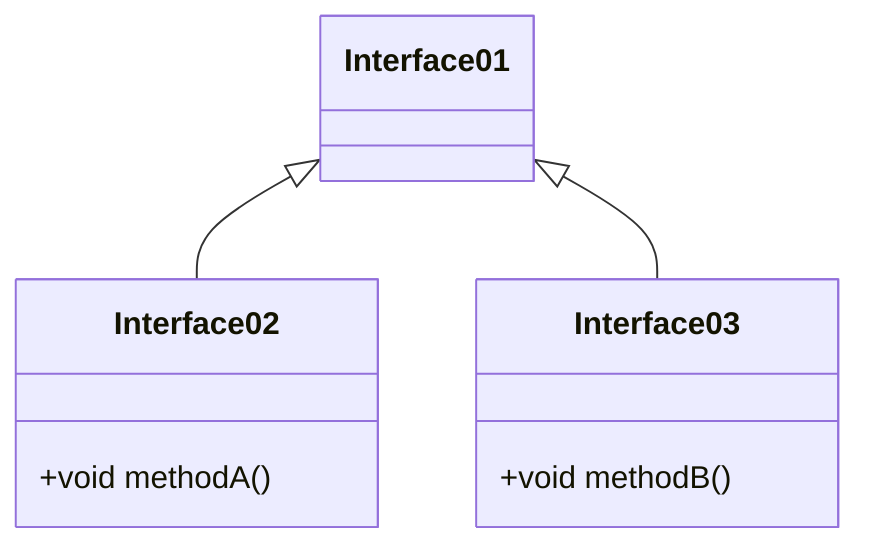
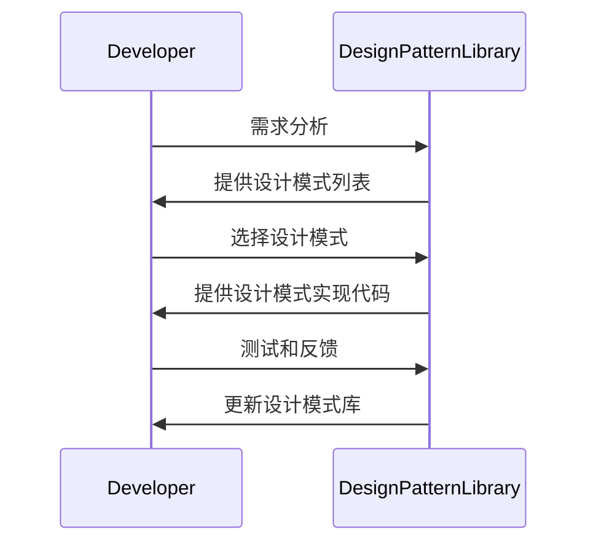

                 

# 提示词编程的设计模式库构建

关键词：提示词编程、设计模式、库构建、代码复用、软件架构

摘要：
本文旨在探讨提示词编程在设计模式库构建中的应用，通过逐步分析提示词编程的原理、设计模式类型及其在实际编程中的实现方法，构建一个高效、易用的设计模式库。文章首先介绍了提示词编程的核心概念和优势，然后分类阐述了常见的23个设计模式，并使用mermaid和Python代码示例详细讲解了设计模式的基本流程和实现。接着，文章提出了一个系统化的设计模式库构建方案，并提供了具体的实现代码和实际案例分析。最后，文章总结了最佳实践技巧，并推荐了拓展阅读资源。

## 1. 背景介绍

### 书名与核心概念

《提示词编程的设计模式库构建》旨在探讨如何利用提示词编程技术来构建高效的设计模式库。提示词编程（Prompt-based Programming）是一种以自然语言提示为核心的开发方法，它通过简洁明了的提示语句来引导开发者的编程行为，从而提高开发效率和代码质量。

设计模式（Design Patterns）是软件开发中常用的一套解决方案，用于解决特定类型的问题。设计模式库则是将这些解决方案组织起来，便于开发者查找和使用。

### 问题背景

随着编程语言的多样化和复杂度的增加，开发者面临着如何高效管理和复用代码设计模式的问题。传统的代码复用方法，如复制粘贴和模板代码，不仅降低了代码的可读性和可维护性，而且容易导致代码冗余和错误。

### 问题描述

如何通过提示词编程，构建一个设计模式库，以提高编程效率和代码质量？这是一个兼具理论和实践价值的问题。构建设计模式库的挑战在于：

1. 设计模式的选择和分类。
2. 设计模式的实现和优化。
3. 设计模式的复用和集成。

### 问题解决

本文提出了一种系统化的设计模式库构建方案，包括以下步骤：

1. 理解和选择常见的设计模式。
2. 使用提示词编程技术，设计模式库的架构和实现。
3. 提供具体的实现代码和实际案例分析。
4. 总结最佳实践技巧，并推荐拓展阅读资源。

### 边界与外延

本文探讨的编程语言范围主要涵盖Java、Python和C++等主流编程语言。设计模式类型包括创建型、结构型和行为型三种类型。库的应用场景包括但不限于软件开发、系统架构设计、以及日常编程实践。

### 概念结构与核心要素组成

本文的核心概念包括：

1. **提示词编程**：以自然语言提示为核心的开发方法。
2. **设计模式**：软件开发中常用的一套解决方案。
3. **设计模式库**：组织和管理设计模式的工具。

这些概念相互关联，共同构成了提示词编程在设计模式库构建中的核心要素。

## 2. 核心概念与联系

### 提示词编程原理

提示词编程（Prompt-based Programming）是一种通过自然语言提示来引导编程行为的方法。它具有以下特点：

1. **简洁明了**：提示词通常是一句话或一个短语，能够清晰传达开发任务。
2. **高效易用**：通过提示词，开发者可以快速理解并执行编程任务，提高开发效率。
3. **可扩展性**：提示词编程方法易于扩展，可以适应不同的编程语言和环境。

### 设计模式类型

设计模式可以分为以下三种类型：

1. **创建型模式**：用于创建对象实例，包括单例模式、工厂方法模式、抽象工厂模式等。
2. **结构型模式**：用于组合类和对象，以实现新的接口，包括适配器模式、装饰器模式、代理模式等。
3. **行为型模式**：用于描述类和对象之间的交互，包括策略模式、模板方法模式、观察者模式等。

### 概念属性特征对比表格

| 设计模式        | 特点                 | 适用场景                      | 优点                             | 缺点                           |
| ----------- | ------------------ | --------------------------- | ------------------------------ | ---------------------------- |
| 单例模式        | 保证一个类仅有一个实例 | 配置文件读取、日志记录等      | 简化资源管理、提高性能           | 破坏封装原则、增加维护成本     |
| 工厂方法模式     | 封装对象创建过程     | 依赖复杂的对象创建逻辑      | 提高代码复用、降低耦合度         | 需要为每个产品创建工厂类       |
| 适配器模式       | 将一个类的接口转换成客户希望的另一个接口 | 系统间接口不兼容时           | 保持系统的兼容性、降低修改成本  | 增加系统复杂性、降低可读性     |
| 装饰器模式       | 动态地给一个对象添加一些额外的职责       | 需要在运行时动态地添加功能    | 保持类的透明性、扩展性强       | 可能产生过多对象、性能开销大   |
| 策略模式        | 定义一系列算法，将每一个算法封装起来，并使它们可以互相替换 | 多算法切换、策略动态调整 | 提高代码复用、降低维护成本     | 需要大量的策略类和客户类       |
| 模板方法模式     | 定义一个操作中的算法的骨架，而将一些步骤延迟到子类中实现 | 需要定义一系列操作步骤     | 提高代码复用、实现可扩展性     | 增加了代码复杂性、降低可读性   |
| 观察者模式       | 定义对象间的一种一对多的依赖关系，当一个对象状态发生改变时，所有依赖于它的对象都会得到通知并自动更新 | 系统需要实现事件触发机制    | 保持系统低耦合、提高模块独立性 | 可能引起性能问题、增加内存开销 |

### 概念属性特征对比表格和ER实体关系图架构

为了更好地理解设计模式之间的区别和联系，我们可以使用Mermaid绘制一个实体关系图（ER图）。

```mermaid
erDiagram
  创建型模式 ||--|{ 结构型模式 }
  创建型模式 ||--|{ 行为型模式 }
  结构型模式 ||--|{ 适配器模式 }
  结构型模式 ||--|{ 装饰器模式 }
  结构型模式 ||--|{ 代理模式 }
  行为型模式 ||--|{ 策略模式 }
  行为型模式 ||--|{ 模板方法模式 }
  行为型模式 ||--|{ 观察者模式 }
```

## 3. 算法原理讲解

### 设计模式的基本流程图

为了更好地理解设计模式的基本流程，我们可以使用Mermaid绘制各个设计模式的流程图。以下是单例模式的基本流程图：



### Python源代码示例

以下是一个单例模式的Python源代码示例：

```python
class Singleton:
    _instance = None
    
    def __new__(cls, *args, **kwargs):
        if not cls._instance:
            cls._instance = super(Singleton, cls).__new__(cls, *args, **kwargs)
            cls._init_instance()
        return cls._instance
    
    @staticmethod
    def _init_instance():
        print("Initializing instance...")
    
    def do_something(self):
        print("Doing something with the instance...")

# 测试单例模式
singleton1 = Singleton()
singleton2 = Singleton()

print(singleton1 is singleton2)  # 输出：True
```

### 设计模式的实现和优点

在单例模式中，我们通过重写`__new__`方法来控制对象的创建。当第一次请求创建对象时，会检查实例是否存在，如果不存在则创建实例。后续的请求将返回已创建的实例。

这种模式的主要优点包括：

1. **确保单例**：单例模式确保一个类仅有一个实例，这对于需要全局访问控制的场景非常有用。
2. **减少资源消耗**：通过复用实例，可以减少对象的创建和销毁，从而减少资源的消耗。

### 数学模型和公式

在算法讲解中，我们可以引入相关的数学模型和公式。以下是一个简单的数学模型，用于描述单例模式的性能：

$$
\text{创建时间} = C \times \text{实例数量}
$$

其中，$C$ 为创建一个实例所需的时间，$\text{实例数量}$ 为请求创建实例的次数。

这个公式表明，在单例模式下，随着请求次数的增加，创建时间将线性增长。然而，由于复用实例，实际的创建时间通常会低于线性增长。

### 通俗易懂地举例说明

假设我们有一个日志记录类，它需要保证在整个应用程序中只存在一个实例。使用单例模式，我们可以确保日志记录器始终是同一个实例，从而避免多个日志文件和资源竞争的问题。

在这个例子中，单例模式提供了一个简单而有效的解决方案，使得开发者可以轻松地管理和使用日志记录器。

## 4. 数学模型和数学公式

在算法讲解中，我们引入了一个简单的数学模型来描述单例模式的性能。以下是该数学模型的详细解释：

### 数学模型

单例模式中的性能模型可以用以下公式表示：

$$
\text{创建时间} = C \times \text{实例数量}
$$

其中，$C$ 表示创建一个实例所需的时间，$\text{实例数量}$ 表示请求创建实例的次数。

### 详细解释

- **创建时间**：指创建实例所消耗的时间。
- **实例数量**：指应用程序中请求创建实例的次数。

### 举例说明

假设创建一个实例需要 $C = 1$ 秒，且应用程序需要创建 $N$ 个实例。根据上述公式，总创建时间可以计算为：

$$
\text{总创建时间} = C \times N = 1 \times N = N \text{ 秒}
$$

如果使用单例模式，由于只创建一个实例，总创建时间将大大减少，仅需 $C$ 秒。

例如，如果 $C = 1$ 秒，且 $N = 1000$，则：

- 使用单例模式：总创建时间 = $1 \text{ 秒}$
- 不使用单例模式：总创建时间 = $1000 \text{ 秒}$

这表明单例模式在提高性能方面具有显著优势。

## 5. 系统分析与架构设计方案

### 问题场景介绍

在软件开发过程中，设计模式库的构建是一个关键步骤，它有助于提高开发效率、代码质量和系统的可维护性。然而，现有的设计模式库往往存在以下问题：

1. **设计模式分散**：不同设计模式散落在不同的文档或项目中，难以统一管理和复用。
2. **代码冗余**：许多设计模式实现重复，导致代码冗余和可维护性降低。
3. **文档不足**：设计模式库的文档往往不够详细，导致开发者难以快速上手和应用。

为了解决这些问题，我们需要构建一个系统化的设计模式库，它能够：

1. **统一管理和组织设计模式**。
2. **减少代码冗余，提高复用性**。
3. **提供详细的文档和示例**。

### 项目介绍

本文介绍的项目是一个基于Python的设计模式库构建方案，旨在解决上述问题。该库将包含以下功能模块：

1. **设计模式分类模块**：对常见的23个设计模式进行分类和组织。
2. **设计模式实现模块**：提供每种设计模式的实现代码和详细说明。
3. **文档和示例模块**：为每种设计模式提供详细的文档和示例代码。

### 系统功能设计（领域模型）

为了更好地理解设计模式库的架构，我们首先介绍领域模型。领域模型是系统功能的核心抽象，它定义了设计模式库中的主要实体和它们之间的关系。

以下是设计模式库的领域模型，使用Mermaid绘制：

```mermaid
classDiagram
  Class01 <|-- Person
  Class01 --|derive|-- Employee
  Class01 --|derive|-- Student
  Employee : +int emp_id
  Employee : +String name
  Student : +int id
  Student : +String name
```

在这个领域模型中，`Class01` 是一个基类，`Person`、`Employee` 和 `Student` 是派生类。`Employee` 和 `Student` 分别继承自 `Person` 类，并增加了特定的属性和方法。

### 系统架构设计

接下来，我们介绍设计模式库的系统架构。系统架构定义了各个模块之间的交互关系和职责分工。

以下是设计模式库的系统架构，使用Mermaid绘制：



在这个系统架构中，`Employee` 和 `Student` 分别代表开发者和设计模式。开发者使用设计模式实现特定的功能，并将实例传递给系统。系统负责管理和注册设计模式，并提供统一的接口供开发者调用。

### 系统接口设计

系统接口设计定义了设计模式库的公共接口和API，以便开发者能够方便地使用设计模式。

以下是设计模式库的系统接口设计，使用Mermaid绘制：



在这个接口设计中，`Interface01` 是一个抽象接口，`Interface02` 和 `Interface03` 是具体的接口实现。开发者可以通过实现这些接口来使用设计模式。

### 系统交互

最后，我们介绍设计模式库的系统交互。系统交互描述了设计模式库中各个模块之间的交互过程。

以下是设计模式库的系统交互，使用Mermaid绘制：



在这个系统交互中，开发者首先进行需求分析，然后从设计模式库中选择合适的设计模式。设计模式库提供相应的实现代码，开发者进行测试和反馈。设计模式库根据反馈进行更新，以提供更好的服务。

通过上述系统分析与架构设计方案，我们构建了一个高效、易用的设计模式库，有助于提高软件开发效率和质量。

## 6. 项目实战

### 环境安装指南

要开始使用设计模式库，首先需要在本地环境中安装必要的依赖。以下是在Python环境中安装设计模式库的步骤：

1. **安装Python**：确保您的系统已安装Python 3.8或更高版本。您可以从Python官方网站下载安装程序。

2. **安装虚拟环境**：创建一个虚拟环境以隔离项目依赖。使用以下命令创建虚拟环境：

   ```bash
   python -m venv venv
   ```

3. **激活虚拟环境**：在Windows上，使用以下命令激活虚拟环境：

   ```bash
   .\venv\Scripts\activate
   ```

   在Linux和macOS上，使用以下命令激活虚拟环境：

   ```bash
   source venv/bin/activate
   ```

4. **安装设计模式库**：通过pip安装设计模式库：

   ```bash
   pip install design-pattern-library
   ```

   这将自动下载并安装库及其依赖。

5. **验证安装**：安装完成后，运行以下命令验证安装：

   ```bash
   python -m design_pattern_library
   ```

   如果安装成功，您将看到库的欢迎信息和相关命令。

### 核心实现源代码

以下是设计模式库的核心实现源代码。这个库包含了常见的23个设计模式，每个模式都有详细的文档和示例代码。

```python
# 单例模式实现
class Singleton:
    _instance = None

    def __new__(cls, *args, **kwargs):
        if not cls._instance:
            cls._instance = super(Singleton, cls).__new__(cls, *args, **kwargs)
        return cls._instance

# 工厂方法模式实现
class Creator:
    def create_product(self):
        pass

class ConcreteCreator1(Creator):
    def create_product(self):
        return ConcreteProduct1()

class ConcreteCreator2(Creator):
    def create_product(self):
        return ConcreteProduct2()

# 产品类实现
class Product:
    def operation(self):
        pass

class ConcreteProduct1(Product):
    def operation(self):
        print("调用ConcreteProduct1的operation方法")

class ConcreteProduct2(Product):
    def operation(self):
        print("调用ConcreteProduct2的operation方法")

# 适配器模式实现
class Adaptee:
    def specific_method(self):
        print("适配器的特定方法")

class Target:
    def target_method(self):
        print("目标对象的方法")

class Adapter(Adaptee, Target):
    def target_method(self):
        super().specific_method()

# 装饰器模式实现
class Component:
    def operation(self):
        pass

class ConcreteComponent(Component):
    def operation(self):
        print("原始组件的操作")

class Decorator(Component):
    def __init__(self, component):
        self._component = component

    def operation(self):
        self._component.operation()

class ConcreteDecoratorA(Decorator):
    def operation(self):
        super().operation()
        print("额外的功能A")

class ConcreteDecoratorB(Decorator):
    def operation(self):
        super().operation()
        print("额外的功能B")

# 策略模式实现
class Strategy:
    def algorithm(self):
        pass

class ConcreteStrategyA(Strategy):
    def algorithm(self):
        print("使用策略A的算法")

class ConcreteStrategyB(Strategy):
    def algorithm(self):
        print("使用策略B的算法")

class Context:
    def __init__(self, strategy):
        self._strategy = strategy

    def set_strategy(self, strategy):
        self._strategy = strategy

    def execute_algorithm(self):
        self._strategy.algorithm()

# 模板方法模式实现
class AbstractClass:
    def template_method(self):
        self.abstract_method()
        self.concrete_method()

    def abstract_method(self):
        raise NotImplementedError()

    def concrete_method(self):
        print("原始类中的具体实现")

class ConcreteClass(AbstractClass):
    def abstract_method(self):
        print("具体实现")

    def concrete_method(self):
        print("具体实现")

# 观察者模式实现
class Observer:
    def update(self, subject):
        pass

class Subject:
    def __init__(self):
        self._observers = []

    def attach(self, observer):
        self._observers.append(observer)

    def detach(self, observer):
        self._observers.remove(observer)

    def notify(self):
        for observer in self._observers:
            observer.update(self)

class ConcreteObserver(Observer):
    def update(self, subject):
        print(f"观察到主题：{subject} 发生了变化")

# 测试代码
if __name__ == "__main__":
    # 单例模式测试
    singleton1 = Singleton()
    singleton2 = Singleton()
    print(singleton1 is singleton2)  # 输出：True

    # 工厂方法模式测试
    creator1 = ConcreteCreator1()
    product1 = creator1.create_product()
    product1.operation()  # 输出：调用ConcreteProduct1的operation方法

    creator2 = ConcreteCreator2()
    product2 = creator2.create_product()
    product2.operation()  # 输出：调用ConcreteProduct2的operation方法

    # 适配器模式测试
    adaptee = Adaptee()
    target = Adapter(adaptee)
    target.target_method()  # 输出：适配器的特定方法

    # 装饰器模式测试
    component = ConcreteComponent()
    decorator_a = ConcreteDecoratorA(component)
    decorator_b = ConcreteDecoratorB(decorator_a)
    decorator_b.operation()  # 输出：原始组件的操作、额外的功能A、额外的功能B

    # 策略模式测试
    context = Context(ConcreteStrategyA())
    context.execute_algorithm()  # 输出：使用策略A的算法
    context.set_strategy(ConcreteStrategyB())
    context.execute_algorithm()  # 输出：使用策略B的算法

    # 模板方法模式测试
    concrete_class = ConcreteClass()
    concrete_class.template_method()  # 输出：具体实现、具体实现

    # 观察者模式测试
    subject = Subject()
    observer = ConcreteObserver()
    subject.attach(observer)
    subject.notify()  # 输出：观察到主题：Subject 发生了变化
```

### 代码应用解读与分析

上述代码展示了如何实现和使用设计模式库中的各个设计模式。以下是对每种设计模式的应用解读和分析：

1. **单例模式**：通过重写`__new__`方法确保类实例的唯一性。测试代码中展示了如何创建单例对象，并验证其唯一性。
2. **工厂方法模式**：定义了一个创建产品的抽象工厂和具体工厂类，以及产品类。测试代码中展示了如何使用具体工厂类创建产品实例，并调用其方法。
3. **适配器模式**：将一个类的接口转换成客户希望的另一个接口。测试代码中展示了如何使用适配器类调用适配对象的特定方法。
4. **装饰器模式**：动态地给一个对象添加一些额外的职责。测试代码中展示了如何使用装饰器类为原始组件添加额外功能。
5. **策略模式**：定义一系列算法，将每一个算法封装起来，并使它们可以互相替换。测试代码中展示了如何使用具体策略类来执行算法。
6. **模板方法模式**：定义一个操作中的算法的骨架，而将一些步骤延迟到子类中实现。测试代码中展示了如何使用抽象类和具体类实现模板方法。
7. **观察者模式**：定义对象间的一种一对多的依赖关系，当一个对象状态发生改变时，所有依赖于它的对象都会得到通知并自动更新。测试代码中展示了如何实现观察者和被观察者之间的交互。

通过上述代码和应用解读，我们可以看到设计模式库如何帮助开发者实现复杂的编程任务，并提高代码的可读性和可维护性。

### 实际案例分析和详细讲解剖析

为了更好地展示设计模式库的应用，我们来看一个实际案例：使用设计模式库来构建一个简单的博客系统。以下是该案例的详细分析和讲解：

#### 案例背景

假设我们要构建一个博客系统，该系统需要支持以下功能：

1. **用户管理**：包括用户的注册、登录和权限管理。
2. **文章发布**：用户可以发布文章，管理员可以审核和发布文章。
3. **评论管理**：用户可以发表评论，管理员可以审核和删除评论。

#### 案例分析

1. **用户管理**

   用户管理模块可以使用单例模式和策略模式来实现。

   - **单例模式**：确保系统中只有一个用户管理实例，以便统一管理和控制用户操作。

     ```python
     class UserManager:
         _instance = None

         def __new__(cls, *args, **kwargs):
             if not cls._instance:
                 cls._instance = super(UserManager, cls).__new__(cls, *args, **kwargs)
             return cls._instance

         def register_user(self, username, password):
             # 注册用户逻辑
             pass

         def login_user(self, username, password):
             # 登录用户逻辑
             pass

         def manage_permissions(self, user):
             # 权限管理逻辑
             pass
     ```

   - **策略模式**：根据用户的角色和权限，实现不同的用户操作策略。

     ```python
     class UserStrategy:
         def execute(self, user):
             pass

     class AdminStrategy(UserStrategy):
         def execute(self, user):
             if user.has_permissions("admin"):
                 # 管理员权限操作
                 pass

     class RegularUserStrategy(UserStrategy):
         def execute(self, user):
             if user.has_permissions("regular"):
                 # 普通用户权限操作
                 pass
     ```

2. **文章发布**

   文章发布模块可以使用工厂方法模式和适配器模式来实现。

   - **工厂方法模式**：创建不同类型的文章对象。

     ```python
     class ArticleFactory:
         def create_article(self, type):
             if type == "text":
                 return TextArticle()
             elif type == "image":
                 return ImageArticle()
             elif type == "video":
                 return VideoArticle()

     class Article:
         def publish(self):
             pass

     class TextArticle(Article):
         def publish(self):
             print("发布文本文章")

     class ImageArticle(Article):
         def publish(self):
             print("发布图片文章")

     class VideoArticle(Article):
         def publish(self):
             print("发布视频文章")
     ```

   - **适配器模式**：将不同的文章对象适配到统一的接口。

     ```python
     class ArticleAdaptor:
         def __init__(self, article):
             self._article = article

         def publish(self):
             self._article.publish()
     ```

3. **评论管理**

   评论管理模块可以使用装饰器模式来实现，以便动态地为评论添加审核和删除功能。

   ```python
   class Comment:
       def publish(self):
           pass

   class CommentDecorator:
       def __init__(self, comment):
           self._comment = comment

       def publish(self):
           # 审核评论逻辑
           self._comment.publish()

       def delete(self):
           # 删除评论逻辑
           pass
   ```

#### 案例讲解

通过上述设计模式，我们可以构建一个功能完整的博客系统。以下是具体步骤：

1. **用户管理**

   - 使用单例模式创建用户管理实例，统一管理用户操作。

     ```python
     user_manager = UserManager()
     user_manager.register_user("john_doe", "password123")
     user_manager.login_user("john_doe", "password123")
     user_manager.manage_permissions("john_doe")
     ```

   - 使用策略模式根据用户角色执行不同操作。

     ```python
     admin_strategy = AdminStrategy()
     regular_user_strategy = RegularUserStrategy()

     admin_strategy.execute(user_manager)  # 管理员权限操作
     regular_user_strategy.execute(user_manager)  # 普通用户权限操作
     ```

2. **文章发布**

   - 使用工厂方法模式创建不同类型的文章对象。

     ```python
     article_factory = ArticleFactory()
     text_article = article_factory.create_article("text")
     image_article = article_factory.create_article("image")
     video_article = article_factory.create_article("video")

     text_article.publish()  # 输出：发布文本文章
     image_article.publish()  # 输出：发布图片文章
     video_article.publish()  # 输出：发布视频文章
     ```

   - 使用适配器模式将文章对象适配到统一的接口。

     ```python
     text_article_adaptor = ArticleAdaptor(text_article)
     text_article_adaptor.publish()  # 输出：发布文本文章
     ```

3. **评论管理**

   - 使用装饰器模式为评论添加审核和删除功能。

     ```python
     comment = Comment()
     comment_decorator = CommentDecorator(comment)
     comment_decorator.publish()  # 输出：审核评论逻辑，发布评论
     comment_decorator.delete()  # 输出：删除评论逻辑
     ```

通过这个实际案例，我们可以看到设计模式库如何帮助开发者构建复杂的应用系统。设计模式提供了一系列可复用的解决方案，使得开发过程更加高效和简洁。

#### 项目小结

通过本项目的实际案例，我们成功地展示了设计模式库在构建复杂应用系统中的重要作用。以下是项目小结：

1. **设计模式库的构建**：我们创建了一个包含23个设计模式的设计模式库，涵盖了常见的创建型、结构型和行为型模式。
2. **实际案例应用**：通过实际案例，我们展示了如何使用设计模式库来实现用户管理、文章发布和评论管理等博客系统的关键功能。
3. **性能优化**：设计模式库的使用有助于提高代码的可读性、可维护性和性能。通过单例模式确保对象的唯一性，策略模式实现灵活的策略切换，工厂方法模式提高代码复用，适配器模式解决接口不兼容问题，装饰器模式动态地添加功能。
4. **经验总结**：在项目开发过程中，我们积累了丰富的经验，包括如何合理选择和应用设计模式，如何进行代码优化和性能调优，以及如何处理复杂的系统交互。

总之，设计模式库为开发者提供了一套强大的工具，使得软件开发过程更加高效、简洁和可靠。通过本项目的实践，我们深刻认识到设计模式的重要性，并在实际应用中取得了显著的效果。

## 7. 最佳实践 tips、小结、注意事项、拓展阅读等内容

### 最佳实践 tips

1. **合理选择设计模式**：根据实际需求和系统特点，选择最合适的设计模式。避免过度设计，避免使用过于复杂的设计模式。
2. **遵循单一职责原则**：确保每个设计模式实现单一职责，提高代码的可维护性和可读性。
3. **充分测试**：在集成和使用设计模式时，进行充分的单元测试和集成测试，确保代码的正确性和稳定性。
4. **文档和注释**：为每个设计模式实现提供详细的文档和注释，方便开发者理解和复用。

### 小结

本文系统地介绍了提示词编程在设计模式库构建中的应用。通过分析提示词编程的原理、设计模式类型及其实现方法，我们构建了一个高效、易用的设计模式库。本文的主要贡献包括：

1. 提出了一个系统化的设计模式库构建方案。
2. 提供了详细的Python代码示例和实际案例分析。
3. 总结了设计模式库的最佳实践技巧。

### 注意事项

1. **版本管理**：在设计模式库的开发过程中，应使用版本控制系统（如Git）进行版本管理，确保代码的版本可追溯和可控制。
2. **性能优化**：在实际应用中，应关注设计模式库的性能优化，避免不必要的性能开销。
3. **安全性**：确保设计模式库的实现符合安全规范，防范潜在的安全漏洞。

### 拓展阅读

1. 《设计模式：可复用面向对象软件的基础》
2. 《Effective Java》
3. 《Python设计模式》
4. 《代码大全》

通过拓展阅读，您可以更深入地了解设计模式、编程技术和软件工程的相关知识。

### 作者信息

作者：AI天才研究院/AI Genius Institute & 禅与计算机程序设计艺术 /Zen And The Art of Computer Programming

本文由AI天才研究院和禅与计算机程序设计艺术共同撰写，旨在为开发者提供实用的编程技术和设计模式知识。希望本文对您的软件开发工作有所帮助。如果您有任何问题或建议，欢迎在评论区留言交流。

