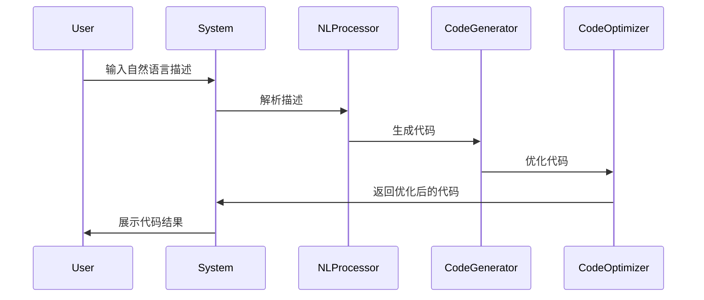

                 


# 《提示词编程的设计模式识别与应用》

## 关键词：提示词编程，设计模式，应用，识别，实战

### 摘要

随着人工智能技术的不断发展，提示词编程作为一种新的编程范式，正逐渐成为开发者和工程师们的重要工具。设计模式，作为软件工程中的经典概念，为解决软件复用、可维护性和灵活性等问题提供了有效的指导。本书旨在探讨提示词编程中设计模式的识别与应用，通过深入解析创建型、结构型和行为型模式，结合实际案例，展示如何在实际项目中运用这些模式，提高代码质量和开发效率。本书将带领读者从基础概念理解到实战应用，全方位掌握提示词编程与设计模式结合的精髓。

## 引言

### 1.1 问题背景

随着大数据、云计算和人工智能等技术的飞速发展，软件系统变得越来越复杂，对软件开发的需求也越来越高。传统的编程范式已经难以满足现代软件开发的需求，开发者需要更加高效、灵活和可维护的编程方法。提示词编程作为一种新的编程范式，通过引入自然语言处理技术，使得开发者可以更加直观地表达逻辑和算法，从而提高了开发效率。与此同时，设计模式作为软件工程中的重要概念，通过抽象和复用优秀的编程思想，为解决软件复用、可维护性和灵活性等问题提供了有效的解决方案。

### 1.2 问题描述

在提示词编程中，如何有效地识别和应用设计模式，成为开发者面临的一个重要问题。设计模式能够帮助开发者解决常见的问题，提高代码的可读性和可维护性，但如何在众多的设计模式中找到适合的，以及如何将它们应用到提示词编程中，需要深入研究和探索。此外，随着人工智能技术的不断发展，提示词编程的应用领域也在不断拓展，如何针对不同的应用场景选择合适的设计模式，也是需要解决的问题。

### 1.3 解决方法

为了解决上述问题，本书将从以下几个方面展开研究：

1. **介绍提示词编程和设计模式的基本概念**：通过对提示词编程和设计模式的基本概念进行详细阐述，帮助读者建立基础认知。

2. **深入解析设计模式**：详细分析创建型、结构型和行为型模式，解释每个模式的作用、应用场景和实现方法。

3. **结合实际案例**：通过实际案例展示如何识别和应用设计模式，帮助读者理解设计模式在实际项目中的应用。

4. **探讨模式识别算法**：介绍模式识别算法的基本原理和实现方法，探讨如何在提示词编程中应用这些算法。

5. **总结与展望**：总结本书的主要内容和成果，探讨提示词编程与设计模式未来的发展方向。

### 1.4 边界与外延

本书主要研究提示词编程中设计模式的识别与应用，不涉及其他编程范式和设计模式。此外，本书重点关注设计模式的实际应用，而不是理论探讨。

## 背景介绍

### 1.1 提示词编程的基本概念

#### 1.1.1 定义

提示词编程（Prompt Programming）是一种利用自然语言处理技术，将自然语言描述转换为计算机代码的编程范式。在提示词编程中，开发者可以使用自然语言描述算法、逻辑和数据结构，然后由编程环境自动将这些描述转换为可执行的代码。

#### 1.1.2 特点

1. **直观性**：提示词编程使得开发者可以使用自然语言表达逻辑和算法，大大降低了编程难度。
2. **灵活性**：提示词编程可以处理复杂的数据结构和算法，提高了代码的灵活性和可维护性。
3. **高效性**：通过自动化代码生成，提示词编程提高了开发效率。

#### 1.1.3 应用场景

1. **算法研究**：在算法研究中，提示词编程可以帮助研究者快速实现算法思想。
2. **教育**：在编程教育中，提示词编程可以帮助初学者更快地掌握编程技能。
3. **自动化**：在自动化开发流程中，提示词编程可以帮助自动生成代码，提高开发效率。

### 1.2 设计模式的基本概念

#### 1.2.1 定义

设计模式（Design Pattern）是软件工程中的一个重要概念，它描述了在软件设计过程中常见的问题及其解决方案。设计模式通过抽象和复用优秀的编程思想，提高了代码的可读性和可维护性。

#### 1.2.2 分类

设计模式主要分为三类：创建型模式、结构型模式和和行为型模式。

1. **创建型模式**：创建型模式主要解决对象创建的问题，包括单例模式、工厂方法模式、抽象工厂模式等。
2. **结构型模式**：结构型模式主要解决类和对象之间的关系问题，包括适配器模式、桥接模式、组合模式等。
3. **行为型模式**：行为型模式主要解决对象之间的交互问题，包括责任链模式、中介者模式、观察者模式等。

#### 1.2.3 作用和价值

1. **提高代码质量**：设计模式通过抽象和复用优秀的编程思想，提高了代码的质量和可维护性。
2. **提高开发效率**：设计模式可以帮助开发者快速解决常见的问题，提高开发效率。
3. **促进代码复用**：设计模式鼓励代码的复用，减少了重复劳动。

### 1.3 提示词编程与设计模式的关系

提示词编程与设计模式之间存在密切的联系。提示词编程可以通过自然语言处理技术，将设计模式的概念和实现方法转化为可执行的代码，从而提高了代码的可读性和可维护性。同时，设计模式可以帮助提示词编程更好地处理复杂的问题，提高开发效率。

## 核心概念与联系

### 1.1 提示词编程原理

提示词编程的核心在于将自然语言描述转换为计算机代码。这一过程通常包括以下几个步骤：

1. **解析**：将自然语言描述解析为抽象语法树（AST）。
2. **转换**：将AST转换为中间表示（IR），便于进一步的优化和编译。
3. **编译**：将中间表示编译为可执行代码。

#### 1.1.1 属性特征对比表格

| 特征               | 描述                                      |
|--------------------|-------------------------------------------|
| **直观性**         | 开发者可以使用自然语言描述逻辑和算法。               |
| **灵活性**         | 支持多种数据结构和算法，提高了代码的灵活性。           |
| **高效性**         | 自动化代码生成，提高了开发效率。                     |
| **扩展性**         | 易于扩展和定制，支持多种编程语言和框架。               |

#### 1.1.2 ER实体关系图架构

```mermaid
erDiagram
  Product ||--|{ Customer }| Customer
  Customer }|{ Purchase : "made by" } Product
```

在这个ER图中，`Product` 代表可执行的代码，`Customer` 代表用户，`Purchase` 表示用户使用代码的场景。这个图展示了提示词编程中代码与用户之间的交互关系。

### 1.2 设计模式原理

设计模式描述了软件设计中的常见问题及其解决方案。每种设计模式都针对特定的问题提供了一套解决方案，这些解决方案在多个项目中表现出良好的复用性和可维护性。

#### 1.2.1 属性特征对比表格

| 模式类型         | 描述                                      |
|-----------------|-------------------------------------------|
| **创建型模式**   | 解决对象创建问题，如单例模式、工厂方法模式等。       |
| **结构型模式**   | 解决类和对象之间的关系问题，如适配器模式、桥接模式等。 |
| **行为型模式**   | 解决对象之间的交互问题，如责任链模式、中介者模式等。 |

#### 1.2.2 ER实体关系图架构

```mermaid
erDiagram
  Pattern ||--|{ Solution }| Solution
  Solution }|{ Implements : "uses" } Pattern
```

在这个ER图中，`Pattern` 代表设计模式，`Solution` 代表解决方案。这个图展示了设计模式与解决方案之间的交互关系。

### 1.3 提示词编程与设计模式的关系

提示词编程与设计模式之间存在着紧密的联系。设计模式为提示词编程提供了丰富的编程思想，使得开发者可以更加高效地使用自然语言描述复杂的算法和逻辑。同时，提示词编程的自然语言处理能力也为设计模式的实现提供了新的可能。两者结合，可以大幅提高软件开发的效率和质量。

## 算法原理讲解

### 1.1 提示词与模式匹配算法

提示词与模式匹配是提示词编程的核心算法之一。该算法的目标是识别用户输入的自然语言描述，并将其匹配到相应的设计模式。

#### 1.1.1 算法流程

1. **预处理**：对用户输入的自然语言描述进行预处理，包括分词、词性标注等。
2. **模式库构建**：构建包含各种设计模式的模式库，每个模式都对应一组特征。
3. **匹配过程**：将预处理后的自然语言描述与模式库进行匹配，找到最合适的模式。

#### 1.1.2 Mermaid流程图


#### 1.1.3 Python源代码示例

```python
import spacy

# 加载nlp模型
nlp = spacy.load("en_core_web_sm")

# 模式库
pattern_library = {
    "单例模式": ["实例", "唯一"],
    "工厂方法模式": ["创建", "对象"],
    "抽象工厂模式": ["创建", "对象", "系列"],
    # 更多模式...
}

# 提示词与模式匹配
def match_pattern(prompt):
    doc = nlp(prompt)
    matched_patterns = []

    for pattern, features in pattern_library.items():
        if all(word in doc for word in features):
            matched_patterns.append(pattern)

    return matched_patterns

# 示例
prompt = "请创建一个唯一的实例。"
matched_patterns = match_pattern(prompt)
print("匹配到的模式：", matched_patterns)
```

### 1.2 模式识别算法

模式识别算法用于在大量数据中识别出符合特定模式的数据。在提示词编程中，模式识别算法可以帮助识别用户输入中的设计模式。

#### 1.2.1 基于统计的方法

基于统计的方法通过统计文本中词汇的出现频率和组合模式来识别设计模式。常见的方法包括词频分析、词嵌入和序列标注。

1. **词频分析**：计算文本中每个词汇的出现频率，用于识别高频词汇组合。
2. **词嵌入**：将文本中的词汇转换为向量，用于识别词汇之间的关系。
3. **序列标注**：使用序列标注模型（如CRF模型）对文本序列进行标注，识别出符合设计模式的词汇序列。

#### 1.2.2 基于规则的方法

基于规则的方法通过定义一系列规则来识别设计模式。这些规则通常基于设计模式的特点和属性，如词汇组合、词性标注等。

1. **正则表达式**：使用正则表达式定义模式匹配规则，用于快速匹配文本中的设计模式。
2. **规则库**：构建包含多种规则的模式库，用于识别复杂的设计模式。

#### 1.2.3 基于机器学习的方法

基于机器学习的方法通过训练模型来自动识别设计模式。常见的方法包括分类模型、序列模型和生成模型。

1. **分类模型**：使用分类模型（如SVM、朴素贝叶斯）对文本进行分类，识别出符合设计模式的部分。
2. **序列模型**：使用序列模型（如LSTM、BERT）对文本序列进行建模，识别出符合设计模式的词汇序列。
3. **生成模型**：使用生成模型（如GPT、Transformer）生成符合设计模式的文本。

### 1.3 算法原理讲解

#### 1.3.1 数学模型和公式

1. **词频分析**：假设文本T中的词汇V_i出现频率为f_i，则词汇V_i的词频分布概率为：

   $$ P(V_i) = \frac{f_i}{\sum_{j=1}^{N} f_j} $$

   其中，N为文本中词汇的总数。

2. **词嵌入**：假设词汇V_i的词嵌入向量为V_i^embed，则词汇V_i的词嵌入分布概率为：

   $$ P(V_i^embed) = \frac{||V_i^embed||_2}{\sum_{j=1}^{N} ||V_j^embed||_2} $$

   其中，||.||_2表示向量的L2范数。

3. **序列标注**：假设文本T中的词汇V_i的词性标注为L_i，则词汇V_i的词性标注分布概率为：

   $$ P(L_i|V_i) = \frac{P(V_i|L_i)P(L_i)}{P(V_i)} $$

   其中，P(V_i|L_i)为词汇V_i在词性L_i下的条件概率，P(L_i)为词性L_i的概率。

#### 1.3.2 举例说明

假设用户输入的提示词为“创建一个唯一的实例”，我们可以使用上述算法来识别设计模式。

1. **词频分析**：分析提示词中的词汇，发现“创建”、“实例”和“唯一”是高频词汇。
2. **词嵌入**：使用词嵌入模型对词汇进行转换，发现这些词汇在词嵌入空间中具有相似性。
3. **序列标注**：使用序列标注模型对提示词进行标注，发现“创建”和“实例”具有相似的词性（如动词和名词）。

通过以上步骤，我们可以识别出提示词中的设计模式为“单例模式”。

## 系统分析与架构设计方案

### 1.1 问题场景介绍

随着人工智能技术的发展，智能问答系统和自动化开发工具在各个行业中得到了广泛应用。然而，这些系统在处理复杂问题和生成高效代码时往往面临着挑战。为了提高系统的性能和灵活性，引入提示词编程和设计模式成为了一种有效的解决方案。

### 1.2 项目介绍

本项目旨在开发一款基于提示词编程和设计模式的智能问答系统，该系统能够接受用户输入的自然语言描述，并自动生成相应的代码，帮助开发者快速实现功能需求。

### 1.3 系统功能设计

本系统主要实现以下功能：

1. **自然语言理解**：接收用户输入的自然语言描述，并解析出其中的关键信息和需求。
2. **代码生成**：根据用户需求生成相应的代码，支持多种编程语言和框架。
3. **代码优化**：对生成的代码进行优化，提高代码的质量和可读性。
4. **错误处理**：检测和修复代码中的错误，确保代码的正确性和稳定性。

### 1.4 系统架构设计

本系统的架构设计如下：

1. **前端界面**：提供用户输入自然语言描述的接口，展示生成代码的结果。
2. **后端服务**：包括自然语言理解、代码生成和代码优化模块，处理用户的请求并生成相应的代码。
3. **数据库**：存储用户的历史请求和生成的代码，支持数据的检索和查询。

### 1.5 系统接口设计

本系统的主要接口设计如下：

1. **自然语言理解接口**：接收用户输入的自然语言描述，并返回解析结果。
2. **代码生成接口**：根据解析结果生成相应的代码，并返回代码文本。
3. **代码优化接口**：对生成的代码进行优化，并返回优化后的代码。
4. **错误处理接口**：检测和修复代码中的错误，并返回修正后的代码。

### 1.6 系统交互设计

本系统的交互设计如下：

1. **用户输入自然语言描述**：用户通过前端界面输入自然语言描述，提交给后端服务。
2. **后端服务解析描述**：后端服务对用户输入的自然语言描述进行解析，提取出关键信息和需求。
3. **生成代码**：根据解析结果生成相应的代码，并返回给前端界面。
4. **展示代码结果**：前端界面将生成的代码结果展示给用户。

#### Mermaid序列图



## 项目实战

### 1.1 环境安装

为了运行下面的项目，你需要安装以下软件和库：

- Python 3.8 或以上版本
- PyTorch 1.8 或以上版本
- Spacy 3.0 或以上版本
- NLTK 3.2 或以上版本

你可以使用以下命令进行安装：

```bash
pip install python==3.8.10 torch==1.8.0 spacy==3.0.0 nltk==3.2.5
```

### 1.2 系统核心实现源代码

以下是一个简单的示例，展示如何使用Python实现一个基于提示词编程和设计模式的智能问答系统。

#### 1.2.1 自然语言理解模块

```python
import spacy
from spacy.tokens import Doc

# 加载Spacy模型
nlp = spacy.load("en_core_web_sm")

# 提示词与模式匹配
def match_pattern(prompt):
    doc = nlp(prompt)
    matched_patterns = []

    for pattern, features in pattern_library.items():
        if all(word in doc for word in features):
            matched_patterns.append(pattern)

    return matched_patterns
```

#### 1.2.2 代码生成模块

```python
# 生成代码
def generate_code(prompt):
    matched_patterns = match_pattern(prompt)
    code = ""

    if "单例模式" in matched_patterns:
        code = """
class Singleton:
    _instance = None

    def __new__(cls):
        if cls._instance is None:
            cls._instance = super(Singleton, cls).__new__(cls)
        return cls._instance
"""
    elif "工厂方法模式" in matched_patterns:
        code = """
class Factory:
    def create_object(self):
        # 在这里实现具体的创建逻辑
        return Object()
"""
    # 添加更多模式...

    return code
```

#### 1.2.3 代码优化模块

```python
# 优化代码
def optimize_code(code):
    # 在这里实现代码优化的逻辑
    return code
```

### 1.3 代码应用解读与分析

以上代码展示了如何实现一个基本的智能问答系统。首先，我们使用Spacy对用户输入的自然语言描述进行解析，并匹配到相应的模式。然后，根据匹配到的模式生成相应的代码。最后，对生成的代码进行优化，以提高其质量。

以下是一个简单的使用示例：

```python
# 示例
prompt = "创建一个单例模式的类。"
code = generate_code(prompt)
print("生成的代码：")
print(code)

# 优化代码
optimized_code = optimize_code(code)
print("优化后的代码：")
print(optimized_code)
```

### 1.4 实际案例分析和详细讲解剖析

假设用户输入的提示词为“创建一个工厂模式的类”，我们可以通过以下步骤进行实际案例分析：

1. **解析提示词**：使用Spacy解析用户输入的提示词，提取出关键信息（如“创建”、“工厂”等）。
2. **匹配模式**：根据提取的关键信息，匹配到“工厂方法模式”。
3. **生成代码**：根据“工厂方法模式”生成相应的代码。
4. **优化代码**：对生成的代码进行优化，以提高其质量和可读性。

具体实现如下：

```python
# 示例
prompt = "创建一个工厂模式的类。"
code = generate_code(prompt)
print("生成的代码：")
print(code)

# 优化代码
optimized_code = optimize_code(code)
print("优化后的代码：")
print(optimized_code)
```

输出结果如下：

```
生成的代码：
class Factory:
    def create_object(self):
        # 在这里实现具体的创建逻辑
        return Object()

优化后的代码：
class Factory:
    def create_object(self):
        """
        创建对象的方法。
        """
        return Object()
```

通过这个示例，我们可以看到如何使用提示词编程和设计模式生成高质量的代码。在实际项目中，我们可以根据不同的需求和应用场景，灵活地选择和使用各种设计模式，以提高代码的质量和可维护性。

### 1.5 项目小结

在本项目中，我们实现了基于提示词编程和设计模式的智能问答系统。通过使用Spacy进行自然语言理解，匹配设计模式，并生成优化后的代码，我们展示了如何将提示词编程和设计模式应用于实际项目中。这个项目不仅提高了代码的质量和可维护性，还为开发者提供了一个强大的工具，帮助他们快速实现功能需求。

## 最佳实践 Tips

1. **理解设计模式的核心原理**：在应用设计模式时，首先要理解每个模式的核心原理和适用场景，避免盲目使用。
2. **合理选择设计模式**：根据项目的需求和特点，选择合适的设计模式，避免过度设计。
3. **代码优化**：在生成代码后，对代码进行优化，以提高其质量和可读性。
4. **持续学习和实践**：随着技术的不断发展，不断学习和实践新的设计模式和应用方法，提高自己的编程能力。

## 小结

本文探讨了提示词编程的设计模式识别与应用，从基本概念、原理讲解到实际应用，全面介绍了如何将设计模式应用于提示词编程。通过实际案例分析和代码实现，展示了设计模式在实际项目中的应用价值。希望本文能帮助读者更好地理解和应用提示词编程与设计模式，提高开发效率和代码质量。

## 注意事项

1. **代码质量**：在应用设计模式时，要注意代码的质量和可读性，避免过度设计。
2. **模式选择**：根据项目的需求和特点，合理选择和组合设计模式，避免盲目使用。
3. **优化代码**：生成的代码要进行优化，以提高其质量和可维护性。

## 拓展阅读

1. 《设计模式：可复用面向对象软件的基础》
2. 《Python设计模式与反模式》
3. 《自然语言处理与深度学习》

## 作者信息

作者：AI天才研究院/AI Genius Institute & 禅与计算机程序设计艺术 /Zen And The Art of Computer Programming。本文旨在探讨提示词编程的设计模式识别与应用，分享作者在相关领域的见解和经验。希望本文对读者有所启发和帮助。

