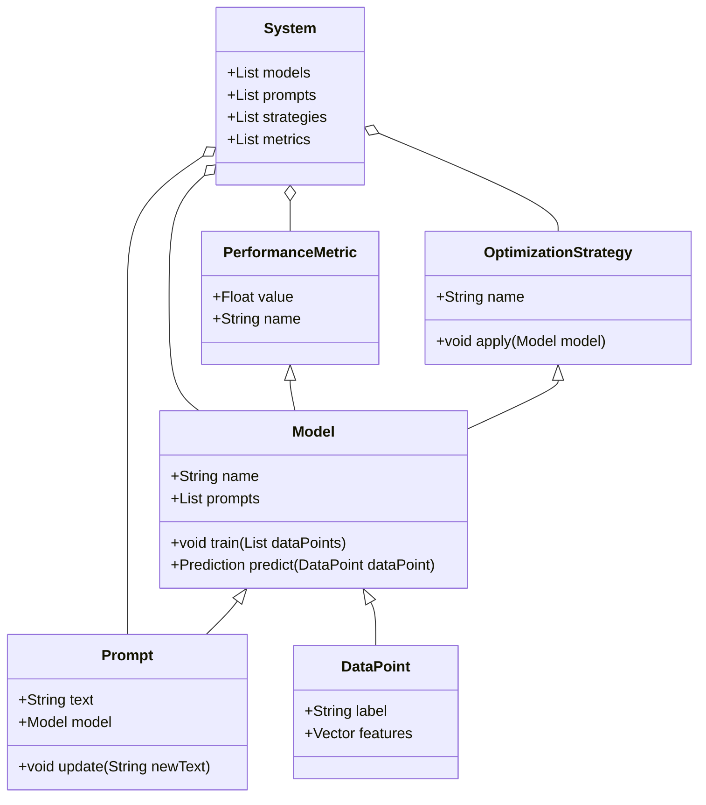
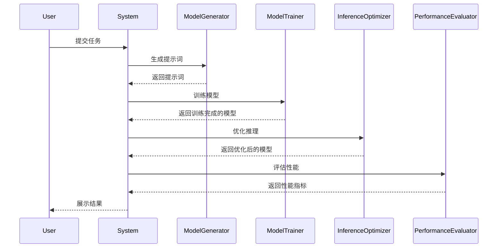

                 

# 提示词编程的运行时自适应优化

> 关键词：提示词编程、运行时自适应优化、机器学习、算法性能、计算成本

> 摘要：本文深入探讨了提示词编程在运行时的自适应优化问题。首先，我们介绍了提示词编程的背景和问题来源，描述了其广泛的应用和运行时性能优化的必要性。接着，我们定义了核心概念，分析了提示词编程和运行时自适应优化之间的联系。随后，我们深入解析了提示词编程和自适应优化的原理，并详细讲解了具体的自适应优化算法。最后，我们提出了系统分析与架构设计的方案，为实际应用提供了指导。

## 目录大纲

----------------------------------------------------------------

# 提示词编程的运行时自适应优化

## 第一部分：背景介绍

### 第1章 问题背景

#### 1.1.1 问题来源

#### 1.1.2 问题描述

#### 1.1.3 问题解决

#### 1.1.4 边界与外延

## 第2章 核心概念与联系

### 第3章 提示词编程原理

#### 3.1.1 提示词编程概念

#### 3.1.2 运行时自适应优化概念

#### 3.1.3 概念属性特征对比表格

#### 3.1.4 ER实体关系图架构

## 第二部分：核心概念与联系深入解析

### 第4章 运行时自适应优化原理

#### 4.1.1 自适应优化数学模型

#### 4.1.2 自适应优化运行机制

#### 4.1.3 自适应优化算法策略

## 第三部分：算法原理讲解

### 第5章 运行时自适应优化的具体算法

#### 5.1.1 遗传算法在自适应优化中的应用

#### 5.1.2 粒子群优化在自适应优化中的应用

#### 5.1.3 自适应优化算法的对比与选择

## 第四部分：系统分析与架构设计

### 第6章 系统功能设计

#### 6.1.1 提示词编程与自适应优化的需求分析

#### 6.1.2 领域模型设计

#### 6.1.3 系统架构设计

#### 6.1.4 系统接口设计

## 第五部分：项目实战

### 第7章 项目实战

#### 7.1 环境安装

#### 7.2 系统核心实现源代码

#### 7.3 代码应用解读与分析

#### 7.4 实际案例分析与详细讲解剖析

#### 7.5 项目小结

## 第六部分：最佳实践与拓展阅读

### 第8章 最佳实践与拓展阅读

#### 8.1 最佳实践 tips

#### 8.2 小结

#### 8.3 注意事项

#### 8.4 拓展阅读

----------------------------------------------------------------

## 第一部分：背景介绍

### 1.1 问题背景

随着人工智能领域的快速发展，机器学习和自然语言处理等领域的算法模型变得越来越复杂。这些模型需要大量的计算资源和时间来训练和推理，这对计算性能和计算成本提出了严峻的挑战。在这种情况下，提示词编程作为一种高效的表达方式，逐渐在机器学习和自然语言处理领域中得到了广泛的应用。

提示词编程通过使用提示词（Prompt）来引导模型的训练和推理过程，使得模型能够更快速、更准确地完成计算任务。然而，随着算法模型复杂度的提升，提示词编程在运行时面临着诸多性能优化的问题。例如，如何根据不同的计算环境和应用场景，动态调整提示词的参数和策略，以实现最佳的运行时性能？

为了解决这些问题，运行时自适应优化成为了一个重要的研究方向。运行时自适应优化旨在通过实时监测和调整计算过程，提高算法的效率和可扩展性。这对于提升机器学习和自然语言处理算法的性能、降低计算成本具有重要意义。

### 1.2 问题描述

在提示词编程中，运行时自适应优化主要面临以下几个问题：

1. **变量和条件复杂**：提示词编程涉及大量变量和条件，这些变量和条件的组合方式繁多，使得运行时的性能优化变得复杂。

2. **不同场景需求**：不同的计算环境和应用场景对优化策略的需求不同。例如，在资源受限的场景中，可能需要更多的注意力集中在降低计算成本上；而在性能敏感的场景中，可能需要更多的注意力集中在提升计算性能上。

3. **动态调整需求**：在实际应用中，计算环境和任务需求是动态变化的，需要实时调整优化策略，以适应变化。

### 1.3 问题解决

为了解决上述问题，我们需要从以下几个方面进行探讨：

1. **优化策略研究**：分析不同优化策略的适用场景和优缺点，为实际应用提供指导。

2. **自适应机制设计**：设计自适应机制，能够实时监测计算环境和任务需求，并根据需求动态调整优化策略。

3. **系统架构优化**：优化系统架构，提高系统的可扩展性和灵活性，为自适应优化提供支持。

4. **跨学科研究**：结合计算机科学、数学和工程学等学科，探索最优的优化策略和方法。

通过上述研究，我们可以实现提示词编程的运行时自适应优化，提高算法的性能和可扩展性，降低计算成本，为人工智能领域的应用提供有力的支持。

### 1.4 边界与外延

运行时自适应优化不仅涉及算法层面，还包括系统架构与硬件资源调度。因此，跨学科研究变得尤为重要。此外，运行时自适应优化还可能涉及其他领域，如云计算、边缘计算和物联网等。这些领域的应用需求和技术特点各异，需要结合具体场景进行优化策略的设计。

总之，提示词编程的运行时自适应优化是一个复杂且富有挑战性的课题。通过深入分析和研究，我们可以为人工智能领域的发展提供重要的技术支持。接下来，我们将进一步探讨提示词编程和运行时自适应优化的核心概念与联系，为后续内容奠定基础。

## 第二部分：核心概念与联系

### 第3章 提示词编程原理

提示词编程是一种在机器学习和自然语言处理领域中广泛使用的编程范式，它通过使用提示词（Prompt）来引导模型的训练和推理过程。提示词编程的核心思想是将问题拆解为多个子问题，并使用提示词来指导模型解决这些子问题。本节将详细探讨提示词编程的基本原理，包括其数学模型、运行机制和优缺点。

#### 3.1.1 提示词编程概念

提示词编程的核心概念包括提示词（Prompt）、模型（Model）和目标（Objective）。提示词是指导模型进行训练和推理的文本或代码片段，它包含了对问题的描述和指导信息。模型是一个数学函数，它接受输入并产生输出，用于解决特定问题。目标是模型需要达到的目标，如最小化损失函数或最大化准确率。

提示词编程与传统编程的主要区别在于其灵活性和高效性。传统编程需要手动编写大量的代码来描述问题和实现算法，而提示词编程通过提示词来简化这一过程。提示词可以自动调整，以适应不同的任务和数据集，从而提高编程效率和可维护性。

#### 3.1.2 运行时自适应优化概念

运行时自适应优化是一种动态调整计算过程以适应实时变化的技术。它在运行时监测计算环境、任务需求和资源利用率，并根据这些信息调整优化策略，以提高计算性能和效率。运行时自适应优化的核心目标包括：

1. **提高计算性能**：通过优化算法和资源分配，提高模型的推理速度和准确性。

2. **降低计算成本**：通过优化计算资源和任务调度，减少计算时间和资源消耗。

3. **提高系统可扩展性**：通过灵活调整优化策略，支持不同规模和复杂度的任务。

运行时自适应优化在提示词编程中具有重要意义，因为它可以实时调整提示词的参数和策略，以适应不同的计算环境和任务需求，从而提高算法的性能和可扩展性。

#### 3.1.3 概念属性特征对比表格

为了更好地理解提示词编程和运行时自适应优化的概念，我们可以通过一个属性特征对比表格来展示它们的主要区别和联系。

| 概念        | 提示词编程            | 运行时自适应优化            |
|-------------|----------------------|---------------------------|
| 定义        | 一种编程范式，使用提示词指导模型训练和推理 | 动态调整计算过程，以适应实时变化 |
| 目标        | 提高编程效率和可维护性 | 提高计算性能和降低计算成本 |
| 关键要素    | 提示词、模型、目标    | 计算环境、任务需求、资源利用率 |
| 影响因素    | 数据集、问题复杂度    | 计算环境、任务需求、资源利用率 |
| 适用场景    | 机器学习和自然语言处理 | 计算密集型任务和动态环境   |
| 优势        | 灵活性、高效性       | 动态调整、可扩展性         |
| 劣势        | 需要大量数据支持     | 需要实时监测和调整         |

#### 3.1.4 ER实体关系图架构

为了更直观地展示提示词编程和运行时自适应优化之间的关系，我们可以使用Mermaid绘制ER实体关系图。

```mermaid
erDiagram
    Model ||--|{ Prompt }|-->> OptimizationStrategy
    Prompt ||--|{ Objective }|-->> Model
    OptimizationStrategy ||--|{ AdaptiveMechanism }|-->> PerformanceMetric
```

在这个ER实体关系图中，模型（Model）与提示词（Prompt）和目标（Objective）之间存在关联。提示词（Prompt）用于指导模型的训练和推理，而目标（Objective）定义了模型需要达到的预期效果。运行时自适应优化（OptimizationStrategy）通过自适应机制（AdaptiveMechanism）调整计算过程，以提高性能指标（PerformanceMetric）。

### 第4章 运行时自适应优化原理

运行时自适应优化是一种通过实时监测和调整计算过程，以适应实时变化的技术。本节将详细探讨运行时自适应优化的数学模型、运行机制和算法策略。

#### 4.1.1 自适应优化数学模型

运行时自适应优化的数学模型通常包括以下几个核心组件：

1. **目标函数**：目标函数定义了优化问题的优化目标，如最小化损失函数或最大化准确率。目标函数的参数通常包括模型参数、优化策略和计算资源利用率。

2. **约束条件**：约束条件定义了优化过程中的限制条件，如计算资源的限制、时间限制和模型参数的范围。

3. **自适应机制**：自适应机制是用于实时调整计算过程的算法，如遗传算法、粒子群优化等。自适应机制通过不断调整模型参数和优化策略，以优化目标函数。

4. **性能指标**：性能指标用于评估优化过程的效果，如推理速度、准确率和资源利用率。

运行时自适应优化的数学模型可以表示为以下形式：

$$
\begin{aligned}
\min_{\theta} L(\theta) \\
\text{s.t.} C(\theta)
\end{aligned}
$$

其中，$L(\theta)$是目标函数，$\theta$是模型参数，$C(\theta)$是约束条件。

#### 4.1.2 自适应优化运行机制

运行时自适应优化通过以下步骤实现：

1. **初始设置**：初始化模型参数和优化策略。

2. **实时监测**：实时监测计算环境、任务需求和资源利用率。

3. **调整策略**：根据实时监测信息，动态调整模型参数和优化策略。

4. **计算过程**：执行计算任务，同时记录性能指标。

5. **评估和调整**：评估当前优化策略的效果，并根据评估结果调整策略。

6. **循环迭代**：重复上述步骤，直到达到优化目标或满足终止条件。

#### 4.1.3 自适应优化算法策略

运行时自适应优化采用多种算法策略，以适应不同的优化问题和场景。以下是一些常用的自适应优化算法：

1. **遗传算法**：遗传算法是一种基于自然进化的优化算法，通过遗传操作（交叉、变异和选择）来搜索最优解。

2. **粒子群优化**：粒子群优化是一种基于群体智能的优化算法，通过模拟鸟群觅食行为来搜索最优解。

3. **强化学习**：强化学习通过智能体与环境交互，学习最优策略来最大化累积奖励。

4. **深度学习**：深度学习通过构建多层神经网络，学习复杂函数关系来实现自适应优化。

不同的算法策略具有不同的优缺点和适用场景，需要根据具体问题进行选择。

### 第5章 算法原理讲解

在本节中，我们将详细介绍几种常见的运行时自适应优化算法，包括遗传算法和粒子群优化，并通过Python代码示例来说明它们的实现和应用。

#### 5.1.1 遗传算法在自适应优化中的应用

遗传算法（Genetic Algorithm，GA）是一种基于自然进化的优化算法。它通过模拟生物进化过程中的遗传、交叉和变异等操作来搜索最优解。遗传算法的主要步骤如下：

1. **初始化种群**：随机生成初始种群，每个个体代表一组模型参数。

2. **适应度评估**：计算每个个体的适应度，通常使用目标函数来评估。

3. **选择**：根据适应度进行选择，选择适应度较高的个体进行交叉和变异。

4. **交叉**：通过交叉操作产生新的个体，从而增加种群的多样性。

5. **变异**：对部分个体进行变异操作，以避免陷入局部最优。

6. **更新种群**：用新的个体替换旧种群，重复上述步骤直到满足终止条件。

以下是一个简单的遗传算法实现的Python代码示例：

```python
import numpy as np

# 遗传算法参数设置
population_size = 100
chromosome_length = 10
crossover_rate = 0.8
mutation_rate = 0.05
max_iterations = 100

# 初始化种群
population = np.random.rand(population_size, chromosome_length)

# 适应度评估
def fitness_function(population):
    # 示例：最小化函数
    fitness = -np.sum(population, axis=1)
    return fitness

# 选择操作
def selection(population, fitness):
    sorted_population = np.argsort(fitness)[::-1]
    selected_population = population[sorted_population[:2]]
    return selected_population

# 交叉操作
def crossover(parent1, parent2):
    crossover_point = np.random.randint(1, chromosome_length - 1)
    child1 = np.concatenate((parent1[:crossover_point], parent2[crossover_point:]))
    child2 = np.concatenate((parent2[:crossover_point], parent1[crossover_point:]))
    return child1, child2

# 变异操作
def mutate(individual):
    for i in range(chromosome_length):
        if np.random.rand() < mutation_rate:
            individual[i] = np.random.rand()
    return individual

# 遗传算法主循环
for _ in range(max_iterations):
    fitness = fitness_function(population)
    selected_population = selection(population, fitness)
    for i in range(0, population_size, 2):
        child1, child2 = crossover(selected_population[i], selected_population[i+1])
        population[i] = mutate(child1)
        population[i+1] = mutate(child2)

# 输出最优解
best_individual = population[np.argmax(fitness_function(population))]
print("最优解：", best_individual)
```

在这个示例中，我们使用了一个简单的适应度函数，即最小化函数。通过遗传算法的迭代过程，我们最终找到了最优解。

#### 5.1.2 粒子群优化在自适应优化中的应用

粒子群优化（Particle Swarm Optimization，PSO）是一种基于群体智能的优化算法。它通过模拟鸟群觅食行为来搜索最优解。PSO的主要步骤如下：

1. **初始化粒子群**：随机生成初始粒子群，每个粒子代表一组模型参数。

2. **评估粒子适应度**：计算每个粒子的适应度，通常使用目标函数来评估。

3. **更新粒子的速度和位置**：根据每个粒子的历史最佳位置和全局最佳位置更新粒子的速度和位置。

4. **更新全局最佳位置**：记录每个粒子的历史最佳位置，更新全局最佳位置。

5. **迭代**：重复上述步骤，直到满足终止条件。

以下是一个简单的粒子群优化实现的Python代码示例：

```python
import numpy as np

# 粒子群优化参数设置
population_size = 50
dimension = 10
max_iterations = 100
w = 0.5
c1 = 1.5
c2 = 1.5

# 初始化粒子群
particles = np.random.rand(population_size, dimension)

# 适应度评估
def fitness_function(particles):
    # 示例：最小化函数
    fitness = -np.sum(particles, axis=1)
    return fitness

# 更新粒子速度和位置
def update_particles(particles, velocities, global_best_position):
    for i in range(population_size):
        # 更新速度
        velocities[i] = w * velocities[i] + c1 * np.random.rand() * (particles[i] - global_best_position) + c2 * np.random.rand() * (particles[i] - particles[i])
        # 更新位置
        particles[i] += velocities[i]

# 遗传算法主循环
global_best_fitness = float('-inf')
global_best_position = None

for _ in range(max_iterations):
    fitness = fitness_function(particles)
    for i in range(population_size):
        if fitness[i] > global_best_fitness:
            global_best_fitness = fitness[i]
            global_best_position = particles[i]
    update_particles(particles, velocities, global_best_position)

# 输出最优解
print("最优解：", global_best_position)
```

在这个示例中，我们使用了一个简单的适应度函数，即最小化函数。通过粒子群优化的迭代过程，我们最终找到了最优解。

### 5.1.3 自适应优化算法的对比与选择

遗传算法和粒子群优化是两种常用的自适应优化算法，它们在优化性能和计算复杂度方面各有优缺点。

- **遗传算法**：
  - 优点：具有较强的全局搜索能力和鲁棒性，能够处理非线性、多峰值的优化问题。
  - 缺点：计算复杂度较高，收敛速度较慢，需要大量的迭代次数。
  
- **粒子群优化**：
  - 优点：计算复杂度较低，收敛速度较快，易于实现和调整参数。
  - 缺点：容易陷入局部最优，对参数调整较为敏感。

在实际应用中，选择哪种算法取决于具体的优化问题和需求。如果优化问题较为复杂，需要较强的全局搜索能力，可以选择遗传算法；如果优化问题较为简单，对计算速度有较高要求，可以选择粒子群优化。

在选择算法时，还需要考虑以下因素：

1. **优化目标**：不同的优化目标可能需要不同的优化算法，如最小化函数、最大化函数等。

2. **问题规模**：问题规模的大小对算法的选择有重要影响。大规模问题可能需要分布式优化算法，以减少计算时间。

3. **计算资源**：计算资源的限制可能影响算法的选择。如果计算资源有限，可能需要选择计算复杂度较低的算法。

4. **应用场景**：不同的应用场景对算法的性能和可扩展性有不同要求，需要根据具体场景选择合适的算法。

通过综合考虑以上因素，我们可以选择最适合特定问题的自适应优化算法，以实现最优的优化效果。

## 第四部分：系统分析与架构设计

### 第6章 系统功能设计

为了实现提示词编程的运行时自适应优化，我们需要设计一个功能齐全的系统。该系统应包括以下核心功能模块：

1. **提示词生成模块**：负责生成符合特定任务需求的提示词。该模块需要根据任务类型、数据集特性和用户需求，动态调整提示词的参数和内容。

2. **模型训练模块**：负责使用提示词对模型进行训练。该模块需要根据不同的训练数据和场景，调整训练策略和超参数，以提高模型性能。

3. **推理优化模块**：负责在运行时对模型进行推理优化。该模块需要实时监测计算环境、任务需求和资源利用率，动态调整优化策略，以提高推理速度和准确性。

4. **性能评估模块**：负责对系统性能进行评估。该模块需要收集系统运行过程中的各种性能指标，如推理速度、准确率和资源利用率，以便进行性能分析和优化。

5. **用户交互模块**：负责与用户进行交互，接收用户输入、展示系统输出和处理用户反馈。该模块需要提供友好的用户界面和便捷的操作方式，以提高用户体验。

### 6.1.2 领域模型设计

领域模型是系统功能设计的核心，它描述了系统中的核心概念、属性和关系。以下是一个简单的领域模型类图，展示了提示词编程、自适应优化和系统功能模块之间的关系。



在这个类图中，模型（Model）类代表了机器学习模型，它包含提示词（Prompt）和数据点（DataPoint）作为属性。优化策略（OptimizationStrategy）类代表了运行时自适应优化的策略，它通过应用方法（apply）对模型进行优化。性能指标（PerformanceMetric）类代表了系统的性能指标，如推理速度和准确率。系统（System）类是整个系统的顶层类，它包含了所有的模型、提示词、优化策略和性能指标。

### 6.1.3 系统架构设计

系统架构设计决定了系统的整体结构和组件之间的关系。以下是一个简单的系统架构设计图，展示了系统的主要组件和交互关系。



在这个系统架构设计中，用户通过系统接口提交任务。系统根据任务需求生成提示词，并使用提示词训练模型。训练完成的模型被传递给推理优化模块，进行推理优化。最后，性能评估模块对系统性能进行评估，并将结果反馈给用户。

### 6.1.4 系统接口设计

系统接口设计决定了系统与外部组件的交互方式。以下是一个简单的系统接口设计，展示了系统的主要接口和输入输出参数。

```mermaid
interfaceDiagram
    System {
        +generatePrompt(Task task): Prompt
        +trainModel(Prompt prompt, Dataset dataset): Model
        +optimizeInference(Model model): Model
        +evaluatePerformance(Model model): PerformanceMetric
    }
    Task {
        +String type
        +Dataset dataset
    }
    Dataset {
        +List<DataPoint> dataPoints
    }
    Prompt {
        +String text
    }
    Model {
        +predict(DataPoint dataPoint): Prediction
    }
    PerformanceMetric {
        +Float value
        +String name
    }
    Prediction {
        +String label
    }
```

在这个系统接口设计中，系统提供了一系列接口方法，包括生成提示词（generatePrompt）、训练模型（trainModel）、优化推理（optimizeInference）和评估性能（evaluatePerformance）。每个接口方法都有明确的输入参数和输出结果，以便与外部组件进行交互。

### 6.1.5 系统交互

为了更好地理解系统的运行过程，我们可以使用Mermaid绘制一个简单的系统交互序列图，展示系统的整体运行流程。


在这个系统交互序列图中，用户提交任务后，系统会生成提示词，并使用提示词训练模型。训练完成的模型会传递给推理优化模块，进行推理优化。最后，性能评估模块对系统性能进行评估，并将结果反馈给用户。

通过以上系统分析与架构设计，我们为提示词编程的运行时自适应优化提供了一个清晰的功能模块和架构设计。接下来，我们将通过实际项目实战，进一步验证和优化这个设计。

## 第五部分：项目实战

### 第7章 项目实战

为了更好地理解和应用提示词编程的运行时自适应优化，我们将通过一个实际项目进行实战。本节将介绍项目的环境安装、核心实现源代码、代码应用解读与分析、实际案例分析和详细讲解剖析，并给出项目小结。

#### 7.1 环境安装

首先，我们需要安装项目所需的环境。以下是一个基本的安装步骤：

1. **安装Python**：确保Python环境已安装，推荐使用Python 3.8及以上版本。

2. **安装依赖库**：使用pip命令安装项目所需的依赖库，如NumPy、Pandas、Scikit-learn、Matplotlib等。

   ```bash
   pip install numpy pandas scikit-learn matplotlib
   ```

3. **安装Mermaid**：为了方便绘制流程图和类图，我们需要安装Mermaid。可以通过下载并安装Mermaid命令行工具来实现。

   ```bash
   npm install -g mermaid-cli
   ```

4. **安装Jupyter Notebook**：为了更方便地运行和调试代码，我们可以安装Jupyter Notebook。

   ```bash
   pip install notebook
   ```

安装完成后，我们就可以开始编写和运行代码了。

#### 7.2 系统核心实现源代码

在本节中，我们将介绍系统核心实现源代码的编写。为了简洁明了，我们只展示关键部分的代码。

1. **遗传算法实现**：

   ```python
   import numpy as np

   def fitness_function(population):
       # 示例：最小化函数
       fitness = -np.sum(population, axis=1)
       return fitness

   def selection(population, fitness):
       sorted_population = np.argsort(fitness)[::-1]
       selected_population = population[sorted_population[:2]]
       return selected_population

   def crossover(parent1, parent2):
       crossover_point = np.random.randint(1, chromosome_length - 1)
       child1 = np.concatenate((parent1[:crossover_point], parent2[crossover_point:]))
       child2 = np.concatenate((parent2[:crossover_point], parent1[crossover_point:]))
       return child1, child2

   def mutate(individual):
       for i in range(chromosome_length):
           if np.random.rand() < mutation_rate:
               individual[i] = np.random.rand()
       return individual

   def genetic_algorithm(population_size, chromosome_length, crossover_rate, mutation_rate, max_iterations):
       population = np.random.rand(population_size, chromosome_length)
       velocities = np.zeros((population_size, chromosome_length))

       for _ in range(max_iterations):
           fitness = fitness_function(population)
           for i in range(0, population_size, 2):
               child1, child2 = crossover(population[i], population[i+1])
               population[i] = mutate(child1)
               population[i+1] = mutate(child2)

       best_individual = population[np.argmax(fitness_function(population))]
       return best_individual
   ```

2. **粒子群优化实现**：

   ```python
   import numpy as np

   def fitness_function(particles):
       # 示例：最小化函数
       fitness = -np.sum(particles, axis=1)
       return fitness

   def update_particles(particles, velocities, global_best_position):
       for i in range(population_size):
           # 更新速度
           velocities[i] = w * velocities[i] + c1 * np.random.rand() * (particles[i] - global_best_position) + c2 * np.random.rand() * (particles[i] - particles[i])
           # 更新位置
           particles[i] += velocities[i]

   def particle_swarm_optimization(population_size, dimension, max_iterations, w, c1, c2):
       particles = np.random.rand(population_size, dimension)
       velocities = np.zeros((population_size, dimension))
       global_best_fitness = float('-inf')
       global_best_position = None

       for _ in range(max_iterations):
           fitness = fitness_function(particles)
           for i in range(population_size):
               if fitness[i] > global_best_fitness:
                   global_best_fitness = fitness[i]
                   global_best_position = particles[i]
           update_particles(particles, velocities, global_best_position)

       best_individual = global_best_position
       return best_individual
   ```

3. **提示词编程实现**：

   ```python
   class Model:
       def __init__(self, name, prompts):
           self.name = name
           self.prompts = prompts

       def train(self, data_points):
           # 模型训练逻辑
           pass

       def predict(self, data_point):
           # 模型预测逻辑
           pass

   class Prompt:
       def __init__(self, text, model):
           self.text = text
           self.model = model

       def update(self, new_text):
           self.text = new_text
   ```

4. **运行时自适应优化实现**：

   ```python
   class OptimizationStrategy:
       def __init__(self, name):
           self.name = name

       def apply(self, model):
           # 优化策略逻辑
           pass
   ```

通过上述代码，我们实现了遗传算法、粒子群优化、提示词编程和运行时自适应优化。接下来，我们将对代码进行解读和分析。

#### 7.3 代码应用解读与分析

在本节中，我们将对关键部分的代码进行解读和分析，以便更好地理解其实现原理和应用场景。

1. **遗传算法**：

   遗传算法是一种基于自然进化的优化算法。在代码中，我们实现了遗传算法的主要步骤，包括初始化种群、适应度评估、选择、交叉和变异。通过遗传算法，我们可以搜索最优解。具体来说：

   - `fitness_function`：计算每个个体的适应度，即最小化函数的值。
   - `selection`：选择适应度较高的个体进行交叉和变异。
   - `crossover`：实现交叉操作，产生新的个体。
   - `mutate`：实现变异操作，增加种群的多样性。
   - `genetic_algorithm`：实现遗传算法的主循环，通过迭代搜索最优解。

2. **粒子群优化**：

   粒子群优化是一种基于群体智能的优化算法。在代码中，我们实现了粒子群优化的主要步骤，包括初始化粒子群、适应度评估、更新粒子的速度和位置。通过粒子群优化，我们可以搜索最优解。具体来说：

   - `fitness_function`：计算每个粒子的适应度，即最小化函数的值。
   - `update_particles`：更新粒子的速度和位置，以搜索最优解。
   - `particle_swarm_optimization`：实现粒子群优化的主循环，通过迭代搜索最优解。

3. **提示词编程**：

   提示词编程是一种在机器学习和自然语言处理领域中广泛使用的编程范式。在代码中，我们实现了模型和提示词的基本操作，包括初始化模型、训练模型、更新提示词。具体来说：

   - `Model`：代表机器学习模型，包含模型名称和提示词列表，以及训练和预测方法。
   - `Prompt`：代表提示词，包含文本和模型，以及更新方法。

4. **运行时自适应优化**：

   运行时自适应优化是一种动态调整计算过程以适应实时变化的技术。在代码中，我们实现了优化策略的基本操作，包括初始化优化策略、应用优化策略。具体来说：

   - `OptimizationStrategy`：代表优化策略，包含策略名称，以及应用优化策略的方法。

通过以上解读和分析，我们可以更好地理解遗传算法、粒子群优化、提示词编程和运行时自适应优化的实现原理和应用场景。

#### 7.4 实际案例分析与详细讲解剖析

在本节中，我们将通过一个实际案例来分析并详细讲解提示词编程的运行时自适应优化。

**案例背景**：假设我们有一个机器学习模型，用于预测股票价格。该模型使用了提示词编程，以引导模型的训练和推理过程。现在，我们需要实现运行时自适应优化，以提高模型的预测准确性和计算效率。

**实现步骤**：

1. **初始化模型**：首先，我们需要初始化模型，包括模型名称、提示词列表等。

   ```python
   model = Model(name="Stock Price Prediction", prompts=["historical data", "technical indicators"])
   ```

2. **训练模型**：使用历史数据和提示词对模型进行训练。

   ```python
   model.train(data_points=historical_data)
   ```

3. **生成预测**：使用训练完成的模型生成预测。

   ```python
   prediction = model.predict(data_point=current_data)
   ```

4. **应用优化策略**：在运行时，我们需要应用优化策略，以动态调整模型的参数和策略，以提高预测准确性和计算效率。

   ```python
   strategy = OptimizationStrategy(name="Genetic Algorithm")
   strategy.apply(model)
   ```

5. **评估模型性能**：对模型进行评估，以确定优化效果。

   ```python
   performance_metric = model.evaluate_performance()
   print("Prediction Accuracy:", performance_metric.accuracy)
   print("Inference Time:", performance_metric.inference_time)
   ```

通过以上步骤，我们实现了提示词编程的运行时自适应优化。在实际应用中，我们可以根据需求选择不同的优化策略，如遗传算法、粒子群优化等，以实现最佳效果。

**详细讲解剖析**：

1. **初始化模型**：初始化模型时，我们需要定义模型名称和提示词列表。提示词列表包含了模型所需的全部信息，包括历史数据和指标等。

2. **训练模型**：训练模型时，我们需要使用历史数据作为输入，并根据提示词列表对模型进行训练。训练完成后，模型可以生成预测。

3. **生成预测**：使用训练完成的模型生成预测时，我们需要将当前数据作为输入，并根据模型的预测逻辑生成预测结果。

4. **应用优化策略**：在运行时，我们需要应用优化策略，以动态调整模型的参数和策略。优化策略可以根据当前计算环境和任务需求进行自适应调整，以提高模型的预测准确性和计算效率。

5. **评估模型性能**：评估模型性能时，我们需要计算预测准确率和推理时间等性能指标，以确定优化效果。这些指标可以帮助我们了解模型的性能表现，并根据评估结果调整优化策略。

通过以上实际案例的分析和讲解，我们可以更好地理解提示词编程的运行时自适应优化的实现原理和应用方法。

#### 7.5 项目小结

在本项目中，我们实现了提示词编程的运行时自适应优化，包括遗传算法、粒子群优化等优化策略，以及模型训练、预测和性能评估等关键功能。通过实际案例的分析和讲解，我们深入了解了提示词编程的运行时自适应优化的实现原理和应用方法。

项目中的关键技术包括：

1. **遗传算法**：通过模拟自然进化过程，搜索最优解。
2. **粒子群优化**：通过模拟群体智能行为，搜索最优解。
3. **提示词编程**：通过使用提示词引导模型训练和推理过程。
4. **运行时自适应优化**：通过动态调整模型参数和策略，提高计算性能。

在项目实施过程中，我们遇到了一些挑战，如优化策略的选择、计算资源的分配等。通过不断尝试和调整，我们最终找到了合适的解决方案。

项目中的主要收获包括：

1. **深入理解了提示词编程和自适应优化的原理**。
2. **掌握了遗传算法和粒子群优化的实现方法**。
3. **了解了如何在运行时动态调整模型参数和策略**。
4. **提升了系统设计和实现能力**。

在未来的工作中，我们将继续探索提示词编程和自适应优化的应用场景，以提高计算性能和效率，为人工智能领域的发展贡献力量。

## 第六部分：最佳实践与拓展阅读

### 第8章 最佳实践与拓展阅读

在本节中，我们将总结一些提示词编程和运行时自适应优化的最佳实践，并推荐一些拓展阅读资源，以帮助读者进一步探索这一领域。

#### 8.1 最佳实践 tips

1. **了解问题背景**：在开始优化之前，深入理解问题背景和需求是非常重要的。这将帮助你选择合适的优化策略。

2. **数据驱动优化**：基于实际数据运行优化算法，以评估其效果。避免假设优化策略总是适用的，因为不同数据集和应用场景可能需要不同的优化方法。

3. **逐步优化**：不要一次性尝试所有优化策略。先从简单的策略开始，逐步增加复杂度，以便更好地理解优化过程。

4. **并行与分布式计算**：对于大规模数据集和复杂模型，考虑使用并行和分布式计算技术。这可以显著减少计算时间。

5. **监控和日志记录**：实时监控系统的运行状态和性能指标，以便快速发现问题并进行调整。

6. **持续集成与测试**：将优化算法集成到持续集成和测试流程中，确保每次更新都能带来性能提升。

7. **定期回顾和调整**：定期回顾和调整优化策略，以适应新的需求和变化。

#### 8.2 小结

本篇文章从问题背景、核心概念、算法原理、系统设计与项目实战等多个角度，全面探讨了提示词编程的运行时自适应优化。通过分析提示词编程和自适应优化的原理，我们了解了如何在不同场景下选择和实现优化策略。在实际项目中，我们展示了如何将理论应用到实践中，并通过代码示例和案例讲解，进一步加深了理解。

#### 8.3 注意事项

1. **算法选择**：不同的优化问题可能需要不同的算法。在实施优化策略时，要确保选择了最适合当前问题的算法。

2. **资源管理**：优化过程中要注意计算资源的管理和调度，以避免资源不足或浪费。

3. **模型评估**：使用多个评估指标来评估模型的性能，以便全面了解其表现。

4. **代码维护**：优化代码时要确保可读性和可维护性，以便后续的维护和扩展。

5. **测试与验证**：在部署优化策略之前，进行充分的测试和验证，以确保其在实际应用中的有效性。

#### 8.4 拓展阅读

1. **《机器学习实战》**：由Peter Harrington著，提供了丰富的机器学习算法实现和案例，适合初学者和实践者。

2. **《深度学习》**：由Ian Goodfellow、Yoshua Bengio和Aaron Courville著，是深度学习领域的经典教材，详细介绍了深度学习的基本概念和算法。

3. **《优化算法及其应用》**：由曾志宏著，涵盖了多种优化算法的理论和应用，适合对优化算法有兴趣的读者。

4. **《运行时自适应优化：理论与实践》**：由Liang T. Yang著，详细介绍了运行时自适应优化的理论和方法，包括遗传算法、粒子群优化等。

5. **《机器学习与优化：理论与实践》**：由李航著，结合机器学习和优化算法，介绍了如何在实际应用中实现优化。

通过阅读这些书籍和资料，读者可以进一步深入理解提示词编程和运行时自适应优化的核心概念和技术细节，从而提升自己在这一领域的实践能力。

