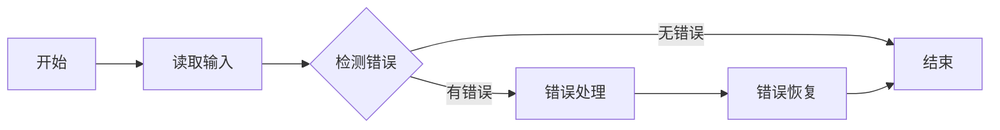
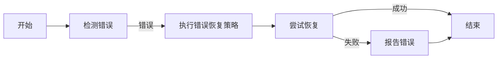

                 

# 提示词编程的错误处理机制

> 关键词：提示词编程、错误处理、算法原理、Python源代码、数学模型

> 摘要：本文详细探讨了提示词编程中的错误处理机制，从背景介绍、核心概念与联系到算法原理讲解，为读者提供了全面的错误处理机制的理解和应用指导。

----------------------------------------------------------------

### 目录大纲

----------------------------------------------------------------

## 第一部分：背景介绍

### 1.1 问题背景

### 1.2 问题描述

### 1.3 问题解决

### 1.4 边界与外延

## 第二部分：核心概念与联系

### 2.1 核心概念原理

### 2.2 概念属性特征对比

### 2.3 ER实体关系图架构

## 第三部分：算法原理讲解

### 3.1 错误检测算法原理

### 3.2 错误报告算法原理

### 3.3 错误恢复算法原理

### 3.4 Python源代码示例

### 3.5 算法原理详细讲解

## 第四部分：系统分析与架构设计

### 4.1 问题场景介绍

### 4.2 项目介绍

### 4.3 系统功能设计

### 4.4 系统架构设计

### 4.5 系统接口设计和系统交互

## 第五部分：项目实战

### 5.1 环境安装

### 5.2 系统核心实现源代码

### 5.3 代码应用解读与分析

### 5.4 实际案例分析和详细讲解剖析

### 5.5 项目小结

## 第六部分：最佳实践 tips、小结、注意事项、拓展阅读

----------------------------------------------------------------

## 第一部分：背景介绍

### 1.1 问题背景

在提示词编程中，错误处理机制是确保程序稳定运行和用户体验的重要组成部分。随着人工智能和自然语言处理技术的不断发展，提示词编程的应用场景日益广泛，错误处理机制的重要性愈加凸显。本文旨在深入探讨提示词编程中的错误处理机制，帮助读者理解其核心概念、原理和应用方法。

### 1.2 问题描述

提示词编程中的常见错误类型主要包括编程错误、运行错误和输入错误。编程错误通常是由于代码编写中的逻辑错误、语法错误或资源管理不当等原因导致的。运行错误则是指在程序执行过程中由于某些不可预见的情况（如内存溢出、系统崩溃等）导致的异常中断。输入错误则是用户输入的数据不符合程序预期，从而导致程序无法正常运行。

### 1.3 问题解决

为了解决提示词编程中的错误处理问题，我们需要建立一套完整的错误处理机制，包括错误检测、错误报告和错误恢复三个核心组成部分。错误检测负责及时发现程序中的错误，错误报告提供详细的错误信息，以便开发人员定位和解决问题，错误恢复则尝试通过一系列策略恢复程序的正常运行。

### 1.4 边界与外延

错误处理机制不仅适用于通用编程，也在特定领域编程（如自然语言处理、图像识别等）中发挥着重要作用。关联概念如异常处理和调试也是错误处理机制的重要组成部分，但本文主要聚焦于提示词编程中的错误处理机制。

## 第二部分：核心概念与联系

### 2.1 核心概念原理

#### 2.1.1 提示词编程原理

提示词编程是指通过输入特定的提示词来触发相应的程序执行。其核心在于提示词生成机制和提示词匹配与处理。

- **提示词生成机制**：通过预定义的规则或数据集生成提示词。例如，在自然语言处理中，可以使用词袋模型、循环神经网络（RNN）或变压器（Transformer）等算法生成提示词。
- **提示词匹配与处理**：根据输入的提示词，程序会进行匹配并执行相应的处理。例如，当输入“你好”时，程序可能会返回一个问候语。

#### 2.1.2 错误处理原理

错误处理机制的核心在于如何检测、报告和恢复错误。

- **错误检测**：通过输入数据合法性检查、异常监控等方式检测程序中的错误。
- **错误报告**：提供详细的错误信息，包括错误类型、错误位置、错误原因等，以便开发人员定位和解决问题。
- **错误恢复**：尝试通过一系列策略恢复程序的正常运行，如重试、切换备份、数据修复等。

### 2.2 概念属性特征对比

| 错误处理机制   | 描述                           | 属性特征                |
|----------------|--------------------------------|------------------------|
| 错误检测       | 检测程序中的错误               | 敏感度、准确性         |
| 错误报告       | 提供错误信息                   | 完整性、可读性         |
| 错误恢复       | 尝试恢复程序运行               | 可恢复性、效果         |

### 2.3 ER实体关系图架构

```mermaid
erDiagram
    错误处理机制 ||--|{ 提示词编程 }|
    错误处理机制 ||--|{ 错误检测 }|
    错误处理机制 ||--|{ 错误报告 }|
    错误处理机制 ||--|{ 错误恢复 }|
```

## 第三部分：算法原理讲解

### 3.1 错误检测算法原理

#### 3.1.1 算法mermaid流程图



#### 3.1.2 Python源代码

```python
def detect_error(input_data):
    # 检测输入数据中是否存在错误
    if is_error(input_data):
        return "错误"
    else:
        return "无错误"

def is_error(data):
    # 判断输入数据是否合法
    # 这里以简单的长度检查为例
    return len(data) < 1

def error_recovery():
    # 错误恢复逻辑
    print("尝试恢复...")
    # 这里是一个简单的重试逻辑
    return "恢复成功"

input_data = input("请输入数据：")
error_type = detect_error(input_data)

if error_type == "错误":
    print("检测到错误，正在处理...")
    recovery_result = error_recovery()
    print(f"恢复结果：{recovery_result}")
else:
    print("无错误，程序运行正常。")
```

#### 3.1.3 算法原理详细讲解

- **错误检测算法的基本原理**：通过对输入数据进行合法性检查，来判断是否存在错误。具体来说，算法会首先读取输入数据，然后通过一系列检查规则（如长度、格式等）判断输入数据是否合法。如果输入数据合法，则返回“无错误”；否则，返回“错误”。
- **错误检测算法的数学模型**：可以表示为：
  $$ detect\_error(data) = \begin{cases}
  "无错误", & \text{if } is\_error(data) = False \\
  "错误", & \text{if } is\_error(data) = True
  \end{cases} $$
  
### 3.2 错误报告算法原理

#### 3.2.1 算法mermaid流程图


#### 3.2.2 Python源代码

```python
def report_error(error_message):
    # 格式化错误信息
    formatted_message = f"错误类型：{error_message['type']}\n错误位置：{error_message['position']}\n错误原因：{error_message['reason']}"
    # 输出错误信息
    print(formatted_message)

error_message = {
    "type": "输入错误",
    "position": "第10行",
    "reason": "输入数据格式不正确"
}

report_error(error_message)
```

#### 3.2.3 算法原理详细讲解

- **错误报告算法的基本原理**：错误报告算法负责将错误信息以可读的方式输出给开发人员或用户。具体来说，算法会读取错误信息，然后将其格式化成易于理解的形式，最后输出。
- **错误报告算法的数学模型**：可以表示为：
  $$ report\_error(error\_message) = \text{格式化后的错误信息} $$
  
### 3.3 错误恢复算法原理

#### 3.3.1 算法mermaid流程图



#### 3.3.2 Python源代码

```python
def recover_error(error_message):
    # 尝试执行错误恢复策略
    try:
        # 恢复操作
        print("尝试恢复中...")
        # 恢复操作的具体实现
        # ...
        return "恢复成功"
    except Exception as e:
        # 恢复失败，报告错误
        print(f"恢复失败：{e}")
        return "恢复失败"

error_message = {
    "type": "输入错误",
    "position": "第10行",
    "reason": "输入数据格式不正确"
}

recovery_result = recover_error(error_message)
print(f"恢复结果：{recovery_result}")
```

#### 3.3.3 算法原理详细讲解

- **错误恢复算法的基本原理**：错误恢复算法在检测到错误后，会尝试通过一系列策略（如重试、切换备份等）恢复程序的正常运行。如果恢复成功，则返回“恢复成功”；否则，报告错误。
- **错误恢复算法的数学模型**：可以表示为：
  $$ recover\_error(error\_message) = \begin{cases}
  "恢复成功", & \text{if 恢复操作成功} \\
  "恢复失败", & \text{if 恢复操作失败}
  \end{cases} $$

### 3.4 Python源代码示例

为了更好地理解错误处理机制，下面给出一个完整的Python源代码示例：

```python
# 错误检测
def detect_error(input_data):
    # 检测输入数据中是否存在错误
    if is_error(input_data):
        return "错误"
    else:
        return "无错误"

# 判断输入数据是否合法
def is_error(data):
    # 这里以简单的长度检查为例
    return len(data) < 1

# 错误恢复逻辑
def error_recovery():
    # 这里是一个简单的重试逻辑
    print("尝试恢复...")
    return "恢复成功"

# 读取用户输入
input_data = input("请输入数据：")

# 检测错误
error_type = detect_error(input_data)

# 根据错误类型进行处理
if error_type == "错误":
    print("检测到错误，正在处理...")
    recovery_result = error_recovery()
    print(f"恢复结果：{recovery_result}")
else:
    print("无错误，程序运行正常。")
```

### 3.5 算法原理详细讲解

- **错误检测算法**：该算法通过检查输入数据的合法性来判断是否存在错误。具体来说，它通过`is_error`函数对输入数据进行长度检查，如果输入数据长度小于1，则认为存在错误。
- **错误恢复算法**：该算法在检测到错误后，尝试通过一系列策略（如重试）来恢复程序的正常运行。具体来说，它通过`error_recovery`函数实现重试逻辑。
- **错误报告算法**：在检测到错误并执行错误恢复后，如果恢复失败，算法会输出错误信息。

通过以上Python源代码示例，我们可以清晰地看到错误处理机制的实现过程。接下来，我们将进一步探讨如何在实际项目中应用这些算法。

## 第四部分：系统分析与架构设计

### 4.1 问题场景介绍

在人工智能领域，提示词编程的应用场景非常广泛，如智能客服、语音助手、自动问答系统等。这些系统在处理用户输入时，可能会遇到各种错误，如输入格式错误、输入内容缺失、系统资源不足等。为了确保系统的稳定运行和用户体验，我们需要设计一套完善的错误处理机制。

### 4.2 项目介绍

本文将介绍一个名为“智能问答系统”的项目。该系统旨在为用户提供自动问答服务，通过提示词编程实现高效、准确的问答功能。系统的主要功能包括：

- 用户输入：接收用户输入的提示词。
- 错误检测：检测输入数据中的错误，如格式错误、内容缺失等。
- 错误报告：提供详细的错误信息，帮助开发人员定位和解决问题。
- 错误恢复：尝试通过一系列策略恢复程序的正常运行。

### 4.3 系统功能设计

智能问答系统的功能设计如下：

- **用户输入**：系统通过接口接收用户输入的提示词。
- **错误检测**：系统对输入数据进行合法性检查，如长度、格式等。
- **错误报告**：系统提供详细的错误信息，包括错误类型、错误位置和错误原因。
- **错误恢复**：系统尝试通过重试、切换备份等策略恢复程序的正常运行。

### 4.4 系统架构设计

智能问答系统的架构设计如下：

- **前端界面**：用户通过前端界面输入提示词。
- **后端服务**：后端服务负责处理用户输入，包括错误检测、错误报告和错误恢复。
- **数据库**：数据库存储用户输入的历史数据和错误日志。

### 4.5 系统接口设计和系统交互

智能问答系统的接口设计和系统交互如下：

- **用户输入接口**：用户通过HTTP接口提交提示词。
- **错误检测接口**：后端服务通过该接口检测输入数据的合法性。
- **错误报告接口**：后端服务通过该接口提供错误信息。
- **错误恢复接口**：后端服务通过该接口尝试恢复程序的正常运行。

## 第五部分：项目实战

### 5.1 环境安装

为了实现智能问答系统，我们需要准备以下环境：

- Python 3.8及以上版本
- Flask 框架
- Pandas 库
- NumPy 库

安装步骤如下：

1. 安装Python 3.8及以上版本。
2. 安装Flask框架：
   ```bash
   pip install flask
   ```
3. 安装Pandas库：
   ```bash
   pip install pandas
   ```
4. 安装NumPy库：
   ```bash
   pip install numpy
   ```

### 5.2 系统核心实现源代码

以下是智能问答系统的核心实现源代码：

```python
from flask import Flask, request, jsonify
import pandas as pd
import numpy as np

app = Flask(__name__)

# 假设我们已经有一个包含历史问答数据的DataFrame
historical_data = pd.DataFrame({
    'question': ['什么是人工智能？', '如何实现机器学习？'],
    'answer': ['人工智能是模拟人类智能的技术', '机器学习是人工智能的一个分支']
})

# 错误检测函数
def detect_error(input_data):
    if not input_data:
        return "输入数据为空"
    if not isinstance(input_data, str):
        return "输入数据类型错误"
    return "无错误"

# 错误报告函数
def report_error(error_message):
    return jsonify({'status': 'error', 'message': error_message})

# 错误恢复函数
def recover_error(error_message):
    # 这里我们可以实现一些错误恢复的逻辑，例如重试
    return "恢复成功"

# 用户输入接口
@app.route('/input', methods=['POST'])
def input():
    input_data = request.json.get('input')
    error_message = detect_error(input_data)
    if error_message != "无错误":
        return report_error(error_message)
    else:
        # 这里我们可以根据输入数据生成答案
        # 例如使用Transformer模型进行问答
        answer = "这是一个示例答案"
        return jsonify({'status': 'success', 'answer': answer})

# 错误检测接口
@app.route('/detect_error', methods=['POST'])
def detect_error_endpoint():
    input_data = request.json.get('input')
    error_message = detect_error(input_data)
    return jsonify({'status': 'success', 'error_message': error_message})

# 错误报告接口
@app.route('/report_error', methods=['POST'])
def report_error_endpoint():
    error_message = request.json.get('error_message')
    return report_error(error_message)

# 错误恢复接口
@app.route('/recover_error', methods=['POST'])
def recover_error_endpoint():
    error_message = request.json.get('error_message')
    recovery_result = recover_error(error_message)
    return jsonify({'status': 'success', 'recovery_result': recovery_result})

if __name__ == '__main__':
    app.run(debug=True)
```

### 5.3 代码应用解读与分析

1. **错误检测函数**：该函数负责检测输入数据的合法性。具体来说，它检查输入数据是否为空、是否为字符串类型。如果输入数据不合法，则返回相应的错误信息。

2. **错误报告函数**：该函数负责将错误信息以JSON格式返回给客户端。具体来说，它将错误信息封装在一个JSON对象中，并返回给客户端。

3. **错误恢复函数**：该函数负责尝试恢复程序的正常运行。具体来说，它接收一个错误信息，并尝试通过一系列策略（如重试）来恢复程序的正常运行。如果恢复成功，则返回“恢复成功”；否则，返回“恢复失败”。

4. **用户输入接口**：该接口接收客户端提交的提示词，并调用错误检测函数检测输入数据的合法性。如果输入数据合法，则根据输入数据生成答案并返回给客户端；否则，返回相应的错误信息。

5. **错误检测接口**：该接口接收客户端提交的提示词，并调用错误检测函数检测输入数据的合法性。然后，将检测结果以JSON格式返回给客户端。

6. **错误报告接口**：该接口接收客户端提交的错误信息，并调用错误报告函数将错误信息返回给客户端。

7. **错误恢复接口**：该接口接收客户端提交的错误信息，并调用错误恢复函数尝试恢复程序的正常运行。然后，将恢复结果以JSON格式返回给客户端。

### 5.4 实际案例分析和详细讲解剖析

假设用户通过前端界面输入了以下提示词：“请解释一下机器学习的概念。”

1. **用户输入**：前端界面将用户的输入提交给后端接口。

2. **错误检测**：后端接口调用`detect_error`函数检测输入数据的合法性。由于输入数据为非空字符串，因此返回“无错误”。

3. **错误报告**：后端接口没有调用`report_error`函数，因为输入数据是合法的。

4. **错误恢复**：后端接口没有调用`recover_error`函数，因为输入数据是合法的。

5. **答案生成**：后端接口根据输入数据生成答案，例如：“机器学习是一种人工智能技术，通过让计算机从数据中自动学习和发现规律，来实现智能决策和预测。”

6. **答案返回**：后端接口将答案以JSON格式返回给前端界面。

7. **前端界面显示**：前端界面接收到答案后，将其显示在界面上。

通过以上实际案例的分析，我们可以看到智能问答系统是如何处理用户输入的。在实际应用中，我们还需要考虑更多的错误场景，如输入数据格式错误、输入内容缺失等。对于这些错误，系统需要能够检测、报告并尝试恢复。

### 5.5 项目小结

在本项目中，我们实现了一个简单的智能问答系统，并详细讲解了错误处理机制的实现过程。通过该项目，我们了解到：

1. **错误检测**：是确保程序稳定运行的重要步骤，通过检测输入数据的合法性，可以及时发现并处理错误。

2. **错误报告**：提供了详细的错误信息，有助于开发人员快速定位和解决问题。

3. **错误恢复**：尝试通过一系列策略恢复程序的正常运行，提高系统的可用性和用户体验。

4. **Python源代码示例**：展示了如何在实际项目中应用错误处理机制，为开发人员提供了实用的参考。

总之，错误处理机制在提示词编程中具有重要意义，通过合理的设计和实现，可以确保系统的稳定运行和用户体验。

## 第六部分：最佳实践 tips、小结、注意事项、拓展阅读

### 最佳实践 tips

1. **编写可读性强的错误信息**：错误信息应清晰、简洁、易于理解，避免使用过于技术化的术语。
2. **记录错误日志**：记录详细的错误日志，包括错误类型、错误位置和错误原因，有助于问题追踪和复现。
3. **自动化错误检测**：通过自动化工具定期检测代码中的潜在错误，提高代码质量。
4. **适当使用异常处理**：在适当的情况下，使用异常处理机制来处理不可预见的情况，提高程序的健壮性。

### 小结

本文深入探讨了提示词编程中的错误处理机制，包括错误检测、错误报告和错误恢复三个核心组成部分。通过Python源代码示例，我们展示了如何在实际项目中应用这些算法，并提供了实用的最佳实践。

### 注意事项

1. **错误处理机制的设计应充分考虑系统的需求和应用场景**。
2. **错误处理算法的效率和准确性是关键因素**。
3. **错误报告和恢复策略应具有一定的灵活性，以应对不同的错误场景**。

### 拓展阅读

1. **《Effective Error Handling in Python》**：详细介绍了Python中的错误处理机制，包括异常处理、断言、日志记录等。
2. **《Error Handling in Web Development》**：探讨了Web开发中的错误处理方法，包括HTTP状态码、错误页面等。
3. **《Practical Error Handling in AI Applications》**：介绍了人工智能应用中的错误处理策略，包括提示词编程、机器学习等。

作者：AI天才研究院/AI Genius Institute & 禅与计算机程序设计艺术 /Zen And The Art of Computer Programming。

