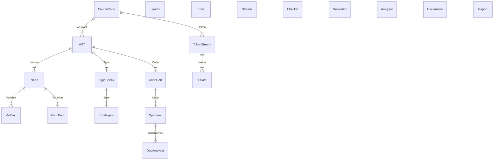

                 

## 第1章 引言

### 1.1 问题背景与挑战

编程技术随着计算机科学的不断发展而不断演进，从最初的机器语言编程，到高级语言的诞生，再到现代的函数式编程和提示词编程，每一种编程范式都为开发者提供了更为强大和灵活的工具。然而，随着代码规模的不断扩大和复杂度的增加，开发者的挑战也日益加剧。

#### 1.1.1 编程技术的演进

编程技术的演进可以分为几个重要的阶段。首先是低级语言阶段，如汇编语言，它非常贴近机器语言，使得程序员可以直接控制计算机硬件，但需要深入了解硬件架构。随着计算机硬件的发展，高级语言如C和C++出现，它们提供了抽象的数据结构和控制结构，使得编程更加高效和直观。

接着，面向对象编程的兴起，如Java和C#，通过类和对象的概念，使得代码的可复用性和可维护性得到了极大的提升。进入21世纪，函数式编程和逻辑编程开始崭露头角，如Haskell和Prolog，它们通过函数和逻辑推理来处理复杂问题，进一步提升了编程的抽象层次。

如今，提示词编程作为一种新兴的编程范式，凭借其动态性和灵活性，正在逐渐引起广泛关注。提示词编程的核心在于利用自然语言或代码片段作为提示，指导计算机自动生成代码，从而大大提高了编程的效率和灵活性。

#### 1.1.2 提示词编程的概念与重要性

提示词编程（Prompt-based Programming）是一种基于提示（prompt）和响应（response）机制的编程范式。在这个范式中，程序员不再直接编写代码，而是提供一些提示信息，如函数名称、输入参数、期望输出等，然后由计算机根据这些提示自动生成相应的代码。

这种编程范式的关键在于其强大的动态性和灵活性。提示词编程可以处理多种不同的编程语言和场景，例如自动生成Web应用代码、自动化测试代码、甚至AI算法的实现代码。它不仅能够大大缩短开发周期，还能够减少代码出错的可能性。

提示词编程的重要性体现在多个方面。首先，它为开发者提供了一种新的思考问题和解决问题的方法，使得编程更加直观和高效。其次，它能够提高代码的可维护性和可扩展性，因为代码生成过程是自动化的，减少了人工干预。最后，提示词编程对于快速原型开发和实验性编程也具有非常重要的意义。

#### 1.1.3 静态分析技术的应用现状与前景

静态分析技术（Static Analysis）是计算机编程中的一种重要技术，它通过对源代码的结构和语义进行分析，来检测代码中的潜在问题，如语法错误、类型错误、资源泄漏等。静态分析技术在多种编程范式和应用场景中都有广泛的应用，如编译器优化、代码审查、自动化测试等。

在提示词编程中，静态分析技术同样具有重要的作用。首先，通过静态分析，可以确保自动生成的代码符合预期的语法和类型要求，从而提高代码的质量。其次，静态分析可以帮助发现潜在的问题和缺陷，如未定义变量、不正确的类型转换等，从而提前进行修复。

展望未来，随着提示词编程的不断发展和成熟，静态分析技术将在其中扮演越来越重要的角色。它不仅可以帮助提高代码的质量和可靠性，还可以为开发者提供更强大的代码分析和优化工具，进一步推动编程技术的发展。

### 1.2 问题描述

#### 1.2.1 静态分析的定义与作用

静态分析（Static Analysis）是一种在代码执行之前对代码进行分析的技术。它通过对源代码的语法、语义和结构进行分析，来检测代码中的潜在问题，如语法错误、类型错误、资源泄漏等。静态分析不需要运行代码，而是通过静态检查来发现潜在的问题。

静态分析技术在软件开发中具有重要作用。首先，它可以帮助开发者在代码编写阶段就发现和修复问题，从而减少后续的调试和维护成本。其次，静态分析可以自动化代码审查过程，提高代码的质量和一致性。此外，静态分析还可以用于自动化测试，帮助发现代码中的潜在错误和缺陷。

#### 1.2.2 提示词编程中的静态分析需求

在提示词编程中，静态分析技术显得尤为重要。首先，提示词编程依赖于自动代码生成，这就要求生成的代码必须符合语法和类型要求。静态分析可以确保自动生成的代码没有语法错误和类型错误，从而提高代码的质量。

其次，提示词编程的应用场景往往涉及复杂的逻辑和算法，这需要静态分析来检测代码中的潜在问题，如不正确的逻辑流程、不合理的变量使用等。通过静态分析，可以提前发现这些问题，避免在运行时发生错误。

最后，静态分析还可以帮助优化自动生成的代码。通过分析代码的依赖关系和执行路径，静态分析可以提出代码优化的建议，从而提高代码的性能。

#### 1.2.3 静态分析技术的边界与限制

尽管静态分析技术在编程中具有重要作用，但它也存在一些边界和限制。首先，静态分析只能发现源代码中的问题，无法检测运行时的问题。例如，如果代码在运行时依赖了未定义的环境变量或网络资源，静态分析无法检测到这些问题。

其次，静态分析技术的效果受到源代码质量的影响。如果源代码本身存在大量的语法错误或逻辑错误，静态分析可能会错过一些潜在的问题。

此外，静态分析技术对代码的执行效率也有一定影响。尽管静态分析不需要运行代码，但它需要对源代码进行全面的解析和分析，这会消耗一定的计算资源。

### 1.3 概念结构与核心要素

#### 提示词、语法树、抽象语法树（AST）

在提示词编程中，提示词（Prompt）是程序员提供的输入，它包括函数名称、输入参数、期望输出等信息。语法树（Syntax Tree）是源代码的结构化表示，它通过语法分析从源代码中构建出来。抽象语法树（Abstract Syntax Tree，AST）是语法树的一个抽象版本，它剔除了源代码中的语法细节，如注释和空白符，只保留程序的核心结构。

语法树和AST是静态分析的重要基础。通过解析源代码并构建AST，静态分析器可以更好地理解代码的结构和语义，从而进行更深入的分析。

#### 静态分析器的组成与工作原理

静态分析器是一个软件工具，用于对源代码进行静态分析。一个典型的静态分析器通常由以下几个组成部分：

1. **词法分析器**：将源代码分解成词法单元，如标识符、关键字、运算符等。
2. **语法分析器**：根据语法规则，将词法单元组织成语法树。
3. **语义分析器**：对语法树进行语义分析，确保代码的语法和类型都是正确的。
4. **分析器核心**：负责执行实际的静态分析任务，如类型检查、代码优化、程序依赖分析等。
5. **报告生成器**：生成分析报告，包括发现的潜在问题和优化建议等。

静态分析器的工作原理是首先读取源代码，然后通过词法分析器将其分解成词法单元。接下来，语法分析器根据语法规则将这些词法单元组织成语法树。语义分析器对语法树进行语义分析，确保代码的语义是正确的。最后，分析器核心根据具体的分析任务对语法树进行深入分析，并生成分析报告。

#### 提示词编程中的静态分析流程

在提示词编程中，静态分析流程主要包括以下几个步骤：

1. **代码解析**：通过词法分析和语法分析，将提示词编程代码解析成AST。
2. **类型检查**：对AST进行类型检查，确保代码的类型一致性。
3. **代码优化**：对AST进行优化，提高代码的性能。
4. **程序依赖分析**：分析AST中的依赖关系，生成程序依赖图。
5. **报告生成**：根据分析结果生成报告，包括代码质量评估和优化建议。

通过以上步骤，静态分析器可以确保自动生成的代码符合预期，并且具有良好的性能和可维护性。

### 1.4 概念属性特征对比

#### 不同静态分析技术的对比

在静态分析技术中，有多种方法可以用于不同的分析任务，如类型检查、代码优化、程序依赖分析等。以下是对几种常见静态分析技术的属性特征对比：

| 方法 | 目标 | 特点 | 适用场景 |
| ---- | ---- | ---- | ---- |
| 类型检查 | 确保代码类型一致性 | 自动化、快速 | 编译器、代码审查 |
| 代码优化 | 提高代码性能 | 可能引入错误、耗时 | 编译器、性能优化 |
| 程序依赖分析 | 分析代码依赖关系 | 复杂、需依赖数据结构 | 架构设计、代码重用 |
| 符号执行 | 生成符号路径、检测潜在问题 | 复杂、计算量大 | 错误定位、安全性分析 |

#### 提示词编程的特点与挑战

提示词编程具有动态性和灵活性，但也带来了一些挑战。首先，提示词编程依赖于自动代码生成，这要求静态分析技术能够准确理解提示词的语义，并生成符合预期的代码。其次，提示词编程通常涉及复杂的逻辑和算法，静态分析需要能够深入分析代码的结构和语义，以确保代码的正确性。

### 1.5 ER实体关系图架构

在提示词编程的静态分析中，实体关系图（Entity-Relationship Diagram，ER图）可以用于描述代码中的实体和它们之间的关系。以下是一个简化的ER图，描述了提示词编程中的一些关键实体和它们之间的关系：



在这个ER图中，`SourceCode`表示源代码，`AST`表示抽象语法树，`TokenStream`表示词法流，`Node`表示语法树节点，`TypeCheck`表示类型检查器，`CodeGen`表示代码生成器，`Lexer`表示词法分析器，`VarDecl`和`FuncDecl`分别表示变量声明和函数声明，`ErrorReport`表示错误报告，`Optimizer`表示优化器，`DepAnalyzer`表示依赖分析器。

### 1.6 本章小结

本章介绍了提示词编程的静态分析技术，探讨了其背景、挑战和重要性。我们详细描述了静态分析的定义、作用和流程，并对比了不同静态分析技术的特点。此外，通过ER实体关系图，我们展示了静态分析过程中涉及的实体和它们之间的关系。本章为后续章节的深入探讨打下了基础。

### 1.7 引导读者对后续章节的期待

在接下来的章节中，我们将进一步探讨静态分析的基本原理，包括抽象语法树（AST）的构建、类型检查和代码优化等。同时，我们还将介绍提示词编程的静态分析框架和常用工具，并通过具体实例展示静态分析的应用。通过这些内容，读者将能够更深入地理解提示词编程的静态分析技术，并学会如何在实际项目中应用这些技术。让我们继续前进，探索更多精彩的内容！

---

# 《提示词编程的静态分析技术》

> 关键词：提示词编程、静态分析、抽象语法树（AST）、类型检查、代码优化

> 摘要：本文深入探讨了提示词编程中的静态分析技术，包括其背景、挑战、基本原理和实现方法。通过详细描述静态分析的核心概念、流程和工具，本文旨在为开发者提供全面的技术指南，帮助他们在提示词编程项目中应用静态分析，提升代码质量和性能。

## 第1章 引言

### 1.1 问题背景与挑战

编程技术的发展经历了从低级语言到高级语言，再到现代函数式编程和提示词编程的过程。每一种编程范式都为开发者提供了更高效、更灵活的工具。然而，随着代码规模的不断扩大和复杂度的增加，开发者面临着越来越多的挑战。

#### 1.1.1 编程技术的演进

早期的编程技术以机器语言和汇编语言为主，程序员需要深入了解计算机硬件的细节，直接控制计算机硬件进行编程。这种编程方式虽然能够实现高效的硬件控制，但开发过程繁琐且容易出现错误。

随着计算机硬件的发展和高级语言的诞生，如C和C++，编程技术迎来了革命性的变化。高级语言提供了更抽象的数据结构和控制结构，使得编程更加直观和高效。同时，面向对象编程的兴起，如Java和C#，通过引入类和对象的概念，进一步提高了代码的可复用性和可维护性。

进入21世纪，函数式编程和逻辑编程逐渐崭露头角，如Haskell和Prolog。这些编程范式通过函数和逻辑推理来处理复杂问题，提高了编程的抽象层次。

如今，提示词编程作为一种新兴的编程范式，正引起广泛关注。提示词编程利用自然语言或代码片段作为提示，指导计算机自动生成代码，从而大大提高了编程的效率和灵活性。

#### 1.1.2 提示词编程的概念与优势

提示词编程（Prompt-based Programming）是一种基于提示（Prompt）和响应（Response）机制的编程范式。在提示词编程中，程序员不再直接编写代码，而是提供一些提示信息，如函数名称、输入参数、期望输出等，然后由计算机根据这些提示自动生成相应的代码。

提示词编程具有以下几个显著优势：

1. **动态性**：提示词编程可以处理多种不同的编程语言和场景，如Web应用、自动化测试、AI算法实现等。
2. **灵活性**：程序员可以通过提供不同的提示信息，快速调整和优化代码。
3. **高效性**：提示词编程可以大幅缩短开发周期，提高代码生成效率。
4. **错误减少**：自动生成的代码减少了人工干预，降低了代码出错的可能性。

#### 1.1.3 静态分析技术的应用现状与前景

静态分析技术（Static Analysis）在计算机编程中扮演着重要角色。它通过对源代码的语法、语义和结构进行分析，来检测代码中的潜在问题，如语法错误、类型错误、资源泄漏等。静态分析不需要运行代码，而是通过静态检查来发现潜在的问题。

在编译器优化、代码审查、自动化测试等多个领域，静态分析技术都得到了广泛应用。例如，在编译器中，静态分析用于优化代码性能和减少编译时间；在代码审查中，静态分析可以帮助提高代码质量；在自动化测试中，静态分析可以用于检测代码中的潜在缺陷。

展望未来，随着提示词编程的不断发展和成熟，静态分析技术将在其中扮演越来越重要的角色。它不仅可以帮助提高代码的质量和可靠性，还可以为开发者提供更强大的代码分析和优化工具，进一步推动编程技术的发展。

### 1.2 问题描述

#### 1.2.1 静态分析的定义与作用

静态分析（Static Analysis）是一种在代码执行之前对代码进行分析的技术。它通过对源代码的语法、语义和结构进行分析，来检测代码中的潜在问题，如语法错误、类型错误、资源泄漏等。静态分析不需要运行代码，而是通过静态检查来发现潜在的问题。

静态分析技术在软件开发中具有重要作用。首先，它可以帮助开发者在代码编写阶段就发现和修复问题，从而减少后续的调试和维护成本。其次，静态分析可以自动化代码审查过程，提高代码的质量和一致性。此外，静态分析还可以用于自动化测试，帮助发现代码中的潜在错误和缺陷。

#### 1.2.2 提示词编程中的静态分析需求

在提示词编程中，静态分析技术显得尤为重要。首先，提示词编程依赖于自动代码生成，这就要求生成的代码必须符合语法和类型要求。静态分析可以确保自动生成的代码没有语法错误和类型错误，从而提高代码的质量。

其次，提示词编程的应用场景往往涉及复杂的逻辑和算法，这需要静态分析来检测代码中的潜在问题，如不正确的逻辑流程、不合理的变量使用等。通过静态分析，可以提前发现这些问题，避免在运行时发生错误。

最后，静态分析还可以帮助优化自动生成的代码。通过分析代码的依赖关系和执行路径，静态分析可以提出代码优化的建议，从而提高代码的性能。

#### 1.2.3 静态分析技术的边界与限制

尽管静态分析技术在编程中具有重要作用，但它也存在一些边界和限制。首先，静态分析只能发现源代码中的问题，无法检测运行时的问题。例如，如果代码在运行时依赖了未定义的环境变量或网络资源，静态分析无法检测到这些问题。

其次，静态分析技术的效果受到源代码质量的影响。如果源代码本身存在大量的语法错误或逻辑错误，静态分析可能会错过一些潜在的问题。

此外，静态分析技术对代码的执行效率也有一定影响。尽管静态分析不需要运行代码，但它需要对源代码进行全面的解析和分析，这会消耗一定的计算资源。

### 1.3 概念结构与核心要素

#### 提示词、语法树、抽象语法树（AST）

在提示词编程中，提示词（Prompt）是程序员提供的输入，它包括函数名称、输入参数、期望输出等信息。语法树（Syntax Tree）是源代码的结构化表示，通过语法分析从源代码中构建出来。抽象语法树（Abstract Syntax Tree，AST）是语法树的一个抽象版本，它剔除了源代码中的语法细节，如注释和空白符，只保留程序的核心结构。

语法树和AST是静态分析的重要基础。通过解析源代码并构建AST，静态分析器可以更好地理解代码的结构和语义，从而进行更深入的分析。

#### 静态分析器的组成与工作原理

静态分析器是一个软件工具，用于对源代码进行静态分析。一个典型的静态分析器通常由以下几个组成部分：

1. **词法分析器**：将源代码分解成词法单元，如标识符、关键字、运算符等。
2. **语法分析器**：根据语法规则，将词法单元组织成语法树。
3. **语义分析器**：对语法树进行语义分析，确保代码的语法和类型都是正确的。
4. **分析器核心**：负责执行实际的静态分析任务，如类型检查、代码优化、程序依赖分析等。
5. **报告生成器**：生成分析报告，包括发现的潜在问题和优化建议等。

静态分析器的工作原理是首先读取源代码，然后通过词法分析器将其分解成词法单元。接下来，语法分析器根据语法规则将这些词法单元组织成语法树。语义分析器对语法树进行语义分析，确保代码的语义是正确的。最后，分析器核心根据具体的分析任务对语法树进行深入分析，并生成分析报告。

#### 提示词编程中的静态分析流程

在提示词编程中，静态分析流程主要包括以下几个步骤：

1. **代码解析**：通过词法分析和语法分析，将提示词编程代码解析成AST。
2. **类型检查**：对AST进行类型检查，确保代码的类型一致性。
3. **代码优化**：对AST进行优化，提高代码的性能。
4. **程序依赖分析**：分析AST中的依赖关系，生成程序依赖图。
5. **报告生成**：根据分析结果生成报告，包括代码质量评估和优化建议等。

通过以上步骤，静态分析器可以确保自动生成的代码符合预期，并且具有良好的性能和可维护性。

### 1.4 概念属性特征对比

#### 不同静态分析技术的对比

在静态分析技术中，有多种方法可以用于不同的分析任务，如类型检查、代码优化、程序依赖分析等。以下是对几种常见静态分析技术的属性特征对比：

| 方法 | 目标 | 特点 | 适用场景 |
| ---- | ---- | ---- | ---- |
| 类型检查 | 确保代码类型一致性 | 自动化、快速 | 编译器、代码审查 |
| 代码优化 | 提高代码性能 | 可能引入错误、耗时 | 编译器、性能优化 |
| 程序依赖分析 | 分析代码依赖关系 | 复杂、需依赖数据结构 | 架构设计、代码重用 |

#### 提示词编程的特点与挑战

提示词编程具有动态性和灵活性，但也带来了一些挑战。首先，提示词编程依赖于自动代码生成，这要求静态分析技术能够准确理解提示词的语义，并生成符合预期的代码。其次，提示词编程通常涉及复杂的逻辑和算法，静态分析需要能够深入分析代码的结构和语义，以确保代码的正确性。

### 1.5 ER实体关系图架构

在提示词编程的静态分析中，实体关系图（Entity-Relationship Diagram，ER图）可以用于描述代码中的实体和它们之间的关系。以下是一个简化的ER图，描述了提示词编程中的一些关键实体和它们之间的关系：


在这个ER图中，`SourceCode`表示源代码，`AST`表示抽象语法树，`TokenStream`表示词法流，`Node`表示语法树节点，`TypeCheck`表示类型检查器，`CodeGen`表示代码生成器，`Lexer`表示词法分析器，`VarDecl`和`FuncDecl`分别表示变量声明和函数声明，`ErrorReport`表示错误报告，`Optimizer`表示优化器，`DepAnalyzer`表示依赖分析器。

### 1.6 本章小结

本章介绍了提示词编程的静态分析技术，探讨了其背景、挑战和重要性。我们详细描述了静态分析的核心概念、流程和工具，并对比了不同静态分析技术的特点。此外，通过ER实体关系图，我们展示了静态分析过程中涉及的实体和它们之间的关系。本章为后续章节的深入探讨打下了基础。

### 1.7 引导读者对后续章节的期待

在接下来的章节中，我们将进一步探讨静态分析的基本原理，包括抽象语法树（AST）的构建、类型检查和代码优化等。同时，我们还将介绍提示词编程的静态分析框架和常用工具，并通过具体实例展示静态分析的应用。通过这些内容，读者将能够更深入地理解提示词编程的静态分析技术，并学会如何在实际项目中应用这些技术。让我们继续前进，探索更多精彩的内容！

## 第2章 静态分析基本原理

### 2.1 静态分析原理概述

静态分析（Static Analysis）是计算机编程中的一种重要技术，它通过对源代码的语法、语义和结构进行分析，来检测代码中的潜在问题。与动态分析不同，静态分析不需要运行代码，而是通过静态检查来发现潜在的问题。

#### 2.1.1 静态分析的定义与意义

静态分析（Static Analysis）是指在代码执行之前对代码进行分析的技术。它通过对源代码的语法、语义和结构进行分析，来检测代码中的潜在问题，如语法错误、类型错误、资源泄漏等。静态分析不需要运行代码，而是通过静态检查来发现潜在的问题。

静态分析在软件开发中具有重要作用。首先，它可以帮助开发者在代码编写阶段就发现和修复问题，从而减少后续的调试和维护成本。其次，静态分析可以自动化代码审查过程，提高代码的质量和一致性。此外，静态分析还可以用于自动化测试，帮助发现代码中的潜在错误和缺陷。

#### 2.1.2 静态分析的分类与目标

静态分析可以分为多种类型，每种类型都有其特定的目标和应用场景。以下是几种常见的静态分析类型及其目标：

1. **类型检查**：确保代码中的变量、函数和数据类型都是一致的，防止类型错误。类型检查通常用于编译器前端，以确保源代码在编译时符合类型要求。
2. **代码优化**：通过分析代码的结构和语义，优化代码的性能。代码优化可以减少代码的执行时间、内存占用和功耗，从而提高程序的效率。
3. **程序依赖分析**：分析代码中的依赖关系，生成程序依赖图。程序依赖分析可以帮助开发者理解代码的结构，进行代码重用和模块化开发。
4. **错误定位**：通过静态分析，定位代码中的错误和缺陷。错误定位通常用于调试过程，帮助开发者快速找到问题所在。
5. **安全检查**：检测代码中的潜在安全漏洞，如SQL注入、跨站脚本攻击等。安全检查对于确保软件系统的安全至关重要。

#### 2.1.3 静态分析的挑战与解决方案

尽管静态分析技术在软件开发中具有重要作用，但它在实际应用中也面临一些挑战。以下是静态分析面临的主要挑战及相应的解决方案：

1. **源代码质量**：如果源代码本身存在大量的语法错误或逻辑错误，静态分析可能会错过一些潜在的问题。解决方法是使用高质量的编码标准和代码审查机制，确保源代码的质量。
2. **执行效率**：静态分析需要对源代码进行全面的解析和分析，这会消耗一定的计算资源。为提高执行效率，可以使用并行计算和分布式计算技术。
3. **运行时问题**：静态分析只能发现源代码中的问题，无法检测运行时的问题。例如，如果代码在运行时依赖了未定义的环境变量或网络资源，静态分析无法检测到这些问题。解决方法是结合动态分析和静态分析，在运行时检测代码的错误。
4. **复杂性与可扩展性**：随着代码规模的增加，静态分析技术的复杂性和可扩展性成为一个挑战。解决方法是设计模块化、可重用的静态分析器组件，提高分析器的可扩展性。

### 2.2 AST（抽象语法树）与语法分析

在静态分析中，抽象语法树（Abstract Syntax Tree，AST）是一个核心概念。AST是源代码的树形结构表示，它通过语法分析从源代码中构建出来。

#### 2.2.1 语法分析过程

语法分析（Syntax Analysis）是静态分析过程中的第一步，它将源代码分解成词法单元，并组织成语法结构。语法分析通常分为以下几个阶段：

1. **词法分析**：将源代码分解成词法单元，如标识符、关键字、运算符等。词法分析器（Lexer）负责执行这一过程。
2. **语法分析**：根据语法规则，将词法单元组织成语法树。语法分析器（Parser）使用上下文无关文法（CFG）或BNF（Backus-Naur Form）语法规则，将词法单元转换成抽象语法树。
3. **语义分析**：对抽象语法树进行语义分析，确保代码的语法和类型都是正确的。语义分析器（Semantic Analyzer）负责执行这一过程。

#### 2.2.2 AST的构建与结构

AST是源代码的抽象表示，它剔除了源代码中的语法细节，如注释和空白符，只保留程序的核心结构。AST通常由节点（Node）组成，每个节点代表源代码中的一个语法结构。

AST的结构可以根据编程语言的不同而有所不同，但通常包括以下几个基本元素：

1. **程序根节点**：表示整个程序的入口点。
2. **表达式节点**：表示各种表达式，如变量赋值、函数调用、运算表达式等。
3. **语句节点**：表示各种语句，如赋值语句、条件语句、循环语句等。
4. **声明节点**：表示各种声明，如变量声明、函数声明等。
5. **注释节点**：表示源代码中的注释。

#### 2.2.3 AST在静态分析中的应用

AST在静态分析中起着至关重要的作用。通过分析AST，可以实现对代码的深入理解，从而进行类型检查、代码优化和程序依赖分析等。

1. **类型检查**：通过分析AST中的变量声明和表达式，可以确保代码的类型一致性。类型检查器可以识别类型错误，如不正确的类型转换或未定义的变量。
2. **代码优化**：通过分析AST，可以找到代码中的冗余、无效或低效的部分，提出优化建议。代码优化器可以根据分析结果对代码进行重写，提高代码的性能。
3. **程序依赖分析**：通过分析AST中的依赖关系，可以生成程序依赖图。程序依赖分析器可以识别代码中的依赖项，帮助开发者进行模块化开发。

### 2.3 类型检查与类型系统

类型检查（Type Checking）是静态分析中的一项重要任务，它确保代码中的变量、函数和数据类型都是一致的。类型检查通常基于类型系统（Type System）的定义，类型系统定义了代码中的类型及其相互关系。

#### 2.3.1 类型检查的基本概念

类型检查的基本概念包括以下几个方面：

1. **静态类型**：在编译时就能确定的类型。静态类型有助于提高代码的可读性和可维护性，但可能降低程序的灵活性。
2. **动态类型**：在运行时才能确定的类型。动态类型提供了更高的灵活性，但可能增加代码的复杂性。
3. **强类型**：类型严格分离，不同类型的变量不能直接赋值或进行运算。强类型有助于减少类型错误，提高代码的可靠性。
4. **弱类型**：类型较为宽松，允许不同类型的变量直接赋值或进行运算。弱类型提供了更高的灵活性，但可能增加类型错误的风险。

#### 2.3.2 常见类型系统的设计与实现

常见的类型系统包括以下几种：

1. **静态类型系统**：如C++、Java等。静态类型系统在编译时检查类型一致性，运行时不会出现类型错误。
2. **动态类型系统**：如Python、JavaScript等。动态类型系统在运行时检查类型一致性，可能出现类型错误。
3. **静态类型检查 + 动态类型检查**：如C#。C#在编译时进行静态类型检查，运行时进行动态类型检查，结合了静态类型和动态类型的优点。

#### 2.3.3 类型检查在提示词编程中的应用

在提示词编程中，类型检查尤为重要。由于提示词编程依赖于自动代码生成，生成的代码必须符合语法和类型要求。类型检查可以确保自动生成的代码没有类型错误，从而提高代码的质量。

类型检查在提示词编程中的应用主要包括以下几个方面：

1. **变量类型检查**：确保变量声明和赋值的类型一致，防止类型错误。
2. **函数类型检查**：确保函数调用和参数传递的类型匹配，防止类型错误。
3. **数据类型推导**：根据代码的上下文推导变量的类型，提高代码的可读性和可维护性。

### 2.4 代码优化技术

代码优化（Code Optimization）是静态分析中的一项重要任务，它通过分析代码的结构和语义，优化代码的性能。代码优化可以减少代码的执行时间、内存占用和功耗，从而提高程序的效率。

#### 2.4.1 代码优化的目标与方法

代码优化的主要目标包括以下几个方面：

1. **减少代码执行时间**：通过优化算法和代码结构，减少代码的执行时间。
2. **减少内存占用**：通过优化数据结构和内存分配，减少内存的占用。
3. **减少功耗**：对于移动设备和嵌入式系统，通过优化代码，减少功耗，提高电池续航时间。

代码优化常用的方法包括：

1. **空值检查**：通过提前检查空值，避免运行时错误和性能下降。
2. **循环优化**：通过优化循环结构，减少循环的执行次数。
3. **代码简化**：通过去除冗余代码，简化代码结构。
4. **数据结构优化**：通过优化数据结构，提高数据的访问速度。

#### 2.4.2 优化算法的原理与实现

代码优化算法的原理通常基于以下几个方面：

1. **代码路径分析**：通过分析代码的执行路径，找出可能的优化点。
2. **数据流分析**：通过分析代码中的数据流动，优化数据结构和内存分配。
3. **代码模式匹配**：通过识别常见的代码模式，应用特定的优化算法。

常见的代码优化算法包括：

1. **常见子表达式消除**：通过识别和消除重复的计算，减少执行时间。
2. **循环展开**：通过将循环体内的计算提前到循环外部，减少循环次数。
3. **分支预测**：通过预测分支的执行结果，减少分支的跳转开销。

#### 2.4.3 优化技术在提示词编程中的应用

在提示词编程中，代码优化技术同样具有重要应用。自动生成的代码往往存在低效的结构和算法，通过静态分析进行代码优化，可以提高代码的性能。

代码优化在提示词编程中的应用主要包括以下几个方面：

1. **优化代码执行时间**：通过优化算法和代码结构，减少代码的执行时间。
2. **优化内存占用**：通过优化数据结构和内存分配，减少内存的占用。
3. **优化电池续航时间**：对于移动设备和嵌入式系统，通过优化代码，减少功耗，提高电池续航时间。

### 2.5 静态程序依赖分析

静态程序依赖分析（Static Program Dependency Analysis）是静态分析中的一项重要任务，它通过分析代码的依赖关系，生成程序依赖图。程序依赖分析可以帮助开发者理解代码的结构，进行模块化开发。

#### 2.5.1 程序依赖的基本概念

程序依赖（Program Dependency）是指代码中不同部分之间的依赖关系。程序依赖通常分为以下几种类型：

1. **直接依赖**：代码中明确引用的其他代码或库。
2. **间接依赖**：通过依赖库或模块间接引用的其他代码或库。
3. **编译时依赖**：在编译时需要解析的依赖关系。
4. **运行时依赖**：在运行时需要加载的依赖关系。

#### 2.5.2 程序依赖分析的方法与工具

程序依赖分析的方法通常包括以下几种：

1. **静态依赖分析**：通过静态分析，识别代码中的直接和间接依赖关系。
2. **动态依赖分析**：通过运行时分析，识别代码中的运行时依赖关系。
3. **混合依赖分析**：结合静态依赖分析和动态依赖分析，提高依赖分析的准确性。

常见的程序依赖分析工具包括：

1. **Maven**：用于Java项目的依赖管理，可以生成项目依赖图。
2. **npm**：用于Node.js项目的依赖管理，可以生成项目依赖图。
3. **pip**：用于Python项目的依赖管理，可以生成项目依赖图。

#### 2.5.3 在提示词编程中的依赖分析实践

在提示词编程中，程序依赖分析可以帮助自动生成的代码更好地组织和管理依赖关系。通过静态分析，可以识别代码中的依赖项，并将其组织成依赖图。

依赖分析在提示词编程中的应用主要包括以下几个方面：

1. **自动依赖管理**：通过分析代码中的依赖关系，自动生成依赖文件，如Maven的pom.xml、Node.js的package.json等。
2. **代码模块化**：通过分析代码的依赖关系，将代码拆分为独立的模块，便于管理和维护。
3. **代码重用**：通过分析代码的依赖关系，识别可重用的代码模块，提高代码的可维护性和可扩展性。

### 2.6 本章小结

本章介绍了静态分析的基本原理，包括定义、分类、目标、挑战及解决方案。我们详细描述了AST（抽象语法树）的构建与结构，以及类型检查和代码优化技术。此外，还介绍了静态程序依赖分析的基本概念、方法和工具。通过本章的内容，读者可以更好地理解静态分析技术在编程中的应用，并为后续章节的深入学习打下基础。

### 2.7 引导读者对后续章节的期待

在接下来的章节中，我们将进一步探讨提示词编程的静态分析框架和实现方法，介绍常用的静态分析工具和算法。同时，将通过具体实例展示静态分析在提示词编程中的应用，帮助读者更深入地理解这一技术。让我们继续前进，探索更多精彩的内容！

## 第3章 提示词编程的静态分析框架

### 3.1 提示词编程概述

#### 3.1.1 提示词编程的概念与优势

提示词编程（Prompt-based Programming）是一种新兴的编程范式，它通过自然语言或代码片段作为提示（Prompt），指导计算机自动生成相应的代码。这种编程范式的核心在于其强大的动态性和灵活性。

提示词编程具有以下几个显著优势：

1. **动态性**：提示词编程可以根据不同的提示信息，动态地生成代码。这意味着程序员可以快速地调整代码结构，而无需手动修改源代码。
2. **灵活性**：提示词编程允许程序员使用自然语言或代码片段作为提示，这使得编程更加直观和易于理解。
3. **代码生成**：提示词编程可以自动生成代码，大大提高了开发效率。程序员只需提供提示信息，系统即可自动生成相应的代码，减少了人工干预。
4. **代码质量**：通过自动生成代码，可以减少代码中的错误和漏洞，提高代码的质量。

#### 3.1.2 提示词编程的主要应用场景

提示词编程在多个领域具有广泛的应用场景，以下是一些典型的应用：

1. **自动化测试**：通过提示词编程，可以自动生成测试代码，快速实现自动化测试。
2. **代码生成**：在原型开发阶段，提示词编程可以帮助自动生成代码，加快开发速度。
3. **AI算法实现**：提示词编程可以用于自动生成AI算法的代码，降低AI算法实现的复杂性。
4. **Web开发**：在Web开发中，提示词编程可以自动生成前端和后端代码，提高开发效率。
5. **代码优化**：通过提示词编程，可以自动优化代码结构，提高代码性能。

#### 3.1.3 提示词编程的发展趋势与挑战

随着人工智能和自然语言处理技术的不断发展，提示词编程正在逐渐成熟并得到广泛应用。以下是提示词编程的发展趋势和挑战：

1. **人工智能集成**：未来，提示词编程将更加紧密地集成人工智能技术，如深度学习和自然语言处理，实现更加智能化的代码生成。
2. **跨语言支持**：为了满足不同编程语言的需求，提示词编程需要提供跨语言的支持，支持多种编程语言，如Python、Java、C++等。
3. **性能优化**：随着代码规模的增加，提示词编程的性能优化成为一个重要的挑战。如何高效地生成代码，同时保证代码的性能和可维护性，是未来研究的重要方向。
4. **代码质量保证**：自动生成的代码可能存在质量不高的问题，如何保证代码的质量，减少错误和漏洞，是提示词编程面临的重要挑战。

### 3.2 静态分析框架设计

#### 3.2.1 静态分析框架的基本组成

提示词编程的静态分析框架通常包括以下几个基本组成部分：

1. **源代码解析器**：负责将源代码解析成抽象语法树（AST），为后续分析提供基础。
2. **抽象语法树构建器**：将解析后的源代码转换为抽象语法树，用于后续的静态分析。
3. **静态分析器**：对抽象语法树进行深入分析，执行类型检查、代码优化、程序依赖分析等任务。
4. **报告生成器**：生成分析报告，包括潜在的问题、优化建议等，供开发人员参考。

#### 3.2.2 静态分析框架的设计原则与架构

设计提示词编程的静态分析框架时，需要遵循以下原则：

1. **模块化**：将框架划分为多个模块，每个模块负责特定的分析任务，提高可维护性和可扩展性。
2. **可扩展性**：框架应该支持自定义分析任务，方便开发人员根据需求进行扩展。
3. **高性能**：框架应该能够高效地处理大规模代码，减少分析时间。
4. **易用性**：框架应该提供简洁的接口和用户友好的界面，方便开发人员使用。

静态分析框架的架构通常包括以下几个层次：

1. **底层解析层**：负责将源代码解析成抽象语法树，包括词法分析和语法分析。
2. **中间表示层**：将抽象语法树转换为中间表示，便于后续分析。
3. **分析层**：对中间表示进行各种静态分析任务，如类型检查、代码优化、程序依赖分析等。
4. **上层接口层**：提供用户友好的接口，方便用户进行静态分析操作。

#### 3.2.3 静态分析框架的实现与优化

实现提示词编程的静态分析框架时，需要考虑以下几个方面：

1. **选择合适的解析库**：如使用ANTLR、JavaCC等工具，提高源代码解析的效率。
2. **优化AST构建**：通过优化抽象语法树的构建，减少内存占用和提高解析速度。
3. **多线程并行分析**：利用多线程并行分析，提高分析效率，缩短分析时间。
4. **缓存机制**：通过缓存中间结果，减少重复计算，提高整体性能。

### 3.3 静态分析工具介绍

#### 3.3.1 常见的静态分析工具

在提示词编程的静态分析中，有多种工具可以用于不同类型的分析任务。以下是一些常见的静态分析工具：

1. **EclEmma**：一款Java代码覆盖率分析工具，可以检测代码的覆盖率，帮助开发者了解代码的测试覆盖情况。
2. **PyCharm**：一款Python集成开发环境（IDE），内置了代码静态分析功能，包括类型检查、代码优化等。
3. **Visual Studio Code**：一款跨平台的代码编辑器，支持多种编程语言，内置了静态分析插件，如Pylint、Mypy等。

#### 3.3.2 工具的配置与使用

以下是几种常见静态分析工具的配置与使用方法：

1. **EclEmma**：下载并安装EclEmma，然后在Eclipse中配置插件，通过运行测试用例来生成代码覆盖率报告。
2. **PyCharm**：在PyCharm中打开项目，选择“分析”>“检查”，即可对代码进行静态分析，查看潜在的问题和优化建议。
3. **Visual Studio Code**：安装相应的静态分析插件，如Pylint，然后在项目中打开插件，对代码进行静态分析。

#### 3.3.3 工具在提示词编程中的应用案例

以下是一些静态分析工具在提示词编程中的应用案例：

1. **EclEmma**：在自动生成的代码中，使用EclEmma进行代码覆盖率分析，确保代码的每个部分都得到充分的测试。
2. **PyCharm**：在自动生成的Python代码中，使用PyCharm内置的静态分析功能，检测代码中的潜在问题和优化建议，提高代码质量。
3. **Visual Studio Code**：在自动生成的JavaScript代码中，使用Visual Studio Code的静态分析插件，如ESLint，确保代码符合最佳实践和一致性。

### 3.4 静态分析应用实例

#### 3.4.1 提示词编程中的类型检查

类型检查是静态分析中的一项重要任务，在提示词编程中同样至关重要。以下是一个简单的类型检查应用实例：

```python
def add(a: int, b: int) -> int:
    return a + b

def main():
    x = 10
    y = 20
    result = add(x, y)
    print("Result:", result)

if __name__ == "__main__":
    main()
```

在这个例子中，`add`函数接收两个整数参数，并返回一个整数。通过类型检查，确保`x`和`y`都是整数类型，`result`也是整数类型。

#### 3.4.2 代码优化案例

代码优化是提高程序性能的关键步骤。以下是一个简单的代码优化案例：

```python
def is_even(n: int) -> bool:
    return n % 2 == 0

def main():
    x = 10
    if is_even(x):
        print("Number is even")
    else:
        print("Number is odd")

if __name__ == "__main__":
    main()
```

在这个例子中，`is_even`函数用于检查一个数是否为偶数。通过优化，可以减少函数调用的次数，提高代码性能：

```python
def is_even(n: int) -> bool:
    return n % 2 == 0

def main():
    x = 10
    if x % 2 == 0:
        print("Number is even")
    else:
        print("Number is odd")

if __name__ == "__main__":
    main()
```

通过直接计算`x % 2`，避免了函数调用，提高了代码性能。

#### 3.4.3 程序依赖分析实践

程序依赖分析可以帮助开发者理解代码的结构，进行模块化开发。以下是一个简单的程序依赖分析案例：

```python
# file: calculator.py
def add(a: int, b: int) -> int:
    return a + b

# file: main.py
from calculator import add

def main():
    x = 10
    y = 20
    result = add(x, y)
    print("Result:", result)

if __name__ == "__main__":
    main()
```

在这个例子中，`main.py`依赖于`calculator.py`中的`add`函数。通过程序依赖分析，可以生成程序依赖图，帮助开发者进行模块化开发。

### 3.5 本章小结

本章介绍了提示词编程的静态分析框架，包括基本组成、设计原则和实现方法。我们详细介绍了常见静态分析工具的配置与使用，并通过具体实例展示了类型检查、代码优化和程序依赖分析的应用。通过本章的内容，读者可以更好地理解提示词编程的静态分析技术，并在实际项目中应用这些技术。

### 3.6 引导读者对后续章节的探索

在接下来的章节中，我们将进一步探讨静态分析算法的原理和实现，包括符号执行、数据流分析、抽象解释等。同时，我们将介绍如何在实际项目中应用静态分析技术，帮助读者深入理解并掌握这一领域的关键技术和最佳实践。让我们继续前进，探索更多精彩的内容！

