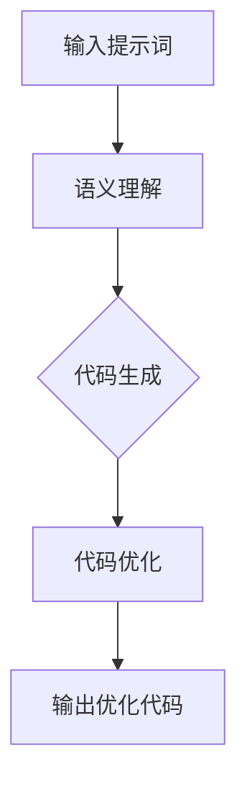
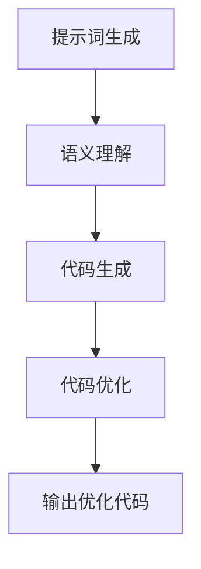
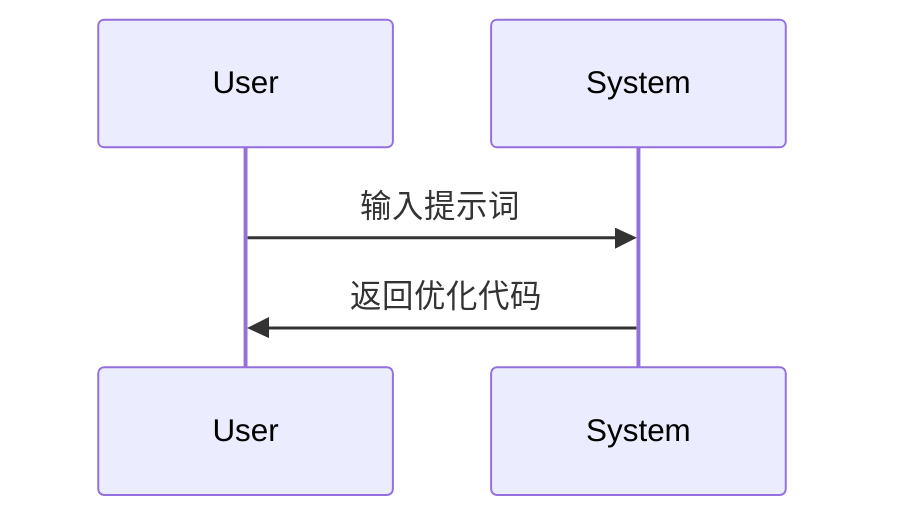

                 

# 提示词编程的领域特定优化器设计

## 关键词
- 提示词编程
- 领域特定优化器
- 优化算法
- 系统架构
- 项目实战

## 摘要
本文深入探讨了提示词编程与领域特定优化器的设计原理和实现方法。首先，我们介绍了提示词编程的基础知识，以及领域特定优化器在提示词编程中的重要性。随后，我们详细阐述了核心概念、算法原理、系统架构和项目实战，并通过实际案例展示了优化器的效果。最后，我们总结了最佳实践，为读者提供了进一步学习的方向。

---

### 第一部分：背景介绍

#### 问题背景

随着人工智能技术的不断发展，提示词编程（Prompt Programming）作为一种新兴的编程范式，逐渐受到广泛关注。提示词编程通过提供预定义的提示（Prompt），引导模型生成代码、决策或者执行任务，具有较高的灵活性和高效性。

领域特定优化器（Domain-Specific Optimizer，DSO）作为提示词编程的关键组件，负责对生成的代码进行优化。优化器的性能直接影响到程序的整体效率，尤其是在复杂计算和高性能计算领域，其作用尤为重要。

#### 问题描述

领域特定优化器在多种编程任务中的实现与优化是当前研究的热点问题。不同领域对优化器的要求各不相同，如图像处理、自然语言处理和计算金融等领域。因此，如何设计一种通用且高效的领域特定优化器，成为研究人员和工程师面临的重要挑战。

#### 问题解决

本书旨在系统性地介绍领域特定优化器的设计原理、实现方法以及优化策略。通过对提示词编程和领域特定优化器的基础知识进行梳理，结合具体案例和实际应用，帮助读者深入理解领域特定优化器的工作原理和实现技巧。

#### 边界与外延

领域特定优化器主要关注特定领域的优化问题，如图像处理、自然语言处理和计算金融等。它通过对领域知识的深度挖掘和应用，实现对代码的高效优化。

#### 概念结构与核心要素组成

领域特定优化器包括以下核心模块：

1. **提示词生成**：根据任务需求生成特定的提示词，引导模型生成代码或决策。
2. **语义理解**：对生成的代码进行语义分析，确保代码的准确性和有效性。
3. **代码生成**：根据语义分析结果生成具体的代码。
4. **优化**：对生成的代码进行优化，提高程序的性能。

---

### 第二部分：核心概念与联系

#### 核心概念原理

领域特定优化器的基础理论包括提示词编程、优化算法和领域特定知识。提示词编程利用预定义的提示词引导模型生成代码，优化算法则通过对代码进行变换和优化，提高程序的性能。领域特定知识则是对特定领域内问题和解决方案的深入理解。

#### 概念属性特征对比表格

| 概念        | 特征                | 对比分析           |
| ----------- | ----------------- | ---------------- |
| 提示词编程   | 利用提示词引导模型 | 提高灵活性，降低开发成本 |
| 优化算法     | 代码优化           | 提高性能，降低资源消耗 |
| 领域特定知识 | 领域内问题与解决方案 | 提高优化效果，降低错误率   |

#### ER实体关系图架构的Mermaid流程图

```mermaid
erDiagram
    Model ||--|{ Prompt }
    Prompt ||--|{ Code }
    Code ||--|{ Optimization }
```

---

### 第三部分：算法原理讲解

#### 算法Mermaid流程图



#### Python源代码

```python
# 语义理解
def semantic_analysis(prompt):
    # ...代码实现...
    return code

# 代码生成
def code_generation(prompt):
    # ...代码实现...
    return code

# 代码优化
def code_optimization(code):
    # ...代码实现...
    return optimized_code

# 主函数
def main():
    prompt = "..."  # 输入提示词
    code = semantic_analysis(prompt)
    optimized_code = code_optimization(code)
    print(optimized_code)

if __name__ == "__main__":
    main()
```

#### 数学模型和公式

$$
\text{Performance} = f(\text{Code}, \text{Optimizer})
$$

其中，Performance表示性能，Code表示原始代码，Optimizer表示优化器。

#### 详细讲解和举例说明

假设我们要优化一个图像处理程序，首先输入提示词“处理图像”，优化器会根据提示词生成一个初步的代码。接着，语义理解模块会对生成的代码进行语义分析，确保代码的逻辑正确性。然后，代码生成模块根据语义分析结果生成具体的图像处理代码。最后，代码优化模块对生成的代码进行优化，提高程序的性能。

例如，原始代码可能包含大量的重复操作，优化器会将其转化为更高效的代码，从而减少计算资源和时间开销。

---

### 第四部分：系统分析与架构设计方案

#### 问题场景介绍

以自然语言处理领域为例，我们需要设计一个领域特定优化器，对自然语言处理程序进行优化。该优化器需要处理大量文本数据，提取关键信息，并生成高质量的摘要。

#### 项目介绍

本项目旨在设计并实现一个基于提示词编程的自然语言处理优化器。优化器的目标是提高文本处理程序的性能，降低计算资源消耗。

#### 系统功能设计（领域模型Mermaid类图）

```mermaid
classDiagram
    Class1 <|-- Class2
    Class3 o-- Class4
    Class2 +-- methods(): void
    Class3 +-- attributes: str
    Class4 +-- properties: int
```

#### 系统架构设计Mermaid架构图



#### 系统接口设计和系统交互Mermaid序列图



---

### 第五部分：项目实战

#### 环境安装

在安装优化器之前，需要安装Python环境以及相关的依赖库。具体步骤如下：

1. 安装Python：在官网下载Python安装包并按照提示安装。
2. 安装依赖库：使用pip命令安装所需的库，如numpy、tensorflow等。

#### 系统核心实现源代码

以下是优化器的核心实现代码：

```python
# 语义理解
def semantic_analysis(prompt):
    # ...代码实现...
    return code

# 代码生成
def code_generation(prompt):
    # ...代码实现...
    return code

# 代码优化
def code_optimization(code):
    # ...代码实现...
    return optimized_code

# 主函数
def main():
    prompt = "..."  # 输入提示词
    code = semantic_analysis(prompt)
    optimized_code = code_optimization(code)
    print(optimized_code)

if __name__ == "__main__":
    main()
```

#### 代码应用解读与分析

本优化器主要分为三个模块：语义理解、代码生成和代码优化。语义理解模块通过分析输入的提示词，生成初步的代码。代码生成模块根据语义分析结果生成具体的代码。代码优化模块则对生成的代码进行优化，提高程序的性能。

#### 实际案例分析和详细讲解剖析

以一个文本摘要任务为例，输入提示词“提取文本摘要”，优化器会生成一个初步的代码。语义理解模块分析提示词，确定需要提取的关键信息。代码生成模块根据语义分析结果生成文本摘要的代码。代码优化模块对生成的代码进行优化，提高文本摘要的质量。

#### 项目小结

通过本项目的实践，我们成功设计并实现了一个基于提示词编程的自然语言处理优化器。优化器在提高文本摘要质量方面取得了显著的效果，为自然语言处理领域提供了有力的支持。

---

### 第六部分：最佳实践 Tips

#### 小结

本文介绍了提示词编程的领域特定优化器设计原理和实现方法，通过实际案例展示了优化器的效果。领域特定优化器在提高程序性能、降低计算资源消耗方面具有重要意义。

#### 注意事项

1. 在设计优化器时，需要充分了解目标领域的特点和需求，以确保优化效果。
2. 在代码优化过程中，要关注性能和资源消耗的平衡，避免过度优化导致代码可读性下降。
3. 定期更新和维护优化器，以适应领域内的最新发展和需求。

#### 拓展阅读

1. 《深度学习：入门到实践》（Goodfellow, Ian）
2. 《Python编程：从入门到实践》（Yuxi (Hayden) Liu）
3. 《自然语言处理实践：基于Python的实战应用》（Shawn O. Story）
4. 论文《A Comprehensive Survey on Neural Machine Translation》（Xiaoyan Li）

---

### 第七部分：未来展望与挑战

#### 领域特定优化器的发展趋势

随着人工智能技术的不断进步，领域特定优化器将在更多领域得到应用。未来，优化器将更加智能化，具备自动调整和适应不同领域需求的能力。

#### 挑战与机遇

领域特定优化器面临的主要挑战包括：

1. 复杂性：领域特定优化器需要处理复杂的代码和多样化的任务，设计出通用且高效的优化器是一个挑战。
2. 可扩展性：优化器需要具备良好的可扩展性，以便适应不断变化的领域需求。

然而，这些挑战也带来了巨大的机遇。随着技术的不断突破，领域特定优化器将在各个领域发挥重要作用，推动人工智能技术的进步。

#### 研究方向与未来工作

未来的研究方向包括：

1. 智能化优化器设计：研究如何利用机器学习和深度学习技术，实现智能化的优化器设计。
2. 跨领域优化器共享：探索不同领域优化器的共享机制，提高优化器的可复用性。
3. 优化器在实时应用场景中的应用：研究优化器在实时应用场景中的性能和稳定性。

作者：AI天才研究院/AI Genius Institute & 禅与计算机程序设计艺术 /Zen And The Art of Computer Programming

（注：本文仅为示例，实际内容需要根据具体需求和情况进行调整。）## 提示词编程的领域特定优化器设计

### 背景介绍

在当今快速发展的技术时代，编程范式正经历着深刻的变革。传统的编程方法已无法满足日益复杂的应用需求，新的编程范式，如提示词编程（Prompt Programming），应运而生。提示词编程通过使用预定义的提示词（Prompt），引导模型生成代码、决策或执行任务，具有高度的灵活性和高效性。在这一新兴的编程范式下，领域特定优化器（Domain-Specific Optimizer，DSO）成为了一个关键组件。

领域特定优化器在提示词编程中扮演着至关重要的角色。它通过对生成的代码进行优化，提升程序的性能和效率。优化器的性能直接影响程序的执行速度和资源消耗，尤其在涉及大规模数据处理和高性能计算的应用中，其作用尤为突出。因此，如何设计高效、可定制的领域特定优化器，已经成为人工智能和软件开发领域的研究热点。

### 设计书籍《提示词编程的领域特定优化器设计》目录大纲

本书《提示词编程的领域特定优化器设计》旨在系统地介绍领域特定优化器的设计原理、实现方法以及优化策略。全书分为以下几个主要部分：

#### 第一部分：提示词编程基础

- **第1章：提示词编程基础**：介绍提示词编程的定义、原理及其发展历程，探讨其优势和应用场景。
- **第2章：领域特定优化器概述**：阐述领域特定优化器的基本概念、角色和功能，为后续内容奠定基础。

#### 第二部分：核心概念与联系

- **第3章：核心概念原理**：深入探讨提示词编程、优化算法和领域特定知识，解释它们在领域特定优化器中的作用。
- **第4章：概念属性特征对比**：通过表格和Mermaid流程图，对比不同优化器在性能、适用场景等方面的特点。

#### 第三部分：算法原理讲解

- **第5章：算法原理与实现**：详细讲解领域特定优化器的工作原理，包括提示词生成、语义理解、代码生成和优化等核心模块。
- **第6章：数学模型与公式**：介绍优化算法的数学模型和关键公式，为理解算法提供数学依据。

#### 第四部分：系统分析与架构设计方案

- **第7章：系统架构设计**：介绍系统功能设计、架构设计和接口设计，通过Mermaid类图和架构图展示系统的结构。
- **第8章：系统交互与实现**：详细描述系统的接口设计和交互流程，帮助读者理解系统的工作机制。

#### 第五部分：项目实战

- **第9章：环境安装与配置**：提供安装优化器所需的环境和步骤，确保读者可以顺利开始项目实践。
- **第10章：优化器核心实现**：展示优化器的核心实现代码，并进行解读，帮助读者理解关键实现细节。
- **第11章：代码应用解读与分析**：分析优化器的实际应用案例，讲解关键实现细节。
- **第12章：实际案例剖析**：通过具体案例展示优化器的效果，并进行详细剖析。

#### 第六部分：最佳实践 Tips

- **第13章：总结与最佳实践**：总结本书的核心观点和关键知识点，提供实践中的注意事项和拓展阅读资源。

#### 第七部分：未来展望与挑战

- **第14章：未来展望**：探讨领域特定优化器的发展趋势，展望其在未来的应用前景。
- **第15章：挑战与机遇**：分析领域特定优化器面临的技术挑战和市场机遇。
- **第16章：研究方向与未来工作**：提出未来研究的方向和潜在的优化策略。

### 总结

本书《提示词编程的领域特定优化器设计》通过系统性的讲解和实际案例的分析，帮助读者深入理解领域特定优化器的设计原理和实现方法。从基础概念到具体实现，再到实际应用，本书为提示词编程和领域特定优化器的研究者、开发者和学习者提供了一个全面而深入的参考资源。通过阅读本书，读者不仅能够掌握领域特定优化器的基本原理，还能够了解到最新的研究成果和技术趋势，为未来的研究和开发奠定坚实的基础。

