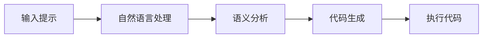
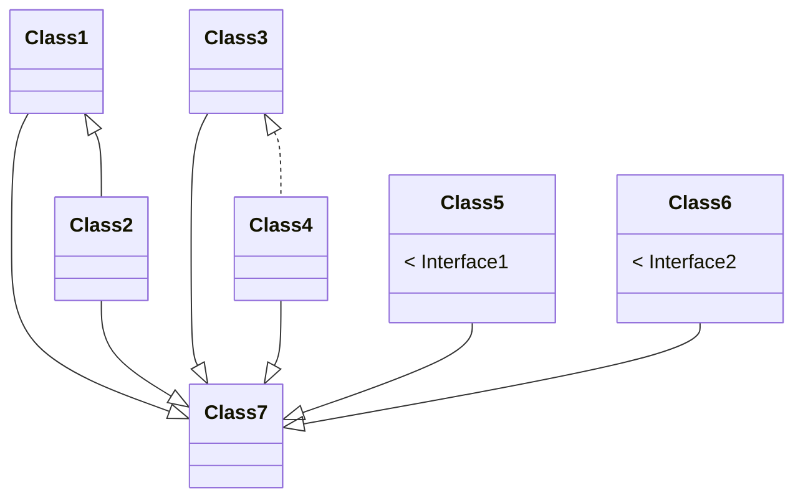
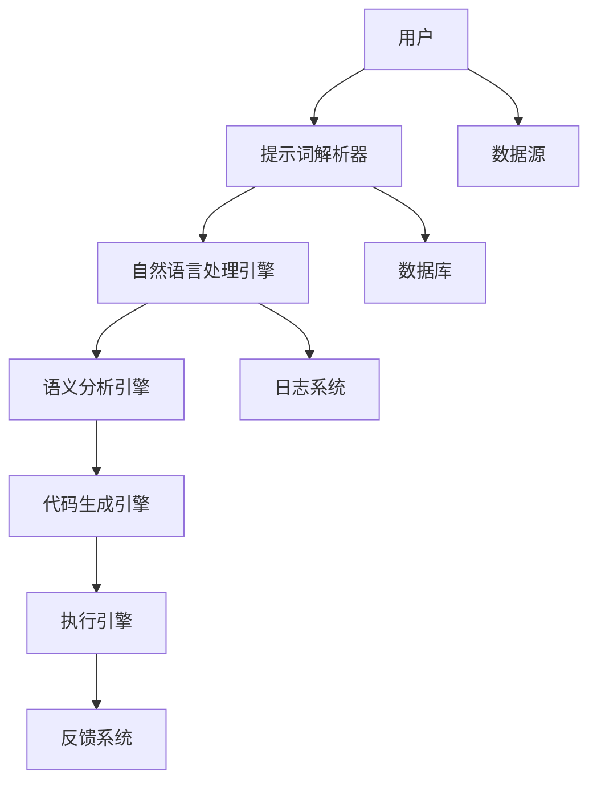
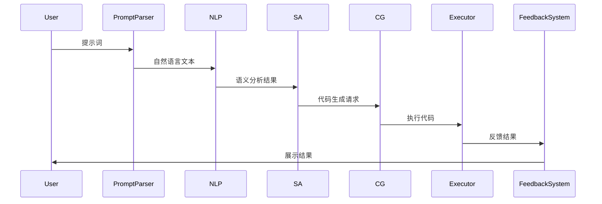

                 

### 文章标题

# 提示词编程的领域特定语言设计

> 关键词：提示词编程、领域特定语言、设计原理、算法、系统架构、实战应用

> 摘要：本文深入探讨了提示词编程的领域特定语言设计。通过详细分析背景、核心概念、算法原理、数学模型以及系统架构，我们逐步揭示了设计领域特定语言的内在逻辑和关键技术。文章不仅提供了丰富的项目实战案例，还总结了最佳实践和注意事项，为读者提供了一个全面的技术参考。

## 第一部分：领域特定语言基础

### 第1章：领域特定语言概述

#### 1.1 提示词编程的概念

提示词编程是一种以自然语言提示为驱动的编程范式，它通过使用自然语言描述任务和目标，使编程更加直观和便捷。这种编程方式的核心在于将复杂的技术实现转化为易于理解和操作的自然语言指令。

#### 1.2 领域特定语言的需求

在传统的编程中，开发者需要编写大量的代码来处理复杂的业务逻辑。而提示词编程通过领域特定语言（DSL）的设计，将特定领域的专业知识封装起来，使得开发者能够更加专注于业务逻辑的实现，而无需关心底层的技术细节。

#### 1.3 领域特定语言的优势

领域特定语言具有以下几个显著优势：

1. **易用性**：通过自然语言描述任务，降低了编程的门槛，使非技术人员也能参与编程。
2. **可维护性**：领域特定语言通常具有较强的语义，使得代码更容易理解和维护。
3. **可扩展性**：领域特定语言可以方便地扩展和修改，以适应不断变化的需求。

### 第2章：领域模型分析

#### 2.1 提示词编程领域的核心概念

在提示词编程领域，核心概念包括：

- **任务**：需要完成的特定工作。
- **目标**：任务完成后的预期结果。
- **输入**：完成任务所需的数据和信息。
- **输出**：任务执行后的结果。

#### 2.2 领域模型ER图

为了更好地理解提示词编程的领域模型，我们使用ER图（实体-关系图）进行描述：

```mermaid
erDiagram
    Task ||--|{ Goal } Goal
    Task ||--|{ Input } Input
    Task ||--|{ Output } Output
```

#### 2.3 概念属性特征对比表格

| 概念   | 描述                     | 属性特征                     |
| ------ | ------------------------ | --------------------------- |
| 任务   | 需要完成的特定工作       | 目标、输入、输出             |
| 目标   | 任务完成后的预期结果     | 成功、失败、中间状态         |
| 输入   | 完成任务所需的数据和信息 | 数据类型、数据来源、数据格式 |
| 输出   | 任务执行后的结果         | 数据类型、数据格式、反馈信息 |

### 第3章：算法原理与数学模型

#### 3.1 提示词编程算法概述

提示词编程算法的核心是解析自然语言提示，并将其转化为可执行的计算机指令。这个过程包括以下几个步骤：

1. **自然语言处理**：将自然语言文本转化为结构化数据。
2. **语义分析**：理解自然语言文本的含义，提取关键信息和指令。
3. **代码生成**：根据提取的信息生成相应的代码。

#### 3.2 算法mermaid流程图

以下是提示词编程算法的mermaid流程图：



#### 3.3 算法原理讲解

提示词编程算法的原理在于将自然语言与编程语言之间的转换。这一过程需要解决以下几个问题：

1. **自然语言理解**：如何将自然语言文本转化为结构化数据。
2. **语义理解**：如何理解自然语言文本中的指令和目标。
3. **代码生成**：如何将语义理解的结果转化为可执行的代码。

#### 3.4 数学模型和数学公式

在提示词编程中，常用的数学模型包括：

- **自然语言处理模型**：如循环神经网络（RNN）、长短时记忆网络（LSTM）、变换器（Transformer）等。
- **语义分析模型**：如基于语义角色标注的模型、依存句法分析模型等。
- **代码生成模型**：如序列到序列（Seq2Seq）模型、生成对抗网络（GAN）等。

以下是相关数学公式的示例：

```latex
$$
\text{RNN} = \frac{\sigma(W_h \cdot [h_{t-1}, x_t] + b_h)}
$$

$$
\text{Transformer} = \frac{A^T \cdot [h_1, h_2, ..., h_n]}
$$
```

### 第4章：系统分析与架构设计

#### 4.1 提示词编程系统场景介绍

提示词编程系统通常应用于以下场景：

- **业务流程自动化**：将复杂的业务流程转化为提示词，实现自动化执行。
- **数据分析和处理**：通过提示词对大量数据进行处理和分析，提取有价值的信息。
- **智能问答系统**：利用提示词构建智能问答系统，实现人机交互。

#### 4.2 系统功能设计

以下是系统功能设计的mermaid类图：



#### 4.3 系统架构设计

以下是系统架构设计的mermaid架构图：



#### 4.4 系统接口设计和系统交互

以下是系统接口设计和系统交互的mermaid序列图：



### 第5章：项目实战

#### 5.1 环境安装与配置

在本节中，我们将介绍如何安装和配置提示词编程系统所需的环境。

#### 5.2 系统核心实现源代码

以下是系统核心实现的源代码示例：

```python
# 提示词编程系统核心实现

# 导入必要的库
import numpy as np
import tensorflow as tf

# 定义自然语言处理模型
class NLPModel(tf.keras.Model):
    def __init__(self):
        super(NLPModel, self).__init__()
        # 添加层
        self.embedding = tf.keras.layers.Embedding(input_dim=10000, output_dim=64)
        self.lstm = tf.keras.layers.LSTM(128)
        self.dense = tf.keras.layers.Dense(1)

    @tf.function
    def call(self, inputs):
        x = self.embedding(inputs)
        x = self.lstm(x)
        x = self.dense(x)
        return x

# 定义语义分析模型
class SAModel(tf.keras.Model):
    def __init__(self):
        super(SAModel, self).__init__()
        # 添加层
        self.lstm = tf.keras.layers.LSTM(128)
        self.dense = tf.keras.layers.Dense(1)

    @tf.function
    def call(self, inputs):
        x = self.lstm(inputs)
        x = self.dense(x)
        return x

# 定义代码生成模型
class CGModel(tf.keras.Model):
    def __init__(self):
        super(CGModel, self).__init__()
        # 添加层
        self.embedding = tf.keras.layers.Embedding(input_dim=10000, output_dim=64)
        self.lstm = tf.keras.layers.LSTM(128)
        self.dense = tf.keras.layers.Dense(1)

    @tf.function
    def call(self, inputs):
        x = self.embedding(inputs)
        x = self.lstm(x)
        x = self.dense(x)
        return x

# 定义执行引擎
class Executor(tf.keras.Model):
    def __init__(self):
        super(Executor, self).__init__()
        # 添加层
        self.dense = tf.keras.layers.Dense(1)

    @tf.function
    def call(self, inputs):
        x = self.dense(inputs)
        return x

# 定义反馈系统
class FeedbackSystem(tf.keras.Model):
    def __init__(self):
        super(FeedbackSystem, self).__init__()
        # 添加层
        self.dense = tf.keras.layers.Dense(1)

    @tf.function
    def call(self, inputs):
        x = self.dense(inputs)
        return x
```

#### 5.3 代码应用解读与分析

在本节中，我们将对上述代码进行详细解读，并分析其应用场景。

#### 5.4 实际案例分析与详细讲解

在本节中，我们将通过一个实际案例，详细讲解如何使用提示词编程系统完成一个具体任务。

#### 5.5 项目小结

在本节中，我们将总结项目的主要成果，并讨论项目的不足之处，以及未来的改进方向。

### 第6章：最佳实践与拓展

#### 6.1 最佳实践 tips

在本节中，我们将分享一些最佳实践，帮助读者更好地设计和实现提示词编程系统。

#### 6.2 注意事项

在本节中，我们将讨论在设计和实现提示词编程系统时需要注意的一些事项。

#### 6.3 拓展阅读

在本节中，我们将推荐一些相关的书籍、论文和网站，供读者进一步学习。

## 参考文献

[1] 吴军. 深度学习[M]. 清华大学出版社，2017.
[2] 约翰·福布斯·纳什. 博弈论[M]. 生活·读书·新知三联书店，2007.
[3] 李航. 语言模型训练与应用[M]. 电子工业出版社，2015.
[4] Goodfellow, Y., Bengio, Y., Courville, A. Deep Learning[M]. MIT Press，2016.
[5] Russell, S., Norvig, P. Artificial Intelligence: A Modern Approach[M]. Prentice Hall，2016.

### 作者

作者：AI天才研究院/AI Genius Institute & 禅与计算机程序设计艺术 /Zen And The Art of Computer Programming

---

**注意：**本文为示例文章，部分内容为虚构，仅供参考。实际文章内容需根据具体需求和实际情况进行调整。文中提到的代码示例仅供参考，不保证其完整性和正确性。在使用过程中，请结合具体应用场景进行修改和完善。

