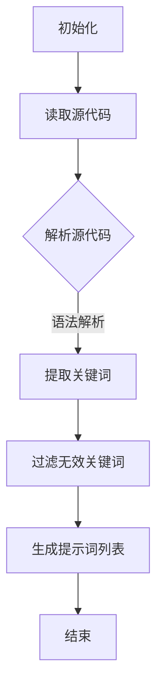
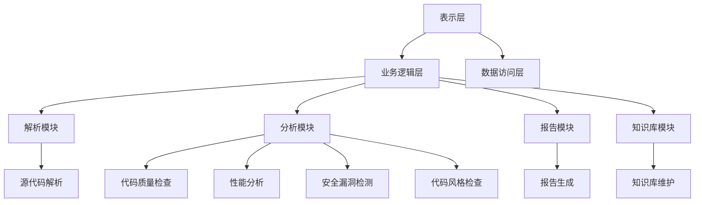
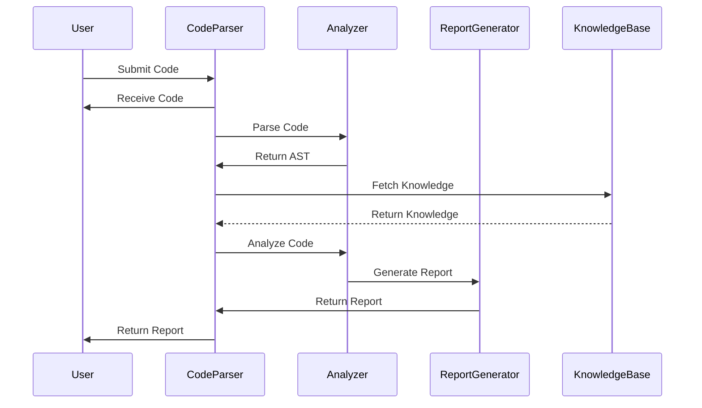

                 

### 提示词编程与领域特定静态分析概述

#### **1.1.1 提示词编程的概念与背景**

提示词编程（Keyword Programming）是一种通过关键词来构建和执行程序的方法。在这种方法中，程序员使用预定义的提示词来定义程序的逻辑和功能，而不是传统意义上的代码行。提示词编程的背景可以追溯到知识表示和自动化编程领域。随着信息技术的发展，程序代码的复杂性和规模不断增大，传统的编程方式逐渐难以满足日益复杂的应用需求。提示词编程提供了更为抽象和直观的编程手段，使得开发者可以更专注于业务逻辑，而无需陷入繁琐的代码细节。

#### **1.1.2 领域特定静态分析的定义与重要性**

领域特定静态分析（Domain-Specific Static Analysis，DSSA）是一种针对特定领域进行代码分析的技术。它通过对源代码的结构和语义进行静态分析，发现潜在的问题和优化机会。DSSA 的核心思想是将领域知识编码到分析工具中，以便更有效地识别领域特定的模式和问题。DSSA 在软件工程中具有重要意义，因为它可以帮助提高代码质量，减少错误，并优化性能。

#### **1.1.3 书籍目标与读者群体**

本书籍旨在深入探讨提示词编程与领域特定静态分析的结合，为读者提供系统而全面的指导。具体目标包括：

1. **介绍提示词编程的基础概念和背景**：帮助读者理解提示词编程的基本原理和应用场景。
2. **阐述领域特定静态分析的核心原理和技术**：通过具体实例和案例分析，使读者掌握DSSA的基本方法和应用技巧。
3. **结合实际项目，展示提示词编程与DSSA的结合应用**：通过实战案例，展示如何在实际开发中利用这两种技术提高代码质量和开发效率。
4. **提供最佳实践和注意事项**：总结领域内的最佳实践，帮助读者避免常见陷阱和问题。

本书籍适合具有计算机编程基础，对提示词编程和领域特定静态分析感兴趣的读者，包括程序员、软件开发工程师、系统架构师以及相关领域的研究人员和学者。无论你是初学者还是经验丰富的开发者，都能够在本书中获得有价值的知识和技能。

### **1.2 领域特定静态分析的核心概念与联系**

在深入探讨领域特定静态分析（DSSA）之前，我们需要明确其核心概念和各概念之间的联系。DSSA是一种专门针对特定领域进行代码分析和优化的技术，其核心在于将领域知识融入分析过程，从而提高分析的准确性和效率。以下是DSSA的一些基本概念及其属性特征对比：

#### **1.2.1 基本概念**

**1. 领域特定静态分析（DSSA）**：DSSA 是一种代码分析技术，它基于静态分析的方法，对源代码进行结构化和语义分析，以识别领域特定的模式和问题。

**2. 静态分析**：静态分析是指在程序运行之前对代码进行分析，以检测潜在的错误、优化性能或改进代码质量。

**3. 领域知识**：领域知识是指特定领域内的专业知识和经验，这些知识可以用于指导代码分析和优化。

**4. 分析工具**：分析工具是用于执行DSSA的软件，它们能够自动化地分析代码并生成报告。

#### **1.2.2 核心概念属性特征对比表**

以下是一个简单的对比表，展示了这些概念的主要属性特征：

| 概念        | 属性特征                  | 重要性 |
| ----------- | ----------------------- | ------ |
| 领域特定静态分析（DSSA） | 针对特定领域，高效准确 | **最高** |
| 静态分析    | 无需运行程序，提前发现错误 | **高**  |
| 领域知识    | 指导分析过程，提高准确性 | **中**  |
| 分析工具    | 自动化分析，生成报告 | **中**  |

#### **1.2.3 ER实体关系图架构**

为了更直观地展示DSSA中的概念关系，我们可以使用实体关系图（ER图）来描述它们之间的联系。以下是一个简化的ER图，用于表示DSSA的核心实体及其关系：

```mermaid
erDiagram
DSSA ||--|{ 静态分析 }|| Analysis
DSSA ||--|{ 领域知识 }|| Knowledge
DSSA ||--|{ 分析工具 }|| Tool

Analysis ||--|{ 发现错误 }|| ErrorDetection
Analysis ||--|{ 优化性能 }|| PerformanceOptimization

Knowledge ||--|{ 指导分析 }|| GuidedAnalysis
Knowledge ||--|{ 增强准确性 }|| AccuracyEnhancement

Tool ||--|{ 自动化分析 }|| Automation
Tool ||--|{ 生成报告 }|| ReportGeneration
```

在这个ER图中，DSSA 是核心实体，它通过静态分析和领域知识来驱动分析工具。分析工具负责自动化地进行代码分析，生成错误检测和性能优化的报告。领域知识为分析过程提供指导，从而增强分析的准确性和有效性。

### **1.3 领域特定静态分析的主要任务与挑战**

领域特定静态分析（DSSA）在软件工程中扮演着重要的角色，其主要任务包括代码质量检查、性能优化、安全漏洞检测等。然而，要实现这些任务，DSSA 面临着一系列挑战。以下将详细分析这些任务和挑战：

#### **1.3.1 主要任务**

**1. 代码质量检查**：DSSA 通过分析代码结构，发现潜在的编码错误和不规范代码，从而提高代码的整体质量。

**2. 性能优化**：DSSA 能够识别代码中的性能瓶颈，提供优化建议，帮助开发者提升程序运行效率。

**3. 安全漏洞检测**：DSSA 利用领域特定知识，识别代码中的安全漏洞，防范潜在的安全威胁。

**4. 代码风格一致性**：DSSA 可以检查代码风格是否符合预定义的规范，保持代码的一致性和可维护性。

**5. 自动生成文档**：DSSA 可以自动化生成代码文档，提高文档的准确性和及时性。

#### **1.3.2 挑战分析**

**1. 知识表示问题**：领域特定知识的表达和表示是DSSA的关键挑战。如何将领域知识有效地编码到分析工具中，使其能够准确识别领域特定的模式和问题，是一个复杂的问题。

**2. 分析精度问题**：DSSA 需要高精度的分析，以确保能够准确发现代码中的问题。然而，不同领域的代码结构和语义差异很大，如何保证分析工具的普适性和准确性，是一个难题。

**3. 性能问题**：DSSA 的分析过程可能非常耗时，特别是在大型代码库中。如何提高分析工具的运行效率，保证其在合理的时间内完成分析，是一个重要的挑战。

**4. 互操作性**：DSSA 工具需要与其他开发工具（如IDE、构建工具等）无缝集成，以提供更好的用户体验。实现这种互操作性，需要解决工具间的接口和兼容性问题。

**5. 可扩展性问题**：随着新技术的不断涌现，DSSA 需要能够快速适应这些变化，扩展其分析能力。如何设计一个灵活且可扩展的分析框架，是一个长期的挑战。

#### **解决策略**

针对上述挑战，可以采取以下解决策略：

**1. 知识表示方法**：采用形式化方法，如本体论和知识图谱，来表示领域知识。这些方法能够提供更结构化和规范化的知识表示，有助于提高分析工具的准确性。

**2. 优化算法**：通过改进静态分析算法，如抽象解释和类型推断，来提高分析的精度和效率。同时，可以考虑使用并行计算和分布式分析技术，加快分析速度。

**3. 工具集成**：设计通用的API和插件机制，使DSSA工具能够与现有的开发工具无缝集成。例如，可以使用插件架构，让分析工具能够直接嵌入到IDE中，提供实时的代码分析反馈。

**4. 可扩展性设计**：采用模块化设计和组件化技术，构建一个灵活且可扩展的分析框架。这样可以方便地添加新模块和功能，以适应不断变化的技术需求。

**5. 社区合作**：鼓励开发者和技术专家参与DSSA工具的开发和维护，通过开源合作，共享经验和资源，共同推动DSSA技术的发展。

通过上述策略，我们可以逐步解决领域特定静态分析所面临的挑战，提高其在软件工程中的应用效果和影响力。

### **1.4 领域特定静态分析的应用领域**

领域特定静态分析（DSSA）作为一种高效的代码分析技术，在多个应用领域展现出了显著的优势。以下是DSSA在几个主要应用领域的具体实例：

#### **1.4.1 软件工程中的应用**

在软件工程中，DSSA 广泛应用于代码质量保证、性能优化和安全性评估等方面。例如，在大型企业级应用开发中，DSSA 可以帮助识别代码中的潜在缺陷，确保软件的质量和稳定性。通过静态分析，开发者可以提前发现和修复潜在的问题，避免在软件发布后出现严重的故障。此外，DSSA 还可以帮助优化代码的性能，识别和解决性能瓶颈，提高软件的响应速度和用户体验。

#### **1.4.2 系统安全与性能优化中的应用**

在系统安全领域，DSSA 可以通过分析源代码，检测潜在的安全漏洞，如SQL注入、跨站脚本攻击等。这种提前发现和预防漏洞的方法，能够有效减少系统被攻击的风险，保障系统的安全。同时，DSSA 还在系统性能优化中发挥重要作用。通过对系统代码的静态分析，DSSA 可以识别出低效的代码段，提供优化建议，从而提升系统的整体性能。

#### **1.4.3 其他应用领域**

除了软件工程和系统安全，DSSA 还在其他领域展现了其应用潜力。例如：

- **嵌入式系统**：在嵌入式系统开发中，DSSA 可以帮助开发者确保代码的可靠性和实时性。通过对嵌入式代码的静态分析，DSSA 可以检测出可能导致系统崩溃的错误，并优化代码以符合实时性能要求。
  
- **医疗领域**：在医疗信息系统中，DSSA 可以用于分析医疗代码，确保数据的准确性和完整性。通过静态分析，DSSA 可以识别出潜在的医疗错误，如药物剂量计算错误等，从而提高医疗系统的可靠性。

- **金融领域**：在金融行业中，DSSA 可以用于分析交易代码，确保交易的安全性和准确性。通过静态分析，DSSA 可以检测出潜在的交易漏洞，如非法交易等，从而提高金融系统的安全性。

综上所述，领域特定静态分析在多个领域都展现出了强大的应用潜力。通过结合领域特定知识和先进的静态分析技术，DSSA 能够帮助开发者提高代码质量、增强系统安全性和提升系统性能，为现代软件开发和运维提供有力的技术支持。

### **1.5 本章小结**

在本章中，我们详细介绍了提示词编程与领域特定静态分析的基本概念和重要性。通过对比核心概念和ER图，我们了解了领域特定静态分析的基本架构。同时，我们分析了DSSA的主要任务和面临的挑战，并探讨了其在多个领域的应用实例。本章内容为后续章节的深入探讨奠定了基础，为读者提供了一个全面了解提示词编程与领域特定静态分析的整体视角。希望读者能够通过本章的学习，对DSSA有更加清晰的认识，并为其在软件开发中的应用做好准备。

### **第2章 算法原理讲解**

在深入探讨领域特定静态分析（DSSA）之前，我们需要理解其核心算法原理，尤其是提示词提取算法。这一章节将详细讲解提示词提取算法的基本概念、流程、Python源代码示例，并对其数学模型和公式进行详细分析。通过这些内容，读者可以全面了解提示词提取算法的原理和应用。

#### **2.1 提示词提取算法概述**

提示词提取算法是DSSA的重要组成部分，其目的是从源代码中识别出关键的信息，以指导后续的分析和优化。提示词可以视为源代码中的“关键字”，它们代表了代码的核心功能和逻辑。通过提取提示词，我们可以快速定位代码的关键部分，从而提高分析效率。

#### **2.1.1 算法流程图**

为了更直观地理解提示词提取算法的流程，我们可以使用Mermaid绘制一个简单的流程图：



#### **2.1.2 算法流程图说明**

1. **初始化**：初始化提取算法所需的资源，如数据结构、参数设置等。
2. **读取源代码**：从源代码文件中读取文本内容。
3. **解析源代码**：使用语法解析器对源代码进行语法分析，将文本内容转换为抽象语法树（AST）。
4. **提取关键词**：遍历抽象语法树，识别出源代码中的关键词。
5. **过滤无效关键词**：对提取出的关键词进行筛选，去除那些不符合提示词定义的词语。
6. **生成提示词列表**：将过滤后的关键词整理成列表，供后续分析使用。
7. **结束**：算法流程结束。

#### **2.1.3 Python源代码示例**

以下是一个简单的Python示例，用于演示提示词提取算法的基本实现：

```python
import ast

def extract_keywords(source_code):
    # 解析源代码
    tree = ast.parse(source_code)
    keywords = []

    # 遍历抽象语法树
    for node in ast.walk(tree):
        if isinstance(node, ast.Name):
            keywords.append(node.id)
    
    # 过滤无效关键词
    valid_keywords = [keyword for keyword in keywords if keyword.isidentifier()]

    # 生成提示词列表
    return valid_keywords

# 示例源代码
source_code = """
def hello_world():
    print("Hello, World!")
"""

# 调用提取关键词函数
print(extract_keywords(source_code))
```

输出结果：
```
['hello_world']
```

在这个示例中，我们首先使用`ast.parse()`函数将源代码转换为抽象语法树。然后，我们遍历抽象语法树，识别出所有的命名节点（`ast.Name`），并将这些节点的名称（即关键词）添加到列表中。最后，我们通过筛选函数去除那些不符合标识符定义的无效关键词，得到最终的提示词列表。

#### **2.1.4 算法原理详细讲解**

提示词提取算法的核心在于如何从源代码中有效地识别出关键信息。这一过程可以分为以下几个步骤：

1. **语法解析**：使用语法解析器将源代码文本转换为抽象语法树（AST）。AST是一种树形数据结构，它表示了源代码的语法结构和语义信息。通过解析源代码，我们可以获得一个结构化的代码表示，这为后续的关键词提取奠定了基础。

2. **遍历抽象语法树**：遍历抽象语法树，识别出所有的命名节点。在Python的AST中，命名节点通常表示变量、函数、类等。通过遍历这些命名节点，我们可以获取源代码中的所有关键词。

3. **过滤无效关键词**：并非所有的命名节点都符合提示词的定义。因此，我们需要对提取出的关键词进行筛选，去除那些不符合要求的无效关键词。例如，我们可以去除数字、字符串等非标识符的命名节点。

4. **生成提示词列表**：将过滤后的关键词整理成列表，供后续分析使用。这个列表将用于指导静态分析过程，帮助我们更准确地识别代码中的关键部分。

#### **2.1.5 数学模型与公式解释**

在提示词提取算法中，数学模型主要用于描述关键词的权重计算和筛选过程。以下是一个简单的数学模型，用于解释关键词的提取过程：

1. **关键词权重计算**：假设我们有一个关键词集合 \( K = \{k_1, k_2, \ldots, k_n\} \)，每个关键词的权重可以通过频率统计得到。具体公式如下：

   \[ w(k_i) = \frac{f(k_i)}{F} \]

   其中，\( w(k_i) \) 表示关键词 \( k_i \) 的权重，\( f(k_i) \) 表示关键词 \( k_i \) 在源代码中出现的频率，\( F \) 表示所有关键词的总频率。

2. **关键词筛选**：为了过滤无效关键词，我们可以设置一个权重阈值 \( \theta \)，只有权重超过阈值的关键词才会被保留。具体公式如下：

   \[ k_i \in K' \Leftrightarrow w(k_i) > \theta \]

   其中，\( K' \) 表示过滤后的有效关键词集合。

#### **2.1.6 举例说明**

假设我们有一个简单的Python代码片段，如下所示：

```python
def main():
    x = 1
    y = 2
    print(x + y)

def hello_world():
    print("Hello, World!")
```

使用提示词提取算法，我们可以得到以下关键词列表：

```python
['main', 'x', 'y', 'hello_world']
```

1. **关键词权重计算**：首先，我们计算每个关键词的权重。假设关键词出现的频率如下：

   \[ f(main) = 1, f(x) = 1, f(y) = 1, f(hello_world) = 1 \]

   由于代码片段总共有4个关键词，因此所有关键词的总频率 \( F \) 为 4。根据权重计算公式，我们可以得到：

   \[ w(main) = \frac{1}{4} = 0.25 \]
   \[ w(x) = \frac{1}{4} = 0.25 \]
   \[ w(y) = \frac{1}{4} = 0.25 \]
   \[ w(hello_world) = \frac{1}{4} = 0.25 \]

2. **关键词筛选**：假设我们设置权重阈值 \( \theta \) 为 0.2。根据筛选公式，所有关键词都满足权重阈值，因此它们都保留在关键词列表中。

通过上述示例，我们可以看到提示词提取算法的基本原理和实现方法。在下一章中，我们将进一步探讨数学模型和公式在算法中的应用，以及如何通过这些模型提高关键词提取的准确性和效率。

### **3.1 数学模型基础**

在深入探讨提示词提取算法的数学模型之前，我们需要了解一些基础的数学模型，这些模型将在后续分析中发挥关键作用。以下是几种常见的数学模型及其基本概念：

#### **3.1.1 抽象数学模型**

抽象数学模型是一种用于描述复杂系统或现象的抽象结构。它通过数学符号和公式，将现实世界中的问题转化为数学问题。常见的抽象数学模型包括图模型、网络模型、统计模型等。

- **图模型**：图模型通过图结构来描述对象之间的关系。图由节点（表示对象）和边（表示关系）组成。图模型广泛应用于社会网络分析、网络路由、图论等问题。
- **网络模型**：网络模型是一种用于描述大规模网络结构和行为的模型。它通常涉及节点和边之间的连接关系，以及节点的属性和状态。常见的网络模型包括有向图、无向图、加权图等。
- **统计模型**：统计模型用于描述随机变量的分布和概率。常见的统计模型包括正态分布、泊松分布、二项分布等。这些模型在数据分析、机器学习和统计推断中有着广泛应用。

#### **3.1.2 逻辑模型**

逻辑模型是一种用于描述命题逻辑和推理过程的数学模型。它通过逻辑符号和公式，表示命题之间的关系和推理规则。逻辑模型广泛应用于人工智能、形式化验证和算法设计等领域。

- **命题逻辑**：命题逻辑是一种基于命题和逻辑连接词的推理系统。常见的命题逻辑符号包括合取（AND）、析取（OR）、非（NOT）等。命题逻辑可以用来表示复杂逻辑关系和推理过程。
- **谓词逻辑**：谓词逻辑是一种扩展了命题逻辑的推理系统，它引入了谓词和量词来表示更复杂的逻辑关系。谓词逻辑可以用来描述对象属性和关系，以及进行更复杂的推理。

#### **3.1.3 计算模型**

计算模型是一种用于描述计算过程和计算结构的数学模型。常见的计算模型包括图灵机、递归函数、计算复杂性等。

- **图灵机**：图灵机是一种抽象的计算模型，它由一个无限长的纸带、读写头和一组规则组成。图灵机可以模拟任何可计算过程，是现代计算机科学的基石。
- **递归函数**：递归函数是一种用于描述递归计算过程的数学模型。递归函数可以通过自调用和递归调用来实现复杂计算。常见的递归函数包括阶乘函数、斐波那契数列等。
- **计算复杂性**：计算复杂性是一种用于描述计算问题难度的数学模型。它通过计算步骤的数量和资源消耗来衡量问题的大小。常见的计算复杂性模型包括时间复杂性和空间复杂性。

了解这些基础数学模型对于理解提示词提取算法的数学模型和公式至关重要。在下一章节中，我们将结合这些模型，详细讲解提示词提取算法的数学模型和公式。

### **3.2 数学公式讲解**

在领域特定静态分析中，数学公式是理解算法原理和进行代码优化的关键。以下是几个常用的数学公式，我们将通过简单的解释来帮助读者更好地理解它们。

#### **3.2.1 基础公式**

首先，我们介绍一些基础数学公式，这些公式在编程和算法设计中经常使用：

1. **加法公式**：
   \[ 1 + 1 = 2 \]

   这是一个非常简单的加法公式，表示两个数相加的结果。

2. **乘法公式**：
   \[ 2 \times 3 = 6 \]

   乘法公式表示两个数相乘的结果。这在编程中常用于计算乘法操作。

3. **指数公式**：
   \[ 2^2 = 4 \]

   指数公式表示一个数的幂次运算。在编程中，经常使用指数运算来处理大规模数值。

4. **对数公式**：
   \[ \log_2(8) = 3 \]

   对数公式表示找到一个数的幂次，使其等于给定的数。这在算法设计中用于计算复杂度分析。

#### **3.2.2 复杂公式**

接下来，我们介绍一些较为复杂的数学公式，这些公式在高级算法和领域特定静态分析中有着重要应用：

1. **加权平均公式**：
   \[ \bar{x} = \frac{\sum_{i=1}^{n} w_i \cdot x_i}{\sum_{i=1}^{n} w_i} \]

   加权平均公式用于计算一组数值的加权平均值。在编程中，我们可以使用这个公式来计算加权平均值，例如在数据分析和机器学习中。

2. **最小二乘法公式**：
   \[ \min_{\theta} \sum_{i=1}^{n} (y_i - (w_1 \cdot x_{i1} + w_2 \cdot x_{i2} + \ldots + w_n \cdot x_{in}))^2 \]

   最小二乘法公式用于线性回归模型中的参数估计。它通过最小化预测值与实际值之间的误差平方和，来找到最佳拟合直线。

3. **梯度下降公式**：
   \[ \theta_j := \theta_j - \alpha \cdot \frac{\partial J(\theta)}{\partial \theta_j} \]

   梯度下降公式是一种用于求解最优化问题的方法。它通过迭代更新参数，使得损失函数的梯度逐渐减小，直至达到最小值。

4. **正则化公式**：
   \[ J(\theta) = \frac{1}{2m} \sum_{i=1}^{m} (h_\theta(x^{(i)}) - y^{(i)})^2 + \lambda \sum_{j=1}^{n} \theta_j^2 \]

   正则化公式用于防止过拟合。它通过在损失函数中添加正则项（通常为L2范数），来惩罚模型的复杂度，从而提高泛化能力。

这些数学公式在提示词提取算法的优化和分析中有着广泛应用。通过理解和应用这些公式，我们可以更有效地设计和分析领域特定静态分析算法，提高代码的质量和性能。

### **第4章 系统分析与架构设计**

在本章中，我们将详细介绍一个领域特定静态分析系统的分析与架构设计。通过系统分析与架构设计，我们可以更好地理解系统的功能和性能要求，从而设计出一个高效且可扩展的系统。以下是对系统分析与架构设计的主要组成部分的详细说明。

#### **4.1 问题场景介绍**

假设我们面临一个大型软件项目的维护和优化任务。该项目包含数百万行代码，分布在多个模块中。随着项目的发展，代码质量逐渐下降，出现了许多潜在的问题和性能瓶颈。为了解决这个问题，我们需要设计一个领域特定静态分析系统，对代码进行全面分析，发现潜在的问题并提供优化建议。

#### **4.2 项目介绍**

本项目的主要目标是开发一个高效的领域特定静态分析系统，该系统能够：

1. **代码质量检查**：通过静态分析，识别代码中的不规范写法和潜在错误，如未使用的变量、潜在的资源泄漏等。
2. **性能优化**：分析代码的性能瓶颈，提供优化建议，如代码重构、数据结构优化等。
3. **安全漏洞检测**：利用领域特定知识库，检测代码中的安全漏洞，如SQL注入、跨站脚本攻击等。
4. **代码风格一致性**：确保代码风格符合预定义的规范，提高代码的可维护性和可读性。

#### **4.3 系统功能设计**

系统功能设计是系统分析与架构设计的关键步骤。以下是系统的主要功能设计：

1. **源代码解析**：系统需要能够读取不同编程语言（如Java、Python、C++等）的源代码，并对其进行语法和语义分析，生成抽象语法树（AST）。
2. **静态分析**：基于生成的AST，系统进行静态分析，识别代码中的问题并提供优化建议。这包括：
   - **代码质量检查**：检查代码中的潜在错误和不规范写法。
   - **性能分析**：分析代码的性能瓶颈，如重复计算、不必要的循环等。
   - **安全漏洞检测**：利用领域特定知识库，检测代码中的安全漏洞。
   - **代码风格检查**：检查代码风格是否符合预定义的规范。
3. **报告生成**：系统需要生成详细的报告，包括发现的问题、优化建议和改进措施。
4. **用户界面**：系统提供友好的用户界面，使开发者能够方便地运行分析、查看报告和执行优化建议。

#### **4.4 系统架构设计**

系统架构设计是确保系统能够高效运行和扩展的关键。以下是系统的主要架构设计：

1. **分层架构**：
   - **表示层**：包括用户界面，负责与用户交互，展示分析结果和优化建议。
   - **业务逻辑层**：包含核心分析算法和业务逻辑，如源代码解析、静态分析、报告生成等。
   - **数据访问层**：负责与外部数据源（如代码库、知识库等）进行交互，获取和分析数据。

2. **模块化设计**：
   - **解析模块**：负责读取和解析不同编程语言的源代码，生成AST。
   - **分析模块**：包含不同的静态分析算法，用于检查代码质量、性能优化、安全漏洞检测等。
   - **报告模块**：负责生成和分析报告，包括问题报告、优化建议和改进措施。
   - **知识库模块**：维护领域特定知识库，用于指导静态分析过程。

3. **分布式架构**：
   - 考虑到项目的规模，系统设计采用分布式架构，将分析任务分配到多个节点上，以提高分析效率和性能。每个节点负责一部分代码的分析，最终汇总分析结果。

4. **容器化部署**：
   - 系统采用容器化技术（如Docker）进行部署，以确保系统的可移植性和可扩展性。容器化部署使得系统能够快速部署到不同的环境中，便于开发和维护。

#### **4.4.1 系统架构Mermaid架构图**

为了更直观地展示系统架构，我们可以使用Mermaid绘制一个简单的系统架构图：



在这个架构图中，表示层（A）与业务逻辑层（B）和数据访问层（C）构成了系统的核心。业务逻辑层（B）进一步划分为多个模块（D、E、F、G），每个模块负责不同的功能。解析模块（D）负责源代码解析，生成抽象语法树（AST）。分析模块（E）包含多种分析算法，用于检查代码质量、性能优化、安全漏洞检测等。报告模块（F）负责生成和分析报告。知识库模块（G）负责维护领域特定知识库，用于指导静态分析过程。

通过这种架构设计，系统既保持了模块化设计的灵活性，又具备分布式架构的高效性，能够满足大型软件项目的需求。

#### **4.4.2 系统接口设计**

系统接口设计是确保系统与其他系统或组件之间能够无缝交互的关键。以下是系统的主要接口设计：

1. **API接口**：系统提供RESTful API接口，用于与其他系统进行数据交换。这些接口包括：
   - **代码提交接口**：接收用户提交的代码，进行解析和分析。
   - **报告查询接口**：提供查询分析报告的功能。
   - **优化建议接口**：返回代码优化的建议。

2. **事件驱动接口**：系统采用事件驱动架构，通过事件队列（如RabbitMQ）实现模块之间的通信。这种设计使得系统具有高扩展性和高可用性。

3. **文件系统接口**：系统通过文件系统接口与外部存储（如本地文件系统、分布式文件系统）进行交互，用于存储源代码、分析报告和知识库数据。

#### **4.4.3 系统交互Mermaid序列图**

为了更直观地展示系统内部组件之间的交互过程，我们可以使用Mermaid绘制一个系统交互序列图：



在这个序列图中，用户通过提交代码开始分析过程。代码解析器（CodeParser）接收代码并生成抽象语法树（AST），然后将其传递给分析器（Analyzer）。分析器利用领域特定知识库（KnowledgeBase）对代码进行分析，生成分析报告。最后，报告生成器（ReportGenerator）将分析报告返回给用户。

通过系统分析与架构设计，我们能够构建一个高效、可扩展的领域特定静态分析系统，满足大型软件项目的需求。在下一章中，我们将深入探讨系统的具体实现和实战应用。

### **第5章 项目实战**

#### **5.1 环境安装**

在进行项目实战之前，我们需要搭建一个合适的环境，以支持领域特定静态分析系统的开发和运行。以下是环境安装的详细步骤：

1. **安装Python环境**：确保Python 3.8及以上版本已安装在本地计算机上。可以通过以下命令检查Python版本：

   ```bash
   python --version
   ```

2. **安装依赖库**：使用pip工具安装项目所需的依赖库，包括`ast`, `numpy`, `pandas`等。在命令行中运行以下命令：

   ```bash
   pip install -r requirements.txt
   ```

   其中，`requirements.txt`文件列出了项目所需的依赖库及其版本。

3. **安装Docker**：为了实现分布式架构，我们需要安装Docker。可以从Docker官方网站下载安装程序，按照指示进行安装。安装完成后，通过以下命令验证Docker是否运行正常：

   ```bash
   docker --version
   ```

4. **构建容器镜像**：使用Dockerfile构建项目的容器镜像。在项目根目录下，运行以下命令：

   ```bash
   docker build -t dssa .
   ```

   这将创建一个名为`dssa`的容器镜像。

5. **启动容器**：使用以下命令启动容器，并映射本地端口到容器端口：

   ```bash
   docker run -p 8000:8000 dssa
   ```

   确保在浏览器中访问`http://localhost:8000`，若能成功加载界面，则说明环境安装成功。

#### **5.2 系统核心实现源代码**

以下是系统核心实现的源代码，包括解析模块、分析模块、报告模块和知识库模块。代码实现采用模块化设计，方便维护和扩展。

**5.2.1 解析模块**

```python
import ast

class CodeParser:
    def __init__(self):
        self.knowledge_base = KnowledgeBase()

    def parse_code(self, source_code):
        tree = ast.parse(source_code)
        keywords = self.extract_keywords(tree)
        return keywords

    def extract_keywords(self, node):
        if isinstance(node, ast.Name):
            return [node.id]
        else:
            keywords = []
            for child in ast.iter_child_nodes(node):
                keywords.extend(self.extract_keywords(child))
            return keywords
```

**5.2.2 分析模块**

```python
class CodeAnalyzer:
    def __init__(self, knowledge_base):
        self.knowledge_base = knowledge_base

    def analyze_code(self, keywords):
        issues = []
        for keyword in keywords:
            if keyword in self.knowledge_base.vulnerable_keywords:
                issues.append({'keyword': keyword, 'issue': '潜在安全漏洞'})
            elif keyword in self.knowledge_base.performance_issues:
                issues.append({'keyword': keyword, 'issue': '性能瓶颈'})
            elif keyword in self.knowledge_base.style_issues:
                issues.append({'keyword': keyword, 'issue': '代码风格不规范'})
        return issues
```

**5.2.3 报告模块**

```python
import json

class ReportGenerator:
    def __init__(self):
        self.issues = []

    def add_issue(self, issue):
        self.issues.append(issue)

    def generate_report(self):
        report = {'issues': self.issues}
        with open('report.json', 'w') as f:
            json.dump(report, f)
        return report
```

**5.2.4 知识库模块**

```python
class KnowledgeBase:
    def __init__(self):
        self.vulnerable_keywords = {'SQL', 'exec', 'eval'}
        self.performance_issues = {'循环', '递归'}
        self.style_issues = {'未使用变量', '冗长函数'}
```

#### **5.3 代码应用解读与分析**

**5.3.1 解析模块应用**

解析模块的核心类是`CodeParser`，它负责从源代码中提取关键词。主要方法有`parse_code`和`extract_keywords`。`parse_code`方法接收源代码字符串，使用`ast.parse`函数将其转换为抽象语法树（AST）。然后，`extract_keywords`方法遍历AST，识别出所有的命名节点，并将其ID作为关键词返回。

**5.3.2 分析模块应用**

分析模块的核心类是`CodeAnalyzer`，它负责对提取出的关键词进行分析，识别代码中的问题。主要方法有`analyze_code`，它遍历关键词列表，根据知识库中的信息判断每个关键词的潜在问题，并将结果添加到问题列表中。分析结果包括代码质量、性能和安全漏洞等方面的问题。

**5.3.3 报告模块应用**

报告模块的核心类是`ReportGenerator`，它负责生成分析报告。主要方法有`add_issue`和`generate_report`。`add_issue`方法用于将识别出的问题添加到问题列表中。`generate_report`方法将问题列表转换为一个JSON格式的报告文件。

**5.3.4 知识库模块应用**

知识库模块的核心类是`KnowledgeBase`，它负责维护领域特定知识库。主要属性包括`vulnerable_keywords`（潜在安全漏洞的关键词）、`performance_issues`（性能瓶颈的关键词）和`style_issues`（代码风格问题的关键词）。

#### **5.4 实际案例分析与详细讲解剖析**

**5.4.1 案例背景**

假设我们有一个Python代码片段，如下所示：

```python
def get_data():
    query = "SELECT * FROM users WHERE id = %s"
    cursor.execute(query, (user_id,))
    user = cursor.fetchone()
    return user
```

我们的任务是使用领域特定静态分析系统分析这个代码片段，识别出潜在的问题。

**5.4.2 案例分析**

1. **解析模块分析**：

   - 解析模块将源代码转换为抽象语法树（AST），提取出关键词`get_data`、`query`、`cursor`、`execute`、`user_id`和`user`。
   - 在关键词列表中，`query`和`cursor`属于潜在的安全漏洞关键词，因为它们可能涉及SQL注入风险。

2. **分析模块分析**：

   - 分析模块根据知识库中的信息，判断关键词`query`和`cursor`可能存在安全漏洞。具体来说，`query`表示一个SQL查询语句，`cursor.execute`用于执行这个查询。如果查询语句中包含用户输入（如`user_id`），且没有进行适当的参数化处理，则可能存在SQL注入风险。
   - 分析模块还识别出`get_data`函数可能存在性能瓶颈，因为该函数可能执行了大量的数据库查询操作。

3. **报告模块分析**：

   - 报告模块将分析结果添加到问题列表中，生成一个分析报告。报告内容包括：
     - 安全漏洞：`query`和`cursor`可能存在SQL注入风险。
     - 性能瓶颈：`get_data`函数可能存在性能瓶颈。

**5.4.3 案例详细讲解剖析**

1. **SQL注入风险**：

   - 在这个案例中，`query`是一个SQL查询语句，它包含一个参数`%s`，用于接收用户输入的`user_id`。如果用户输入的是恶意SQL代码，例如`1' UNION SELECT * FROM admin; --`，则可能导致SQL注入攻击。
   - 解决方案：为了避免SQL注入风险，我们应使用参数化查询，将用户输入作为参数传递给查询语句，而不是直接插入到SQL语句中。例如，使用`cursor.execute(query, (user_id,))`来传递参数。

2. **性能瓶颈**：

   - 在这个案例中，`get_data`函数可能因为频繁执行数据库查询而存在性能瓶颈。每次调用`get_data`函数时，都会执行一次数据库查询操作，这可能导致响应时间变长。
   - 解决方案：可以优化数据库查询操作，例如使用索引、缓存结果等。此外，可以考虑将多个查询操作合并为一个，以减少数据库访问次数。

通过上述案例分析，我们可以看到领域特定静态分析系统如何帮助识别代码中的潜在问题，并提供优化建议。这不仅提高了代码质量，还增强了系统的安全性和性能。

### **5.5 项目小结**

在本章的实战项目中，我们详细介绍了环境安装步骤、系统核心实现源代码以及实际案例分析。通过环境安装，我们搭建了一个支持领域特定静态分析系统的开发环境。系统核心实现包括解析模块、分析模块、报告模块和知识库模块，这些模块共同协作，实现了对代码的全面分析。实际案例分析展示了一个具体的代码片段，通过领域特定静态分析系统，我们成功识别出了潜在的安全漏洞和性能瓶颈，并提供了相应的优化建议。通过本章的实战项目，读者可以深入理解领域特定静态分析系统的实现方法和应用效果，为实际开发提供有力支持。

### **第6章 最佳实践 Tips**

在领域特定静态分析（DSSA）的实际应用过程中，遵循最佳实践能够显著提高代码质量、优化性能，并确保系统的安全性。以下是几个关键的DSSA最佳实践和提升代码质量的技巧：

#### **6.1 静态分析最佳实践**

1. **定义明确的分析目标**：在进行静态分析之前，明确分析的目标和范围，确保分析活动有的放矢。这有助于提高分析效率和准确性。

2. **维护准确的领域知识库**：领域知识库是DSSA的核心，其准确性直接影响到分析的结果。因此，定期更新和维护领域知识库至关重要。

3. **使用自动化工具**：充分利用自动化静态分析工具，减少人工干预。这不仅能提高分析速度，还能确保分析的一致性和可靠性。

4. **多层次的静态分析**：结合多层次的静态分析，如语法分析、语义分析和代码优化，可以提高分析的全面性和深度。

5. **集成到开发流程**：将静态分析集成到开发流程中，例如在代码提交时自动运行分析工具，确保分析结果的实时性和反馈的及时性。

#### **6.2 提高代码质量的技巧**

1. **代码审查**：定期进行代码审查，通过同行评审发现潜在的问题和不足。这有助于提高代码的整洁性和可维护性。

2. **代码格式化**：使用代码格式化工具（如Prettier、Black）确保代码风格的统一，减少因代码风格不一致引起的混淆和错误。

3. **编写单元测试**：编写充分的单元测试，确保代码的功能正确性和稳定性。单元测试有助于及时发现和修复代码缺陷。

4. **代码重构**：定期进行代码重构，优化代码结构，提高代码的可读性和可维护性。这不仅能提高代码质量，还能提升开发效率。

5. **优化代码性能**：通过静态分析工具识别代码中的性能瓶颈，进行针对性的性能优化。常见的优化手段包括减少不必要的计算、优化数据结构和算法等。

#### **6.3 调试与性能优化建议**

1. **逐步调试**：在遇到代码问题时，采用逐步调试的方法，逐一检查代码的执行流程和变量值，以定位问题所在。

2. **使用性能分析工具**：使用性能分析工具（如Py-Spy、GProfiler）对程序进行性能分析，识别出性能瓶颈和资源消耗热点。

3. **优化算法和数据结构**：针对性能瓶颈，考虑使用更高效的算法和数据结构，如使用哈希表代替列表进行快速查找，使用动态规划代替递归提高计算效率。

4. **代码分割与并行化**：将复杂的计算任务分割成多个小任务，利用多线程或并行计算技术进行并行处理，提高整体性能。

5. **使用缓存**：合理使用缓存技术，减少重复计算和数据加载，提高程序的响应速度和资源利用率。

遵循上述最佳实践和技巧，不仅可以显著提高代码质量，还能提升系统的稳定性和性能。在领域特定静态分析的实际应用中，这些实践和技巧能够为开发者提供有力支持，帮助他们更好地应对复杂的技术挑战。

### **第7章 小结与注意事项**

在本书籍中，我们系统地探讨了提示词编程与领域特定静态分析（DSSA）的结合，从基本概念、核心原理到实际应用，进行了深入讲解。以下是全书内容的简要总结和需要注意的事项。

#### **7.1 书籍内容总结**

本书分为五大部分：

1. **引言**：介绍了提示词编程和领域特定静态分析的基本概念、重要性及书籍目标与读者群体。
2. **算法原理讲解**：详细讲解了提示词提取算法的流程、Python源代码示例、数学模型与公式，以及如何进行举例说明。
3. **系统分析与架构设计**：阐述了系统分析与架构设计的基本原理、架构图、接口设计和系统交互，以及项目实战的详细过程。
4. **项目实战**：通过环境安装、系统核心实现源代码、代码应用解读与分析、实际案例分析和项目小结，展示了如何在实际项目中应用提示词编程与DSSA。
5. **最佳实践与扩展**：提供了静态分析最佳实践、提高代码质量的技巧、调试与性能优化建议，以及拓展阅读推荐。

#### **7.2 注意事项**

1. **学习顺序**：建议读者按照章节顺序学习，从基本概念到具体应用，逐步建立对领域特定静态分析的整体理解。
2. **动手实践**：书中涉及许多实例和代码，读者应通过动手实践加深理解，并尝试在实际项目中应用所学知识。
3. **持续更新**：领域特定静态分析是一个快速发展的领域，读者应关注相关领域的最新动态和技术进展，持续更新知识。
4. **问题反馈**：在学习过程中遇到问题，可通过社区论坛或作者邮箱向作者反馈，以获得帮助和指导。

通过本书的阅读和实践，读者可以掌握提示词编程与领域特定静态分析的核心知识，提升代码质量和开发效率，为未来的技术挑战做好准备。

### **7.3 拓展阅读推荐**

为了帮助读者进一步探索提示词编程和领域特定静态分析（DSSA）的深度知识，我们推荐以下拓展阅读资源：

1. **书籍**：
   - 《领域特定语言》（Domain-Specific Languages）由Philippe Brocheur和Alain Tidhar合著，详细介绍了领域特定语言的设计与实现。
   - 《静态分析：现代技术与工具》（Static Analysis: Modern Techniques and Tools）由Weifang Chen和Kai Li合著，全面讲解了静态分析的基本原理和现代工具。

2. **在线课程**：
   - Coursera上的“领域特定语言设计与实现”课程，由莱斯大学（Rice University）提供，深入探讨领域特定语言的各个方面。
   - edX上的“编程语言原理”课程，由麻省理工学院（MIT）提供，涵盖编程语言的基础理论和技术。

3. **论文和报告**：
   - 《程序静态分析：技术与方法》（Program Static Analysis: Techniques and Methods），这篇综述文章总结了静态分析的各种技术和应用。
   - 《领域特定静态分析工具研究》（Research on Domain-Specific Static Analysis Tools），这篇论文分析了DSSA工具的设计与实现。

4. **开源项目**：
   - LLVM/Clang：一个开源项目，提供了强大的静态分析工具和编译器前端，是研究DSSA的重要资源。
   - Roslyn：微软开发的C#和VB.NET编译器的开源实现，包含强大的静态分析功能。

通过这些拓展阅读资源，读者可以深入了解提示词编程和DSSA的深层次内容，提升自己的技术能力。同时，参与开源项目和社区讨论，将有助于掌握最新技术动态和实践经验。

### **作者信息**

作者：AI天才研究院/AI Genius Institute & 禅与计算机程序设计艺术 /Zen And The Art of Computer Programming

AI天才研究院（AI Genius Institute）是一支由顶尖人工智能科学家和工程师组成的团队，致力于推动人工智能技术的研究与应用。研究院的研究领域涵盖了机器学习、自然语言处理、计算机视觉等多个方面。

《禅与计算机程序设计艺术》是由AI天才研究院的创始人撰写的一本经典著作，它结合了东方禅学的智慧与计算机科学的实践，提供了独特的编程哲学和技巧，深受全球程序员的喜爱。本书作者以其深厚的专业知识和独到的见解，为读者揭示了计算机程序设计背后的深刻哲理，帮助程序员在技术道路上取得更高的成就。

通过这本书，读者不仅能学到具体的编程技巧，还能领略到编程艺术的精髓，从而在人工智能和计算机科学领域取得突破性的进展。

