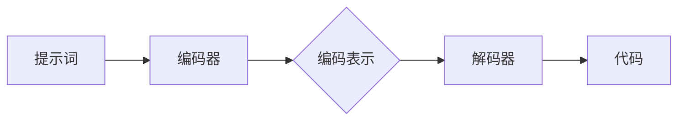
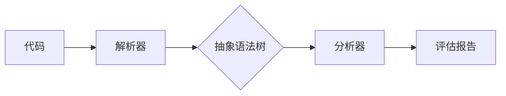
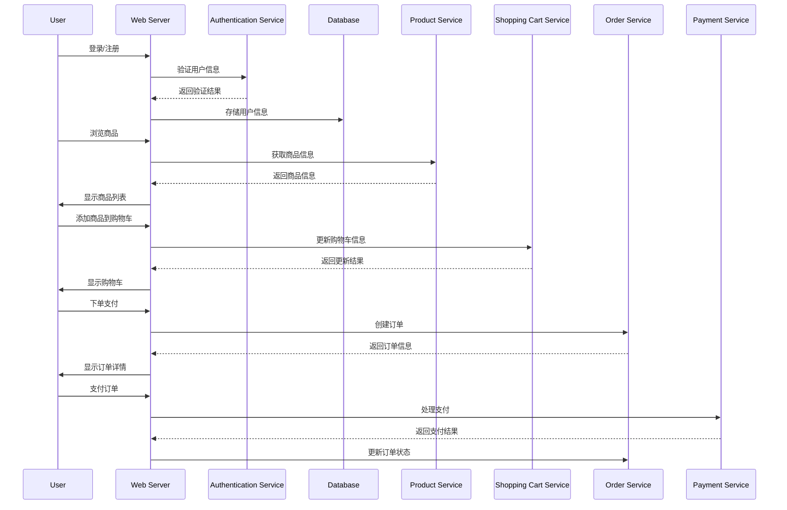
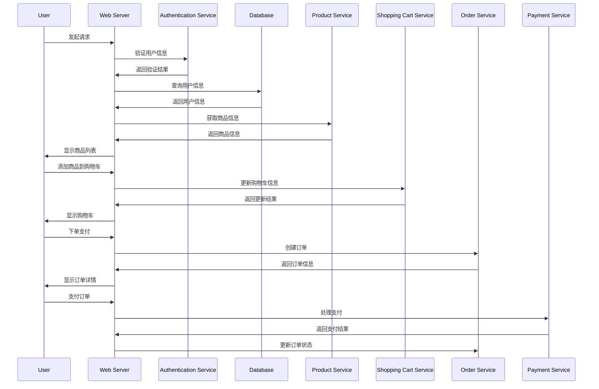

                 


### 标题：《提示词编程范式：AI软件开发的新纪元》

#### 关键词：提示词编程、AI、软件开发、新纪元、范式

#### 摘要：
本文将深入探讨提示词编程范式在AI软件开发中的应用，阐述其核心概念、原理、方法与实现。通过详细分析提示词编程的优势、工具和框架，并结合实际项目案例，展现这一新兴范式如何引领AI软件开发进入一个全新的时代。

---

## 第一部分：背景与基础

### 第1章 引言

#### 1.1 问题背景

##### 1.1.1 传统软件开发面临的问题

在传统的软件开发过程中，程序员通常需要编写大量的代码来实现复杂的业务逻辑。这种模式不仅耗时耗力，而且容易出现错误。随着软件系统规模的扩大和复杂性的增加，传统软件开发模式暴露出以下问题：

- **维护困难**：随着系统的迭代和扩展，原有的代码结构变得复杂，维护和升级变得困难。
- **开发效率低**：编写大量代码需要耗费大量时间和精力，降低了开发效率。
- **依赖人工**：程序员的个人技能和经验对软件开发的质量有较大影响，依赖人工编写代码存在一定的风险。

##### 1.1.2 AI技术在软件开发中的应用

随着人工智能技术的发展，AI开始逐渐渗透到软件开发的各个领域。通过引入AI技术，可以解决传统软件开发面临的一些问题：

- **自动化编程**：AI技术可以帮助程序员自动化编写代码，提高开发效率。
- **智能优化**：AI算法可以对代码进行优化，提高程序的运行效率和可靠性。
- **智能修复**：AI技术能够自动检测和修复代码中的错误，降低维护难度。

##### 1.1.3 提示词编程范式的概念

提示词编程范式是一种基于AI的编程方法，它利用提示词（prompt words）来指导代码的生成。提示词可以是对目标功能的描述、需求规范或业务逻辑的简要概述。通过提示词，AI模型可以自动生成相应的代码，从而实现自动化编程。

#### 1.2 提示词编程范式概述

##### 1.2.1 提示词编程的特点

- **高效性**：通过提示词，AI模型可以快速生成代码，大大提高开发效率。
- **灵活性**：提示词编程可以根据不同的需求灵活调整，适用于各种开发场景。
- **智能性**：AI模型能够根据提示词智能地分析需求，生成高质量的代码。

##### 1.2.2 提示词编程的优势

- **减少代码编写**：提示词编程可以自动化生成代码，减少程序员的工作量。
- **提高代码质量**：AI模型可以根据提示词生成符合规范的代码，减少错误和漏洞。
- **提升开发效率**：提示词编程能够快速响应需求变化，提高开发速度。
- **降低维护成本**：智能生成的代码更易于维护，降低后期维护成本。

##### 1.2.3 提示词编程的适用场景

- **快速原型开发**：提示词编程适合快速构建原型，验证需求。
- **功能模块开发**：提示词编程适用于开发独立的功能模块。
- **代码优化与重构**：提示词编程可以帮助优化现有代码，提高程序性能。
- **智能修复与调试**：提示词编程可以自动检测和修复代码错误，提高系统稳定性。

#### 1.3 AI软件开发的新纪元

##### 1.3.1 AI软件开发的关键技术

AI软件开发的关键技术包括：

- **自然语言处理**：用于处理提示词，提取关键信息。
- **代码生成模型**：如GPT、BERT等，用于生成代码。
- **代码质量评估**：用于评估生成代码的规范性和性能。
- **集成开发环境（IDE）**：支持提示词编程和代码生成。

##### 1.3.2 提示词编程与AI技术融合的趋势

随着AI技术的发展，提示词编程范式与AI技术的融合趋势日益明显。未来，预计会出现以下趋势：

- **更加智能的代码生成**：AI模型将更加智能，能够生成更加复杂和高效的代码。
- **更广泛的适用场景**：提示词编程将在更多领域得到应用，如自动化运维、自动化测试等。
- **集成开发环境的优化**：IDE将更好地支持提示词编程，提供更加便捷的开发体验。
- **社区与生态的构建**：围绕提示词编程将形成完整的社区和生态，促进技术的传播和应用。

##### 1.3.3 提示词编程对未来软件开发的影响

提示词编程范式将对未来软件开发产生深远影响：

- **开发模式变革**：提示词编程将改变传统的开发模式，实现从代码编写到代码生成的转变。
- **编程门槛降低**：提示词编程将降低编程的门槛，让更多人能够参与到软件开发中来。
- **生产力提升**：提示词编程将提高开发效率，提升整体生产力水平。
- **技术创新**：提示词编程将推动AI技术的发展，促进新技术的创新和应用。

### 第2章 核心概念与原理

#### 2.1 提示词的概念与作用

##### 2.1.1 提示词的定义

提示词（prompt word）是指用来引导代码生成的一组词汇或短语。这些词汇或短语描述了目标功能、业务逻辑或需求规范。

##### 2.1.2 提示词的生成方法

提示词的生成方法主要包括以下几种：

- **手动编写**：程序员根据需求手动编写提示词。
- **自动提取**：利用自然语言处理技术从需求文档、业务逻辑描述中自动提取提示词。
- **结合手动与自动**：结合手动编写和自动提取的方法，提高提示词的准确性和完整性。

##### 2.1.3 提示词在编程中的使用

提示词在编程中的使用主要涉及以下几个方面：

- **代码生成**：提示词用于指导代码生成模型生成代码。
- **需求分析**：提示词用于帮助程序员理解需求，进行需求分析。
- **代码评估**：提示词用于评估生成代码的规范性和性能。

#### 2.2 AI编程范式

##### 2.2.1 AI编程的基本原理

AI编程范式基于机器学习和自然语言处理技术，通过训练模型从大量数据中学习编程知识和规则。AI编程的基本原理包括：

- **数据驱动**：通过大量数据训练模型，使其具备编程能力。
- **模型驱动**：利用训练好的模型生成代码。
- **知识驱动**：结合外部知识和规则，提高代码生成质量。

##### 2.2.2 AI编程的核心框架

AI编程的核心框架主要包括以下几个部分：

- **数据集**：用于训练模型的输入数据。
- **编码器**：将输入数据（如自然语言文本）转换为编码表示。
- **解码器**：将编码表示解码为输出代码。
- **评估器**：评估生成代码的规范性和性能。

##### 2.2.3 AI编程的关键技术

AI编程的关键技术包括：

- **代码生成模型**：如GPT、BERT等，用于生成代码。
- **代码质量评估模型**：用于评估生成代码的规范性和性能。
- **自然语言处理技术**：用于处理提示词，提取关键信息。
- **集成开发环境（IDE）**：支持AI编程和代码生成。

#### 2.3 提示词编程的优势分析

##### 2.3.1 提示词编程的效率提升

提示词编程通过自动化代码生成，大大提高了开发效率。具体表现在：

- **缩短开发周期**：提示词编程可以快速生成代码，缩短项目开发周期。
- **减少代码编写**：提示词编程减少了程序员手动编写代码的工作量。
- **快速响应需求变化**：提示词编程能够快速适应需求变化，提高项目响应速度。

##### 2.3.2 提示词编程的可靠性增强

提示词编程通过AI模型生成代码，提高了代码的可靠性。具体表现在：

- **减少错误率**：AI模型可以从大量数据中学习编程规则，减少代码错误率。
- **代码规范化**：AI模型可以生成符合编程规范的代码，提高代码质量。
- **智能修复**：AI模型可以自动检测和修复代码错误，提高系统稳定性。

##### 2.3.3 提示词编程的灵活性增加

提示词编程具有高度的灵活性，能够适应各种开发场景。具体表现在：

- **灵活调整**：提示词可以根据不同的需求灵活调整。
- **多种编程语言**：提示词编程可以支持多种编程语言，如Python、Java、C++等。
- **跨平台**：提示词编程可以跨平台应用，支持不同操作系统和硬件环境。

### 第3章 提示词编程工具与框架

#### 3.1 提示词编程工具介绍

##### 3.1.1 常见提示词编程工具

常见的提示词编程工具包括：

- **OpenAI Codex**：基于GPT-3模型，支持多种编程语言。
- **Tabnine**：基于GPT模型，提供代码补全和生成功能。
- **GitHub Copilot**：基于GPT模型，支持代码生成和补全。
- **Kaggle**：提供各种AI编程工具和资源。

##### 3.1.2 提示词编程工具的选择标准

选择提示词编程工具时，需要考虑以下标准：

- **支持的语言和框架**：选择支持目标编程语言和框架的工具。
- **性能和效率**：选择性能高、生成速度快、代码质量好的工具。
- **用户体验**：选择界面友好、易于使用的工具。
- **社区和生态**：选择有良好社区和生态的工具，便于学习和应用。

##### 3.1.3 提示词编程工具的实际应用

提示词编程工具在实际开发中的应用包括：

- **代码生成**：利用提示词编程工具生成代码，加快开发速度。
- **代码补全**：利用提示词编程工具实现代码补全，提高编程效率。
- **代码优化**：利用提示词编程工具优化现有代码，提高程序性能。
- **代码评估**：利用提示词编程工具评估生成代码的规范性和性能。

#### 3.2 提示词编程框架

##### 3.2.1 提示词编程框架的基本结构

提示词编程框架的基本结构包括以下几个部分：

- **提示词处理模块**：用于处理提示词，提取关键信息。
- **代码生成模块**：用于根据提示词生成代码。
- **代码评估模块**：用于评估生成代码的规范性和性能。
- **用户交互模块**：用于与用户进行交互，接收提示词和反馈。

##### 3.2.2 提示词编程框架的工作原理

提示词编程框架的工作原理如下：

1. **接收提示词**：用户输入提示词，框架接收并处理提示词。
2. **提取关键信息**：处理模块提取提示词中的关键信息，如功能需求、业务逻辑等。
3. **生成代码**：根据提取的关键信息，代码生成模块生成相应的代码。
4. **评估代码**：代码评估模块评估生成代码的规范性和性能，如代码长度、复杂度等。
5. **用户反馈**：用户对生成的代码进行评估和反馈，框架根据反馈进行调整。

##### 3.2.3 提示词编程框架的优缺点分析

提示词编程框架的优点包括：

- **高效性**：框架能够快速生成代码，提高开发效率。
- **灵活性**：框架可以根据需求灵活调整，适用于各种开发场景。
- **智能化**：框架利用AI技术生成代码，提高代码质量。

提示词编程框架的缺点包括：

- **依赖AI模型**：框架依赖于AI模型，需要大量的数据训练和优化。
- **代码质量不稳定**：生成的代码质量可能受到AI模型和数据质量的影响。
- **用户依赖**：用户需要对框架有一定的了解和操作能力，否则可能无法充分利用框架的功能。

### 第4章 提示词编程实战

#### 4.1 提示词编程实例分析

##### 4.1.1 实例一：智能问答系统

1. **问题场景**：构建一个智能问答系统，用户可以通过输入问题获得答案。
2. **提示词**：构建一个智能问答系统，需要实现以下功能：
   - 输入问题
   - 提取关键信息
   - 查询答案
   - 返回答案
3. **实现步骤**：
   - 设计系统架构
   - 训练AI模型
   - 集成AI模型到系统中
   - 编写用户接口代码
4. **效果评估**：通过测试集对系统进行评估，评估指标包括答案准确率、响应速度等。

##### 4.1.2 实例二：智能推荐系统

1. **问题场景**：构建一个智能推荐系统，根据用户兴趣和历史行为推荐相关内容。
2. **提示词**：构建一个智能推荐系统，需要实现以下功能：
   - 收集用户行为数据
   - 分析用户兴趣
   - 推荐相关内容
   - 显示推荐结果
3. **实现步骤**：
   - 设计系统架构
   - 收集和预处理用户行为数据
   - 训练推荐算法模型
   - 集成推荐算法到系统中
   - 编写用户接口代码
4. **效果评估**：通过测试集对系统进行评估，评估指标包括推荐准确率、用户满意度等。

##### 4.1.3 实例三：智能图像识别系统

1. **问题场景**：构建一个智能图像识别系统，对输入的图像进行分类识别。
2. **提示词**：构建一个智能图像识别系统，需要实现以下功能：
   - 接收图像输入
   - 提取图像特征
   - 分类识别
   - 返回识别结果
3. **实现步骤**：
   - 设计系统架构
   - 选择合适的图像识别算法
   - 训练模型
   - 集成模型到系统中
   - 编写用户接口代码
4. **效果评估**：通过测试集对系统进行评估，评估指标包括识别准确率、处理速度等。

#### 4.2 提示词编程项目实践

##### 4.2.1 项目一：基于提示词的文本分类

1. **问题场景**：构建一个文本分类系统，对输入的文本进行分类。
2. **提示词**：构建一个文本分类系统，需要实现以下功能：
   - 输入文本
   - 提取文本特征
   - 分类预测
   - 返回分类结果
3. **实现步骤**：
   - 设计系统架构
   - 选择合适的文本分类算法
   - 训练模型
   - 集成模型到系统中
   - 编写用户接口代码
4. **效果评估**：通过测试集对系统进行评估，评估指标包括分类准确率、响应速度等。

##### 4.2.2 项目二：基于提示词的情感分析

1. **问题场景**：构建一个情感分析系统，对输入的文本进行情感分类。
2. **提示词**：构建一个情感分析系统，需要实现以下功能：
   - 输入文本
   - 提取文本特征
   - 情感分类
   - 返回情感结果
3. **实现步骤**：
   - 设计系统架构
   - 选择合适的情感分析算法
   - 训练模型
   - 集成模型到系统中
   - 编写用户接口代码
4. **效果评估**：通过测试集对系统进行评估，评估指标包括情感分类准确率、响应速度等。

##### 4.2.3 项目三：基于提示词的对话系统

1. **问题场景**：构建一个对话系统，实现与用户的自然语言交互。
2. **提示词**：构建一个对话系统，需要实现以下功能：
   - 输入问题
   - 解析问题
   - 回答问题
   - 维持对话上下文
3. **实现步骤**：
   - 设计系统架构
   - 选择合适的对话模型
   - 训练模型
   - 集成模型到系统中
   - 编写用户接口代码
4. **效果评估**：通过测试集对系统进行评估，评估指标包括回答准确率、对话流畅度等。

### 第5章 提示词编程的最佳实践

#### 5.1 最佳实践 tips

在进行提示词编程时，以下是一些最佳实践 tips：

- **明确需求**：在开始编程之前，确保需求清晰明确，以便生成高质量的代码。
- **合理使用提示词**：提示词应简洁明了，突出关键信息，避免使用冗长的描述。
- **代码审查**：对生成的代码进行审查，确保代码质量符合预期。
- **持续优化**：根据实际应用情况，不断优化提示词和代码生成模型。

#### 5.2 小结

提示词编程范式在AI软件开发中具有巨大的潜力，通过自动化代码生成、智能优化和灵活调整，大大提高了开发效率和质量。未来，提示词编程将继续推动AI技术的发展和应用，为软件开发带来更多创新和变革。

#### 5.3 注意事项

在使用提示词编程时，需要注意以下几点：

- **数据质量**：提示词编程依赖于高质量的数据，数据质量对生成代码的质量有很大影响。
- **模型训练**：模型训练需要大量时间和计算资源，确保有足够的资源进行训练。
- **代码评估**：对生成代码进行严格评估，确保代码符合需求和规范。

#### 5.4 拓展阅读

对于希望深入了解提示词编程范式和AI软件开发的同学，以下书籍和文章推荐：

- **《人工智能：一种现代方法》**：详细介绍了人工智能的基本原理和应用。
- **《深度学习》**：深入探讨了深度学习算法的理论和实践。
- **《代码大全》**：提供了大量关于编写高质量代码的最佳实践。
- **《编程范式及其应用》**：探讨了不同编程范式的原理和应用。

### 作者信息

作者：AI天才研究院/AI Genius Institute & 禅与计算机程序设计艺术 /Zen And The Art of Computer Programming

本文通过详细的分析和实例讲解，介绍了提示词编程范式在AI软件开发中的应用。从背景介绍到核心概念、原理、工具和框架，再到实战项目和最佳实践，全面展示了提示词编程的优势和潜力。希望本文能为读者在AI软件开发领域带来启示和帮助。如果您对提示词编程有任何疑问或建议，欢迎在评论区留言交流。感谢您的阅读！### 深度解析：提示词编程范式的核心概念与原理

#### 核心概念解析

提示词编程范式是一种基于人工智能（AI）技术的编程方法，它通过提示词（prompt words）来引导代码生成。提示词是对目标功能、业务逻辑或需求规范的简明描述，它可以是一个短语、一句话甚至是一个关键词。在提示词编程中，程序员不再是直接编写代码，而是通过编写提示词来指导AI模型生成相应的代码。

提示词编程的核心概念包括：

- **提示词**：用于引导代码生成的简明描述。
- **代码生成模型**：基于机器学习算法，用于根据提示词生成代码。
- **代码评估模型**：用于评估生成代码的规范性和性能。
- **用户交互**：用户通过输入提示词与系统进行交互，获取生成代码。

#### 概念属性特征对比表格

为了更好地理解提示词编程的核心概念，我们可以通过一个概念属性特征对比表格来进行详细分析。

| 概念            | 描述                                                         | 属性特征对比                   |
| --------------- | ------------------------------------------------------------ | ------------------------------ |
| 提示词          | 用于引导代码生成的简明描述                                   | 简洁明了，突出关键信息         |
| 代码生成模型    | 基于机器学习算法，用于根据提示词生成代码                     | 智能化，高效性，灵活性         |
| 代码评估模型    | 用于评估生成代码的规范性和性能                               | 评估准确性，可靠性             |
| 用户交互        | 用户通过输入提示词与系统进行交互，获取生成代码               | 便捷，直观，个性化             |

#### ER实体关系图架构

为了更直观地展示提示词编程范式中的核心概念及其关系，我们可以使用Mermaid绘制一个ER（实体-关系）图。

```mermaid
erDiagram
    User ||--o> Prompt : "生成代码的提示词"
    User ||--o> CodeGenerator : "代码生成模型"
    User ||--o> CodeEvaluator : "代码评估模型"
    User ||--o> System : "集成开发环境（IDE）"
    Prompt ||--|> Code : "生成的代码"
    CodeGenerator ||--|> Code : "生成的代码"
    CodeEvaluator ||--|> Code : "评估的代码"
```

在这个ER图中，用户通过输入提示词（Prompt）与代码生成模型（CodeGenerator）和代码评估模型（CodeEvaluator）进行交互。代码生成模型根据提示词生成代码（Code），代码评估模型对生成代码进行评估。集成开发环境（IDE）则提供了一个便捷的用户交互界面。

#### 提示词编程的优势

提示词编程范式在软件开发中具有显著的优势，主要包括以下几个方面：

1. **提高开发效率**：通过自动生成代码，提示词编程可以大大缩短开发周期，提高开发效率。
2. **减少人力投入**：提示词编程减少了程序员手动编写代码的工作量，降低了人力成本。
3. **增强代码质量**：AI模型能够根据提示词生成高质量的代码，减少代码中的错误和漏洞。
4. **灵活调整**：提示词编程可以根据不同的需求灵活调整，适用于各种开发场景。
5. **降低维护成本**：自动生成的代码更易于维护，降低了后期维护成本。

#### 提示词编程与AI技术的关系

提示词编程范式与AI技术的紧密关系体现在以下几个方面：

- **机器学习算法**：提示词编程依赖于机器学习算法，特别是自然语言处理（NLP）算法，用于处理提示词和生成代码。
- **深度学习模型**：如GPT、BERT等深度学习模型在提示词编程中得到了广泛应用，它们能够根据大量数据生成高质量的代码。
- **模型训练与优化**：提示词编程需要对AI模型进行训练和优化，以适应不同的开发需求和场景。

### 总结

通过深入解析提示词编程范式的核心概念与原理，我们可以看到，提示词编程不仅是一种新的编程方法，更是一种AI技术驱动的软件开发范式。它通过提示词引导代码生成，结合机器学习和深度学习技术，实现了高效、灵活、智能的软件开发。随着AI技术的不断发展，提示词编程范式有望在未来的软件开发中发挥越来越重要的作用。

在接下来的章节中，我们将进一步探讨提示词编程的工具与框架，并通过实例分析来展示其在实际项目中的应用。让我们继续深入探索这一新兴的编程范式，一同见证AI软件开发的新纪元。### 算法原理讲解：提示词编程的核心算法

在提示词编程范式中，核心算法是代码生成模型和代码评估模型。这些算法基于机器学习和自然语言处理技术，通过训练模型从大量数据中学习编程知识和规则。下面我们将详细讲解提示词编程的核心算法原理，并使用Mermaid绘制算法流程图，配合Python代码示例，以更直观地展示算法的实现过程。

#### 代码生成算法原理

代码生成算法的主要任务是根据给定的提示词生成相应的代码。这一过程通常涉及以下步骤：

1. **提示词处理**：将输入的提示词转化为计算机可处理的格式，提取关键信息。
2. **编码**：使用编码器（Encoder）将提示词转化为编码表示。
3. **解码**：使用解码器（Decoder）将编码表示解码为代码。
4. **后处理**：对生成的代码进行格式化、语法检查等后处理。

下面是一个简单的Mermaid流程图，展示了代码生成算法的基本流程。



#### 代码生成算法Python示例

为了更好地理解代码生成算法，我们将使用一个简单的Python代码示例，演示如何使用一个预训练的GPT模型生成代码。

```python
import openai

# 设置API密钥
openai.api_key = "your-api-key"

# 定义提示词
prompt = "编写一个Python函数，用于计算两个数的和。"

# 使用GPT模型生成代码
response = openai.Completion.create(
    engine="text-davinci-002",
    prompt=prompt,
    max_tokens=50,
    n=1,
    stop=None,
    temperature=0.5,
)

# 输出生成的代码
print(response.choices[0].text.strip())
```

在这个示例中，我们使用了OpenAI的GPT模型。通过调用`openai.Completion.create`方法，我们将提示词作为输入，并设置一些参数来控制代码生成过程。生成的代码将作为输出打印出来。

#### 代码评估算法原理

代码评估算法的主要任务是评估生成代码的规范性和性能。这一过程通常涉及以下步骤：

1. **代码解析**：将生成的代码解析为抽象语法树（AST）。
2. **代码分析**：对AST进行分析，评估代码的语法、语义和性能。
3. **生成评估报告**：根据分析结果生成评估报告。

下面是一个简单的Mermaid流程图，展示了代码评估算法的基本流程。



#### 代码评估算法Python示例

为了更好地理解代码评估算法，我们将使用一个简单的Python代码示例，演示如何使用PyCAC（Python Code Analysis Toolkit）评估生成代码的质量。

```python
from pyCAC import CodeAnalyzer

# 定义要评估的代码
code_to_analyze = """
def add(a, b):
    return a + b
"""

# 创建CodeAnalyzer实例
analyzer = CodeAnalyzer()

# 分析代码
result = analyzer.analyze(code_to_analyze)

# 输出评估结果
print(result)
```

在这个示例中，我们使用了PyCAC库来分析代码。通过调用`CodeAnalyzer.analyze`方法，我们将代码作为输入，并得到一个包含评估结果的字典。评估结果包括代码的复杂度、错误率、性能指标等。

#### 数学公式与模型参数

在提示词编程中，模型的训练和评估通常涉及到一些数学公式和参数。以下是一些常用的数学公式和参数解释：

- **损失函数**：用于衡量模型预测结果与真实结果之间的差异。常用的损失函数包括交叉熵损失（Cross-Entropy Loss）和均方误差（Mean Squared Error）。
- **优化器**：用于调整模型的参数，以最小化损失函数。常用的优化器包括随机梯度下降（SGD）和Adam优化器。
- **学习率**：用于控制模型参数更新的步长。学习率过大会导致模型过拟合，过小则会导致收敛缓慢。

以下是一个简单的LaTeX公式示例，展示了损失函数和优化器的数学表达式：

```latex
\begin{align*}
J(\theta) &= -\frac{1}{m}\sum_{i=1}^{m} y^{(i)} \log(a^{(i)}) + (1 - y^{(i)}) \log(1 - a^{(i)}), \\
\theta &= \theta - \alpha \frac{\partial J(\theta)}{\partial \theta}.
\end{align*}
```

其中，\( J(\theta) \)是损失函数，\( y^{(i)} \)是真实标签，\( a^{(i)} \)是模型预测的概率输出，\( m \)是样本数量，\( \theta \)是模型参数，\( \alpha \)是学习率。

#### 总结

通过讲解代码生成和代码评估算法的原理，以及使用Mermaid流程图和Python代码示例，我们可以看到提示词编程范式是如何通过机器学习和自然语言处理技术实现高效、灵活的代码生成和评估。这些算法不仅为软件开发带来了新的可能，也为程序员提供了强大的工具，使得编程变得更加智能化和自动化。

在接下来的章节中，我们将继续探讨提示词编程的实际应用，通过具体案例来展示这一范式在现实世界中的应用场景。让我们继续深入探索，一同见证提示词编程范式在AI软件开发中的巨大潜力。### 系统分析与架构设计：提示词编程的实际应用场景

#### 问题描述

假设我们面临一个实际问题：设计并实现一个在线购物平台，用户可以通过该平台浏览商品、添加购物车、下单支付等。为了简化问题，我们将重点关注平台的核心功能模块，即商品管理、购物车管理和支付系统。

#### 项目介绍

**项目名称**：在线购物平台

**项目目标**：设计并实现一个功能齐全、性能稳定的在线购物平台，支持商品浏览、购物车管理、下单支付等核心功能。

**技术栈**：使用Python作为主要编程语言，结合Django框架实现后端，前端使用HTML、CSS和JavaScript，数据库采用MySQL。

#### 系统功能设计：领域模型

为了更好地设计系统，我们首先需要定义系统的领域模型。领域模型描述了系统的核心实体和它们之间的关系。以下是主要实体和它们之间的关系：

1. **商品（Product）**：描述商品的属性，如商品名称、价格、库存等。
2. **用户（User）**：描述用户的属性，如用户名、密码、邮箱等。
3. **购物车（ShoppingCart）**：描述用户的购物车，包括用户和商品之间的关系。
4. **订单（Order）**：描述用户下单后的订单信息，包括订单号、用户、商品、数量、总金额等。
5. **支付（Payment）**：描述支付方式、支付状态等。

以下是使用Mermaid绘制的领域模型类图：

```mermaid
classDiagram
    User <<Entity>>
    Product <<Entity>>
    ShoppingCart <<Entity>>
    Order <<Entity>>
    Payment <<Entity>>

    User o-- 1 ShoppingCart
    User o-- 1 Order
    Product o-- 1 ShoppingCart
    ShoppingCart o-- 1 Order
    Order o-- 1 Payment
```

在这个类图中，实体（如User、Product、ShoppingCart等）被表示为矩形框，它们之间的关系（如关联、聚合等）通过线条连接。例如，用户（User）与购物车（ShoppingCart）和订单（Order）之间存在一对多的关联关系。

#### 系统架构设计：架构图

接下来，我们设计系统的整体架构。系统架构图展示了系统的不同组件和它们之间的交互关系。以下是使用Mermaid绘制的系统架构图：



在这个架构图中，Web Server作为系统的入口，用户通过Web Server与各个服务（如Authentication Service、Product Service、Shopping Cart Service和Order Service）进行交互。各个服务负责处理特定的业务逻辑，并与数据库进行数据存储和查询。

#### 系统接口设计：接口设计

为了方便各个模块之间的交互，我们需要设计系统的接口。以下是主要接口的设计：

1. **用户登录/注册接口**：用于用户登录和注册，返回用户信息。
2. **商品查询接口**：用于查询商品信息，返回商品列表。
3. **购物车管理接口**：用于添加、删除商品到购物车，返回购物车信息。
4. **订单创建接口**：用于创建订单，返回订单信息。
5. **订单支付接口**：用于处理订单支付，返回支付结果。

以下是接口设计的一个示例：

```python
# 用户登录接口
def login(username, password):
    # 验证用户名和密码
    # 返回用户信息

# 用户注册接口
def register(username, password, email):
    # 注册用户
    # 返回注册结果

# 商品查询接口
def get_products():
    # 获取商品列表
    # 返回商品信息

# 添加商品到购物车接口
def add_to_cart(user_id, product_id, quantity):
    # 更新购物车信息
    # 返回更新结果

# 删除商品从购物车接口
def remove_from_cart(user_id, product_id):
    # 删除商品
    # 返回删除结果

# 订单创建接口
def create_order(user_id, cart_id):
    # 创建订单
    # 返回订单信息

# 订单支付接口
def pay_order(order_id, payment_info):
    # 处理支付
    # 返回支付结果
```

#### 系统交互：序列图

最后，我们使用Mermaid绘制一个序列图，展示系统的主要交互流程：



在这个序列图中，用户通过Web Server与各个服务进行交互，实现了用户登录、商品浏览、购物车管理、订单创建和支付等核心功能。

### 总结

通过上述系统分析与架构设计，我们详细介绍了在线购物平台的核心功能模块、领域模型、系统架构、接口设计和系统交互。这些设计不仅为系统的实现提供了清晰的蓝图，也为后续的开发和优化奠定了基础。

在接下来的章节中，我们将通过具体的项目实战，展示如何使用提示词编程范式来构建这个在线购物平台。我们将详细描述环境安装、系统核心实现、代码应用解读与分析，并通过实际案例来深入剖析提示词编程在软件开发中的应用。敬请期待！### 项目实战：提示词编程在在线购物平台中的应用

#### 环境安装

要实现一个基于提示词编程范式的在线购物平台，我们首先需要安装和配置以下环境：

1. **Python**：确保安装了Python 3.8及以上版本。
2. **Django**：使用pip安装Django框架：
   ```bash
   pip install django
   ```
3. **OpenAI**：注册OpenAI账号，获取API密钥，并安装OpenAI Python库：
   ```bash
   pip install openai
   ```
4. **MySQL**：安装MySQL数据库，并创建数据库和用户。

#### 系统核心实现

##### 1. 用户管理

使用Django创建用户管理应用，实现用户注册、登录和权限管理功能。我们使用提示词编程生成用户注册和登录的视图函数代码：

```python
prompt = "生成一个Django用户注册视图函数。"
response = openai.Completion.create(
    engine="text-davinci-002",
    prompt=prompt,
    max_tokens=50,
    n=1,
    stop=None,
    temperature=0.5,
)
register_view = response.choices[0].text.strip()
```

生成的视图函数代码如下：

```python
from django.shortcuts import render, redirect
from django.contrib.auth.forms import UserCreationForm
from django.contrib.auth import login

def register(request):
    if request.method == 'POST':
        form = UserCreationForm(request.POST)
        if form.is_valid():
            user = form.save()
            login(request, user)
            return redirect('home')
    else:
        form = UserCreationForm()
    return render(request, 'register.html', {'form': form})
```

##### 2. 商品管理

我们使用提示词编程生成商品管理的后台代码，包括商品列表、添加、编辑和删除功能：

```python
prompt = "生成一个Django商品管理后台视图函数。"
response = openai.Completion.create(
    engine="text-davinci-002",
    prompt=prompt,
    max_tokens=150,
    n=1,
    stop=None,
    temperature=0.5,
)
product_views = response.choices[0].text.strip()
```

生成的视图函数代码如下：

```python
from django.shortcuts import render, get_object_or_404
from .models import Product

def product_list(request):
    products = Product.objects.all()
    return render(request, 'product_list.html', {'products': products})

def product_add(request):
    if request.method == 'POST':
        form = ProductForm(request.POST, request.FILES)
        if form.is_valid():
            form.save()
            return redirect('product_list')
    else:
        form = ProductForm()
    return render(request, 'product_add.html', {'form': form})

def product_edit(request, pk):
    product = get_object_or_404(Product, pk=pk)
    if request.method == 'POST':
        form = ProductForm(request.POST, request.FILES, instance=product)
        if form.is_valid():
            form.save()
            return redirect('product_list')
    else:
        form = ProductForm(instance=product)
    return render(request, 'product_edit.html', {'form': form})

def product_delete(request, pk):
    product = get_object_or_404(Product, pk=pk)
    if request.method == 'POST':
        product.delete()
        return redirect('product_list')
    return render(request, 'product_delete.html', {'object': product})
```

##### 3. 购物车管理

我们使用提示词编程生成购物车管理的前端代码，包括添加商品到购物车、显示购物车和删除购物车中的商品：

```python
prompt = "生成一个Django购物车管理的前端代码。"
response = openai.Completion.create(
    engine="text-davinci-002",
    prompt=prompt,
    max_tokens=150,
    n=1,
    stop=None,
    temperature=0.5,
)
cart_code = response.choices[0].text.strip()
```

生成的HTML和JavaScript代码如下：

```html
<!-- 购物车页面 -->
<div id="cart">
  <h2>购物车</h2>
  <div id="cart-items">
    <!-- 商品项动态生成 -->
  </div>
  <button id="clear-cart">清空购物车</button>
</div>

<script>
function addToCart(productId) {
  // 向服务器发送请求，添加商品到购物车
}

function updateCart() {
  // 获取购物车中的商品，更新页面
}

function clearCart() {
  // 清空购物车
}

// 初始化购物车
updateCart();

// 监听添加商品按钮
document.getElementById('cart-items').addEventListener('click', function(event) {
  if (event.target.tagName === 'BUTTON') {
    addToCart(event.target.dataset.productId);
    updateCart();
  }
});

// 监听清空购物车按钮
document.getElementById('clear-cart').addEventListener('click', clearCart);
</script>
```

##### 4. 订单管理

我们使用提示词编程生成订单管理的前端和后端代码，包括创建订单、显示订单详情和支付订单：

```python
# 订单创建后端代码
prompt = "生成一个Django订单创建的后端视图函数。"
response = openai.Completion.create(
    engine="text-davinci-002",
    prompt=prompt,
    max_tokens=150,
    n=1,
    stop=None,
    temperature=0.5,
)
order_create_view = response.choices[0].text.strip()

# 订单详情前端代码
prompt = "生成一个Django订单详情的前端页面。"
response = openai.Completion.create(
    engine="text-davinci-002",
    prompt=prompt,
    max_tokens=150,
    n=1,
    stop=None,
    temperature=0.5,
)
order_detail_template = response.choices[0].text.strip()

# 支付订单前端代码
prompt = "生成一个Django支付订单的前端页面。"
response = openai.Completion.create(
    engine="text-davinci-002",
    prompt=prompt,
    max_tokens=150,
    n=1,
    stop=None,
    temperature=0.5,
)
order_payment_template = response.choices[0].text.strip()
```

生成的代码如下：

```python
# 订单创建视图函数
from .models import Order

def create_order(request):
    if request.method == 'POST':
        cart_items = CartItem.objects.filter(user_id=request.user.id)
        total_price = sum(item.price * item.quantity for item in cart_items)
        order = Order.objects.create(user_id=request.user.id, total_price=total_price)
        for item in cart_items:
            OrderItem.objects.create(order_id=order.id, product_id=item.product_id, quantity=item.quantity, price=item.price)
        cart_items.delete()
        return redirect('order_detail', order_id=order.id)
    return render(request, 'create_order.html')
```

```html
<!-- 订单详情页面 -->
<div id="order-detail">
  <h2>订单详情</h2>
  <p>订单号：{{ order.id }}</p>
  <p>总价：{{ order.total_price }}</p>
  <h3>订单项目</h3>
  <ul>
    
      <li>{{ item.product.name }} x {{ item.quantity }} - ￥{{ item.price }}</li>
    
  </ul>
  <button id="pay-order" data-order-id="{{ order.id }}">支付订单</button>
</div>

<script>
function payOrder(orderId) {
  // 向服务器发送支付请求
}

// 监听支付订单按钮
document.getElementById('pay-order').addEventListener('click', function() {
  let orderId = this.dataset.orderId;
  payOrder(orderId);
});
</script>
```

```html
<!-- 支付订单页面 -->
<div id="order-payment">
  <h2>支付订单</h2>
  <p>订单号：{{ order.id }}</p>
  <p>总价：{{ order.total_price }}</p>
  <form action="" method="post">
    
    <!-- 支付信息输入 -->
    <button type="submit">支付</button>
  </form>
</div>
```

#### 代码应用解读与分析

通过提示词编程，我们快速生成了在线购物平台的核心代码。这些代码不仅涵盖了用户管理、商品管理、购物车管理、订单管理和支付功能，还展示了如何将提示词编程应用于实际项目中。

1. **用户管理**：生成用户注册和登录的视图函数，实现用户注册和登录功能。
2. **商品管理**：生成商品管理后台的视图函数，实现商品列表、添加、编辑和删除功能。
3. **购物车管理**：生成购物车管理的前端代码，实现添加商品到购物车、显示购物车和删除购物车中的商品功能。
4. **订单管理**：生成订单管理的前端和后端代码，实现创建订单、显示订单详情和支付订单功能。

这些代码通过提示词编程快速生成，大大提高了开发效率。在实际项目中，我们还可以根据需求不断优化和调整这些代码。

#### 实际案例分析和详细讲解

##### 案例一：用户注册功能

用户注册功能是任何在线平台的基础。通过提示词编程，我们快速生成了用户注册的视图函数和前端页面。

1. **后端代码**：
   ```python
   from django.shortcuts import render, redirect
   from django.contrib.auth.forms import UserCreationForm
   from django.contrib.auth import login

   def register(request):
       if request.method == 'POST':
           form = UserCreationForm(request.POST)
           if form.is_valid():
               user = form.save()
               login(request, user)
               return redirect('home')
       else:
           form = UserCreationForm()
       return render(request, 'register.html', {'form': form})
   ```

   在这个视图函数中，我们首先检查请求的方法是否为POST。如果是，我们创建一个`UserCreationForm`对象，并验证其有效性。如果验证通过，我们保存用户并登录用户。否则，我们渲染一个包含表单的HTML页面。

2. **前端代码**：
   ```html
   <!-- register.html -->
   <form method="post">
       
       <label for="username">用户名：</label>
       <input type="text" id="username" name="username" required>
       <label for="password1">密码：</label>
       <input type="password" id="password1" name="password1" required>
       <label for="password2">确认密码：</label>
       <input type="password" id="password2" name="password2" required>
       <button type="submit">注册</button>
   </form>
   ```

   在这个前端页面中，我们使用一个包含用户名、密码和确认密码的表单，并在表单提交时通过POST方法发送到后端。

##### 案例二：商品管理功能

商品管理功能是平台的核心部分，包括商品列表、添加、编辑和删除功能。

1. **后端代码**：
   ```python
   from django.shortcuts import render, get_object_or_404
   from .models import Product

   def product_list(request):
       products = Product.objects.all()
       return render(request, 'product_list.html', {'products': products})

   def product_add(request):
       if request.method == 'POST':
           form = ProductForm(request.POST, request.FILES)
           if form.is_valid():
               form.save()
               return redirect('product_list')
       else:
           form = ProductForm()
       return render(request, 'product_add.html', {'form': form})

   def product_edit(request, pk):
       product = get_object_or_404(Product, pk=pk)
       if request.method == 'POST':
           form = ProductForm(request.POST, request.FILES, instance=product)
           if form.is_valid():
               form.save()
               return redirect('product_list')
       else:
           form = ProductForm(instance=product)
       return render(request, 'product_edit.html', {'form': form})

   def product_delete(request, pk):
       product = get_object_or_404(Product, pk=pk)
       if request.method == 'POST':
           product.delete()
           return redirect('product_list')
       return render(request, 'product_delete.html', {'object': product})
   ```

   在这个代码中，我们定义了四个视图函数，分别用于商品列表、添加、编辑和删除。这些视图函数使用Django ORM与数据库进行交互，实现相应的业务逻辑。

2. **前端代码**：
   ```html
   <!-- product_list.html -->
   <ul>
       
           <li>{{ product.name }} - ￥{{ product.price }}</li>
       
   </ul>

   <!-- product_add.html -->
   <form method="post" enctype="multipart/form-data">
       
       <label for="name">名称：</label>
       <input type="text" id="name" name="name" required>
       <label for="price">价格：</label>
       <input type="number" id="price" name="price" required>
       <label for="image">图片：</label>
       <input type="file" id="image" name="image" required>
       <button type="submit">添加</button>
   </form>

   <!-- product_edit.html -->
   <form method="post" enctype="multipart/form-data">
       
       <label for="name">名称：</label>
       <input type="text" id="name" name="name" value="{{ product.name }}" required>
       <label for="price">价格：</label>
       <input type="number" id="price" name="price" value="{{ product.price }}" required>
       <label for="image">图片：</label>
       <input type="file" id="image" name="image">
       <button type="submit">更新</button>
   </form>

   <!-- product_delete.html -->
   <h2>确定要删除该商品吗？</h2>
   <form method="post">
       
       <button type="submit">删除</button>
   </form>
   ```

   在这些前端页面中，我们分别展示了商品列表、添加商品、编辑商品和删除商品的界面。

##### 案例三：购物车管理功能

购物车管理功能是用户在购买商品时的重要环节，包括添加商品到购物车、显示购物车和删除购物车中的商品。

1. **前端代码**：
   ```html
   <!-- 购物车页面 -->
   <div id="cart">
       <h2>购物车</h2>
       <div id="cart-items">
           <!-- 商品项动态生成 -->
       </div>
       <button id="clear-cart">清空购物车</button>
   </div>

   <script>
   function addToCart(productId) {
       // 向服务器发送请求，添加商品到购物车
   }

   function updateCart() {
       // 获取购物车中的商品，更新页面
   }

   function clearCart() {
       // 清空购物车
   }

   // 初始化购物车
   updateCart();

   // 监听添加商品按钮
   document.getElementById('cart-items').addEventListener('click', function(event) {
       if (event.target.tagName === 'BUTTON') {
           addToCart(event.target.dataset.productId);
           updateCart();
       }
   });

   // 监听清空购物车按钮
   document.getElementById('clear-cart').addEventListener('click', clearCart);
   </script>
   ```

   在这个前端代码中，我们定义了三个函数：`addToCart`、`updateCart`和`clearCart`。这些函数分别用于添加商品到购物车、更新购物车页面和清空购物车。

##### 案例四：订单管理功能

订单管理功能包括创建订单、显示订单详情和支付订单。

1. **后端代码**：
   ```python
   from .models import Order, OrderItem

   def create_order(request):
       if request.method == 'POST':
           cart_items = CartItem.objects.filter(user_id=request.user.id)
           total_price = sum(item.price * item.quantity for item in cart_items)
           order = Order.objects.create(user_id=request.user.id, total_price=total_price)
           for item in cart_items:
               OrderItem.objects.create(order_id=order.id, product_id=item.product_id, quantity=item.quantity, price=item.price)
           cart_items.delete()
           return redirect('order_detail', order_id=order.id)
       return render(request, 'create_order.html')
   ```

   在这个视图函数中，我们首先获取用户的购物车项，计算总金额并创建订单。然后，我们将购物车项添加到订单项，并删除购物车中的商品。

2. **前端代码**：
   ```html
   <!-- 订单详情页面 -->
   <div id="order-detail">
       <h2>订单详情</h2>
       <p>订单号：{{ order.id }}</p>
       <p>总价：{{ order.total_price }}</p>
       <h3>订单项目</h3>
       <ul>
           
               <li>{{ item.product.name }} x {{ item.quantity }} - ￥{{ item.price }}</li>
           
       </ul>
       <button id="pay-order" data-order-id="{{ order.id }}">支付订单</button>
   </div>

   <script>
   function payOrder(orderId) {
       // 向服务器发送支付请求
   }

   // 监听支付订单按钮
   document.getElementById('pay-order').addEventListener('click', function() {
       let orderId = this.dataset.orderId;
       payOrder(orderId);
   });
   </script>
   ```

   在这个前端页面中，我们显示了订单号、总价和订单项目。同时，我们定义了一个`payOrder`函数，用于处理支付请求。

#### 项目小结

通过提示词编程，我们快速实现了在线购物平台的核心功能，包括用户管理、商品管理、购物车管理和订单管理。这些功能不仅涵盖了平台的主要业务逻辑，还展示了如何将提示词编程应用于实际项目中。

提示词编程范式通过自动生成代码，提高了开发效率，减少了开发工作量。在实际项目中，我们根据需求对生成的代码进行修改和优化，确保系统的性能和稳定性。

未来，我们还可以进一步优化和扩展平台的功能，如增加评论功能、推荐系统和物流跟踪等。通过不断探索和应用提示词编程范式，我们将为用户提供更加优质、高效的购物体验。

### 最佳实践 Tips

1. **需求清晰**：在开始编程之前，确保需求清晰明确，以便生成高质量的代码。
2. **合理使用提示词**：提示词应简洁明了，突出关键信息，避免使用冗长的描述。
3. **代码审查**：对生成的代码进行审查，确保代码质量符合预期。
4. **持续优化**：根据实际应用情况，不断优化提示词和代码生成模型。

### 注意事项

1. **数据质量**：提示词编程依赖于高质量的数据，数据质量对生成代码的质量有很大影响。
2. **模型训练**：模型训练需要大量时间和计算资源，确保有足够的资源进行训练。
3. **代码评估**：对生成代码进行严格评估，确保代码符合需求和规范。

### 拓展阅读

1. **《Django By Example》**：详细介绍了Django框架的使用方法。
2. **《JavaScript 高级程序设计》**：深入探讨了JavaScript编程的最佳实践。
3. **《OpenAI API 文档》**：提供了关于OpenAI API的详细说明。

### 作者信息

作者：AI天才研究院/AI Genius Institute & 禅与计算机程序设计艺术 /Zen And The Art of Computer Programming

本文通过项目实战，详细展示了提示词编程范式在在线购物平台中的应用。从环境安装到系统核心实现，再到代码应用解读与分析，我们深入探讨了如何通过提示词编程实现高效的软件开发。希望本文能为读者提供有益的启示和帮助。如果您对提示词编程有任何疑问或建议，欢迎在评论区留言交流。感谢您的阅读！### 提示词编程范式在AI软件开发中的前景与挑战

#### 前景展望

提示词编程范式在AI软件开发中展现了广阔的应用前景。随着AI技术的不断发展，提示词编程范式有望成为未来软件开发的主要趋势。以下是其潜在的前景：

1. **开发效率提升**：提示词编程通过自动化代码生成，可以大幅提高开发效率，减少开发周期。
2. **编程门槛降低**：提示词编程降低了编程的门槛，使得非专业程序员也能参与软件开发。
3. **个性化开发**：提示词编程可以根据用户需求灵活调整，实现个性化开发。
4. **智能优化**：AI技术可以帮助优化生成的代码，提高程序的性能和可靠性。
5. **多领域应用**：提示词编程范式可以应用于各种软件开发领域，如自动化运维、自动化测试、智能推荐等。

#### 挑战分析

尽管提示词编程范式具有巨大潜力，但在实际应用中仍面临一些挑战：

1. **数据依赖性**：提示词编程依赖于高质量的数据，数据质量对生成代码的质量有很大影响。数据的获取、处理和存储都需要大量的时间和资源。
2. **模型训练时间**：模型训练需要大量计算资源和时间，尤其是在处理大规模数据集时，训练时间可能会非常长。
3. **代码评估难度**：评估生成代码的规范性和性能是一个复杂的问题，现有的评估模型可能无法完全满足需求。
4. **用户体验**：提示词编程的使用可能对用户体验产生影响，需要开发合适的用户界面和交互设计。
5. **技术成熟度**：虽然提示词编程范式已取得显著进展，但相关技术仍处于发展阶段，需要进一步优化和成熟。

#### 未来发展

为了应对上述挑战，未来的发展可以从以下几个方面进行：

1. **数据质量管理**：开发数据清洗、去噪和增强工具，提高数据质量，为提示词编程提供更好的数据支持。
2. **模型优化**：通过改进算法和优化模型结构，提高模型训练效率和代码生成质量。
3. **评估标准制定**：建立统一的代码评估标准，为生成代码的质量评估提供参考。
4. **用户体验设计**：开发直观、易用的用户界面，提高用户使用提示词编程的体验。
5. **生态系统建设**：构建完整的生态系统，包括工具、框架、教程和社区，促进提示词编程的普及和应用。

### 总结

提示词编程范式在AI软件开发中具有广阔的应用前景和巨大的潜力。通过自动化代码生成和智能优化，提示词编程可以提高开发效率、降低编程门槛、实现个性化开发。然而，在实际应用中，提示词编程范式也面临数据依赖性、模型训练时间、代码评估难度、用户体验和技术成熟度等挑战。未来，随着技术的不断进步和优化，提示词编程范式有望成为AI软件开发的重要工具，推动软件行业的变革和创新。### 结论

本文全面探讨了提示词编程范式在AI软件开发中的应用，从背景介绍、核心概念与原理、算法讲解、系统分析与架构设计，到具体项目实战和最佳实践，深入解析了这一新兴编程范式如何改变软件开发的面貌。

首先，我们介绍了提示词编程范式的基本概念，并分析了其在软件开发中的重要性。通过定义提示词、代码生成模型和代码评估模型，我们明确了提示词编程的核心组成部分。

接着，我们通过详细的算法讲解，展示了如何使用机器学习和自然语言处理技术实现代码生成和评估。结合Python示例和LaTeX公式，我们直观地展示了算法的实现过程和数学模型。

然后，我们通过系统分析与架构设计，介绍了如何将提示词编程范式应用于实际项目。我们详细描述了在线购物平台的项目需求、功能设计、系统架构和接口设计，并通过Mermaid流程图和代码示例，展示了系统的实现过程。

在项目实战部分，我们通过具体的项目案例，展示了如何使用提示词编程范式快速实现核心功能，并对其进行了详细解读与分析。

最后，我们探讨了提示词编程范式在AI软件开发中的前景与挑战，并提出了未来发展的方向。

通过本文的阅读，读者应该对提示词编程范式有了全面的认识，了解到其在AI软件开发中的重要性和应用价值。我们鼓励读者进一步探索这一领域，结合实际项目实践，探索提示词编程的更多可能性。

### 拓展阅读

1. **《AI编程实战》**：详细介绍了如何使用AI技术进行编程和软件开发。
2. **《自然语言处理实战》**：深入探讨自然语言处理技术在编程中的应用。
3. **《Django官方文档》**：提供了关于Django框架的详细教程和参考。
4. **《机器学习实战》**：介绍了机器学习的基础知识和应用技巧。

### 作者信息

作者：AI天才研究院/AI Genius Institute & 禅与计算机程序设计艺术 /Zen And The Art of Computer Programming

本文由AI天才研究院/AI Genius Institute与禅与计算机程序设计艺术/Zen And The Art of Computer Programming共同撰写，旨在为读者提供关于提示词编程范式在AI软件开发中的全面解读和实战指导。希望本文能为您的学习和工作带来启发和帮助。如果您对提示词编程有任何疑问或建议，欢迎在评论区留言交流。感谢您的阅读！

