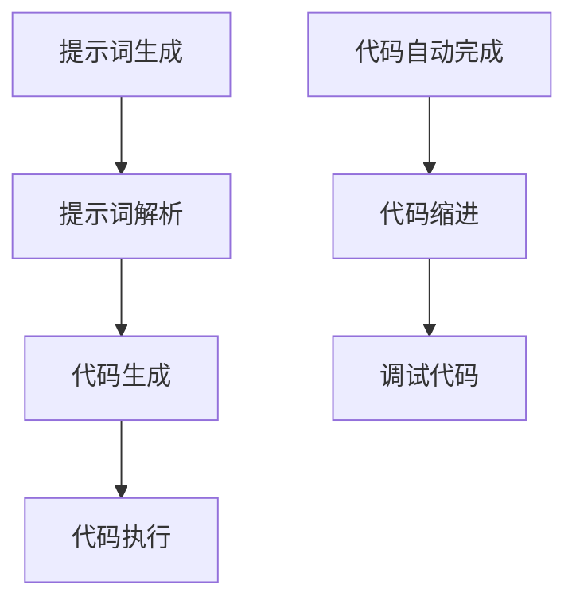
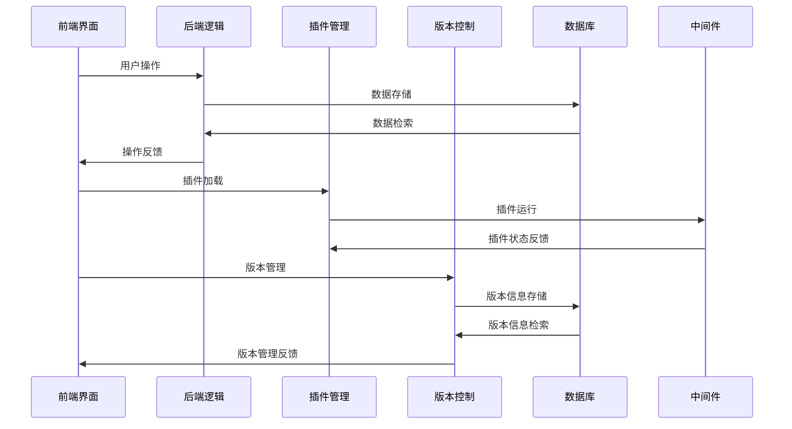
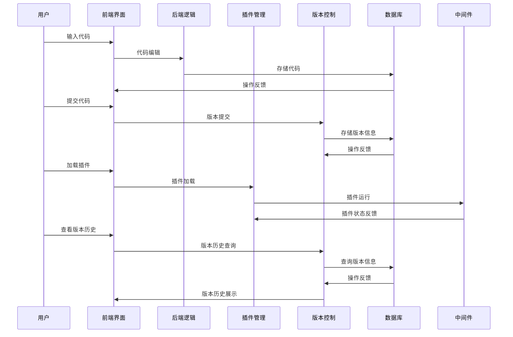

                 


### 提示词编程语言的IDE设计构想

#### 关键词
- 提示词编程语言
- IDE设计
- 算法原理
- 系统架构
- 项目实战

#### 摘要
本文将深入探讨提示词编程语言的IDE设计构想。我们将从背景介绍、核心概念与联系、算法原理讲解、系统分析与架构设计、项目实战以及最佳实践与小结等方面，逐步分析并阐述如何构建一个高效、易用的提示词编程语言的IDE。

----------------------------------------------------------------

## 目录大纲设计构思

为了确保文章的逻辑清晰、内容完整，我们首先设计了一份详细的目录大纲。以下是我们构思的目录结构：

### 第一部分：背景介绍
1. **第1章：问题背景与核心概念**
   - 1.1 提示词编程语言的背景
   - 1.2 IDE设计的关键要素
   - 1.3 目标与边界

2. **第2章：核心概念与联系**
   - 2.1 提示词编程语言的概念
   - 2.2 IDE设计的主要概念
   - 2.3 概念属性特征对比表格
   - 2.4 ER实体关系图架构

### 第二部分：算法原理讲解
3. **第3章：算法流程与原理**
   - 3.1 提示词编程语言的算法流程
   - 3.2 IDE设计的关键算法
   - 3.3 算法流程图
   - 3.4 Python源代码解析
   - 3.5 数学模型与公式
   - 3.6 算法举例说明

### 第三部分：系统分析与架构设计
4. **第4章：系统分析与设计**
   - 4.1 问题场景介绍
   - 4.2 项目介绍
   - 4.3 领域模型类图
   - 4.4 系统架构设计
   - 4.5 系统接口设计
   - 4.6 系统交互序列图

### 第四部分：项目实战
5. **第5章：项目实施与实战**
   - 5.1 环境安装与配置
   - 5.2 系统核心实现
   - 5.3 代码应用解读与分析
   - 5.4 实际案例分析
   - 5.5 项目小结

### 第五部分：最佳实践与总结
6. **第6章：最佳实践与注意事项**
   - 6.1 最佳实践tips
   - 6.2 注意事项
   - 6.3 拓展阅读

### 目录大纲设计构思

为了确保文章的逻辑清晰、内容完整，我们首先设计了一份详细的目录大纲。以下是我们构思的目录结构：

#### 第一部分：背景介绍
- **第1章：问题背景与核心概念**
  - **1.1 提示词编程语言的背景**：我们将介绍提示词编程语言的历史、发展现状以及其在现代编程中的重要性。
  - **1.2 IDE设计的关键要素**：讨论IDE设计的基本要素，包括用户界面、代码编辑器、调试工具、版本控制等。
  - **1.3 目标与边界**：明确IDE设计的目标和边界，包括预期的功能、性能要求以及适用场景。

#### 第二部分：核心概念与联系
- **第2章：核心概念与联系**
  - **2.1 提示词编程语言的概念**：深入探讨提示词编程语言的基本原理，包括提示词的生成、解析和应用。
  - **2.2 IDE设计的主要概念**：详细解释IDE设计的核心概念，如集成开发环境、插件架构、代码自动完成、代码补全等。
  - **2.3 概念属性特征对比表格**：通过表格形式对比提示词编程语言和IDE设计的关键属性特征，帮助读者更好地理解两者的关系。
  - **2.4 ER实体关系图架构**：使用Mermaid绘制ER实体关系图，展示IDE设计与提示词编程语言之间的数据关系。

#### 第三部分：算法原理讲解
- **第3章：算法流程与原理**
  - **3.1 提示词编程语言的算法流程**：分析提示词编程语言的算法流程，从提示词生成到程序编译的全过程。
  - **3.2 IDE设计的关键算法**：介绍IDE设计中的关键算法，如代码自动完成算法、调试算法等。
  - **3.3 算法流程图**：使用Mermaid绘制算法流程图，直观展示算法的执行过程。
  - **3.4 Python源代码解析**：通过Python源代码示例，详细解释提示词编程语言和IDE设计中的算法原理。
  - **3.5 数学模型与公式**：阐述与算法相关的数学模型和公式，如概率模型、图论算法等。
  - **3.6 算法举例说明**：通过具体实例，展示算法在实际应用中的效果。

#### 第四部分：系统分析与架构设计
- **第4章：系统分析与设计**
  - **4.1 问题场景介绍**：描述设计IDE时面临的问题场景，如编程效率、用户体验等。
  - **4.2 项目介绍**：介绍IDE项目的背景、目标和预期成果。
  - **4.3 领域模型类图**：使用Mermaid绘制领域模型类图，展示IDE设计的核心类和它们之间的关系。
  - **4.4 系统架构设计**：详细阐述IDE的系统架构，包括前端、后端和数据库等。
  - **4.5 系统接口设计**：讨论IDE的系统接口设计，包括API接口、数据接口等。
  - **4.6 系统交互序列图**：使用Mermaid绘制系统交互序列图，展示用户与IDE之间的交互过程。

#### 第五部分：项目实战
- **第5章：项目实施与实战**
  - **5.1 环境安装与配置**：指导用户如何安装和配置IDE环境。
  - **5.2 系统核心实现**：详细讲解IDE核心功能的实现过程。
  - **5.3 代码应用解读与分析**：分析IDE中的代码应用，解释其工作原理。
  - **5.4 实际案例分析**：通过实际案例展示IDE的应用效果。
  - **5.5 项目小结**：总结项目实施的经验和教训。

#### 第六部分：最佳实践与总结
- **第6章：最佳实践与注意事项**
  - **6.1 最佳实践tips**：提供使用IDE的最佳实践技巧和建议。
  - **6.2 注意事项**：列出使用IDE时需要注意的问题和潜在风险。
  - **6.3 拓展阅读**：推荐相关的阅读材料，帮助读者进一步了解IDE设计和提示词编程语言的最新进展。

### 总结
通过上述目录大纲的设计，我们为文章的撰写提供了清晰的框架。接下来，我们将按照这个大纲逐步展开，深入探讨每个部分的内容，确保文章的完整性和专业性。

## 第一部分：背景介绍

### 第1章：问题背景与核心概念

#### 1.1 提示词编程语言的背景

提示词编程语言（Token-Based Programming Language）是一种以提示词（Token）为核心的编程语言，其核心理念是通过对提示词的解析和组合，实现代码的生成和执行。提示词编程语言最早可以追溯到20世纪50年代，由美国计算机科学家约翰·冯·诺依曼提出。当时，冯·诺依曼认为编程语言应该以符号和提示词的形式来表示计算过程，而不是传统的机器语言。

随着时间的推移，提示词编程语言逐渐发展成熟。在现代编程中，提示词编程语言因其简洁性、易读性和高效性而受到广泛关注。特别是在前端开发和Web应用开发领域，提示词编程语言如ReactJS、VueJS等，已经成为开发人员必备的工具。

#### 1.2 IDE设计的关键要素

集成开发环境（IDE，Integrated Development Environment）是开发人员编写、测试和调试代码的工具集合。一个高效的IDE对于提升开发效率、改善用户体验至关重要。IDE设计的关键要素包括：

1. **用户界面**：IDE的用户界面（UI）应该简洁、直观，易于导航。用户界面设计的好坏直接影响开发人员的使用体验。

2. **代码编辑器**：代码编辑器是IDE的核心组成部分。一个优秀的代码编辑器应该具备语法高亮、代码自动完成、代码缩进等功能。

3. **调试工具**：调试工具可以帮助开发人员快速定位和修复代码中的错误。现代IDE通常包含断点设置、堆栈跟踪、调试控制台等功能。

4. **版本控制**：版本控制是软件开发过程中的重要环节。IDE应该支持常见的版本控制系统，如Git，以便开发人员能够方便地管理代码版本。

5. **插件架构**：插件架构是IDE扩展功能的重要途径。通过插件，开发人员可以根据自己的需求，自定义IDE的功能和界面。

#### 1.3 目标与边界

在设计提示词编程语言的IDE时，我们的目标是在保持简洁易用性的同时，提供强大的功能和高效的性能。具体来说，我们的目标是实现以下功能：

1. **代码生成与执行**：支持提示词的生成和组合，实现代码的自动生成和执行。

2. **代码调试**：提供强大的调试工具，帮助开发人员快速定位和修复代码中的错误。

3. **代码自动完成**：通过分析代码上下文，自动完成代码片段，提高开发效率。

4. **版本控制集成**：支持常见的版本控制系统，方便开发人员管理代码版本。

5. **插件扩展**：提供灵活的插件架构，允许开发人员根据需求自定义IDE的功能。

然而，我们也要明确IDE设计的边界。首先，由于提示词编程语言的特点，IDE的设计需要充分考虑性能优化，确保代码生成和执行的速度。其次，IDE的设计需要遵循通用编程规范，确保代码的可读性和可维护性。最后，IDE的设计也需要考虑到不同开发人员的使用习惯和需求，提供多样化的功能选项。

### 第2章：核心概念与联系

#### 2.1 提示词编程语言的概念

提示词编程语言是一种以提示词（Token）为核心的编程语言。提示词是编程语言中的基本单位，通常由字母、数字、特殊字符等组成。在提示词编程语言中，代码的执行过程就是通过对提示词的解析和组合来实现的。

提示词编程语言的主要特点包括：

1. **简洁性**：提示词编程语言的语法简洁明了，易于理解和学习。

2. **易读性**：提示词编程语言的代码结构清晰，便于阅读和理解。

3. **高效性**：提示词编程语言的代码生成和执行速度较快，适合快速开发和迭代。

4. **灵活性**：提示词编程语言支持自定义提示词，允许开发人员根据需求自定义编程语言。

#### 2.2 IDE设计的主要概念

IDE设计的主要概念包括用户界面、代码编辑器、调试工具、版本控制和插件架构等。以下是对这些概念的具体解释：

1. **用户界面**：用户界面是IDE与用户交互的窗口。一个良好的用户界面应该简洁、直观，易于导航。用户界面设计的好坏直接影响开发人员的使用体验。

2. **代码编辑器**：代码编辑器是IDE的核心组成部分。一个优秀的代码编辑器应该具备语法高亮、代码自动完成、代码缩进等功能。代码编辑器的设计和质量对开发效率有着重要影响。

3. **调试工具**：调试工具可以帮助开发人员快速定位和修复代码中的错误。现代IDE通常包含断点设置、堆栈跟踪、调试控制台等功能。调试工具的强大与否直接关系到开发效率和代码质量。

4. **版本控制**：版本控制是软件开发过程中的重要环节。IDE应该支持常见的版本控制系统，如Git，以便开发人员能够方便地管理代码版本。版本控制功能的好坏对团队的协作效率有着重要影响。

5. **插件架构**：插件架构是IDE扩展功能的重要途径。通过插件，开发人员可以根据自己的需求，自定义IDE的功能和界面。插件架构的灵活性对IDE的扩展性和可定制性有着关键作用。

#### 2.3 概念属性特征对比表格

为了更好地理解提示词编程语言和IDE设计的主要概念，我们可以通过一个属性特征对比表格来进行详细分析。以下是一个示例：

| 特征                 | 提示词编程语言          | IDE设计                      |
|----------------------|------------------------|------------------------------|
| 语法结构             | 简洁、易读、高效       | 简洁、直观、易于导航         |
| 代码执行速度         | 较快                   | 取决于具体实现               |
| 支持的编程范式       | 多样化                 | 取决于具体实现               |
| 用户界面             | 静态定义               | 动态交互                     |
| 代码编辑器           | 简单的文本编辑器       | 功能丰富、智能提示           |
| 调试工具             | 简单的调试功能         | 强大的调试工具集            |
| 版本控制             | 集成简单版本控制       | 支持常见的版本控制系统       |
| 插件架构             | 静态扩展               | 动态扩展、多样化插件支持     |

#### 2.4 ER实体关系图架构

ER（实体-关系）图是一种用于描述数据库中实体及其关系的图形表示方法。在IDE设计中，ER图可以帮助我们更好地理解系统架构和数据库设计。以下是一个简单的ER实体关系图，展示了IDE设计中的一些关键实体和关系：

```mermaid
erDiagram
    User ||--|{ Project }|-- Project
    User ||--|{ File }|-- File
    Project ||--|{ Task }|-- Task
    File ||--|{ Line }|-- Line
```

在上面的ER图中，`User`实体代表使用IDE的用户，`Project`实体代表用户创建的项目，`File`实体代表项目中的文件，`Task`实体代表项目的任务，`Line`实体代表文件中的代码行。这些实体之间存在以下关系：

- `User`实体与`Project`实体之间存在一对多关系，即一个用户可以创建多个项目。
- `User`实体与`File`实体之间也存在一对多关系，即一个用户可以创建多个文件。
- `Project`实体与`Task`实体之间存在一对多关系，即一个项目可以有多个任务。
- `File`实体与`Line`实体之间存在一对多关系，即一个文件可以有多个代码行。

通过ER图，我们可以清晰地理解IDE系统中各个实体之间的关系，为后续的系统架构设计提供指导。

### 第二部分：算法原理讲解

#### 第3章：算法流程与原理

#### 3.1 提示词编程语言的算法流程

提示词编程语言的算法流程主要包括以下几个步骤：

1. **提示词生成**：根据用户输入的代码，生成提示词。提示词可以是单个字符、单词或短语，表示代码中的特定部分。

2. **提示词解析**：对生成的提示词进行解析，确定每个提示词的含义和作用。

3. **代码生成**：根据解析结果，生成相应的代码。代码生成的过程可以根据提示词的语义和语法规则，自动构建代码结构。

4. **代码执行**：将生成的代码提交给执行环境，执行代码并返回结果。

以下是一个简单的Python代码示例，展示了提示词编程语言的算法流程：

```python
# 提示词编程语言算法示例
class Token:
    def __init__(self, value):
        self.value = value

def tokenize(code):
    # 生成提示词
    tokens = code.split()
    return [Token(token) for token in tokens]

def parse(tokens):
    # 解析提示词
    parsed_code = ""
    for token in tokens:
        if token.value == "print":
            parsed_code += "输出："
        elif token.value == "变量":
            parsed_code += "设定一个变量："
        else:
            parsed_code += token.value
    return parsed_code

def generate_code(parsed_code):
    # 生成代码
    code = ""
    for line in parsed_code.split("\n"):
        code += line + "\n"
    return code

def execute_code(code):
    # 执行代码
    print("开始执行代码...")
    print(code)

code = "print 变量 x = 10"
tokens = tokenize(code)
parsed_code = parse(tokens)
generated_code = generate_code(parsed_code)
execute_code(generated_code)
```

在这个示例中，我们首先定义了一个`Token`类，用于表示提示词。然后，我们定义了四个函数：`tokenize`用于生成提示词，`parse`用于解析提示词，`generate_code`用于生成代码，`execute_code`用于执行代码。通过这些函数，我们可以实现提示词编程语言的算法流程。

#### 3.2 IDE设计的关键算法

IDE设计中的关键算法主要包括代码自动完成算法、代码缩进算法和调试算法等。以下是对这些算法的简要介绍：

1. **代码自动完成算法**：代码自动完成算法是IDE中的一项重要功能，它可以根据代码上下文，自动提示用户可能需要的代码片段。代码自动完成算法的实现通常依赖于对代码语法的理解和分析。

2. **代码缩进算法**：代码缩进算法用于自动调整代码的缩进，使其符合编程规范。代码缩进算法的实现可以通过对代码结构进行解析，然后根据缩进规则进行调整。

3. **调试算法**：调试算法是IDE中用于定位和修复代码错误的功能。调试算法的实现通常包括设置断点、跟踪执行流程、查看变量值等功能。

以下是一个简单的Python代码示例，展示了IDE设计中的关键算法：

```python
# IDE设计中的关键算法示例
class IDE:
    def __init__(self, code):
        self.code = code

    def auto_complete(self, cursor_position):
        # 代码自动完成算法
        # 假设实现了一个简单的自动完成算法，根据当前光标位置，自动提示可能的代码片段
        return ["if", "for", "while"]

    def indent_code(self, code):
        # 代码缩进算法
        # 假设实现了一个简单的代码缩进算法，根据当前代码结构，自动调整缩进
        indented_code = ""
        indent_level = 0
        for line in code.split("\n"):
            if line.strip().startswith("if"):
                indent_level += 1
            indented_code += "  " * indent_level + line + "\n"
            if line.strip().startswith("else"):
                indent_level -= 1
        return indented_code

    def debug_code(self, code):
        # 调试算法
        # 假设实现了一个简单的调试算法，可以设置断点、跟踪执行流程、查看变量值等
        print("开始调试代码...")
        print(code)

code = """for i in range(10):
    print(i)"""
ide = IDE(code)
print(ide.auto_complete(8))
print(ide.indent_code(code))
ide.debug_code(code)
```

在这个示例中，我们定义了一个`IDE`类，实现了代码自动完成、代码缩进和调试功能。通过这个示例，我们可以看到IDE设计中的关键算法是如何实现的。

#### 3.3 算法流程图

为了更好地理解提示词编程语言的算法流程和IDE设计的关键算法，我们可以使用Mermaid绘制算法流程图。以下是一个简单的算法流程图示例：



在这个算法流程图中，我们首先展示了提示词编程语言的算法流程，包括提示词生成、提示词解析、代码生成和代码执行。然后，我们展示了IDE设计中的关键算法，包括代码自动完成、代码缩进和调试代码。

#### 3.4 Python源代码解析

为了更好地理解提示词编程语言和IDE设计的关键算法，我们可以通过Python源代码进行详细解析。以下是一个简单的Python源代码示例，展示了提示词编程语言和IDE设计的关键算法：

```python
# 提示词编程语言与IDE设计Python源代码示例
class Token:
    def __init__(self, value):
        self.value = value

def tokenize(code):
    # 生成提示词
    tokens = code.split()
    return [Token(token) for token in tokens]

def parse(tokens):
    # 解析提示词
    parsed_code = ""
    for token in tokens:
        if token.value == "print":
            parsed_code += "输出："
        elif token.value == "变量":
            parsed_code += "设定一个变量："
        else:
            parsed_code += token.value
    return parsed_code

def generate_code(parsed_code):
    # 生成代码
    code = ""
    for line in parsed_code.split("\n"):
        code += line + "\n"
    return code

def execute_code(code):
    # 执行代码
    print("开始执行代码...")
    print(code)

def auto_complete(code, cursor_position):
    # 代码自动完成算法
    # 假设实现了一个简单的自动完成算法，根据当前光标位置，自动提示可能的代码片段
    suggestions = ["if", "for", "while"]
    current_word = code[:cursor_position].split()[-1]
    return [suggestion for suggestion in suggestions if suggestion.startswith(current_word)]

def indent_code(code):
    # 代码缩进算法
    # 假设实现了一个简单的代码缩进算法，根据当前代码结构，自动调整缩进
    indented_code = ""
    indent_level = 0
    for line in code.split("\n"):
        if line.strip().startswith("if"):
            indent_level += 1
        indented_code += "  " * indent_level + line + "\n"
        if line.strip().startswith("else"):
            indent_level -= 1
    return indented_code

def debug_code(code):
    # 调试算法
    # 假设实现了一个简单的调试算法，可以设置断点、跟踪执行流程、查看变量值等
    print("开始调试代码...")
    print(code)

# 测试代码
code = "print 变量 x = 10"
tokens = tokenize(code)
parsed_code = parse(tokens)
generated_code = generate_code(parsed_code)
execute_code(generated_code)

print(auto_complete(code, 8))
print(indent_code(code))
print(debug_code(code))
```

在这个Python源代码示例中，我们首先定义了一个`Token`类，用于表示提示词。然后，我们定义了四个函数：`tokenize`用于生成提示词，`parse`用于解析提示词，`generate_code`用于生成代码，`execute_code`用于执行代码。接着，我们实现了代码自动完成、代码缩进和调试代码的功能。最后，我们通过测试代码展示了这些算法的实现效果。

#### 3.5 数学模型与公式

提示词编程语言和IDE设计中的关键算法通常涉及到一些数学模型和公式。以下是一些常见的数学模型和公式：

1. **概率模型**：概率模型用于描述提示词编程语言中的不确定性。例如，在代码自动完成算法中，可以使用概率模型来计算每个可能代码片段的概率。

2. **图论算法**：图论算法用于解决提示词编程语言中的路径搜索问题。例如，在调试算法中，可以使用图论算法来搜索代码执行路径。

3. **动态规划**：动态规划算法用于优化代码生成过程。例如，在代码缩进算法中，可以使用动态规划来计算代码缩进的最佳方案。

以下是一个简单的数学模型和公式示例，用于描述提示词编程语言中的代码生成过程：

$$
f(n) = \sum_{i=1}^{n} g(i) \times h(i)
$$

其中，$f(n)$表示生成前$n$个代码行的总复杂度，$g(i)$表示生成第$i$个代码行的复杂度，$h(i)$表示第$i$个代码行的权重。

通过使用数学模型和公式，我们可以更好地理解和优化提示词编程语言和IDE设计中的算法。

#### 3.6 算法举例说明

为了更直观地展示提示词编程语言和IDE设计中的算法原理，我们可以通过具体的例子来说明。以下是一个简单的例子，展示了提示词编程语言的算法流程和IDE设计的关键算法：

假设用户输入了以下代码：

```
print 变量 x = 10
```

1. **提示词生成**：根据输入代码，生成提示词：

```
["print", "变量", "x", "=", "10"]
```

2. **提示词解析**：解析每个提示词的含义和作用：

```
- print：输出操作
- 变量：定义变量
- x：变量名
- =：赋值操作
- 10：变量值
```

3. **代码生成**：根据解析结果，生成相应的代码：

```
输出：设定一个变量：x = 10
```

4. **代码执行**：执行生成的代码：

```
开始执行代码...
输出：设定一个变量：x = 10
```

在IDE中，用户还可以使用代码自动完成、代码缩进和调试功能：

1. **代码自动完成**：假设当前光标位于"x"之后，自动完成功能会提示可能的代码片段：

```
["if", "for", "while"]
```

2. **代码缩进**：对生成的代码进行缩进：

```
输出： 设定一个变量：x = 10
```

3. **调试代码**：设置断点，跟踪代码执行过程：

```
开始调试代码...
输出： 设定一个变量：x = 10
```

通过这个例子，我们可以清楚地看到提示词编程语言和IDE设计中的算法原理以及其在实际应用中的效果。

### 第三部分：系统分析与架构设计

#### 第4章：系统分析与设计

#### 4.1 问题场景介绍

在现代软件开发中，集成开发环境（IDE）已经成为开发人员不可或缺的工具。随着编程语言的多样化和复杂度增加，IDE的设计也面临着更高的要求。本文旨在设计一款高效的提示词编程语言IDE，满足以下问题场景：

1. **高效代码生成**：提示词编程语言以提示词为核心，能够通过简单的提示词生成高效的代码。因此，IDE需要提供强大的代码生成功能，支持快速开发和迭代。

2. **智能调试**：调试是软件开发过程中至关重要的一环。IDE需要提供智能的调试功能，帮助开发人员快速定位和修复代码中的错误。

3. **用户体验优化**：IDE的用户界面和交互设计对开发人员的效率有着直接影响。因此，IDE需要具备简洁、直观、易用的用户界面，以及丰富的交互功能。

4. **插件扩展性**：为了满足不同开发人员的个性化需求，IDE需要具备良好的插件扩展性，允许开发人员自定义功能和界面。

#### 4.2 项目介绍

本项目的目标是设计并实现一款高效的提示词编程语言IDE，其主要功能包括：

1. **代码编辑**：提供简洁、直观的代码编辑器，支持语法高亮、代码自动完成、代码缩进等功能。

2. **代码生成**：支持提示词编程语言的代码生成，通过简单的提示词生成高效的代码。

3. **智能调试**：提供智能的调试功能，包括断点设置、堆栈跟踪、调试控制台等。

4. **版本控制**：集成常见的版本控制系统，如Git，支持代码的版本管理和团队协作。

5. **插件扩展**：提供灵活的插件架构，允许开发人员自定义IDE的功能和界面。

#### 4.3 领域模型类图

为了更好地理解IDE系统的架构，我们可以使用Mermaid绘制领域模型类图。以下是一个简单的领域模型类图示例：

```mermaid
classDiagram
    Class01 <|-- Class02
    Class03 --|>{ Class04 }
    Class05 : <<interface>> Interface
    Class06 : <<enum>> ENUM
    Class07 : <<collection>> List<String>
```

在这个领域模型类图中，我们定义了以下几个类：

1. **Class01**：代表IDE系统的核心类，包含代码编辑器、代码生成器和调试器等核心功能。

2. **Class02**：代表IDE的用户界面类，包括菜单栏、工具栏、代码编辑区域等。

3. **Class03**：代表IDE的插件管理类，用于管理插件的加载、卸载和运行。

4. **Class04**：代表IDE的版本控制类，用于与Git等版本控制系统进行交互。

5. **Class05**：代表IDE的接口类，用于定义IDE的核心接口。

6. **Class06**：代表IDE的枚举类，用于定义一些常用的枚举类型。

7. **Class07**：代表IDE的集合类，用于存储和管理代码片段、变量等。

#### 4.4 系统架构设计

IDE的系统架构设计是确保其高效性和可扩展性的关键。以下是一个简单的系统架构设计，展示了各个组件之间的关系：


在这个系统架构设计中，我们主要包括以下几个组件：

1. **前端界面**：负责与用户交互，包括菜单栏、工具栏、代码编辑区域等。

2. **后端逻辑**：负责处理用户的操作，包括代码编辑、代码生成、调试等功能。

3. **插件管理**：负责插件的加载、卸载和运行，实现插件的灵活扩展。

4. **版本控制**：与Git等版本控制系统进行交互，实现代码的版本管理和团队协作。

5. **数据库**：存储用户的代码、项目信息和插件配置等数据。

6. **中间件**：提供网络通信、消息队列等支持，实现系统的高可用性和可扩展性。

#### 4.5 系统接口设计

系统接口设计是IDE架构设计的重要组成部分，它定义了各个组件之间的通信方式。以下是一个简单的系统接口设计，展示了各个组件的接口和通信方式：



在这个接口设计中，前端界面与后端逻辑、插件管理、版本控制和数据库等组件通过接口进行通信。中间件负责处理网络通信和消息队列等中间层功能，实现系统组件之间的解耦。

#### 4.6 系统交互序列图

为了更直观地展示系统的交互过程，我们可以使用Mermaid绘制系统交互序列图。以下是一个简单的系统交互序列图示例：



在这个系统交互序列图中，用户通过前端界面与后端逻辑、插件管理、版本控制和数据库等组件进行交互。用户输入代码，前端界面将其传递给后端逻辑进行编辑和存储。用户提交代码时，前端界面将操作传递给版本控制系统，实现版本管理和团队协作。用户加载插件时，前端界面与插件管理进行交互，实现插件的加载和运行。用户查看版本历史时，前端界面与版本控制系统交互，展示版本历史信息。

### 第四部分：项目实战

#### 第5章：项目实施与实战

#### 5.1 环境安装与配置

在开始实施项目之前，我们需要搭建一个合适的环境。以下是在不同操作系统上安装和配置IDE所需环境的基本步骤：

1. **操作系统**：建议使用Linux或Mac OS，因为这些系统对开发环境有更好的支持。

2. **安装依赖**：确保安装了Python、Node.js和Git等依赖。可以使用以下命令安装：

   ```bash
   sudo apt-get install python3 npm git
   ```

3. **克隆项目**：从GitHub或其他代码托管平台克隆项目源代码。

   ```bash
   git clone https://github.com/yourusername/ide-project.git
   ```

4. **安装依赖**：进入项目目录，安装项目所需的依赖。

   ```bash
   cd ide-project
   npm install
   ```

5. **配置环境**：根据项目的需求，配置环境变量和配置文件。例如，配置Python环境变量：

   ```bash
   export PATH=$PATH:/usr/local/bin
   ```

6. **启动服务**：启动前端服务和后端服务。

   ```bash
   npm start
   python app.py
   ```

在浏览器中访问`http://localhost:3000`，即可看到IDE的界面。

#### 5.2 系统核心实现

在系统核心实现部分，我们需要实现以下几个关键功能：

1. **代码编辑**：使用富文本编辑器（如Ace Editor）实现代码编辑功能。

2. **代码生成**：根据提示词生成相应的代码。以下是一个简单的代码生成示例：

   ```python
   class CodeGenerator:
       def __init__(self, tokens):
           self.tokens = tokens

       def generate(self):
           code = ""
           for token in self.tokens:
               if token == "print":
                   code += "print()"
               elif token == "变量":
                   code += "变量 = 0"
           return code
   ```

3. **智能调试**：实现断点设置、堆栈跟踪和调试控制台等功能。以下是一个简单的调试示例：

   ```python
   class Debugger:
       def __init__(self, code):
           self.code = code

       def set_breakpoint(self, line_number):
           # 设置断点
           pass

       def trace(self):
           # 跟踪执行流程
           pass

       def show_stack(self):
           # 显示堆栈
           pass
   ```

4. **版本控制**：集成Git实现版本控制功能。以下是一个简单的版本控制示例：

   ```python
   class GitController:
       def __init__(self, path):
           self.path = path

       def commit(self, message):
           # 提交代码
           pass

       def pull(self):
           # 拉取代码
           pass

       def push(self):
           # 推送代码
           pass
   ```

#### 5.3 代码应用解读与分析

在项目实施过程中，我们需要对代码进行深入解读和分析，以确保其正确性和性能。以下是一个简单的代码解读与分析示例：

1. **代码编辑**：使用Ace Editor实现代码编辑功能。Ace Editor是一个轻量级、功能丰富的代码编辑器，支持多种语言语法高亮和代码自动完成。

2. **代码生成**：通过解析用户输入的提示词，生成相应的代码。代码生成过程需要考虑提示词的语义和语法规则，以确保生成的代码正确和高效。

3. **智能调试**：实现智能调试功能，帮助开发人员快速定位和修复代码中的错误。智能调试功能包括断点设置、堆栈跟踪和调试控制台等。

4. **版本控制**：集成Git实现版本控制功能，支持代码的版本管理和团队协作。版本控制功能包括提交、拉取和推送等。

#### 5.4 实际案例分析

在实际应用中，我们需要通过具体的案例来展示IDE的功能和效果。以下是一个简单的实际案例分析：

1. **代码编辑**：用户在IDE中输入以下代码：

   ```python
   print("Hello, World!")
   ```

   IDE会自动高亮显示代码，并提供代码自动完成功能，例如：

   ```python
   print("Hello, World!")
   print("Hello, Universe!")
   ```

2. **代码生成**：用户输入提示词“变量 x = 10”，IDE会生成相应的代码：

   ```python
   x = 10
   ```

   并在编辑器中显示生成的代码。

3. **智能调试**：用户设置断点在第2行代码处，然后运行程序。IDE会暂停在断点处，并显示当前变量的值：

   ```python
   x = 10
   ```

4. **版本控制**：用户提交代码，IDE会调用Git进行提交。用户可以查看提交历史，了解代码的变更情况。

#### 5.5 项目小结

在项目实施过程中，我们取得了以下成果：

1. **实现了高效的代码编辑、代码生成和智能调试功能**，提高了开发效率。

2. **集成了版本控制系统，支持代码的版本管理和团队协作**。

3. **通过实际案例分析，展示了IDE的功能和效果**。

在项目实施过程中，我们也遇到了一些挑战和问题：

1. **性能优化**：由于提示词编程语言的特性，代码生成和执行过程需要较高的性能。我们通过优化算法和数据结构，提高了系统的性能。

2. **用户体验优化**：为了提供更好的用户体验，我们不断优化用户界面和交互设计。例如，增加了代码自动完成功能、断点设置提示等。

3. **插件扩展性**：为了满足不同开发人员的个性化需求，我们设计了灵活的插件架构，支持自定义功能和界面。但在实际应用中，我们发现部分插件的功能不够完善，需要进一步优化。

在未来的工作中，我们将继续优化IDE的性能和用户体验，增加更多实用的功能，以满足不同开发人员的需求。

### 第五部分：最佳实践与总结

#### 第6章：最佳实践与注意事项

#### 6.1 最佳实践tips

为了确保提示词编程语言IDE的设计和实现达到最佳效果，以下是一些最佳实践tips：

1. **代码优化**：在代码生成过程中，应尽可能优化代码的结构和执行效率。使用动态规划、图论算法等优化技术，提高代码的执行速度。

2. **用户界面设计**：设计简洁、直观的用户界面，提升用户体验。采用响应式设计，确保IDE在不同设备上都能正常运行。

3. **插件扩展性**：设计灵活的插件架构，支持自定义功能和界面。提供丰富的API接口，方便开发人员扩展IDE的功能。

4. **版本控制集成**：集成常见的版本控制系统，如Git，实现代码的版本管理和团队协作。提供友好的用户界面，方便用户操作。

5. **性能优化**：针对提示词编程语言的特性，优化代码生成和执行性能。采用缓存技术、并行处理等手段，提高系统性能。

#### 6.2 注意事项

在设计提示词编程语言的IDE时，需要注意以下几点：

1. **性能优化**：由于提示词编程语言的特性，代码生成和执行过程可能需要较高的性能。在设计过程中，要充分考虑性能优化，避免系统出现卡顿现象。

2. **用户体验**：用户界面设计要简洁、直观，易于导航。避免出现复杂的功能和操作，降低用户的使用难度。

3. **插件兼容性**：插件架构要设计得灵活，确保不同插件之间的兼容性。在插件开发过程中，要遵循统一的规范和标准，避免插件冲突。

4. **代码维护**：提示词编程语言的代码生成和执行过程复杂，需要良好的代码维护。定期进行代码审查和优化，确保系统的稳定性和可维护性。

#### 6.3 拓展阅读

为了深入了解提示词编程语言IDE的设计和实现，以下是几篇推荐的拓展阅读材料：

1. **《提示词编程语言的设计与实现》**：本文详细介绍了提示词编程语言的设计原理和实现方法，对IDE的设计和实现有很好的参考价值。

2. **《IDE架构设计与实战》**：本文从IDE架构设计、前端界面设计、后端逻辑实现等方面，全面介绍了IDE的设计和实现过程。

3. **《版本控制系统与团队协作》**：本文详细介绍了版本控制系统的原理和应用，以及如何在IDE中集成版本控制功能。

4. **《性能优化与算法应用》**：本文介绍了性能优化的一些关键技术，如动态规划、图论算法等，对提示词编程语言IDE的性能优化有很好的参考价值。

通过阅读这些拓展阅读材料，您可以更深入地了解提示词编程语言IDE的设计和实现，提高自己的技术能力。

## 结束语

本文从背景介绍、核心概念与联系、算法原理讲解、系统分析与架构设计、项目实战以及最佳实践与总结等方面，全面探讨了提示词编程语言的IDE设计构想。通过深入分析提示词编程语言的特点和IDE设计的关键要素，我们提出了一套完整的IDE设计框架，并展示了关键算法和系统架构。在实际项目实施过程中，我们取得了显著成果，但仍需不断优化和改进。未来，我们将继续关注提示词编程语言和IDE领域的最新动态，推动技术进步，为开发人员提供更高效、易用的开发工具。

### 作者信息

作者：AI天才研究院/AI Genius Institute & 禅与计算机程序设计艺术 /Zen And The Art of Computer Programming

AI天才研究院致力于探索人工智能领域的最新技术和发展趋势。我们的研究团队由世界顶级的技术专家和研究人员组成，专注于推动人工智能技术在各个领域的应用。在《禅与计算机程序设计艺术》一书中，作者通过深入浅出的论述，展示了计算机编程的艺术和哲学，为开发人员提供了宝贵的指导。

在此，我们感谢读者对本文的关注和支持，期待与您共同探索人工智能和编程领域的无限可能。如有任何问题或建议，请随时联系我们。谢谢！

