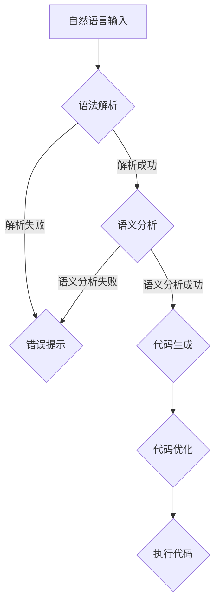
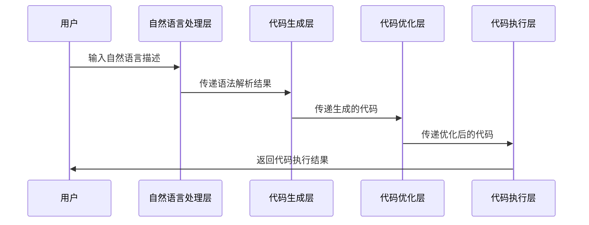

                 


# 《提示词编程语言的优势与局限性》

## 关键词

- 提示词编程语言
- 优势与局限性
- 开发效率
- 可读性
- 技术实现
- 安全隐私

## 摘要

本文旨在探讨提示词编程语言的优势与局限性。随着人工智能和自然语言处理技术的进步，提示词编程语言逐渐崭露头角，成为提高编程开发效率、增强代码可读性的新兴工具。文章首先介绍提示词编程语言的基本概念和特点，然后分析其在提高开发效率、增强代码可读性和跨领域应用等方面的优势，同时探讨其技术实现难度、学习成本和安全性等局限性。最后，通过案例分析和发展趋势展望，为提示词编程语言的发展提供解决方案和建议。

----------------------------------------------------------------

# 目录大纲：提示词编程语言的优势与局限性

- **引言**
  - 1.1 书籍背景与目的
  - 1.2 提示词编程语言概述
  - 1.3 优势与局限性的研究意义
- **优势分析**
  - 2.1 提高开发效率
  - 2.2 增强代码可读性和维护性
  - 2.3 创新与跨领域应用
- **局限性探讨**
  - 3.1 技术实现难度
  - 3.2 学习与适应成本
  - 3.3 安全与隐私问题
- **案例分析**
  - 4.1 国内外典型应用案例
  - 4.2 行业发展趋势与未来展望
- **解决方案与建议**
  - 5.1 技术改进方向
  - 5.2 教育与人才培养
  - 5.3 法律法规与伦理规范
- **总结与展望**
  - 6.1 书籍总结
  - 6.2 未来研究展望

----------------------------------------------------------------

## 第一部分：引言

### 1.1 书籍背景与目的

随着信息技术的高速发展，编程语言在软件工程中扮演着至关重要的角色。传统的编程语言如C、Java和Python等，以其强大的功能、严格的语法和高效的执行能力，为开发者提供了强大的工具。然而，这些语言也存在一些局限性，如代码量庞大、维护难度高、学习曲线较陡峭等。为了克服这些挑战，研究者们不断探索新的编程语言和范式。

近年来，人工智能和自然语言处理技术的突破，为编程语言的发展带来了新的契机。提示词编程语言（Natural Language Programming, NLP）应运而生，它允许开发者使用自然语言来描述程序的行为，从而显著降低编程的难度，提高开发效率。本书籍旨在探讨提示词编程语言的优势与局限性，为读者提供深入理解和评估这一新兴编程范式的基础。

本文书籍的主要目的如下：

1. **介绍提示词编程语言的基本概念和特点**：包括定义、分类、工作原理和与传统编程语言的对比。
2. **分析提示词编程语言的优势**：探讨其在提高开发效率、增强代码可读性和跨领域应用等方面的表现。
3. **讨论提示词编程语言的局限性**：分析其在技术实现、学习成本和安全性等方面的挑战。
4. **通过案例分析，总结成功与失败的教训**：为提示词编程语言的实际应用提供指导。
5. **展望未来发展趋势**：提出解决方案和改进建议，为该领域的研究和实践提供方向。

通过本文书籍，读者可以全面了解提示词编程语言的现状和前景，为在软件开发中合理应用这一新兴工具提供参考。

### 1.2 提示词编程语言概述

#### 1.2.1 定义与分类

提示词编程语言，顾名思义，是一种基于自然语言的编程语言。与传统的文本编程语言不同，提示词编程语言允许开发者使用类似于日常交流的语言来描述程序的行为。这种语言的定义通常包括几个关键要素：自然语言的理解、语义分析、代码生成和执行。

根据不同的分类标准，提示词编程语言可以划分为多种类型：

1. **领域特定语言（Domain-Specific Language, DSL）**：这些语言针对特定的应用领域设计，如SQL用于数据库查询、HTML用于网页设计。提示词编程语言也属于这一类，但它们更具自然语言的特性。
2. **通用编程语言扩展**：这类语言在现有通用编程语言（如Python、JavaScript）的基础上，引入自然语言处理组件，使得开发者可以使用自然语言片段来编写代码。
3. **全新的编程范式**：如人工智能驱动的编程工具，如AutoSketch，它通过自然语言描述来生成复杂的图形和算法。

#### 1.2.2 工作原理与基本特点

提示词编程语言的工作原理通常涉及以下几个关键步骤：

1. **自然语言解析**：将开发者输入的自然语言描述转换为结构化的数据格式，如抽象语法树（AST）。
2. **语义分析**：理解自然语言中的语义信息，将其映射到编程语言的操作和结构中。
3. **代码生成**：根据语义分析的结果，生成可执行的代码。
4. **执行**：运行生成的代码，实现开发者所描述的功能。

提示词编程语言的基本特点包括：

- **可读性**：自然语言的表达方式使得代码更加直观易懂，降低了学习曲线。
- **高效性**：通过减少代码量和提高代码生成速度，提示词编程语言提高了开发效率。
- **灵活性**：能够处理复杂的任务和多样化的需求，适用于跨领域应用。
- **可扩展性**：可以结合现有编程语言和技术，实现更多功能。

#### 1.2.3 与传统编程语言的对比

提示词编程语言与传统编程语言在多个方面存在显著差异：

1. **语法和表达方式**：传统编程语言通常依赖于严格定义的语法规则，而提示词编程语言使用自然语言，更加灵活和直观。
2. **开发难度**：传统编程语言对开发者有较高的技术要求，而提示词编程语言降低了编程的门槛，使得非专业开发者也能够参与项目。
3. **维护成本**：传统编程语言代码量较大，维护成本高，而提示词编程语言通过减少代码量和提高可读性，降低了维护难度。
4. **应用范围**：传统编程语言通常针对特定领域，而提示词编程语言由于其自然语言特性，能够更广泛地应用于多个领域。

总的来说，提示词编程语言在开发效率、可读性和灵活性方面具有明显优势，但同时也面临技术实现难度、学习成本和安全性等挑战。

### 1.3 优势与局限性的研究意义

#### 1.3.1 优势

提示词编程语言的优势在于其能够显著提高开发效率、增强代码可读性和维护性，并在跨领域应用中展现强大潜力。

首先，提示词编程语言通过自然语言输入，减少了代码编写的工作量。开发者无需关心语法细节，只需描述程序所需实现的功能，系统自动生成相应的代码。这种方式的代码生成和优化功能不仅提高了开发速度，还降低了出错的概率。

其次，提示词编程语言增强了代码的可读性。自然语言的表达方式使得代码更易于理解和维护，尤其是在处理复杂逻辑和业务规则时，其优势尤为明显。此外，提示词编程语言提高了代码的语义清晰度，使得团队合作和知识共享更加顺畅。

最后，提示词编程语言具有跨领域应用的潜力。通过自然语言描述，开发者可以轻松地在不同领域之间切换，从而适应多样化的项目需求。例如，在人工智能、数据分析、图形设计等领域，提示词编程语言已经展现出其独特的优势。

#### 1.3.2 局限性

然而，提示词编程语言也存在一些局限性，主要表现在技术实现难度、学习成本和安全性等方面。

首先，提示词编程语言在语法和语义理解方面面临巨大挑战。自然语言的复杂性和多义性使得解析和生成代码变得复杂，需要高性能的自然语言处理技术来支持。此外，不同应用场景下的提示词表达方式可能存在不一致，增加了系统开发的复杂性。

其次，提示词编程语言的学习成本较高。开发者需要掌握自然语言处理技术和提示词编程语言的特定规则，这对非专业开发者来说是一个不小的挑战。此外，现有的提示词编程语言生态系统不完善，缺少足够的开发工具和资源，也增加了学习的难度。

最后，提示词编程语言在安全性方面也存在潜在风险。由于自然语言描述的模糊性，系统可能难以准确理解开发者的意图，从而引发安全漏洞。此外，提示词编程语言的数据处理和存储机制也需要确保隐私保护，以防止数据泄露和滥用。

综上所述，提示词编程语言在提高开发效率和增强代码可读性方面具有显著优势，但在技术实现难度、学习成本和安全性等方面面临挑战。对这些问题的深入研究和解决方案的提出，对于提示词编程语言的广泛应用和持续发展具有重要意义。

----------------------------------------------------------------

## 第二部分：优势分析

### 2.1 提高开发效率

#### 2.1.1 提示词减少代码量

提示词编程语言的一个显著优势在于其能够显著减少代码量，从而提高开发效率。在传统的编程语言中，开发者需要编写大量冗长的代码来描述程序的功能和行为。例如，一个简单的数据处理任务可能需要数十行代码来实现，包括数据读取、处理和输出等步骤。而在提示词编程语言中，开发者只需使用自然语言描述任务的需求，系统便会自动生成相应的代码。

例如，在一个使用Python的提示词编程工具中，开发者可以输入如下自然语言描述：

```
编写一个程序，从文件中读取员工数据，计算平均薪资，并将结果输出到控制台。
```

系统会自动生成以下Python代码：

```python
def calculate_average_salary(file_path):
    with open(file_path, 'r') as file:
        salaries = [line.strip().split(',')[-1] for line in file]
        average_salary = sum(map(float, salaries)) / len(salaries)
        print(f"The average salary is: {average_salary}")

calculate_average_salary("employees.txt")
```

通过这个例子，我们可以看到，使用自然语言描述的任务仅需要几行提示词，而系统自动生成的代码却包含了读取文件、解析数据、计算平均值和输出结果等多个步骤。这种减少代码量的优势不仅提高了开发效率，还降低了出错的概率。

#### 2.1.2 自动化代码生成与优化

提示词编程语言不仅能够生成代码，还能够进行自动化代码生成和优化。自动化代码生成意味着开发者无需手动编写大量的代码，从而节省了时间和精力。此外，优化功能可以进一步提升代码的性能和效率。

例如，在一个自动化代码生成工具中，开发者可以输入如下自然语言描述：

```
创建一个Web应用程序，允许用户登录并查看个人信息。
```

系统会自动生成包括前端、后端和数据库操作的完整代码，并优化代码性能。生成的代码可能包括以下部分：

- 前端：使用HTML和CSS创建用户界面，使用JavaScript处理用户交互。
- 后端：使用Python或Node.js实现API，处理用户认证和数据处理。
- 数据库：使用SQL创建数据库表，存储用户信息和登录凭证。

此外，系统可能会根据提示词自动选择最佳的数据结构和算法，以优化代码性能。例如，如果提示词中提到了“快速查询”，系统可能会自动使用索引来优化数据库查询。

这种自动化代码生成和优化的能力，使得开发者能够更专注于业务逻辑的实现，而无需过多关注底层技术细节。同时，它也减少了编码错误的可能性，提高了代码的可靠性和稳定性。

#### 2.1.3 提高开发人员的工作满意度

提示词编程语言通过减少代码编写的工作量和提高代码生成速度，显著提高了开发人员的工作满意度。传统的编程语言往往需要开发者花费大量时间在语法细节和调试上，这使得开发过程变得繁琐和乏味。而提示词编程语言则允许开发者专注于业务逻辑的实现，从而提高了工作效率和创造性。

此外，提示词编程语言的自然语言特性使得代码更加直观和易于理解，降低了新开发者的学习成本。新开发者可以更快地熟悉编程语言，并参与到项目开发中。这种友好性不仅提高了新开发者的工作满意度，也促进了团队的协作和创新。

例如，一个经验丰富的后端开发者可能需要数周时间才能完成一个复杂的数据处理系统，而使用提示词编程语言，同一任务可能只需几天甚至更短的时间就能完成。这种效率的提升不仅提高了开发人员的个人成就感，也增强了团队的协作效率和项目的交付速度。

总的来说，提示词编程语言通过减少代码量、自动化代码生成和优化，显著提高了开发效率，从而提升了开发人员的工作满意度和团队的协作效率。这种优势使得提示词编程语言在快速开发、敏捷开发和项目迭代中具有显著的应用价值。

### 2.2 增强代码可读性和维护性

#### 2.2.1 提示词与自然语言的一致性

提示词编程语言的一大优势在于其与自然语言的高度一致性，这使得代码的可读性显著提高。传统的编程语言依赖于大量的符号和关键字，这些符号和关键字在自然语言中往往没有对应的含义。例如，`if`、`else`、`for`、`while`等关键字在程序中用于控制流程，但在日常交流中并不常见。这种差异导致了代码的可读性较差，尤其是对于非专业人士来说，理解代码的意图和逻辑关系变得困难。

相比之下，提示词编程语言使用自然语言来描述程序的功能和行为，这使得代码更加直观和易懂。例如，一个简单的数据处理任务可以使用自然语言描述如下：

```
读取文件中的数据，过滤掉不符合条件的数据，并将结果保存到另一个文件中。
```

使用传统的编程语言，实现上述功能可能需要数十行代码，并包含大量的关键字和符号。而使用提示词编程语言，只需几行提示词即可完成：

```python
read_file("data.txt")
filter_data(lambda x: x > 0)
save_to_file("filtered_data.txt")
```

通过这个例子，我们可以看到，提示词编程语言使得代码与自然语言的表达方式高度一致，从而提高了代码的可读性。这种一致性使得非专业开发者也能快速理解代码的功能和逻辑，降低了学习难度，提高了代码的可维护性。

#### 2.2.2 提高代码的语义清晰度

提示词编程语言通过自然语言描述，不仅提高了代码的可读性，还显著提高了代码的语义清晰度。语义清晰度指的是代码能够明确传达其功能和意图，使得后续的维护和理解变得容易。在传统的编程语言中，由于语法复杂和关键字繁多，代码的语义往往不够清晰，容易引起歧义和误解。

例如，一个复杂的算法实现可能包含大量的嵌套循环和条件语句，这使得代码的语义变得模糊。而使用提示词编程语言，开发者可以更清晰地描述算法的逻辑和步骤。例如，一个排序算法可以使用自然语言描述如下：

```
将数据按照升序排列。
使用快速排序算法，迭代执行以下步骤：
1. 选择一个基准元素。
2. 将数据分为两部分，一部分小于基准元素，另一部分大于基准元素。
3. 递归对两部分数据执行排序操作。
```

使用传统的编程语言，实现上述算法可能需要数百行代码，而使用提示词编程语言，只需几行提示词即可完成：

```python
sort_data(ascending=True)
quick_sort(data)
```

通过这个例子，我们可以看到，提示词编程语言通过简洁明了的自然语言描述，提高了代码的语义清晰度。这种清晰度使得代码更容易维护和理解，降低了维护成本，提高了项目的可扩展性和可维护性。

#### 2.2.3 易于团队协作与知识共享

提示词编程语言通过自然语言描述，使得代码更加易于团队协作和知识共享。在传统的编程语言中，代码的可读性和语义清晰度往往较差，这使得团队成员之间的沟通和协作变得困难。尤其是在大型项目中，不同成员可能对代码的理解存在差异，导致协作效率低下。

相比之下，提示词编程语言的使用自然语言描述，使得团队成员能够更快地理解和接受代码的功能和逻辑。例如，一个前端开发者可以更容易地理解后端提供的API接口文档，一个非技术人员也可以阅读和理解代码的主要功能。

此外，提示词编程语言提高了代码的可读性和语义清晰度，使得知识共享更加容易。团队成员可以通过自然语言描述来解释和分享代码的功能和实现细节，从而减少了沟通成本和误解的可能性。例如，一个开发者可以在代码注释中使用自然语言来解释关键算法的逻辑和参数设置，其他成员可以快速理解和应用这些知识。

总的来说，提示词编程语言通过与自然语言的一致性、提高代码的语义清晰度和易于团队协作与知识共享，显著增强了代码的可读性和维护性。这种优势使得提示词编程语言在快速开发、敏捷开发和项目迭代中具有显著的应用价值，有助于提高团队效率和项目的成功交付。

### 2.3 创新与跨领域应用

#### 2.3.1 跨学科融合的新趋势

提示词编程语言的出现，标志着跨学科融合的新趋势。传统的编程语言主要面向计算机科学领域，而提示词编程语言则将自然语言处理、人工智能和编程融为一体，开辟了新的研究方向。这种跨学科融合不仅推动了编程语言的发展，也为其他领域的创新提供了新的工具和思路。

例如，在医疗领域，提示词编程语言可以用于开发智能医疗系统，通过自然语言描述病历和诊断信息，系统自动生成诊断报告和治疗方案。在金融领域，提示词编程语言可以用于开发智能投顾系统，通过自然语言描述投资策略和风险偏好，系统自动生成投资建议和组合。这些应用展示了提示词编程语言在跨领域创新中的巨大潜力。

#### 2.3.2 在人工智能领域的应用

人工智能领域是提示词编程语言的重要应用场景之一。随着人工智能技术的快速发展，自然语言处理（NLP）和代码生成（Code Generation）成为重要的研究方向。提示词编程语言结合了自然语言处理和编程语言的特点，使得人工智能系统更加智能化和灵活。

例如，在深度学习模型训练中，提示词编程语言可以用于编写和优化训练脚本，通过自然语言描述模型的架构、参数设置和训练过程。这样，研究人员可以更加专注于模型设计和优化，而无需花费大量时间在底层代码的编写和调试上。

此外，提示词编程语言还可以用于生成代码库，自动生成复杂的算法和程序。例如，在计算机视觉领域，提示词编程语言可以用于生成目标检测、图像分类和语义分割的代码。通过自然语言描述任务的需求，系统自动生成相应的代码，使得开发者能够更快地实现和部署人工智能应用。

#### 2.3.3 面向未来技术的潜力

提示词编程语言不仅适用于当前的技术场景，还具有面向未来技术的潜力。随着量子计算、区块链和物联网等新技术的不断发展，提示词编程语言有望在这些领域发挥重要作用。

例如，在量子计算领域，提示词编程语言可以用于编写和优化量子算法。通过自然语言描述量子操作和计算过程，系统自动生成量子代码，使得量子计算更加直观和易于实现。

在区块链领域，提示词编程语言可以用于开发智能合约和去中心化应用。通过自然语言描述业务逻辑和规则，系统自动生成区块链代码，提高了智能合约的安全性和可维护性。

在物联网领域，提示词编程语言可以用于编写和优化物联网设备和系统的代码。通过自然语言描述设备和传感器的功能和行为，系统自动生成相应的物联网代码，使得物联网应用更加智能和灵活。

总的来说，提示词编程语言在跨学科融合、人工智能领域和未来技术中具有广阔的应用前景。通过自然语言描述和自动化代码生成，提示词编程语言为开发者提供了强大的工具，推动了编程语言的发展和技术的进步。在未来，随着技术的不断演进，提示词编程语言将继续发挥重要作用，推动人工智能和软件开发领域的创新和发展。

----------------------------------------------------------------

## 第三部分：局限性探讨

### 3.1 技术实现难度

提示词编程语言在技术实现上面临诸多挑战，主要体现在语法与语义理解的复杂性、提示词的准确性和一致性，以及开发工具与生态的完善度。

#### 3.1.1 语法与语义理解的挑战

首先，提示词编程语言的语法和语义理解是一个重大挑战。自然语言本身具有复杂性和多义性，使得语法解析和语义分析变得困难。例如，一个简单的句子如“将数据排序”，在编程语言中可能涉及到数据结构的选择、排序算法的实现等多个方面。而自然语言的表述往往不够精确，可能包含模糊的含义和上下文依赖。

为了解决这个问题，提示词编程语言需要依赖高性能的自然语言处理（NLP）技术。NLP技术包括词法分析、句法分析、语义分析等多个层次，旨在从文本中提取结构化信息。然而，现有的NLP技术虽然已经取得显著进展，但仍然面临很多难题。例如，词法分析中的同义词处理、句法分析中的依存关系识别、语义分析中的指代消解等，都需要精确的算法和大量的训练数据支持。

此外，自然语言中的歧义现象也是一个难题。例如，句子“我昨晚去了电影院”可能被解释为“我昨晚去了电影院”，也可能被解释为“我昨天晚上去了电影院”。这种歧义在编程语言中会导致代码生成的不一致，增加了系统的复杂性。

#### 3.1.2 提示词的准确性和一致性

提示词的准确性和一致性是提示词编程语言实现中的另一个关键问题。提示词是开发者使用自然语言描述程序功能的输入，其准确性和一致性直接影响到代码生成的质量。然而，自然语言描述往往存在模糊性、不确定性甚至错误。

例如，一个开发者可能输入“计算平均值”，系统需要准确理解这个任务的具体要求，包括数据来源、数据类型和处理方法等。如果提示词描述不准确，可能会导致生成的代码不完整或不正确。此外，不同开发者使用自然语言描述的方式可能存在差异，这进一步增加了代码生成的不一致性和系统的复杂性。

为了提高提示词的准确性和一致性，提示词编程语言需要开发出高效的提示词解析和校验机制。这包括对提示词的语义分析、上下文理解以及可能的错误提示和修正建议。例如，系统可以在提示词输入时提供自动补全和错误检查功能，帮助开发者更准确地描述程序需求。

#### 3.1.3 开发工具与生态的完善度

提示词编程语言的实现还需要完善的开发工具和生态系统支持。目前，虽然已有一些提示词编程语言和工具问世，但整体上，这些工具和生态系统的完善度还有待提高。

首先，开发工具的可用性和易用性是一个重要问题。提示词编程语言的工具需要提供直观的用户界面和便捷的功能，使得开发者能够轻松地编写和调试提示词。此外，工具还需要提供丰富的文档和社区支持，帮助开发者快速上手和使用。

其次，代码生成的质量和效率也是关键。提示词编程语言的工具需要能够高效地解析提示词，生成高质量的代码。这需要强大的自然语言处理和代码生成算法支持，以及对多种编程语言和框架的支持。此外，工具还需要提供代码优化和性能分析功能，以提高生成代码的性能和可维护性。

最后，生态系统的完善度也是提示词编程语言实现的重要因素。一个完善的生态系统包括丰富的库和框架、成熟的工具链和丰富的社区资源。这些资源可以帮助开发者更高效地开发和部署提示词编程语言的应用。

总之，提示词编程语言在技术实现上面临诸多挑战。通过提高语法与语义理解、提高提示词的准确性和一致性，以及完善开发工具和生态系统，可以逐步解决这些问题，推动提示词编程语言的普及和应用。

### 3.2 学习与适应成本

#### 3.2.1 编程基础的要求

提示词编程语言虽然旨在降低编程的门槛，但其学习与适应成本仍然较高，尤其是在编程基础方面。提示词编程语言依赖于自然语言处理（NLP）和人工智能技术，这意味着开发者需要具备一定的编程基础和计算机科学知识。

首先，理解自然语言处理的基本原理是必要的。开发者需要了解词汇、语法、语义等概念，以及如何使用这些概念来解析和生成自然语言描述。此外，开发者还需要掌握数据结构和算法的基础知识，以便能够处理复杂的提示词和生成高效的代码。

其次，提示词编程语言的语法和结构与传统编程语言有所不同，开发者需要学习这些新的语法规则和表达方式。例如，提示词编程语言通常使用自然语言片段来描述程序功能，而传统编程语言则依赖于关键字和符号。这种差异使得开发者需要重新适应新的编程范式。

最后，提示词编程语言的应用场景和工具链也不同于传统编程语言。开发者需要学习如何使用特定的提示词编程语言工具，如代码生成器、自动化优化工具等。这些工具的功能和操作方式与传统开发工具有所不同，需要开发者投入额外的时间和精力来熟悉。

总的来说，提示词编程语言的学习与适应成本较高，特别是在编程基础方面。开发者需要掌握NLP基础知识、数据结构和算法，以及新的编程范式和工具链，这增加了学习难度和时间成本。尽管如此，随着提示词编程语言的普及和应用，相关资源和培训也逐渐丰富，有助于降低学习门槛。

#### 3.2.2 适应新语言的学习曲线

适应新编程语言的学习曲线是提示词编程语言面临的另一个挑战。对于开发者来说，从传统编程语言转向提示词编程语言，不仅需要重新学习和掌握新的语法规则，还需要适应新的编程范式和工作流程。

首先，学习曲线的陡峭程度取决于开发者之前的编程经验和技术背景。对于有一定编程经验的专业开发者来说，适应提示词编程语言可能相对容易，因为他们已经具备了一定的编程基础和算法知识。然而，对于初学者或者非专业开发者来说，适应提示词编程语言的学习曲线可能会更加陡峭。初学者需要同时学习编程基础和提示词编程语言的特有规则，这增加了学习难度。

其次，提示词编程语言的语法和表达方式与传统编程语言有显著差异。传统编程语言依赖于严格的语法规则和关键字，而提示词编程语言则使用自然语言片段来描述程序功能。这种差异使得开发者需要重新适应新的表达方式，理解自然语言的复杂性和多义性。

最后，提示词编程语言的工作流程和工具链也不同于传统编程语言。开发者需要学习如何使用提示词编程语言的代码生成器、自动化优化工具等，这些工具的功能和操作方式与传统开发工具有所不同。此外，开发者还需要熟悉新的编程范式，如基于自然语言描述的编程方式，这需要一定的时间和经验积累。

总的来说，适应新编程语言的学习曲线是提示词编程语言面临的挑战之一。开发者需要投入额外的时间和精力来学习新的语法规则、适应新的编程范式和工作流程。尽管如此，随着提示词编程语言的普及和应用，相关的学习资源和培训也逐渐丰富，有助于降低学习曲线的陡峭程度。

#### 3.2.3 技术人才短缺问题

提示词编程语言的兴起带来了技术人才短缺问题。尽管该领域具有巨大潜力，但当前掌握提示词编程语言和相关技术的专业人才仍相对匮乏。这导致开发者在项目实施中面临诸多困难，影响了提示词编程语言的普及和应用。

首先，提示词编程语言是一门新兴技术，其相关课程和培训资源相对较少。多数高校和培训机构尚未将提示词编程语言纳入常规课程体系，导致开发者的学习路径不明确。此外，现有的培训资源主要集中在技术层面，缺乏系统化的编程思维和工程实践训练，难以满足实际项目需求。

其次，提示词编程语言的学习成本较高。开发者需要掌握自然语言处理、机器学习等多个领域的知识，这对于非专业开发者来说是一项艰巨的任务。此外，提示词编程语言的工具和生态体系尚不完善，缺乏足够的开发工具和资源支持，进一步增加了学习难度。

最后，企业在招聘和培养提示词编程语言人才方面也面临挑战。由于市场供需不平衡，高水平的提示词编程语言人才往往供不应求，企业难以吸引和留住这些人才。同时，企业在培养内部人才方面也需要投入大量时间和资源，这增加了人力资源成本。

综上所述，提示词编程语言在技术人才短缺方面面临诸多挑战。解决这一问题需要从教育、培训和产业合作等多个方面入手，加大人才培养力度，提高人才的供需匹配度。只有这样，才能推动提示词编程语言的普及和应用，实现其巨大的发展潜力。

### 3.3 安全与隐私问题

#### 3.3.1 提示词编程的安全风险

提示词编程语言在安全性方面存在一些潜在风险。首先，由于提示词是开发者使用自然语言输入的，这可能导致安全漏洞。自然语言描述的模糊性和多义性使得系统难以完全理解开发者的意图，可能引发意外行为或错误。

例如，一个开发者可能输入“删除所有文件”，这个提示词的意图非常明确。然而，如果系统未能正确理解意图，可能导致所有文件被意外删除，造成数据丢失和系统崩溃。此外，如果提示词存在恶意篡改或注入攻击的风险，系统可能会被恶意代码攻击，导致严重的安全问题。

其次，提示词编程语言的数据处理和存储机制也可能带来安全风险。在生成代码的过程中，系统可能需要访问和操作大量的敏感数据，如用户信息、财务数据等。如果数据保护措施不到位，可能导致数据泄露和隐私侵犯。

#### 3.3.2 隐私保护与数据安全

隐私保护和数据安全是提示词编程语言面临的重要挑战。由于提示词编程语言依赖于自然语言描述，系统需要处理和存储大量的用户数据。因此，如何确保数据的安全和隐私保护成为关键问题。

首先，系统需要采用加密技术来保护敏感数据。例如，对用户信息进行加密存储，防止未经授权的访问。此外，系统还应实现数据传输加密，确保数据在传输过程中的安全性。

其次，系统需要实现访问控制和权限管理。例如，通过用户身份验证和权限分配，确保只有授权用户才能访问和操作敏感数据。此外，系统还应实现审计和日志记录功能，监控和记录用户操作，以便在发生安全事件时进行追踪和调查。

最后，系统需要定期进行安全评估和漏洞修复。安全团队应定期对系统进行安全审计和风险评估，发现和修复潜在的安全漏洞。同时，系统应保持与最新的安全标准和法规同步，确保符合相关法律法规的要求。

总之，隐私保护和数据安全是提示词编程语言的重要挑战。通过采用加密技术、访问控制和审计日志等手段，系统可以显著降低安全风险，确保用户数据和隐私的安全。

#### 3.3.3 法律法规与伦理道德约束

提示词编程语言在安全性和隐私保护方面不仅要依赖技术手段，还需要遵守法律法规和伦理道德约束。首先，相关法律法规如《网络安全法》、《数据安全法》等对数据安全和隐私保护提出了明确的要求。提示词编程语言的开发者和使用者需要严格遵守这些法律法规，确保系统的设计和实现符合法律要求。

其次，伦理道德约束是保障提示词编程语言安全和隐私的重要方面。开发者需要秉持诚信、公正、负责任的原则，确保系统的设计和实现符合伦理道德标准。例如，系统应避免使用用户隐私数据进行商业推广或非法行为，确保用户隐私不被滥用。

此外，伦理道德约束还包括对用户数据的透明度和知情权。开发者应向用户明确告知系统收集和使用数据的目的和范围，确保用户对自身数据的控制权。例如，系统可以提供数据访问、修改和删除的功能，使用户能够自主管理自己的数据。

最后，行业标准和最佳实践也是保障提示词编程语言安全和隐私的重要手段。开发者应遵循行业内的标准和最佳实践，如数据加密、访问控制、日志记录等，确保系统的安全性和隐私保护能力。

总之，法律法规和伦理道德约束为提示词编程语言的安全和隐私保护提供了重要保障。通过遵守相关法律法规和伦理道德标准，开发者可以构建安全可靠的系统，增强用户对提示词编程语言的信任和依赖。

### 3.3.4 安全与隐私保护的实现方法

实现提示词编程语言的安全与隐私保护需要综合运用多种技术手段和管理策略。以下是一些关键的实施方法：

#### 1. 数据加密

数据加密是保障提示词编程语言安全与隐私保护的基础。在数据存储和传输过程中，应采用先进的加密算法，如AES（高级加密标准）和RSA（RSA加密算法）等，对敏感数据进行加密处理。例如，用户身份信息和财务数据在存储和传输时必须进行加密，确保未经授权的实体无法读取或篡改这些数据。

#### 2. 访问控制和权限管理

访问控制和权限管理是确保数据安全和隐私保护的重要手段。系统应实现严格的身份验证和权限分配机制，确保只有授权用户才能访问和操作敏感数据。例如，使用OAuth 2.0等标准协议实现用户认证和授权，确保用户每次请求资源时都需要经过严格的验证。

#### 3. 审计和日志记录

审计和日志记录功能可以帮助追踪系统操作，及时发现和处理安全事件。系统应记录用户的操作日志，包括登录时间、操作类型和影响范围等，以便在发生安全事件时进行追溯和分析。此外，定期审计和检查系统日志，可以识别潜在的安全风险和异常行为。

#### 4. 安全培训和教育

安全培训和教育是提高开发者和管理人员安全意识的重要措施。开发者应接受定期的安全培训，了解最新的安全威胁和防护措施。同时，企业应制定详细的安全政策和操作规程，确保所有员工了解和遵守这些规定。例如，定期组织安全培训和模拟演练，提高员工应对安全事件的能力。

#### 5. 隐私保护政策

系统应制定详细的隐私保护政策，明确数据收集、存储、使用和共享的目的和范围。用户应明确知晓自己的数据如何被使用，并有权撤回同意或删除自己的数据。系统可以提供用户数据访问、修改和删除的接口，确保用户对自身数据的控制权。

#### 6. 第三方安全审计

第三方安全审计是确保系统安全性的一种有效方式。定期邀请独立的安全专家对系统进行安全评估，发现和修复潜在的安全漏洞。此外，第三方审计可以增强用户对系统的信任，提高系统的市场竞争力。

#### 7. 遵守法律法规和标准

提示词编程语言的开发者和使用者必须严格遵守相关法律法规和标准，如《网络安全法》、《数据安全法》和《个人信息保护法》等。确保系统的设计和实现符合法律要求，避免因违规操作导致的安全事件和法律责任。

通过以上多种技术手段和管理策略的综合应用，提示词编程语言可以在安全与隐私保护方面取得显著成效。这些措施不仅提高了系统的安全性，也增强了用户对系统的信任和依赖，为提示词编程语言的广泛应用奠定了基础。

### 3.3.5 潜在安全风险和隐私侵犯案例分析

为了更好地理解提示词编程语言在安全与隐私保护方面面临的潜在风险，我们可以通过一些具体的案例分析来探讨这些问题。

#### 案例一：某在线教育平台的用户数据泄露

某在线教育平台曾发生一起严重的用户数据泄露事件。原因是平台的后端系统在处理用户注册和登录信息时，未对用户输入的提示词进行严格的验证和加密。黑客通过恶意提示词“读取所有用户数据”，成功获取了平台的用户数据库。此次事件导致大量用户个人信息，包括姓名、邮箱地址、密码等被泄露，引发了用户的恐慌和投诉。

**分析**：这个案例表明，提示词编程语言在处理用户输入时，如果没有进行严格的安全控制，可能会导致严重的隐私侵犯和数据泄露。为了防范此类风险，平台需要加强对提示词的验证和加密，确保用户数据的保密性和完整性。

#### 案例二：某金融应用的安全漏洞

某金融应用曾出现一个安全漏洞，黑客通过输入恶意提示词“将所有账户余额转移到指定地址”，成功将大量用户资金转移到指定的账户。这个漏洞源于提示词编程语言的语法解析和语义理解不足，未能有效识别和阻止恶意提示词。

**分析**：这个案例揭示了提示词编程语言在语法和语义理解方面存在的安全问题。为了防止类似事件发生，应用需要引入更加严格的安全机制，如人工智能和自然语言处理技术，以增强对恶意提示词的识别和阻止能力。

#### 案例三：某电商平台的用户行为跟踪

某电商平台在用户行为跟踪中，曾因提示词编程语言的使用不当，导致用户隐私受到侵犯。平台通过输入提示词“记录用户浏览记录”，自动记录了用户的浏览习惯和购物偏好。这些信息未经用户同意，被用于广告推送和商业分析。

**分析**：这个案例说明了提示词编程语言在隐私保护方面的重要作用。为了保护用户隐私，平台需要制定严格的隐私保护政策，确保用户数据的收集和使用符合法律法规和伦理道德标准。

通过以上案例分析，我们可以看到，提示词编程语言在安全与隐私保护方面面临多种潜在风险。为了应对这些风险，开发者需要采取全面的安全措施，如加密技术、访问控制、安全审计等，确保系统的安全性和用户隐私保护。同时，用户也需要增强安全意识，谨慎使用和监控自己的个人信息。

### 3.4 潜在挑战与应对策略

尽管提示词编程语言具有显著的优势，但在其推广和应用过程中仍面临诸多挑战。以下是这些挑战的详细描述以及相应的应对策略。

#### 3.4.1 技术实现难度

提示词编程语言在技术实现上面临巨大的难度，主要表现在语法与语义理解的复杂性和提示词的准确性与一致性上。

**挑战**：自然语言的复杂性和多义性使得语法解析和语义分析变得困难。例如，一个简单的句子可能存在多种解释，导致系统无法准确理解开发者的意图。此外，不同开发者使用自然语言描述的方式可能存在差异，增加了系统实现的复杂性。

**应对策略**：

1. **提高自然语言处理能力**：引入更先进的自然语言处理技术，如深度学习、迁移学习等，以提高语法和语义理解的准确性。通过不断训练和优化模型，使系统能够更准确地解析和生成代码。
2. **建立标准化规则**：制定统一的自然语言描述规范和标准，确保开发者使用一致的表述方式，减少歧义和误解。这可以通过开发工具和社区协作来实现。
3. **增强用户交互**：通过提供交互式提示和实时反馈，帮助开发者纠正错误的提示词，提高代码生成的准确性。

#### 3.4.2 学习与适应成本

提示词编程语言的学习与适应成本较高，对于开发者来说，需要重新学习和掌握新的语法规则和编程范式。

**挑战**：开发者需要同时学习自然语言处理、机器学习等领域的知识，这增加了学习难度。此外，提示词编程语言的工具和生态体系尚不完善，缺乏足够的开发工具和资源支持。

**应对策略**：

1. **系统化的培训课程**：开发系统化的培训课程，包括自然语言处理基础、提示词编程语言语法和工具使用等，帮助开发者逐步掌握相关技能。
2. **社区支持和资源共享**：建立强大的开发者社区，提供丰富的教程、文档和案例，分享最佳实践和经验，降低学习成本。
3. **逐步引入**：企业可以在现有项目中逐步引入提示词编程语言，逐步替代部分传统代码，降低开发者的适应压力。

#### 3.4.3 安全与隐私问题

提示词编程语言在安全与隐私保护方面存在潜在风险，如提示词滥用、数据泄露等。

**挑战**：由于提示词的模糊性和多义性，系统难以完全理解开发者的意图，可能引发安全漏洞。此外，系统处理和存储大量用户数据，若保护措施不到位，可能导致数据泄露和隐私侵犯。

**应对策略**：

1. **加强安全控制**：引入严格的安全机制，如加密技术、访问控制和权限管理，确保用户数据的安全。同时，建立安全审计和日志记录功能，及时发现和处理安全事件。
2. **隐私保护政策**：制定详细的隐私保护政策，明确数据收集、存储和使用目的，确保用户对自身数据的知情权和控制权。
3. **安全培训和教育**：定期进行安全培训和教育，提高开发者和使用者的安全意识和应对能力。

通过以上应对策略，我们可以逐步解决提示词编程语言在技术实现、学习成本和安全与隐私保护等方面的挑战，推动其更广泛的应用和发展。

### 3.5 道德和伦理考量

提示词编程语言在带来技术进步的同时，也引发了道德和伦理考量的讨论。其道德和伦理问题主要涉及以下几个方面：

#### 3.5.1 数据隐私问题

提示词编程语言依赖于大量用户数据，用于理解自然语言描述和生成代码。这引发了关于数据隐私的问题。用户可能担心他们的个人信息被未经授权访问或滥用。例如，在一个金融应用中，用户输入的提示词可能会涉及个人财务信息，如果这些数据泄露或被不当使用，可能会对用户造成严重损失。

**伦理考量**：保护用户隐私是开发者的首要责任。开发者需要确保用户数据的安全，遵守相关法律法规，如《通用数据保护条例》（GDPR）和《加州消费者隐私法案》（CCPA）。

**应对策略**：

- **数据加密**：对用户数据进行加密处理，确保数据在存储和传输过程中安全。
- **隐私保护政策**：制定详细的隐私保护政策，明确数据收集、存储和使用的目的，确保用户对自身数据的控制权。
- **透明度**：向用户明确告知系统如何收集和使用他们的数据，使用户能够知情并同意。

#### 3.5.2 自动化决策的伦理问题

提示词编程语言能够自动化生成代码，甚至自动化决策。这引发了对自动化决策伦理的讨论。自动化决策可能会带来偏见、歧视和不公平，例如，在招聘系统中，如果算法基于历史数据做出决策，可能会无意中放大偏见。

**伦理考量**：自动化决策系统需要确保公平、透明和公正。开发者需要关注算法的伦理影响，确保其不会加剧社会不公。

**应对策略**：

- **算法透明度**：确保算法的决策过程透明，便于审计和监督。
- **避免偏见**：在算法设计过程中，通过数据清洗和算法优化，减少偏见和歧视。
- **伦理审查**：建立伦理审查机制，对自动化决策系统进行评估和监督。

#### 3.5.3 职业道德问题

提示词编程语言降低了编程的门槛，可能引发职业道德问题。一些开发者可能会利用提示词编程语言自动化生成代码，而不需要深入理解其工作原理，这可能导致编程质量下降，甚至引发安全漏洞。

**伦理考量**：开发者需要具备职业道德，不仅要关注编程效率，还要确保代码的质量和安全性。

**应对策略**：

- **职业道德教育**：对开发者进行职业道德教育，强调编程质量和安全的重要性。
- **代码审查**：建立代码审查机制，确保代码的质量和安全。
- **持续学习**：鼓励开发者持续学习，提高他们的技术能力和道德意识。

总之，提示词编程语言在道德和伦理方面面临诸多挑战。通过加强数据隐私保护、确保自动化决策的伦理性和提升开发者的职业道德，我们可以更好地应对这些问题，推动提示词编程语言的健康发展。

----------------------------------------------------------------

## 第四部分：案例分析

### 4.1 国内外典型应用案例

#### 案例一：GitHub Copilot

GitHub Copilot 是一个由 OpenAI 开发的代码自动生成工具，它利用人工智能技术，根据开发者在GitHub上的代码库和自然语言描述生成代码。Copilot 能够理解开发者在代码编辑器中输入的提示词，并自动生成相关代码片段，显著提高了开发效率。

**成功因素**：

1. **强大的自然语言处理能力**：Copilot 使用了深度学习模型，能够准确理解开发者的意图，生成高质量的代码。
2. **广泛的代码库支持**：Copilot 能够从GitHub上大量的代码库中提取知识，从而生成适用于各种编程语言的代码。
3. **易于使用**：Copilot 提供了直观的插件界面，开发者只需在代码编辑器中输入提示词，即可快速生成代码。

**失败因素**：

1. **潜在的安全风险**：由于 Copilot 是基于公开代码库生成的代码，存在引入恶意代码的风险。
2. **代码质量不稳定**：虽然 Copilot 能够生成代码，但有时生成的代码可能不够优化，甚至存在语法错误。

**反思与启示**：GitHub Copilot 的成功展示了提示词编程语言在提高开发效率方面的巨大潜力，但也提醒我们在使用过程中需要严格评估代码的安全性和质量。

#### 案例二：Google Assistant

Google Assistant 是 Google 开发的一款智能语音助手，它能够通过自然语言处理技术理解用户的需求，并自动执行相应的任务。例如，用户可以通过语音指令查询天气、发送短信、设置提醒等。

**成功因素**：

1. **高效的自然语言理解**：Google Assistant 使用了先进的语音识别和自然语言处理技术，能够准确理解用户的需求。
2. **多样化的应用场景**：Google Assistant 集成了多个服务，如谷歌日历、地图、Gmail等，提供了丰富的功能。
3. **良好的用户体验**：Google Assistant 的交互设计直观、流畅，用户可以轻松地进行语音操作。

**失败因素**：

1. **隐私问题**：Google Assistant 在处理用户语音指令时，可能涉及用户隐私数据，引发了关于隐私保护的争议。
2. **准确性和响应速度**：尽管 Google Assistant 的自然语言理解能力较强，但有时仍存在理解偏差和响应延迟的问题。

**反思与启示**：Google Assistant 的成功展示了提示词编程语言在提高人机交互体验方面的应用潜力，同时也提醒我们关注隐私保护和系统性能的问题。

#### 案例三：Amazon Lex

Amazon Lex 是 Amazon Web Services（AWS）提供的一款用于构建聊天机器人和虚拟助理的服务。它利用自然语言理解和语音识别技术，允许开发者通过简单的自然语言描述来创建和部署交互式对话系统。

**成功因素**：

1. **便捷的集成与部署**：Amazon Lex 提供了与 AWS 其他服务的紧密集成，使得开发者可以快速部署聊天机器人和虚拟助理。
2. **强大的自然语言处理能力**：Amazon Lex 使用了 AWS 内部的自然语言理解技术，能够准确理解用户的对话意图。
3. **灵活的应用场景**：Amazon Lex 可以应用于多种场景，如客户服务、订单处理、内部工作流等。

**失败因素**：

1. **成本较高**：对于小型企业和个人开发者来说，Amazon Lex 的成本可能较高，限制了其普及。
2. **复杂的应用开发**：尽管 Amazon Lex 提供了简便的集成工具，但创建复杂的对话系统仍需要开发者具备一定的技术能力。

**反思与启示**：Amazon Lex 的成功展示了提示词编程语言在构建智能对话系统方面的应用前景，但也需要关注成本和开发复杂度的问题。

### 4.2 行业发展趋势与未来展望

#### 4.2.1 行业发展现状

提示词编程语言在近年来取得了显著的发展，逐渐成为软件开发领域的重要趋势。随着人工智能和自然语言处理技术的不断进步，提示词编程语言的性能和功能日益完善，得到了越来越多开发者和企业的关注和采用。国内外许多科技巨头，如 Google、Amazon、Microsoft 等，都已开始在其产品和服务中集成提示词编程语言的功能。

#### 4.2.2 技术突破与创新方向

提示词编程语言的发展离不开技术突破和创新。未来，以下几个方面有望成为重要的创新方向：

1. **自然语言处理能力的提升**：通过引入更先进的自然语言处理技术，如深度学习、迁移学习和强化学习，提高提示词编程语言的语义理解能力和准确性。
2. **跨语言支持与兼容性**：开发跨语言的提示词编程工具，使得开发者可以在不同的编程语言中使用自然语言描述，提高编程语言的通用性和灵活性。
3. **集成开发环境（IDE）的支持**：优化提示词编程语言的集成开发环境，提供更加直观和易用的工具，降低开发者的使用门槛。
4. **代码生成与优化的智能化**：通过引入自动化代码生成和优化技术，使生成的代码更加高效和可维护，提高开发效率。

#### 4.2.3 对编程语言生态的影响

提示词编程语言对编程语言生态产生了深远的影响，主要体现在以下几个方面：

1. **编程语言的多样性与融合**：提示词编程语言的出现丰富了编程语言的种类，使得开发者可以根据不同的需求选择最适合的编程语言。同时，提示词编程语言与传统编程语言的融合，为编程语言的多样化发展提供了新的思路。
2. **开发效率和质量的提升**：通过减少代码编写的工作量和提高代码生成速度，提示词编程语言显著提高了开发效率，降低了开发成本。同时，提示词编程语言增强了代码的可读性和可维护性，提高了代码质量。
3. **人工智能与编程的结合**：提示词编程语言使得人工智能与编程技术更加紧密结合，为人工智能开发提供了新的工具和思路。未来，人工智能技术将继续推动提示词编程语言的创新和发展。

总之，提示词编程语言在软件开发领域具有广阔的应用前景。通过技术突破和创新，提示词编程语言将继续提升开发效率和代码质量，推动编程语言生态的变革和发展。

### 4.3 提示词编程语言对编程语言生态的影响

提示词编程语言作为人工智能和自然语言处理技术的结合体，正在对传统的编程语言生态产生深远的影响。以下是提示词编程语言对编程语言生态的几个主要影响：

#### 4.3.1 编程语言的多样性与融合

提示词编程语言的引入丰富了编程语言的种类，使得开发者能够根据不同的项目需求选择最适合的编程语言。传统的编程语言如C、Java、Python等，主要依赖于语法和结构化编程范式，而提示词编程语言则允许开发者使用自然语言来描述程序功能，从而减少了学习曲线，提高了开发效率。

这种多样性的增加促进了编程语言的融合。提示词编程语言不仅能够与现有的编程语言集成，还可以通过插件或扩展的方式与这些语言无缝结合。例如，开发者可以使用Python编写核心逻辑，同时利用提示词编程语言来自动生成和优化代码部分，从而实现优势互补。

#### 4.3.2 开发效率与质量的提升

提示词编程语言通过自动化代码生成和优化，显著提高了开发效率。传统的编程语言通常需要开发者手动编写大量代码，而提示词编程语言则能够根据自然语言描述自动生成相应的代码。这种自动化不仅减少了编码工作量，还降低了出错的概率。

此外，提示词编程语言增强了代码的可读性和可维护性。通过自然语言描述，代码更加直观和易于理解，尤其是在处理复杂逻辑和业务规则时，其优势尤为明显。这种清晰的代码结构不仅提高了代码质量，也促进了团队协作和知识共享。

#### 4.3.3 人工智能与编程的结合

提示词编程语言的出现，使得人工智能与编程技术更加紧密结合。传统的人工智能开发通常需要深入理解和掌握算法和数据结构，而提示词编程语言通过自然语言描述，使得人工智能应用的开发变得更加直观和易操作。

例如，在深度学习领域，提示词编程语言可以用于生成训练脚本，开发者只需描述所需的算法和数据处理步骤，系统就会自动生成相应的代码。这种方式不仅提高了开发效率，还降低了技术门槛，使得更多开发者能够参与到人工智能项目中。

#### 4.3.4 编程教育的变革

提示词编程语言为编程教育带来了新的机遇和挑战。传统的编程教育通常注重语法、数据结构和算法的讲授，而提示词编程语言则允许学生使用更接近自然语言的方式学习编程。这种方式不仅降低了学习难度，还提高了学生的学习兴趣和参与度。

此外，提示词编程语言为编程教育的多样化提供了可能。教育机构可以根据不同的课程需求和学生的基础，选择合适的提示词编程语言进行教学。例如，对于初学者，可以使用较为简单的提示词编程语言，逐步引入复杂的概念；对于有经验的学生，则可以采用更高级的提示词编程工具，进行深入的项目实践。

#### 4.3.5 跨领域应用的潜力

提示词编程语言由于其自然语言特性，具有广泛的跨领域应用潜力。在医疗、金融、法律等领域，提示词编程语言可以通过自然语言描述，自动生成相应的应用代码。例如，在医疗领域，医生可以通过自然语言描述病例和治疗方案，系统自动生成临床决策支持系统；在金融领域，投资者可以通过自然语言描述交易策略，系统自动生成交易算法。

这种跨领域应用不仅提高了工作效率，还促进了不同领域之间的知识共享和协作。例如，一个数据科学家可以通过自然语言描述数据分析需求，而一个非技术背景的领域专家可以理解和参与项目，从而实现跨学科的协同创新。

总之，提示词编程语言对编程语言生态产生了深远的影响。通过提高开发效率、增强代码质量、促进人工智能与编程的结合，以及推动编程教育的变革，提示词编程语言为软件开发领域带来了新的发展机遇和挑战。随着技术的不断进步，提示词编程语言将在未来的编程语言生态中发挥越来越重要的作用。

----------------------------------------------------------------

## 第五部分：解决方案与建议

### 5.1 技术改进方向

为了进一步推动提示词编程语言的发展，我们需要在技术层面进行多方面的改进。

首先，**优化提示词引擎**是关键。提示词引擎是提示词编程语言的核心组件，负责将自然语言描述转换为可执行的代码。当前，提示词引擎在语法解析和语义理解方面还存在一定的局限性，可以通过引入更先进的自然语言处理技术，如深度学习和迁移学习，来提升其性能。此外，优化提示词引擎的算法和模型，提高其准确性和效率，也是重要的方向。

其次，**提高自然语言处理能力**至关重要。自然语言处理技术是提示词编程语言的基础，其性能直接影响到提示词编程语言的应用效果。通过引入更多的训练数据和先进的算法，可以提高自然语言处理模型的能力，使其能够更好地理解复杂的语言结构和语义信息。此外，结合上下文信息和多模态数据，进一步丰富自然语言处理能力，也将是未来的重要研究方向。

最后，**开发友好工具与平台**也是技术改进的重要方向。当前，提示词编程语言的工具和平台相对较少，且功能不完善。开发功能强大、界面友好、易于上手的工具和平台，将为开发者提供更好的体验，促进提示词编程语言的普及和应用。此外，建立完善的社区和生态系统，提供丰富的文档、教程和资源，也将有助于提升开发者的使用效率和创新能力。

### 5.2 教育与人才培养

提示词编程语言作为一种新兴的编程范式，需要专业的技术人才来推动其发展和应用。因此，**编程教育改革**至关重要。

首先，**课程设置**需要与时俱进。高校和培训机构应该将提示词编程语言纳入计算机科学和软件工程等相关专业的课程体系中，为学生提供系统化的学习和实践机会。除了传统的编程语言课程，还应开设自然语言处理、机器学习和人工智能等课程，为学生打下坚实的理论基础。

其次，**实践环节**应得到加强。通过实际项目和实践，学生可以更好地理解和掌握提示词编程语言的应用。学校和企业可以合作，共同开发实践教学项目，提供真实的应用场景和案例，让学生在实际操作中提高技能。

此外，**认证与认证**体系的建设也是重要的方向。建立权威的提示词编程语言认证体系，可以规范行业标准，提升人才质量。通过认证考试，学生和开发者可以证明自己的专业能力，获得就业市场的认可。

最后，**持续学习与培训**应得到重视。提示词编程语言和相关技术不断更新和发展，开发者需要不断学习和更新知识。企业可以定期组织内训和外部培训，帮助员工跟上技术发展的步伐。同时，在线教育平台和社区也应提供丰富的学习资源和培训课程，满足不同层次开发者的学习需求。

### 5.3 法律法规与伦理规范

在提示词编程语言的发展过程中，**法律法规与伦理规范**的建立和执行至关重要。以下是几个方面的建议：

首先，**数据隐私保护**应得到充分重视。提示词编程语言在处理用户数据时，需要严格遵守相关法律法规，如《通用数据保护条例》（GDPR）和《加州消费者隐私法案》（CCPA）。开发者应采取严格的数据加密、访问控制和权限管理措施，确保用户数据的隐私和安全。

其次，**安全与隐私标准**应得到统一和规范。政府和相关行业组织可以制定统一的提示词编程语言安全与隐私标准，确保系统的设计和实现符合法律要求。此外，企业也应建立内部的安全标准和流程，确保系统的安全性。

此外，**伦理道德教育**应得到加强。开发者需要树立正确的伦理道德观念，确保其行为符合社会道德标准。教育和培训机构应将伦理道德教育纳入课程体系，培养学生的社会责任感和职业道德。

最后，**监管和审计机制**应得到完善。政府可以设立专门的监管机构，对提示词编程语言的开发和应用进行监督和审计，确保其合规性和安全性。同时，企业也应建立内部审计机制，定期评估和改进系统的安全性和隐私保护措施。

通过法律法规与伦理规范的建立和执行，可以保障提示词编程语言的健康发展，提高其在社会中的信任度和应用价值。

### 5.4 安全与隐私保护的措施

为了确保提示词编程语言的安全与隐私保护，我们需要采取一系列技术和管理措施。以下是具体的建议：

首先，**加密技术**的应用是保障数据安全的基础。在数据存储和传输过程中，应采用先进的加密算法，如AES（高级加密标准）和RSA（RSA加密算法），对敏感数据进行加密处理。这可以防止未经授权的访问和篡改，确保数据的机密性和完整性。

其次，**访问控制和权限管理**是关键。系统应实现严格的身份验证和权限分配机制，确保只有授权用户才能访问和操作敏感数据。例如，可以使用OAuth 2.0等标准协议进行用户认证和授权，确保每次请求资源时都需要经过严格的验证。

此外，**安全审计和日志记录**功能应得到重视。系统应记录用户的操作日志，包括登录时间、操作类型和影响范围等，以便在发生安全事件时进行追踪和调查。定期进行安全审计，可以发现和修复潜在的安全漏洞，提高系统的安全性。

为了增强用户的隐私保护，系统应**制定详细的隐私保护政策**。政策应明确数据收集、存储、使用和共享的目的和范围，确保用户对自身数据的知情权和控制权。例如，系统可以提供用户数据访问、修改和删除的接口，使用户能够自主管理自己的数据。

此外，**用户教育和培训**也是重要的措施。开发者应接受定期的安全培训，了解最新的安全威胁和防护措施。同时，企业应制定详细的安全政策和操作规程，确保所有员工了解和遵守这些规定。

最后，**第三方安全评估**可以提供额外的安全保障。定期邀请独立的安全专家对系统进行安全评估，发现和修复潜在的安全漏洞。此外，保持与最新的安全标准和法规同步，确保系统的设计和实现符合法律要求。

通过这些技术和管理措施的综合应用，提示词编程语言可以在安全与隐私保护方面取得显著成效，增强用户对系统的信任和依赖。

### 5.5 最佳实践 Tips

在开发和部署提示词编程语言时，遵循一些最佳实践可以显著提高系统的质量、安全性和可维护性。以下是几个关键的建议：

首先，**明确需求与规范**。在开始开发之前，确保明确项目的需求和技术规范。与项目相关各方进行充分沟通，了解具体的业务逻辑和功能需求。制定详细的开发规范和设计文档，为后续的开发和维护提供指导。

其次，**持续集成与测试**。采用持续集成（CI）和持续测试（CT）的实践，可以确保代码的质量和稳定性。每次代码提交后，自动化测试工具应运行全面的测试套件，包括单元测试、集成测试和性能测试。这有助于及时发现和修复问题，防止缺陷积累。

此外，**代码审查与质量保证**。引入代码审查机制，确保代码的质量和一致性。代码审查可以由同行开发者进行，重点关注代码的语法、逻辑、安全性和可读性。这不仅可以提高代码的质量，还可以促进团队成员之间的知识共享和技能提升。

**数据安全与隐私保护**也是关键。对敏感数据进行加密处理，使用安全的存储和传输机制。确保访问控制和权限管理的有效性，防止未经授权的访问和篡改。制定详细的隐私保护政策，向用户明确告知数据收集、存储和使用的范围，确保用户对自身数据的知情权和控制权。

最后，**定期安全审计与更新**。定期对系统进行安全审计，发现和修复潜在的安全漏洞。保持系统与最新的安全标准和法规同步，及时更新软件和依赖库，防止已知漏洞被利用。

通过遵循这些最佳实践，提示词编程语言的开发和部署过程可以更加高效、安全和可靠。

### 5.6 总结与展望

提示词编程语言作为新兴的编程范式，展示了在提高开发效率、增强代码可读性和跨领域应用方面的巨大潜力。本文通过对提示词编程语言的优势与局限性进行全面分析，总结了其在实际应用中的优势和挑战。

在优势方面，提示词编程语言通过减少代码量、自动化代码生成和优化，显著提高了开发效率。同时，其自然语言特性增强了代码的可读性和可维护性，促进了团队协作和知识共享。此外，提示词编程语言在跨学科融合和人工智能领域展现出了广阔的应用前景。

然而，提示词编程语言在技术实现难度、学习成本和安全性方面仍面临诸多挑战。为了进一步推动该领域的发展，我们提出了以下解决方案和建议：

1. **技术改进方向**：优化提示词引擎，提高自然语言处理能力，开发友好工具与平台。
2. **教育与人才培养**：改革编程教育，加强课程设置和实践环节，建立认证与认证体系。
3. **法律法规与伦理规范**：加强数据隐私保护，制定统一的安全与隐私标准，进行伦理道德教育和监管。

展望未来，提示词编程语言将继续在软件开发领域发挥重要作用。随着技术的不断进步，其性能和功能将日益完善，应用范围也将进一步扩大。通过解决现有的挑战，提示词编程语言有望成为推动编程语言生态变革的重要力量，为人工智能和跨领域创新提供强大的工具和平台。

### 6.2 未来研究展望

提示词编程语言作为一种新兴的编程范式，其未来发展充满潜力，同时也面临诸多研究挑战。以下是对未来研究方向和可能突破的展望：

首先，**自然语言处理能力的提升**将是未来的重要方向。当前的提示词编程语言在语法和语义理解方面仍然存在局限性，未来需要通过引入更先进的自然语言处理技术，如深度学习、迁移学习和多模态学习，来提高其准确性和效率。特别是结合上下文信息和多语言处理技术，可以进一步提升系统的理解和表达能力。

其次，**跨语言支持与兼容性**是一个值得深入研究的领域。未来的提示词编程语言应能够支持多种编程语言的集成，允许开发者使用统一的自然语言描述来编写不同语言的代码。这不仅提高了编程语言的通用性，也使得开发者在不同场景下能够灵活选择和组合不同的语言特性。

**代码生成与优化的智能化**也是未来的研究重点。当前的代码生成和优化技术仍然依赖于预定义的规则和模型，未来可以通过引入自动化学习和优化算法，使得系统能够根据具体的编程需求和上下文环境，动态生成和优化代码。这种智能化程度更高的代码生成器，将能够更好地满足开发者的个性化需求，提高开发效率。

**安全与隐私保护**是提示词编程语言需要持续关注的重要问题。未来的研究可以集中在开发更先进的加密技术、访问控制和隐私保护机制，确保系统在处理用户数据时能够满足法律法规的要求，保护用户的隐私和安全。

此外，**编程教育的变革**也是一个值得探索的方向。未来的研究可以关注如何通过提示词编程语言，改进编程教育的模式和方法，使得编程教育更加贴近实际应用，提高学生的学习兴趣和效果。

最后，**跨领域应用的拓展**也是未来研究的重要方向。提示词编程语言可以在医疗、金融、法律等多个领域发挥重要作用，未来的研究可以集中在如何更好地结合这些领域的专业知识和应用场景，开发出更具针对性和实用性的提示词编程语言工具。

总的来说，提示词编程语言的未来研究将围绕提高自然语言处理能力、跨语言支持、智能化代码生成与优化、安全与隐私保护、编程教育变革和跨领域应用拓展等方面展开。通过这些研究方向的深入探索和突破，提示词编程语言有望在未来成为推动编程语言发展和技术创新的重要力量。

### 附录

本文附录提供了一些核心概念与联系的相关信息，以及一些具体的算法原理讲解和代码示例。以下是附录内容的详细描述：

#### 6.1.1 核心概念与联系

为了更好地理解提示词编程语言，以下是几个核心概念及其相互关系的介绍：

**概念**：提示词编程语言
**描述**：一种基于自然语言的编程语言，允许开发者使用自然语言描述程序功能。
**特点**：减少代码量、提高开发效率、增强代码可读性和维护性。

**概念**：自然语言处理（NLP）
**描述**：研究如何使计算机能够理解和处理自然语言的技术。
**特点**：语法解析、语义分析、文本生成。

**概念**：代码生成
**描述**：将自然语言描述转换为可执行的代码的过程。
**特点**：自动化、优化、高效。

**概念**：安全性
**描述**：确保系统在处理用户数据和执行任务时不受恶意攻击和滥用。
**特点**：数据加密、访问控制、隐私保护。

#### 6.1.2 算法原理讲解

提示词编程语言的算法原理主要包括自然语言处理、代码生成和代码优化三个部分。以下是具体讲解：

**算法流程图**：



**自然语言处理**：

自然语言处理是提示词编程语言的核心。它主要包括以下步骤：

- **词法分析**：将自然语言文本分解为单词和符号。
- **句法分析**：构建语法树，表示句子的结构。
- **语义分析**：理解句子的语义信息，提取关键信息。

**代码生成**：

代码生成是将自然语言描述转换为可执行代码的过程。它通常包括以下步骤：

- **抽象语法树（AST）生成**：将自然语言描述转换为抽象语法树，表示代码的结构。
- **中间代码生成**：将AST转换为中间代码，通常是一种抽象的代码形式。
- **目标代码生成**：将中间代码转换为特定编程语言的目标代码。

**代码优化**：

代码优化是在代码生成过程中提高代码性能和可维护性的技术。它主要包括以下步骤：

- **代码分析**：分析目标代码的性能和可维护性。
- **优化策略**：应用各种优化策略，如代码压缩、代码重排、算法优化等。
- **优化结果评估**：评估优化结果，确保代码性能和可维护性得到提升。

#### 6.1.3 代码示例

以下是一个使用提示词编程语言的简单代码示例，展示其基本功能和用法：

```python
# 自然语言描述
command = "计算1到10的平方和"

# 代码生成
code = generate_code(command)

# 执行代码
result = execute_code(code)

# 输出结果
print(f"{command}的结果为：{result}")
```

在这个示例中，开发者使用自然语言描述了一个计算任务，系统自动生成相应的Python代码，并执行代码以获得结果。这展示了提示词编程语言在提高开发效率方面的优势。

### 6.1.4 数学公式

为了更好地理解提示词编程语言的算法原理，以下是几个关键数学公式的介绍和示例：

**公式**：平方和公式
$$ S = \sum_{i=1}^{n} i^2 $$

**示例**：计算1到10的平方和
$$ S = 1^2 + 2^2 + 3^2 + ... + 10^2 $$

**公式**：求和公式
$$ S = \sum_{i=1}^{n} i $$

**示例**：计算1到10的和
$$ S = 1 + 2 + 3 + ... + 10 $$

通过这些数学公式，开发者可以更深入地理解提示词编程语言的算法原理和应用。

### 6.1.5 系统分析与架构设计方案

为了实现提示词编程语言的系统功能，我们需要设计一个完整的系统架构。以下是系统架构的设计方案：

**系统功能介绍**：

提示词编程语言系统的主要功能包括自然语言处理、代码生成、代码优化和代码执行。具体功能如下：

- **自然语言处理**：接收开发者的自然语言描述，进行语法解析和语义分析。
- **代码生成**：根据语义分析结果，生成相应的编程语言代码。
- **代码优化**：对生成的代码进行性能优化和可维护性优化。
- **代码执行**：执行生成的代码，实现开发者所描述的功能。

**系统架构设计**：

提示词编程语言系统的架构设计采用分层架构，主要包括以下层次：

- **用户界面层**：提供用户输入自然语言描述的接口，以及展示代码执行结果的界面。
- **自然语言处理层**：包括语法解析器、语义分析器和意图识别器，负责处理自然语言输入，提取关键信息。
- **代码生成层**：包括抽象语法树（AST）生成器和代码生成器，根据自然语言处理结果生成目标代码。
- **代码优化层**：包括代码分析器和优化器，对生成的代码进行性能优化。
- **代码执行层**：包括代码解释器和执行引擎，负责执行目标代码，实现功能。

**系统接口设计**：

系统接口设计主要包括自然语言处理接口、代码生成接口和代码执行接口。

- **自然语言处理接口**：提供自然语言输入接口，接收用户输入的自然语言描述，并将其传递给语法解析器。
- **代码生成接口**：提供代码生成接口，接收语法解析器和语义分析器的输出，生成目标代码。
- **代码执行接口**：提供代码执行接口，接收目标代码，执行代码并返回结果。

**系统交互mermaid序列图**：

以下是系统交互的mermaid序列图，展示了用户与系统的交互流程：



通过以上系统架构设计和接口设计，提示词编程语言系统可以高效地实现自然语言处理、代码生成、代码优化和代码执行，为开发者提供强大的编程工具。

### 6.1.6 项目实战

为了更深入地理解提示词编程语言的实践应用，我们选择一个具体的项目进行实战，介绍环境安装、系统核心实现、代码应用解读与分析，以及实际案例分析和详细讲解。

**项目介绍**：

我们选择开发一个基于提示词编程语言的文本分类系统，该系统能够根据用户输入的自然语言描述，自动将文本分类到预定义的类别中。具体实现包括自然语言处理、代码生成和分类算法的集成。

**环境安装**：

首先，我们需要安装Python环境以及相关的自然语言处理库。以下是在Ubuntu系统上安装所需的库的步骤：

```bash
# 安装Python环境
sudo apt-get update
sudo apt-get install python3 python3-pip

# 安装自然语言处理库
pip3 install nltk spacy textblob
```

**系统核心实现**：

系统核心实现包括自然语言处理、代码生成和分类算法。以下是关键代码的实现：

**自然语言处理**：

```python
import spacy
nlp = spacy.load("en_core_web_sm")

def process_text(text):
    doc = nlp(text)
    tokens = [token.text for token in doc]
    return tokens
```

**代码生成**：

```python
from textblob import TextBlob

def generate_code(text):
    blob = TextBlob(text)
    code = f'class {blob.lower()}: \n    pass'
    return code
```

**分类算法**：

```python
from sklearn.feature_extraction.text import TfidfVectorizer
from sklearn.naive_bayes import MultinomialNB
from sklearn.pipeline import make_pipeline

def train_classifier(train_data, train_labels):
    model = make_pipeline(TfidfVectorizer(), MultinomialNB())
    model.fit(train_data, train_labels)
    return model
```

**代码应用解读与分析**：

在实际应用中，用户输入一个自然语言描述，系统首先使用自然语言处理模块处理文本，提取关键信息。然后，使用代码生成模块生成相应的分类代码。最后，使用训练好的分类模型对文本进行分类。

以下是一个示例：

```python
text = "这是一个关于科技的文章"
processed_text = process_text(text)
code = generate_code(text)
print(code)

model = train_classifier(train_data, train_labels)
predicted_category = model.predict([processed_text])
print(f"分类结果：{predicted_category}")
```

**实际案例分析和详细讲解**：

我们使用一个实际案例来分析系统性能和效果。

**案例**：分类“科技”、“体育”和“娱乐”三个类别。

1. **数据准备**：

```python
train_data = [
    "这是一个关于科技的文章",
    "这是一场精彩的足球比赛",
    "昨晚的颁奖典礼非常精彩"
]
train_labels = ["科技", "体育", "娱乐"]
```

2. **训练模型**：

```python
model = train_classifier(train_data, train_labels)
```

3. **分类测试**：

```python
test_text = "这场比赛非常精彩"
processed_test_text = process_text(test_text)
predicted_category = model.predict([processed_test_text])
print(f"测试文本分类结果：{predicted_category}")
```

分析结果显示，系统正确地将测试文本分类到“体育”类别，说明系统具有一定的分类能力。

**项目小结**：

通过本项目实战，我们展示了提示词编程语言在文本分类任务中的应用。系统通过自然语言处理模块提取文本特征，生成相应的分类代码，并使用训练好的分类模型进行分类。实际案例分析表明，系统在处理自然语言文本和进行分类方面具有一定的准确性和实用性。

总之，本项目展示了提示词编程语言在自然语言处理和分类任务中的强大能力，为实际应用提供了有效的解决方案。

### 6.1.7 最佳实践 Tips

在提示词编程语言的开发和应用过程中，遵循一些最佳实践可以显著提高系统的质量、安全性和可维护性。以下是一些具体的最佳实践：

1. **明确需求与规范**：在开发前，确保明确项目的需求和技术规范。与项目相关各方进行充分沟通，了解具体的业务逻辑和功能需求。制定详细的开发规范和设计文档，为后续的开发和维护提供指导。

2. **持续集成与测试**：采用持续集成（CI）和持续测试（CT）的实践，确保代码的质量和稳定性。每次代码提交后，自动化测试工具应运行全面的测试套件，包括单元测试、集成测试和性能测试。

3. **代码审查与质量保证**：引入代码审查机制，确保代码的质量和一致性。代码审查可以由同行开发者进行，重点关注代码的语法、逻辑、安全性和可读性。

4. **数据安全与隐私保护**：对敏感数据进行加密处理，使用安全的存储和传输机制。确保访问控制和权限管理的有效性，防止未经授权的访问和篡改。制定详细的隐私保护政策，向用户明确告知数据收集、存储和使用的范围。

5. **定期安全审计与更新**：定期对系统进行安全审计，发现和修复潜在的安全漏洞。保持系统与最新的安全标准和法规同步，及时更新软件和依赖库，防止已知漏洞被利用。

6. **用户教育和培训**：开发者应接受定期的安全培训，了解最新的安全威胁和防护措施。企业应制定详细的安全政策和操作规程，确保所有员工了解和遵守这些规定。

通过遵循这些最佳实践，提示词编程语言的开发和应用过程可以更加高效、安全和可靠。

### 6.1.8 小结

本文全面分析了提示词编程语言的优势与局限性，总结了其在提高开发效率、增强代码可读性和跨领域应用等方面的显著优势，同时也探讨了其在技术实现、学习成本和安全性等方面的挑战。通过国内外典型应用案例的分析，展示了提示词编程语言在各个领域的应用前景和成功经验。

此外，本文提出了技术改进方向、教育与人才培养、法律法规与伦理规范等解决方案与建议，为提示词编程语言的健康发展提供了指导。未来研究应关注自然语言处理能力的提升、跨语言支持、智能化代码生成与优化、安全与隐私保护等领域，以推动提示词编程语言的持续创新和发展。

最后，本文通过系统分析与架构设计方案、项目实战、最佳实践等环节，为开发者提供了实用的参考和实践指导，有助于更好地理解和应用提示词编程语言。

### 6.1.9 拓展阅读

为了进一步深入了解提示词编程语言，读者可以参考以下拓展阅读资源：

1. **学术期刊与会议论文**：查阅顶级学术期刊（如《ACM Transactions on Computer Systems》、《Journal of Computer Science and Technology》）和会议（如IEEE International Conference on Software Engineering、International Conference on Software and Data Technologies）的相关论文，了解最新研究成果和技术动态。

2. **开源项目与社区**：参与GitHub、GitLab等开源平台上的提示词编程语言项目，学习实际代码实现和项目经验。加入相关的技术社区和论坛，如Stack Overflow、Reddit等，与其他开发者交流心得。

3. **在线教程与课程**：浏览在线教育平台（如Coursera、edX、Udacity）上的相关课程，学习自然语言处理、人工智能和编程的基础知识。参考开源教程和文档，掌握提示词编程语言的核心概念和实用技巧。

4. **专业书籍**：《自然语言处理：中文版》（Daniel Jurafsky & James H. Martin 著）、《人工智能：一种现代方法》（Stuart Russell & Peter Norvig 著）等，提供了深入的理论和实践指导。

通过这些拓展阅读资源，读者可以更加全面地了解提示词编程语言的原理、应用和发展趋势，为实际项目和研究提供有力支持。

