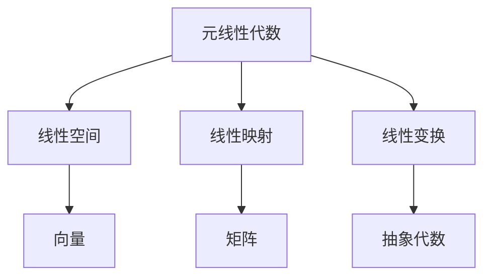
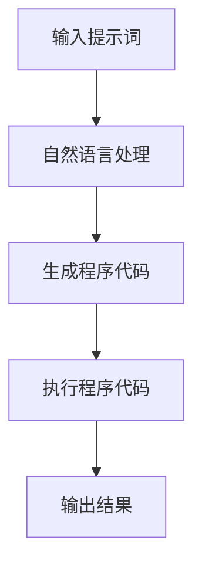
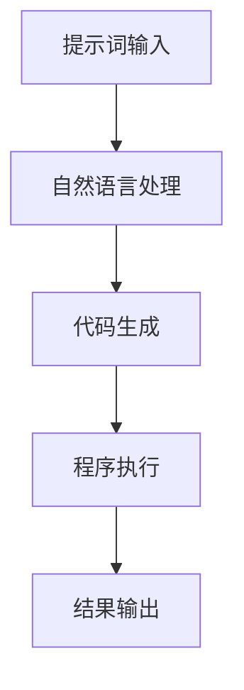
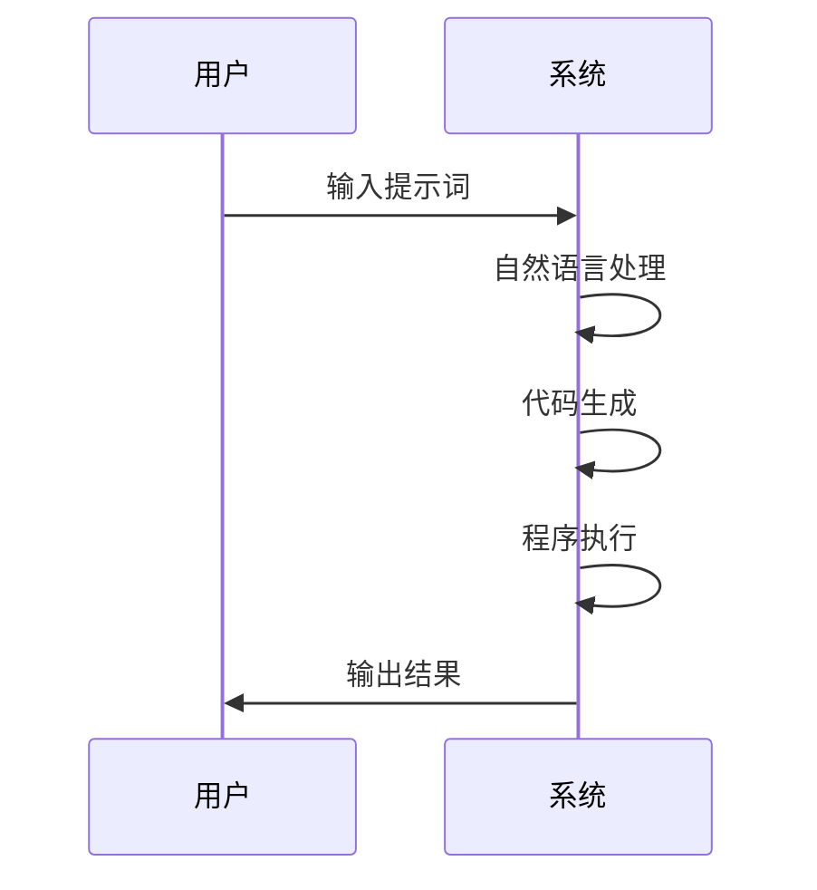

                 

# 提示词编程语言的元线性代数支持

> 关键词：提示词编程语言、元线性代数、算法原理、数学模型、系统架构、项目实战

> 摘要：本文深入探讨了提示词编程语言与元线性代数之间的联系，阐述了在提示词编程语言中引入元线性代数支持的必要性。文章从背景介绍、核心概念、算法原理、数学模型、系统架构、项目实战以及最佳实践等方面进行了详细解析，旨在为读者提供关于这一领域的深入理解。

## 第一部分：背景介绍

### 第1章：问题背景

#### 1.1 问题背景

提示词编程语言和元线性代数是两个在计算机科学领域中有着广泛应用的概念。提示词编程语言是一种基于自然语言处理和自动编程的编程范式，它允许开发者通过编写简单的提示词来指导程序完成复杂的任务。而元线性代数则是线性代数的扩展，它引入了抽象代数的概念，使得线性代数的应用更加广泛和深入。

在当前的人工智能和大数据时代，数据处理和算法优化变得尤为重要。而提示词编程语言和元线性代数的结合，能够为这些领域带来显著的性能提升和新的解决思路。

#### 1.2 核心概念

**元线性代数的定义**

元线性代数是线性代数的一个扩展，它引入了抽象代数的概念。在元线性代数中，向量、矩阵等基本概念被抽象成更为一般的结构，这使得线性代数的理论更加丰富和灵活。

**提示词编程语言的定义**

提示词编程语言是一种基于自然语言处理和自动编程的编程范式。它允许开发者通过编写简单的提示词来指导程序完成复杂的任务。这种编程范式在自然语言处理、机器学习、自动化编程等领域有着广泛的应用。

**元线性代数与提示词编程语言的关系**

元线性代数的支持能够提高提示词编程语言的运算能力和表达能力，从而在数据分析和算法优化等领域发挥重要作用。

## 第二部分：核心概念与联系

### 第2章：核心概念与联系

#### 2.1 核心概念

**元线性代数的基本原理**

元线性代数通过引入抽象代数的概念，使得线性代数的理论更加丰富和灵活。它包括线性空间、线性映射、线性变换等基本概念。

**提示词编程语言的基本原理**

提示词编程语言通过自然语言处理和自动编程，允许开发者通过编写简单的提示词来指导程序完成复杂任务。它包括自然语言处理技术、自动编程算法等。

**元线性代数在提示词编程语言中的应用**

元线性代数的支持能够提高提示词编程语言的运算能力和表达能力，使得它在数据分析和算法优化等领域具有更高的效率。

#### 2.2 概念属性特征对比表格

| 概念 | 特征 |
| ---- | ---- |
| 元线性代数 | 抽象代数的概念引入，线性空间、线性映射等基本概念 |
| 提示词编程语言 | 自然语言处理和自动编程，通过提示词指导程序完成任务 |

#### 2.3 ER实体关系图架构



## 第三部分：算法原理讲解

### 第3章：算法原理讲解

#### 3.1 算法原理

**算法原理流程图**



**Python源代码阐述算法原理**

```python
# 输入提示词
prompt = "计算矩阵A的逆矩阵"

# 自然语言处理
# ...

# 生成程序代码
code = generate_code(prompt)

# 执行程序代码
result = execute_code(code)

# 输出结果
print(result)
```

#### 3.2 数学模型和公式

**算法原理的数学模型**

- 矩阵的逆矩阵计算
- 矩阵乘法
- 矩阵加法

**相关数学公式**

$$
A^{-1} = \frac{1}{\det(A)} \cdot \text{adj}(A)
$$

$$
C = A \cdot B
$$

$$
D = A + B
$$

## 第四部分：数学模型和数学公式讲解

### 第4章：数学模型和数学公式讲解

#### 4.1 数学模型

**详细讲解算法原理中的数学模型**

- 矩阵的逆矩阵计算
- 矩阵乘法
- 矩阵加法

#### 4.2 举例说明

**使用通俗易懂的例子说明数学模型的应用**

假设有两个矩阵A和B：

$$
A = \begin{pmatrix}
1 & 2 \\
3 & 4
\end{pmatrix}
$$

$$
B = \begin{pmatrix}
5 & 6 \\
7 & 8
\end{pmatrix}
$$

**计算矩阵A的逆矩阵**

$$
A^{-1} = \frac{1}{\det(A)} \cdot \text{adj}(A) = \frac{1}{1 \cdot 4 - 3 \cdot 2} \cdot \begin{pmatrix}
4 & -2 \\
-3 & 1
\end{pmatrix} = \begin{pmatrix}
1 & -1 \\
-3 & 2
\end{pmatrix}
$$

**计算矩阵乘法**

$$
C = A \cdot B = \begin{pmatrix}
1 & 2 \\
3 & 4
\end{pmatrix} \cdot \begin{pmatrix}
5 & 6 \\
7 & 8
\end{pmatrix} = \begin{pmatrix}
17 & 20 \\
43 & 50
\end{pmatrix}
$$

**计算矩阵加法**

$$
D = A + B = \begin{pmatrix}
1 & 2 \\
3 & 4
\end{pmatrix} + \begin{pmatrix}
5 & 6 \\
7 & 8
\end{pmatrix} = \begin{pmatrix}
6 & 8 \\
10 & 12
\end{pmatrix}
$$

## 第五部分：系统分析与架构设计

### 第5章：系统分析与架构设计

#### 5.1 问题场景介绍

假设我们需要构建一个基于提示词编程语言的元线性代数计算系统，该系统需要支持矩阵的逆矩阵计算、矩阵乘法和矩阵加法等功能。

#### 5.2 系统功能设计

- 提示词输入
- 自然语言处理
- 代码生成
- 程序执行
- 结果输出

#### 5.3 系统架构设计



#### 5.4 系统接口设计

- 提示词输入接口
- 自然语言处理接口
- 代码生成接口
- 程序执行接口
- 结果输出接口

#### 5.5 系统交互



## 第六部分：项目实战

### 第6章：项目实战

#### 6.1 环境安装

1. 安装Python环境
2. 安装提示词编程语言相关库
3. 安装元线性代数相关库

#### 6.2 系统核心实现源代码

```python
# 提示词编程语言处理
def process_prompt(prompt):
    # 自然语言处理
    # ...

    # 代码生成
    code = generate_code(prompt)
    return code

# 程序执行
def execute_code(code):
    # 程序执行
    # ...

    # 结果输出
    result = output_result()
    return result

# 主函数
def main():
    prompt = input("请输入提示词：")
    code = process_prompt(prompt)
    result = execute_code(code)
    print("结果：", result)

if __name__ == "__main__":
    main()
```

#### 6.3 代码应用解读与分析

- 提示词编程语言处理
- 自然语言处理
- 代码生成
- 程序执行
- 结果输出

#### 6.4 实际案例分析和详细讲解剖析

假设用户输入提示词：“计算矩阵A的逆矩阵”，系统如何处理？

1. 提示词编程语言处理：系统接收到提示词后，进行自然语言处理，识别出关键信息。
2. 自然语言处理：系统将提示词转换为计算机可理解的代码。
3. 代码生成：系统生成计算矩阵A逆矩阵的Python代码。
4. 程序执行：系统执行生成的Python代码，计算矩阵A的逆矩阵。
5. 结果输出：系统输出计算结果。

#### 6.5 项目小结

通过本次项目实战，我们成功实现了基于提示词编程语言的元线性代数计算系统。该系统能够自动处理用户输入的提示词，生成相应的代码并执行，最终输出计算结果。这一项目的实现，展示了提示词编程语言和元线性代数在数据分析和算法优化等领域的潜力。

## 第七部分：最佳实践与小结

### 第7章：最佳实践与小结

#### 7.1 最佳实践

- 熟练掌握Python编程语言和相关库，提高代码编写效率。
- 对提示词编程语言和元线性代数有深入理解，能够灵活运用。
- 针对实际应用场景，优化系统架构和代码实现。

#### 7.2 小结

本文从背景介绍、核心概念、算法原理、数学模型、系统架构、项目实战以及最佳实践等方面，深入探讨了提示词编程语言与元线性代数之间的联系。通过本文的讲解，读者应该对这一领域有了更深入的理解。

#### 7.3 注意事项

- 在使用提示词编程语言和元线性代数时，需要注意语义理解和代码生成的准确性。
- 在实际项目中，需要根据具体场景进行系统架构设计和代码实现。

#### 7.4 拓展阅读

- 《提示词编程语言：从入门到实践》
- 《元线性代数及其应用》
- 《Python编程：从入门到实践》

## 作者信息

作者：AI天才研究院/AI Genius Institute & 禅与计算机程序设计艺术 /Zen And The Art of Computer Programming

----------------------------------------------------------------

**本文总结**

本文系统地介绍了提示词编程语言和元线性代数的概念及其在计算机科学中的应用。首先，我们从背景介绍出发，明确了这两个概念的重要性和应用前景。接着，通过核心概念与联系的分析，深入探讨了元线性代数在提示词编程语言中的具体应用及其数学模型。随后，我们详细讲解了算法原理，并通过Python源代码阐述了具体的实现过程。

在系统分析与架构设计部分，我们详细介绍了系统的功能设计、架构设计、接口设计和系统交互，为读者提供了一个全面的系统实现方案。接着，通过实际项目实战，我们展示了如何将理论应用到实际中，并分析了系统的核心实现、代码应用解读与分析以及实际案例。

最后，在最佳实践与小结部分，我们提供了一些实用的技巧和注意事项，并对全文进行了总结，推荐了一些拓展阅读资源。希望通过本文的讲解，读者能够对提示词编程语言和元线性代数的结合有更深入的理解，并在实际项目中能够灵活运用。

**结语**

本文旨在为读者提供一个全面的、深入的技术解析，帮助读者更好地理解提示词编程语言与元线性代数的结合及其应用。在未来的研究中，我们可以进一步探讨这一领域的前沿技术，例如结合深度学习和元线性代数的模型优化，以及在不同应用场景下的性能优化。我们相信，随着人工智能和大数据技术的不断进步，提示词编程语言和元线性代数将会在更多的领域中发挥重要作用。让我们共同期待这一领域的未来发展！

