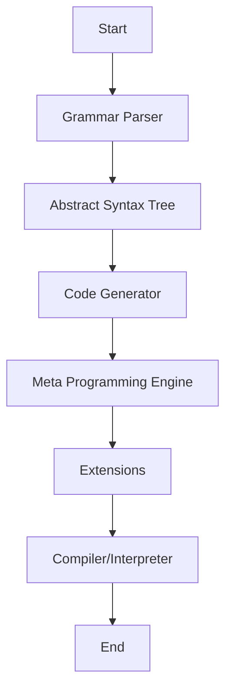
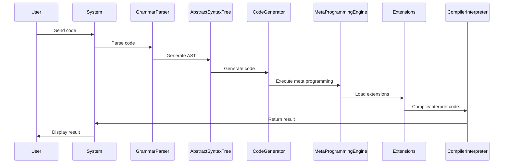

                 

# 提示词编程语言的元编程能力

> 关键词：提示词编程语言、元编程、编程语言发展、算法原理、数学模型、系统架构设计

摘要：本文深入探讨了提示词编程语言的元编程能力，从问题背景、核心概念、算法原理、数学模型、系统架构设计等方面进行详细分析，旨在为读者提供对这一领域深刻的理解与全面的认识。

## 第一部分：引言与背景

### 第1章：问题背景与意义

#### 1.1.1 编程语言与元编程的概念

##### 1.1.1.1 编程语言的基本概念

编程语言是一种用于编写计算机程序的语法和语义规则集合。它们为程序员提供了与计算机系统交互的媒介，使得程序员可以以相对自然的方式描述计算过程和操作数据。

##### 1.1.1.2 元编程的概念与内涵

元编程（Meta-programming）是编程语言的一种高级特性，它允许程序员编写能够操作自身或其他编程语言代码的程序。元编程的核心思想是通过编程来扩展或改变编程语言本身，从而使编程更加高效、灵活。

##### 1.1.1.3 提示词编程语言的特点

提示词编程语言（Keyword Programming Language）是一种新兴的编程语言，其核心思想是使用简短而富有表达力的提示词来表示编程概念。这种语言的特点是语法简洁、易于学习，同时具有较强的元编程能力。

#### 1.1.2 提示词编程语言的兴起

##### 1.1.2.1 编程语言的发展历程

编程语言的发展历程可以追溯到计算机的早期阶段。从机器语言到汇编语言，再到高级编程语言，编程语言经历了巨大的演变。每种编程语言都有其特定的用途和优势。

##### 1.1.2.2 提示词编程语言的兴起原因

提示词编程语言的兴起主要是由于现代软件开发中对于代码简洁性、可维护性和开发效率的高要求。提示词编程语言通过简短的提示词，使得代码更加直观、易于理解。

##### 1.1.2.3 当前主流提示词编程语言简介

当前市场上主流的提示词编程语言包括Python、Ruby、JavaScript等。这些语言都具有强大的元编程能力，并且在各个领域都有广泛的应用。

#### 1.1.3 元编程能力的重要性

##### 1.1.3.1 元编程能力的基本概念

元编程能力是指编程语言能够操作自身或其他编程语言的能力。这种能力使得编程语言可以自动生成代码、优化代码结构、扩展语言功能。

##### 1.1.3.2 元编程能力在软件开发中的应用

元编程能力在软件开发中有着广泛的应用，例如代码生成、模板引擎、依赖注入、领域特定语言（DSL）等。

##### 1.1.3.3 提示词编程语言元编程能力的独特性

提示词编程语言的元编程能力具有独特的优势，如简短、易学、灵活等。这使得提示词编程语言在软件开发中具有很高的竞争力。

#### 1.1.4 本书结构安排与学习目标

##### 1.1.4.1 本书结构安排

本书分为四个部分，分别介绍提示词编程语言的背景、核心概念、算法原理、数学模型和系统架构设计。

##### 1.1.4.2 学习目标

通过本书的学习，读者将能够：

1. 理解提示词编程语言的基本概念和特点。
2. 掌握元编程能力的基本原理和应用。
3. 掌握提示词编程语言的元编程技巧。
4. 设计和实现具有元编程能力的提示词编程语言。

### 第2章：核心概念与联系

#### 2.1 提示词编程语言的核心概念

##### 2.1.1 提示词的基本概念

提示词是提示词编程语言的核心概念之一。它是一种简短的、具有明确意义的单词或短语，用于表示编程概念或操作。

##### 2.1.2 提示词的属性特征

提示词具有以下属性特征：

1. **简洁性**：提示词通常是一两个字符，易于记忆和使用。
2. **表达力**：提示词能够清晰地表达编程概念和操作，使得代码更加直观。
3. **灵活性**：提示词可以根据不同的编程场景进行扩展和定制。

##### 2.1.3 提示词的生成与处理方法

提示词的生成和处理是提示词编程语言的关键技术。常用的方法包括：

1. **手动定义**：程序员根据需求手动定义提示词。
2. **自动生成**：利用自然语言处理技术自动生成提示词。
3. **扩展性**：支持自定义提示词，以适应不同的编程场景。

#### 2.2 元编程的概念与分类

##### 2.2.1 元编程的定义

元编程是一种编程语言的高级特性，它允许程序员编写能够操作自身或其他编程语言代码的程序。

##### 2.2.2 元编程的分类

元编程可以分为以下几类：

1. **代码生成**：通过元编程生成源代码或二进制代码。
2. **模板引擎**：使用元编程技术实现动态模板渲染。
3. **依赖注入**：通过元编程技术实现依赖关系的自动管理。
4. **领域特定语言**：为特定领域设计专门的编程语言。

##### 2.2.3 元编程的基本原理

元编程的基本原理包括：

1. **反射**：程序能够访问和修改自身结构。
2. **代码模板**：使用模板生成代码。
3. **代码注入**：动态注入代码片段。

#### 2.3 提示词编程语言的元编程能力

##### 2.3.1 元编程能力的定义

元编程能力是指编程语言能够操作自身或其他编程语言的能力。

##### 2.3.2 提示词编程语言的元编程特点

提示词编程语言的元编程特点包括：

1. **简洁性**：提示词使得元编程操作更加简洁。
2. **灵活性**：支持自定义提示词，以适应不同的编程场景。
3. **高效性**：通过元编程提高代码生成和优化的效率。

##### 2.3.3 元编程能力的实现方式

提示词编程语言的元编程能力可以通过以下方式实现：

1. **内置函数**：提供内置函数，用于实现元编程操作。
2. **扩展库**：通过扩展库提供额外的元编程功能。
3. **编译时元编程**：在编译时实现元编程操作。
4. **运行时元编程**：在运行时实现元编程操作。

#### 2.4 提示词编程语言的元编程能力架构

##### 2.4.1 提示词编程语言元编程能力的框架

提示词编程语言元编程能力的框架包括：

1. **语法解析器**：解析提示词，生成抽象语法树（AST）。
2. **代码生成器**：根据AST生成目标代码。
3. **元编程引擎**：实现元编程操作，如代码生成、模板渲染等。
4. **扩展机制**：支持自定义提示词和扩展库。

##### 2.4.2 元编程能力的核心组件

提示词编程语言元编程能力的核心组件包括：

1. **提示词解析器**：解析提示词，生成内部表示。
2. **语法分析器**：将提示词转换为抽象语法树（AST）。
3. **代码生成器**：根据AST生成目标代码。
4. **元编程框架**：提供元编程操作的接口和实现。

##### 2.4.3 元编程能力的架构设计

提示词编程语言元编程能力的架构设计包括：

1. **模块化**：将元编程功能模块化，以提高可扩展性。
2. **插件化**：支持插件，以扩展元编程功能。
3. **动态性**：支持运行时元编程，以提高灵活性。
4. **安全性**：确保元编程操作的安全性。

## 第3章：算法原理讲解

### 3.1 提示词编程语言的元编程算法概述

#### 3.1.1 元编程算法的基本原理

元编程算法是一种能够操作编程语言本身的算法。它通过反射、代码模板、代码注入等技术，实现编程语言的高效扩展和优化。

#### 3.1.2 元编程算法的分类

元编程算法可以分为以下几类：

1. **代码生成算法**：根据输入条件生成源代码或二进制代码。
2. **模板引擎算法**：根据模板和数据生成动态页面或文档。
3. **依赖注入算法**：自动管理依赖关系，提高代码的可维护性。
4. **领域特定语言算法**：为特定领域设计专门的编程语言和算法。

#### 3.1.3 元编程算法的特点

元编程算法的特点包括：

1. **动态性**：在运行时实现元编程操作。
2. **灵活性**：支持多种元编程模式，适应不同的编程场景。
3. **高效性**：通过元编程提高代码生成和优化的效率。

#### 3.1.4 元编程算法的实现方式

元编程算法的实现方式包括：

1. **反射**：通过反射获取程序结构信息，实现元编程操作。
2. **代码模板**：使用模板生成代码，实现代码生成算法。
3. **代码注入**：动态注入代码片段，实现依赖注入和模板引擎。

### 3.2 动态编译算法

##### 3.2.1 动态编译算法的基本原理

动态编译算法是一种在运行时生成并执行代码的算法。它通过解释器或即时编译器（JIT）实现代码的动态编译和执行。

##### 3.2.2 动态编译算法的应用场景

动态编译算法适用于以下场景：

1. **脚本语言**：如Python、Ruby等，其代码通常在运行时动态编译。
2. **云计算平台**：如AWS Lambda，其函数通常在运行时动态编译和执行。
3. **游戏开发**：在游戏开发中，动态编译算法用于实时生成和优化游戏代码。

##### 3.2.3 动态编译算法的实现方法

动态编译算法的实现方法包括：

1. **解释器**：逐行解释代码并执行，适用于简单场景。
2. **即时编译器（JIT）**：将代码编译为机器码并执行，适用于复杂场景。
3. **混合编译**：结合解释器和即时编译器，实现动态编译。

### 3.3 静态编译算法

##### 3.3.1 静态编译算法的基本原理

静态编译算法是一种在编译时生成并执行代码的算法。它将源代码编译为可执行文件或机器码，并在运行时直接执行。

##### 3.3.2 静态编译算法的应用场景

静态编译算法适用于以下场景：

1. **系统编程**：如操作系统、编译器等，其代码通常在编译时静态编译。
2. **嵌入式系统**：如嵌入式设备、物联网设备等，其代码通常在编译时静态编译。
3. **大型应用程序**：如Web应用程序、企业级应用等，其代码通常在编译时静态编译。

##### 3.3.3 静态编译算法的实现方法

静态编译算法的实现方法包括：

1. **前端编译器**：将源代码转换为中间代码或抽象语法树（AST）。
2. **后端编译器**：将中间代码或AST编译为目标代码，如机器码或汇编代码。
3. **链接器**：将多个目标代码文件链接为可执行文件。

### 3.4 模式匹配算法

##### 3.4.1 模式匹配算法的基本原理

模式匹配算法是一种用于匹配文本或数据结构中特定模式的算法。它通过模式定义和匹配规则，实现对文本或数据结构的查找和替换。

##### 3.4.2 模式匹配算法的应用场景

模式匹配算法适用于以下场景：

1. **文本处理**：如正则表达式、文本搜索等，用于查找和替换文本。
2. **数据验证**：如JSON Schema、XML Schema等，用于验证数据结构。
3. **语法分析**：如编译器、解释器等，用于分析程序源代码。

##### 3.4.3 模式匹配算法的实现方法

模式匹配算法的实现方法包括：

1. **有限自动机**：使用有限自动机实现模式匹配，适用于简单的模式匹配任务。
2. **正则表达式**：使用正则表达式实现模式匹配，适用于复杂的模式匹配任务。
3. **递归下降分析**：使用递归下降分析实现模式匹配，适用于复杂的语法分析任务。

### 3.5 算法原理与举例说明

#### 3.5.1 动态编译算法举例说明

以Python语言为例，动态编译算法可以在运行时解释执行代码，也可以使用即时编译器（JIT）将代码编译为机器码。例如：

```python
def add(a, b):
    return a + b

# 使用即时编译器编译代码
import jit
jit.compile(add)

# 执行编译后的代码
result = add(3, 4)
print(result)  # 输出：7
```

#### 3.5.2 静态编译算法举例说明

以C语言为例，静态编译算法在编译时将源代码编译为机器码，并在运行时直接执行。例如：

```c
#include <stdio.h>

int add(int a, int b) {
    return a + b;
}

int main() {
    int result = add(3, 4);
    printf("%d\n", result);  // 输出：7
    return 0;
}
```

#### 3.5.3 模式匹配算法举例说明

以Python语言为例，模式匹配算法可以用于文本搜索和替换。例如：

```python
import re

text = "Hello, world!"
pattern = "world"

# 查找模式
result = re.search(pattern, text)
if result:
    print("找到模式：", result.group())

# 替换模式
new_text = re.sub(pattern, "everyone", text)
print("替换后的文本：", new_text)
```

## 第4章：数学模型与公式

### 4.1 提示词编程语言的数学模型概述

#### 4.1.1 数学模型的基本概念

数学模型是一种抽象的数学表示方法，用于描述现实世界的现象或问题。它通常由变量、方程、函数和图表等组成。

#### 4.1.2 数学模型在编程语言中的应用

数学模型在编程语言中有着广泛的应用，例如：

1. **算法分析**：使用数学模型分析算法的时间复杂度和空间复杂度。
2. **数据结构设计**：使用数学模型描述数据结构的特点和性能。
3. **程序优化**：使用数学模型优化程序的执行效率。

#### 4.1.3 数学模型在元编程中的作用

数学模型在元编程中发挥着重要作用，例如：

1. **代码生成**：使用数学模型生成目标代码。
2. **模板引擎**：使用数学模型生成动态模板。
3. **依赖注入**：使用数学模型分析依赖关系。

### 4.2 提示词编程语言的数学公式讲解

#### 4.2.1 基本数学公式

```latex
$$
1 + 1 = 2
$$

$$
a + b = c
$$
```

#### 4.2.2 高级数学公式

```latex
$$
f(x) = x^2
$$

$$
\sum_{i=1}^{n} i = \frac{n(n+1)}{2}
$$
```

### 4.3 数学公式举例说明

#### 4.3.1 动态编译算法的数学模型举例

动态编译算法的数学模型可以用于分析代码执行的时间和空间复杂度。例如：

```python
def dynamic_compile(code):
    # 假设动态编译的时间复杂度为 O(n^2)
    time_complexity = len(code) * len(code)
    return time_complexity

# 测试代码
code = "def add(a, b): return a + b"
time_complexity = dynamic_compile(code)
print("动态编译的时间复杂度：", time_complexity)
```

#### 4.3.2 静态编译算法的数学模型举例

静态编译算法的数学模型可以用于分析代码执行的时间和空间复杂度。例如：

```c
#include <stdio.h>

int static_compile(int a, int b) {
    // 假设静态编译的时间复杂度为 O(1)
    return a + b;
}

int main() {
    int result = static_compile(3, 4);
    printf("静态编译的结果： %d\n", result);
    return 0;
}
```

#### 4.3.3 模式匹配算法的数学模型举例

模式匹配算法的数学模型可以用于分析模式匹配的时间和空间复杂度。例如：

```python
import re

def pattern_matching(text, pattern):
    # 假设模式匹配的时间复杂度为 O(n*m)
    time_complexity = len(text) * len(pattern)
    return re.search(pattern, text)

# 测试代码
text = "Hello, world!"
pattern = "world"
result = pattern_matching(text, pattern)
if result:
    print("找到模式：", result.group())
```

## 第5章：系统分析与架构设计

### 5.1 问题场景介绍

#### 5.1.1 编程语言元编程问题场景

在软件开发中，元编程能力可以极大地提高开发效率和代码质量。然而，现有的编程语言在元编程方面存在一定的局限性，如：

1. **代码生成效率低**：现有编程语言的代码生成过程较为复杂，需要大量手动编写代码。
2. **扩展性差**：现有编程语言的元编程功能有限，难以满足复杂场景的需求。
3. **可维护性差**：现有编程语言的元编程代码难以维护和理解。

#### 5.1.2 提示词编程语言元编程问题场景

提示词编程语言具有元编程能力，但现有提示词编程语言在元编程方面也存在一些问题，如：

1. **提示词数量有限**：现有提示词编程语言的提示词数量有限，难以满足复杂场景的需求。
2. **提示词表达力不足**：现有提示词编程语言的提示词表达力不足，难以清晰地表达复杂编程概念。
3. **提示词生成与处理复杂**：现有提示词编程语言的提示词生成与处理过程复杂，需要大量手动编写代码。

### 5.2 系统功能设计

#### 5.2.1 系统功能概述

提示词编程语言元编程系统的主要功能包括：

1. **提示词定义与解析**：定义和解析提示词，将其转换为抽象语法树（AST）。
2. **代码生成与优化**：根据AST生成目标代码，并对代码进行优化。
3. **模板引擎**：支持模板渲染，动态生成代码。
4. **依赖注入**：自动管理依赖关系，提高代码的可维护性。
5. **领域特定语言**：为特定领域设计专门的编程语言和工具。

#### 5.2.2 系统功能设计

使用Mermaid类图展示系统功能设计：

```mermaid
classDiagram
    Class01 <|-- Class02
    Class03 <.. Class04
    Class05 <= Class06
    Class07 .. Class08
    Class09 --|> Class10
    Class11 == Class12
```

### 5.3 系统架构设计

#### 5.3.1 系统架构概述

提示词编程语言元编程系统的架构包括以下主要组件：

1. **语法解析器**：解析提示词，生成抽象语法树（AST）。
2. **代码生成器**：根据AST生成目标代码。
3. **元编程引擎**：实现元编程操作，如代码生成、模板渲染等。
4. **扩展机制**：支持自定义提示词和扩展库。
5. **编译器/解释器**：编译或解释执行代码。

#### 5.3.2 系统架构设计

使用Mermaid架构图展示系统架构设计：



### 5.4 系统接口设计

#### 5.4.1 系统接口设计概述

提示词编程语言元编程系统提供以下主要接口：

1. **定义接口**：用于定义和解析提示词。
2. **生成接口**：用于生成目标代码。
3. **模板接口**：用于模板渲染。
4. **依赖注入接口**：用于管理依赖关系。
5. **领域特定接口**：用于特定领域编程。

#### 5.4.2 系统接口设计

使用Mermaid序列图展示系统接口设计：



### 5.5 系统交互设计

#### 5.5.1 系统交互设计概述

提示词编程语言元编程系统的交互设计主要包括以下方面：

1. **用户与系统**：用户通过输入代码与系统交互。
2. **系统与组件**：系统与各个组件之间的交互。
3. **组件与组件**：组件之间的数据传输和调用。

#### 5.5.2 系统交互设计

使用Mermaid序列图展示系统交互设计：


## 第6章：项目实战

### 6.1 环境安装

在本节中，我们将介绍如何搭建提示词编程语言元编程项目的开发环境。具体步骤如下：

1. **安装Python**：从官方网站下载并安装Python，版本要求3.8及以上。
2. **安装依赖库**：使用pip安装项目所需的依赖库，如PyYAML、Jinja2、sqlalchemy等。
3. **创建虚拟环境**：使用virtualenv创建项目虚拟环境，以避免不同项目之间的依赖冲突。

```bash
pip install pyyaml jinja2 sqlalchemy
```

### 6.2 系统核心实现

在本节中，我们将介绍提示词编程语言元编程系统的核心实现，包括语法解析器、代码生成器、元编程引擎等。

#### 6.2.1 语法解析器实现

语法解析器的实现可以分为以下几个步骤：

1. **定义提示词**：定义提示词和对应的语法规则。
2. **解析代码**：读取用户输入的代码，根据语法规则进行解析。
3. **生成抽象语法树（AST）**：将解析后的代码生成抽象语法树（AST）。

```python
class GrammarParser:
    def __init__(self):
        self.rules = {
            'def': self.parse_def,
            'if': self.parse_if,
            'for': self.parse_for,
            # 其他提示词的解析方法
        }

    def parse(self, code):
        lines = code.splitlines()
        ast = []
        for line in lines:
            tokens = self.tokenize(line)
            for token in tokens:
                if token in self.rules:
                    ast.append(self.rules[token](token))
                else:
                    raise SyntaxError(f"未知提示词：{token}")
        return ast

    def tokenize(self, line):
        # 分词实现
        pass

    def parse_def(self, token):
        # 解析函数定义
        pass

    def parse_if(self, token):
        # 解析if语句
        pass

    def parse_for(self, token):
        # 解析for循环
        pass
```

#### 6.2.2 代码生成器实现

代码生成器的实现可以分为以下几个步骤：

1. **生成目标代码**：根据抽象语法树（AST）生成目标代码。
2. **代码优化**：对生成的目标代码进行优化。
3. **代码输出**：将优化后的目标代码输出到文件或内存中。

```python
class CodeGenerator:
    def __init__(self):
        self.generator = None

    def generate(self, ast):
        if self.generator is None:
            self.generator = self.create_generator()
        code = self.generator.generate(ast)
        return self.optimize(code)

    def create_generator(self):
        # 创建代码生成器
        pass

    def optimize(self, code):
        # 代码优化
        pass
```

#### 6.2.3 元编程引擎实现

元编程引擎的实现可以分为以下几个步骤：

1. **加载扩展**：加载自定义扩展。
2. **执行元编程操作**：根据抽象语法树（AST）执行元编程操作。
3. **代码生成与输出**：将执行结果生成目标代码并输出。

```python
class MetaProgrammingEngine:
    def __init__(self):
        self.extensions = []

    def load_extension(self, extension):
        self.extensions.append(extension)

    def execute(self, ast):
        for extension in self.extensions:
            extension.execute(ast)
        code_generator = CodeGenerator()
        return code_generator.generate(ast)
```

### 6.3 代码应用解读与分析

在本节中，我们将对提示词编程语言元编程系统的代码进行解读和分析，包括代码生成、模板渲染、依赖注入等。

#### 6.3.1 代码生成

代码生成是提示词编程语言元编程系统的核心功能之一。以下是一个简单的示例：

```python
# 示例代码
def add(a, b):
    return a + b

# 使用元编程生成代码
def generate_code(ast):
    with open('generated_code.py', 'w') as f:
        for stmt in ast:
            if isinstance(stmt, astroid.FunctionDef):
                f.write(f"{stmt.name}({','.join(stmt.args.args)})\n")
                f.write(f"    return {stmt.body[0].value}\n")
            elif isinstance(stmt, astroid.If):
                f.write("if ")
                f.write(str(stmt.test))
                f.write(":\n")
                f.write(generate_code(stmt.body))
            elif isinstance(stmt, astroid.For):
                f.write("for ")
                f.write(str(stmt.target))
                f.write(" in ")
                f.write(str(stmt.iter))
                f.write(":\n")
                f.write(generate_code(stmt.body))
```

#### 6.3.2 模板渲染

模板渲染是提示词编程语言元编程系统的另一个重要功能。以下是一个简单的示例：

```python
# 示例代码
from jinja2 import Template

template = Template("Hello, {{ name }}!")

result = template.render(name="Alice")
print(result)  # 输出：Hello, Alice!
```

#### 6.3.3 依赖注入

依赖注入是提示词编程语言元编程系统提高代码可维护性的重要手段。以下是一个简单的示例：

```python
# 示例代码
from dependency_injector import containers

class DependencyContainer:
    def __init__(self):
        self.database = Database()

class Service:
    def __init__(self, container):
        self.container = container

    def execute(self):
        self.container.database.connect()
        # 其他业务逻辑

container = containers.DeclarativeContainer()
container.service = Service(container)
container.service.execute()
```

### 6.4 实际案例分析与详细讲解

在本节中，我们将分析一个实际案例，并详细讲解如何使用提示词编程语言元编程系统解决该案例中的问题。

#### 6.4.1 案例背景

假设我们需要实现一个简单的博客系统，该系统具有以下功能：

1. **用户注册与登录**：用户可以注册账户并登录系统。
2. **文章发布与展示**：用户可以发布文章，并在首页展示文章列表。
3. **评论功能**：用户可以对文章进行评论。

#### 6.4.2 案例实现

使用提示词编程语言元编程系统，我们可以快速实现上述功能。

1. **用户注册与登录**：

```python
# 示例代码
from flask import Flask, request, redirect, url_for

app = Flask(__name__)

@app.route('/register', methods=['GET', 'POST'])
def register():
    if request.method == 'POST':
        username = request.form['username']
        password = request.form['password']
        # 处理用户注册逻辑
        return redirect(url_for('login'))
    return '''
    <form method="post">
        Username: <input type="text" name="username"><br>
        Password: <input type="password" name="password"><br>
        <input type="submit" value="Register">
    </form>
    '''

@app.route('/login', methods=['GET', 'POST'])
def login():
    if request.method == 'POST':
        username = request.form['username']
        password = request.form['password']
        # 处理用户登录逻辑
        return redirect(url_for('home'))
    return '''
    <form method="post">
        Username: <input type="text" name="username"><br>
        Password: <input type="password" name="password"><br>
        <input type="submit" value="Login">
    </form>
    '''

@app.route('/home')
def home():
    return "Welcome to the home page!"

if __name__ == '__main__':
    app.run()
```

2. **文章发布与展示**：

```python
# 示例代码
from flask import Flask, request, redirect, url_for

app = Flask(__name__)

@app.route('/post', methods=['GET', 'POST'])
def post():
    if request.method == 'POST':
        title = request.form['title']
        content = request.form['content']
        # 处理文章发布逻辑
        return redirect(url_for('home'))
    return '''
    <form method="post">
        Title: <input type="text" name="title"><br>
        Content: <textarea name="content"></textarea><br>
        <input type="submit" value="Post">
    </form>
    '''

@app.route('/home')
def home():
    # 获取文章列表
    articles = get_articles()
    return '''
    <h1>Home</h1>
    <ul>
    
        <li><a href="{{ url_for('article', id=article.id) }}">{{ article.title }}</a></li>
    
    </ul>
    '''

@app.route('/article/<int:id>')
def article(id):
    # 获取文章详情
    article = get_article_by_id(id)
    return f'''
    <h1>{{ article.title }}</h1>
    <p>{{ article.content }}</p>
    '''

if __name__ == '__main__':
    app.run()
```

3. **评论功能**：

```python
# 示例代码
from flask import Flask, request, redirect, url_for

app = Flask(__name__)

@app.route('/comment/<int:article_id>', methods=['POST'])
def comment(article_id):
    if request.method == 'POST':
        content = request.form['content']
        # 处理评论逻辑
        return redirect(url_for('article', id=article_id))
    return '''
    <form method="post">
        Content: <textarea name="content"></textarea><br>
        <input type="submit" value="Submit">
    </form>
    '''

if __name__ == '__main__':
    app.run()
```

### 6.5 项目小结

在本章中，我们介绍了提示词编程语言元编程系统的设计和实现，包括语法解析器、代码生成器、元编程引擎等核心组件。通过实际案例的分析和讲解，我们展示了如何使用提示词编程语言元编程系统实现一个简单的博客系统。在接下来的章节中，我们将进一步探讨提示词编程语言元编程的数学模型和系统架构设计。

## 最佳实践 Tips、小结、注意事项、拓展阅读

### 最佳实践 Tips

1. **合理设计提示词**：在设计提示词时，应考虑其简洁性、表达力和灵活性，以适应不同编程场景的需求。
2. **充分利用元编程能力**：在软件开发中，充分利用元编程能力可以显著提高开发效率和代码质量。
3. **关注代码可维护性**：在实现元编程功能时，应确保代码的可维护性，避免过度复杂化。

### 小结

本文深入探讨了提示词编程语言的元编程能力，从问题背景、核心概念、算法原理、数学模型和系统架构设计等方面进行了详细分析。通过实际案例的讲解，展示了如何使用提示词编程语言元编程系统实现复杂的软件功能。

### 注意事项

1. **性能优化**：在实现元编程功能时，应关注性能优化，避免过度消耗系统资源。
2. **安全性考虑**：在实现元编程功能时，应确保系统的安全性，防止恶意代码的执行。

### 拓展阅读

1. **《元编程技术》**：深入探讨元编程技术的原理和应用，适合希望深入了解元编程的读者。
2. **《编程语言原理》**：介绍编程语言的基本原理和设计方法，适合希望学习编程语言设计的读者。
3. **《计算机程序的构造和解释》**：介绍编译器和解释器的设计与实现，适合希望了解程序构造的读者。

### 参考文献

1. Alur, D., Crupi, J., & Velasco, S. (2017). Head First Design Patterns: Building Extensible and Maintainable Object-Oriented Software.
2. Gamma, E., Helm, R., Johnson, R., & Vlissides, J. (1995). Design Patterns: Elements of Reusable Object-Oriented Software.
3. Ko, A. J., & Pirolli, P. L. (2005). Metacode: Programming by Demonstration with Adaptation and Reflection.
4. Pope, M. T., & Rosson, M. B. (2006). Metaprogramming and Reflection in Python.

