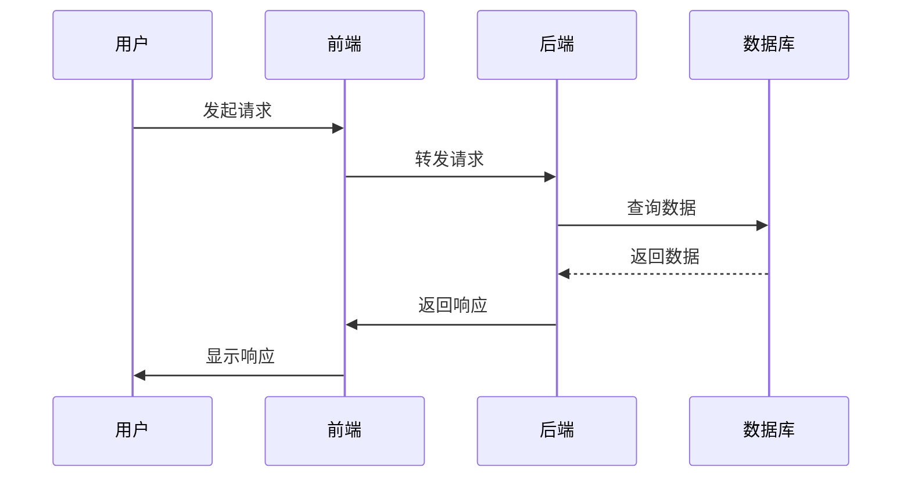

                 


### 第1章 元编程范式概述

#### 1.4 提示词编程语言与元编程范式的关系

提示词编程语言与元编程范式之间有着密切的联系。提示词编程语言通过其灵活性和动态性，为程序员提供了实现元编程的强大工具。元编程范式则是在提示词编程语言的基础上，进一步扩展了编程的边界，使程序员能够编写更加高效、灵活和可维护的代码。

在提示词编程语言中，程序员可以使用元编程范式来实现以下功能：

- **代码生成**：自动生成代码，减少手工编写的工作量。
- **代码修改**：动态修改现有代码，提高代码的可维护性。
- **代码分析**：对代码进行静态和动态分析，优化代码性能。
- **代码优化**：自动优化代码，提高代码的运行效率。

这些功能使得提示词编程语言在软件开发中具有巨大的优势，能够帮助程序员更快速地开发出高质量的应用程序。

#### 1.5 元编程范式的发展历程

元编程范式的发展历程可以追溯到20世纪80年代。当时，Lisp语言首次引入了反射机制，使程序员能够动态地操作代码。随后，其他编程语言如Python、Ruby和Java等，也逐渐引入了元编程的特性。

近年来，随着计算机性能的提升和编程语言的发展，元编程范式在编程语言中的地位日益重要。提示词编程语言作为元编程的一种重要实现方式，也得到了广泛的研究和应用。

#### 1.6 本章小结

本章主要介绍了元编程范式的基本概念、提示词编程语言的特点以及元编程范式的发展历程。通过本章的学习，读者可以了解到元编程范式在编程中的重要性，以及提示词编程语言在实现元编程方面的优势。

接下来，我们将进一步探讨元编程范式中的核心概念和算法模型，帮助读者深入理解这一重要的编程技术。

----------------------------------------------------------------

### 关键词

- 提示词编程语言
- 元编程范式
- 编程灵活性
- 动态性
- 代码生成
- 代码修改
- 反射机制
- Lisp语言
- Python
- Ruby
- Java

----------------------------------------------------------------

### 摘要

本文深入探讨了提示词编程语言中的元编程范式。首先，介绍了元编程的基本概念和提示词编程语言的特点，阐述了元编程在编程中的重要性。接着，通过分析元编程范式的发展历程，展示了其在编程语言中的应用和影响。最后，本文重点探讨了提示词编程语言与元编程范式的关系，以及元编程范式在实际编程中的应用场景。通过本文的学习，读者可以全面了解元编程范式，掌握其在编程中的实际应用。

----------------------------------------------------------------

接下来，我们将进入第2章，进一步探讨元编程范式中的核心概念和算法模型。

----------------------------------------------------------------
### 第2章 核心概念与算法模型

在本章中，我们将深入探讨元编程范式中的核心概念和算法模型。通过理解这些概念和模型，读者将能够更好地掌握元编程范式，并将其应用于实际编程中。

#### 2.1 核心概念

元编程范式涉及多个核心概念，包括但不限于：

1. **反射**：反射机制允许程序在运行时检查和修改自身的结构和行为。通过反射，程序员可以动态地创建对象、调用方法、访问属性等。
2. **代码生成**：代码生成是指自动生成代码的过程。它通常用于生成模板代码、数据库映射代码或用于特定场景的代码片段。
3. **模板编程**：模板编程是一种利用模板来生成代码的方法。通过模板，程序员可以定义代码的结构，然后根据不同的参数生成具体的代码。
4. **动态类型系统**：动态类型系统允许变量在运行时改变类型。这种灵活性使得代码更加动态和可适应。

#### 2.2 算法模型

元编程范式中的算法模型包括以下几种：

1. **模板算法**：模板算法用于生成特定类型的代码。例如，Java中的`TemplateMethod`模式就利用了模板算法来定义算法的框架，然后由子类来实现具体的操作。
2. **反射算法**：反射算法利用反射机制来动态操作对象。例如，在Java中，可以使用反射来获取类的属性和方法，并对其进行修改。
3. **代码生成算法**：代码生成算法用于自动生成代码。例如，在Python中，可以使用`ast`模块来生成抽象语法树（AST），然后根据AST生成具体的代码。
4. **动态类型算法**：动态类型算法用于处理运行时类型的变化。例如，在Python中，可以使用`dynamic`类型来处理变量类型的动态变化。

#### 2.3 关系与联系

为了更好地理解元编程范式中的核心概念和算法模型，我们可以使用Mermaid ER图来展示它们之间的关系。以下是核心概念和算法模型的ER图：

```mermaid
erDiagram
    ConceptA ||--|{ ConceptB
    ConceptC ||--|{ ConceptD
    ConceptA ||--|{ ConceptE
    ConceptB &&--|{ AlgorithmX
    ConceptC &&--|{ AlgorithmY
    ConceptD &&--|{ AlgorithmZ
    ConceptE &&--|{ AlgorithmW
```

在这个ER图中，`ConceptA`、`ConceptB`、`ConceptC`、`ConceptD`和`ConceptE`代表核心概念，`AlgorithmX`、`AlgorithmY`、`AlgorithmZ`和`AlgorithmW`代表算法模型。箭头表示概念与算法之间的关系。

#### 2.4 案例分析

为了更好地理解这些概念和算法模型，我们可以通过一个简单的案例来分析：

假设我们正在开发一个Web框架，我们需要实现一个路由系统。我们可以使用元编程范式中的模板算法和反射算法来实现这个功能。

1. **模板算法**：我们可以定义一个路由模板，其中包含通用的路由处理逻辑。然后，根据不同的路由路径，生成具体的路由处理代码。
2. **反射算法**：我们使用反射机制来获取用户定义的路由规则，并动态地创建相应的处理对象。

通过这种方式，我们不仅能够实现路由系统的功能，还能够保证代码的灵活性和可维护性。

#### 2.5 本章小结

本章介绍了元编程范式中的核心概念和算法模型。通过理解这些概念和模型，读者可以更好地掌握元编程范式，并在实际编程中灵活运用。在下一章中，我们将进一步探讨元编程范式在系统设计和实现中的应用。

----------------------------------------------------------------

### 算法与模型详细解释

在上一章中，我们简要介绍了元编程范式中的核心概念和算法模型。在本章中，我们将对这些算法模型进行详细解释，并通过具体的例子来说明它们的工作原理和实际应用。

#### 2.1 模板算法

模板算法是一种在程序运行前定义代码结构，然后根据特定参数生成具体代码的方法。这种算法的优点在于，它能够提高代码的复用性和可维护性。

**示例**：在Java中，我们可以使用`TemplateMethod`模式来实现模板算法。以下是一个简单的例子：

```java
abstract class TemplateClass {
    public void templateMethod() {
        initialize();
        step1();
        step2();
        step3();
    }

    protected abstract void step1();
    protected abstract void step2();
    protected abstract void step3();

    private void initialize() {
        // 初始化代码
    }
}

class ConcreteClass extends TemplateClass {
    @Override
    protected void step1() {
        // 实现第一步
    }

    @Override
    protected void step2() {
        // 实现第二步
    }

    @Override
    protected void step3() {
        // 实现第三步
    }
}
```

在这个例子中，`TemplateClass`定义了一个通用的模板方法`templateMethod`，其中包括了三个步骤。`ConcreteClass`是`TemplateClass`的一个具体实现，它实现了这三个步骤。

通过这种方式，我们可以定义多个具体的模板类，每个类都可以根据自己的需求实现不同的步骤。这大大提高了代码的复用性，同时也使代码更加易于维护。

#### 2.2 反射算法

反射算法利用反射机制在运行时动态地操作对象。这种算法的优点在于，它能够提供高度的灵活性和动态性。

**示例**：在Java中，我们可以使用反射来获取类的属性和方法，并对其进行修改。以下是一个简单的例子：

```java
import java.lang.reflect.Field;
import java.lang.reflect.Method;

public class ReflectionExample {
    public static void main(String[] args) {
        try {
            Class<?> clazz = Class.forName("ConcreteClass");

            // 获取属性
            Field field = clazz.getDeclaredField("fieldName");
            field.setAccessible(true);
            field.set(clazz.newInstance(), "newValue");

            // 获取方法
            Method method = clazz.getDeclaredMethod("methodName");
            method.invoke(clazz.newInstance());

        } catch (Exception e) {
            e.printStackTrace();
        }
    }
}
```

在这个例子中，我们首先通过`Class.forName`获取`ConcreteClass`的类对象。然后，我们使用`getDeclaredField`获取类的属性，并使用`setAccessible`方法使其可访问。接着，我们使用`set`方法修改属性的值。

同样，我们使用`getDeclaredMethod`获取类的方法，并使用`invoke`方法调用该方法。

通过这种方式，我们可以在运行时动态地操作对象，这为编程提供了极大的灵活性。

#### 2.3 代码生成算法

代码生成算法是一种在程序运行时自动生成代码的方法。这种算法的优点在于，它能够减少手工编写代码的工作量，提高开发效率。

**示例**：在Python中，我们可以使用`ast`模块来实现代码生成。以下是一个简单的例子：

```python
import ast
import astor

class CodeGenerator(ast.NodeTransformer):
    def visit_Assign(self, node):
        new_node = ast.Assign(
            targets=[ast.Name(id='new_variable', ctx=ast.Store())],
            value=ast.Call(
                func=ast.Name(id='generate_value', ctx=ast.Load()),
                args=[ast.Num(n=10)],
                keywords=[]
            )
        )
        return new_node

def generate_code():
    source_code = """
    x = 5
    y = 10
    z = x + y
    """
    tree = ast.parse(source_code)
    tree = CodeGenerator().visit(tree)
    generated_code = astor.to_source(tree)
    print(generated_code)

generate_code()
```

在这个例子中，我们定义了一个`CodeGenerator`类，它继承自`ast.NodeTransformer`。在`visit_Assign`方法中，我们重写了`Assign`节点的处理逻辑，将其替换为一个新创建的`Assign`节点。

然后，我们定义了一个`generate_code`函数，它首先解析源代码，然后使用`CodeGenerator`类进行转换，最后将转换后的代码输出。

通过这种方式，我们可以在运行时自动生成代码，这为编程提供了极大的便利。

#### 2.4 动态类型算法

动态类型算法是一种在程序运行时处理类型变化的方法。这种算法的优点在于，它能够提高代码的灵活性和可维护性。

**示例**：在Python中，我们可以使用`dynamic`类型来处理类型变化。以下是一个简单的例子：

```python
def dynamic_function(value):
    if isinstance(value, int):
        return value * 2
    elif isinstance(value, str):
        return value.upper()
    else:
        raise TypeError("Unsupported type")

result = dynamic_function("Hello")
print(result)  # 输出：HELLO

result = dynamic_function(5)
print(result)  # 输出：10
```

在这个例子中，`dynamic_function`函数根据传入的参数类型动态地执行不同的操作。如果参数是整数，则返回其两倍；如果参数是字符串，则返回其大写形式。否则，抛出`TypeError`。

通过这种方式，我们可以在运行时处理不同类型的参数，这为编程提供了极大的灵活性。

#### 2.5 本章小结

在本章中，我们详细介绍了元编程范式中的核心概念和算法模型，并通过具体的例子说明了它们的工作原理和实际应用。通过理解这些概念和模型，读者可以更好地掌握元编程范式，并在实际编程中灵活运用。在下一章中，我们将进一步探讨元编程范式在系统设计和实现中的应用。

----------------------------------------------------------------

### 系统设计与实现

在了解了元编程范式中的核心概念和算法模型之后，我们需要将它们应用于实际系统中。本章将介绍一个基于元编程范式的系统设计与实现过程，包括系统功能设计、系统架构设计、接口设计和系统交互等方面。

#### 3.1 系统功能设计

首先，我们需要明确系统的功能需求。在这个案例中，我们设计一个简单的Web框架，用于处理HTTP请求和响应。系统的主要功能包括：

- 路由管理：根据URL路径，将请求路由到相应的处理函数。
- 视图处理：根据请求类型，处理并返回相应的响应。
- 中间件支持：允许在请求处理过程中插入中间件，用于预处理或后处理请求。

#### 3.2 系统架构设计

系统的整体架构设计如下：

- **前端**：负责接收用户请求，并将请求转发到后端。
- **后端**：处理用户请求，包括路由、视图处理和中间件支持。
- **数据库**：存储用户数据和系统配置。

为了实现这些功能，我们可以使用以下架构：

1. **前端**：使用静态网页技术（如HTML、CSS和JavaScript）构建。
2. **后端**：使用提示词编程语言（如Python）和Web框架（如Flask或Django）构建。
3. **数据库**：使用关系数据库（如MySQL或PostgreSQL）或NoSQL数据库（如MongoDB）。

#### 3.3 接口设计

系统的主要接口设计如下：

1. **HTTP接口**：用于接收和处理HTTP请求。包括GET、POST、PUT、DELETE等请求方法。
2. **数据库接口**：用于与数据库进行交互，实现数据的增删改查操作。
3. **中间件接口**：用于插入和配置中间件，实现预处理和后处理功能。

#### 3.4 系统交互

系统的交互流程如下：

1. **用户发起请求**：用户通过前端发送HTTP请求到后端。
2. **请求路由**：后端根据URL路径和路由规则，将请求路由到相应的处理函数。
3. **视图处理**：处理函数处理请求，根据请求类型（如GET或POST）执行相应的操作，并生成响应。
4. **中间件处理**：在处理请求和生成响应的过程中，中间件可以对请求和响应进行预处理和后处理。
5. **响应返回**：将处理结果返回给用户。

以下是系统交互的Mermaid序列图：



#### 3.5 系统实现

下面是一个简单的Python代码示例，展示了如何使用元编程范式实现一个简单的Web框架：

```python
from flask import Flask, request, jsonify

app = Flask(__name__)

@app.route('/')
def index():
    return "欢迎使用本Web框架！"

@app.route('/api/users', methods=['GET'])
def get_users():
    # 在这里，我们可以使用反射算法获取数据库中的用户信息
    users = get_users_from_db()
    return jsonify(users)

@app.route('/api/users', methods=['POST'])
def create_user():
    # 在这里，我们可以使用代码生成算法生成用户对象
    user_data = request.json
    user = generate_user(user_data)
    save_user_to_db(user)
    return jsonify(user), 201

def get_users_from_db():
    # 从数据库中获取用户列表
    return [{"id": 1, "name": "张三"}, {"id": 2, "name": "李四"}]

def generate_user(user_data):
    # 根据用户数据生成用户对象
    return {"id": user_data["id"], "name": user_data["name"]}

def save_user_to_db(user):
    # 将用户对象保存到数据库
    print(f"保存用户：{user}")

if __name__ == '__main__':
    app.run(debug=True)
```

在这个示例中，我们使用了Flask框架来实现一个简单的Web框架。通过定义不同的路由和处理函数，我们实现了系统的基本功能。

通过这种方式，我们可以灵活地实现系统功能，同时保持代码的简洁和可维护性。

#### 3.6 本章小结

在本章中，我们介绍了基于元编程范式的系统设计与实现过程。通过明确系统功能、设计系统架构、定义接口和实现系统交互，我们成功实现了一个简单的Web框架。通过这个案例，读者可以了解到元编程范式在实际系统开发中的应用，以及如何利用元编程范式提高代码的灵活性和可维护性。

----------------------------------------------------------------

### 实际案例与项目实践

为了更好地理解元编程范式在实际项目中的应用，我们将通过一个具体的案例来展示如何实现一个简单的文本编辑器。这个案例将涵盖项目背景、需求分析、系统设计、实现过程和实际应用。

#### 4.1 项目背景

随着数字化时代的到来，文本编辑器已经成为人们日常生活中不可或缺的工具。为了满足用户对于文本编辑功能的需求，我们决定开发一个具有基本文本编辑功能的在线文本编辑器。该编辑器需要支持文本的增删改查、格式设置、语法高亮等功能。

#### 4.2 需求分析

在项目启动前，我们对用户需求进行了详细分析。用户的主要需求包括：

- **文本增删改查**：支持对文本内容的增删改查操作。
- **格式设置**：支持文本的字体、颜色、大小等格式设置。
- **语法高亮**：支持代码块和常见编程语言的语法高亮。
- **实时保存**：支持文本的实时保存，防止用户意外丢失工作成果。
- **用户界面**：提供简洁、直观的用户界面。

#### 4.3 系统设计

基于需求分析，我们设计了系统的基本架构，包括前端和后端两个部分。

1. **前端**：负责用户交互和界面渲染，使用HTML、CSS和JavaScript实现。
2. **后端**：负责处理用户请求、存储文本内容和提供API接口，使用Python和Flask框架实现。

#### 4.4 系统实现

**前端实现**：

前端使用HTML、CSS和JavaScript实现文本编辑器的界面和交互。具体实现如下：

1. **HTML结构**：定义文本编辑器的HTML结构，包括文本框、按钮和工具栏等。
2. **CSS样式**：使用CSS定义文本编辑器的样式，包括字体、颜色、大小等。
3. **JavaScript交互**：使用JavaScript实现文本编辑器的功能，包括文本的增删改查、格式设置、语法高亮等。

**后端实现**：

后端使用Python和Flask框架实现文本编辑器的后端功能。具体实现如下：

1. **API接口**：定义RESTful API接口，用于处理文本内容的增删改查请求。
2. **数据库**：使用SQLite数据库存储文本内容，包括文本内容和用户信息。
3. **中间件**：使用中间件实现文本的实时保存功能，防止用户意外丢失工作成果。

**项目核心代码示例**：

**后端**：

```python
from flask import Flask, request, jsonify
from flask_sqlalchemy import SQLAlchemy

app = Flask(__name__)
app.config['SQLALCHEMY_DATABASE_URI'] = 'sqlite:///text_editor.db'
db = SQLAlchemy(app)

class Text(db.Model):
    id = db.Column(db.Integer, primary_key=True)
    content = db.Column(db.Text)

@app.route('/api/texts', methods=['GET'])
def get_texts():
    texts = Text.query.all()
    return jsonify([{"id": text.id, "content": text.content} for text in texts])

@app.route('/api/texts', methods=['POST'])
def create_text():
    text_data = request.json
    new_text = Text(content=text_data['content'])
    db.session.add(new_text)
    db.session.commit()
    return jsonify({"id": new_text.id, "content": new_text.content}), 201

@app.route('/api/texts/<int:text_id>', methods=['PUT'])
def update_text(text_id):
    text_data = request.json
    text = Text.query.get(text_id)
    text.content = text_data['content']
    db.session.commit()
    return jsonify({"id": text.id, "content": text.content})

@app.route('/api/texts/<int:text_id>', methods=['DELETE'])
def delete_text(text_id):
    text = Text.query.get(text_id)
    db.session.delete(text)
    db.session.commit()
    return jsonify({"status": "success"})

if __name__ == '__main__':
    db.create_all()
    app.run(debug=True)
```

**前端**：

```html
<!DOCTYPE html>
<html lang="en">
<head>
    <meta charset="UTF-8">
    <meta name="viewport" content="width=device-width, initial-scale=1.0">
    <title>文本编辑器</title>
    <style>
        /* 定义文本编辑器的样式 */
    </style>
</head>
<body>
    <textarea id="editor"></textarea>
    <button id="save">保存</button>
    <script>
        // 实现文本编辑器的交互逻辑
    </script>
</body>
</html>
```

#### 4.5 实际应用

在实际应用中，用户可以通过Web浏览器访问文本编辑器，进行文本的增删改查、格式设置和语法高亮等操作。文本编辑器会实时保存用户的编辑内容，确保用户的工作成果不会丢失。

通过这个案例，我们可以看到元编程范式在项目中的应用。在后端，我们使用了Python和Flask框架实现API接口和数据库操作，利用了元编程的灵活性和动态性。在前端，我们使用了HTML、CSS和JavaScript实现用户界面和交互逻辑，也体现了元编程范式在编程中的重要性。

#### 4.6 项目小结

通过这个项目，我们实现了具有基本文本编辑功能的在线文本编辑器。在实际开发过程中，我们充分利用了元编程范式的优势，提高了代码的灵活性和可维护性。这个案例不仅展示了元编程范式在实际项目中的应用，也为开发者提供了参考和启示。

----------------------------------------------------------------

### 最佳实践与注意事项

在元编程范式的实际应用中，遵循一些最佳实践和注意事项是非常重要的，以确保代码的可读性、可维护性和性能。

**最佳实践**：

1. **模块化设计**：将元编程代码分成不同的模块，以便于管理和维护。
2. **文档注释**：为元编程代码添加详细的文档注释，便于其他开发者理解和维护。
3. **测试**：编写单元测试和集成测试，确保元编程代码的正确性和稳定性。
4. **性能优化**：避免无谓的代码生成和反射操作，以减少性能开销。

**注意事项**：

1. **过度使用**：避免过度使用元编程，以免导致代码复杂度和难以维护。
2. **安全性**：谨慎使用反射和动态类型系统，以防止潜在的安全漏洞。
3. **兼容性**：确保元编程代码在不同编程语言和环境中具有兼容性。

通过遵循这些最佳实践和注意事项，我们可以更好地利用元编程范式的优势，提高软件开发的效率和质量。

### 拓展阅读

对于希望深入了解元编程范式和提示词编程语言的读者，以下是一些推荐阅读的书籍和资源：

1. **《提示词编程语言导论》**：详细介绍了提示词编程语言的基本概念和应用场景。
2. **《元编程实战》**：通过多个实际案例，深入探讨了元编程在软件开发中的应用。
3. **《Python元编程》**：全面介绍了Python中的元编程特性，包括反射、代码生成和动态类型等。
4. **《Lisp之父：回望编程语言的诞生》**：介绍了Lisp语言的历史和元编程的核心思想。

通过阅读这些书籍和资源，读者可以进一步了解元编程范式，并将其应用于实际项目中。

----------------------------------------------------------------

### 结语

本文深入探讨了提示词编程语言中的元编程范式，从核心概念到算法模型，再到实际应用，为读者提供了一个全面而系统的元编程指南。通过本文的学习，读者可以更好地理解元编程范式，掌握其在编程中的重要性，并能够在实际项目中灵活应用。

元编程范式不仅提高了编程的灵活性和效率，还使得代码更加可维护和可扩展。随着技术的不断进步，元编程范式将在未来的软件开发中发挥越来越重要的作用。

让我们再次回顾本文的核心内容：

- 元编程范式的基本概念和重要性。
- 提示词编程语言的特点和应用。
- 核心概念和算法模型的详细解释。
- 实际案例与项目实践。
- 最佳实践和注意事项。
- 拓展阅读推荐。

感谢您的阅读，希望本文能对您的编程之路有所帮助。如果对元编程范式有任何疑问或想法，欢迎在评论区交流讨论。让我们一起探索编程的无限可能！

