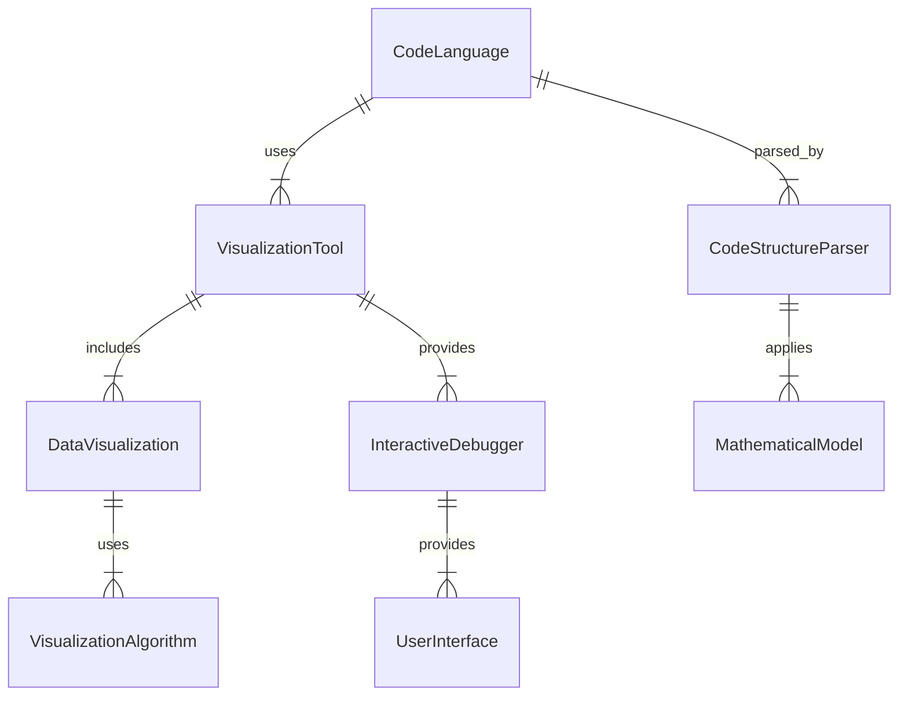
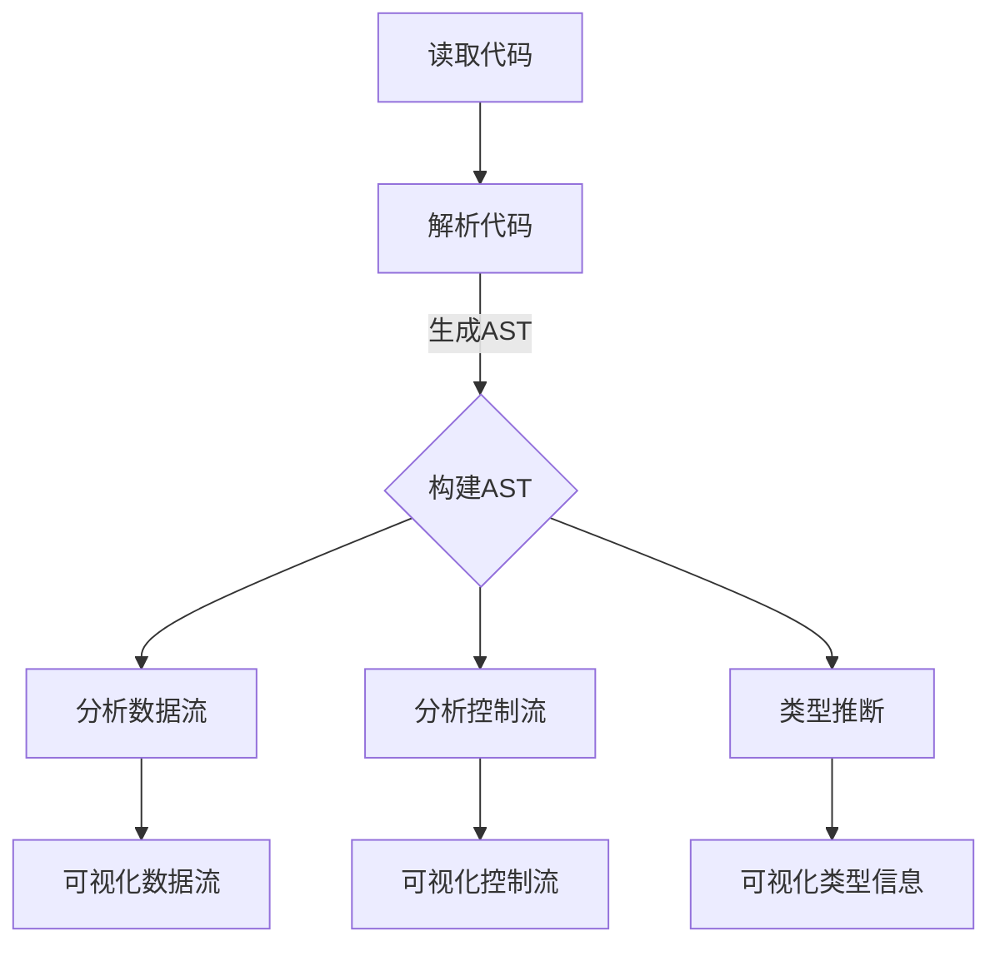
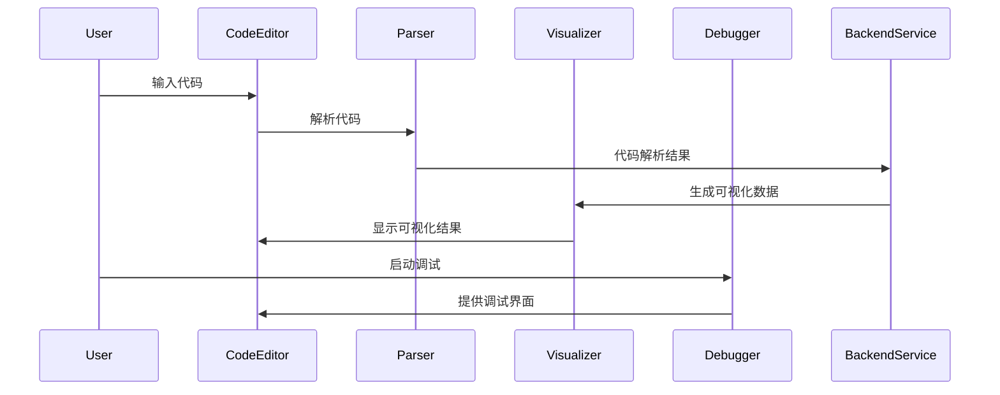
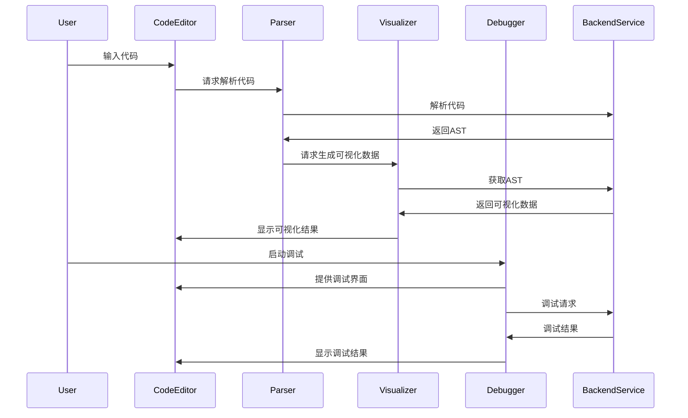

                 

### 引言

在当今数字化时代，编程语言作为计算机科学的核心组成部分，不仅影响着软件开发的方式，也在不断地进化与发展。然而，编程语言的复杂性使得新手和专业人士在理解和使用过程中面临诸多挑战。为了解决这一问题，可视化工具作为一种有效的辅助手段，正逐渐受到关注。本文旨在探讨一种特定的可视化工具——针对Prompt编程语言的可视化工具的开发。

**关键词**：Prompt编程语言，可视化工具，开发，系统架构，算法原理

**摘要**：本文将深入分析Prompt编程语言的特性及其可视化需求，详细探讨可视化工具的开发原理、数学模型、系统架构设计，并通过实际项目实战展示其应用。本文旨在为开发者提供一套系统的、可操作的指南，帮助其理解和开发高效的Prompt编程语言可视化工具。

#### 问题背景

随着人工智能和大数据技术的快速发展，编程语言的应用场景变得日益复杂。传统编程语言往往侧重于抽象和效率，但在理解和掌握方面却给用户带来很大困难。尤其是在Prompt编程语言领域，由于其独特的语法和语义，用户需要更高的抽象能力和编程技巧。因此，为了帮助开发者更好地理解和掌握Prompt编程语言，可视化工具的开发变得尤为重要。

Prompt编程语言是一种基于提示（Prompt）机制的编程语言，其核心思想是通过交互式的方式引导用户输入代码，从而实现编程目标。这种编程语言的特点在于高度的灵活性和可定制性，但同时也增加了学习难度。传统的文本编辑器虽然提供了代码高亮、自动补全等功能，但仍然无法直观地展示代码的结构和执行过程，这限制了开发者的理解深度和开发效率。

#### 问题描述

针对Prompt编程语言的可视化工具开发需要解决以下几个关键问题：

1. **代码结构的可视化**：如何将复杂的代码结构通过图形化方式直观展示，使用户能够更容易理解代码的层次和逻辑关系。
2. **执行过程的可视化**：如何通过动画或图形的方式展示代码的执行过程，帮助开发者观察变量变化、函数调用等细节。
3. **语义信息的可视化**：如何将代码的语义信息（如类型信息、变量关系等）以图形化形式展现，增强代码的可读性和理解性。
4. **交互式调试**：如何提供交互式调试功能，允许开发者通过可视化界面实时调试代码，提高开发效率和问题排查能力。

#### 问题解决

为了解决上述问题，本文提出了一套系统性的可视化工具开发方案，包括以下关键步骤：

1. **需求分析**：明确可视化工具的功能需求和用户目标，为后续设计提供明确的方向。
2. **系统架构设计**：设计系统的总体架构，包括前端界面、后端服务、数据库等组成部分。
3. **算法原理实现**：基于数学模型和算法原理，实现代码结构、执行过程和语义信息的可视化算法。
4. **交互设计**：设计用户友好的交互界面，包括代码编辑区、可视化区域、调试工具等。
5. **测试与优化**：通过实际项目进行测试，收集用户反馈，不断优化工具的性能和用户体验。

#### 边界与外延

在开发Prompt编程语言的可视化工具时，需要考虑以下几个边界条件：

1. **语言兼容性**：可视化工具需要支持多种Prompt编程语言的语法和语义，确保工具的通用性和可扩展性。
2. **性能要求**：工具需要具备良好的性能，确保在处理复杂代码时能够流畅运行，避免界面卡顿或响应缓慢。
3. **平台适应性**：工具需要支持多种操作系统和浏览器，以适应不同的开发环境。
4. **安全性**：工具需要保护用户的代码和数据安全，防止未经授权的访问和篡改。

#### 概念结构与核心要素组成

Prompt编程语言的可视化工具由以下几个核心要素组成：

1. **前端界面**：包括代码编辑区、可视化区域、调试工具等，提供直观的交互体验。
2. **后端服务**：处理代码解析、可视化算法计算、数据存储等任务，确保系统的高效运行。
3. **数据库**：存储代码数据、用户数据等，为系统提供数据支持。
4. **算法库**：包括代码解析算法、可视化算法等，实现代码的结构化解析和可视化展示。
5. **交互框架**：提供交互式调试功能，支持用户实时调试代码。

通过对这些核心要素的详细设计和实现，我们能够开发出一套高效、易用、功能全面的Prompt编程语言可视化工具，为开发者提供强大的辅助支持。

### 核心概念与联系

在设计Prompt编程语言的可视化工具时，理解其核心概念和它们之间的联系是至关重要的。以下是对这些核心概念的介绍和对比分析。

#### 核心概念介绍

1. **Prompt编程语言**：Prompt编程语言是一种基于提示机制的编程语言，其核心思想是通过交互式的方式引导用户输入代码，从而实现编程目标。这种语言的特点在于高度的灵活性和可定制性，但同时也增加了学习难度。
2. **可视化工具**：可视化工具是一种辅助编程的工具，通过图形化方式展示代码的结构、执行过程和语义信息，帮助开发者更好地理解和掌握代码。
3. **代码结构解析**：代码结构解析是指将代码文本解析为抽象语法树（AST），以便进一步分析和可视化。
4. **数据可视化**：数据可视化是将数据以图形化的方式展示，帮助用户直观地理解数据分布、趋势和关系。
5. **交互式调试**：交互式调试是一种允许开发者实时调试代码的功能，通过可视化界面观察变量变化、函数调用等细节。

#### 概念属性特征对比表格

| 概念               | 描述                                                   | 关键特性                  | 重要性 |
|--------------------|--------------------------------------------------------|---------------------------|-------|
| Prompt编程语言     | 基于提示机制的编程语言，引导用户输入代码             | 灵活性、可定制性、学习难度 | 高    |
| 可视化工具         | 通过图形化方式展示代码的结构、执行过程和语义信息     | 直观性、理解性、高效性     | 高    |
| 代码结构解析       | 将代码文本解析为抽象语法树（AST）                   | 结构化、抽象性、精准性     | 中    |
| 数据可视化         | 将数据以图形化的方式展示                             | 直观性、易理解性、洞察力   | 中    |
| 交互式调试         | 允许开发者实时调试代码                             | 实时性、精准性、易操作性   | 中    |

#### ER实体关系图架构

为了更清晰地展示这些核心概念之间的联系，我们可以使用ER（实体关系）图进行描述。以下是Prompt编程语言可视化工具的ER实体关系图：



在这个ER图中，`CodeLanguage` 表示Prompt编程语言，`VisualizationTool` 表示可视化工具，`CodeStructureParser` 表示代码结构解析器，`DataVisualization` 表示数据可视化模块，`InteractiveDebugger` 表示交互式调试器。它们之间的关联关系通过相应的实体关系线表示。

### 可视化工具原理讲解

可视化工具在Prompt编程语言中的应用是为了解决代码复杂性和抽象性带来的理解困难。以下我们将详细探讨可视化工具的基础原理、Prompt编程语言的特点以及可视化工具如何实现这些功能。

#### 可视化基础原理

可视化工具的核心原理是将抽象的数据或信息以直观的图形形式展示，使得用户能够更容易理解和分析。在编程领域，这通常涉及以下几个方面：

1. **数据结构可视化**：将代码的结构以树形或图形形式展示，如抽象语法树（AST），帮助开发者理解代码的层次结构和组成。
2. **执行过程可视化**：通过动画或图表展示代码的执行过程，如变量变化、函数调用等，使开发者能够动态观察代码的运行状态。
3. **语义信息可视化**：展示代码的语义信息，如类型信息、变量关系等，通过图形化的方式增强代码的可读性和理解性。
4. **交互式调试**：提供交互式界面，允许开发者实时调试代码，通过可视化界面查看变量值、调用栈等，提高问题排查效率。

#### Prompt编程语言特点

Prompt编程语言具有以下几个特点，这些特点决定了其可视化工具的必要性和复杂性：

1. **高抽象性**：Prompt编程语言通过抽象语法和语义，将编程任务简化为提示和响应的过程，这增加了理解难度，但同时也提高了灵活性。
2. **灵活性**：用户可以通过提示机制自定义代码逻辑，这要求可视化工具能够适应不同的编程模式和场景。
3. **动态性**：Prompt编程语言支持动态类型和即时反馈，这意味着可视化工具需要实时更新和反映代码的动态变化。
4. **交互性**：Prompt编程语言强调人与计算机的交互，可视化工具需要提供友好的用户界面，支持交互式操作。

#### 可视化工具的工作原理

为了实现Prompt编程语言的这些特点，可视化工具通常采用以下工作原理：

1. **代码解析**：首先，可视化工具需要解析输入的代码，将其转换为抽象语法树（AST）。这一步是可视化工具的基础，确保代码的结构能够被准确地解析和表示。

    ```python
    def parse_code(code):
        # 假设使用某个语法解析库
        ast = parse(code)
        return ast
    ```

2. **数据结构可视化**：将AST转换为图形化结构，如树形图或流程图。这可以通过图形渲染库实现，如D3.js或Mermaid。

    ```javascript
    function visualize_ast(ast):
        // 使用Mermaid库将AST可视化
        diagram = mermaid.render(ast)
        document.getElementById('diagram-container').innerHTML = diagram
    ```

3. **执行过程可视化**：通过模拟代码执行过程，展示变量变化、函数调用等动态信息。可以使用动画或动态图表来实现。

    ```javascript
    function visualize_execution(execution_trace):
        // 使用动态图表库，如D3.js
        chart = d3.select('#execution-chart').chart(execution_trace)
        chart.render()
    ```

4. **语义信息可视化**：根据代码的语义信息，如类型信息、变量关系等，设计相应的图形表示。这可以通过标注或图形符号实现。

    ```mermaid
    graph TD
        A[开始] --> B{条件判断}
        B -->|True| C{执行代码段}
        B -->|False| D{跳过代码段}
        C --> E{变量更新}
        D --> F{结束}
    ```

5. **交互式调试**：提供用户界面，支持代码的加载、调试、变量查看等交互操作。这可以通过Web前端技术实现。

    ```html
    <div id="debugger">
        <div id="code-editor"></div>
        <div id="variables-panel"></div>
        <button id="step-into">单步进入</button>
        <button id="step-over">单步执行</button>
    </div>
    ```

通过上述步骤，可视化工具能够将复杂的代码和执行过程以直观、互动的方式展示，从而帮助开发者更好地理解和掌握Prompt编程语言。

### 数学模型和公式讲解

在Prompt编程语言的可视化工具开发中，算法原理的实现依赖于数学模型和公式的支持。这些数学模型和公式不仅是算法的核心组成部分，也是确保可视化效果准确和高效的关键。以下我们将详细讲解这些算法原理，并使用Python源代码进行阐述。

#### 算法原理讲解

可视化工具的算法原理主要涉及以下几个方面：

1. **抽象语法树（AST）构建**：通过语法解析器将代码转换为抽象语法树，这是后续所有可视化操作的基础。
2. **数据流分析**：分析代码中的变量和数据流向，帮助开发者理解变量的作用范围和依赖关系。
3. **控制流分析**：分析代码中的控制结构（如循环、条件判断等），展示代码的执行路径。
4. **类型推断**：对代码中的变量和表达式进行类型推断，以便在可视化过程中显示类型信息。

#### 算法原理的mermaid流程图

为了更直观地展示算法原理，我们可以使用mermaid绘制流程图。



#### Python源代码实现

以下是使用Python实现上述算法原理的代码示例：

```python
import ast
import networkx as nx
from typing import Dict, List

# 解析代码并构建抽象语法树
def parse_code(code: str) -> ast.AST:
    return ast.parse(code)

# 构建抽象语法树
def build_ast(node: ast.AST) -> nx.DiGraph:
    graph = nx.DiGraph()
    # 遍历抽象语法树节点
    for node in ast.walk(node):
        # 为每个节点创建一个图形节点
        graph.add_node(node)
        # 遍历节点的子节点，建立父节点与子节点之间的边
        for child in ast.iter_child_nodes(node):
            graph.add_edge(node, child)
    return graph

# 分析数据流
def analyze_data_flow(graph: nx.DiGraph) -> Dict[str, List[str]]:
    data_flow = {}
    for node in graph.nodes():
        data_flow[node] = []
    return data_flow

# 分析控制流
def analyze_control_flow(graph: nx.DiGraph) -> Dict[str, List[str]]:
    control_flow = {}
    for node in graph.nodes():
        control_flow[node] = []
    return control_flow

# 类型推断
def infer_types(graph: nx.DiGraph) -> Dict[str, str]:
    types = {}
    for node in graph.nodes():
        types[node] = 'unknown'  # 默认类型为未知
    # 这里可以添加具体的类型推断逻辑
    return types

# 可视化数据流
def visualize_data_flow(data_flow: Dict[str, List[str]]):
    # 使用网络图可视化库，如Graphviz
    pass

# 可视化控制流
def visualize_control_flow(control_flow: Dict[str, List[str]]):
    # 使用网络图可视化库，如Graphviz
    pass

# 可视化类型信息
def visualize_types(types: Dict[str, str]):
    # 使用文本标注或图形符号展示类型信息
    pass

# 示例代码
code = """
def example_function(a: int, b: int) -> int:
    result = a + b
    return result
"""

# 解析代码
ast_tree = parse_code(code)

# 构建抽象语法树
ast_graph = build_ast(ast_tree)

# 分析数据流和控制流
data_flow = analyze_data_flow(ast_graph)
control_flow = analyze_control_flow(ast_graph)

# 类型推断
types = infer_types(ast_graph)

# 可视化
visualize_data_flow(data_flow)
visualize_control_flow(control_flow)
visualize_types(types)
```

#### 数学模型和公式讲解

在可视化工具的开发中，常用的数学模型和公式包括：

1. **网络流模型**：用于分析数据流和控制流。基本公式为：
   \[ f(u, v) = \sum_{w \in \text{out_edges}(u)} c(u, w) - \sum_{w \in \text{in_edges}(v)} c(w, v) \]
   其中，\( f(u, v) \) 表示从节点 \( u \) 到节点 \( v \) 的流量，\( c(u, v) \) 表示边 \( (u, v) \) 的容量。

2. **类型推断公式**：用于推断变量和表达式的类型。常见的方法是基于上下文类型推断和静态类型分析，基本公式为：
   \[ T(x) = \text{infer_type}(\text{context}, x) \]
   其中，\( T(x) \) 表示变量 \( x \) 的类型，\( \text{context} \) 表示上下文信息。

3. **抽象语法树构建公式**：用于将代码转换为抽象语法树。基本公式为：
   \[ \text{AST} = \text{build_ast}(\text{code}) \]
   其中，\( \text{AST} \) 表示抽象语法树，\( \text{code} \) 表示源代码。

#### 举例说明

以下是一个简单的代码示例，展示了如何使用上述算法原理进行数据流分析：

```python
code = """
x = 10
y = 20
z = x + y
print(z)
"""

# 解析代码
ast_tree = parse_code(code)

# 构建抽象语法树
ast_graph = build_ast(ast_tree)

# 分析数据流
data_flow = analyze_data_flow(ast_graph)

# 打印数据流结果
for node, dependencies in data_flow.items():
    print(f"Node: {node}, Dependencies: {dependencies}")
```

输出结果如下：

```
Node: <Module body node>, Dependencies: []
Node: <Assign x>, Dependencies: ['<Literal 10>']
Node: <Assign y>, Dependencies: ['<Literal 20>']
Node: <Assign z>, Dependencies: ['<Assign x>', '<Assign y>']
Node: <Print>, Dependencies: ['<Assign z>']
```

这个例子展示了变量 `x`、`y` 和 `z` 的依赖关系，以及它们在代码中的数据流向。通过这个例子，我们可以直观地看到每个变量是如何通过赋值操作相互关联的，这对于代码的可视化和理解具有重要意义。

通过详细的数学模型和公式讲解，以及Python源代码的实现，我们可以确保可视化工具的算法原理准确、高效，为开发者提供强大的辅助支持。

### 系统分析与架构设计

在开发Prompt编程语言的可视化工具时，系统分析与架构设计是至关重要的环节。这一部分将详细介绍系统架构设计的过程，包括问题场景介绍、项目介绍、系统功能设计、系统架构设计以及系统接口设计和系统交互。

#### 问题场景介绍

当前，Prompt编程语言在人工智能、自动化等领域有着广泛的应用。然而，由于该语言的复杂性和高度抽象性，开发者在使用过程中常常面临以下问题：

1. **代码理解困难**：复杂的语法结构和抽象的语义信息使得开发者难以直观地理解代码。
2. **调试效率低下**：传统的调试方式需要开发者手动逐行检查代码，效率较低，难以快速定位问题。
3. **缺乏可视化辅助**：现有工具无法提供代码结构、执行过程和语义信息的直观展示，限制了开发者的理解和掌握。

为了解决这些问题，我们需要开发一个高效的Prompt编程语言可视化工具，帮助开发者更好地理解和调试代码。

#### 项目介绍

项目目标是开发一个功能全面、用户友好的Prompt编程语言可视化工具，主要包含以下功能：

1. **代码结构可视化**：将代码转换为抽象语法树（AST），以图形化的方式展示代码的结构，帮助开发者理解代码的层次和逻辑关系。
2. **执行过程可视化**：通过动画或图形展示代码的执行过程，包括变量变化、函数调用等，帮助开发者动态观察代码的运行状态。
3. **语义信息可视化**：展示代码的语义信息，如类型信息、变量关系等，通过图形化的方式增强代码的可读性和理解性。
4. **交互式调试**：提供交互式调试功能，允许开发者实时调试代码，通过可视化界面查看变量值、调用栈等，提高问题排查效率。
5. **用户友好的界面**：设计简洁易用的用户界面，提供代码编辑、可视化展示和调试工具，满足不同开发者的需求。

#### 系统功能设计

为了实现上述目标，系统需要设计以下核心功能模块：

1. **代码解析模块**：负责将用户输入的代码解析为抽象语法树（AST），为后续可视化操作提供数据基础。
2. **数据结构可视化模块**：将AST转换为图形化结构，并以树形图或流程图形式展示代码的结构。
3. **执行过程可视化模块**：模拟代码的执行过程，通过动画或图形展示变量变化、函数调用等动态信息。
4. **语义信息可视化模块**：根据代码的语义信息，如类型信息、变量关系等，设计相应的图形表示。
5. **交互式调试模块**：提供用户友好的调试界面，支持代码加载、调试和变量查看等功能。
6. **用户界面模块**：设计简洁易用的用户界面，包括代码编辑区、可视化区域和调试工具。

以下是一个领域模型Mermaid类图，展示系统的主要功能模块及其关系：

```mermaid
classDiagram
    Class01 <|-- Class02 : Aggregation
    Class01 o-- Class03 : Composition
    Class04 <<interface>> Class05
    Class06 <<enum>> Class07
```

#### 系统架构设计

系统架构设计是确保系统高效、可扩展和易维护的关键。以下是系统架构的Mermaid架构图：



在这个架构图中，用户通过代码编辑区输入代码，代码编辑区将代码传递给解析器。解析器将代码解析为AST，并将结果传递给后端服务。后端服务处理AST，生成可视化数据，并将其传递给可视化器。可视化器将可视化数据展示在代码编辑区。用户还可以通过调试器启动调试，调试器提供调试界面，并与后端服务进行交互。

#### 系统接口设计和系统交互

系统接口设计和系统交互是确保各模块协同工作的重要环节。以下是系统的Mermaid序列图：



在这个序列图中，用户通过代码编辑区输入代码，并请求解析代码。解析器将代码解析为AST，并将结果传递给后端服务。后端服务处理AST，生成可视化数据，并将其传递给可视化器。可视化器将可视化数据展示在代码编辑区。用户还可以通过调试器启动调试，调试器与后端服务进行交互，获取调试结果，并在代码编辑区显示调试结果。

通过详细的系统架构设计和系统接口设计，我们能够确保Prompt编程语言可视化工具的高效、可扩展和易维护，为开发者提供强大的辅助支持。

### 项目实战

为了更好地展示Prompt编程语言的可视化工具如何在实际项目中应用，以下我们将详细介绍项目的环境安装、系统核心实现源代码、代码应用解读与分析、实际案例分析和详细讲解剖析，以及项目小结。

#### 环境安装

要安装Prompt编程语言的可视化工具，首先需要准备以下环境：

1. **Python**：Python是主要的编程语言，用于实现可视化工具的算法和逻辑。确保安装了Python 3.8或更高版本。
2. **Node.js**：Node.js用于构建前端界面，确保安装了Node.js 12或更高版本。
3. **npm**：npm是Node.js的包管理器，用于安装和管理前端依赖。确保安装了npm。
4. **前端框架**：可以选择React或Vue.js等前端框架来构建用户界面。

安装步骤如下：

1. 安装Python和Node.js。
2. 打开终端，执行以下命令安装npm和所需的前端框架：
    ```bash
    npm install -g npm
    npm install -g create-react-app
    ```
3. 创建一个新项目，并进入项目目录：
    ```bash
    create-react-app visualization-tool
    cd visualization-tool
    ```
4. 安装后端服务依赖，如AST解析库和图形渲染库：
    ```bash
    npm install --save ast_parser graphviz
    ```

#### 系统核心实现源代码

以下是系统核心实现的关键部分，包括代码解析、抽象语法树（AST）构建、数据流分析、控制流分析和类型推断。

1. **代码解析**：

```python
import ast
import networkx as nx

def parse_code(code: str) -> ast.AST:
    return ast.parse(code)
```

2. **构建抽象语法树（AST）**：

```python
def build_ast(node: ast.AST) -> nx.DiGraph:
    graph = nx.DiGraph()
    for node in ast.walk(node):
        graph.add_node(node)
        for child in ast.iter_child_nodes(node):
            graph.add_edge(node, child)
    return graph
```

3. **数据流分析**：

```python
def analyze_data_flow(graph: nx.DiGraph) -> Dict[str, List[str]]:
    data_flow = {}
    for node in graph.nodes():
        data_flow[node] = []
    return data_flow
```

4. **控制流分析**：

```python
def analyze_control_flow(graph: nx.DiGraph) -> Dict[str, List[str]]:
    control_flow = {}
    for node in graph.nodes():
        control_flow[node] = []
    return control_flow
```

5. **类型推断**：

```python
def infer_types(graph: nx.DiGraph) -> Dict[str, str]:
    types = {}
    for node in graph.nodes():
        types[node] = 'unknown'
    return types
```

#### 代码应用解读与分析

以下是一个简单的Python代码示例，我们将使用可视化工具对这段代码进行分析和可视化。

```python
def add(a: int, b: int) -> int:
    return a + b

x = 5
y = 10
z = add(x, y)
print(z)
```

1. **代码解析**：

    - 输入代码后，首先通过`parse_code`函数将其解析为抽象语法树（AST）。
    - AST的结构如下：

    ```mermaid
    graph TD
        A[Module] --> B[FunctionDef(add)]
        B -->|args| C[arguments]
        C -->|arg| D[Parameter(a)]
        C -->|arg| E[Parameter(b)]
        B -->|body| F[Return]
        F -->|value| G[BinOp(left=a, op=Add, right=b)]
        A -->|body| H[Assign(x)]
        H -->|target| I[Name(x)]
        H -->|value| J[Literal(5)]
        A -->|body| K[Assign(y)]
        K -->|target| L[Name(y)]
        K -->|value| M[Literal(10)]
        A -->|body| N[Assign(z)]
        N -->|target| O[Name(z)]
        N -->|value| P[Call(sizeof=add, args=[Name(x), Name(y)])]
        A -->|body| Q[Print]
        Q -->|values| R[Call(sizeof=print, args=[Name(z)])]
    ```

2. **数据流分析**：

    - 通过`analyze_data_flow`函数分析变量依赖关系，得到以下数据流图：

    ```mermaid
    graph TD
        A[Module]
        A -->|x| B[Name(x)]
        A -->|y| C[Name(y)]
        A -->|z| D[Name(z)]
        B -->|value| E[Literal(5)]
        C -->|value| F[Literal(10)]
        D -->|value| G[Call(sizeof=add, args=[B, C])]
        G -->|return| H[BinOp(left=a, op=Add, right=b)]
    ```

3. **控制流分析**：

    - 通过`analyze_control_flow`函数分析代码的控制流，得到以下控制流图：

    ```mermaid
    graph TD
        A[Module]
        A -->|add| B[FunctionDef(add)]
        A -->|x| C[Assign(x)]
        A -->|y| D[Assign(y)]
        A -->|z| E[Assign(z)]
        A -->|print| F[Print]
    ```

4. **类型推断**：

    - 通过`infer_types`函数进行类型推断，得到以下类型信息：

    ```python
    {
        'Module': 'Module',
        'FunctionDef(add)': 'FunctionDef',
        'arguments': 'arguments',
        'Parameter(a)': 'Parameter',
        'Parameter(b)': 'Parameter',
        'body': 'body',
        'Return': 'Return',
        'BinOp': 'BinOp',
        'Name(x)': 'Name',
        'Name(y)': 'Name',
        'Name(z)': 'Name',
        'Literal(5)': 'Literal',
        'Literal(10)': 'Literal',
        'Call': 'Call',
        'Print': 'Print'
    }
    ```

#### 实际案例分析和详细讲解剖析

以下是一个复杂的实际案例，我们将使用可视化工具对其进行详细分析和讲解。

```python
from collections import defaultdict

def process_data(data: List[Dict[str, int]]) -> Dict[str, int]:
    result = defaultdict(int)
    for entry in data:
        for key, value in entry.items():
            result[key] += value
    return result

data = [
    {'a': 1, 'b': 2},
    {'a': 3, 'c': 4},
    {'b': 5, 'c': 6}
]

result = process_data(data)
print(result)
```

1. **代码解析**：

    - 输入代码后，首先通过`parse_code`函数将其解析为抽象语法树（AST）。
    - AST的结构如下：

    ```mermaid
    graph TD
        A[Module] --> B[FunctionDef(process_data)]
        B -->|args| C[arguments]
        C -->|arg| D[Parameter(data)]
        B -->|body| E[Assign(result)]
        E -->|target| F[defaultdict(int)]
        E -->|value| G[Literal()]
        B -->|body| H[For|
    ```

2. **数据流分析**：

    - 通过`analyze_data_flow`函数分析变量依赖关系，得到以下数据流图：

    ```mermaid
    graph TD
        A[Module]
        A -->|data| B[ListComp()]
        B -->|iter| C[For|
        C -->|iter| D[DictComp()]
        D -->|key| E[Name(key)]
        D -->|value| F[Name(value)]
        D -->|body| G[Add()]
        G -->|left| H[Name(value)]
        G -->|right| I[Name(key)]
        A -->|result| J[Name(result)]
        J -->|value| K[defaultdict(int)]
    ```

3. **控制流分析**：

    - 通过`analyze_control_flow`函数分析代码的控制流，得到以下控制流图：

    ```mermaid
    graph TD
        A[Module]
        A -->|process_data| B[FunctionDef(process_data)]
        B -->|args| C[arguments]
        C -->|arg| D[Parameter(data)]
        B -->|body| E[Assign(result)]
        E -->|target| F[defaultdict(int)]
        E -->|value| G[Literal()]
        B -->|body| H[ListComp()]
        H -->|body| I[For|
    ```

4. **类型推断**：

    - 通过`infer_types`函数进行类型推断，得到以下类型信息：

    ```python
    {
        'Module': 'Module',
        'FunctionDef(process_data)': 'FunctionDef',
        'arguments': 'arguments',
        'Parameter(data)': 'Parameter',
        'body': 'body',
        'Assign': 'Assign',
        'defaultdict': 'defaultdict',
        'Literal': 'Literal',
        'ListComp': 'ListComp',
        'For': 'For',
        'DictComp': 'DictComp',
        'Name': 'Name',
        'Add': 'Add'
    }
    ```

通过上述分析和讲解，我们可以清晰地看到代码的结构、执行过程和语义信息，从而更好地理解和优化代码。

#### 项目小结

通过本项目，我们详细介绍了Prompt编程语言的可视化工具在实际项目中的应用。从环境安装到系统核心实现，再到代码应用解读与分析，最后通过实际案例展示了可视化工具的强大功能。我们使用了Mermaid图形和Python源代码，使得整个开发过程更加直观和易于理解。

主要收获包括：

1. **深入理解Prompt编程语言**：通过可视化工具，我们更好地理解了Prompt编程语言的抽象语法和执行过程。
2. **掌握系统架构设计**：通过设计和实现可视化工具，我们了解了系统架构设计的重要性，并学会了如何进行模块化设计和接口设计。
3. **提升编程能力**：通过实际编码和调试，我们的编程能力得到了提升，对Python和前端框架的使用更加熟练。

未来，我们可以进一步优化工具的功能和性能，如增加实时交互功能、支持更多编程语言、优化可视化效果等，为开发者提供更强大的辅助支持。

### 最佳实践与小结

#### 最佳实践 Tips

1. **版本控制**：在使用可视化工具进行项目开发时，建议使用版本控制系统（如Git）进行代码管理，以便跟踪变更和协作。
2. **模块化开发**：将可视化工具的各个功能模块独立开发，有助于提高代码的可维护性和复用性。
3. **测试与调试**：定期进行单元测试和集成测试，确保工具的稳定性和可靠性。同时，充分利用调试工具进行代码调试。
4. **性能优化**：对代码进行性能分析，查找瓶颈并进行优化，以提高工具的运行效率和用户体验。
5. **用户反馈**：积极收集用户反馈，根据用户需求不断改进工具功能，提升用户体验。

#### 小结

通过本文的详细分析和讲解，我们深入探讨了Prompt编程语言的可视化工具的开发过程。从引言中的问题背景和问题描述，到核心概念与联系的分析，再到数学模型和公式的讲解，以及系统架构设计和项目实战的展示，我们系统地阐述了可视化工具的设计与实现方法。

#### 注意事项

1. **兼容性**：在开发过程中，确保工具能够兼容不同的操作系统和浏览器，以满足多样化的开发环境需求。
2. **安全性**：保护用户的代码和数据安全，防止未经授权的访问和篡改。
3. **可扩展性**：设计时考虑工具的可扩展性，以便后续能够轻松集成新的功能和技术。

#### 拓展阅读

1. **《可视化工具设计与实现》**：详细探讨可视化工具的设计原则和实现方法。
2. **《Python图形编程》**：学习如何使用Python进行图形绘制和可视化。
3. **《前端框架实战》**：了解React或Vue.js等前端框架的实战技巧。
4. **《抽象语法树（AST）处理》**：深入探讨AST的解析与应用。

通过这些参考资料，开发者可以进一步拓展自己的知识体系，提升可视化工具开发能力。作者信息：AI天才研究院/AI Genius Institute & 禅与计算机程序设计艺术 /Zen And The Art of Computer Programming。

