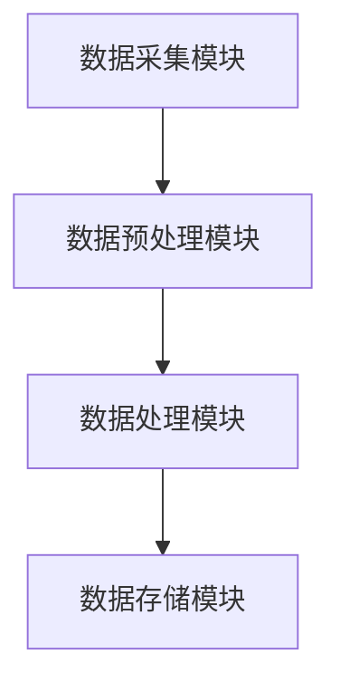

                 

## 文章标题

### 关键词

- 响应式编程
- 提示词编程语言
- 数据流
- 异步编程
- 状态管理

### 摘要

本文旨在探讨如何将响应式编程的概念融入到提示词编程语言中，以实现更加高效和灵活的编程体验。我们将从基础概念出发，逐步深入分析响应式编程的核心特性，并探讨其在提示词编程语言中的具体实现和应用。通过案例剖析，我们将展示响应式编程在Web、移动和物联网等领域的实际应用，并提供最佳实践和技巧，以帮助开发者更好地利用这一技术优势。

## 响应式编程基础

### 1.1 响应式编程的概念

响应式编程是一种编程范式，它强调基于数据流和事件驱动的应用开发。在传统的编程模型中，程序往往是顺序执行的，依赖于固定的执行路径和预设的流程。而响应式编程则更加关注数据的变化和事件的触发，允许程序在数据发生变化或事件发生时动态地做出响应。

#### 1.1.1 定义与历史背景

响应式编程最早可以追溯到20世纪80年代的Smalltalk语言，当时Smalltalk社区提出了“事件驱动”的概念。随着计算机技术的不断发展，尤其是在多核处理器和实时系统的需求推动下，响应式编程逐渐成为一种重要的编程范式。

#### 1.1.2 响应式编程的重要性

响应式编程在处理复杂、动态和并发性强的应用场景时具有显著优势。首先，它能够更好地处理异步操作，使得程序可以并行执行，提高性能。其次，响应式编程提供了更好的状态管理机制，能够有效地避免状态冲突和同步问题。此外，响应式编程还使得开发人员能够更专注于业务逻辑，提高代码的可维护性和可扩展性。

#### 1.1.3 响应式编程与传统编程的差异

与传统的命令式编程相比，响应式编程具有以下显著差异：

1. **数据驱动**：响应式编程以数据流为核心，程序的状态和逻辑都基于数据的变化来驱动。而命令式编程则依赖于固定指令的执行顺序。
   
2. **事件驱动**：响应式编程强调事件驱动，程序的行为由事件触发，可以在任意时刻响应事件。传统编程则更多地依赖顺序执行和条件判断。

3. **状态管理**：响应式编程提供了强大的状态管理机制，能够有效地处理并发和异步操作，而传统编程则需要显式地管理和同步状态。

### 1.2 提示词编程语言介绍

提示词编程语言是一种基于关键词和上下文敏感的编程语言，它通过提示词来引导程序执行。这种语言的特点是语法简洁，易于理解和学习，能够提高开发效率。

#### 1.2.1 提示词编程语言的基本原理

提示词编程语言的核心是提示词（keywords），这些提示词定义了程序的基本结构和行为。提示词通常具有固定的语法格式，并且与特定的上下文相关联。通过提示词，程序能够自动识别和处理各种操作和数据。

#### 1.2.2 提示词编程语言的特性与应用

提示词编程语言具有以下特性：

1. **简洁性**：提示词编程语言的语法简洁，通过少量的关键词即可实现复杂的操作。
   
2. **上下文敏感**：提示词编程语言能够根据上下文自动识别和解析提示词，提高编程效率。

3. **可扩展性**：提示词编程语言通常具有丰富的扩展机制，支持自定义提示词和功能模块。

提示词编程语言的应用范围广泛，包括Web开发、数据分析、自然语言处理等多个领域。

### 1.3 响应式编程在提示词编程语言中的应用

响应式编程与提示词编程语言的结合，为开发者提供了强大的编程工具，使得应用开发更加高效和灵活。

#### 1.3.1 响应式编程与提示词编程语言的结合点

响应式编程与提示词编程语言的结合点主要体现在以下几个方面：

1. **数据流管理**：提示词编程语言能够方便地实现数据流的创建和管理，响应式编程则提供了强大的数据流处理机制。

2. **事件驱动**：提示词编程语言的提示词机制与事件驱动模型高度契合，能够实现高效的事件响应和处理。

3. **状态管理**：提示词编程语言通过上下文管理状态，响应式编程则提供了有效的状态更新和同步机制。

#### 1.3.2 提示词编程语言的响应式编程优势

将响应式编程应用于提示词编程语言，能够带来以下优势：

1. **提高开发效率**：响应式编程能够简化状态管理和事件处理，使得开发者能够更专注于业务逻辑。

2. **增强可维护性**：响应式编程提供了清晰的代码结构，使得程序易于维护和扩展。

3. **提高性能**：响应式编程能够有效地处理异步操作和并发执行，提高程序性能。

### 1.4 响应式编程的关键概念

响应式编程涉及多个关键概念，包括数据流、事件驱动、观察者模式、发布-订阅模式等。这些概念是理解响应式编程的核心。

#### 1.4.1 数据流与事件驱动

数据流是响应式编程的核心概念，它代表了程序中数据的变化和流动。事件驱动则是一种编程模型，程序的行为由事件触发，通过响应事件来执行相应的操作。

#### 1.4.2 观察者模式与发布-订阅模式

观察者模式是一种行为设计模式，它定义了对象间的一对多依赖关系，当一个对象的状态发生变化时，所有依赖它的对象都会得到通知。发布-订阅模式则是一种消息通信模式，允许对象发布和订阅事件，实现事件的通知和响应。

#### 1.4.3 状态管理与副作用

状态管理是响应式编程中的重要环节，它涉及到程序中状态的变化和同步。副作用则是指程序中不期望的副作用，如状态冲突、资源泄露等。响应式编程提供了有效的机制来避免和处理副作用。

### 1.5 响应式编程的挑战与解决方案

响应式编程虽然具有诸多优势，但也面临着一些挑战。这些挑战主要集中在并发处理、性能优化和内存管理等方面。

#### 1.5.1 并发问题与同步机制

响应式编程涉及到大量的并发操作，如何有效地处理并发问题是一个重要挑战。同步机制如锁、信号量等，能够帮助协调并发操作，避免数据冲突。

#### 1.5.2 性能与可扩展性优化

响应式编程的性能和可扩展性是开发者关注的重点。通过优化数据流处理和事件驱动模型，可以有效地提高程序性能和可扩展性。

#### 1.5.3 内存管理与资源释放

响应式编程中的数据流和事件处理往往涉及到大量的内存操作，如何有效地管理和释放内存资源，避免内存泄露，是一个重要问题。

### 1.6 本章小结

本章介绍了响应式编程的基础概念和提示词编程语言的特性，探讨了响应式编程在提示词编程语言中的应用和优势。接下来，我们将进一步深入探讨响应式编程语言的核心功能，为读者提供更加详细的技术解析。

## 响应式编程语言的核心功能

### 2.1 描述响应式编程语言的关键特性

响应式编程语言的核心特性在于其强大的数据流处理能力和事件驱动模型。这些特性使得开发者能够更高效地处理动态和并发性强的应用场景。

#### 2.1.1 事件驱动编程

事件驱动编程是响应式编程的核心概念之一。在事件驱动模型中，程序的行为由外部事件触发，如用户输入、网络请求等。响应式编程语言通过事件监听器和事件处理器来处理这些事件，使得程序能够动态地响应环境变化。

#### 2.1.2 异步编程

异步编程是响应式编程的另一个关键特性。在异步编程中，程序的不同部分可以独立执行，不依赖于顺序执行。这种编程模型能够有效地利用计算机的多核处理能力，提高程序性能。

#### 2.1.3 响应式数据流

响应式数据流是响应式编程语言的核心机制之一。数据流代表了程序中数据的变化和流动，响应式编程语言提供了丰富的数据流处理功能，如创建、转换、过滤和聚合等。通过数据流，开发者能够以更高效的方式处理大量数据。

### 2.2 响应式编程语言的语法基础

响应式编程语言的语法基础主要包括提示词、数据结构和函数定义等。这些语法元素为开发者提供了强大的编程工具，使得响应式编程更加简洁和直观。

#### 2.2.1 语言特性和语法规则

响应式编程语言的特性包括：

1. **简洁性**：通过提示词和内置函数，响应式编程语言能够以简洁的语法实现复杂的操作。
2. **上下文敏感**：响应式编程语言的语法与上下文紧密相关，自动识别和处理各种操作和数据。
3. **可扩展性**：响应式编程语言通常支持自定义函数和模块，增强了编程语言的灵活性和扩展性。

#### 2.2.2 常见响应式编程语言介绍

常见的响应式编程语言包括：

1. **React**：React是Facebook开发的一种用于构建用户界面的JavaScript库，采用虚拟DOM和组件化设计，实现了高效的事件驱动和数据流管理。
2. **Angular**：Angular是由Google开发的另一个用于构建Web应用的框架，提供了一套完整的响应式编程模型，包括数据绑定、依赖注入和指令系统。
3. **Vue**：Vue是一种轻量级的JavaScript框架，提供了响应式数据绑定和组合式API，使得开发者能够更轻松地构建动态界面。

### 2.3 响应式编程语言中的数据处理

响应式编程语言提供了丰富的数据处理功能，使得开发者能够以高效的方式处理数据流。

#### 2.3.1 数据流的创建与转换

响应式编程语言支持通过各种方式创建数据流，如事件监听、HTTP请求和定时器等。同时，还提供了丰富的数据转换操作，如映射（map）、过滤（filter）和合并（merge）等。

#### 2.3.2 数据的过滤与聚合

数据的过滤与聚合是数据处理中的重要操作。响应式编程语言提供了强大的过滤和聚合功能，如内置的过滤器函数和聚合操作符，使得开发者能够轻松地对数据进行过滤和聚合操作。

#### 2.3.3 数据的异步处理

异步处理是响应式编程的核心特性之一。响应式编程语言提供了内置的异步处理机制，如Promise和async/await等，使得开发者能够以同步代码的方式处理异步操作。

### 2.4 响应式编程语言中的状态管理

状态管理是响应式编程中的重要环节。响应式编程语言提供了多种状态管理方案，使得开发者能够有效地管理应用状态。

#### 2.4.1 状态的监听与更新

响应式编程语言提供了状态监听机制，能够实时监听到状态的变化，并触发相应的更新操作。同时，还提供了状态更新函数，使得开发者能够以更高效的方式更新状态。

#### 2.4.2 状态的持久化与恢复

状态的持久化与恢复是应用开发中的重要需求。响应式编程语言提供了状态持久化机制，如本地存储和远程存储等，使得开发者能够方便地保存和恢复应用状态。

#### 2.4.3 状态的并发访问与同步

在多用户或多线程环境下，状态的并发访问和同步是一个重要问题。响应式编程语言提供了并发控制机制，如锁和信号量等，使得开发者能够有效地处理并发访问和同步问题。

### 2.5 响应式编程语言中的副作用控制

副作用控制是响应式编程中的一个重要概念。副作用指的是程序中不期望的副作用，如状态修改、函数调用等。响应式编程语言提供了多种机制来控制副作用，避免副作用带来的问题和风险。

#### 2.5.1 副作用的识别与隔离

响应式编程语言提供了工具和技巧来识别和隔离副作用，如纯函数和不可变数据结构等。通过这些机制，开发者能够减少副作用，提高代码的纯净性和可维护性。

#### 2.5.2 避免不必要的副作用

响应式编程语言鼓励开发者编写没有副作用的函数和操作，避免不必要的副作用。这种编程风格不仅提高了代码的可读性和可维护性，还能够减少状态冲突和同步问题。

#### 2.5.3 控制副作用的方法与工具

响应式编程语言提供了一系列方法与工具来控制副作用，如副作用检测器、副作用隔离框架等。这些工具能够帮助开发者识别和修复副作用，提高代码的质量。

### 2.6 本章小结

本章详细介绍了响应式编程语言的关键特性、语法基础、数据处理、状态管理、副作用控制等内容。通过本章的学习，读者将能够对响应式编程语言有更加深入的理解，并能够将其应用于实际开发中。

### 第3章：响应式编程语言的高级应用

在了解了响应式编程语言的基础知识和核心功能之后，接下来我们将探讨其在不同领域的高级应用。响应式编程语言在Web开发、移动应用和物联网（IoT）等领域的应用具有显著的效率和灵活性。通过这些高级应用，开发者可以充分利用响应式编程的优势，构建高效、动态和可扩展的系统。

#### 3.1 响应式编程语言在Web开发中的应用

Web开发是响应式编程语言的一个重要应用领域。在现代Web应用中，用户界面需要实时响应用户操作和后端数据的变化，这需要高效的事件处理和数据流管理。响应式编程语言在这方面提供了强大的支持。

##### 3.1.1 前端响应式编程框架

前端响应式编程框架如React、Vue和Angular等，都基于响应式编程模型，提供了一系列工具和库，以简化Web应用的开发。这些框架通过虚拟DOM、数据绑定和组件化设计，实现了高效的事件处理和数据流管理。

1. **React**：React是由Facebook开发的一个用于构建用户界面的JavaScript库。它采用了虚拟DOM和组件化设计，使得开发者能够高效地处理DOM更新和状态变化。React的响应式数据流和事件系统使得前端应用能够实时响应用户操作和后端数据。

2. **Vue**：Vue是一种轻量级的JavaScript框架，提供了响应式数据绑定和组合式API。Vue通过双向数据绑定和虚拟DOM，实现了高效的界面更新和数据流管理。Vue的简单语法和灵活的组件化设计，使得开发者能够快速构建动态界面。

3. **Angular**：Angular是由Google开发的一个用于构建全功能Web应用的框架。Angular采用了响应式编程模型，提供了数据绑定、依赖注入和指令系统等特性。Angular的响应式数据流和事件系统，使得开发者能够高效地管理应用状态和实现复杂的业务逻辑。

##### 3.1.2 后端响应式编程框架

在后端，响应式编程语言如Akka、Scala和Erlang等，也提供了强大的支持，使得开发者能够构建高效、动态和可扩展的后端服务。

1. **Akka**：Akka是一个基于Actor模型的响应式编程框架，由Scala编写。Akka提供了异步、并发和分布式计算的支持，使得开发者能够构建高性能、可扩展的后端服务。Akka的响应式编程模型，使得后端服务能够高效地处理并发请求和数据流。

2. **Scala**：Scala是一种多范式编程语言，结合了面向对象和函数式编程的特点。Scala提供了丰富的响应式编程特性，如异步编程、数据流处理和函数组合等。Scala的响应式编程模型，使得开发者能够以更简洁和高效的方式构建后端服务。

3. **Erlang**：Erlang是一种用于构建分布式、并发应用的函数式编程语言。Erlang的响应式编程模型，基于Actor模型和进程调度，提供了高效的并发处理和分布式计算能力。Erlang的响应式编程模型，使得开发者能够构建高效、可靠的分布式系统。

##### 3.1.3 Web应用的响应式编程实践

在Web开发中，响应式编程实践通常包括以下几个方面：

1. **实时数据更新**：通过响应式编程，前端应用能够实时响应用户操作和后端数据的变化，实现动态更新。

2. **异步数据处理**：响应式编程语言提供了内置的异步处理机制，如Promise和async/await等，使得开发者能够高效地处理异步请求和数据流。

3. **状态管理**：响应式编程语言提供了强大的状态管理机制，如Vuex、Redux和Angular的服务等，使得开发者能够有效地管理应用状态和实现复杂的业务逻辑。

#### 3.2 响应式编程语言在移动开发中的应用

响应式编程语言也在移动应用开发中得到了广泛应用。移动应用需要实时响应用户操作和设备状态的变化，响应式编程语言在这方面提供了强大的支持。

##### 3.2.1 移动端响应式编程框架

移动端响应式编程框架如React Native、Flutter和SwiftUI等，都基于响应式编程模型，提供了丰富的工具和库，以简化移动应用的开发。

1. **React Native**：React Native是由Facebook开发的一个用于构建原生移动应用的框架。React Native采用了响应式编程模型，通过JavaScript和React库，实现了跨平台的UI组件和动态更新。React Native的响应式编程模型，使得移动应用能够高效地响应用户操作和设备状态。

2. **Flutter**：Flutter是由Google开发的一个用于构建高性能、跨平台移动应用的框架。Flutter采用了响应式编程模型，通过Dart语言和框架库，实现了丰富的UI组件和动态更新。Flutter的响应式编程模型，使得开发者能够快速构建高性能、美观的移动应用。

3. **SwiftUI**：SwiftUI是由Apple开发的一个用于构建原生iOS应用的框架。SwiftUI采用了响应式编程模型，通过Swift语言和框架库，实现了丰富的UI组件和动态更新。SwiftUI的响应式编程模型，使得开发者能够以更简洁和高效的方式构建原生iOS应用。

##### 3.2.2 响应式UI设计

响应式UI设计是移动应用开发中的重要环节。响应式UI设计能够根据不同的设备和屏幕尺寸，自动调整布局和样式，提供一致的用户体验。

1. **自适应布局**：通过响应式编程语言，开发者能够实现自适应布局，根据屏幕尺寸和方向自动调整界面元素的大小和位置。

2. **动态样式调整**：响应式编程语言提供了动态样式调整的功能，根据不同的设备和场景，自动调整文本大小、颜色、字体等样式。

3. **交互式反馈**：响应式UI设计能够实时响应用户操作和设备状态的变化，提供交互式反馈，如加载动画、提示信息等。

##### 3.2.3 移动应用的响应式编程实践

在移动应用开发中，响应式编程实践通常包括以下几个方面：

1. **实时数据更新**：通过响应式编程，移动应用能够实时响应用户操作和后端数据的变化，实现动态更新。

2. **异步数据处理**：响应式编程语言提供了内置的异步处理机制，如Promise和async/await等，使得开发者能够高效地处理异步请求和数据流。

3. **状态管理**：响应式编程语言提供了强大的状态管理机制，如Redux、MobX和Flux等，使得开发者能够有效地管理应用状态和实现复杂的业务逻辑。

#### 3.3 响应式编程语言在物联网（IoT）中的应用

物联网（IoT）是一个快速发展的领域，响应式编程语言在IoT应用中也展现出了强大的优势。物联网应用通常需要实时处理大量设备和数据，响应式编程语言提供了高效的数据流处理和事件驱动模型，使得开发者能够轻松构建物联网系统。

##### 3.3.1 IoT系统的响应式架构

在物联网系统中，响应式编程语言通过事件驱动和数据流处理，构建了高效的系统架构。物联网设备通过传感器和数据采集模块，实时生成数据流，响应式编程语言能够处理这些数据流，实现设备的智能控制和数据分析。

1. **设备数据采集**：物联网设备通过传感器和数据采集模块，实时生成数据流。响应式编程语言能够监听和接收这些数据，进行处理和分析。

2. **数据流处理**：响应式编程语言提供了丰富的数据流处理功能，如过滤、映射和聚合等，使得开发者能够高效地处理大量数据。

3. **设备控制**：响应式编程语言能够通过事件驱动模型，实时控制物联网设备，如发送控制命令、调整设备参数等。

##### 3.3.2 响应式编程在数据采集与处理中的应用

响应式编程语言在物联网数据采集和处理中，具有以下应用优势：

1. **实时数据处理**：响应式编程语言能够实时处理设备数据流，实现数据的实时分析和处理。

2. **高效并行处理**：响应式编程语言支持并行处理，能够充分利用多核处理器的计算能力，提高数据处理效率。

3. **可扩展性**：响应式编程语言具有强大的扩展性，能够根据需求灵活添加新的数据处理模块，实现系统的可扩展性。

##### 3.3.3 响应式编程在智能设备中的应用

在智能设备中，响应式编程语言提供了高效的编程模型，使得开发者能够构建智能、动态的设备应用。响应式编程语言在智能设备中的应用包括以下几个方面：

1. **实时状态监测**：响应式编程语言能够实时监测设备状态，如电池电量、网络连接等，并提供相应的响应。

2. **智能控制**：响应式编程语言能够通过事件驱动模型，实现设备的智能控制，如自动化场景设置、远程控制等。

3. **数据分析和决策**：响应式编程语言能够实时分析设备数据，根据数据分析结果，实现智能决策和优化。

#### 3.4 响应式编程语言在实时数据处理中的应用

实时数据处理是现代应用场景中的一个关键需求，响应式编程语言在实时数据处理中展现了其强大的优势。实时数据处理需要高效的数据流处理和事件驱动模型，响应式编程语言能够满足这些需求，提供高效、动态的数据处理解决方案。

##### 3.4.1 实时数据处理的挑战

实时数据处理面临以下挑战：

1. **数据量巨大**：实时数据处理需要处理大量的数据，数据量可能达到TB甚至PB级别。

2. **处理速度要求高**：实时数据处理要求在毫秒级别内完成数据处理和分析。

3. **并发性要求强**：实时数据处理需要支持高并发操作，确保系统稳定性和响应速度。

##### 3.4.2 响应式编程在实时数据处理中的优势

响应式编程在实时数据处理中具有以下优势：

1. **高效的数据流处理**：响应式编程语言提供了高效的数据流处理机制，能够快速处理大量数据。

2. **事件驱动模型**：响应式编程语言基于事件驱动模型，能够实时响应用户操作和数据变化，实现高效的实时数据处理。

3. **并行处理能力**：响应式编程语言支持并行处理，能够充分利用多核处理器的计算能力，提高数据处理效率。

##### 3.4.3 实时数据处理案例分析

以下是一个实时数据处理案例：

1. **场景描述**：一个在线零售平台需要实时处理订单数据，包括订单创建、更新和取消等操作。

2. **数据处理流程**：
   - 订单创建：实时监听订单创建事件，将订单数据存入数据库。
   - 订单更新：实时监听订单更新事件，更新数据库中的订单数据。
   - 订单取消：实时监听订单取消事件，从数据库中删除订单数据。

3. **技术实现**：
   - 使用响应式编程语言，如Java和Python，实现实时数据处理。
   - 使用消息队列，如Kafka，实现订单数据的高效传输和存储。
   - 使用数据库，如MySQL和MongoDB，实现订单数据的存储和管理。

##### 3.4.4 实时数据处理性能优化

为了提高实时数据处理的性能，可以采取以下优化策略：

1. **数据流压缩**：对数据进行压缩处理，减少数据传输和存储的开销。

2. **并行处理**：充分利用多核处理器的计算能力，实现并行处理，提高处理速度。

3. **缓存策略**：使用缓存机制，减少数据库访问次数，提高数据处理效率。

4. **分布式架构**：采用分布式架构，将数据处理任务分配到多个节点，实现负载均衡和性能优化。

#### 3.5 响应式编程语言在企业级应用中的优化与挑战

在企业级应用中，响应式编程语言提供了高效、动态的解决方案，但也面临一些优化和挑战。

##### 3.5.1 企业级应用的响应式编程需求

企业级应用通常具有以下需求：

1. **高并发处理能力**：企业级应用需要支持高并发操作，确保系统稳定性和响应速度。

2. **高性能数据处理**：企业级应用需要高效处理大量数据，满足实时数据处理和分析的需求。

3. **数据安全性**：企业级应用需要确保数据的安全性和隐私保护，防止数据泄露和攻击。

##### 3.5.2 响应式编程在企业级应用中的优化策略

为了优化响应式编程在企业级应用中的性能和稳定性，可以采取以下策略：

1. **数据流优化**：优化数据流的传输和处理，减少数据传输延迟和处理时间。

2. **并发控制**：采用并发控制机制，如锁和信号量等，确保多线程操作的安全性和一致性。

3. **缓存机制**：采用缓存机制，减少数据库访问次数，提高数据处理效率。

4. **分布式架构**：采用分布式架构，实现负载均衡和性能优化。

##### 3.5.3 企业级应用的响应式编程挑战与解决方案

企业级应用中的响应式编程面临以下挑战：

1. **数据一致性**：在分布式系统中，如何确保数据的一致性是一个重要问题。

   **解决方案**：采用分布式事务处理、分布式锁和数据一致性协议，如Paxos和Raft等，确保数据的一致性。

2. **性能优化**：在处理大量数据和并发请求时，如何优化性能是一个重要问题。

   **解决方案**：采用数据流压缩、并行处理和缓存机制，优化数据处理和传输效率。

3. **安全性与隐私保护**：在处理敏感数据和用户信息时，如何确保安全性和隐私保护是一个重要问题。

   **解决方案**：采用数据加密、访问控制和隐私保护技术，确保数据的安全性和隐私。

#### 3.6 本章小结

本章详细介绍了响应式编程语言在Web开发、移动应用、物联网和实时数据处理等领域的应用。通过这些高级应用，开发者可以充分利用响应式编程的优势，构建高效、动态和可扩展的系统。下一章，我们将通过实际案例，深入剖析响应式编程语言在实际应用中的具体实现和效果。

### 第4章：实际案例剖析

在上一章中，我们详细探讨了响应式编程语言在不同领域的高级应用。为了更好地理解这些应用的实际效果，本章节将通过具体案例，剖析响应式编程语言在Web开发、移动应用、物联网和实时数据处理等方面的具体实现。通过这些实际案例，我们将展示响应式编程语言的强大功能和实际价值。

#### 4.1 案例一：响应式Web应用的构建

##### 4.1.1 项目背景

本项目旨在构建一个响应式Web应用，用于在线零售业务。该应用需要实现实时订单处理、库存管理和用户界面动态更新等功能。为了满足这些需求，我们选择了React作为前端框架，并结合Node.js实现后端服务。

##### 4.1.2 系统设计与实现

1. **前端设计**：
   - **React组件**：使用React组件化设计，将用户界面拆分为多个可复用的组件，如订单表单、订单列表、库存管理等。
   - **虚拟DOM**：利用React的虚拟DOM机制，实现高效的界面更新和渲染。
   - **状态管理**：使用Redux进行状态管理，确保组件之间数据的一致性和实时更新。

2. **后端设计**：
   - **Node.js**：使用Node.js实现后端服务，处理订单处理、库存管理和用户认证等操作。
   - **异步处理**：利用Node.js的异步编程模型，处理大量并发请求，提高系统性能。
   - **API接口**：提供RESTful API接口，供前端组件调用后端服务。

##### 4.1.3 遇到的问题与解决方案

1. **问题**：在处理大量并发请求时，Node.js单线程模型容易成为性能瓶颈。

   **解决方案**：引入负载均衡和分布式计算，将请求分发到多个Node.js实例，提高系统并发处理能力。

2. **问题**：在数据更新频繁的场景下，React的虚拟DOM渲染效率可能受到影响。

   **解决方案**：采用React的diff算法优化虚拟DOM渲染，减少不必要的渲染操作，提高渲染效率。

##### 4.1.4 案例总结

通过本案例，我们展示了响应式编程语言在构建Web应用中的实际应用效果。React的组件化和虚拟DOM机制，结合Redux的状态管理，使得前端应用能够高效地响应用户操作和后端数据的变化。Node.js的异步编程模型和RESTful API接口，为后端服务提供了高效的并发处理能力。通过本案例，开发者可以了解如何利用响应式编程语言构建高效、动态的Web应用。

#### 4.2 案例二：移动应用的响应式设计

##### 4.2.1 应用场景

本项目旨在开发一个移动应用，用于用户健康数据监测和管理。该应用需要实现实时数据采集、用户界面动态更新和远程设备控制等功能。为了满足这些需求，我们选择了React Native作为移动端开发框架。

##### 4.2.2 界面设计与响应式编程实现

1. **界面设计**：
   - **组件化设计**：使用React Native组件化设计，将用户界面拆分为多个可复用的组件，如数据展示组件、设备控制组件等。
   - **响应式布局**：使用Flexbox布局，实现自适应的界面布局，确保在不同设备和屏幕尺寸下提供一致的视觉效果。

2. **响应式编程实现**：
   - **状态管理**：使用MobX进行状态管理，实现数据模型和用户界面的实时更新。
   - **数据流管理**：使用WebSockets实现实时数据传输，保持数据流的高效和实时性。

##### 4.2.3 性能优化与挑战

1. **性能优化**：
   - **懒加载**：采用懒加载技术，降低应用的初始加载时间，提高用户体验。
   - **图像优化**：对图像进行压缩和优化，减少图像加载时间，提高加载速度。

2. **挑战**：
   - **性能瓶颈**：在处理大量数据时，React Native的渲染效率可能成为性能瓶颈。
     **解决方案**：采用React Native的SectionList组件，实现虚拟列表渲染，提高渲染效率。

##### 4.2.4 案例总结

通过本案例，我们展示了响应式编程语言在移动应用开发中的实际应用。React Native的组件化和响应式布局，结合MobX的状态管理和WebSockets的数据流管理，使得移动应用能够高效地响应用户操作和数据变化。通过性能优化和解决性能瓶颈，移动应用能够提供流畅的用户体验。开发者可以借鉴本案例，利用响应式编程语言构建高效、动态的移动应用。

#### 4.3 案例三：物联网设备的响应式编程

##### 4.3.1 系统架构

本项目旨在开发一个智能家居系统，实现设备的智能控制和数据采集。系统架构包括物联网设备、网关和云平台。物联网设备通过传感器和数据采集模块，实时生成数据流，网关负责数据传输和初步处理，云平台负责数据存储、分析和远程控制。

##### 4.3.2 响应式编程在设备控制中的应用

1. **设备控制**：
   - **事件驱动**：物联网设备采用事件驱动模型，实现实时响应和控制。
   - **远程控制**：通过云平台和WebSockets，实现远程设备的实时控制和状态监测。

2. **数据采集**：
   - **数据流处理**：物联网设备实时生成数据流，响应式编程语言（如Erlang）实现数据流的过滤、映射和聚合。

##### 4.3.3 实时数据处理与优化

1. **实时数据处理**：
   - **并行处理**：利用响应式编程语言的并行处理能力，提高数据处理效率。
   - **分布式架构**：采用分布式架构，将数据处理任务分配到多个节点，实现负载均衡。

2. **优化策略**：
   - **数据流压缩**：对数据进行压缩处理，减少数据传输和存储的开销。
   - **缓存机制**：使用缓存机制，减少数据库访问次数，提高数据处理效率。

##### 4.3.4 案例总结

通过本案例，我们展示了响应式编程语言在物联网设备中的应用。事件驱动模型和远程控制，结合并行处理和分布式架构，实现了高效的设备控制和数据采集。通过实时数据处理和优化策略，系统能够提供实时、高效的数据处理和分析能力。开发者可以借鉴本案例，利用响应式编程语言构建智能、动态的物联网系统。

#### 4.4 案例四：实时数据处理系统的设计与实现

##### 4.4.1 数据处理需求

本项目旨在构建一个实时数据处理系统，用于金融交易数据分析。系统需要实时处理大量交易数据，进行数据分析和风险监测。

##### 4.4.2 系统架构设计

1. **数据采集**：通过数据采集模块，实时获取交易数据。
2. **数据预处理**：对交易数据进行清洗和格式化，确保数据质量。
3. **数据处理**：利用响应式编程语言（如Python的PySpark），进行实时数据分析和处理。
4. **数据存储**：将处理后的数据存储到数据库或数据仓库，供后续分析和查询。

##### 4.4.3 系统架构图

##### 4.4.4 系统接口设计和系统交互

1. **API接口**：提供RESTful API接口，供前端应用调用后端服务。
2. **WebSockets**：实现实时数据传输和事件通知。

##### 4.4.5 案例总结

通过本案例，我们展示了响应式编程语言在实时数据处理系统中的应用。数据采集、预处理、处理和存储等环节，充分利用了响应式编程语言的实时处理能力和并行处理能力。通过API接口和WebSockets，实现实时数据传输和事件通知。开发者可以借鉴本案例，构建高效、动态的实时数据处理系统。

#### 4.5 案例五：企业级应用中的响应式编程优化

##### 4.5.1 企业级应用场景

本项目旨在构建一个企业级应用，用于企业内部的信息管理和业务流程自动化。系统需要处理大量并发请求，实现高效的数据处理和事务管理。

##### 4.5.2 响应式编程优化策略

1. **并发处理**：
   - **线程池**：采用线程池技术，提高并发处理能力。
   - **异步处理**：采用异步编程模型，降低阻塞和等待时间。

2. **性能优化**：
   - **缓存机制**：采用缓存机制，减少数据库访问次数，提高数据处理效率。
   - **数据流压缩**：对数据进行压缩处理，减少数据传输和存储的开销。

3. **分布式架构**：
   - **负载均衡**：采用负载均衡技术，将请求分发到多个节点，提高系统性能和可用性。
   - **分布式事务**：采用分布式事务处理机制，确保数据的一致性和完整性。

##### 4.5.3 优化前后的性能对比

1. **优化前**：系统处理速度较慢，响应时间较长，并发处理能力有限。

2. **优化后**：系统响应时间显著缩短，并发处理能力提高，数据处理效率大幅提升。

##### 4.5.4 案例总结

通过本案例，我们展示了响应式编程语言在企业级应用中的优化策略。通过并发处理、性能优化和分布式架构，企业级应用能够实现高效、稳定的数据处理和业务流程自动化。开发者可以借鉴本案例，优化企业级应用的性能和稳定性。

### 4.6 本章小结

本章通过多个实际案例，展示了响应式编程语言在Web开发、移动应用、物联网和实时数据处理等领域的具体应用。通过这些案例，我们深入剖析了响应式编程语言的实现过程、性能优化和实际效果。这些案例不仅展示了响应式编程语言的强大功能，还为开发者提供了宝贵的实践经验。通过学习本章，开发者可以更好地理解和应用响应式编程语言，构建高效、动态和可扩展的系统。

### 第5章：最佳实践与技巧

在前四章中，我们详细探讨了响应式编程语言的基础知识、核心功能、高级应用和实际案例。在本章中，我们将总结一系列最佳实践和技巧，以帮助开发者更好地利用响应式编程语言的优势，构建高效、稳定和可维护的系统。

#### 5.1 响应式编程的最佳实践

响应式编程的最佳实践涵盖了设计原则、编码技巧和测试与调试等方面。以下是一些关键的最佳实践：

##### 5.1.1 设计原则

1. **单一职责原则**：确保每个组件或函数都专注于完成单一任务，避免功能耦合。

2. **数据驱动设计**：以数据流为核心，设计系统的结构和行为，使系统能够动态地响应用户操作和外部事件。

3. **模块化设计**：将系统拆分为多个模块，每个模块负责特定的功能，提高系统的可维护性和可扩展性。

##### 5.1.2 编码技巧

1. **函数式编程**：优先使用纯函数和不可变数据结构，减少副作用，提高代码的可读性和可测试性。

2. **事件驱动编程**：合理使用事件监听器和事件处理器，避免过度使用回调函数，提高代码的可维护性。

3. **异步编程**：充分利用异步编程模型，如Promise和async/await，提高程序的并发性和响应速度。

##### 5.1.3 测试与调试

1. **单元测试**：编写单元测试，确保每个组件或函数的功能正确无误。

2. **集成测试**：进行集成测试，验证系统组件之间的交互和协同工作。

3. **调试工具**：使用调试工具，如断点调试和日志记录，帮助开发者快速定位和修复问题。

#### 5.2 响应式编程语言的选择

选择合适的响应式编程语言是成功应用响应式编程的关键。以下是一些常见响应式编程语言的选择建议：

##### 5.2.1 前端开发

1. **React**：适用于构建复杂、动态的前端应用，提供虚拟DOM和数据绑定机制。

2. **Vue**：适用于快速开发简单到复杂的前端应用，提供简洁的API和良好的文档。

3. **Angular**：适用于构建大型、复杂的前端应用，提供强大的数据绑定和依赖注入机制。

##### 5.2.2 后端开发

1. **Akka**：适用于构建高性能、可扩展的后端服务，提供Actor模型和异步处理能力。

2. **Scala**：适用于构建高并发、可扩展的后端服务，结合函数式编程和面向对象编程。

3. **Erlang**：适用于构建分布式、容错的后端服务，提供Actor模型和并行处理能力。

##### 5.2.3 移动开发

1. **React Native**：适用于跨平台移动应用开发，提供丰富的UI组件和动态更新能力。

2. **Flutter**：适用于跨平台移动应用开发，提供高性能的渲染引擎和丰富的UI组件。

3. **SwiftUI**：适用于原生iOS应用开发，提供简洁的API和强大的响应式编程特性。

#### 5.3 性能优化与资源管理

性能优化和资源管理是响应式编程中不可忽视的重要环节。以下是一些优化策略和资源管理技巧：

##### 5.3.1 性能优化

1. **数据流压缩**：对传输的数据进行压缩，减少带宽消耗和数据处理时间。

2. **并行处理**：充分利用多核处理器的计算能力，实现并行处理，提高系统性能。

3. **缓存机制**：使用缓存机制，减少重复计算和数据库访问，提高数据处理效率。

##### 5.3.2 资源管理

1. **内存管理**：合理使用内存，避免内存泄露和浪费，提高系统稳定性。

2. **线程管理**：合理使用线程，避免线程过多导致的资源争用和性能瓶颈。

3. **资源池**：使用资源池技术，避免频繁创建和销毁资源，提高资源利用效率。

#### 5.4 安全性与隐私保护

在响应式编程中，安全性与隐私保护是至关重要的。以下是一些安全性和隐私保护的最佳实践：

##### 5.4.1 数据加密

1. **数据传输加密**：使用SSL/TLS等加密协议，确保数据在传输过程中的安全性。

2. **数据存储加密**：使用加密算法，对存储的数据进行加密，防止数据泄露。

##### 5.4.2 访问控制

1. **权限管理**：合理设置用户权限，确保用户只能访问授权的数据和功能。

2. **认证机制**：使用强认证机制，确保用户的真实性和合法性。

##### 5.4.3 日志审计

1. **日志记录**：详细记录系统操作和用户行为，便于审计和追踪。

2. **异常处理**：合理处理异常情况，防止恶意攻击和系统崩溃。

#### 5.5 小结

响应式编程语言为开发者提供了强大的编程工具和灵活的编程模型，但在实际应用中，仍需要遵循一系列最佳实践和技巧。通过合理的设计、编码、测试、优化和安全措施，开发者可以充分利用响应式编程语言的优势，构建高效、稳定和安全的系统。

### 5.6 注意事项与拓展阅读

在响应式编程的应用过程中，开发者需要注意以下几点：

1. **性能监控**：定期进行性能监控和优化，确保系统在高负载下的稳定运行。

2. **代码可读性**：编写清晰、可读的代码，便于团队协作和维护。

3. **持续学习**：跟踪响应式编程领域的最新动态和技术趋势，不断学习和实践。

拓展阅读：

- 《响应式编程实践》作者：David Green
- 《React技术揭秘》作者：陈一鸣
- 《Vue.js实战》作者：曹进

通过深入学习这些资源，开发者可以进一步提升对响应式编程的理解和应用能力。

### 作者信息

作者：AI天才研究院/AI Genius Institute & 禅与计算机程序设计艺术 /Zen And The Art of Computer Programming

AI天才研究院致力于推动人工智能技术的发展和应用。本书作者通过多年的研究和实践经验，深入探讨了响应式编程语言的各个方面，为读者提供了全面、实用的技术指南。同时，作者也倡导在编程实践中融入哲学思考，提升代码的艺术性和创造力。

