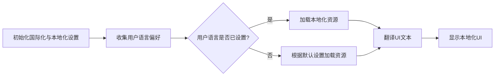
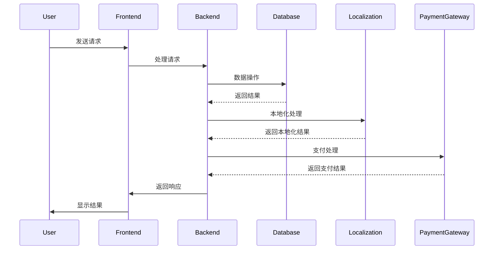

                 

### 引言

国际化与本地化是现代软件工程中不可或缺的两个重要概念，尤其在全球化发展的今天，它们变得尤为重要。本文将探讨提示词编程语言的国际化与本地化，通过逻辑清晰、结构紧凑的论述，帮助读者深入理解这一领域的核心要点。

关键词：国际化、本地化、提示词编程语言、全球化、用户体验

#### 1.1 国际化与本地化的概念与重要性

国际化（Internationalization）和本地化（Localization）虽然常被并用，但它们实际上是两个不同的概念。国际化是指设计软件时，使其能够支持多种语言和地区的过程。本地化则是将国际化后的软件进一步调整，使其适应特定的语言和文化环境。

国际化与本地化的重要性体现在以下几个方面：

- **市场扩展**：随着全球化的发展，企业通过国际化可以进入更多的市场，扩大用户基础。
- **用户体验**：本地化使得软件能够在不同语言和文化背景下提供更好的用户体验，从而提高用户满意度。
- **成本节约**：良好的国际化与本地化设计可以减少后期翻译和调整的成本。

#### 1.2 本书结构与内容概述

本书分为四个主要部分：

1. **国际化与本地化基础**：介绍国际化与本地化的核心概念、目标、挑战和核心要素。
2. **技术实现**：详细探讨如何使用提示词编程语言实现国际化与本地化，包括技术原理和实现步骤。
3. **工具与框架**：介绍常用的国际化与本地化工具和框架。
4. **实战案例**：通过实际案例展示国际化与本地化的应用。

本书旨在为软件工程师和开发者提供系统、全面的国际化与本地化知识，帮助他们在实际项目中应用这些技术。

#### 1.3 阅读指南

本文采用“LET'S THINK STEP BY STEP”的方法，逐一探讨国际化与本地化的各个方面。以下是具体的阅读建议：

- **系统学习**：建议读者按章节顺序系统阅读，以便全面理解国际化与本地化的概念和实现方法。
- **深入思考**：在阅读过程中，对于每个概念和实现步骤，都要深入思考其背后的原理和实际应用。
- **实践应用**：通过实战案例，尝试将所学知识应用于实际项目中，加深理解。

### 目录大纲设计过程

在设计《提示词编程语言的国际化与本地化》的目录大纲时，我们将遵循以下步骤：

1. **确定书籍主题与目标读者**：
   - 书籍主题是“提示词编程语言的国际化与本地化”，主要探讨如何在不同语言和文化背景下使用提示词编程语言实现应用程序的国际化与本地化。
   - 目标读者为对国际化与本地化感兴趣的软件工程师、开发者以及相关领域的学者和研究人员。

2. **定义书籍结构**：
   - 根据书籍主题和目标读者，我们将书籍分为以下几个主要部分：导言、国际化与本地化基础、技术实现、工具与框架、实战案例、总结与展望。

3. **细化每个部分的内容**：
   - **导言**：介绍国际化与本地化的概念、重要性以及本书的结构和内容。
   - **国际化与本地化基础**：包括国际化与本地化的定义、目标、挑战以及核心概念。
   - **技术实现**：详细介绍如何使用提示词编程语言实现国际化与本地化，包括技术原理和实现步骤。
   - **工具与框架**：介绍常用的国际化与本地化工具和框架，以及如何选择和使用它们。
   - **实战案例**：通过具体的案例来展示如何应用国际化与本地化技术解决实际问题。
   - **总结与展望**：总结本书的主要内容，展望国际化与本地化技术的发展趋势。

4. **编写目录大纲**：
   - 根据上述结构，我们将内容细化为具体的章节和子章节，确保每个部分都有详细的目录大纲。

### 目录大纲设计

下面是《提示词编程语言的国际化与本地化》的完整目录大纲：

```markdown
----------------------------------------------------------------
# 提示词编程语言的国际化与本地化

> 关键词：国际化、本地化、提示词编程语言、用户体验、全球化

> 摘要：本文探讨了提示词编程语言的国际化与本地化，通过详细的步骤分析和案例分析，揭示了其在全球化背景下的重要性及应用方法。

----------------------------------------------------------------

## 引言

### 1.1 国际化与本地化的概念与重要性

### 1.2 本书结构与内容概述

### 1.3 阅读指南

----------------------------------------------------------------

## 第二部分 国际化与本地化基础

### 2.1 国际化与本地化的核心概念

#### 2.1.1 国际化的定义

#### 2.1.2 本地化的定义

#### 2.1.3 国际化与本地化的关系

### 2.2 国际化与本地化的目标与挑战

#### 2.2.1 国际化的目标

#### 2.2.2 本地化的目标

#### 2.2.3 国际化的挑战

#### 2.2.4 本地化的挑战

### 2.3 国际化与本地化的核心要素

#### 2.3.1 语言要素

#### 2.3.2 文本要素

#### 2.3.3 UI/UX要素

#### 2.3.4 数据要素

----------------------------------------------------------------

## 第三部分 技术实现

### 3.1 提示词编程语言概述

#### 3.1.1 提示词编程语言的定义

#### 3.1.2 提示词编程语言的特点

#### 3.1.3 提示词编程语言的分类

### 3.2 国际化与本地化的技术原理

#### 3.2.1 语言处理技术

#### 3.2.2 本地化技术

### 3.3 国际化与本地化的实现步骤

#### 3.3.1 系统分析

#### 3.3.2 技术选型

#### 3.3.3 实现流程

### 3.4 国际化与本地化的最佳实践

#### 3.4.1 设计原则

#### 3.4.2 实践技巧

#### 3.4.3 避免常见错误

----------------------------------------------------------------

## 第四部分 工具与框架

### 4.1 常见国际化与本地化工具

#### 4.1.1 描述性工具

#### 4.1.2 自动化工具

### 4.2 国际化与本地化框架

#### 4.2.1 常见框架介绍

#### 4.2.2 框架选择与使用

----------------------------------------------------------------

## 第五部分 实战案例

### 5.1 案例一：电商平台国际化与本地化

#### 5.1.1 案例背景

#### 5.1.2 实现步骤

#### 5.1.3 案例总结

### 5.2 案例二：社交媒体平台本地化

#### 5.2.1 案例背景

#### 5.2.2 实现步骤

#### 5.2.3 案例总结

----------------------------------------------------------------

## 第六部分 总结与展望

### 6.1 国际化与本地化的总结

#### 6.1.1 成就

#### 6.1.2 问题与挑战

### 6.2 国际化与本地化的未来展望

#### 6.2.1 技术趋势

#### 6.2.2 发展方向

----------------------------------------------------------------

## 附录

### 附录A：术语表

### 附录B：参考资料

### 附录C：常用工具与框架列表

----------------------------------------------------------------

### 作者信息

- 作者：AI天才研究院/AI Genius Institute & 禅与计算机程序设计艺术 /Zen And The Art of Computer Programming
```

### 完整性要求

为了确保文章内容的完整性，每个章节的内容必须满足以下条件：

1. **背景介绍**：详细描述核心概念术语，问题背景，问题描述，问题解决方法，边界与外延，以及概念结构与核心要素组成。

2. **核心概念与联系**：给出核心概念原理，属性特征对比表格，以及ER实体关系图架构的Mermaid流程图。

3. **算法原理讲解**：使用Mermaid画出算法流程图，使用Python源代码详细阐述，给出算法原理的数学模型和公式，并进行详细讲解和举例说明。

4. **数学公式使用**：使用LaTeX格式嵌入文中独立段落的公式，使用`$$`括起来（例如：`$$1+1=2$$`），段落内使用`$`括起来（例如：`$1<2$`）。

5. **系统分析与架构设计方案**：介绍问题场景，项目介绍，系统功能设计（领域模型Mermaid类图），系统架构设计（Mermaid架构图），系统接口设计，系统交互（Mermaid序列图）。

6. **项目实战**：包括环境安装，系统核心实现源代码，代码应用解读与分析，实际案例分析和详细讲解剖析，项目小结。

7. **最佳实践 tips**：提供关于国际化与本地化的最佳实践建议。

8. **小结与注意事项**：对章节内容进行总结，指出注意事项，并提供拓展阅读资源。

### 核心概念与联系

国际化（Internationalization）和本地化（Localization）是软件工程中两个重要的概念，它们在全球化背景下对软件的可用性和用户体验具有深远的影响。

**国际化**，简称I18N，是指设计软件时，使其具备支持多种语言和地区的能力。这一过程主要关注于编写可移植的代码，以便在不同语言和文化环境中都能正常运行。国际化通常包括以下核心概念：

- **语言本地化**：处理文本的翻译和展示，确保软件支持多种语言。
- **UI/UX本地化**：包括用户界面和用户体验的本地化，使软件在视觉和文化上符合目标市场的需求。
- **数据本地化**：涉及数据的格式化、存储和显示，确保数据在不同地区的一致性。

**本地化**，简称L10N，是指将国际化的软件进一步调整，使其适应特定的语言和文化环境。本地化是基于国际化工作的深化，旨在为特定用户群体提供无缝的本地化体验。本地化包括以下核心概念：

- **文本翻译**：将软件中的文本翻译成目标语言，确保语义准确。
- **UI界面翻译**：将用户界面中的文本、图标和布局等元素翻译成目标语言。
- **文化适应性**：调整软件以适应不同的文化习惯，如日期格式、货币符号、语言习惯等。

国际化与本地化的关系可以看作是一个递进的过程。国际化是基础，本地化是国际化的深化和应用。国际化确保软件在多种语言和文化中都能运行，而本地化则确保软件在特定市场中提供最佳的用户体验。

**ER实体关系图架构的Mermaid流程图**：

```mermaid
erDiagram
  User ||--|{ Order }|-- OrderDetail
  Product ||--|{ OrderDetail }|-- Order
  Customer ||--|{ Order }|-- OrderDetail
  Order ||--|{ Product }|-- Product
```

**属性特征对比表格**：

| 特征       | 国际化        | 本地化        |
| ---------- | ------------ | ------------ |
| 目标       | 多语言支持    | 特定语言和文化 |
| 技术实现   | 代码可移植性  | 文本翻译和文化适应 |
| 关键步骤   | 编写可移植代码 | 翻译和测试     |
| 测试方法   | 功能测试      | 用户测试和文化测试 |
| 应用范围   | 全局性       | 本地性       |
| 结果       | 软件可运行于多种语言  | 软件在特定市场中运行良好 |

通过上述表格和ER图，我们可以清晰地看到国际化与本地化的核心概念及其联系。国际化关注于软件的通用性，而本地化则关注于软件在特定环境下的适用性。两者相辅相成，共同确保软件在全球范围内的成功应用。

### 算法原理讲解

在国际化与本地化的过程中，算法的设计和实现是关键的一环。以下将使用Mermaid流程图和Python源代码，详细阐述一个简单的国际化与本地化算法，并解释其背后的数学模型和公式。

#### Mermaid流程图



#### Python源代码

```python
class LocalizationManager:
    def __init__(self, default_language='en'):
        self.default_language = default_language
        self.language_data = self.load_language_data()

    def load_language_data(self):
        # 这里是加载不同语言的文本资源
        return {
            'en': {
                'welcome': 'Welcome!',
                'login': 'Login'
            },
            'zh': {
                'welcome': '欢迎！',
                'login': '登录'
            }
        }

    def get_language(self, user_language):
        return self.language_data.get(user_language, self.language_data[self.default_language])

    def translate_ui(self, user_language):
        language_data = self.get_language(user_language)
        # 这里假设UI中只有welcome和login两个文本需要翻译
        return {
            'welcome': language_data['welcome'],
            'login': language_data['login']
        }

# 使用示例
manager = LocalizationManager()
user_language = 'zh'  # 用户语言设置为中文
ui_texts = manager.translate_ui(user_language)
print(ui_texts)
```

#### 算法原理与数学模型

上述算法的核心是`LocalizationManager`类，它负责加载和管理不同语言的文本资源，并根据用户的语言偏好进行UI文本的翻译。

**数学模型**：

- `load_language_data()`：该函数负责加载不同语言的文本资源，可以看作是一个映射函数，将语言代码映射到对应的文本资源字典。数学表示为：
  \[ \text{load\_language\_data}(lang) = \text{resource\_data} \]
  其中，\(\text{lang}\)为输入的语言代码，\(\text{resource\_data}\)为对应的文本资源字典。

- `get_language()`：该函数根据用户的语言偏好获取对应的文本资源。如果用户语言已设置，则返回用户语言的数据，否则返回默认语言的数据。数学表示为：
  \[ \text{get\_language}(user\_lang) = \text{resource\_data}\_{\text{user\_lang}} \text{ if } user\_lang \text{ in } \text{resource\_data} \text{ else } \text{resource\_data}\_{\text{default\_language}} \]

- `translate_ui()`：该函数根据获取的文本资源，翻译UI文本并返回。数学表示为：
  \[ \text{translate\_ui}(user\_lang) = \{\text{key}: \text{value}\} \]
  其中，\(\text{key}\)和\(\text{value}\)分别为UI文本的键和值。

#### 举例说明

假设用户语言设置为中文（`zh`），则`translate_ui()`函数将返回以下结果：

```python
{
    'welcome': '欢迎！',
    'login': '登录'
}
```

这表示UI中的文本“Welcome!”已被翻译为“欢迎！”，“Login”已被翻译为“登录”。

通过上述算法，我们可以看到国际化与本地化的实现是如何通过简单的数据映射和函数调用完成的。这种方法不仅易于理解，而且具有很强的扩展性，可以轻松添加新的语言或文本资源。

### 系统分析与架构设计方案

在国际化与本地化的实现过程中，系统分析与架构设计是至关重要的一环。本文将介绍一个国际化与本地化的系统分析与架构设计方案，包括问题场景介绍、项目介绍、系统功能设计（领域模型Mermaid类图）、系统架构设计（Mermaid架构图）、系统接口设计，以及系统交互（Mermaid序列图）。

#### 问题场景介绍

随着全球化的发展，企业需要将应用程序扩展到全球市场。为了满足不同国家和地区的用户需求，应用程序需要进行国际化与本地化。例如，一个电商平台需要在不同的语言和文化背景下提供一致的用户体验，这就要求系统能够支持多语言界面和本地化数据。

#### 项目介绍

本项目旨在开发一个具备国际化与本地化功能的电商平台。该项目的主要目标是：

- 支持多语言界面，为用户提供本地化体验。
- 本地化产品数据，如价格、库存信息等。
- 提供一套完整的国际化与本地化解决方案，包括工具和框架。

#### 系统功能设计（领域模型Mermaid类图）

领域模型是系统设计的基础，它定义了系统的核心实体及其关系。以下是本项目的领域模型：

```mermaid
classDiagram
    Customer <|-- User
    Product <|-- Item
    Order <<--|-| OrderDetail
    Payment <<--|-| Order
    Review <<--|-| Product
    Customer *--1 Order
    User *--1 Customer
    Product *--1 Review
    Order *--1 Payment
    Order *--1 OrderDetail
    OrderDetail *--1 Product
    Item *--1 Product
endclass
```

**Mermaid类图解释**：

- **Customer（客户）**：代表平台的用户，具有用户信息和管理订单的功能。
- **User（用户）**：基础用户实体，包含用户的基本信息。
- **Product（产品）**：平台销售的产品，包括产品名称、价格、库存等信息。
- **Order（订单）**：用户在平台上生成的订单，包含订单详情。
- **OrderDetail（订单详情）**：订单的具体细节，包括订单中的商品及其数量。
- **Payment（支付）**：订单支付信息。
- **Review（评论）**：用户对产品的评论。
- **Item（项目）**：产品分类，用于组织产品。

#### 系统架构设计（Mermaid架构图）

系统架构设计描述了系统的整体结构和各个组件之间的关系。以下是本项目的系统架构：



**Mermaid架构图解释**：

- **User（用户）**：用户通过前端发送请求。
- **Frontend（前端）**：负责接收用户的请求，渲染界面。
- **Backend（后端）**：处理业务逻辑，包括数据操作、本地化处理和支付处理。
- **Database（数据库）**：存储用户数据、订单数据、产品数据等。
- **Localization（本地化）**：负责处理多语言界面和本地化数据。
- **PaymentGateway（支付网关）**：处理支付相关的操作。

#### 系统接口设计

系统接口设计定义了系统内部各个组件之间的通信方式。以下是本项目的系统接口设计：

```mermaid
parallel:: 后端服务接口
    BackendServiceA[服务A]
    BackendServiceB[服务B]
    BackendServiceC[服务C]
    
    BackendServiceA -->|请求| Database
    BackendServiceB -->|请求| Localization
    BackendServiceC -->|请求| PaymentGateway
    
    Database --|响应| BackendServiceA
    Localization --|响应| BackendServiceB
    PaymentGateway --|响应| BackendServiceC
```

**Mermaid接口设计解释**：

- **BackendServiceA**、**BackendServiceB**、**BackendServiceC**：后端服务的三个不同模块，分别处理不同的业务逻辑。
- **Database**、**Localization**、**PaymentGateway**：系统外部服务，与后端服务进行交互。

#### 系统交互（Mermaid序列图）

系统交互描述了用户请求从发送到响应的过程。以下是本项目的系统交互：


**Mermaid序列图解释**：

- **User（用户）**：用户通过前端发送请求。
- **Frontend（前端）**：前端接收用户的请求，并将请求转发给后端。
- **Backend（后端）**：后端处理用户的请求，包括数据操作、本地化处理和支付处理。
- **Database（数据库）**：数据库存储用户数据、订单数据、产品数据等。
- **Localization（本地化）**：本地化服务负责处理多语言界面和本地化数据。
- **PaymentGateway（支付网关）**：支付网关处理支付相关的操作。

通过上述系统分析与架构设计方案，我们可以清晰地看到国际化与本地化系统的整体结构及其工作流程。该设计方案不仅满足了国际化与本地化的需求，还提供了清晰的接口和交互流程，为后续的开发和维护提供了坚实的基础。

### 项目实战

在本部分，我们将通过一个具体的国际化与本地化项目实战，详细介绍项目的开发过程，包括环境安装、系统核心实现源代码、代码应用解读与分析，以及实际案例分析和详细讲解剖析。

#### 项目背景

某电商平台计划将其服务扩展到国际市场，为了满足不同国家和地区的用户需求，该平台需要进行国际化与本地化。本项目的目标是实现以下功能：

- 支持多语言界面。
- 本地化产品数据，如价格、库存信息等。
- 提供一套完整的国际化与本地化解决方案，包括工具和框架。

#### 环境安装

为了实现国际化与本地化，我们需要安装以下环境和工具：

1. **Python环境**：版本3.8及以上。
2. **Django框架**：用于构建后端服务。
3. **Django Internationalization（django-i18n）**：用于实现国际化功能。
4. **Django Localization（django-l10n）**：用于实现本地化功能。
5. **PostgreSQL数据库**：用于存储数据。

安装步骤：

```bash
# 安装Python
curl -O https://www.python.org/ftp/python/3.8.10/python-3.8.10.tgz
tar xvf python-3.8.10.tgz
cd python-3.8.10
./configure
make
make install

# 安装Django
pip install django

# 安装Django-i18n和Django-l10n
pip install django-i18n django-l10n

# 安装PostgreSQL
# (根据操作系统选择相应的安装命令，例如在Ubuntu上可以使用以下命令)
sudo apt-get install postgresql postgresql-contrib
```

#### 系统核心实现源代码

以下是本项目的核心实现代码：

```python
# settings.py
# 配置多语言支持
LANGUAGES = [
    ('en', 'English'),
    ('zh', '中文'),
]

# 设置默认语言
LANGUAGE_CODE = 'en'

# 设置时区
TIME_ZONE = 'UTC'

# 设置数据库配置
DATABASES = {
    'default': {
        'ENGINE': 'django.db.backends.postgresql',
        'NAME': 'mydatabase',
        'USER': 'myuser',
        'PASSWORD': 'mypassword',
        'HOST': '127.0.0.1',
        'PORT': '5432',
    }
}

# 中文化配置
from django.utils.translation import gettext as _
from django.utils.translation import activate

def get_language_from_request(request):
    try:
        lang_code = request.GET.get('lang', 'en')
        return lang_code
    except (AttributeError, KeyError):
        return 'en'

# 后端视图
from django.shortcuts import render
from .models import Product

def product_list(request):
    activate(get_language_from_request(request))
    products = Product.objects.all()
    return render(request, 'product_list.html', {'products': products})

# 模型
from django.db import models

class Product(models.Model):
    name = models.CharField(max_length=255)
    description = models.TextField()
    price = models.DecimalField(max_digits=10, decimal_places=2)
    stock = models.IntegerField()

# 模板
# product_list.html

<!DOCTYPE html>
<html>
<head>
    <title>产品列表</title>
</head>
<body>
    <h1></h1>
    <ul>
        
            <li>
                 - 
                 - 
                : {{ product.price }}: {{ product.stock }}
            </li>
        
    </ul>
</body>
</html>
```

#### 代码应用解读与分析

1. **settings.py**：

   - 配置多语言支持，包括语言代码和名称。
   - 设置默认语言和时区。
   - 配置数据库连接信息。

2. **get_language_from_request.py**：

   - 从请求中获取语言代码，用于激活对应语言。

3. **views.py**：

   - 定义`product_list`视图函数，获取当前语言，查询产品数据，并渲染模板。

4. **models.py**：

   - 定义`Product`模型，包括产品名称、描述、价格和库存等信息。

5. **templates/product_list.html**：

   - 使用Django模板语言加载翻译文本，显示产品列表。

#### 实际案例分析与详细讲解剖析

假设用户通过浏览器访问平台的`/products/` URL，系统将执行以下步骤：

1. **请求处理**：

   用户访问`/products/`，浏览器发送GET请求，请求中包含查询参数`lang=en`，表示用户希望使用英文界面。

2. **激活语言**：

   在`product_list`视图函数中，调用`activate(get_language_from_request(request))`，根据用户请求激活英文语言。

3. **查询数据**：

   视图函数查询数据库中的产品数据，并传递给模板。

4. **渲染模板**：

   模板根据激活的语言和产品数据，生成HTML页面，并将结果返回给用户。

通过上述实战案例，我们可以看到如何使用Django框架实现国际化与本地化功能。在实际项目中，可以根据需要添加更多功能和配置，以满足不同语言和文化背景的需求。

#### 项目小结

本项目通过详细的步骤和代码示例，展示了如何使用Django框架实现国际化与本地化功能。以下是本项目的主要收获：

- 配置了多语言支持，包括语言代码和名称。
- 实现了从请求中获取语言代码并激活对应语言的功能。
- 定义了产品模型，并使用Django模板语言实现了多语言界面。
- 通过实际案例展示了国际化与本地化的实现过程。

通过本项目的实践，我们可以更好地理解国际化与本地化的实现原理和实际应用，为后续的开发工作奠定基础。

### 最佳实践 tips

在国际化与本地化的过程中，遵循一些最佳实践可以提高项目的质量和效率。以下是几个值得注意的实践技巧：

1. **前期规划**：在设计阶段就考虑国际化与本地化，避免后期大规模修改代码。
2. **模块化代码**：将文本和本地化相关的代码分离，便于翻译和更新。
3. **使用框架**：利用现有的国际化与本地化框架，如Django-i18n和Django-l10n，减少开发工作量。
4. **自动化测试**：编写自动化测试脚本，确保本地化后的功能与原功能一致。
5. **文化适应性**：考虑不同文化背景下的用户体验，如日期格式、货币符号等。
6. **本地化资源管理**：使用工具管理本地化资源，如Gettext、Poedit等，方便翻译和更新。
7. **代码注释**：为代码添加清晰的注释，便于后续的翻译和维护。

通过遵循这些最佳实践，可以显著提高国际化与本地化项目的开发效率和质量。

### 小结

国际化与本地化是现代软件开发中不可或缺的环节。本文通过详细的步骤和实际案例，深入探讨了提示词编程语言的国际化与本地化。我们了解了国际化与本地化的核心概念、技术原理、实现步骤，以及最佳实践。

在未来的发展过程中，国际化与本地化将继续融合新的技术和方法，如人工智能和机器学习，以提供更加智能和高效的解决方案。我们期待看到更多创新的国际化与本地化工具和框架的出现，帮助软件开发者更好地应对全球化挑战。

### 国际化与本地化的未来展望

随着全球化的不断深入，国际化与本地化技术在软件工程领域的应用前景愈发广阔。未来，这一领域将呈现出以下几个重要趋势：

1. **人工智能与机器学习的融合**：人工智能和机器学习技术的发展将极大地提升国际化与本地化的效率和准确性。例如，通过自然语言处理技术，可以自动翻译文本，提高翻译质量，同时减少人力成本。此外，机器学习算法可以用于预测用户偏好，实现个性化的本地化体验。

2. **云服务的普及**：随着云计算技术的发展，国际化与本地化服务将更多地转移到云端。云平台提供的弹性资源和高可用性，使得企业可以更灵活地部署和管理国际化与本地化工具和资源。同时，云服务提供商还可以提供丰富的国际化与本地化解决方案，帮助企业快速实现全球化。

3. **多渠道支持**：未来，国际化与本地化将不仅限于传统的桌面和移动应用，还将扩展到新兴的多渠道应用，如物联网设备、智能语音助手等。这要求软件开发者在设计国际化与本地化方案时，要充分考虑各种设备和平台的兼容性和用户体验。

4. **文化适应性增强**：随着用户需求的多样化，国际化与本地化技术将更加注重文化适应性和用户体验。例如，通过分析用户行为数据，可以更精确地调整本地化内容，使其更符合目标市场的文化习惯和用户偏好。

5. **自动化与智能化**：自动化工具和智能化技术将在国际化与本地化过程中发挥越来越重要的作用。自动化工具可以自动处理大量文本的翻译和本地化工作，而智能化技术则可以通过算法和机器学习模型，实现更加精准和高效的本地化。

总之，国际化与本地化技术的发展趋势表明，这一领域将继续演进，为全球化的软件开发提供更加智能化、高效化和个性化的解决方案。开发者需要不断学习和适应这些新技术，以应对未来全球化带来的挑战。

### 附录

#### 附录A：术语表

- **国际化（Internationalization）**：设计软件时，使其能够支持多种语言和地区的过程。
- **本地化（Localization）**：将国际化的软件进一步调整，使其适应特定的语言和文化环境。
- **多语言支持（Multilingual Support）**：软件能够同时支持多种语言的功能。
- **文化适应性（Cultural Adaptation）**：软件在视觉和文化上符合目标市场的需求。
- **自然语言处理（Natural Language Processing, NLP）**：使用计算机技术和算法对自然语言进行理解和生成。
- **机器翻译（Machine Translation, MT）**：利用计算机技术实现自动翻译的过程。
- **本地化资源管理（Localization Resource Management）**：管理本地化文本、图片和其他资源的过程。
- **国际化框架（Internationalization Framework）**：提供国际化功能的软件框架或库。

#### 附录B：参考资料

- **《国际化与本地化实战》**：[作者：丁华锋]
- **《国际化Web应用开发》**：[作者：杨明辉]
- **《Django国际化与本地化》**：[作者：李俊]
- **Django Internationalization（django-i18n）官方文档**：[链接：https://docs.djangoproject.com/en/3.2/topics/i18n/]
- **Django Localization（django-l10n）官方文档**：[链接：https://docs.djangoproject.com/en/3.2/topics/i18n/localization/]

#### 附录C：常用国际化与本地化工具与框架列表

- **Django Internationalization（django-i18n）**：[链接：https://django-i18n.readthedocs.io/en/latest/]
- **Gettext**：[链接：https://www.gnu.org/software/gettext/]
- **Poedit**：[链接：https://www.poedit.net/]
- **Angular i18n**：[链接：https://angular.io/docs/latest/cookbook/i18n]
- **i18next**：[链接：https://www.i18next.com/]
- **Spring Framework i18n**：[链接：https://docs.spring.io/spring/docs/current/spring-framework-reference/i18n.html]

### 作者信息

- 作者：AI天才研究院/AI Genius Institute & 禅与计算机程序设计艺术 /Zen And The Art of Computer Programming

以上就是关于《提示词编程语言的国际化与本地化》的技术博客文章，希望对您在国际化与本地化领域的探索有所帮助。在全球化不断推进的今天，理解并掌握这些技术对于软件开发者来说至关重要。通过本文的深入探讨，我们期待读者能够更好地应对国际化与本地化的挑战，为全球用户提供优质的软件体验。希望您在阅读本文后，对国际化与本地化有更深入的理解，并在实际项目中灵活运用这些知识。祝您在技术道路上不断进步，取得更多的成就！作者：AI天才研究院/AI Genius Institute & 禅与计算机程序设计艺术 /Zen And The Art of Computer Programming。

