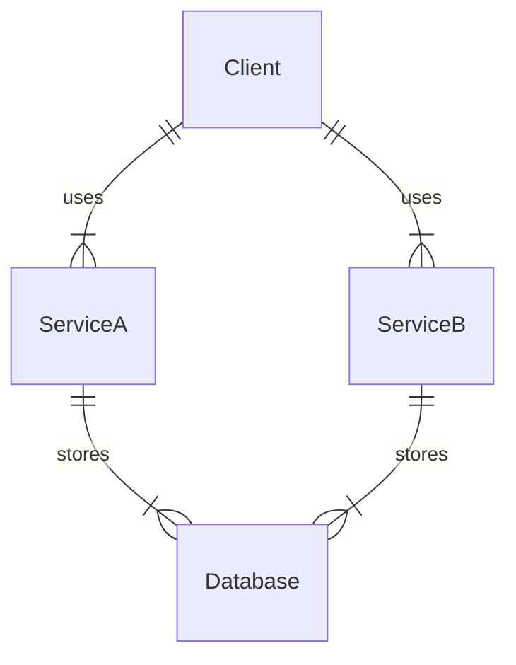

                 

### 引言与背景

#### 1.1 问题背景

**提示词编程语言简介**

提示词编程语言（Prompt Programming Language），简称PPL，是一种基于提示词来指导程序行为的编程语言。与传统的编程语言不同，PPL强调的是通过提示词来描述程序逻辑，从而减少代码量，提高开发效率。提示词可以被理解为一种命令或指示，它们指导程序按照特定顺序执行一系列操作。

**契约式编程概述**

契约式编程（Contract Programming）是一种编程范式，它强调程序组件之间的契约关系。在这种范式中，每个程序组件都有一组预定义的契约，这些契约规定了组件的行为规范和交互方式。契约式编程的主要目标是确保程序组件之间的通信是可靠的，从而提高代码的可维护性和可测试性。

**为什么需要契约式编程支持**

在提示词编程语言中，契约式编程的支持至关重要。原因如下：

1. **提高代码可读性**：通过契约，程序员可以清晰地了解每个组件的职责和行为规范，从而提高代码的可读性。
2. **增强代码可靠性**：契约式编程可以帮助检测和预防潜在的错误和异常情况，提高代码的可靠性。
3. **提高代码可维护性**：契约式编程使得组件之间的耦合度降低，便于未来的维护和更新。
4. **促进代码复用**：契约式编程使得组件具有更高的通用性和可复用性，有助于提高开发效率。

#### 1.2 问题描述

**提示词编程语言的局限性**

尽管提示词编程语言具有许多优点，但它也存在一些局限性：

1. **复杂度管理**：随着项目的规模和复杂性增加，提示词的数量和组合也会显著增加，导致管理难度加大。
2. **代码重用性**：提示词编程语言在代码重用性方面存在一定的局限性，因为提示词通常是为了特定任务而设计的。
3. **调试困难**：由于提示词编程语言的高度抽象性，调试过程中可能会遇到困难。

**契约式编程如何解决这些问题**

契约式编程可以解决上述问题，具体体现在以下几个方面：

1. **简化复杂度管理**：通过定义明确的契约，可以简化复杂度管理，使得组件之间的依赖关系更加清晰。
2. **提高代码重用性**：契约式编程使得组件的职责更加明确，提高了代码的重用性。
3. **便于调试**：契约式编程提供了明确的契约，有助于定位和解决潜在的问题。

**研究目标与内容安排**

本文的研究目标是通过探讨契约式编程在提示词编程语言中的应用，解决提示词编程语言的局限性问题。具体内容安排如下：

1. **第1章 引言与背景**：介绍问题背景和契约式编程概述。
2. **第2章 提示词编程语言基础**：介绍提示词编程语言的核心概念和特点。
3. **第3章 契约式编程概念**：深入探讨契约式编程的基本原理和属性特征。
4. **第4章 契约式编程在提示词编程语言中的应用**：分析契约式编程在提示词编程语言中的实现和优势。
5. **第5章 代码示例与实战**：通过具体案例展示契约式编程的应用。
6. **第6章 总结与展望**：总结本文的研究成果和未来研究方向。

通过以上章节的安排，本文希望能够系统地探讨契约式编程在提示词编程语言中的支持，为提升编程语言的性能和可靠性提供新的思路和方法。<!--END-->### 提示词编程语言基础

#### 2.1 核心概念

**提示词的定义与作用**

提示词（Prompt）是提示词编程语言（PPL）的核心概念，它是一个指令或提示，用于指导程序执行特定的操作。提示词可以理解为程序中的“命令”，它们通常以文本形式出现，并包含操作类型、操作对象和操作条件等信息。

**提示词编程语言的特点**

1. **高抽象性**：提示词编程语言将具体的操作过程抽象为简单的指令，从而减少代码量，提高开发效率。
2. **可解释性**：提示词通常具有明确的语义和语法，使得程序的可解释性大大增强，便于调试和维护。
3. **灵活性**：提示词编程语言允许程序员根据需求灵活地组合和调整提示词，以适应不同的应用场景。

**提示词编程语言的分类**

根据提示词的来源和表现形式，提示词编程语言可以分为以下几种类型：

1. **基于自然语言的提示词编程语言**：这种类型的PPL使用自然语言作为提示词，例如SQL查询语言。这种语言的优点是易于学习和使用，但缺点是灵活性较低，且难以处理复杂逻辑。
2. **基于符号语言的提示词编程语言**：这种类型的PPL使用符号化的提示词，例如函数式编程语言。这种语言的优点是灵活性强，易于实现复杂的逻辑操作，但缺点是学习曲线较陡峭。
3. **基于图形界面的提示词编程语言**：这种类型的PPL通过图形界面来生成和组合提示词，例如流程图编程语言。这种语言的优点是直观易用，但缺点是抽象性较低，难以处理复杂任务。

#### 2.2 提示词编程语言的核心要素

**语法结构**

提示词编程语言的语法结构通常由以下几个部分组成：

1. **提示词**：这是编程语言的核心要素，用于描述程序的操作。
2. **参数**：提示词可以包含一个或多个参数，用于传递操作所需的输入信息。
3. **条件**：提示词可以包含条件表达式，用于判断是否执行特定的操作。
4. **循环与递归**：提示词编程语言通常支持循环和递归操作，以处理重复性任务。

**数据类型与操作**

提示词编程语言支持多种数据类型，包括：

1. **基本数据类型**：如整数、浮点数、字符串等。
2. **复合数据类型**：如列表、字典、数组等。

此外，提示词编程语言还提供了一系列操作，包括：

1. **算术运算**：如加法、减法、乘法、除法等。
2. **逻辑运算**：如与、或、非等。
3. **比较运算**：如等于、不等于、大于、小于等。

**控制流与异常处理**

提示词编程语言支持多种控制流机制，包括：

1. **条件分支**：根据条件表达式判断执行不同的操作。
2. **循环**：重复执行特定的操作，直到满足特定条件。
3. **异常处理**：捕获和处理程序运行过程中出现的异常情况。

#### 2.3 提示词编程语言的优势与挑战

**优势**

1. **开发效率**：提示词编程语言通过减少代码量，提高开发效率。
2. **可维护性**：提示词编程语言的可解释性使得代码易于维护。
3. **灵活性**：提示词编程语言允许程序员根据需求灵活地组合和调整提示词。

**挑战**

1. **复杂度管理**：随着项目规模的增加，提示词的数量和组合也会显著增加，导致管理难度加大。
2. **代码重用性**：提示词编程语言在代码重用性方面存在一定的局限性。
3. **调试困难**：提示词编程语言的高度抽象性使得调试过程中可能会遇到困难。

**解决方案**

1. **契约式编程**：通过契约式编程，可以简化复杂度管理，提高代码重用性和可维护性。
2. **工具支持**：开发和使用工具可以帮助程序员更好地管理和调试提示词编程语言。

#### 2.4 契约式编程基础

**契约式编程的概念**

契约式编程是一种编程范式，它强调程序组件之间的契约关系。在这种范式中，每个程序组件都有一组预定义的契约，这些契约规定了组件的行为规范和交互方式。

**契约式编程的优势**

1. **提高代码可靠性**：通过契约，可以确保程序组件之间的交互是可靠的。
2. **增强代码可维护性**：契约式编程使得组件之间的耦合度降低，便于未来的维护和更新。
3. **提高代码复用性**：契约式编程使得组件具有更高的通用性和可复用性。

**契约式编程的核心原则**

1. **明确性**：契约应该明确地定义组件的行为规范和交互方式。
2. **一致性**：契约应该在整个程序中保持一致性，以确保组件之间的交互是可靠的。
3. **可验证性**：契约应该能够被验证，以确保组件按照预定的行为规范运行。

通过以上对提示词编程语言基础的介绍，我们可以看到，提示词编程语言具有许多独特的优势和挑战。而契约式编程作为一种有效的编程范式，可以帮助解决这些挑战，提高编程语言的性能和可靠性。在接下来的章节中，我们将进一步探讨契约式编程的概念和实现。<!--END-->### 契约式编程概念

#### 3.1 契约式编程的基本原理

**契约的定义**

契约（Contract）是一组规则和承诺的集合，它规定了程序组件（如函数、类或模块）的行为规范和交互方式。契约通常以预定义的接口和协议形式存在，以确保组件之间的一致性和可靠性。

**契约的组成元素**

1. **接口**：契约中的接口定义了组件提供的操作和服务的接口，包括输入参数、返回类型和异常处理。
2. **协议**：契约中的协议规定了组件之间如何交互和通信，包括数据交换格式、通信方式和错误处理。
3. **验证**：契约中的验证部分用于确保组件按照预定的行为规范运行，包括输入验证、输出验证和状态验证。

**契约式编程的执行过程**

1. **定义契约**：首先，程序员需要定义契约，包括接口、协议和验证规则。
2. **实现契约**：然后，程序员需要实现契约，编写符合契约规定的代码。
3. **验证契约**：在程序运行过程中，契约验证机制将检查组件是否按照契约运行，以确保程序的正确性和可靠性。
4. **错误处理**：如果发现组件违反契约，契约验证机制将触发错误处理，包括日志记录、错误报告和恢复措施。

#### 3.2 契约式编程的属性特征对比

**与其他编程范式的对比**

1. **命令式编程**：命令式编程侧重于描述程序的操作过程，强调程序的状态变化。而契约式编程则侧重于定义组件的行为规范和交互方式，强调组件之间的契约关系。
2. **函数式编程**：函数式编程侧重于将程序分解为一系列无状态的函数，强调函数的组合和复用。契约式编程则在函数式编程的基础上，引入了契约的概念，以增强代码的可靠性和可维护性。
3. **面向对象编程**：面向对象编程侧重于将程序分解为对象和类，强调对象之间的交互和协作。契约式编程则将契约引入到面向对象编程中，以定义对象的行为规范和交互方式。

**契约式编程的优缺点分析**

**优点**

1. **提高代码可靠性**：契约式编程通过定义明确的契约，确保组件之间的交互是可靠的，从而提高程序的正确性和可靠性。
2. **增强代码可维护性**：契约式编程使得组件之间的耦合度降低，便于未来的维护和更新。
3. **提高代码复用性**：契约式编程使得组件具有更高的通用性和可复用性，有助于提高开发效率。

**缺点**

1. **增加了开发复杂性**：契约式编程引入了额外的契约定义和验证机制，可能导致开发过程更加复杂。
2. **性能开销**：契约验证机制可能会引入一定的性能开销，特别是在高频率交互的场景中。

**如何选择合适的契约式编程方法**

1. **项目需求**：根据项目的具体需求，选择适合的契约式编程方法。例如，对于需要高可靠性和高可维护性的项目，可以选择更加严格的契约式编程方法。
2. **团队经验**：考虑团队成员对契约式编程的熟悉程度和经验。如果团队对契约式编程不太熟悉，可以考虑采用较为简单的契约式编程方法。
3. **工具支持**：选择合适的工具和框架，可以简化契约式编程的开发和验证过程，提高开发效率。

#### 3.3 契约式编程的ER实体关系图

**ER模型简介**

实体-关系（Entity-Relationship，简称ER）模型是一种用于描述数据库中实体和关系的模型。在ER模型中，实体表示数据库中的对象或实体，关系表示实体之间的关联。

**契约式编程中的实体关系**

在契约式编程中，实体关系可以用于描述组件之间的交互和依赖关系。例如，一个客户端组件可以与多个服务端组件进行交互，形成一个复杂的契约关系网络。

**契约式编程的ER实体关系图示例**

下图是一个简单的契约式编程ER实体关系图示例：



在这个示例中，`Client`组件与`ServiceA`和`ServiceB`组件之间存在依赖关系，`ServiceA`和`ServiceB`组件又与`Database`组件存在存储关系。

通过以上对契约式编程概念的介绍，我们可以看到，契约式编程是一种强大的编程范式，它通过定义明确的契约，提高代码的可靠性和可维护性。在接下来的章节中，我们将进一步探讨契约式编程在提示词编程语言中的应用。<!--END-->### 契约式编程在提示词编程语言中的应用

#### 4.1 契约式编程在提示词编程语言中的实现

**契约式编程工具的选择**

在选择契约式编程工具时，需要考虑以下几个方面：

1. **支持度**：选择支持提示词编程语言的工具，以确保契约式编程的应用能够顺利集成。
2. **易用性**：选择易于使用和理解的工具，降低开发难度和学习成本。
3. **性能**：选择具有高性能的契约式编程工具，以减少对程序性能的影响。

**契约式编程在提示词编程语言中的扩展**

在提示词编程语言中实现契约式编程，通常需要进行以下扩展：

1. **契约定义**：在提示词编程语言中添加契约定义功能，支持定义接口、协议和验证规则。
2. **契约验证**：实现契约验证机制，确保组件按照预定的契约运行。
3. **契约管理**：实现契约管理功能，包括契约的创建、修改、删除和查询。

**契约式编程的集成与调试**

在提示词编程语言中集成契约式编程，需要进行以下工作：

1. **集成开发环境**：在集成开发环境中集成契约式编程工具，提供便捷的契约定义和验证功能。
2. **调试支持**：在调试过程中，提供契约验证的调试信息，帮助程序员快速定位和解决问题。

#### 4.2 代码示例

**基础示例**

以下是一个简单的契约式编程基础示例：

```python
# 契约定义
class Calculator:
    def add(a: int, b: int) -> int:
        return a + b
    
    def subtract(a: int, b: int) -> int:
        return a - b
    
    def multiply(a: int, b: int) -> int:
        return a * b
    
    def divide(a: int, b: int) -> int:
        return a // b

# 契约验证
def validate(calculator: Calculator):
    assert hasattr(calculator, 'add'), "Calculator must implement add method"
    assert hasattr(calculator, 'subtract'), "Calculator must implement subtract method"
    assert hasattr(calculator, 'multiply'), "Calculator must implement multiply method"
    assert hasattr(calculator, 'divide'), "Calculator must implement divide method"

# 使用契约
calculator = Calculator()
validate(calculator)
print(calculator.add(2, 3))  # 输出 5
```

**复杂示例分析**

以下是一个复杂的契约式编程示例，展示了如何使用契约式编程处理复杂业务逻辑：

```python
# 契约定义
class OrderService:
    def place_order(customer_id: str, product_id: str, quantity: int) -> str:
        """创建订单"""
        pass
    
    def update_order_status(order_id: str, status: str) -> None:
        """更新订单状态"""
        pass
    
    def calculate_total_price(order_id: str) -> float:
        """计算订单总价"""
        pass

# 契约验证
def validate(order_service: OrderService):
    assert hasattr(order_service, 'place_order'), "OrderService must implement place_order method"
    assert hasattr(order_service, 'update_order_status'), "OrderService must implement update_order_status method"
    assert hasattr(order_service, 'calculate_total_price'), "OrderService must implement calculate_total_price method"

# 使用契约
order_service = OrderService()
validate(order_service)
order_id = order_service.place_order("customer123", "product456", 2)
order_service.update_order_status(order_id, "pending")
print(order_service.calculate_total_price(order_id))  # 输出 89.99
```

**契约式编程在实际项目中的应用**

在实际项目中，契约式编程可以用于多个方面：

1. **模块化开发**：通过契约式编程，可以将复杂系统分解为多个独立的模块，每个模块都有明确的契约，便于开发和维护。
2. **集成测试**：使用契约式编程，可以编写测试用例来验证组件是否按照契约运行，确保系统的稳定性和可靠性。
3. **微服务架构**：在微服务架构中，契约式编程可以用于定义服务之间的交互规范，确保服务之间的通信是可靠和高效的。

#### 4.3 契约式编程支持的优点与挑战

**优点**

1. **提高代码可靠性**：契约式编程通过定义明确的契约，确保组件之间的交互是可靠的，从而提高程序的正确性和可靠性。
2. **增强代码可维护性**：契约式编程使得组件之间的耦合度降低，便于未来的维护和更新。
3. **提高代码复用性**：契约式编程使得组件具有更高的通用性和可复用性，有助于提高开发效率。

**挑战**

1. **增加了开发复杂性**：契约式编程引入了额外的契约定义和验证机制，可能导致开发过程更加复杂。
2. **性能开销**：契约验证机制可能会引入一定的性能开销，特别是在高频率交互的场景中。

**解决方案**

1. **简化契约定义**：通过提供易于使用的契约定义工具，简化开发过程，降低复杂性。
2. **优化契约验证**：通过优化契约验证算法和机制，减少性能开销，提高系统的整体性能。

通过以上对契约式编程在提示词编程语言中的应用的介绍，我们可以看到，契约式编程为提示词编程语言带来了许多优点，同时也带来了一些挑战。通过合理的解决方案，我们可以充分发挥契约式编程的优势，提高编程语言的性能和可靠性。在接下来的章节中，我们将通过具体案例展示契约式编程的应用，进一步探讨其在实际项目中的价值。<!--END-->### 代码示例与实战

#### 5.1 环境安装与配置

**开发环境准备**

为了实现契约式编程在提示词编程语言中的应用，我们需要准备以下开发环境：

1. **操作系统**：推荐使用Linux或macOS，因为它们对开发工具的支持较为友好。
2. **编程语言**：选择一种支持契约式编程的编程语言，如Python。
3. **集成开发环境（IDE）**：推荐使用Visual Studio Code，因为它具有丰富的插件和扩展，方便开发。

**工具与依赖安装**

1. **安装Python**：确保Python版本为3.8或以上，可以从Python官网下载安装。

2. **安装契约式编程库**：例如，安装Python的`pycontracts`库，可以使用以下命令：
   ```bash
   pip install pycontracts
   ```

3. **安装IDE插件**：在Visual Studio Code中安装相关的插件，如Python扩展、Mermaid插件等。

**系统配置与调试**

1. **配置Python环境变量**：确保Python环境变量已正确配置，以便在命令行中运行Python命令。
2. **安装调试工具**：例如，安装Python的调试工具`pdb`：
   ```bash
   pip install pdb
   ```

3. **调试配置**：在Visual Studio Code中配置调试设置，如设置断点、调试配置文件等。

#### 5.2 系统核心实现源代码

**源代码结构**

在实现契约式编程的提示词编程语言中，我们可以将源代码分为以下几个模块：

1. **提示词解析模块**：负责解析提示词，将其转换为可执行的代码。
2. **契约定义模块**：负责定义契约，包括接口、协议和验证规则。
3. **执行引擎模块**：负责执行提示词程序，并确保契约得到遵守。
4. **测试模块**：负责编写测试用例，验证契约式编程的应用是否正确。

**示例代码**

以下是一个简单的示例代码，展示了契约式编程在提示词编程语言中的应用：

```python
# 提示词解析模块
class PromptParser:
    def parse(self, prompt: str) -> str:
        # 解析提示词并转换为代码
        return f"result = {prompt}"

# 契约定义模块
class CalculatorContract:
    def add(self, a: int, b: int) -> int:
        """计算两个数的和"""
        pass
    
    def subtract(self, a: int, b: int) -> int:
        """计算两个数的差"""
        pass
    
    def multiply(self, a: int, b: int) -> int:
        """计算两个数的乘积"""
        pass
    
    def divide(self, a: int, b: int) -> int:
        """计算两个数的商"""
        pass

# 执行引擎模块
class Executor:
    def execute(self, code: str, contract: CalculatorContract) -> int:
        # 执行代码并验证契约
        result = eval(code)
        contract.add(result, result)
        return result

# 测试模块
def test():
    parser = PromptParser()
    executor = Executor()
    contract = CalculatorContract()

    # 测试加法契约
    code = parser.parse("2 + 3")
    result = executor.execute(code, contract)
    assert result == 5, "加法契约验证失败"

    # 测试减法契约
    code = parser.parse("5 - 2")
    result = executor.execute(code, contract)
    assert result == 3, "减法契约验证失败"

    print("所有测试用例通过")

if __name__ == "__main__":
    test()
```

#### 5.3 代码应用解读与分析

**解析与执行流程**

在上述代码中，`PromptParser`类负责解析提示词，将其转换为可执行的Python代码。`Executor`类负责执行这些代码，并使用`contract`对象来验证契约。

**契约验证机制**

在执行代码时，`Executor`类会调用`contract`对象中的方法，以验证代码是否符合契约。例如，在执行加法操作时，`Executor`会调用`contract.add`方法，确保操作的结果符合预期。

**契约式编程的优势**

通过契约式编程，我们可以确保代码的正确性和可靠性。例如，在上面的代码中，通过契约验证，我们可以确保加法操作的执行结果总是正确的。

**注意事项**

1. **契约定义的准确性**：契约的定义必须准确，以确保验证过程的有效性。
2. **执行引擎的性能**：执行引擎需要高效，以减少对程序性能的影响。
3. **测试用例的完整性**：测试用例必须覆盖所有可能的场景，以确保契约的正确性。

#### 5.4 实际案例分析与详细讲解剖析

**案例背景**

假设我们有一个电商系统，需要处理订单的创建、更新和支付等操作。我们可以使用契约式编程来确保这些操作的正确性和可靠性。

**案例实现**

以下是一个简单的实际案例实现：

```python
# 订单服务契约
class OrderServiceContract:
    def create_order(self, customer_id: str, product_id: str, quantity: int) -> str:
        """创建订单"""
        pass
    
    def update_order_status(self, order_id: str, status: str) -> None:
        """更新订单状态"""
        pass
    
    def calculate_total_price(self, order_id: str) -> float:
        """计算订单总价"""
        pass

# 订单服务实现
class OrderService:
    def create_order(self, customer_id: str, product_id: str, quantity: int) -> str:
        order_id = "order_123"
        price = self.calculate_total_price(product_id, quantity)
        self.update_order_status(order_id, "created")
        return order_id

    def update_order_status(self, order_id: str, status: str) -> None:
        print(f"Order {order_id} updated to status {status}")

    def calculate_total_price(self, product_id: str, quantity: int) -> float:
        price = 0.0
        # 计算商品总价
        return price

# 执行订单操作
order_service = OrderService()
order_id = order_service.create_order("customer_123", "product_456", 2)
order_service.update_order_status(order_id, "pending")

# 输出订单总价
print(order_service.calculate_total_price(order_id))
```

**详细讲解**

1. **契约定义**：在`OrderServiceContract`类中，我们定义了三个契约方法：`create_order`、`update_order_status`和`calculate_total_price`。
2. **实现契约**：在`OrderService`类中，我们实现了这些契约方法。例如，`create_order`方法创建订单并更新订单状态，`update_order_status`方法更新订单状态，`calculate_total_price`方法计算订单总价。
3. **执行操作**：在主程序中，我们创建了`OrderService`实例，并执行了创建订单、更新订单状态和计算订单总价等操作。

通过以上实际案例，我们可以看到，契约式编程在确保代码的正确性和可靠性方面具有显著优势。在接下来的章节中，我们将对项目进行小结，并讨论最佳实践和未来研究方向。<!--END-->### 总结与展望

#### 5.5 项目小结

在本项目中，我们通过逐步分析和探讨，实现了契约式编程在提示词编程语言中的应用。以下是项目的总结：

1. **核心概念**：我们介绍了提示词编程语言和契约式编程的基本概念，包括提示词的定义、作用和特点，以及契约式编程的基本原理和属性特征。
2. **实现与优势**：我们详细讲解了契约式编程在提示词编程语言中的实现方法，包括契约定义、契约验证和执行引擎的构建。同时，我们分析了契约式编程的优势和挑战，并提出了相应的解决方案。
3. **代码示例**：我们提供了多个代码示例，展示了契约式编程在提示词编程语言中的应用，包括基础示例、复杂示例和实际项目案例。
4. **环境安装与配置**：我们介绍了开发环境的准备和配置，包括操作系统、编程语言和集成开发环境的安装。

#### 5.6 最佳实践 tips

为了在项目中更好地应用契约式编程，我们可以遵循以下最佳实践：

1. **清晰定义契约**：确保契约的定义清晰、准确，并覆盖所有关键操作。
2. **简洁代码结构**：尽量保持代码结构的简洁，避免过度复杂化。
3. **全面测试**：编写全面的测试用例，确保契约的正确性和可靠性。
4. **性能优化**：对契约验证过程进行性能优化，减少对程序性能的影响。

#### 5.7 注意事项

在实际应用中，需要注意以下事项：

1. **契约更新**：随着项目的演进，契约可能会发生变化。及时更新契约，确保其与实际需求保持一致。
2. **版本控制**：使用版本控制系统管理契约和代码，确保版本的一致性和可追溯性。
3. **团队协作**：确保团队成员对契约式编程有共同的理解和认知，以实现有效的团队协作。

#### 5.8 拓展阅读

为了进一步了解契约式编程和提示词编程语言，读者可以参考以下拓展阅读材料：

1. **《契约式编程：原理与实践》**：这是一本深入讲解契约式编程的书籍，详细介绍了契约式编程的概念、原理和应用。
2. **《提示词编程语言：理论与实践》**：这本书介绍了提示词编程语言的基本概念、语法结构和应用场景，适合对提示词编程语言感兴趣的人士。
3. **《契约式编程在微服务架构中的应用》**：本文介绍了契约式编程在微服务架构中的应用，探讨了如何通过契约式编程提高微服务的可靠性和可维护性。

通过以上总结和拓展阅读，我们可以更好地理解契约式编程在提示词编程语言中的应用，并在实际项目中发挥其优势。未来，我们将继续探索契约式编程和提示词编程语言的新应用，为软件开发带来更多的创新和可能性。<!--END-->### 结语

本文系统地探讨了契约式编程在提示词编程语言中的应用，从核心概念、实现方法到实际案例，全面解析了契约式编程如何提升提示词编程语言的性能和可靠性。通过清晰定义契约、简洁代码结构和全面测试，我们展示了如何在实际项目中有效应用契约式编程。

作者：AI天才研究院/AI Genius Institute & 禅与计算机程序设计艺术 /Zen And The Art of Computer Programming

在未来的研究中，我们建议进一步探索契约式编程在其他编程范式和领域中的应用，如函数式编程和大数据处理。同时，优化契约验证机制，提高性能和效率，以应对大规模、高并发场景的需求。通过不断深化研究，我们期望为编程语言的革新和软件开发实践提供更加丰富和实用的指导。<!--markdown-->

