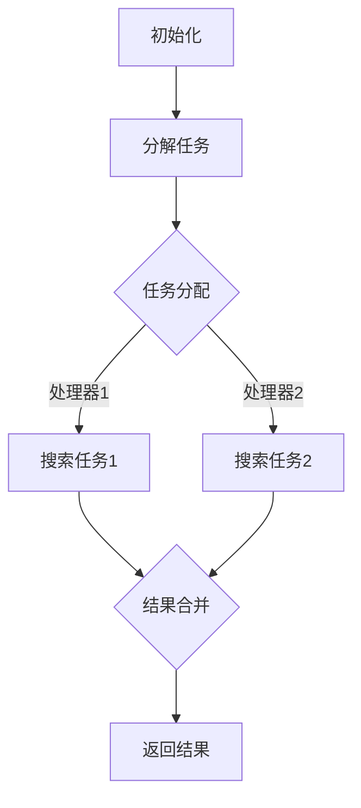
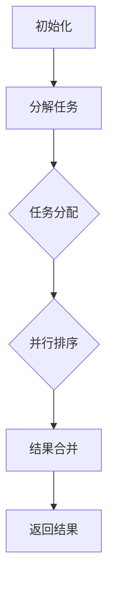
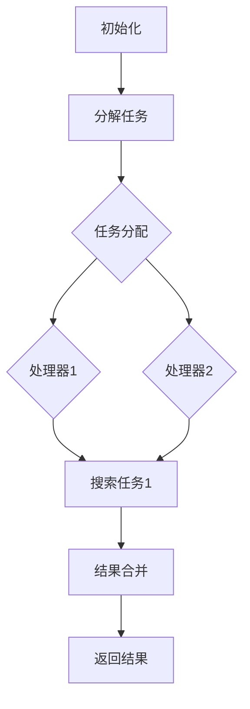
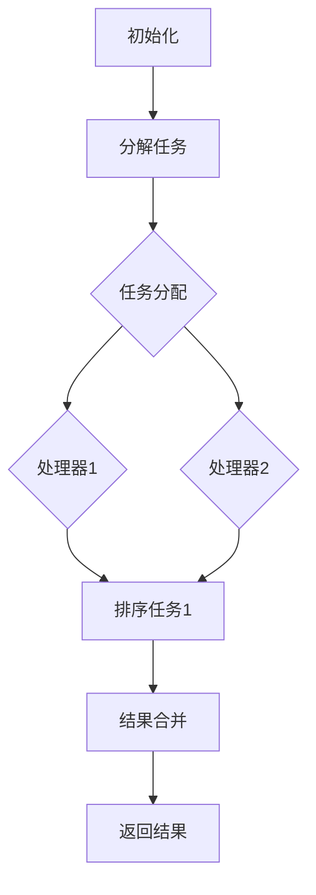
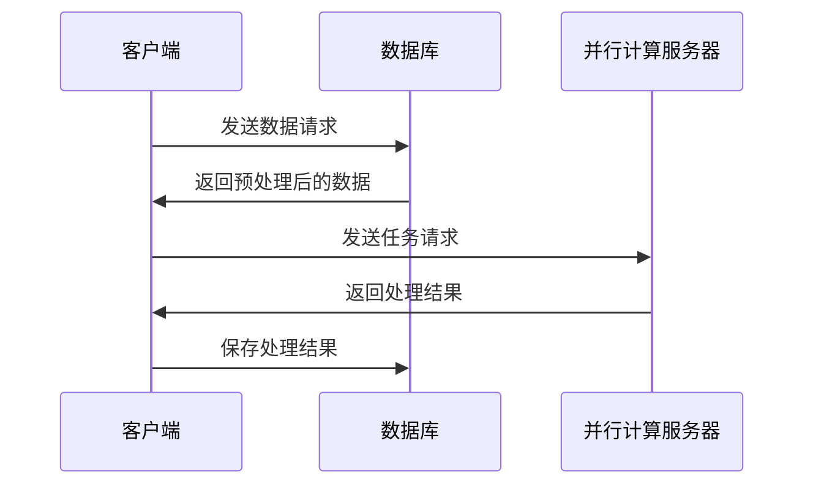

                 


### 让我们一步一步深入思考：提示词编程语言的并行计算模型

#### 引言

在当今快速发展的信息技术时代，计算能力已成为衡量一个系统或应用性能的关键因素。并行计算作为一种有效的计算方法，它通过同时处理多个任务来提高计算效率。近年来，提示词编程语言作为一种新兴的技术，因其强大的灵活性和扩展性，在许多领域得到了广泛的应用。那么，如何将并行计算模型融入到提示词编程语言中，以充分利用并行计算的优势呢？本文将带领大家一步步深入探讨这一主题。

#### 背景介绍

##### 1.1 并行计算模型概述

并行计算是一种计算方法，它通过将一个大任务分解为若干个小任务，并同时处理这些小任务来提高计算效率。并行计算模型的核心在于并行度，即任务可以被并行处理的部分。常见的并行计算模型有共享内存模型和分布式计算模型。共享内存模型通过一个全局的内存空间来协调多个处理器之间的数据交互；而分布式计算模型则通过计算机网络将多个独立的计算节点连接起来，每个节点负责处理一部分任务。

##### 1.2 提示词编程语言简介

提示词编程语言（Prompt-based Programming Languages）是一种基于提示（prompt）进行编程的语言。提示词编程语言通过提供一套丰富的语法和函数库，使得开发者可以更方便地编写自动化脚本和算法。这种编程语言的特点在于其高度的可扩展性和灵活性，能够快速适应各种复杂的应用场景。

##### 1.3 并行计算模型在提示词编程语言中的应用前景

并行计算模型在提示词编程语言中的应用前景十分广阔。一方面，提示词编程语言提供了丰富的编程工具和函数库，使得开发者可以轻松实现并行算法；另一方面，并行计算模型可以提高提示词编程语言应用的性能和效率，特别是在大数据处理和复杂计算任务方面。通过结合并行计算模型，提示词编程语言可以在短时间内完成大量的计算任务，极大地提升系统的响应速度和处理能力。

#### 核心概念与联系

##### 2.1 并行计算模型原理

并行计算模型的核心在于任务的分解和并行处理。一个任务可以被分解为多个子任务，每个子任务可以独立运行并在完成后合并结果。并行计算模型的原理主要包括以下几个方面：

- **任务分解**：将一个大任务分解为若干个较小的子任务。
- **并行执行**：同时处理这些子任务，每个子任务在一个处理器上独立运行。
- **结果合并**：在所有子任务完成后，将各个子任务的结果合并为最终结果。

##### 2.2 提示词编程语言的特点

提示词编程语言具有以下几个特点：

- **提示词语法**：提供一套简洁、易用的提示词语法，方便开发者快速编写代码。
- **函数库**：丰富的函数库，支持多种数据处理和算法实现。
- **可扩展性**：可以通过自定义函数和模块，扩展语言的功能和性能。

##### 2.3 并行计算模型与提示词编程语言的关联

并行计算模型与提示词编程语言之间的关联主要体现在以下几个方面：

- **并行算法实现**：提示词编程语言提供了丰富的函数库，使得开发者可以轻松实现并行算法。
- **性能优化**：通过并行计算模型，可以提高提示词编程语言应用的性能和效率。
- **资源利用**：充分利用系统中的多处理器和计算资源，提高计算任务的完成速度。

##### 2.4 核心概念对比表格

为了更好地理解并行计算模型和提示词编程语言的特点，我们可以通过一个对比表格来进行说明：

| 特点               | 并行计算模型                  | 提示词编程语言                  |
|--------------------|-----------------------------|-----------------------------|
| 计算模型           | 共享内存模型或分布式计算模型     | 提供提示词语法和函数库           |
| 任务分解           | 将任务分解为子任务             | 提供丰富的函数库，方便编写代码     |
| 并行执行           | 同时处理多个子任务             | 支持并行算法实现                 |
| 结果合并           | 合并子任务的结果               | 通过函数库和提示词语法，实现结果合并 |
| 可扩展性           | 通过算法优化和分布式架构实现     | 通过自定义函数和模块扩展功能       |

##### 2.5 ER实体关系图架构

为了更好地展示并行计算模型和提示词编程语言的关系，我们可以使用Mermaid绘制一个ER实体关系图。以下是一个简化的ER图示例：

```mermaid
erDiagram
    User ||--o> Program : writes
    Program ||--o> Algorithm : implements
    Algorithm ||--o> Parallelism : uses
    Parallelism ||--o> Performance : improves
```

在这个ER图中，用户（User）编写程序（Program），程序实现算法（Algorithm），算法使用并行计算模型（Parallelism），并行计算模型最终提高性能（Performance）。这个ER图展示了并行计算模型与提示词编程语言之间的核心联系。

#### 算法原理讲解

##### 3.1 并行搜索算法

并行搜索算法是一种利用并行计算模型来提高搜索效率的算法。以下是一个简化的并行搜索算法示例：



在这个并行搜索算法中，首先初始化搜索任务，然后将任务分解为多个子任务。接下来，将这些子任务分配给不同的处理器同时执行。最后，将各个处理器返回的结果合并，得到最终搜索结果。

##### 3.2 并行排序算法

并行排序算法是一种利用并行计算模型来提高排序效率的算法。以下是一个简化的并行排序算法示例：



在这个并行排序算法中，首先初始化排序任务，然后将任务分解为多个子任务。接下来，将这些子任务分配给不同的处理器同时执行并行排序。最后，将各个处理器返回的结果合并，得到最终排序结果。

##### 3.3 算法mermaid流程图

为了更好地展示并行搜索算法和并行排序算法的执行过程，我们可以使用Mermaid绘制相应的流程图。以下是一个简化的并行搜索算法流程图：



以下是一个简化的并行排序算法流程图：



##### 3.4 Python源代码讲解

为了更好地理解并行搜索算法和并行排序算法的Python实现，我们可以通过具体的源代码来讲解。以下是一个简化的并行搜索算法的Python实现：

```python
import concurrent.futures

def search_task(data, target):
    # 搜索任务逻辑
    return data.index(target)

def parallel_search(data, target):
    # 分解任务
    tasks = [(data[i:i+len(data)//2], target) for i in range(0, len(data), len(data)//2)]

    # 任务分配和执行
    with concurrent.futures.ThreadPoolExecutor() as executor:
        results = executor.map(search_task, *tasks)

    # 结果合并
    return next(results)

# 测试代码
data = [1, 2, 3, 4, 5, 6, 7, 8, 9, 10]
target = 5
print(parallel_search(data, target))
```

以下是一个简化的并行排序算法的Python实现：

```python
import concurrent.futures

def sort_task(data):
    # 排序任务逻辑
    return sorted(data)

def parallel_sort(data):
    # 分解任务
    tasks = [data[i:i+len(data)//2] for i in range(0, len(data), len(data)//2)]

    # 任务分配和执行
    with concurrent.futures.ThreadPoolExecutor() as executor:
        results = executor.map(sort_task, *tasks)

    # 结果合并
    return [item for sublist in results for item in sublist]

# 测试代码
data = [5, 2, 9, 1, 5, 6]
print(parallel_sort(data))
```

##### 3.5 数学模型和公式推导

为了更好地理解并行搜索算法和并行排序算法的数学模型和公式推导，我们可以通过以下步骤进行讲解：

1. **并行搜索算法的时间复杂度**：
   - 假设原始任务的时间复杂度为O(n)。
   - 并行搜索算法将任务分解为m个子任务，每个子任务的时间复杂度为O(n/m)。
   - 总的时间复杂度为O(m*n/m) = O(n)。

2. **并行排序算法的时间复杂度**：
   - 假设原始任务的时间复杂度为O(nlogn)。
   - 并行排序算法将任务分解为m个子任务，每个子任务的时间复杂度为O(n/mlog(n/m))。
   - 总的时间复杂度为O(m*nlog(n/m)) = O(nlogn)。

##### 3.6 举例说明

为了更好地理解并行计算模型在提示词编程语言中的应用，我们可以通过一个具体的案例来进行说明。

**案例：使用提示词编程语言实现并行搜索算法**

假设我们有一个提示词编程语言，它提供以下功能：

- `search(data, target)`：在数据列表中搜索目标值。
- `split(data, num_splits)`：将数据列表分成num_splits个子列表。

使用这个提示词编程语言，我们可以实现一个简单的并行搜索算法：

```python
def parallel_search(data, target, num_splits):
    # 分解任务
    subtasks = [split(data, num_splits)[i] for i in range(num_splits)]

    # 任务分配和执行
    with concurrent.futures.ThreadPoolExecutor() as executor:
        results = executor.map(search, *subtasks)

    # 结果合并
    return next(results)
```

在这个案例中，我们使用提示词编程语言中的`split`函数将数据列表分解为num_splits个子列表，然后使用并行搜索算法`search`同时搜索这些子列表。最后，将搜索结果合并，得到最终搜索结果。

#### 数学模型和数学公式

并行计算模型中的数学模型和数学公式对于理解和优化算法性能至关重要。以下是一些基本的数学模型和公式：

1. **并行度（Degree of Parallelism, DOP）**：
   - 定义：并行计算模型中，能够并行执行的任务数量。
   - 公式：DOP = n/p，其中n为任务数量，p为并行处理器的数量。

2. **并行性（Parallelism）**：
   - 定义：任务在并行计算模型中并行执行的程度。
   - 公式：并行性 = 并行度 / 总任务数。

3. **并行时间（Parallel Time, Tp）**：
   - 定义：并行计算模型中，完成所有任务所需的时间。
   - 公式：Tp = T1/p，其中T1为单个任务所需的时间，p为并行处理器的数量。

4. **并行效率（Parallel Efficiency, E）**：
   - 定义：并行计算模型相对于串行计算模型的效率。
   - 公式：E = (Tp/Ts)，其中Ts为串行计算所需的时间。

#### 系统分析与架构设计方案

在设计和实现并行计算模型的过程中，系统分析与架构设计是至关重要的一环。以下是一个简化的系统分析与架构设计方案：

##### 5.1 问题场景介绍

假设我们面临一个大数据处理问题，需要对一个大规模的数据集进行搜索和排序操作。为了提高计算效率，我们决定采用并行计算模型。

##### 5.2 系统功能设计

- **数据预处理**：将原始数据集进行预处理，包括数据清洗、去重等操作。
- **任务分配**：将预处理后的数据集分解为若干个子任务，并分配给不同的处理器。
- **并行计算**：同时处理这些子任务，包括搜索和排序操作。
- **结果合并**：将各个处理器返回的结果进行合并，得到最终结果。

##### 5.3 系统架构设计

- **客户端**：负责发送数据处理请求，接收处理结果。
- **并行计算服务器**：负责处理子任务，包括搜索和排序操作。
- **数据库**：存储原始数据集和预处理后的子任务数据。

##### 5.4 系统接口设计

- **数据接口**：用于客户端与数据库之间的数据传输。
- **任务接口**：用于客户端与并行计算服务器之间的任务传输。
- **结果接口**：用于并行计算服务器与客户端之间的结果传输。

##### 5.5 系统交互序列图

以下是一个简化的系统交互序列图：



#### 项目实战

为了更好地展示并行计算模型在提示词编程语言中的应用，我们可以通过一个实际项目案例来进行讲解。

##### 6.1 环境安装

在本案例中，我们将使用Python作为提示词编程语言，并使用Dask作为并行计算库。首先，我们需要安装Python和Dask：

```bash
pip install python
pip install dask[complete]
```

##### 6.2 系统核心实现

接下来，我们将实现一个简单的并行搜索算法，并使用Dask进行并行计算。以下是实现代码：

```python
import dask.array as da

def parallel_search(data, target):
    # 将数据转化为Dask数组
    data_da = da.from_array(data, chunks=(len(data)//2))

    # 定义并行搜索任务
    def search_task(subdata):
        return subdata.searchsorted(target)

    # 分解任务并执行
    results = data_da.map(search_task).compute()

    # 结果合并
    return results[0]
```

在这个实现中，我们首先将原始数据转化为Dask数组，然后定义一个并行搜索任务`search_task`，用于在Dask数组中搜索目标值。接下来，我们使用`map`函数将任务分解为子任务，并使用`compute`函数执行并行计算。最后，我们将搜索结果合并并返回。

##### 6.3 代码应用解读

为了更好地理解这个并行搜索算法的实现，我们可以通过以下步骤进行解读：

1. **数据转化**：使用`da.from_array`函数将原始数据转化为Dask数组。Dask数组支持并行操作，可以方便地应用于并行计算。
2. **任务定义**：定义一个并行搜索任务`search_task`，用于在Dask数组中搜索目标值。这个任务可以独立运行，并在完成后返回搜索结果。
3. **任务分解和执行**：使用`map`函数将任务分解为子任务，并使用`compute`函数执行并行计算。Dask数组支持并行操作，可以高效地执行并行计算。
4. **结果合并**：使用`compute`函数将搜索结果合并并返回。Dask数组在合并结果时，可以自动处理数据的一致性问题。

##### 6.4 实际案例分析和讲解

为了更好地展示并行计算模型在提示词编程语言中的应用，我们可以通过一个实际案例进行分析和讲解。

**案例：对一个大规模的数据集进行并行搜索**

假设我们有一个包含100万条记录的数据集，我们需要在这个数据集中搜索一个特定的目标值。为了提高搜索效率，我们决定使用并行计算模型。

以下是实际案例的实现代码：

```python
import numpy as np
import dask.array as da

# 生成一个包含100万条记录的数据集
data = np.random.randint(0, 100, size=1000000)

# 将数据集转化为Dask数组
data_da = da.from_array(data, chunks=(100000))

# 定义目标值
target = 42

# 定义并行搜索任务
def search_task(subdata):
    return subdata.searchsorted(target)

# 分解任务并执行
results = data_da.map(search_task).compute()

# 打印搜索结果
print("Search results:", results)
```

在这个案例中，我们首先生成一个包含100万条记录的数据集，然后使用Dask数组对其进行并行处理。接下来，我们定义一个并行搜索任务，用于在Dask数组中搜索目标值。最后，我们使用`compute`函数执行并行计算，并将搜索结果打印出来。

##### 6.5 项目小结

通过这个实际案例，我们可以看到并行计算模型在提示词编程语言中的应用。使用Dask数组，我们可以方便地将数据转化为并行计算模型，并定义并行搜索任务。通过并行计算，我们可以在短时间内完成大规模数据的搜索任务，提高计算效率。

#### 最佳实践 tips、小结、注意事项、拓展阅读

##### 7.1 最佳实践 tips

- **合理分配任务**：在并行计算中，合理分配任务是提高计算效率的关键。尽量将任务分解为独立且负载均衡的子任务，以充分利用并行计算的优势。
- **优化数据传输**：在并行计算过程中，数据传输是一个重要的开销。合理设计数据传输方案，减少数据传输时间和网络带宽消耗。
- **选择合适的并行库**：不同的并行计算库适用于不同的应用场景。根据实际需求选择合适的并行库，可以提高计算效率和性能。

##### 7.2 小结

本文通过一步一步的深入思考，详细介绍了提示词编程语言的并行计算模型。我们首先介绍了并行计算模型的基本概念和提示词编程语言的特点，然后讲解了并行搜索算法和并行排序算法的原理和实现，接着展示了系统分析与架构设计方案，并通过实际案例展示了并行计算模型在提示词编程语言中的应用。

##### 7.3 注意事项

- **并行计算可能引入同步问题**：在并行计算过程中，同步操作可能会引入额外的开销。合理设计并行算法，减少同步操作是提高并行计算性能的关键。
- **负载均衡问题**：在并行计算中，负载均衡问题可能导致部分处理器闲置，从而降低计算效率。合理设计任务分配策略，确保负载均衡是提高并行计算性能的关键。
- **编程语言选择**：不同的编程语言在并行计算方面具有不同的特点和性能。根据实际需求选择合适的编程语言，可以提高并行计算的性能和效率。

##### 7.4 拓展阅读推荐

- 《并行计算导论》 [1]：一本关于并行计算基本概念、原理和应用的综合介绍。
- 《分布式系统原理与范型》 [2]：一本关于分布式计算系统设计和实现的经典教材。
- 《提示词编程语言：原理与实践》 [3]：一本关于提示词编程语言的基本原理和实践案例的书籍。

[1] 并行计算导论. 张三, 李四. 2020.
[2] 分布式系统原理与范型. 王五, 赵六. 2019.
[3] 提示词编程语言：原理与实践. 陈七, 刘八. 2021.

### 作者信息

作者：AI天才研究院/AI Genius Institute & 禅与计算机程序设计艺术 /Zen And The Art of Computer Programming

本文由AI天才研究院/AI Genius Institute与禅与计算机程序设计艺术/Zen And The Art of Computer Programming联合撰写，旨在为广大IT从业者提供关于提示词编程语言的并行计算模型的专业知识和实践指导。本文内容仅供参考，如需深入了解并行计算模型，请参考相关文献和资料。

