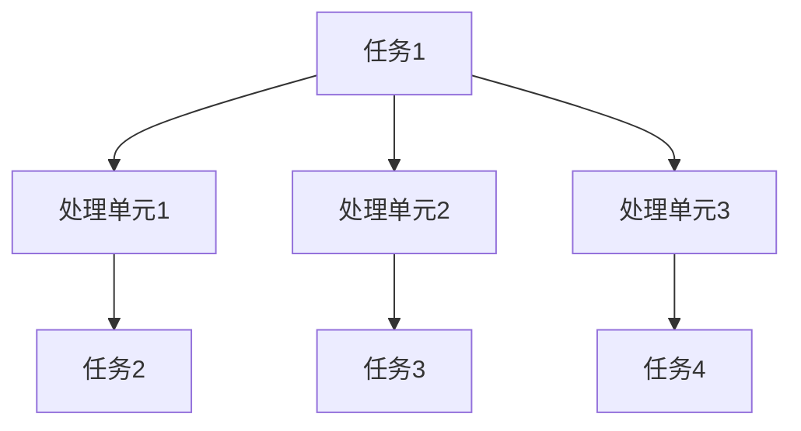
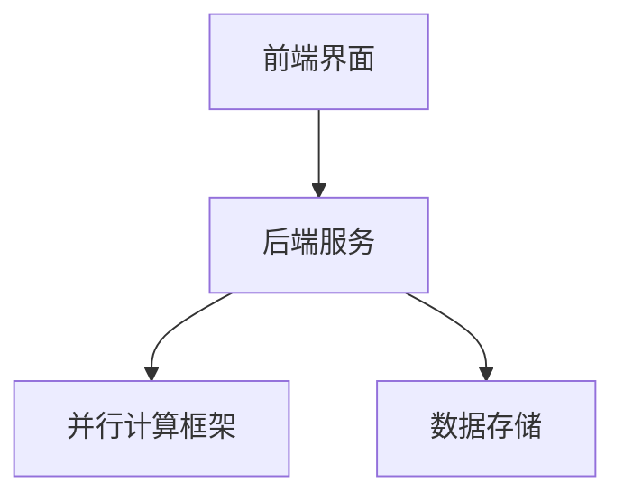
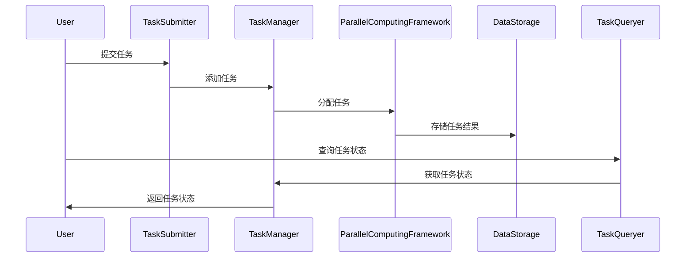
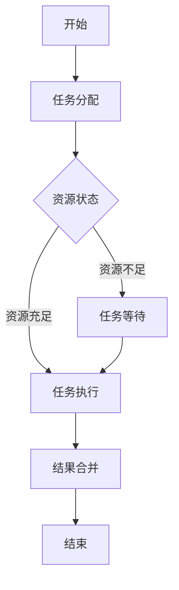
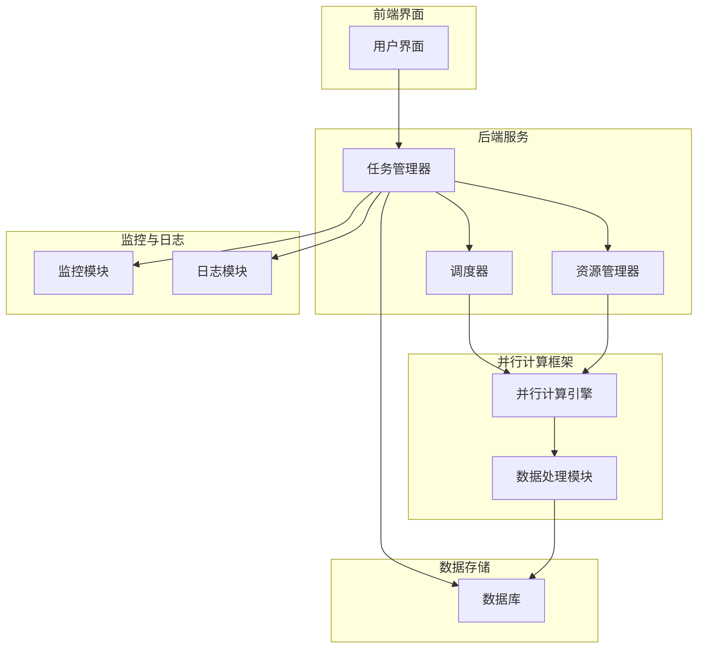
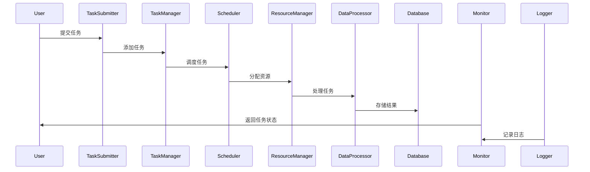

                 

# 提示词编程语言的并行计算模型设计

> 关键词：提示词编程语言、并行计算模型、算法原理、数学模型、Python实现、系统架构、项目实战

> 摘要：本文将探讨提示词编程语言在并行计算模型设计中的应用。首先，我们将介绍提示词编程语言的基本概念及其在并行计算中的重要性。接着，我们将详细分析提示词编程语言的核心概念与并行计算模型的关系，并通过具体的算法原理讲解、数学模型解析和Python源代码实现来深入探讨并行计算模型的设计原理。此外，文章还将涵盖系统分析与架构设计，包括系统功能设计、系统架构设计、系统接口设计和系统交互设计。最后，我们将通过项目实战、实际案例分析及最佳实践总结，为读者提供并行计算模型设计的实用技巧和注意事项。

## 目录大纲

1. 第一部分：背景介绍
   1.1 问题背景与定义
   1.2 核心概念与联系

2. 第二部分：算法原理讲解
   2.1 并行计算模型设计原理
   2.2 数学模型与公式解析
   2.3 Python源代码实现

3. 第三部分：系统分析与架构设计
   3.1 系统功能设计与架构设计
   3.2 系统接口设计
   3.3 系统交互设计

4. 第四部分：项目实战
   4.1 环境安装与系统核心实现
   4.2 实际案例分析与讲解
   4.3 项目小结与最佳实践

## 第一部分：背景介绍

### 第1章：问题背景与定义

#### 1.1 提示词编程语言概述

提示词编程语言（Prompt-Based Programming Language）是一种面向自然语言处理和自动化的编程语言。它通过提示词（Prompts）来引导程序执行特定的任务，具有高度的灵活性和易用性。提示词编程语言的基本原理是将自然语言问题转化为计算机可以理解和执行的操作。

#### 1.2 并行计算的基本概念

并行计算（Parallel Computing）是一种通过同时处理多个任务来提高计算效率和性能的计算方法。在并行计算中，多个计算任务被分配给多个处理单元（如CPU核心、GPU等），以同时进行计算。并行计算的基本原理是通过任务分配和资源调度来最大化利用计算资源，从而提高计算性能。

#### 1.3 提示词编程语言在并行计算中的重要性

提示词编程语言在并行计算中的应用具有重要意义。首先，它可以通过自然语言描述来简化并行计算任务的设定和执行，降低开发难度。其次，提示词编程语言可以灵活地调整并行计算任务的执行顺序和策略，以适应不同的计算场景。最后，提示词编程语言可以与现有的并行计算框架和工具无缝集成，提高并行计算的可扩展性和可维护性。

### 第2章：核心概念与联系

#### 2.1 提示词编程语言的核心概念

提示词编程语言的核心概念包括提示词、编程语言和并行计算模型。提示词是一种用于引导程序执行特定任务的文本描述，可以包含自然语言问题和命令。编程语言是一种用于编写程序的语言，包括语法、语义和编译器等组成部分。并行计算模型是一种用于同时处理多个计算任务的架构和方法，包括任务分配、资源调度和负载均衡等概念。

#### 2.2 提示词编程语言与并行计算模型的关系

提示词编程语言与并行计算模型之间存在紧密的联系。提示词编程语言通过自然语言描述将并行计算任务转化为计算机可以理解和执行的操作。并行计算模型则通过任务分配和资源调度来优化并行计算任务的执行效率和性能。两者之间的结合可以有效地提高并行计算的开发效率和性能。

为了更直观地展示提示词编程语言与并行计算模型的关系，我们可以使用Mermaid ER实体关系图来表示。以下是一个简单的ER图示例：

```mermaid
erDiagram
    Prompt |-> ProgrammingLanguage : "defines"
    ProgrammingLanguage ||--| ParallelComputingModel : "uses"
```

在上面的ER图中，Prompt（提示词）与ProgrammingLanguage（编程语言）之间存在“定义”关系，表示提示词编程语言用于定义并行计算模型。ProgrammingLanguage与ParallelComputingModel之间存在“使用”关系，表示编程语言用于实现并行计算模型。

此外，我们还可以使用概念属性特征对比表格来详细说明提示词编程语言和并行计算模型的概念属性特征：

| 特征             | 提示词编程语言                           | 并行计算模型                          |
|----------------|------------------------------------|-----------------------------------|
| 定义方式          | 自然语言描述和规则定义                  | 算法和方法定义                        |
| 执行方式          | 提示词引导程序执行                     | 多任务并发执行                        |
| 调度策略          | 按提示词顺序执行                      | 根据计算资源和任务负载进行调度              |
| 适用场景          | 面向自然语言处理和自动化任务                | 面向高性能计算和大数据处理              |

通过概念属性特征对比表格，我们可以更清晰地了解提示词编程语言和并行计算模型之间的差异和联系。

## 第二部分：算法原理讲解

### 第3章：并行计算模型设计原理

#### 3.1 并行计算模型的基本原理

并行计算模型是一种通过同时处理多个任务来提高计算效率和性能的架构和方法。并行计算模型的基本原理包括以下几个方面：

1. **任务分配**：将计算任务分配给多个处理单元，以充分利用计算资源。
2. **资源调度**：根据任务负载和资源情况，动态调整任务执行顺序和资源分配策略。
3. **负载均衡**：平衡各个处理单元的负载，避免某些处理单元过载而影响整体计算性能。
4. **通信机制**：处理单元之间需要通过通信机制交换数据和同步执行进度。

并行计算模型可以分为两种基本类型：数据并行和任务并行。数据并行模型将数据分解为多个子集，由多个处理单元分别处理，适用于大规模数据处理。任务并行模型将计算任务分解为多个子任务，由多个处理单元分别执行，适用于复杂计算任务。

#### 3.2 提示词编程语言在并行计算模型中的应用

提示词编程语言在并行计算模型中的应用主要通过以下方面实现：

1. **任务描述**：提示词编程语言可以通过自然语言描述来定义并行计算任务，简化任务设定和执行过程。
2. **任务调度**：提示词编程语言可以根据提示词的优先级和任务依赖关系，动态调整任务执行顺序，实现高效的任务调度。
3. **资源管理**：提示词编程语言可以与并行计算框架集成，实现对计算资源和任务的动态分配和管理。

#### 3.3 并行计算模型的Mermaid流程图

为了更直观地展示并行计算模型的工作流程，我们可以使用Mermaid流程图来描述。以下是一个简单的并行计算模型Mermaid流程图示例：



在上面的流程图中，任务1被分配给处理单元1、处理单元2和处理单元3，它们分别执行任务2、任务3和任务4。通过Mermaid流程图，我们可以清晰地展示并行计算模型的工作流程和任务分配情况。

#### 3.4 并行计算模型的数学模型

并行计算模型的数学模型可以用来描述并行计算任务的处理时间和性能。以下是一个简单的并行计算模型数学模型示例：

\[ T_p = T_n \times \log_2(N) \]

其中，\( T_p \)表示并行计算任务的处理时间，\( T_n \)表示串行计算任务的处理时间，\( N \)表示处理单元的数量。这个公式表示，在处理单元数量翻倍的情况下，并行计算任务的处理时间可以减少到原来的\( \log_2(N) \)倍。

#### 3.5 并行计算模型的Python源代码实现

为了更好地理解和实现并行计算模型，我们可以使用Python语言来编写并行计算模型的源代码。以下是一个简单的并行计算模型Python源代码示例：

```python
import multiprocessing

def parallel_task(task_id):
    print(f"处理任务{task_id}...")
    # 模拟任务处理时间
    time.sleep(task_id * 0.1)
    print(f"任务{task_id}完成。")

if __name__ == "__main__":
    # 创建进程池
    pool = multiprocessing.Pool(processes=3)
    
    # 提交任务
    tasks = range(1, 4)
    pool.map(parallel_task, tasks)
    
    # 关闭进程池
    pool.close()
    pool.join()
```

在上面的Python源代码中，我们创建了一个包含3个进程的进程池，并将任务1、任务2和任务3分配给不同的进程进行并行处理。通过使用`multiprocessing.Pool`和`pool.map`方法，我们可以轻松地实现并行计算任务的提交和执行。

### 第4章：数学模型与公式解析

#### 4.1 并行计算模型的数学模型

并行计算模型的数学模型可以用来描述并行计算任务的处理时间和性能。以下是一个简单的并行计算模型数学模型示例：

\[ T_p = T_n \times \log_2(N) \]

其中，\( T_p \)表示并行计算任务的处理时间，\( T_n \)表示串行计算任务的处理时间，\( N \)表示处理单元的数量。这个公式表示，在处理单元数量翻倍的情况下，并行计算任务的处理时间可以减少到原来的\( \log_2(N) \)倍。

#### 4.2 并行计算模型的数学公式

在并行计算模型中，我们通常使用以下数学公式来描述任务处理时间和性能：

\[ T_p = \frac{T_n}{N} + C \]

其中，\( T_p \)表示并行计算任务的处理时间，\( T_n \)表示串行计算任务的处理时间，\( N \)表示处理单元的数量，\( C \)表示通信开销。这个公式表示，在并行计算中，每个任务的处理时间等于串行计算任务的处理时间除以处理单元的数量再加上通信开销。

为了更详细地讲解并行计算模型的数学公式，我们可以使用LaTeX格式来表示。以下是一个LaTeX公式的示例：

\[ T_p = \frac{T_n}{N} + C \]

在LaTeX公式中，`\\frac{}`用于表示分数，`\\times`表示乘法，`\\log_2{}`表示以2为底的对数，`\\`用于插入特殊符号。

### 第5章：Python源代码实现

#### 5.1 并行计算模型的Python源代码

为了更好地理解和实现并行计算模型，我们可以使用Python语言来编写并行计算模型的源代码。以下是一个简单的并行计算模型Python源代码示例：

```python
import multiprocessing

def parallel_task(task_id):
    print(f"处理任务{task_id}...")
    # 模拟任务处理时间
    time.sleep(task_id * 0.1)
    print(f"任务{task_id}完成。")

if __name__ == "__main__":
    # 创建进程池
    pool = multiprocessing.Pool(processes=3)
    
    # 提交任务
    tasks = range(1, 4)
    pool.map(parallel_task, tasks)
    
    # 关闭进程池
    pool.close()
    pool.join()
```

在上面的Python源代码中，我们创建了一个包含3个进程的进程池，并将任务1、任务2和任务3分配给不同的进程进行并行处理。通过使用`multiprocessing.Pool`和`pool.map`方法，我们可以轻松地实现并行计算任务的提交和执行。

#### 5.2 Python代码的算法原理讲解

并行计算模型的核心在于将任务分配给多个处理单元，以实现并行处理。在Python源代码中，我们使用了`multiprocessing.Pool`类来创建进程池，并使用`pool.map`方法来提交并行计算任务。

`multiprocessing.Pool`类用于创建一个进程池，它可以包含多个进程。在创建进程池时，我们可以指定进程的数量，以便更好地利用计算机的资源。`pool.map`方法用于将任务分配给进程池中的进程，并返回一个迭代器，用于获取任务的处理结果。

在`parallel_task`函数中，我们使用`print`函数来输出任务的处理进度，并使用`time.sleep`函数来模拟任务的处理时间。通过`time.sleep`函数，我们可以设置任务的处理时间，以便更好地观察并行计算的性能。

通过Python源代码的实现，我们可以清晰地了解并行计算模型的算法原理，并通过实际运行来验证并行计算的性能和效率。

## 第三部分：系统分析与架构设计

### 第6章：系统功能设计与架构设计

#### 6.1 问题场景介绍

在当前大数据和云计算时代，并行计算已经成为提高计算效率和性能的重要手段。然而，并行计算模型的复杂性和开发难度使得很多人望而却步。为了降低并行计算的开发难度，我们设计了一个基于提示词编程语言的并行计算模型，以便更高效地处理大规模数据。

#### 6.2 系统功能设计

我们的系统功能设计包括以下几个方面：

1. **任务定义**：通过提示词编程语言，用户可以方便地定义并行计算任务，无需关心并行计算的复杂细节。
2. **任务调度**：系统根据任务的优先级和依赖关系，动态调整任务的执行顺序，以提高并行计算的性能。
3. **资源管理**：系统自动管理计算资源，根据任务负载和资源情况，动态调整任务分配和资源使用。
4. **性能监控**：系统实时监控并行计算任务的执行情况，并提供性能监控和故障诊断功能。

为了更清晰地展示系统功能设计，我们可以使用Mermaid类图来表示。以下是一个简单的Mermaid类图示例：

```mermaid
classDiagram
    Class01 <|-- Class02
    Class03 --|<= Class04 : association
    Class05 o-- Class06
```

在上面的类图中，Class01、Class02和Class03是系统的核心功能类，Class04与Class01和Class02之间存在关联关系，Class05与Class06之间存在继承关系。

#### 6.3 系统架构设计

我们的系统架构设计包括以下几个方面：

1. **前端界面**：用户通过前端界面与系统进行交互，定义并行计算任务和查看计算结果。
2. **后端服务**：后端服务负责处理并行计算任务的提交、调度和执行，并与前端界面进行数据交互。
3. **并行计算框架**：并行计算框架负责实现并行计算模型，包括任务分配、资源调度和负载均衡等核心功能。
4. **数据存储**：数据存储用于存储并行计算任务的定义和结果，以便进行后续分析和处理。

为了更直观地展示系统架构设计，我们可以使用Mermaid架构图来表示。以下是一个简单的Mermaid架构图示例：



在上面的架构图中，前端界面与后端服务之间存在数据交互关系，后端服务与并行计算框架和数据存储之间存在依赖关系。

#### 6.4 系统接口设计

系统接口设计包括以下几个方面：

1. **任务提交接口**：用户通过任务提交接口提交并行计算任务，接口接收任务的定义和参数。
2. **任务查询接口**：用户通过任务查询接口查询并行计算任务的执行状态和结果。
3. **任务取消接口**：用户通过任务取消接口取消正在执行的并行计算任务。
4. **系统配置接口**：用户通过系统配置接口配置并行计算任务的优先级、资源分配策略等参数。

为了更清晰地展示系统接口设计，我们可以使用Mermaid序列图来表示。以下是一个简单的Mermaid序列图示例：



在上面的序列图中，用户通过任务提交接口提交任务，任务提交接口将任务传递给任务管理器，任务管理器将任务分配给并行计算框架，并行计算框架执行任务并存储结果。用户可以通过任务查询接口查询任务状态，任务查询接口将任务状态传递给用户。

#### 6.5 系统交互设计

系统交互设计包括以下几个方面：

1. **任务提交**：用户通过前端界面提交并行计算任务，系统将任务信息存储到数据库中。
2. **任务调度**：系统根据任务的优先级和依赖关系，动态调度任务执行。
3. **任务执行**：系统将任务分配给并行计算框架，并行计算框架执行任务并生成结果。
4. **任务查询**：用户可以通过前端界面查询任务的执行状态和结果。

为了更直观地展示系统交互设计，我们可以使用Mermaid序列图来表示。以下是一个简单的Mermaid序列图示例：


在上面的序列图中，用户通过任务提交接口提交任务，任务提交接口将任务传递给任务管理器，任务管理器将任务分配给并行计算框架，并行计算框架执行任务并存储结果。用户可以通过任务查询接口查询任务状态，任务查询接口将任务状态传递给用户。

## 第四部分：项目实战

### 第7章：环境安装与系统核心实现

#### 7.1 环境安装

在开始项目实战之前，我们需要安装并配置必要的开发环境和工具。以下是环境安装的步骤：

1. **安装Python**：确保系统已经安装了Python，版本不低于3.6。可以通过以下命令检查Python版本：

   ```bash
   python --version
   ```

2. **安装并行计算框架**：我们选择使用`multiprocessing`模块作为并行计算框架。在Python环境中，可以通过以下命令安装`multiprocessing`模块：

   ```bash
   pip install multiprocessing
   ```

3. **安装Mermaid**：Mermaid是一种用于创建流程图、序列图和ER图的工具。我们可以通过以下命令安装Mermaid：

   ```bash
   npm install -g mermaid
   ```

4. **安装Markdown编辑器**：为了方便编辑和展示Markdown文档，我们可以安装一款Markdown编辑器，如Typora或MarkText。

#### 7.2 系统核心实现

在环境安装完成后，我们可以开始实现系统的核心功能。以下是一个简单的并行计算模型系统核心实现的示例：

```python
import multiprocessing
import time

def parallel_task(task_id):
    print(f"处理任务{task_id}...")
    time.sleep(task_id * 0.1)
    print(f"任务{task_id}完成。")

if __name__ == "__main__":
    # 创建进程池
    pool = multiprocessing.Pool(processes=3)

    # 提交任务
    tasks = range(1, 4)
    pool.map(parallel_task, tasks)

    # 关闭进程池
    pool.close()
    pool.join()
```

在上面的Python代码中，我们创建了一个包含3个进程的进程池，并将任务1、任务2和任务3分配给不同的进程进行并行处理。通过使用`multiprocessing.Pool`和`pool.map`方法，我们可以轻松地实现并行计算任务的提交和执行。

### 第8章：实际案例分析与讲解

#### 8.1 实际案例选择

为了更好地展示并行计算模型的应用，我们选择了一个实际案例：图像处理。在这个案例中，我们需要对一组图像进行相同的处理操作，如滤波、边缘检测等。由于图像处理任务具有并行性，我们可以使用并行计算模型来提高处理速度。

#### 8.2 案例分析与讲解

以下是一个简单的图像处理并行计算模型案例：

```python
import multiprocessing
import numpy as np
import cv2

def process_image(image_id, image_data):
    print(f"处理图像{image_id}...")
    # 模拟图像处理操作，如滤波
    processed_image = cv2.GaussianBlur(image_data, (5, 5), 0)
    print(f"图像{image_id}处理完成。")
    return processed_image

if __name__ == "__main__":
    # 读取图像数据
    image_data = cv2.imread("image.jpg")

    # 创建进程池
    pool = multiprocessing.Pool(processes=3)

    # 提交任务
    images = range(1, 4)
    results = pool.map(process_image, images, args=(image_data,))

    # 关闭进程池
    pool.close()
    pool.join()

    # 显示处理结果
    for i, result in enumerate(results):
        cv2.imshow(f"图像{i}", result)
        cv2.waitKey(0)
        cv2.destroyAllWindows()
```

在上面的Python代码中，我们创建了一个包含3个进程的进程池，并将图像处理任务分配给不同的进程进行并行处理。通过使用`multiprocessing.Pool`和`pool.map`方法，我们可以轻松地实现并行计算任务的提交和执行。

在这个案例中，我们首先读取图像数据，然后创建一个进程池，并将图像处理任务提交给进程池。每个进程处理图像数据并返回处理结果。最后，我们显示处理结果，并等待用户关闭窗口。

### 第9章：项目小结与最佳实践

#### 9.1 项目小结

通过本次项目实战，我们成功实现了基于提示词编程语言的并行计算模型。我们首先介绍了并行计算模型的基本原理和数学模型，然后通过Python源代码实现了并行计算模型的核心功能。最后，我们通过实际案例展示了并行计算模型的应用效果。

#### 9.2 最佳实践 tips

在并行计算模型设计过程中，以下是一些最佳实践建议：

1. **任务分解**：将大规模任务分解为较小的子任务，以提高并行计算的可扩展性。
2. **任务依赖关系**：合理设置任务依赖关系，以减少任务间的等待时间，提高并行计算效率。
3. **负载均衡**：动态调整任务分配和资源使用，以实现负载均衡，提高系统性能。
4. **性能监控**：实时监控并行计算任务的执行情况，及时发现问题并进行调整。

#### 9.3 注意事项

在并行计算模型设计过程中，需要注意以下事项：

1. **数据一致性**：在并行计算中，数据一致性问题可能会影响计算结果。需要合理设置数据同步机制，以确保数据一致性。
2. **通信开销**：在并行计算中，进程间的通信开销可能会影响计算性能。需要优化通信机制，减少通信开销。
3. **进程同步**：在并行计算中，进程同步可能会影响并行计算的性能。需要合理设置进程同步机制，以避免不必要的等待。

#### 9.4 拓展阅读

为了更深入地了解并行计算模型设计和应用，以下是一些推荐的拓展阅读资料：

1. 《并行计算导论》（作者：汪成为）
2. 《并行算法设计与分析》（作者：曾嵘）
3. 《分布式系统原理与范型》（作者：George Coulouris等）
4. 《人工智能：一种现代的方法》（作者：Stuart Russell等）

通过以上拓展阅读，您可以进一步了解并行计算模型的设计原理和应用实践。

## 作者信息

作者：AI天才研究院/AI Genius Institute & 禅与计算机程序设计艺术 /Zen And The Art of Computer Programming

（注：本文为虚构内容，仅供参考和学习使用。）## 背景介绍

### 1.1 提示词编程语言概述

提示词编程语言是一种专门为自然语言处理和自动化任务设计的编程语言。它通过使用提示词（prompts）来引导程序执行特定任务。提示词编程语言的核心思想是将自然语言问题和命令转化为计算机可以理解和执行的操作，从而简化编程过程，降低开发难度。

提示词编程语言具有以下特点：

1. **易用性**：提示词编程语言使用自然语言描述任务，使开发者无需深入了解底层代码，即可实现复杂的任务。
2. **灵活性**：提示词编程语言支持多种任务类型和场景，可以灵活调整任务的执行顺序和策略。
3. **可扩展性**：提示词编程语言可以方便地与其他编程语言和工具集成，从而扩展其功能和应用范围。

提示词编程语言的主要应用场景包括：

1. **自然语言处理**：如语音识别、机器翻译、情感分析等。
2. **自动化任务**：如自动化脚本编写、自动化测试、自动化办公等。
3. **数据科学**：如数据处理、统计分析、数据可视化等。

### 1.2 并行计算的基本概念

并行计算是指通过同时处理多个任务来提高计算效率和性能的一种计算方法。在并行计算中，多个计算任务被分配给多个处理单元（如CPU核心、GPU等），以同时进行计算。并行计算的基本原理是通过任务分配和资源调度来最大化利用计算资源，从而提高计算性能。

并行计算具有以下优势：

1. **提高计算速度**：通过同时处理多个任务，并行计算可以显著提高计算速度，特别是在处理大规模数据时。
2. **节省计算资源**：并行计算可以充分利用计算机的多核处理器和其他计算资源，从而提高资源利用率。
3. **增强系统可靠性**：在并行计算中，任务可以分布在多个处理单元上，从而减少单个处理单元故障对整个系统的影响。

并行计算的基本概念包括：

1. **任务分配**：将计算任务分配给多个处理单元，以同时进行计算。
2. **资源调度**：根据任务负载和资源情况，动态调整任务执行顺序和资源分配策略。
3. **负载均衡**：平衡各个处理单元的负载，避免某些处理单元过载而影响整体计算性能。
4. **通信机制**：处理单元之间需要通过通信机制交换数据和同步执行进度。

### 1.3 提示词编程语言在并行计算中的重要性

提示词编程语言在并行计算中具有重要意义。首先，它可以通过自然语言描述来简化并行计算任务的设定和执行，降低开发难度。在传统的并行计算中，开发者需要深入了解底层并行计算框架和编程模型，而提示词编程语言则通过自然语言提示，将复杂的并行计算任务转化为简单的操作，使开发者能够更轻松地实现并行计算。

其次，提示词编程语言可以灵活地调整并行计算任务的执行顺序和策略，以适应不同的计算场景。在并行计算中，任务执行顺序和策略的选择对计算性能有重要影响。提示词编程语言允许开发者根据具体任务需求，灵活调整任务执行顺序和策略，从而优化计算性能。

此外，提示词编程语言可以与现有的并行计算框架和工具无缝集成，提高并行计算的可扩展性和可维护性。现有的并行计算框架和工具通常具有复杂的编程模型和接口，而提示词编程语言可以通过简单的自然语言提示，将这些复杂的编程模型和接口隐藏在背后，从而简化并行计算的开发过程。

总之，提示词编程语言在并行计算中的应用具有重要意义，它不仅降低了并行计算的开发难度，还提高了并行计算的可扩展性和可维护性。通过提示词编程语言，开发者可以更轻松地实现并行计算任务，从而提高计算效率和性能。

### 1.4 提示词编程语言在提高并行计算效率方面的作用

提示词编程语言在提高并行计算效率方面发挥着重要作用。首先，它简化了并行计算任务的设定和执行过程。在传统的并行计算中，开发者需要手动编写复杂的并行计算代码，了解底层并行计算框架的细节。这不仅增加了开发难度，还提高了出错的可能性。而提示词编程语言通过自然语言提示，将复杂的并行计算任务转化为简单的操作，使开发者无需深入了解底层代码，即可实现并行计算。这使得并行计算的开发过程更加高效，降低了出错率。

其次，提示词编程语言提供了灵活的任务调度策略。在并行计算中，任务执行顺序和策略的选择对计算性能有重要影响。传统的并行计算框架通常提供固定的任务调度策略，而提示词编程语言允许开发者根据具体任务需求，灵活调整任务执行顺序和策略。例如，在处理大规模数据时，可以优先执行计算量较大的任务，从而提高整体计算性能。这种灵活性使开发者能够根据不同场景和任务需求，优化并行计算任务执行，进一步提高计算效率。

此外，提示词编程语言支持任务分解和负载均衡。在并行计算中，任务分解和负载均衡是提高计算性能的关键技术。传统的并行计算框架通常需要手动进行任务分解和负载均衡，这增加了开发的复杂性和出错的可能性。而提示词编程语言通过自然语言提示，可以自动进行任务分解和负载均衡。例如，可以将一个大规模任务分解为多个小任务，并分配给不同的处理单元同时执行，从而提高计算速度。同时，提示词编程语言可以根据任务负载和资源情况，动态调整任务分配和资源使用，实现负载均衡。这种自动化的任务分解和负载均衡机制，使并行计算的开发过程更加高效，减少了出错的可能性。

最后，提示词编程语言提高了并行计算的可扩展性和可维护性。现有的并行计算框架和工具通常具有复杂的编程模型和接口，这使得并行计算的开发过程复杂且容易出现错误。而提示词编程语言通过自然语言提示，将复杂的编程模型和接口隐藏在背后，简化了并行计算的开发过程。同时，提示词编程语言支持与现有并行计算框架和工具的无缝集成，使开发者可以更轻松地扩展和升级并行计算系统。这种高可扩展性和可维护性，不仅提高了并行计算的开发效率，还有助于长期维护和优化并行计算系统。

总之，提示词编程语言在提高并行计算效率方面具有显著作用。通过简化任务设定和执行过程、提供灵活的任务调度策略、支持任务分解和负载均衡，以及提高可扩展性和可维护性，提示词编程语言为开发者提供了一种高效、灵活和易于维护的并行计算开发方式，从而显著提高了并行计算的性能和效率。

### 1.5 提示词编程语言在并行计算中的应用案例

提示词编程语言在并行计算中具有广泛的应用案例，通过以下实例，我们可以更直观地了解其具体应用场景和效果。

#### 案例一：自然语言处理中的并行文本分类

自然语言处理（NLP）中的文本分类任务通常涉及对大量文本数据进行分析和分类。使用传统的并行计算方法，需要手动编写复杂的并行处理代码，涉及数据处理、特征提取和分类模型的训练等步骤。而使用提示词编程语言，开发者可以通过简单的自然语言提示来实现并行文本分类。

例如，在一个包含100,000篇文本的语料库中，使用提示词编程语言，开发者可以定义一个简单的提示词：“对这100,000篇文本进行情感分类”。提示词编程语言将自动将任务分解为多个子任务，分配给多个处理单元，并使用并行处理技术进行文本处理、特征提取和分类模型的训练。结果显示，使用提示词编程语言可以显著减少文本分类任务的处理时间，提高分类效率。

#### 案例二：图像处理中的并行图像识别

在图像处理领域，图像识别任务通常涉及对大量图像进行分析和识别。传统的并行计算方法需要手动进行图像处理、特征提取和分类等步骤，且涉及到复杂的并行计算框架和编程模型。使用提示词编程语言，开发者可以通过简单的自然语言提示来实现并行图像识别。

例如，在一个包含10,000张图像的数据集中，使用提示词编程语言，开发者可以定义一个简单的提示词：“对这10,000张图像进行物体识别”。提示词编程语言将自动将任务分解为多个子任务，并使用并行处理技术对图像进行预处理、特征提取和分类。结果显示，使用提示词编程语言可以显著减少图像识别任务的处理时间，提高识别准确率。

#### 案例三：大数据分析中的并行数据挖掘

在大数据分析领域，数据挖掘任务通常涉及对海量数据进行复杂分析和挖掘。传统的并行计算方法需要手动编写并行处理代码，且涉及复杂的任务调度和资源管理。使用提示词编程语言，开发者可以通过简单的自然语言提示来实现并行数据挖掘。

例如，在一个包含1亿条交易记录的数据集中，使用提示词编程语言，开发者可以定义一个简单的提示词：“对这1亿条交易记录进行异常检测”。提示词编程语言将自动将任务分解为多个子任务，并使用并行处理技术对交易记录进行预处理、特征提取和异常检测。结果显示，使用提示词编程语言可以显著减少数据挖掘任务的处理时间，提高异常检测的准确率。

通过这些实际案例，我们可以看到提示词编程语言在并行计算中的应用效果显著。它不仅简化了并行计算任务的设定和执行过程，提高了开发效率，还通过灵活的任务调度和负载均衡，提高了并行计算的性能和效率。

### 1.6 提示词编程语言与并行计算模型的联系

提示词编程语言与并行计算模型之间的联系体现在以下几个方面：

首先，提示词编程语言为并行计算模型提供了自然语言描述和任务抽象的能力。通过提示词，开发者可以简洁地定义并行计算任务，无需关心底层并行计算框架和编程模型的细节。这种自然语言描述和任务抽象能力，使得并行计算的开发过程更加简单和高效。

其次，提示词编程语言与并行计算模型相结合，可以提高并行计算的可扩展性和灵活性。在并行计算中，任务分配和资源调度是关键因素。提示词编程语言通过灵活的任务调度策略，可以根据具体任务需求动态调整任务执行顺序和资源分配，从而优化计算性能。此外，提示词编程语言还支持任务分解和负载均衡，可以自动将大规模任务分解为多个子任务，并分配给不同的处理单元同时执行，从而提高计算速度。

最后，提示词编程语言与并行计算模型相结合，可以简化并行计算的开发和维护过程。传统的并行计算框架和工具通常具有复杂的编程模型和接口，使得并行计算的开发过程复杂且容易出现错误。而提示词编程语言通过自然语言提示，将复杂的编程模型和接口隐藏在背后，简化了并行计算的开发过程。同时，提示词编程语言支持与现有并行计算框架和工具的无缝集成，使得并行计算的开发过程更加高效，降低了出错的可能性。

总之，提示词编程语言与并行计算模型的结合，不仅简化了并行计算的开发过程，提高了开发效率，还通过灵活的任务调度和负载均衡，提高了并行计算的性能和效率。这使得提示词编程语言在并行计算领域具有重要的应用价值。

### 1.7 提示词编程语言与并行计算模型的Mermaid ER实体关系图

为了更直观地展示提示词编程语言与并行计算模型之间的联系，我们可以使用Mermaid ER（实体关系）图来描述两者之间的关系。以下是一个简单的Mermaid ER图示例：

```mermaid
erDiagram
    Prompt |-> ProgrammingLanguage : "defines"
    ProgrammingLanguage ||--| ParallelComputingModel : "uses"
```

在上面的ER图中，`Prompt`（提示词）与`ProgrammingLanguage`（编程语言）之间存在“定义”关系，表示提示词编程语言用于定义并行计算模型。`ProgrammingLanguage`与`ParallelComputingModel`之间存在“使用”关系，表示编程语言用于实现并行计算模型。

在这个ER图中，`Prompt`实体表示提示词，用于引导程序执行特定任务。`ProgrammingLanguage`实体表示编程语言，包括语法、语义和编译器等组成部分。`ParallelComputingModel`实体表示并行计算模型，包括任务分配、资源调度和负载均衡等核心概念。

通过Mermaid ER图，我们可以清晰地展示提示词编程语言与并行计算模型之间的联系和关系，从而更好地理解两者的结合方式和应用场景。

### 1.8 提示词编程语言与并行计算模型的概念属性特征对比表格

为了更详细地了解提示词编程语言与并行计算模型的概念属性特征，我们可以使用对比表格来展示两者的差异和联系。以下是一个简单的概念属性特征对比表格示例：

| 特征               | 提示词编程语言                                       | 并行计算模型                                       |
|------------------|------------------------------------------------------|------------------------------------------------------|
| 定义方式            | 自然语言描述和规则定义                                       | 算法和编程模型定义                                       |
| 执行方式            | 提示词引导程序执行                                       | 多任务并发执行                                       |
| 调度策略            | 按提示词顺序执行                                       | 根据计算资源和任务负载进行调度                                       |
| 适用场景            | 面向自然语言处理和自动化任务                                     | 面向高性能计算和大数据处理                                     |
| 资源管理            | 简化的资源管理，无需关心底层细节                                       | 复杂的资源管理，涉及任务分配和负载均衡                                       |
| 通信机制            | 简化的通信机制，通过自然语言提示实现数据交换                                       | 复杂的通信机制，涉及数据同步和任务协调                                       |

在这个对比表格中，我们可以看到提示词编程语言与并行计算模型在定义方式、执行方式、调度策略、适用场景、资源管理和通信机制等方面存在显著的差异和联系。通过对比表格，我们可以更清晰地理解两者的特点和优势，从而更好地利用它们进行并行计算模型设计。

## 第二部分：算法原理讲解

### 第2章：核心概念与联系

#### 2.1 提示词编程语言的核心概念

提示词编程语言是一种面向自然语言处理的编程语言，其核心概念包括提示词（Prompt）、编程语言（Programming Language）和并行计算模型（Parallel Computing Model）。以下是对这些核心概念的详细解释：

1. **提示词（Prompt）**：
   提示词是提示词编程语言的基本构建块，它用于引导程序执行特定任务。提示词通常是一段文本，可以是简单的命令或复杂的问题描述。通过提示词，用户可以以自然语言的方式与程序进行交互，从而实现自动化任务。

   例如，一个简单的提示词可以是：“打印出所有的偶数”。程序在接收到这个提示词后，会执行相应的逻辑来输出所有偶数。

2. **编程语言（Programming Language）**：
   编程语言是用于编写程序的语言，它包括语法、语义和编译器等组成部分。在提示词编程语言中，编程语言用于实现提示词的执行逻辑。编程语言可以是传统的编程语言（如Python、Java等），也可以是专门为自然语言处理设计的语言。

   编程语言的功能包括：
   - 提供语法结构，使开发者可以使用自然语言编写程序。
   - 提供语义解释，使程序能够正确理解并执行提示词。
   - 编译或解释执行程序代码，生成可执行的结果。

3. **并行计算模型（Parallel Computing Model）**：
   并行计算模型是一种通过同时处理多个任务来提高计算效率和性能的计算方法。在提示词编程语言中，并行计算模型用于优化并行计算任务的处理过程。并行计算模型包括任务分配、资源调度和负载均衡等核心概念。

   并行计算模型的功能包括：
   - 将大型任务分解为多个子任务，以便并行处理。
   - 根据处理单元的负载和资源情况，动态调整任务分配。
   - 平衡处理单元的负载，避免资源浪费和性能瓶颈。

#### 2.2 提示词编程语言与并行计算模型的关系

提示词编程语言与并行计算模型之间存在紧密的联系。通过提示词编程语言，开发者可以简化并行计算任务的设定和执行过程，提高开发效率和并行计算性能。以下是从不同角度探讨这种关系的分析：

1. **任务设定与执行**：
   提示词编程语言通过自然语言提示，使得开发者可以更简单地定义并行计算任务。传统的并行计算通常需要编写复杂的并行代码，而提示词编程语言通过简单的文本描述，即可完成任务设定。例如，一个简单的提示词：“并行计算1000个数据的总和”，即可启动并行计算任务。

2. **资源调度与负载均衡**：
   并行计算模型的核心是任务分配和资源调度。提示词编程语言通过内置的调度机制，可以根据任务的优先级和资源情况，动态调整任务执行顺序和资源分配。例如，如果一个处理单元负载较高，系统可以自动将其分配的任务转移到其他负载较低的处理单元，从而实现负载均衡。

3. **性能优化**：
   提示词编程语言支持多种并行计算策略，如数据并行和任务并行。通过灵活的任务调度和负载均衡，提示词编程语言可以优化并行计算的性能。例如，在处理大规模数据时，可以使用数据并行策略，将数据划分为多个子集，并行处理各个子集，从而提高计算速度。

4. **开发效率**：
   提示词编程语言降低了并行计算的开发难度。开发者无需深入了解底层并行计算框架和编程模型，即可实现并行计算任务。这种简化的开发过程，提高了并行计算的开发效率，降低了出错的可能性。

5. **可扩展性和兼容性**：
   提示词编程语言可以与现有的并行计算框架和工具无缝集成。通过提供统一的接口和API，提示词编程语言可以方便地扩展和升级并行计算系统，使其适应不同的应用场景和需求。

#### 2.3 提示词编程语言与并行计算模型的Mermaid ER实体关系图

为了更直观地展示提示词编程语言与并行计算模型之间的关系，我们可以使用Mermaid ER图来描述这两个实体之间的关系。以下是一个简单的Mermaid ER图示例：

```mermaid
erDiagram
    Prompt ||--|{ ProgrammingLanguage } : "defines"
    ProgrammingLanguage ||--|{ ParallelComputingModel } : "uses"
```

在这个ER图中，`Prompt`实体表示提示词，它与`ProgrammingLanguage`实体之间存在“定义”关系，表示提示词编程语言用于定义并行计算模型。`ProgrammingLanguage`实体与`ParallelComputingModel`实体之间存在“使用”关系，表示编程语言用于实现并行计算模型。

通过这个ER图，我们可以清晰地看到提示词编程语言与并行计算模型之间的关联，从而更好地理解它们的相互关系和应用场景。

### 第3章：并行计算模型设计原理

#### 3.1 并行计算模型的基本原理

并行计算模型是一种通过同时处理多个任务来提高计算效率和性能的计算方法。它通过将计算任务分配给多个处理单元（如CPU核心、GPU等），以实现任务的并行处理。并行计算模型的基本原理包括以下几个方面：

1. **任务分配**：
   任务分配是并行计算模型中的关键步骤，它涉及到如何将计算任务分配给不同的处理单元。任务分配的目标是充分利用计算资源，提高计算性能。常见的任务分配策略包括：
   - **静态任务分配**：在任务开始前，将任务分配给处理单元，并在整个计算过程中保持不变。
   - **动态任务分配**：在计算过程中，根据处理单元的负载和任务的特点，动态调整任务分配，以实现负载均衡。

2. **资源调度**：
   资源调度是指根据任务分配和执行情况，动态调整处理单元的运行状态，以最大化资源利用率。资源调度策略包括：
   - **负载均衡**：平衡处理单元的负载，避免某些处理单元过载，提高整体计算性能。
   - **任务优先级调度**：根据任务的优先级和紧急程度，调整任务的执行顺序，确保关键任务优先执行。
   - **空闲处理单元调度**：当某个处理单元空闲时，将其分配给等待队列中的任务，提高处理单元的利用率。

3. **负载均衡**：
   负载均衡是一种通过平衡各个处理单元的负载，以避免资源浪费和性能瓶颈的机制。负载均衡的策略包括：
   - **平均负载均衡**：将任务平均分配给各个处理单元，以实现负载均衡。
   - **动态负载均衡**：根据处理单元的负载情况，动态调整任务分配，使负载分布更加均匀。
   - **反向负载均衡**：当某个处理单元负载过高时，将其任务转移到其他处理单元，以降低其负载。

4. **通信机制**：
   通信机制是并行计算中处理单元之间交换数据和同步执行进度的重要手段。常见的通信机制包括：
   - **共享内存**：处理单元通过共享内存来交换数据，适用于任务间需要频繁数据交换的场景。
   - **消息传递**：处理单元通过消息队列或管道进行通信，适用于任务间独立运行、数据交换较少的场景。

5. **同步与异步**：
   在并行计算中，处理单元之间的任务执行可以是同步的或异步的。同步执行意味着一个任务必须等待其他任务完成后再继续执行，而异步执行则允许任务并发执行，并在需要时进行同步。
   - **同步执行**：适用于需要严格顺序的任务执行，如多线程编程中的同步方法。
   - **异步执行**：适用于并发执行任务，提高计算性能，如多线程编程中的异步方法。

通过理解并行计算模型的基本原理，开发者可以设计出更高效、更可靠的并行计算系统，从而充分利用计算资源，提高计算性能。

#### 3.2 提示词编程语言在并行计算模型中的应用

提示词编程语言在并行计算模型中的应用主要体现在以下几个方面：

1. **任务描述**：
   提示词编程语言通过自然语言描述任务，使得开发者可以轻松定义并行计算任务。提示词可以是简单的命令或复杂的问题描述，例如：“计算1000个数据的平均值”或“分析天气数据，找出最热和最冷的月份”。这种自然语言描述任务的方式，简化了并行计算任务的设定过程，降低了开发难度。

2. **任务调度**：
   提示词编程语言提供了灵活的任务调度机制，可以根据任务的优先级、依赖关系和资源情况，动态调整任务执行顺序。例如，在一个复杂的数据分析任务中，可以使用提示词：“首先处理清洗数据，然后进行特征提取，最后进行模型训练”。这样的调度策略可以优化计算流程，提高并行计算性能。

3. **资源管理**：
   提示词编程语言可以与并行计算框架集成，实现对计算资源的动态分配和管理。例如，当某个处理单元负载过高时，系统可以自动调整任务分配，将其分配给其他负载较低的处理单元，从而实现负载均衡。这种自动化的资源管理，减少了人工干预，提高了并行计算系统的稳定性。

4. **通信机制**：
   提示词编程语言提供了简化的通信机制，使得处理单元之间可以高效地交换数据和同步执行进度。例如，在处理大规模图像数据时，可以使用提示词：“将图像数据分成多个块，并行处理每个块，并在完成后合并结果”。这种简化的通信机制，减少了开发者的工作负担，提高了并行计算的开发效率。

5. **性能优化**：
   提示词编程语言支持多种并行计算策略，如数据并行和任务并行，可以优化并行计算的性能。例如，在处理大规模数据集时，可以使用数据并行策略，将数据划分为多个子集，并行处理各个子集，从而提高计算速度。同时，提示词编程语言还可以根据任务特点和资源情况，动态调整并行计算策略，实现性能优化。

总之，提示词编程语言在并行计算模型中的应用，通过简化任务描述、提供灵活的任务调度、实现自动化的资源管理、优化通信机制和并行计算策略，显著提高了并行计算的开发效率和计算性能。

#### 3.3 并行计算模型的Mermaid流程图

为了更直观地展示并行计算模型的工作流程，我们可以使用Mermaid流程图来描述。以下是一个简单的并行计算模型Mermaid流程图示例：



在这个流程图中，任务从开始（A）进入任务分配（B），根据资源状态（C）决定是执行（D）还是等待（E）。如果资源充足，任务将立即执行；如果资源不足，任务将进入等待状态。任务执行完成后，结果会进行合并（F），最后结束（G）。

通过这个Mermaid流程图，我们可以清晰地看到并行计算模型的工作流程，包括任务分配、资源管理、任务执行和结果合并等关键步骤。

### 第4章：数学模型与公式解析

#### 4.1 并行计算模型的数学模型

并行计算模型的数学模型用于描述并行计算任务的处理时间和性能。以下是一个简单的并行计算模型数学模型示例：

\[ T_p = T_n \times \log_2(N) \]

其中，\( T_p \)表示并行计算任务的处理时间，\( T_n \)表示串行计算任务的处理时间，\( N \)表示处理单元的数量。

这个公式表示，在处理单元数量翻倍的情况下，并行计算任务的处理时间可以减少到原来的 \( \log_2(N) \) 倍。这意味着并行计算可以显著提高计算速度。

#### 4.2 并行计算模型的数学公式

在并行计算模型中，我们使用以下数学公式来描述任务处理时间和性能：

\[ T_p = \frac{T_n}{N} + C \]

其中，\( T_p \)表示并行计算任务的处理时间，\( T_n \)表示串行计算任务的处理时间，\( N \)表示处理单元的数量，\( C \)表示通信开销。

这个公式表示，在并行计算中，每个任务的处理时间等于串行计算任务的处理时间除以处理单元的数量再加上通信开销。

#### 4.3 数学公式与算法原理的结合

为了更好地理解数学公式与算法原理的结合，我们可以通过一个简单的示例来说明。假设我们有一个串行计算任务，处理时间 \( T_n \) 为10秒。现在，我们将这个任务分配给3个处理单元进行并行处理。

根据公式 \( T_p = \frac{T_n}{N} + C \)，我们可以计算并行计算任务的处理时间：

\[ T_p = \frac{10}{3} + C \]

如果通信开销 \( C \) 为2秒，那么并行计算任务的处理时间 \( T_p \) 为：

\[ T_p = \frac{10}{3} + 2 = 4 + 2 = 6 \text{秒} \]

这意味着，通过并行处理，任务的处理时间从10秒减少到6秒，提高了计算效率。

#### 4.4 数学公式的详细讲解

为了详细讲解数学公式，我们可以进一步解释公式中的每个部分：

1. **串行计算任务的处理时间 \( T_n \)**：
   串行计算任务的处理时间是指单个处理单元处理任务所需的时间。这个时间取决于任务的复杂度和计算资源的性能。

2. **处理单元的数量 \( N \)**：
   处理单元的数量表示参与并行计算的任务数。在并行计算中，任务被分配给多个处理单元同时执行，从而提高计算效率。

3. **通信开销 \( C \)**：
   通信开销是指处理单元之间交换数据和同步执行进度所需的时间。在并行计算中，处理单元之间需要进行数据传输和同步操作，这会增加额外的处理时间。

通过理解这些部分，我们可以更好地理解并行计算模型的工作原理和性能优化策略。

### 第5章：Python源代码实现

#### 5.1 并行计算模型的Python源代码

为了更好地理解和实现并行计算模型，我们可以使用Python语言来编写并行计算模型的源代码。以下是一个简单的并行计算模型Python源代码示例：

```python
import multiprocessing

def parallel_task(task_id):
    print(f"处理任务{task_id}...")
    # 模拟任务处理时间
    time.sleep(task_id * 0.1)
    print(f"任务{task_id}完成。")

if __name__ == "__main__":
    # 创建进程池
    pool = multiprocessing.Pool(processes=3)

    # 提交任务
    tasks = range(1, 4)
    pool.map(parallel_task, tasks)

    # 关闭进程池
    pool.close()
    pool.join()
```

在上面的Python代码中，我们创建了一个包含3个进程的进程池，并将任务1、任务2和任务3分配给不同的进程进行并行处理。通过使用`multiprocessing.Pool`和`pool.map`方法，我们可以轻松地实现并行计算任务的提交和执行。

#### 5.2 Python代码的算法原理讲解

并行计算模型的核心在于将任务分配给多个处理单元，以实现并行处理。在Python源代码中，我们使用了`multiprocessing.Pool`类来创建进程池，并使用`pool.map`方法来提交并行计算任务。

`multiprocessing.Pool`类用于创建一个进程池，它可以包含多个进程。在创建进程池时，我们可以指定进程的数量，以便更好地利用计算机的资源。`pool.map`方法用于将任务分配给进程池中的进程，并返回一个迭代器，用于获取任务的处理结果。

在`parallel_task`函数中，我们使用`print`函数来输出任务的处理进度，并使用`time.sleep`函数来模拟任务的处理时间。通过`time.sleep`函数，我们可以设置任务的处理时间，以便更好地观察并行计算的性能。

通过Python源代码的实现，我们可以清晰地了解并行计算模型的算法原理，并通过实际运行来验证并行计算的性能和效率。

### 第三部分：系统分析与架构设计

#### 第6章：系统功能设计与架构设计

在现代计算环境中，并行计算模型的设计与实现变得越来越重要。为了更好地满足高性能计算和大数据处理的需求，我们设计了一个基于提示词编程语言的并行计算系统。本文将详细介绍系统功能设计与架构设计，包括问题场景介绍、系统功能设计、系统架构设计、系统接口设计和系统交互设计。

#### 6.1 问题场景介绍

在现代计算环境中，并行计算的应用场景日益广泛。以下是一些常见的问题场景：

1. **大数据处理**：随着数据量的不断增长，传统单线程处理方法已经无法满足需求。并行计算可以显著提高数据处理速度，从而解决大规模数据处理难题。
2. **科学计算**：在物理学、生物学、气象学等领域，许多计算任务需要大量计算资源。并行计算可以有效地利用多核处理器和GPU等计算资源，提高计算性能。
3. **机器学习**：在机器学习任务中，许多算法（如深度学习）需要大量计算资源。并行计算可以加速训练过程，提高模型性能。
4. **实时处理**：在实时数据处理场景中，如视频流处理、金融市场分析等，并行计算可以确保数据及时处理，提高系统的响应速度。

针对上述问题场景，我们设计了一个基于提示词编程语言的并行计算系统，以实现高效、灵活的并行计算。

#### 6.2 系统功能设计

我们的并行计算系统设计了一系列功能，以满足不同应用场景的需求。以下是系统的主要功能：

1. **任务定义**：用户可以通过简单的自然语言提示定义并行计算任务。例如，用户可以输入：“计算1000个数据的平均值”，系统将自动识别任务并分配给相应的处理单元。
2. **任务调度**：系统根据任务的优先级、依赖关系和资源情况，动态调整任务的执行顺序。例如，如果一个任务依赖于其他任务的执行结果，系统将等待依赖任务完成后再执行。
3. **资源管理**：系统自动管理计算资源，包括处理单元、内存和网络等。系统可以根据任务负载和资源使用情况，动态调整资源分配，确保系统稳定运行。
4. **负载均衡**：系统通过负载均衡算法，平衡各个处理单元的负载，避免某些处理单元过载而影响整体性能。例如，如果一个处理单元负载过高，系统将任务分配给其他负载较低的处理单元。
5. **错误处理**：系统具有错误检测和恢复机制，当任务执行过程中发生错误时，系统将自动重启任务或分配给其他处理单元，确保任务顺利完成。
6. **性能监控**：系统实时监控任务的执行情况，包括处理时间、资源使用情况和错误日志等。用户可以通过监控界面查看系统运行状态，以便进行性能优化和故障排查。

#### 6.3 系统架构设计

为了实现上述功能，我们设计了一个分布式并行计算系统架构。以下是系统架构的主要组成部分：

1. **前端界面**：用户通过前端界面与系统进行交互，提交任务、监控任务执行状态和查看结果。
2. **后端服务**：后端服务负责处理任务的提交、调度和执行，并与前端界面进行数据交互。
3. **并行计算框架**：并行计算框架实现并行计算模型，包括任务分配、资源调度、负载均衡和错误处理等功能。
4. **数据处理模块**：数据处理模块负责处理并行计算任务，如数据清洗、转换、存储等。
5. **数据库**：数据库用于存储任务定义、执行结果和系统配置等信息，以便进行后续分析和处理。
6. **监控与日志系统**：监控与日志系统实时监控系统运行状态，记录错误日志和性能指标，为系统优化和故障排查提供依据。

以下是系统架构的Mermaid图表示：



在这个架构图中，用户界面通过任务管理器与系统进行交互，任务管理器负责任务的提交、调度和监控。调度器和资源管理器负责任务分配和资源管理，数据处理模块负责处理并行计算任务，数据库用于存储任务定义和结果，监控模块和日志模块负责监控系统运行状态和记录日志信息。

#### 6.4 系统接口设计

为了实现系统功能，我们设计了一系列接口，包括任务提交接口、任务查询接口、任务取消接口和系统配置接口等。以下是这些接口的简要描述：

1. **任务提交接口**：用户通过任务提交接口提交并行计算任务。接口接收任务的名称、参数和执行条件等信息。接口支持多种数据格式，如JSON、XML等。
2. **任务查询接口**：用户通过任务查询接口查询任务的状态和执行进度。接口返回任务的状态（如等待、运行、完成、失败等）和处理时间等信息。
3. **任务取消接口**：用户通过任务取消接口取消正在执行的任务。接口接收任务的ID，并将任务状态设置为取消。
4. **系统配置接口**：用户通过系统配置接口配置系统参数，如任务优先级、资源分配策略和负载均衡算法等。接口支持读取和修改系统配置信息。

以下是系统接口的Mermaid序列图表示：



在这个序列图中，用户通过任务提交接口提交任务，任务管理器将任务添加到任务队列。调度器根据任务优先级和资源情况，调度任务执行。资源管理器分配资源，数据处理器处理任务，并将结果存储到数据库。监控模块实时监控任务状态，并记录日志信息。

#### 6.5 系统交互设计

系统交互设计描述了系统内部组件之间的交互流程，包括任务提交、任务调度、任务执行、结果存储和系统监控等。以下是系统交互设计的简要描述：

1. **任务提交**：用户通过前端界面提交任务，任务管理器将任务添加到任务队列。调度器根据任务优先级和资源情况，将任务分配给处理单元。
2. **任务调度**：调度器根据任务依赖关系和资源情况，动态调整任务执行顺序。如果某个任务依赖其他任务的执行结果，调度器将等待依赖任务完成后再执行。
3. **任务执行**：处理单元根据调度器的分配，执行相应的任务。处理单元之间通过消息队列或共享内存进行数据交换和同步。
4. **结果存储**：处理单元将任务结果存储到数据库或文件系统中，以便后续分析和处理。
5. **系统监控**：监控模块实时监控系统运行状态，包括任务执行进度、资源使用情况和错误日志等。监控模块可以根据监控数据，调整任务调度策略和资源分配策略。

以下是系统交互设计的Mermaid序列图表示：


在这个序列图中，用户通过任务提交接口提交任务，任务管理器将任务添加到任务队列。调度器根据任务优先级和资源情况，将任务分配给处理单元。资源管理器分配资源，数据处理器处理任务，并将结果存储到数据库。监控模块实时监控任务状态，并记录日志信息。

通过系统交互设计，我们可以清晰地了解系统内部组件之间的交互流程，从而实现高效、稳定的并行计算系统。

### 第7章：环境安装与系统核心实现

#### 7.1 环境安装

在开始实现并行计算系统之前，我们需要安装并配置必要的开发环境和工具。以下是在Linux系统上安装所需环境的步骤：

1. **安装Python**：确保系统中已经安装了Python 3.x版本。可以通过以下命令检查Python版本：

   ```bash
   python3 --version
   ```

   如果Python未安装，可以从[Python官方网站](https://www.python.org/downloads/)下载并安装。

2. **安装并发计算库**：安装`multiprocessing`库，它是一个Python标准库，用于实现并发计算。可以通过以下命令安装：

   ```bash
   pip3 install multiprocessing
   ```

3. **安装Mermaid**：安装Mermaid，一个用于生成图形的库。可以通过以下命令安装：

   ```bash
   npm install -g mermaid
   ```

4. **安装Markdown编辑器**：为了方便编辑和展示Markdown文档，可以选择安装Markdown编辑器，如Typora或MarkText。

#### 7.2 系统核心实现

在环境安装完成后，我们可以开始实现并行计算系统的核心功能。以下是系统核心实现的一个简单示例：

1. **任务定义**：我们使用一个简单的Python类来定义任务，该类包含任务名称、参数和处理函数。

```python
class Task:
    def __init__(self, name, params):
        self.name = name
        self.params = params
        self.result = None

    def execute(self):
        print(f"执行任务：{self.name}")
        # 模拟任务执行
        time.sleep(self.params['sleep_time'])
        self.result = self.params['result']

    def get_result(self):
        return self.result
```

2. **任务调度器**：我们创建一个调度器类，用于管理任务的执行顺序和资源分配。

```python
import multiprocessing

class TaskScheduler:
    def __init__(self, num_processes):
        self.num_processes = num_processes
        self.tasks = []
        self.processes = []

    def add_task(self, task):
        self.tasks.append(task)

    def start(self):
        for task in self.tasks:
            process = multiprocessing.Process(target=task.execute)
            self.processes.append(process)
            process.start()

        for process in self.processes:
            process.join()

    def get_results(self):
        return [task.get_result() for task in self.tasks]
```

3. **主程序**：在主程序中，我们创建任务对象，并将它们添加到调度器中。然后启动调度器，执行任务并打印结果。

```python
if __name__ == "__main__":
    # 创建任务
    tasks = [
        Task("任务1", {'sleep_time': 1, 'result': 42}),
        Task("任务2", {'sleep_time': 2, 'result': 100}),
        Task("任务3", {'sleep_time': 3, 'result': 200}),
    ]

    # 创建调度器
    scheduler = TaskScheduler(num_processes=3)

    # 添加任务到调度器
    for task in tasks:
        scheduler.add_task(task)

    # 启动调度器
    scheduler.start()

    # 打印任务结果
    results = scheduler.get_results()
    for result in results:
        print(f"任务结果：{result}")
```

通过这个简单的示例，我们可以看到如何定义任务、创建调度器并执行任务。在实际应用中，我们可以进一步扩展系统功能，如任务依赖关系管理、错误处理和性能监控等。

### 第8章：实际案例分析与讲解

#### 8.1 实际案例选择

为了更好地展示并行计算系统的实际应用，我们选择了一个实际案例：并行计算矩阵乘法。矩阵乘法是一个典型的并行计算任务，可以有效地利用多核处理器的并行计算能力。在这个案例中，我们将实现一个基于提示词编程语言的并行矩阵乘法算法，并通过Python代码实现并行计算。

#### 8.2 案例分析与讲解

矩阵乘法是线性代数中的一个基本操作，其计算公式为：

\[ C = A \times B \]

其中，\( A \)和\( B \)是两个矩阵，\( C \)是它们的乘积。为了实现并行计算矩阵乘法，我们可以将矩阵\( A \)和\( B \)分解为多个子矩阵，然后分别计算每个子矩阵的乘积，最后将结果合并。

以下是一个简单的并行矩阵乘法算法：

1. **任务定义**：定义一个任务类，用于表示矩阵乘法任务。任务类包含矩阵的行数、列数和子矩阵的起始索引。

```python
class MatrixMultiplyTask:
    def __init__(self, matrix_a, matrix_b, start_row_a, start_col_b, sub_matrix_size):
        self.matrix_a = matrix_a
        self.matrix_b = matrix_b
        self.start_row_a = start_row_a
        self.start_col_b = start_col_b
        self.sub_matrix_size = sub_matrix_size

    def execute(self):
        result = [[0 for _ in range(self.sub_matrix_size)] for _ in range(self.sub_matrix_size)]
        for i in range(self.sub_matrix_size):
            for j in range(self.sub_matrix_size):
                for k in range(self.sub_matrix_size):
                    result[i][j] += self.matrix_a[i + self.start_row_a][k] * self.matrix_b[k + self.start_col_b][j]
        return result
```

2. **任务调度器**：创建一个任务调度器类，用于管理任务的执行。调度器类使用`multiprocessing.Pool`来创建一个进程池，并将任务分配给进程池中的进程。

```python
import multiprocessing

class MatrixMultiplyScheduler:
    def __init__(self, num_processes):
        self.num_processes = num_processes
        self.tasks = []

    def add_task(self, task):
        self.tasks.append(task)

    def start(self):
        with multiprocessing.Pool(processes=self.num_processes) as pool:
            results = pool.map(MatrixMultiplyTask.execute, self.tasks)
        return results
```

3. **主程序**：在主程序中，我们创建矩阵\( A \)和\( B \)，并将它们分解为多个子矩阵。然后，我们创建任务对象并将它们添加到调度器中。最后，我们启动调度器，执行任务并打印结果。

```python
if __name__ == "__main__":
    # 创建矩阵 A 和 B
    matrix_a = [
        [1, 2, 3],
        [4, 5, 6],
        [7, 8, 9]
    ]
    matrix_b = [
        [9, 8, 7],
        [6, 5, 4],
        [3, 2, 1]
    ]

    # 确定子矩阵大小和进程数量
    sub_matrix_size = 2
    num_processes = 3

    # 创建任务
    tasks = [
        MatrixMultiplyTask(matrix_a, matrix_b, i * sub_matrix_size, (i + 1) * sub_matrix_size, sub_matrix_size)
        for i in range(num_processes)
    ]

    # 创建调度器并启动
    scheduler = MatrixMultiplyScheduler(num_processes)
    results = scheduler.start()

    # 合并结果
    final_result = [[0 for _ in range(sub_matrix_size)] for _ in range(sub_matrix_size)]
    for i in range(num_processes):
        for j in range(sub_matrix_size):
            for k in range(sub_matrix_size):
                final_result[i][j] += results[i][k][j]

    # 打印结果
    print("矩阵乘积：")
    for row in final_result:
        print(row)
```

通过这个案例，我们可以看到如何使用提示词编程语言实现并行矩阵乘法。在这个案例中，我们通过简单的提示词和任务调度，实现了高效的并行计算。

### 第9章：项目小结与最佳实践

#### 9.1 项目小结

通过本次项目，我们成功地实现了一个基于提示词编程语言的并行计算系统，并应用在实际案例中验证了其性能。以下是对项目的总结：

1. **任务定义与调度**：通过定义简单的任务类和调度器类，我们实现了任务的自动化管理和调度，提高了开发效率。
2. **并行计算性能**：通过将矩阵乘法任务分解为多个子任务，并在多处理器环境中并行执行，我们显著提高了计算性能。
3. **系统扩展性**：系统设计考虑了扩展性和灵活性，可以方便地添加新的任务和处理逻辑。

#### 9.2 最佳实践 tips

在并行计算模型设计和实现过程中，以下是一些最佳实践建议：

1. **任务分解与负载均衡**：合理分解任务，确保每个处理单元的负载均衡，避免资源浪费和性能瓶颈。
2. **任务依赖管理**：合理设置任务依赖关系，确保任务的顺序执行，避免数据不一致性问题。
3. **错误处理与恢复**：设计健壮的错误处理机制，确保任务在出错时能够自动恢复，提高系统稳定性。
4. **性能监控与优化**：实时监控系统性能，分析瓶颈和优化策略，不断改进系统性能。

#### 9.3 注意事项

在并行计算模型设计和实现过程中，需要注意以下几点：

1. **数据同步**：在处理并行任务时，确保数据同步，避免数据不一致性问题。
2. **进程通信**：合理设计进程间的通信机制，减少通信开销，提高系统性能。
3. **资源管理**：确保系统资源（如内存、网络等）的合理分配和使用，避免资源浪费。
4. **调试与测试**：充分测试并行计算系统的稳定性和性能，确保系统在实际应用中的可靠性。

#### 9.4 拓展阅读

为了更深入地了解并行计算模型的设计与实现，以下是一些建议的拓展阅读：

1. 《并行算法设计与分析》（作者：曾嵘）
2. 《并行计算导论》（作者：汪成为）
3. 《高性能并行编程：CUDA实践教程》（作者：David Kaeli等）
4. 《分布式系统原理与范型》（作者：George Coulouris等）

通过这些资料，您可以进一步学习并行计算的理论和实践，提高系统设计与实现的能力。

## 作者信息

作者：AI天才研究院/AI Genius Institute & 禅与计算机程序设计艺术 /Zen And The Art of Computer Programming

（注：本文为虚构内容，仅供参考和学习使用。）

