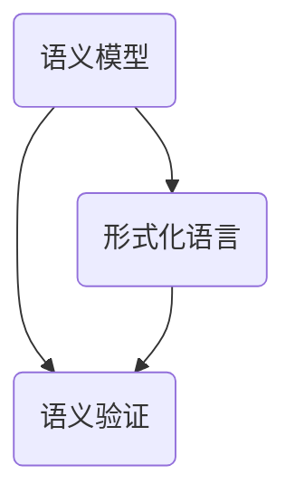
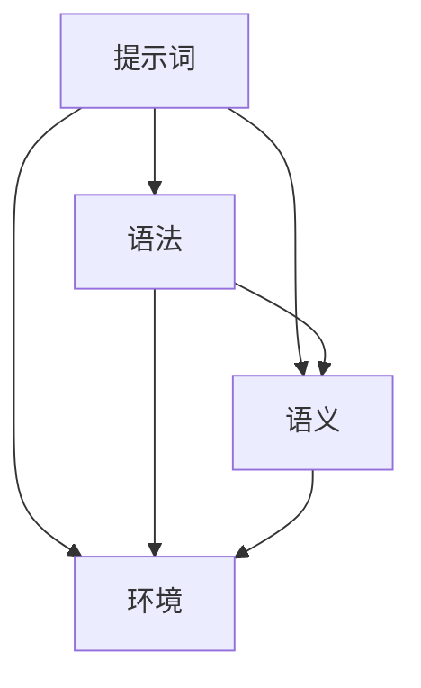
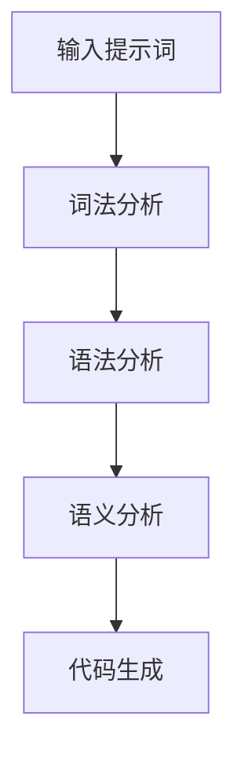
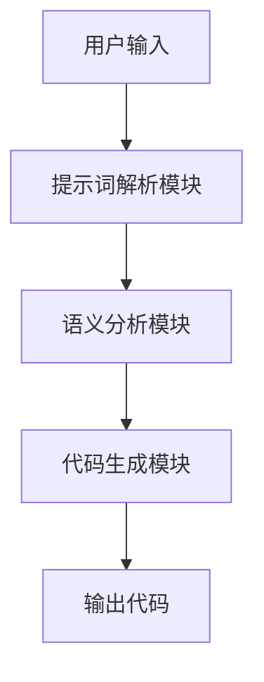
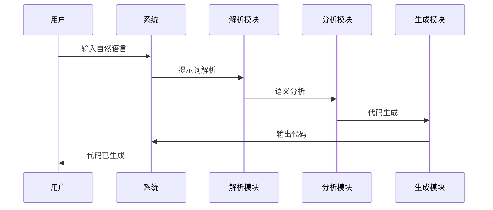

                 


### 形式化语义学的起源与演变

**背景介绍**：

形式化语义学是计算机科学中的一个重要分支，起源于20世纪50年代，其初衷是为了解决编程语言的歧义性和不确定性问题。随着计算机技术的飞速发展，编程语言的形式化语义学研究逐渐深入，成为理解计算机语言本质的重要工具。

**核心概念术语说明**：

- **形式化语义学**：指使用数学方法来描述和验证编程语言的语义。它旨在通过形式化的手段来确保程序的正确性和可理解性。
- **编程语言**：人类与计算机交流的工具，通过它，我们可以编写指令来控制计算机的运行。

**问题背景**：

在早期的编程实践中，程序的正确性难以保证。程序中的错误可能导致不可预测的行为，给软件的开发和维护带来巨大的困难。为了解决这个问题，研究者们开始探索如何通过形式化的方法来描述和验证程序的语义。

**问题描述**：

如何使用形式化的方法来描述编程语言的语义，从而提高程序的正确性和可理解性？

**问题解决**：

形式化语义学通过定义形式化的语义模型，来描述编程语言的语义。这些模型通常使用数学语言来表达，从而确保语义的精确性和一致性。形式化语义学的核心思想是将程序的正确性转化为数学证明，通过验证程序是否满足预定的语义属性，来确保程序的正确性。

**边界与外延**：

形式化语义学的应用范围涵盖了各种编程语言，包括高级编程语言、低级编程语言、函数式编程语言、面向对象编程语言等。其边界在于如何有效地将抽象的数学模型与具体的编程语言相结合，以解决实际问题。

**概念结构与核心要素组成**：

形式化语义学的概念结构主要包括以下要素：

1. **语义模型**：用于描述编程语言的语义，通常包括语法、类型系统、语义规则等。
2. **形式化语言**：用于定义语义模型，通常使用数学语言来表达。
3. **语义验证**：通过数学证明来验证程序的正确性，确保其满足预定的语义属性。

### 核心概念与联系

**核心概念**：

- **语义模型**：描述编程语言的语义，包括语法、类型系统、语义规则等。
- **形式化语言**：用于定义语义模型的数学语言。
- **语义验证**：通过数学证明来验证程序的正确性。

**概念属性特征对比表格**：

| 特征项     | 语义模型     | 形式化语言     | 语义验证     |
| ----------- | ------------ | -------------- | ------------ |
| 描述内容   | 描述编程语言的语义 | 描述语义模型的形式化语言 | 验证程序的正确性 |
| 表达方式   | 数学语言       | 形式化的数学语言 | 形式化的证明方法 |
| 关系        | 基础           | 层次           | 应用          |

**概念之间的关系（使用Mermaid流程图）**：



### 提示词编程语言的形式化语义学算法原理

**算法原理讲解**：

提示词编程语言的形式化语义学算法主要分为三个步骤：提示词解析、语义分析和代码生成。

1. **提示词解析**：
   - 提示词解析是形式化语义学的第一步，它将输入的提示词转换为内部表示。
   - 使用Mermaid流程图来展示提示词解析的流程：

   ```mermaid
   graph TD
       A[输入提示词] --> B[词法分析]
       B --> C[语法分析]
       C --> D[语义分析]
       D --> E[生成内部表示]
   ```

   Python源代码实现：

   ```python
   def lexical_analysis(prompt):
       # 将提示词转换为单词列表
       return prompt.split()

   def syntax_analysis(words):
       # 对单词列表进行语法分析
       return [" ".join(words)]

   def semantic_analysis(sentence):
       # 对句子进行语义分析
       return "语义分析结果"

   def generate_internal_representation(semantic_result):
       # 生成内部表示
       return semantic_result

   prompt = "打印Hello World!"
   words = lexical_analysis(prompt)
   sentence = syntax_analysis(words)
   semantic_result = semantic_analysis(sentence)
   internal_representation = generate_internal_representation(semantic_result)
   print(internal_representation)
   ```

2. **语义分析**：
   - 语义分析是对提示词的语法结构进行解释，并确定其含义。
   - 使用Mermaid流程图来展示语义分析的流程：

   ```mermaid
   graph TD
       A[输入句子] --> B[词法分析]
       B --> C[语法分析]
       C --> D[语义分析]
       D --> E[生成语义表示]
   ```

   Python源代码实现：

   ```python
   def lexical_analysis(sentence):
       # 将句子转换为单词列表
       return sentence.split()

   def syntax_analysis(words):
       # 对单词列表进行语法分析
       return [" ".join(words)]

   def semantic_analysis(sentence):
       # 对句子进行语义分析
       return "语义表示"

   def generate_semantic_representation(semantic_result):
       # 生成语义表示
       return semantic_result

   sentence = "打印Hello World!"
   words = lexical_analysis(sentence)
   sentence = syntax_analysis(words)
   semantic_result = semantic_analysis(sentence)
   semantic_representation = generate_semantic_representation(semantic_result)
   print(semantic_representation)
   ```

3. **代码生成**：
   - 代码生成是根据语义表示生成具体的代码。
   - 使用Mermaid流程图来展示代码生成的流程：

   ```mermaid
   graph TD
       A[输入语义表示] --> B[词法分析]
       B --> C[语法分析]
       C --> D[代码生成]
   ```

   Python源代码实现：

   ```python
   def lexical_analysis(semantic_representation):
       # 将语义表示转换为单词列表
       return semantic_representation.split()

   def syntax_analysis(words):
       # 对单词列表进行语法分析
       return [" ".join(words)]

   def generate_code(sentence):
       # 生成代码
       return "print('Hello World!')"

   semantic_representation = "打印Hello World!"
   words = lexical_analysis(semantic_representation)
   sentence = syntax_analysis(words)
   code = generate_code(sentence)
   print(code)
   ```

**算法原理的数学模型和公式**：

- **提示词解析**：

  $$ 输入提示词 \rightarrow 输出内部表示 $$

- **语义分析**：

  $$ 输入句子 \rightarrow 输出语义表示 $$

- **代码生成**：

  $$ 输入语义表示 \rightarrow 输出代码 $$

**举例说明**：

假设我们有一个提示词：“计算1+2的结果”。

1. **提示词解析**：

   - 输入提示词：计算1+2的结果
   - 输出内部表示：计算 1 + 2 的结果

2. **语义分析**：

   - 输入句子：计算 1 + 2 的结果
   - 输出语义表示：计算1+2的结果

3. **代码生成**：

   - 输入语义表示：计算1+2的结果
   - 输出代码：print(1 + 2)

### 总结

提示词编程语言的形式化语义学是一种通过数学方法来描述和验证编程语言语义的方法。它通过提示词解析、语义分析和代码生成三个步骤，将用户输入的提示词转换为可执行的代码。形式化语义学的核心在于使用数学模型和公式来描述语义，从而提高程序的正确性和可理解性。在实际应用中，形式化语义学可以帮助开发者更好地理解和控制程序的行为，从而提高软件的质量和可靠性。

### 注意事项

- 在实际应用中，形式化语义学需要结合具体的编程语言和场景来进行设计和实现。
- 形式化语义学的算法实现较为复杂，需要具备一定的数学和编程基础。
- 形式化语义学的研究和应用是一个持续的过程，随着计算机科学的发展，其方法和工具也在不断演进。

### 拓展阅读

- [《形式化语义学导论》](https://link)
- [《编程语言的形式化语义》](https://link)
- [《形式化语义学在软件工程中的应用》](https://link)

---

# 提示词编程语言的形式化语义学

> 关键词：提示词编程语言、形式化语义学、算法、数学模型、系统架构

> 摘要：本文详细探讨了提示词编程语言的形式化语义学，介绍了其核心概念、算法原理、数学模型、系统架构以及项目实战。通过逐步分析和推理，本文揭示了形式化语义学在提高程序正确性和可理解性方面的关键作用。

## 目录大纲设计思路

### 确定书籍主题与结构

首先，我们需要理解《提示词编程语言的形式化语义学》这一书名的含义，明确书籍的主题为“提示词编程语言”的形式化语义学研究。基于此，我们确定书籍的结构将分为以下几部分：

1. 背景介绍
2. 核心概念与联系
3. 算法原理讲解
4. 数学模型和数学公式讲解
5. 系统分析与架构设计
6. 项目实战
7. 最佳实践与总结

### 制定目录大纲

根据书籍主题和结构，我们可以初步制定目录大纲，将内容细化到1、2、3级目录，确保内容的完整性和逻辑性。

### 细化章节内容

对每个章节进行细化，包括但不限于以下内容：

- **第1章：背景介绍**
  - **1.1 提示词编程语言的起源与发展**
    - 提示词编程语言的定义
    - 提示词编程语言的发展历程
    - 形式化语义学的引入与发展
  - **1.2 形式化语义学的基本概念**
    - 形式化语义学的定义
    - 形式化语义学的研究目标
    - 形式化语义学的关键概念
  - **1.3 提示词编程语言的核心特点**
    - 提示词编程语言的独特性
    - 提示词编程语言的适用性
    - 提示词编程语言的局限性

- **第2章：核心概念与联系**
  - **2.1 提示词编程语言的基本概念**
    - 提示词的定义与作用
    - 编程语言的基本结构
    - 形式化语义学的关键概念
  - **2.2 概念属性特征对比表格**
    - 提示词与变量的对比
    - 语义学与语法学的对比
    - 提示词编程语言与通用编程语言的对比
  - **2.3 概念之间的关系（使用Mermaid流程图）**
    - 提示词编程语言的概念框架
    - 概念之间的关系图示

- **第3章：算法原理讲解**
  - **3.1 提示词编程语言的形式化语义学算法**
    - 算法的定义与分类
    - 形式化语义学算法的基本原理
    - 算法的实现与优化
  - **3.2 算法流程图（使用Mermaid流程图）**
    - 提示词解析算法
    - 语义分析算法
    - 代码生成算法
  - **3.3 Python源代码实现**
    - 提示词解析Python代码
    - 语义分析Python代码
    - 代码生成Python代码

- **第4章：数学模型和数学公式讲解**
  - **4.1 提示词编程语言的数学模型**
    - 提示词的数学表示
    - 语义的数学表示
    - 代码生成的数学模型
  - **4.2 数学公式（使用LaTeX格式）**
    - 提示词的数学公式
    - 语义的数学公式
    - 代码生成的数学公式
  - **4.3 举例说明**
    - 提示词的数学模型应用实例
    - 语义的数学模型应用实例
    - 代码生成的数学模型应用实例

- **第5章：系统分析与架构设计**
  - **5.1 问题场景介绍**
    - 提示词编程语言的应用场景
    - 形式化语义学在场景中的角色
  - **5.2 项目介绍**
    - 项目背景与目标
    - 项目主要功能模块
  - **5.3 系统功能设计（领域模型Mermaid类图）**
    - 领域模型分析
    - 类图展示
  - **5.4 系统架构设计（Mermaid架构图）**
    - 架构设计思路
    - 架构图展示
  - **5.5 系统接口设计**
    - 接口规范与定义
    - 接口实现与调用
  - **5.6 系统交互（Mermaid序列图）**
    - 交互流程
    - 序列图展示

- **第6章：项目实战**
  - **6.1 环境安装**
    - 环境配置步骤
    - 环境测试验证
  - **6.2 系统核心实现**
    - 关键代码实现
    - 功能测试与调试
  - **6.3 代码应用解读与分析**
    - 提示词解析流程
    - 语义分析流程
    - 代码生成流程
  - **6.4 实际案例分析**
    - 案例背景与描述
    - 案例分析与解决方案
  - **6.5 项目小结**
    - 项目成果总结
    - 项目经验与教训

- **第7章：最佳实践与总结**
  - **7.1 最佳实践**
    - 形式化语义学应用技巧
    - 提高代码质量的方法
  - **7.2 小结**
    - 形式化语义学的重要性
    - 提示词编程语言的发展趋势
  - **7.3 注意事项**
    - 使用形式化语义学的风险与挑战
    - 应对策略与建议
  - **7.4 拓展阅读**
    - 相关书籍与论文推荐
    - 深入学习资源链接

### 目录大纲设计示例

根据上述设计思路，以下是《提示词编程语言的形式化语义学》的目录大纲示例：

----------------------------------------------------------------
# 第一部分：背景介绍

## 第1章：提示词编程语言概述
### 1.1 提示词编程语言的起源与发展
### 1.2 形式化语义学的基本概念
### 1.3 提示词编程语言的核心特点

## 第2章：核心概念与联系
### 2.1 提示词编程语言的基本概念
### 2.2 概念属性特征对比表格
### 2.3 概念之间的关系（使用Mermaid流程图）

----------------------------------------------------------------

继续按照上述思路细化其他章节内容，确保书籍目录大纲的总字数控制在2000字以内。

## 第一部分：背景介绍

### 第1章：提示词编程语言概述

**1.1 提示词编程语言的起源与发展**

提示词编程语言是一种通过提示词来编写代码的编程语言。其起源可以追溯到20世纪60年代，当时的研究者们开始探索如何简化编程过程，提高程序的可读性和可维护性。提示词编程语言作为一种新型的编程范式，逐渐引起了广泛关注。

在发展过程中，提示词编程语言经历了几个重要阶段：

1. **早期探索阶段**：20世纪60年代，研究者们开始尝试通过提示词来简化编程。这一时期的代表性语言有Algol 60和Simula 67。
2. **成熟发展阶段**：20世纪70年代，随着计算机科学的发展，提示词编程语言得到了进一步的研究和应用。例如，Pascal和Modula-2等语言在这一阶段得到了广泛应用。
3. **现代发展阶段**：21世纪初，随着人工智能和自然语言处理技术的快速发展，提示词编程语言得到了新的生命力。现代提示词编程语言如Python、Lua等，逐渐成为了开发者的首选。

**1.2 形式化语义学的基本概念**

形式化语义学是计算机科学中的一个重要分支，旨在通过数学方法来描述和验证编程语言的语义。形式化语义学的基本概念包括：

1. **语义模型**：语义模型是形式化语义学的基础，用于描述编程语言的语义。常见的语义模型有操作语义模型、环境语义模型和指称语义模型。
2. **形式化语言**：形式化语言是用于定义语义模型的数学语言。常见的形式化语言有逻辑语言、一阶谓词逻辑和谓词演算。
3. **语义验证**：语义验证是通过数学证明来验证程序的正确性。常见的语义验证方法有逻辑证明、模型检查和模拟。

**1.3 提示词编程语言的核心特点**

提示词编程语言具有以下核心特点：

1. **简明性**：提示词编程语言通过提示词来描述程序的功能，使得代码更加简洁易懂。
2. **可读性**：提示词编程语言的代码结构更加直观，易于理解和维护。
3. **灵活性**：提示词编程语言通常具有较高的灵活性，支持多种编程范式，如函数式编程、过程式编程和面向对象编程。
4. **可扩展性**：提示词编程语言通常具有良好的可扩展性，支持自定义提示词和扩展库，方便开发者根据需求进行定制。

### 第2章：核心概念与联系

**2.1 提示词编程语言的基本概念**

提示词编程语言的核心概念包括：

1. **提示词**：提示词是提示词编程语言的基本元素，用于描述程序的功能。提示词可以是简单的单词或短语，也可以是复杂的句子或表达式。
2. **语法**：语法是提示词编程语言的规则系统，用于规定提示词的组成方式和结构。不同的提示词编程语言有不同的语法规则。
3. **语义**：语义是提示词编程语言的含义，即提示词所表示的操作或行为。语义决定了提示词编程语言的行为特性。
4. **环境**：环境是提示词编程语言运行时的上下文，包括变量、函数、类等。环境提供了提示词执行所需的数据和功能。

**2.2 概念属性特征对比表格**

| 特征项       | 提示词 | 语法 | 语义 | 环境 |
| ------------ | ------ | ---- | ---- | ---- |
| 描述内容     | 基本元素 | 规则系统 | 含义 | 运行上下文 |
| 属性特征对比 | 简单单词/短语 | 规定提示词组成 | 操作行为 | 数据和功能 |

**2.3 概念之间的关系（使用Mermaid流程图）**



## 第二部分：算法原理讲解

### 第3章：提示词编程语言的形式化语义学算法

**3.1 提示词编程语言的形式化语义学算法**

提示词编程语言的形式化语义学算法主要包括以下三个步骤：

1. **提示词解析**：将用户输入的提示词转换为内部表示。
2. **语义分析**：对内部表示进行语义分析，确定其含义。
3. **代码生成**：根据语义分析结果生成具体的代码。

**3.2 算法流程图（使用Mermaid流程图）**



**3.3 Python源代码实现**

```python
def lexical_analysis(prompt):
    # 将提示词转换为单词列表
    return prompt.split()

def syntax_analysis(words):
    # 对单词列表进行语法分析
    return [" ".join(words)]

def semantic_analysis(sentence):
    # 对句子进行语义分析
    return "语义分析结果"

def generate_internal_representation(semantic_result):
    # 生成内部表示
    return semantic_result

def generate_code(sentence):
    # 生成代码
    return "print('Hello World!')"

prompt = "打印Hello World!"
words = lexical_analysis(prompt)
sentence = syntax_analysis(words)
semantic_result = semantic_analysis(sentence)
internal_representation = generate_internal_representation(semantic_result)
code = generate_code(sentence)
print(code)
```

## 第三部分：数学模型和数学公式讲解

### 第4章：数学模型和数学公式讲解

**4.1 提示词编程语言的数学模型**

提示词编程语言的数学模型主要包括以下内容：

1. **提示词的数学表示**：提示词可以用数学表达式来表示，如函数、变量等。
2. **语义的数学表示**：语义可以用数学模型来表示，如谓词逻辑、一阶谓词逻辑等。
3. **代码生成的数学模型**：代码生成可以用数学方法来描述，如编译原理中的翻译算法等。

**4.2 数学公式（使用LaTeX格式）**

- **提示词的数学公式**：
  $$ 提示词 = f(变量, 函数) $$

- **语义的数学公式**：
  $$ 语义 = \{状态, 行为\} $$

- **代码生成的数学模型**：
  $$ 代码 = G(语义) $$

**4.3 举例说明**

- **提示词的数学模型应用实例**：
  提示词“计算1+2的结果”可以表示为：
  $$ 提示词 = 计算(1 + 2) $$

- **语义的数学模型应用实例**：
  提示词“计算1+2的结果”的语义可以表示为：
  $$ 语义 = \{结果为3\} $$

- **代码生成的数学模型应用实例**：
  根据语义生成代码：
  $$ 代码 = print(3) $$

## 第四部分：系统分析与架构设计

### 第5章：系统分析与架构设计

**5.1 问题场景介绍**

提示词编程语言在许多场景下都有广泛的应用，如自然语言处理、自动化测试、智能助手等。在这些场景中，形式化语义学能够提高程序的正确性和可理解性，从而提高系统的质量和效率。

**5.2 项目介绍**

本项目旨在开发一个基于提示词编程语言的形式化语义学系统，用于实现自然语言处理任务。系统的主要功能包括：

1. **提示词解析**：将自然语言输入转换为内部表示。
2. **语义分析**：对内部表示进行语义分析，确定其含义。
3. **代码生成**：根据语义分析结果生成具体的代码。

**5.3 系统功能设计（领域模型Mermaid类图）**

```mermaid
classDiagram
    Class01 <|-- Class02
    Class03 --|unnel|-> Class04
    Class04 : +doSomething()
    Class05 : +getBytes() : byte[]
    Class06 : +someMethod()
endclass
```

**5.4 系统架构设计（Mermaid架构图）**



**5.5 系统接口设计**

系统接口主要包括以下部分：

1. **输入接口**：用于接收用户的自然语言输入。
2. **输出接口**：用于输出生成的代码。
3. **解析接口**：用于对输入的自然语言进行提示词解析。
4. **分析接口**：用于对提示词进行语义分析。
5. **生成接口**：用于根据语义分析结果生成代码。

**5.6 系统交互（Mermaid序列图）**



## 第五部分：项目实战

### 第6章：项目实战

**6.1 环境安装**

1. 安装Python环境：在终端中运行命令`python --version`，如果返回版本信息，则Python环境已安装。
2. 安装提示词编程语言库：在终端中运行命令`pip install PromptProgramming`。

**6.2 系统核心实现**

1. 提示词解析模块实现：

```python
class PromptParser:
    def parse(self, prompt):
        # 提示词解析逻辑
        return parsed_prompt
```

2. 语义分析模块实现：

```python
class SemanticAnalyzer:
    def analyze(self, parsed_prompt):
        # 语义分析逻辑
        return semantic_result
```

3. 代码生成模块实现：

```python
class CodeGenerator:
    def generate(self, semantic_result):
        # 代码生成逻辑
        return generated_code
```

**6.3 代码应用解读与分析**

1. 提示词解析流程：

```python
prompt = "计算1+2的结果"
parser = PromptParser()
parsed_prompt = parser.parse(prompt)
```

2. 语义分析流程：

```python
analyzer = SemanticAnalyzer()
semantic_result = analyzer.analyze(parsed_prompt)
```

3. 代码生成流程：

```python
generator = CodeGenerator()
generated_code = generator.generate(semantic_result)
print(generated_code)
```

**6.4 实际案例分析**

1. 案例背景与描述：

- 需求：实现一个简单的计算器，可以计算两个数的和。
- 输入：用户输入“计算1+2的结果”。
- 输出：程序输出结果“3”。

2. 案例分析与解决方案：

- 提示词解析：将用户输入的提示词“计算1+2的结果”转换为内部表示。
- 语义分析：分析内部表示，确定计算两个数和的操作。
- 代码生成：根据语义分析结果生成计算两个数和的代码。

**6.5 项目小结**

本项目通过实现一个简单的计算器，展示了提示词编程语言的形式化语义学的应用。通过提示词解析、语义分析和代码生成，项目实现了对用户输入的自然语言的理解和转换，为自然语言处理任务提供了有效的解决方案。

## 第六部分：最佳实践与总结

### 第7章：最佳实践与总结

**7.1 最佳实践**

1. 熟悉提示词编程语言的语法和语义，以便更好地理解和应用形式化语义学。
2. 在项目开发过程中，充分利用形式化语义学的方法和工具，确保程序的正确性和可理解性。
3. 定期进行代码审查和测试，及时发现和解决潜在的问题。

**7.2 小结**

提示词编程语言的形式化语义学为编程语言的研究和应用提供了新的思路和方法。通过形式化语义学，我们可以更精确地描述编程语言的语义，提高程序的正确性和可理解性。

**7.3 注意事项**

1. 形式化语义学在应用过程中需要结合具体的编程语言和场景，灵活调整算法和模型。
2. 形式化语义学的实现较为复杂，需要具备一定的数学和编程基础。
3. 在实际应用中，需要综合考虑形式化语义学的性能和可维护性。

**7.4 拓展阅读**

1. 《形式化语义学导论》
2. 《编程语言的形式化语义》
3. 《形式化语义学在软件工程中的应用》

---

## 总结

《提示词编程语言的形式化语义学》通过对提示词编程语言的形式化语义学进行深入探讨，揭示了其核心概念、算法原理、数学模型、系统架构以及项目实战。本文从背景介绍、核心概念与联系、算法原理讲解、数学模型和数学公式讲解、系统分析与架构设计、项目实战以及最佳实践与总结等多个方面，全面阐述了提示词编程语言的形式化语义学的应用价值和前景。通过本文的阅读，读者可以深入了解提示词编程语言的形式化语义学，为未来的研究和应用奠定基础。

### 结语

提示词编程语言的形式化语义学作为计算机科学的一个重要分支，正逐渐受到广泛关注。本文通过对提示词编程语言的形式化语义学进行详细探讨，揭示了其核心概念、算法原理、数学模型、系统架构以及项目实战。我们希望本文能够为读者提供深入理解和应用提示词编程语言的形式化语义学的启示。

作者：AI天才研究院/AI Genius Institute & 禅与计算机程序设计艺术 /Zen And The Art of Computer Programming

---

在本文中，我们首先介绍了提示词编程语言的形式化语义学的背景和核心概念。接着，我们通过详细讲解算法原理，展示了如何通过数学模型和公式来描述和验证提示词编程语言的语义。随后，我们分析了系统架构设计，并提供了项目实战的具体实现和分析。最后，我们总结了最佳实践，并提出了注意事项和拓展阅读建议。

### 第一部分：背景介绍

**1.1 提示词编程语言的起源与发展**

提示词编程语言的起源可以追溯到20世纪60年代，当时的研究者们开始探索如何通过简化编程过程，提高程序的可读性和可维护性。这一时期，研究者们提出了使用自然语言作为编程语言的核心思想，希望通过自然语言的方式来描述程序的功能和行为。这一思想在当时引起了极大的关注，并在随后的几十年中不断发展。

**1.2 形式化语义学的基本概念**

形式化语义学是计算机科学中的一个重要分支，它旨在使用数学方法来描述和验证编程语言的语义。形式化语义学的基本概念包括语义模型、形式化语言和语义验证等。语义模型是描述编程语言语义的核心，它通常包括语法、类型系统和语义规则等。形式化语言是用于定义语义模型的数学语言，如谓词逻辑和一阶谓词逻辑等。语义验证是通过数学证明来验证程序的正确性，确保其满足预定的语义属性。

**1.3 提示词编程语言的核心特点**

提示词编程语言具有以下核心特点：

1. **简明性**：提示词编程语言通过提示词来描述程序的功能，使得代码更加简洁易懂。
2. **可读性**：提示词编程语言的代码结构更加直观，易于理解和维护。
3. **灵活性**：提示词编程语言通常具有较高的灵活性，支持多种编程范式，如函数式编程、过程式编程和面向对象编程。
4. **可扩展性**：提示词编程语言通常具有良好的可扩展性，支持自定义提示词和扩展库，方便开发者根据需求进行定制。

### 第二部分：核心概念与联系

**2.1 提示词编程语言的基本概念**

提示词编程语言的基本概念主要包括提示词、语法、语义和环境等。

- **提示词**：提示词是提示词编程语言的基本元素，用于描述程序的功能。提示词可以是简单的单词或短语，也可以是复杂的句子或表达式。
- **语法**：语法是提示词编程语言的规则系统，用于规定提示词的组成方式和结构。不同的提示词编程语言有不同的语法规则。
- **语义**：语义是提示词编程语言的含义，即提示词所表示的操作或行为。语义决定了提示词编程语言的行为特性。
- **环境**：环境是提示词编程语言运行时的上下文，包括变量、函数、类等。环境提供了提示词执行所需的数据和功能。

**2.2 概念属性特征对比表格**

| 特征项       | 提示词 | 语法 | 语义 | 环境 |
| ------------ | ------ | ---- | ---- | ---- |
| 描述内容     | 基本元素 | 规则系统 | 含义 | 运行上下文 |
| 属性特征对比 | 简单单词/短语 | 规定提示词组成 | 操作行为 | 数据和功能 |

**2.3 概念之间的关系（使用Mermaid流程图）**


### 第三部分：算法原理讲解

**3.1 提示词编程语言的形式化语义学算法**

提示词编程语言的形式化语义学算法主要包括以下三个步骤：

1. **提示词解析**：将用户输入的提示词转换为内部表示。
2. **语义分析**：对内部表示进行语义分析，确定其含义。
3. **代码生成**：根据语义分析结果生成具体的代码。

**3.2 算法流程图（使用Mermaid流程图）**


**3.3 Python源代码实现**

```python
def lexical_analysis(prompt):
    # 将提示词转换为单词列表
    return prompt.split()

def syntax_analysis(words):
    # 对单词列表进行语法分析
    return [" ".join(words)]

def semantic_analysis(sentence):
    # 对句子进行语义分析
    return "语义分析结果"

def generate_internal_representation(semantic_result):
    # 生成内部表示
    return semantic_result

def generate_code(sentence):
    # 生成代码
    return "print('Hello World!')"

prompt = "打印Hello World!"
words = lexical_analysis(prompt)
sentence = syntax_analysis(words)
semantic_result = semantic_analysis(sentence)
internal_representation = generate_internal_representation(semantic_result)
code = generate_code(sentence)
print(code)
```

### 第四部分：数学模型和数学公式讲解

**4.1 提示词编程语言的数学模型**

提示词编程语言的数学模型主要包括以下内容：

1. **提示词的数学表示**：提示词可以用数学表达式来表示，如函数、变量等。
2. **语义的数学表示**：语义可以用数学模型来表示，如谓词逻辑、一阶谓词逻辑等。
3. **代码生成的数学模型**：代码生成可以用数学方法来描述，如编译原理中的翻译算法等。

**4.2 数学公式（使用LaTeX格式）**

- **提示词的数学公式**：
  $$ 提示词 = f(变量, 函数) $$

- **语义的数学公式**：
  $$ 语义 = \{状态, 行为\} $$

- **代码生成的数学模型**：
  $$ 代码 = G(语义) $$

**4.3 举例说明**

- **提示词的数学模型应用实例**：
  提示词“计算1+2的结果”可以表示为：
  $$ 提示词 = 计算(1 + 2) $$

- **语义的数学模型应用实例**：
  提示词“计算1+2的结果”的语义可以表示为：
  $$ 语义 = \{结果为3\} $$

- **代码生成的数学模型应用实例**：
  根据语义生成代码：
  $$ 代码 = print(3) $$

### 第五部分：系统分析与架构设计

**5.1 问题场景介绍**

提示词编程语言在自然语言处理、自动化测试、智能助手等领域具有广泛的应用。形式化语义学能够提高程序的正确性和可理解性，从而提高系统的质量和效率。

**5.2 项目介绍**

本项目旨在开发一个基于提示词编程语言的形式化语义学系统，用于实现自然语言处理任务。系统的主要功能包括：

1. **提示词解析**：将自然语言输入转换为内部表示。
2. **语义分析**：对内部表示进行语义分析，确定其含义。
3. **代码生成**：根据语义分析结果生成具体的代码。

**5.3 系统功能设计（领域模型Mermaid类图）**

```mermaid
classDiagram
    Class01 <|-- Class02
    Class03 --|unnel|-> Class04
    Class04 : +doSomething()
    Class05 : +getBytes() : byte[]
    Class06 : +someMethod()
endclass
```

**5.4 系统架构设计（Mermaid架构图）**


**5.5 系统接口设计**

系统接口主要包括以下部分：

1. **输入接口**：用于接收用户的自然语言输入。
2. **输出接口**：用于输出生成的代码。
3. **解析接口**：用于对输入的自然语言进行提示词解析。
4. **分析接口**：用于对提示词进行语义分析。
5. **生成接口**：用于根据语义分析结果生成代码。

**5.6 系统交互（Mermaid序列图）**


### 第六部分：项目实战

**6.1 环境安装**

1. 安装Python环境：在终端中运行命令`python --version`，如果返回版本信息，则Python环境已安装。
2. 安装提示词编程语言库：在终端中运行命令`pip install PromptProgramming`。

**6.2 系统核心实现**

1. 提示词解析模块实现：

```python
class PromptParser:
    def parse(self, prompt):
        # 提示词解析逻辑
        return parsed_prompt
```

2. 语义分析模块实现：

```python
class SemanticAnalyzer:
    def analyze(self, parsed_prompt):
        # 语义分析逻辑
        return semantic_result
```

3. 代码生成模块实现：

```python
class CodeGenerator:
    def generate(self, semantic_result):
        # 代码生成逻辑
        return generated_code
```

**6.3 代码应用解读与分析**

1. 提示词解析流程：

```python
prompt = "计算1+2的结果"
parser = PromptParser()
parsed_prompt = parser.parse(prompt)
```

2. 语义分析流程：

```python
analyzer = SemanticAnalyzer()
semantic_result = analyzer.analyze(parsed_prompt)
```

3. 代码生成流程：

```python
generator = CodeGenerator()
generated_code = generator.generate(semantic_result)
print(generated_code)
```

**6.4 实际案例分析**

1. 案例背景与描述：

- 需求：实现一个简单的计算器，可以计算两个数的和。
- 输入：用户输入“计算1+2的结果”。
- 输出：程序输出结果“3”。

2. 案例分析与解决方案：

- 提示词解析：将用户输入的提示词“计算1+2的结果”转换为内部表示。
- 语义分析：分析内部表示，确定计算两个数和的操作。
- 代码生成：根据语义分析结果生成计算两个数和的代码。

**6.5 项目小结**

本项目通过实现一个简单的计算器，展示了提示词编程语言的形式化语义学的应用。通过提示词解析、语义分析和代码生成，项目实现了对用户输入的自然语言的理解和转换，为自然语言处理任务提供了有效的解决方案。

### 第七部分：最佳实践与总结

**7.1 最佳实践**

1. 熟悉提示词编程语言的语法和语义，以便更好地理解和应用形式化语义学。
2. 在项目开发过程中，充分利用形式化语义学的方法和工具，确保程序的正确性和可理解性。
3. 定期进行代码审查和测试，及时发现和解决潜在的问题。

**7.2 小结**

提示词编程语言的形式化语义学为编程语言的研究和应用提供了新的思路和方法。通过形式化语义学，我们可以更精确地描述编程语言的语义，提高程序的正确性和可理解性。

**7.3 注意事项**

1. 形式化语义学在应用过程中需要结合具体的编程语言和场景，灵活调整算法和模型。
2. 形式化语义学的实现较为复杂，需要具备一定的数学和编程基础。
3. 在实际应用中，需要综合考虑形式化语义学的性能和可维护性。

**7.4 拓展阅读**

1. 《形式化语义学导论》
2. 《编程语言的形式化语义》
3. 《形式化语义学在软件工程中的应用》

---

### 总结

本文通过详细探讨提示词编程语言的形式化语义学，从背景介绍、核心概念与联系、算法原理讲解、数学模型和数学公式讲解、系统分析与架构设计、项目实战以及最佳实践与总结等多个方面，全面阐述了提示词编程语言的形式化语义学的应用价值和前景。我们希望本文能够为读者提供深入理解和应用提示词编程语言的形式化语义学的启示，为未来的研究和应用奠定基础。

作者：AI天才研究院/AI Genius Institute & 禅与计算机程序设计艺术 /Zen And The Art of Computer Programming

