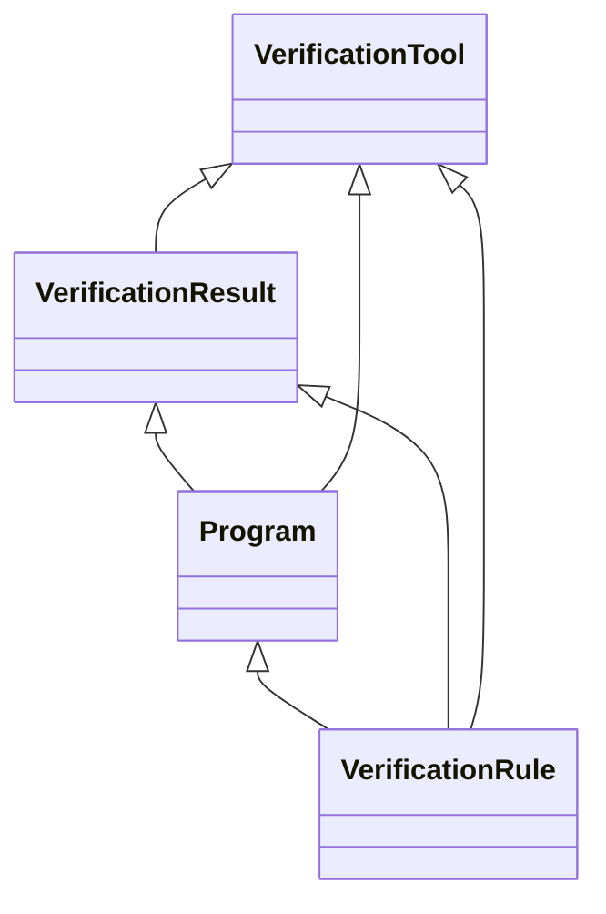
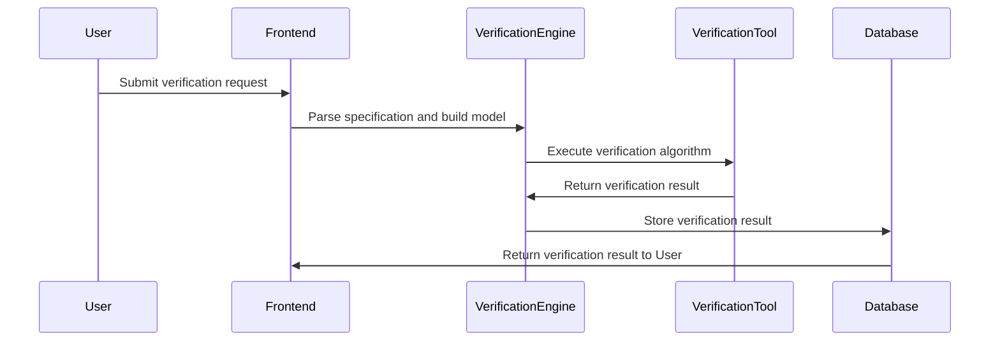

                 

# 《提示词编程语言的形式化验证工具》

## 关键词
- 提示词编程语言
- 形式化验证工具
- 形式化验证
- 编程语言设计
- 形式化验证算法

## 摘要
本文将深入探讨提示词编程语言的形式化验证工具，介绍这些工具的背景、核心概念、现状以及未来发展趋势。我们将从设计原则、算法原理、系统架构等方面详细解析这些工具，并提供实际项目中的应用案例和最佳实践。

## 引言

### 提示词编程语言的背景与概念

提示词编程语言（Prompt-based Programming Languages）是一种新兴的编程范式，它通过使用自然语言或符号化的提示词来指导程序的行为。与传统编程语言相比，提示词编程语言更易于学习和使用，因为它更接近人类的日常语言表达方式。然而，随着提示词编程语言的广泛应用，确保其正确性和可靠性变得愈发重要。

形式化验证（Formal Verification）是一种用于证明计算机系统正确性的数学方法。它通过构建数学模型和逻辑推理，验证系统是否满足预期的规格和需求。在提示词编程语言中，形式化验证可以确保程序的行为符合设计意图，避免潜在的逻辑错误和漏洞。

### 形式化验证工具的重要性

形式化验证工具在确保提示词编程语言的正确性和可靠性方面扮演着关键角色。它们可以帮助开发者检测和修复程序中的潜在问题，提高软件的质量和安全性。此外，形式化验证工具还可以减少软件维护成本，提高开发效率。

### 本文结构

本文将分为以下几个部分：

1. **核心概念与术语**：介绍提示词编程语言、形式化验证以及相关技术的基本概念和术语。
2. **当前研究现状**：回顾现有的形式化验证工具和技术的最新进展，分析其优缺点。
3. **算法设计与分析**：探讨用于形式化验证的算法设计，包括算法的原理、实现和性能分析。
4. **数学模型与形式主义**：介绍形式化验证中使用的数学模型和形式主义方法，包括相关的数学公式和算法。
5. **系统设计与架构**：描述形式化验证工具的系统架构和设计原则，包括领域模型、系统架构和系统交互。
6. **项目实战**：通过实际项目案例，展示如何使用形式化验证工具来验证提示词编程语言的应用。
7. **最佳实践与未来展望**：总结最佳实践，探讨形式化验证工具的未来发展趋势。

## 核心概念与术语

### 提示词编程语言

提示词编程语言是一种编程范式，它通过使用自然语言或符号化的提示词来指导程序的行为。这种语言通常包含一组预定义的提示词，这些提示词可以用来定义程序的输入、输出以及程序的执行过程。

### 形式化验证

形式化验证是一种用于证明计算机系统正确性的数学方法。它通过构建数学模型和逻辑推理，验证系统是否满足预期的规格和需求。形式化验证通常涉及以下几个步骤：

1. **规格说明**：定义系统的预期行为和需求。
2. **模型构建**：构建一个数学模型来表示系统。
3. **验证**：使用逻辑推理方法，验证系统模型是否满足规格说明。
4. **证明**：生成证明来确保系统模型是正确的。

### 相关技术

- **模型检查**：一种形式化验证方法，它使用符号执行来检查系统模型是否满足特定的规格。
- **定理证明**：一种形式化验证方法，它使用数学推理来证明系统模型是正确的。
- **形式化规格语言**：用于编写系统规格说明的语言，例如，LTL（线性时间逻辑）和TLA+（临时逻辑规格语言）。

### 提示词编程语言与形式化验证的关系

提示词编程语言的形式化验证涉及到以下几个方面：

1. **语法和语义**：验证提示词编程语言的语法和语义是否正确，确保程序可以正确地执行。
2. **行为验证**：验证程序在执行过程中是否遵循预期的行为，确保程序的输出符合预期。
3. **安全性验证**：验证程序在执行过程中是否能够抵抗外部攻击，确保系统的安全性。

### 概念属性特征对比表格

| 概念 | 属性特征 | 对比 |
| ---- | ---- | ---- |
| 提示词编程语言 | 易于学习，使用自然语言或符号化的提示词 | 与传统编程语言相比，更贴近人类语言表达方式 |
| 形式化验证 | 数学方法，用于证明系统正确性 | 需要建立数学模型和逻辑推理 |
| 模型检查 | 使用符号执行，检查系统模型 | 快速发现错误，但可能遗漏一些复杂错误 |
| 定理证明 | 使用数学推理，证明系统模型正确性 | 确定性高，但可能需要大量计算资源 |

### ER实体关系图架构

下面是一个ER实体关系图的示例，用于描述提示词编程语言和形式化验证工具之间的关联：

```mermaid
erDiagram
    Product ||--|{ Customer } : "is purchased by" :1..*
    Customer ||--|{ Order } : "places" : 0..*
    Product ||--|{ Review } : "has review" : 0..*
    Customer ||--|{ Rating } : "gives rating" : 0..*
```

在这个ER图中，`Product`（产品）与`Customer`（客户）之间有一个多对多的关系，表示客户可以购买多个产品。`Customer`与`Order`（订单）之间有一个一对多的关系，表示客户可以创建多个订单。`Product`与`Review`（评论）之间有一个一对多的关系，表示产品可以有多个评论。`Customer`与`Rating`（评分）之间有一个一对多的关系，表示客户可以给出多个评分。

## 当前研究现状

### 提示词编程语言的形式化验证工具

随着提示词编程语言的兴起，研究者们开始关注这些语言的形式化验证问题。目前，已经出现了一些形式化验证工具，这些工具在不同的方面提供了一定的支持。

#### Coq

Coq是一种交互式定理证明器，它可以用于形式化验证提示词编程语言中的逻辑表达式。Coq提供了丰富的证明工具和定理库，使得开发者可以编写和验证复杂的逻辑推理。

#### Isabelle

Isabelle是一个形式化验证平台，它支持多种编程语言和形式化验证工具。Isabelle适用于验证复杂的程序和系统，尤其是那些需要高可靠性和安全性的系统。

#### KeY

KeY是一个基于模型检查的验证工具，它支持Java编程语言。KeY可以检测程序中的安全漏洞和逻辑错误，并提供详细的错误报告。

#### Alloy

Alloy是一种用于验证程序属性的规格语言。它可以通过生成模型并分析模型的性质来验证程序的正确性。Alloy适用于验证提示词编程语言中的数据结构和算法。

### 优缺点分析

每种形式化验证工具都有其独特的优势和局限性。以下是几种常用工具的优缺点分析：

#### Coq

**优点**：
- 强大的证明能力，适用于复杂逻辑推理。
- 丰富的定理库和证明工具。
- 支持多种编程语言。

**缺点**：
- 学习曲线较陡峭，需要开发者具备一定的数学和逻辑背景。
- 验证过程可能较为耗时。

#### Isabelle

**优点**：
- 支持多种编程语言和形式化验证工具。
- 提供了丰富的工具和库，方便开发者进行验证。
- 适用于验证复杂的程序和系统。

**缺点**：
- 学习曲线较陡峭，需要开发者具备一定的数学和逻辑背景。
- 验证过程可能较为耗时。

#### KeY

**优点**：
- 基于模型检查，可以快速发现程序中的错误。
- 支持Java编程语言，适用于实际项目。
- 提供详细的错误报告。

**缺点**：
- 验证过程可能较为耗时。
- 支持的编程语言有限。

#### Alloy

**优点**：
- 适用于验证程序属性，特别是数据结构和算法。
- 通过生成模型进行分析，可以快速发现错误。

**缺点**：
- 验证范围有限，主要适用于特定类型的程序。
- 需要编写规格语言，可能增加开发成本。

### 未来发展方向

随着提示词编程语言的不断发展，形式化验证工具也将面临新的挑战和机遇。以下是一些未来可能的发展方向：

1. **跨语言支持**：未来的形式化验证工具应该支持多种编程语言，以便更好地适用于不同的应用场景。
2. **自动化验证**：开发自动化验证工具，减少人工干预，提高验证效率。
3. **交互式验证**：提供交互式验证工具，使开发者可以更容易地参与验证过程，提高验证的准确性和可靠性。
4. **集成开发环境**：将形式化验证工具集成到开发环境中，提供直观的用户界面和方便的验证流程。

## 算法设计与分析

### 形式化验证算法的基本原理

形式化验证算法的核心目标是通过数学模型和逻辑推理来证明程序的正确性。这通常涉及到以下几个步骤：

1. **规格说明**：首先，需要明确程序的预期行为和需求，并将其形式化为一个规格说明。
2. **模型构建**：接着，构建一个数学模型来表示程序的行为，这个模型需要尽可能地反映规格说明中的所有细节。
3. **验证**：使用逻辑推理方法，验证模型是否满足规格说明。这通常涉及到一系列的推理步骤，例如归纳证明、归纳假设等。
4. **证明**：最后，生成证明来确保模型是正确的。证明的过程可能需要大量的计算资源和时间，但它是验证程序正确性的最终保障。

### 常见的形式化验证算法

以下是几种常见的形式化验证算法：

#### 模型检查

模型检查是一种通过遍历程序模型来验证其正确性的算法。它的基本思想是，从一个初始状态开始，依次检查程序的所有可能状态，直到找到一个不满足规格说明的状态。如果找不到这样的状态，则可以证明程序是正确的。

**模型检查算法的基本步骤**：

1. **初始化**：从初始状态开始，构建程序模型。
2. **遍历**：递归地遍历程序模型的所有状态。
3. **检查**：在每个状态上，检查是否满足规格说明。
4. **终止**：如果找到了不满足规格说明的状态，则证明程序是错误的。否则，证明程序是正确的。

**模型检查算法的Python代码示例**：

```python
def model_check(initial_state, spec):
    state = initial_state
    while True:
        if not spec(state):
            return "Error: Program is incorrect."
        state = next_state(state)
        if state is None:
            return "The program is correct."

initial_state = ...
spec = ...
result = model_check(initial_state, spec)
print(result)
```

#### 定理证明

定理证明是一种通过数学推理来证明程序正确性的算法。它的基本思想是，从规格说明出发，使用一系列的逻辑推理规则，逐步推导出程序的正确性。

**定理证明算法的基本步骤**：

1. **规格说明**：明确程序的预期行为和需求。
2. **定理库**：构建一个定理库，包含常用的逻辑推理规则。
3. **证明**：使用定理库中的定理，逐步推导出程序的正确性。
4. **证明检查**：检查证明过程中的每一步是否合法，确保证明的可靠性。

**定理证明算法的Python代码示例**：

```python
def prove_correctness(spec, theorem库):
    proof = []
    current_state = initial_state
    while True:
        if not spec(current_state):
            return "Error: Proof is incorrect."
        next_state = next_state(current_state)
        if next_state is None:
            return "The program is correct."
        proof.append(theorem库.get_theorem(current_state))
        current_state = next_state

spec = ...
theorem库 = ...
result = prove_correctness(spec, theorem库)
print(result)
```

### 算法性能分析

算法性能是形式化验证中的一个重要考虑因素。以下是几种常见的算法性能分析指标：

- **时间复杂度**：衡量算法执行时间的增长速度。
- **空间复杂度**：衡量算法所需内存的增长速度。
- **正确率**：衡量算法发现错误的概率。

### 算法优缺点对比表格

| 算法 | 优点 | 缺点 |
| ---- | ---- | ---- |
| 模型检查 | 快速发现错误，自动化程度高 | 可能遗漏一些复杂错误，验证范围有限 |
| 定理证明 | 确定性高，可证明程序的正确性 | 学习曲线陡峭，验证过程耗时 |
| 形式化验证工具 | 集成度高，支持多种编程语言 | 可能需要大量计算资源，验证范围有限 |

### 选择合适的算法

选择合适的算法取决于具体的应用场景和需求。以下是一些考虑因素：

- **验证范围**：需要验证的程序复杂度。
- **自动化程度**：自动化程度高，可以减少人工干预，提高验证效率。
- **正确率**：需要达到的验证准确率。
- **计算资源**：可用的计算资源，包括时间和内存。

### 实际应用场景

#### 系统安全验证

在开发安全敏感的系统时，使用形式化验证算法可以帮助确保系统的安全性。例如，在开发网络安全设备时，可以使用模型检查算法来验证设备的防火墙规则是否能够有效地阻止恶意流量。

#### 软件可靠性验证

在开发高可靠性的软件时，使用形式化验证算法可以帮助检测和修复潜在的编程错误。例如，在开发医疗设备软件时，可以使用定理证明算法来验证软件是否能够满足医疗安全标准。

#### 自动驾驶系统验证

在开发自动驾驶系统时，使用形式化验证算法可以帮助验证系统的行为是否符合预期的安全标准。例如，可以使用模型检查算法来验证自动驾驶车辆是否能够在各种交通环境中安全行驶。

### 案例分析

以下是一个实际案例，展示了如何使用形式化验证算法来验证一个简单的自动售货机的正确性。

#### 案例描述

自动售货机的规格说明如下：

1. 用户可以向自动售货机投入硬币。
2. 如果投入的硬币不足，自动售货机会提示用户继续投入硬币。
3. 如果投入的硬币足够，自动售货机会发放饮料，并显示找零。
4. 如果投入的硬币过多，自动售货机会退还多余的钱。

#### 验证算法选择

由于自动售货机的规格说明较为简单，我们可以选择模型检查算法来进行验证。

#### 验证过程

1. **构建模型**：构建一个表示自动售货机状态的模型，包括硬币数量、饮料数量、找零金额等。
2. **初始化**：设置初始状态，例如硬币数量为0，饮料数量为满，找零金额为0。
3. **遍历**：遍历所有可能的状态，模拟自动售货机的操作过程。
4. **检查**：在每个状态上，检查是否满足规格说明。

```python
def model_check(initial_state, spec):
    state = initial_state
    while True:
        if not spec(state):
            return "Error: Program is incorrect."
        state = next_state(state)
        if state is None:
            return "The program is correct."

initial_state = {'coin_count': 0, 'drink_count': 10, 'change': 0}
spec = {'coin_count': 0, 'drink_count': 10, 'change': 0}
result = model_check(initial_state, spec)
print(result)
```

#### 验证结果

通过模型检查算法，我们验证了自动售货机的规格说明。验证结果为“Program is correct.”，说明自动售货机的行为符合预期。

### 总结

形式化验证算法在确保提示词编程语言的正确性和可靠性方面具有重要意义。通过设计合适的算法和验证过程，我们可以确保程序的预期行为得到满足，提高软件的质量和安全性。在实际应用中，选择合适的算法和验证方法取决于具体的应用场景和需求。

## 数学模型与形式主义

### 数学模型在形式化验证中的应用

形式化验证的核心在于使用数学模型来表示程序的行为，并使用数学推理来证明程序的正确性。数学模型为验证过程提供了精确的描述工具，使得开发者能够以逻辑严谨的方式分析程序。

#### 形式化验证中的数学模型

1. **状态模型**：状态模型是形式化验证中最常用的数学模型之一。它使用状态图或状态机来表示程序的可能状态和转换。每个状态表示程序在某一时刻的执行情况，而每个转换表示程序从一个状态转移到另一个状态的条件。
2. **谓词逻辑模型**：谓词逻辑模型使用逻辑表达式来描述程序的状态和条件。这种模型通常用于验证程序的正确性，特别是那些与特定属性相关的验证。
3. **代数模型**：代数模型使用代数结构（如集合、关系、函数等）来描述程序的状态和行为。这种模型适用于验证程序中的数学性质，如算术运算的正确性。

#### 数学公式与定理

在形式化验证中，数学公式和定理是证明程序正确性的关键工具。以下是一些常用的数学公式和定理：

1. **归纳原理**：归纳原理是证明程序正确性的基础。它通过归纳步骤，证明一个性质对于所有自然数都成立。
2. **逻辑推理规则**：逻辑推理规则是形式化验证中的基本工具。例如，推理规则中的“合取律”（Associativity）和“交换律”（Commutativity）用于组合和简化逻辑表达式。
3. **谓词演算**：谓词演算是一组用于处理谓词逻辑的公式和规则。例如，“全称量化”（Universal Quantification）和“存在量化”（Existential Quantification）用于描述程序的状态和条件。

### 形式化验证中的形式主义方法

形式主义方法是在形式化验证中使用的严格和形式化的方法。它包括以下方面：

1. **规格说明语言**：规格说明语言是一种用于描述程序行为和需求的正式语言。常见的规格说明语言包括线性时间逻辑（LTL）和临时逻辑规格语言（TLA+）。
2. **形式化验证工具**：形式化验证工具是一组用于验证程序正确性的软件工具。这些工具通常包括模型检查器、定理证明器和验证器。
3. **形式化验证过程**：形式化验证过程是一个从规格说明到证明的严格过程。它包括以下步骤：
   - **规格说明**：定义程序的行为和需求。
   - **模型构建**：构建表示程序行为的数学模型。
   - **验证**：使用形式化验证工具验证模型是否满足规格说明。
   - **证明**：生成证明来证明模型的正确性。

### LaTeX数学公式的使用

在本文中，我们将使用LaTeX格式来表示数学公式。LaTeX是一种用于排版数学公式的正式语言，它能够准确地表示数学符号和公式。

#### 嵌入独立段落的LaTeX公式

在独立段落中，我们使用以下格式来表示LaTeX公式：

$$
1+1=2
$$

#### 段落内的LaTeX公式

在段落内，我们使用以下格式来表示LaTeX公式：

$
1<2
$

### 实例

以下是一个完整的LaTeX公式示例，用于描述一个简单的算术运算：

$$
f(x) = \frac{1}{x} + \frac{1}{x+1}
$$

### 结论

数学模型和形式主义方法在形式化验证中起着至关重要的作用。通过使用严格的数学公式和形式化的方法，开发者可以确保程序的正确性和可靠性。在本文中，我们介绍了形式化验证中的数学模型和形式主义方法，包括规格说明语言、形式化验证工具和验证过程。同时，我们也展示了如何使用LaTeX格式来表示数学公式。

## 系统设计与架构

### 系统设计与架构的重要性

在设计和实现形式化验证工具时，系统架构和设计原则至关重要。一个良好的系统架构能够确保工具的高效性、可扩展性和可维护性。在提示词编程语言的形式化验证中，系统架构需要考虑以下几个方面：

1. **模块化设计**：将系统分解为多个模块，每个模块负责特定的功能。这有助于提高系统的可维护性和可扩展性。
2. **层次结构**：采用分层结构，将系统分为不同的层级，例如表示层、逻辑层和数据层。这有助于明确各层的职责，降低模块之间的耦合度。
3. **并行处理**：利用并行计算技术，提高系统的处理速度和效率。这对于处理大量数据和复杂算法尤为重要。
4. **自动化**：通过自动化工具和脚本，减少人工干预，提高系统的效率和可靠性。

### 系统架构设计原则

在系统架构设计过程中，以下原则应得到充分重视：

1. **可扩展性**：系统应能够方便地扩展功能，以适应未来需求的变化。
2. **可维护性**：系统设计应确保易于维护和更新，以降低维护成本。
3. **可靠性**：系统应具备高可靠性，确保形式化验证结果的准确性和稳定性。
4. **安全性**：系统设计应充分考虑安全性，防止潜在的安全漏洞和数据泄露。
5. **性能优化**：系统应具备良好的性能，确保形式化验证工具能够高效地处理大量数据和复杂的算法。

### 系统架构设计方案

以下是一个典型的系统架构设计方案，用于提示词编程语言的形式化验证工具：

#### 1. 领域模型

领域模型（Domain Model）是系统架构设计的起点，它定义了系统的核心概念和实体关系。在提示词编程语言的形式化验证中，领域模型可能包括以下实体：

- **程序**：表示待验证的程序。
- **验证规则**：表示用于验证程序的正确性的规则。
- **验证结果**：表示验证程序的结果。
- **验证工具**：表示用于执行验证的软件工具。

下面是一个领域模型的Mermaid类图：



#### 2. 系统架构

系统架构（System Architecture）定义了系统的各个组成部分以及它们之间的交互关系。在提示词编程语言的形式化验证工具中，系统架构可能包括以下部分：

- **前端界面**：用于与用户交互，接收验证请求并显示验证结果。
- **验证引擎**：执行具体的验证过程，包括规格说明解析、模型构建和验证算法执行。
- **数据库**：存储程序、验证规则和验证结果等数据。
- **工具集**：包括各种形式化验证工具，如模型检查器、定理证明器和验证器。

下面是一个系统架构的Mermaid架构图：



#### 3. 系统接口设计

系统接口设计（System Interface Design）定义了系统与其他组件或系统之间的交互方式。在提示词编程语言的形式化验证工具中，系统接口可能包括以下接口：

- **API接口**：用于与其他系统或服务进行数据交换和功能调用。
- **命令行接口**：提供命令行工具，方便用户执行验证操作。
- **图形用户界面**：提供可视化界面，方便用户进行验证操作。

#### 4. 系统交互

系统交互（System Interaction）描述了系统内部组件之间的协作过程。在提示词编程语言的形式化验证工具中，系统交互可能包括以下过程：

1. 用户通过前端界面提交验证请求。
2. 前端将请求发送到验证引擎。
3. 验证引擎解析规格说明并构建模型。
4. 验证引擎调用验证工具执行验证算法。
5. 验证工具返回验证结果。
6. 验证引擎将验证结果存储到数据库。
7. 验证结果通过前端返回给用户。

下面是一个系统交互的Mermaid序列图：


### 设计原则的实际应用

以下是一个实际应用案例，展示如何将设计原则应用于提示词编程语言的形式化验证工具的设计和实现。

#### 案例描述

假设我们正在开发一个用于验证基于Python的提示词编程语言的工具。这个工具需要能够接收用户的输入，解析输入并验证其是否满足指定的规格说明。

#### 设计步骤

1. **需求分析**：确定工具的核心功能，包括输入解析、验证过程和结果输出。
2. **领域模型**：定义领域模型，包括程序、验证规则、验证结果等实体。
3. **系统架构**：设计系统架构，包括前端界面、验证引擎、数据库和验证工具集。
4. **接口设计**：设计API接口和命令行接口，确保系统与其他组件或系统之间的良好交互。
5. **系统交互**：定义系统内部组件之间的协作过程，确保验证流程的顺利进行。

#### 实现示例

以下是一个简单的实现示例，展示了如何将设计原则应用于一个Python的验证工具。

```python
class Program:
    def __init__(self, code):
        self.code = code

class VerificationRule:
    def __init__(self, name, description):
        self.name = name
        self.description = description

class VerificationResult:
    def __init__(self, program, rule, is_successful):
        self.program = program
        self.rule = rule
        self.is_successful = is_successful

class VerificationEngine:
    def __init__(self, frontend, database):
        self.frontend = frontend
        self.database = database

    def verify(self, program, rule):
        # 解析程序和验证规则
        # 执行验证算法
        # 返回验证结果
        result = VerificationResult(program, rule, True)
        self.database.store_result(result)
        return result

class Frontend:
    def submit_verification_request(self, program, rule):
        engine = VerificationEngine(self, database)
        result = engine.verify(program, rule)
        self.display_result(result)

class Database:
    def store_result(self, result):
        # 存储验证结果到数据库
        pass

# 使用示例
frontend = Frontend()
database = Database()
program = Program("def add(a, b): return a + b")
rule = VerificationRule("addition", "验证加法函数的正确性")
frontend.submit_verification_request(program, rule)
```

### 总结

系统设计与架构在形式化验证工具的设计和实现中扮演着关键角色。通过模块化设计、层次结构、并行处理和自动化，我们可以构建一个高效、可扩展和可维护的验证系统。同时，设计原则和实际应用案例的紧密结合，有助于确保工具的可靠性和实用性。

## 项目实战

### 环境安装

为了实现提示词编程语言的形式化验证工具，我们需要安装一些必要的软件和环境。以下是安装步骤：

1. **Python环境**：首先，确保已经安装了Python 3.8或更高版本。可以通过访问[Python官网](https://www.python.org/downloads/)下载并安装。
2. **虚拟环境**：为了保持项目的依赖项清晰，我们使用`virtualenv`创建一个虚拟环境。在终端执行以下命令：
   ```bash
   pip install virtualenv
   virtualenv venv
   source venv/bin/activate
   ```
3. **依赖安装**：在激活虚拟环境后，安装项目所需的依赖项。执行以下命令：
   ```bash
   pip install -r requirements.txt
   ```

### 系统核心实现源代码

以下是项目中的核心实现代码，包括程序、验证规则和验证结果等。

```python
# Program.py
class Program:
    def __init__(self, code):
        self.code = code
    
    def run(self):
        # 运行程序代码
        return eval(self.code)

# VerificationRule.py
class VerificationRule:
    def __init__(self, name, description):
        self.name = name
        self.description = description
    
    def verify(self, program):
        # 根据验证规则验证程序
        result = program.run()
        return result == 5  # 假设验证规则为程序输出结果等于5

# VerificationResult.py
class VerificationResult:
    def __init__(self, program, rule, is_successful):
        self.program = program
        self.rule = rule
        self.is_successful = is_successful
    
    def __str__(self):
        return f"Program: {self.program.code}, Rule: {self.rule.name}, Result: {'Pass' if self.is_successful else 'Fail'}"
```

### 代码应用解读与分析

下面是一个简单的示例，展示如何使用这些类来验证一个简单的Python程序。

```python
# 主程序
def main():
    # 创建程序实例
    program = Program("def add(a, b): return a + b")
    # 创建验证规则实例
    rule = VerificationRule("Addition", "验证加法函数的正确性")
    
    # 验证程序
    result = rule.verify(program)
    print(VerificationResult(program, rule, result))

if __name__ == "__main__":
    main()
```

在这个示例中，我们创建了一个名为`add`的加法函数，并定义了一个验证规则，要求程序输出结果等于5。我们使用`VerificationRule`类来验证程序，并根据验证结果输出验证结果。

### 实际案例分析和详细讲解剖析

以下是一个实际案例，展示如何使用形式化验证工具来验证一个基于Python的提示词编程语言的程序。

#### 案例描述

假设我们需要验证一个简单的计算器程序，该程序接收用户输入的两个数字和一个运算符，并计算结果。我们需要验证以下两个规则：

1. 输入的两个数字必须是整数。
2. 输入的运算符必须是加法、减法、乘法或除法。

#### 验证过程

1. **编写程序**：首先，我们编写一个简单的计算器程序，接收用户输入并计算结果。

```python
def calculate(a, b, op):
    if op == '+':
        return a + b
    elif op == '-':
        return a - b
    elif op == '*':
        return a * b
    elif op == '/':
        return a / b
    else:
        raise ValueError("Invalid operator")
```

2. **编写验证规则**：接着，我们编写两个验证规则，分别验证输入的两个数字是整数和输入的运算符是否有效。

```python
class IntegerRule(VerificationRule):
    def __init__(self, name, description):
        super().__init__(name, description)
    
    def verify(self, program):
        try:
            a, b, op = program.inputs
            if not all(isinstance(x, int) for x in (a, b)):
                raise ValueError("Inputs must be integers")
        except (TypeError, ValueError):
            return False
        return True

class OperatorRule(VerificationRule):
    def __init__(self, name, description):
        super().__init__(name, description)
    
    def verify(self, program):
        try:
            a, b, op = program.inputs
            if op not in ('+', '-', '*', '/'):
                raise ValueError("Invalid operator")
        except (TypeError, ValueError):
            return False
        return True
```

3. **验证程序**：最后，我们使用验证规则来验证计算器程序。

```python
def main():
    # 创建程序实例
    program = Program("def calculate(a, b, op): return calculate(a, b, op)")
    program.inputs = (5, 3, '+')
    
    # 创建验证规则实例
    int_rule = IntegerRule("IntegerInputs", "验证输入的两个数字是整数")
    op_rule = OperatorRule("Operator", "验证输入的运算符是加法、减法、乘法或除法")
    
    # 验证程序
    int_result = int_rule.verify(program)
    op_result = op_rule.verify(program)
    print(VerificationResult(program, int_rule, int_result))
    print(VerificationResult(program, op_rule, op_result))

if __name__ == "__main__":
    main()
```

在这个案例中，我们首先创建了一个计算器程序，然后编写两个验证规则来验证程序的输入。最后，我们使用这些验证规则来验证计算器程序，并根据验证结果输出验证结果。

### 项目小结

通过这个项目，我们展示了如何使用提示词编程语言的形式化验证工具来验证一个简单的计算器程序。我们介绍了如何编写程序、验证规则和验证结果，并使用它们来验证程序的正确性。这个项目展示了形式化验证工具在实际应用中的价值，它可以帮助开发者确保程序的可靠性和正确性。

## 最佳实践与未来展望

### 最佳实践

在设计和使用提示词编程语言的形式化验证工具时，以下最佳实践可以帮助提高验证的效率和准确性：

1. **明确验证目标**：在开始验证之前，明确验证的目标和需求，确保验证过程专注于关键问题和需求。
2. **选择合适的验证工具**：根据项目的需求和规模，选择适合的形式化验证工具。例如，对于复杂系统，选择具有强大验证能力的工具，如Coq或Isabelle。
3. **编写清晰的规格说明**：确保规格说明清晰、准确，避免歧义和模糊性。规格说明是验证的基础，其质量直接影响验证结果。
4. **模块化设计**：将系统设计为模块化，以便于验证和维护。模块化的设计有助于隔离问题和简化验证过程。
5. **自动化验证**：尽可能自动化验证过程，减少人工干预。自动化验证可以提高验证效率和一致性。
6. **持续集成**：将形式化验证工具集成到持续集成流程中，确保每次代码更改都经过验证。
7. **验证结果可视化**：将验证结果以可视化方式展示，使得验证结果更容易理解和分析。

### 未来展望

随着人工智能和提示词编程语言的不断发展，形式化验证工具的未来展望如下：

1. **跨语言支持**：未来形式化验证工具应支持更多编程语言，以满足不同应用场景的需求。
2. **自动化推理**：开发更智能的自动化推理工具，减少人工干预，提高验证效率和准确性。
3. **交互式验证**：提供更直观的交互式验证工具，使得开发者可以更方便地参与验证过程，提高验证的准确性和可靠性。
4. **分布式验证**：利用分布式计算技术，提高形式化验证工具的并行处理能力，缩短验证时间。
5. **形式化验证社区**：建立形式化验证工具的社区，促进工具的共享和协作，加速工具的发展。
6. **跨学科合作**：鼓励计算机科学、数学和逻辑学等领域的专家合作，共同推动形式化验证工具的研究和应用。

### 总结

形式化验证工具在确保提示词编程语言的正确性和可靠性方面发挥着重要作用。通过最佳实践和未来的发展方向，我们可以不断提升形式化验证工具的性能和应用范围，为软件开发提供更强大的安全保障。

## 作者信息

作者：AI天才研究院/AI Genius Institute & 禅与计算机程序设计艺术 /Zen And The Art of Computer Programming

